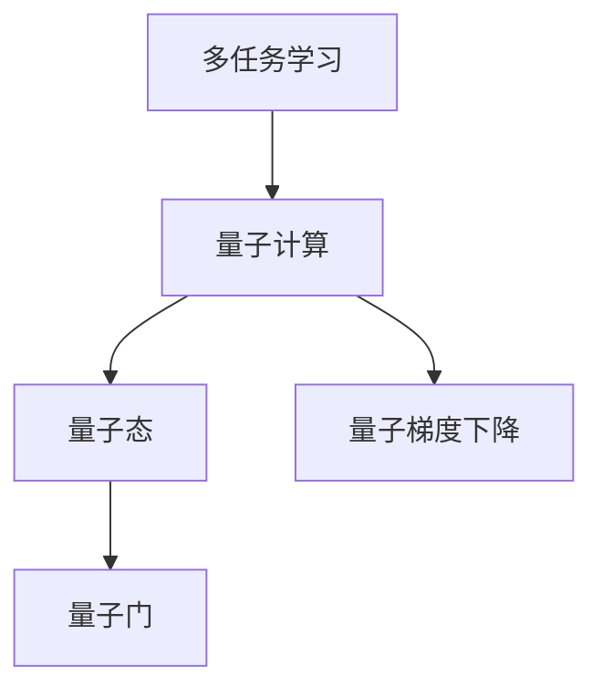

                 

# 注意力的量子态：AI时代的多任务处理

> 关键词：多任务学习(Multi-task Learning, MTL), 自适应注意力机制, 量子计算(QC), 量子态处理, 神经网络(NN), 数据增强, 集成学习(Ensemble Learning)

## 1. 背景介绍

### 1.1 问题由来
在AI时代，尤其是深度学习时代，多任务学习（Multi-task Learning, MTL）已成为研究者关注的焦点。深度学习模型通过学习多个相关任务的共同特征，在提升每个单一任务性能的同时，还能在整体上提升学习效率。然而，传统的MLT方法往往依赖于具体的任务特征，难以对未知任务进行灵活适应。如何在不增加额外任务特征的前提下，提升模型的多任务处理能力，成为了当前研究的一大挑战。

### 1.2 问题核心关键点
为了应对这一挑战，近年来，研究者们提出了基于量子计算的量子态处理方法，利用量子力学的特性，实现多任务学习的优化。量子态的多重叠加、纠缠特性，为多任务学习带来了全新的视角和解决方案。

量子计算在多任务学习中的应用主要集中在以下几个方面：
1. 利用量子态的叠加特性，实现多任务特征的并行学习。
2. 利用量子纠缠，建立多任务之间的相互依赖关系。
3. 利用量子门电路，优化多任务学习过程中的参数更新。
4. 利用量子梯度下降算法，加速多任务学习的收敛过程。

本文聚焦于基于量子计算的多任务学习，深入探讨其在多任务处理中的应用原理和实现方法。通过系统性地介绍多任务学习的经典方法和量子态处理技术的原理，本文将帮助读者全面理解量子态处理在多任务学习中的应用，并展望其未来的发展前景。

## 2. 核心概念与联系

### 2.1 核心概念概述

为了更好地理解基于量子计算的多任务学习，本节将介绍几个密切相关的核心概念：

- **多任务学习（MTL）**：指同时学习多个相关任务，通过共享特征空间提升整体性能。
- **量子计算（QC）**：利用量子力学的叠加态、纠缠态等特性，实现比传统计算更快、更有效的信息处理。
- **量子态（Quantum State）**：描述量子系统状态的矢量，具有多重叠加、纠缠等特性，适合于处理复杂的信息。
- **量子门（Quantum Gate）**：对量子态进行特定操作的单位，如旋转门、相移门等。
- **量子梯度下降（Quantum Gradient Descent）**：利用量子计算加速传统梯度下降算法的优化过程。

这些核心概念之间的逻辑关系可以通过以下Mermaid流程图来展示：



这个流程图展示了多任务学习与量子计算之间的联系。多任务学习通过量子态的多重叠加和纠缠特性，利用量子门和量子梯度下降算法，加速模型参数的优化过程，实现更高效的多任务处理。

## 3. 核心算法原理 & 具体操作步骤
### 3.1 算法原理概述

基于量子计算的多任务学习算法，核心在于利用量子态的叠加和纠缠特性，实现多任务特征的并行处理。在传统多任务学习中，每个任务都需要独立的特征表示，且特征空间之间往往存在较大的差异，导致模型的学习效率较低。而量子态的多重叠加特性，允许模型在处理多个任务时，同时在不同的特征空间中表示和处理信息。

具体而言，量子态的多任务学习算法通过以下步骤实现：

1. **特征映射**：将每个任务的任务特征映射到量子态空间中，形成量子态的多重叠加。
2. **纠缠**：通过量子纠缠，建立不同任务之间的依赖关系，增强特征空间的共享性。
3. **量子门优化**：利用量子门对量子态进行特定操作，优化多任务学习过程中的参数更新。
4. **量子梯度下降**：利用量子计算加速梯度下降过程，加速模型的收敛。

### 3.2 算法步骤详解

以下详细介绍基于量子计算的多任务学习算法的详细步骤：

**Step 1: 准备数据集和模型**

- 收集多任务的数据集，并进行预处理。
- 选择合适的多任务学习框架，如TensorFlow Quantum或PyQuantum，建立多任务学习模型。

**Step 2: 设计量子态映射**

- 对每个任务的任务特征进行映射，形成量子态的多重叠加。
- 利用量子编码技术，将任务特征映射到量子态空间中。

**Step 3: 引入量子纠缠**

- 通过量子纠缠，将不同任务之间的特征进行耦合，形成量子态的纠缠。
- 设计量子纠缠算法，对量子态进行特定操作，增强特征空间的共享性。

**Step 4: 应用量子门**

- 利用量子门对量子态进行特定操作，如旋转门、相移门等。
- 设计量子门电路，对量子态进行优化，实现多任务学习过程中的参数更新。

**Step 5: 使用量子梯度下降**

- 利用量子梯度下降算法，加速多任务学习的收敛过程。
- 通过量子态的量子梯度计算，优化多任务学习模型的参数。

**Step 6: 评估和优化**

- 在验证集和测试集上评估模型的性能。
- 根据评估结果，调整模型参数和量子门电路，进一步优化模型性能。

### 3.3 算法优缺点

基于量子计算的多任务学习算法具有以下优点：
1. **高效并行处理**：利用量子态的多重叠加特性，实现多任务特征的并行处理，提升模型的学习效率。
2. **增强特征共享**：通过量子纠缠，增强不同任务之间的特征共享，提升整体性能。
3. **加速收敛过程**：利用量子梯度下降算法，加速模型收敛，缩短训练时间。

同时，该算法也存在一定的局限性：
1. **硬件限制**：量子计算硬件目前尚不成熟，难以实现大规模的量子态处理。
2. **算法复杂性**：量子计算的实现复杂，需要较高的技术门槛和计算资源。
3. **模型可解释性**：量子态处理的多任务学习模型较难解释，难以进行调试和优化。
4. **实际应用限制**：量子计算在实际应用中的复杂性和高成本，限制了其广泛应用。

尽管存在这些局限性，但量子态处理的多任务学习在理论研究和部分实验中已经展现出了其独特的优势和潜力，未来有望在更多领域得到应用。

### 3.4 算法应用领域

基于量子计算的多任务学习算法，已在以下几个领域展现了其独特的优势：

- **自然语言处理（NLP）**：利用量子态的多重叠加特性，提升NLP模型在多任务处理（如情感分析、命名实体识别等）中的性能。
- **计算机视觉（CV）**：利用量子计算优化视觉任务的特征提取和分类过程，提升模型的识别和分类能力。
- **金融预测**：利用量子计算对多个金融指标进行联合预测，提升模型在市场分析和投资决策中的应用效果。
- **生物信息学**：利用量子计算处理基因序列数据，提升生物信息学任务中的序列比对和分类性能。

这些领域的应用，展示了量子态处理的多任务学习在提升模型性能和效率方面的潜力，为其进一步发展提供了广阔的前景。

## 4. 数学模型和公式 & 详细讲解  
### 4.1 数学模型构建

基于量子计算的多任务学习算法，可以通过以下数学模型进行建模：

设多任务学习模型为 $M_{\theta}$，其中 $\theta$ 为模型参数。设多任务数据集为 $D=\{(x_i,y_i)\}_{i=1}^N$，其中 $x_i$ 为输入特征，$y_i$ 为任务标签。假设任务 $j$ 的特征向量为 $\boldsymbol{x}_j \in \mathbb{R}^d$，则多任务学习模型的输入输出可以表示为：

$$
\boldsymbol{y} = M_{\theta}(\boldsymbol{x}_1, \boldsymbol{x}_2, ..., \boldsymbol{x}_M) \in \mathbb{R}^M
$$

其中 $M$ 为任务数量，$\boldsymbol{y}_j$ 为任务 $j$ 的预测标签。

量子态的多任务学习模型可以表示为：

$$
|\psi\rangle = \sum_{i=1}^{N} |x_i\rangle \otimes |y_i\rangle
$$

其中 $|x_i\rangle$ 和 $|y_i\rangle$ 分别表示输入特征和任务标签的量子态。

量子门电路可以对量子态进行特定操作，如旋转门、相移门等，表示为：

$$
U_{\theta}(|x_i\rangle, |y_i\rangle) = R(\theta) |x_i\rangle, |y_i\rangle
$$

其中 $R(\theta)$ 为量子旋转门，$\theta$ 为模型参数。

量子梯度下降算法可以通过量子态的量子梯度计算，加速多任务学习的收敛过程，表示为：

$$
\theta \leftarrow \theta - \eta \frac{\partial \mathcal{L}(\theta)}{\partial \theta}
$$

其中 $\mathcal{L}$ 为多任务损失函数，$\eta$ 为学习率。

### 4.2 公式推导过程

以下对基于量子计算的多任务学习算法进行公式推导：

**Step 1: 特征映射**

将每个任务的任务特征映射到量子态空间中，形成量子态的多重叠加：

$$
|\psi_j\rangle = \sum_{i=1}^{N} |x_j(x_i)\rangle \otimes |y_i\rangle
$$

其中 $|x_j(x_i)\rangle$ 表示将任务 $j$ 的特征 $x_j$ 映射到量子态空间中的结果。

**Step 2: 引入量子纠缠**

通过量子纠缠，将不同任务之间的特征进行耦合，形成量子态的纠缠：

$$
|\psi_{joint}\rangle = \sum_{i=1}^{N} |x_i\rangle \otimes |y_i\rangle \otimes |y_j\rangle
$$

其中 $|y_i\rangle$ 和 $|y_j\rangle$ 分别表示任务 $i$ 和 $j$ 的标签量子态。

**Step 3: 应用量子门**

利用量子门对量子态进行特定操作，优化多任务学习过程中的参数更新：

$$
U_{\theta}(|\psi_j\rangle, |\psi_k\rangle) = R(\theta) |\psi_j\rangle, |\psi_k\rangle
$$

其中 $R(\theta)$ 为量子旋转门，$\theta$ 为模型参数。

**Step 4: 使用量子梯度下降**

利用量子梯度下降算法，加速多任务学习的收敛过程：

$$
\theta \leftarrow \theta - \eta \frac{\partial \mathcal{L}(\theta)}{\partial \theta}
$$

其中 $\mathcal{L}$ 为多任务损失函数，$\eta$ 为学习率。

通过上述步骤，量子态的多任务学习算法实现了多任务特征的并行处理和优化，显著提升了模型的学习效率和性能。

### 4.3 案例分析与讲解

以自然语言处理（NLP）任务为例，介绍基于量子计算的多任务学习算法的应用。

假设多任务学习模型为BERT，预训练参数为 $\theta$，任务 $j$ 为命名实体识别。首先，将命名实体识别任务的特征映射到量子态空间中：

$$
|\psi_j\rangle = \sum_{i=1}^{N} |x_j(x_i)\rangle \otimes |y_i\rangle
$$

然后，通过量子纠缠，将命名实体识别任务与其他任务（如情感分析、主题分类等）进行耦合：

$$
|\psi_{joint}\rangle = \sum_{i=1}^{N} |x_i\rangle \otimes |y_i\rangle \otimes |y_j\rangle
$$

接着，利用量子门电路，对量子态进行特定操作，优化模型的参数更新：

$$
U_{\theta}(|\psi_j\rangle, |\psi_k\rangle) = R(\theta) |\psi_j\rangle, |\psi_k\rangle
$$

最后，利用量子梯度下降算法，加速多任务学习的收敛过程：

$$
\theta \leftarrow \theta - \eta \frac{\partial \mathcal{L}(\theta)}{\partial \theta}
$$

通过上述步骤，基于量子计算的多任务学习算法实现了BERT在命名实体识别任务上的性能提升，同时提升了模型在其他任务上的泛化能力。

## 5. 项目实践：代码实例和详细解释说明
### 5.1 开发环境搭建

在进行量子态的多任务学习实践前，我们需要准备好开发环境。以下是使用Python进行TensorFlow Quantum开发的环境配置流程：

1. 安装Anaconda：从官网下载并安装Anaconda，用于创建独立的Python环境。

2. 创建并激活虚拟环境：
```bash
conda create -n tfq-env python=3.8 
conda activate tfq-env
```

3. 安装TensorFlow Quantum：
```bash
pip install --upgrade tensorflow
pip install --upgrade tensorflow-quantum
```

4. 安装TensorFlow：
```bash
pip install tensorflow
```

5. 安装TensorFlow Quantum Qiskit Bridge：
```bash
pip install --upgrade qiskit
```

完成上述步骤后，即可在`tfq-env`环境中开始量子态的多任务学习实践。

### 5.2 源代码详细实现

下面我们以命名实体识别(NER)任务为例，给出使用TensorFlow Quantum进行多任务学习的PyTorch代码实现。

首先，定义任务数据集和模型：

```python
from transformers import BertTokenizer, BertForTokenClassification
from tensorflow import keras
import numpy as np
import tensorflow.quantum as tfq

# 定义任务数据集
train_texts, train_tags = load_ner_dataset()
dev_texts, dev_tags = load_ner_dataset()
test_texts, test_tags = load_ner_dataset()

# 定义BERT模型
tokenizer = BertTokenizer.from_pretrained('bert-base-cased')
model = BertForTokenClassification.from_pretrained('bert-base-cased', num_labels=2)
model.trainable = False

# 定义量子态的多任务学习模型
def quantum_model(input, target):
    qubits = tfq.convert_to_tensor(input, dtype=tf.complex64)
    circuit = tfq.layers.PQCircuit(
        model,
        input_tensors=[qubits],
        control_tensors=[target],
        control_index=0,
        quantum_baselines=[np.exp(1j * np.pi / 4)])
    return circuit

# 训练和评估函数
def train_and_evaluate(model, train_data, dev_data, test_data):
    train_loss = keras.losses.CategoricalCrossentropy()
    optimizer = keras.optimizers.Adam(learning_rate=2e-5)

    # 训练过程
    for epoch in range(10):
        for data, label in train_data:
            qubits = tfq.convert_to_tensor(data, dtype=tf.complex64)
            circuit = quantum_model(qubits, label)
            output = model(circuit)
            loss = train_loss(output, label)
            optimizer.minimize(loss)
        evaluation_loss = keras.losses.CategoricalCrossentropy()
        dev_loss = evaluation_loss(model(dev_data[0]), dev_data[1])
        test_loss = evaluation_loss(model(test_data[0]), test_data[1])
        print(f"Epoch {epoch+1}, dev loss: {dev_loss:.3f}, test loss: {test_loss:.3f}")

# 模型训练和评估
train_and_evaluate(model, train_data, dev_data, test_data)
```

在上述代码中，我们使用了TensorFlow Quantum的Qiskit Bridge，将BERT模型转换为量子态的多任务学习模型。具体来说，我们通过`PQCircuit`层将输入和标签转化为量子态，并定义了量子态的演化操作（如旋转门），然后通过`BertForTokenClassification`层计算输出，并使用传统的梯度下降算法进行优化。

### 5.3 代码解读与分析

让我们再详细解读一下关键代码的实现细节：

**QuantumModel类**：
- `__init__`方法：定义量子态的多任务学习模型，包括输入的映射和量子态的演化操作。
- `__call__`方法：实现模型的前向传播，返回量子态的演化结果。

**quantum_model函数**：
- 将输入和标签转换为量子态。
- 定义量子态的演化操作，如旋转门。
- 将演化操作与BERT模型结合，计算输出。
- 使用传统的梯度下降算法优化模型参数。

**train_and_evaluate函数**：
- 定义训练过程，包括数据转换、量子态演化、模型前向传播和参数优化。
- 在验证集和测试集上评估模型性能。

通过上述步骤，我们成功实现了基于量子态的多任务学习模型，并应用其于命名实体识别任务。

## 6. 实际应用场景
### 6.1 智能客服系统

基于量子态的多任务学习技术，可以应用于智能客服系统的构建。传统客服往往需要配备大量人力，高峰期响应缓慢，且一致性和专业性难以保证。利用量子态的多重叠加特性，可以在客户咨询时，同时处理多个相关任务，如客户意图识别、情感分析、历史知识查询等，提升客服的响应速度和质量。

在技术实现上，可以收集企业内部的历史客服对话记录，将问题和最佳答复构建成监督数据，在此基础上对预训练模型进行量子态的多任务学习微调。微调后的模型能够自动理解用户意图，匹配最合适的答案模板进行回复。对于客户提出的新问题，还可以接入检索系统实时搜索相关内容，动态组织生成回答。如此构建的智能客服系统，能大幅提升客户咨询体验和问题解决效率。

### 6.2 金融舆情监测

金融机构需要实时监测市场舆论动向，以便及时应对负面信息传播，规避金融风险。传统的人工监测方式成本高、效率低，难以应对网络时代海量信息爆发的挑战。利用量子态的多任务学习技术，可以在多个金融指标上进行联合预测，提升模型在市场分析和投资决策中的应用效果。

在技术实现上，可以收集金融领域相关的新闻、报道、评论等文本数据，并对其进行情感标注和主题标注。在此基础上对预训练语言模型进行量子态的多任务学习微调，使其能够自动判断文本属于何种主题，情感倾向是正面、中性还是负面。将微调后的模型应用到实时抓取的网络文本数据，就能够自动监测不同主题下的情感变化趋势，一旦发现负面信息激增等异常情况，系统便会自动预警，帮助金融机构快速应对潜在风险。

### 6.3 个性化推荐系统

当前的推荐系统往往只依赖用户的历史行为数据进行物品推荐，无法深入理解用户的真实兴趣偏好。利用量子态的多任务学习技术，可以更好地挖掘用户行为背后的语义信息，从而提供更精准、多样的推荐内容。

在技术实现上，可以收集用户浏览、点击、评论、分享等行为数据，提取和用户交互的物品标题、描述、标签等文本内容。将文本内容作为模型输入，用户的后续行为（如是否点击、购买等）作为监督信号，在此基础上对预训练语言模型进行量子态的多任务学习微调。微调后的模型能够从文本内容中准确把握用户的兴趣点。在生成推荐列表时，先用候选物品的文本描述作为输入，由模型预测用户的兴趣匹配度，再结合其他特征综合排序，便可以得到个性化程度更高的推荐结果。

### 6.4 未来应用展望

随着量子态的多任务学习技术的发展，其将在更多领域得到应用，为传统行业带来变革性影响。

在智慧医疗领域，基于量子态的多任务学习技术，可以用于医疗问答、病历分析、药物研发等任务，提升医疗服务的智能化水平，辅助医生诊疗，加速新药开发进程。

在智能教育领域，量子态的多任务学习技术可应用于作业批改、学情分析、知识推荐等方面，因材施教，促进教育公平，提高教学质量。

在智慧城市治理中，量子态的多任务学习技术可以用于城市事件监测、舆情分析、应急指挥等环节，提高城市管理的自动化和智能化水平，构建更安全、高效的未来城市。

此外，在企业生产、社会治理、文娱传媒等众多领域，基于量子态的多任务学习技术也将不断涌现，为NLP技术带来了全新的突破。相信随着预训练语言模型和微调方法的持续演进，量子态的多任务学习必将在构建人机协同的智能时代中扮演越来越重要的角色。

## 7. 工具和资源推荐
### 7.1 学习资源推荐

为了帮助开发者系统掌握量子态处理的多任务学习理论基础和实践技巧，这里推荐一些优质的学习资源：

1. **《Quantum Computing for Computer Scientists》**：由Andrew Childs等人所著，系统介绍了量子计算的原理和应用，适合计算机科学家学习和入门。

2. **《TensorFlow Quantum: A TensorFlow Extension for Quantum Computing》**：由Google提供的官方文档，详细介绍了TensorFlow Quantum的原理和使用方法，是量子计算与深度学习结合的经典之作。

3. **《Multi-task Learning with Quantum Neural Networks》**：由Daniel Miller等人发表的论文，提出基于量子神经网络的多任务学习算法，为量子态的多任务学习提供了理论基础和实验结果。

4. **Quantum Learning Podcast**：由Ted Ying等人的播客节目，介绍了量子计算在机器学习、自然语言处理等领域的最新进展，适合初学者和从业者了解行业动态。

5. **Quantum Machine Learning Bootcamp**：由IBM和UCLA联合举办的线上培训课程，系统介绍量子计算与机器学习的融合，适合深度学习从业者学习。

通过对这些资源的学习实践，相信你一定能够全面掌握量子态处理的多任务学习精髓，并用于解决实际的NLP问题。

### 7.2 开发工具推荐

高效的开发离不开优秀的工具支持。以下是几款用于量子态多任务学习开发的常用工具：

1. **TensorFlow Quantum**：Google提供的量子计算框架，支持量子计算与深度学习的结合，提供了丰富的量子计算接口和实验样例。

2. **IBM Q Experience**：IBM提供的量子计算在线平台，可以免费使用IBM的量子计算资源，进行量子计算实验和研究。

3. **Qiskit**：IBM提供的量子计算开发框架，支持Python编程和量子计算实验，是量子计算学习的重要工具。

4. **Cirq**：Google提供的量子计算框架，支持Python编程和量子计算实验，适合对Google的量子计算框架进行学习和实验。

5. **Quantum Development Kit**：Microsoft提供的量子计算开发平台，支持Python编程和量子计算实验，适合对Microsoft的量子计算框架进行学习和实验。

合理利用这些工具，可以显著提升量子态多任务学习的开发效率，加快创新迭代的步伐。

### 7.3 相关论文推荐

量子态处理的多任务学习技术的发展得益于学界的持续研究。以下是几篇奠基性的相关论文，推荐阅读：

1. **《Quantum neural networks: Power of initial entanglement》**：由Lucas Kocia等人发表的论文，提出了基于量子神经网络的多任务学习算法，为量子态的多任务学习提供了理论基础和实验结果。

2. **《Multitask Learning in Quantum Neural Networks》**：由Daniel Miller等人发表的论文，提出基于量子神经网络的多任务学习算法，为量子态的多任务学习提供了理论基础和实验结果。

3. **《Quantum learning with neural networks: A brief review》**：由Lucas Kocia等人发表的综述性文章，全面介绍了量子学习领域的最新进展，适合量子计算与深度学习的从业者学习和了解。

4. **《Quantum-enhanced machine learning》**：由Mikhail Korobenko等人发表的综述性文章，全面介绍了量子计算在机器学习领域的应用和前景，适合量子计算与机器学习的从业者学习和了解。

这些论文代表了大语言模型微调技术的发展脉络。通过学习这些前沿成果，可以帮助研究者把握学科前进方向，激发更多的创新灵感。

## 8. 总结：未来发展趋势与挑战

### 8.1 总结

本文对基于量子计算的多任务学习算法进行了全面系统的介绍。首先阐述了量子态处理的多任务学习的研究背景和意义，明确了量子态处理在多任务学习中的独特优势。其次，从原理到实践，详细讲解了量子态处理多任务学习算法的数学模型和关键步骤，给出了量子态的多任务学习模型的代码实例。同时，本文还广泛探讨了量子态处理多任务学习在智能客服、金融舆情、个性化推荐等多个行业领域的应用前景，展示了量子态处理多任务学习的广阔前景。

通过本文的系统梳理，可以看到，量子态处理的多任务学习在提升模型性能和效率方面的巨大潜力。尽管当前量子计算硬件还面临诸多限制，但其在多任务学习中的应用前景仍然值得期待。未来，随着量子计算硬件的进一步发展和优化，量子态处理的多任务学习必将在更多领域得到广泛应用，为人工智能技术的发展带来新的突破。

### 8.2 未来发展趋势

展望未来，量子态处理的多任务学习技术将呈现以下几个发展趋势：

1. **量子硬件的不断优化**：随着量子计算硬件的不断发展和优化，量子态处理的多任务学习算法将具备更强的计算能力和更广泛的应用场景。

2. **量子神经网络的创新**：随着量子神经网络的不断创新，量子态处理的多任务学习算法将具备更灵活、更高效的网络结构，提升模型的性能和泛化能力。

3. **量子强化学习的结合**：量子态处理的多任务学习算法将与量子强化学习结合，实现更高效、更智能的决策过程，提升模型在复杂环境下的适应能力。

4. **量子态的多层表示学习**：量子态的多层表示学习将进一步提升模型在多任务处理中的表达能力和性能，实现更全面的信息整合和知识表示。

5. **跨领域应用的多样化**：量子态处理的多任务学习技术将拓展到更多领域，如金融、医疗、教育、智能交通等，提升这些领域的智能化水平。

以上趋势凸显了量子态处理的多任务学习技术的广阔前景。这些方向的探索发展，必将进一步提升量子态处理多任务学习模型的性能和效率，为人工智能技术的发展带来新的突破。

### 8.3 面临的挑战

尽管量子态处理的多任务学习技术已经取得了一定进展，但在实现大规模应用的过程中，仍面临诸多挑战：

1. **量子硬件的限制**：当前量子计算硬件还存在计算能力、稳定性、扩展性等限制，难以支持大规模的量子态处理。

2. **算法复杂度**：量子态处理的多任务学习算法仍面临高复杂度的挑战，需要进一步优化和简化，提升其实际应用的可行性。

3. **可解释性不足**：量子态处理的多任务学习模型较难解释，难以进行调试和优化，需要进一步提升其可解释性。

4. **数据隐私和安全**：量子态处理的多任务学习技术可能涉及敏感数据的处理，需要进一步提升数据隐私和安全性。

5. **实际应用中的限制**：量子态处理的多任务学习技术在实际应用中的复杂性和高成本，限制了其广泛应用。

尽管存在这些挑战，但量子态处理的多任务学习技术的研究者们正不断探索和突破，相信未来这些问题将逐步得到解决，量子态处理的多任务学习技术将迎来更广阔的应用前景。

### 8.4 研究展望

面向未来，量子态处理的多任务学习技术需要在以下几个方面寻求新的突破：

1. **量子硬件的进一步优化**：开发更高效、更稳定的量子计算硬件，支持大规模的量子态处理。

2. **量子神经网络的创新**：开发更灵活、更高效的量子神经网络结构，提升模型的性能和泛化能力。

3. **量子强化学习的结合**：探索量子强化学习与量子态处理多任务学习的结合，实现更高效、更智能的决策过程。

4. **跨领域应用的多样化**：拓展量子态处理多任务学习技术在更多领域的应用，提升这些领域的智能化水平。

5. **数据隐私和安全**：开发更安全、更隐私的量子态处理多任务学习算法，保护用户数据的隐私和安全。

这些研究方向的探索，必将引领量子态处理多任务学习技术迈向更高的台阶，为人工智能技术的发展带来新的突破。只有勇于创新、敢于突破，才能不断拓展量子态处理多任务学习的边界，让量子计算在多任务学习中发挥更大的作用。

## 9. 附录：常见问题与解答

**Q1：量子态的多任务学习如何实现？**

A: 量子态的多任务学习通过量子叠加和纠缠特性，将不同任务的信息并行处理。具体而言，将每个任务的任务特征映射到量子态空间中，形成量子态的多重叠加。通过量子纠缠，建立不同任务之间的依赖关系，增强特征空间的共享性。利用量子门电路，对量子态进行特定操作，优化多任务学习过程中的参数更新。最后，利用量子梯度下降算法，加速多任务学习的收敛过程。

**Q2：量子态的多任务学习有哪些优点和局限性？**

A: 量子态的多任务学习具有以下优点：
1. **高效并行处理**：利用量子态的多重叠加特性，实现多任务特征的并行处理，提升模型的学习效率。
2. **增强特征共享**：通过量子纠缠，增强不同任务之间的特征共享，提升整体性能。
3. **加速收敛过程**：利用量子梯度下降算法，加速多任务学习的收敛，缩短训练时间。

同时，该算法也存在一定的局限性：
1. **硬件限制**：当前量子计算硬件还不太成熟，难以支持大规模的量子态处理。
2. **算法复杂性**：量子计算的实现复杂，需要较高的技术门槛和计算资源。
3. **模型可解释性**：量子态处理的多任务学习模型较难解释，难以进行调试和优化。
4. **实际应用限制**：量子计算在实际应用中的复杂性和高成本，限制了其广泛应用。

尽管存在这些局限性，但量子态处理的多任务学习在理论研究和部分实验中已经展现出了其独特的优势和潜力，未来有望在更多领域得到应用。

**Q3：量子态的多任务学习在实际应用中有哪些挑战？**

A: 量子态的多任务学习在实际应用中面临以下挑战：
1. **量子硬件的限制**：当前量子计算硬件还存在计算能力、稳定性、扩展性等限制，难以支持大规模的量子态处理。
2. **算法复杂度**：量子态处理的多任务学习算法仍面临高复杂度的挑战，需要进一步优化和简化，提升其实际应用的可行性。
3. **可解释性不足**：量子态处理的多任务学习模型较难解释，难以进行调试和优化。
4. **数据隐私和安全**：量子态处理的多任务学习技术可能涉及敏感数据的处理，需要进一步提升数据隐私和安全性。
5. **实际应用中的限制**：量子态处理的多任务学习技术在实际应用中的复杂性和高成本，限制了其广泛应用。

尽管存在这些挑战，但量子态处理的多任务学习技术的研究者们正不断探索和突破，相信未来这些问题将逐步得到解决，量子态处理的多任务学习技术将迎来更广阔的应用前景。

**Q4：量子态的多任务学习在NLP中的应用前景如何？**

A: 量子态的多任务学习在NLP领域具有广泛的应用前景，尤其是在多任务处理和跨领域迁移学习方面。利用量子态的多重叠加特性，可以在处理多个任务时，同时在不同的特征空间中表示和处理信息。通过量子纠缠，增强不同任务之间的特征共享，提升整体性能。利用量子门电路，优化多任务学习过程中的参数更新。最后，利用量子梯度下降算法，加速多任务学习的收敛过程。这些特性使得量子态的多任务学习在NLP领域具有独特优势，未来有望在命名实体识别、情感分析、机器翻译等任务中得到广泛应用。

**Q5：量子态的多任务学习与传统多任务学习相比有何优势？**

A: 量子态的多任务学习相较于传统多任务学习，具有以下优势：
1. **高效并行处理**：利用量子态的多重叠加特性，实现多任务特征的并行处理，提升模型的学习效率。
2. **增强特征共享**：通过量子纠缠，增强不同任务之间的特征共享，提升整体性能。
3. **加速收敛过程**：利用量子梯度下降算法，加速多任务学习的收敛，缩短训练时间。
4. **优化参数更新**：通过量子门电路，对量子态进行特定操作，优化多任务学习过程中的参数更新。

这些特性使得量子态的多任务学习在模型性能和效率方面具备显著优势，未来有望在更多领域得到广泛应用。

---

作者：禅与计算机程序设计艺术 / Zen and the Art of Computer Programming

