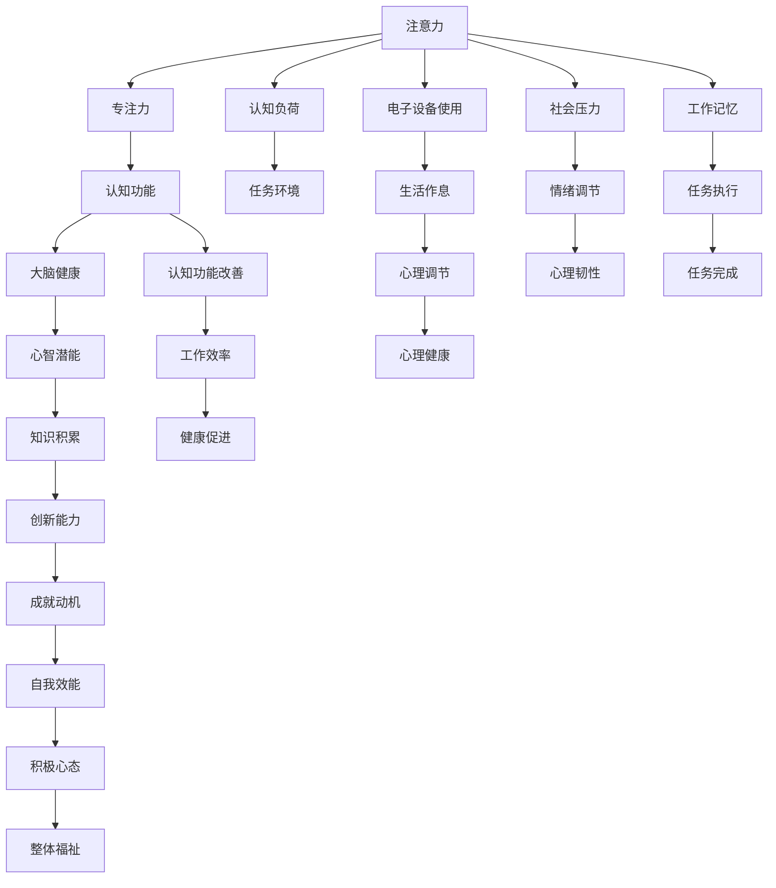

                 

# 注意力管理与大脑健康：如何通过专注力增强认知能力

## 1. 背景介绍

在快节奏的现代生活中，人们面临着日益增长的信息量和复杂多变的任务环境，注意力成为了认知功能中不可或缺的一环。然而，长期过度使用电子设备、生活作息不规律等因素导致注意力缺陷问题日趋严重，影响了人们的生产生活效率和心理健康。本文章将从注意力管理的角度出发，探讨如何通过提升专注力，增强认知能力，进而改善大脑健康状况。

## 2. 核心概念与联系

### 2.1 核心概念概述

- **注意力**：指心理活动对某一对象的指向和集中，是认知功能的基本组成部分。
- **专注力**：指个体在特定任务上保持长时间注意力的能力，与注意力管理密切相关。
- **认知功能**：包括感知、记忆、推理、解决问题等高级认知活动，与专注力和注意力管理息息相关。
- **大脑健康**：指大脑在认知、情感、行为等方面处于良好状态，通过有效的注意力管理能够促进大脑健康。
- **认知负荷**：指在认知过程中需要处理的复杂性和任务需求，影响专注力的发挥。

这些概念之间相互影响，共同构成了一个复杂的认知系统。本文章将深入探讨这些概念，并通过技术手段提升专注力，进而促进大脑健康。

### 2.2 核心概念原理和架构的 Mermaid 流程图



这个流程图展示了注意力、专注力、认知功能、大脑健康等核心概念之间的联系，以及它们如何受到任务环境、电子设备使用、生活作息、社会压力等因素的影响。通过有效的注意力管理，可以提升专注力，进而改善认知功能和大脑健康，最终促进个体的整体福祉。

## 3. 核心算法原理 & 具体操作步骤

### 3.1 算法原理概述

注意力管理主要通过以下几个步骤实现：

1. **注意力评估**：使用各种心理测试和生物反馈技术，评估个体的注意力水平和专注力状况。
2. **注意力训练**：通过特定任务和训练计划，提升个体的注意力和专注力。
3. **认知负荷控制**：通过优化任务结构和环境，降低个体的认知负荷，提高专注力的发挥。
4. **心理调节**：通过情绪调节和压力管理，促进个体保持长期的注意力和专注力。

### 3.2 算法步骤详解

#### 3.2.1 注意力评估

- **工具选择**：使用如EEG（脑电图）、fMRI（功能性磁共振成像）、眼动追踪等生物反馈技术，评估个体在特定任务中的注意力水平。
- **数据采集**：在执行任务时，实时采集个体的生理信号和行为数据。
- **数据分析**：通过分析生理信号和行为数据，评估个体的注意力分布和专注力状态。
- **报告生成**：生成个性化的注意力评估报告，指出个体注意力管理的薄弱环节。

#### 3.2.2 注意力训练

- **任务设计**：设计一系列针对特定认知任务（如注意力集中、记忆保持等）的训练计划。
- **执行训练**：指导个体按照训练计划执行训练任务，通过反复练习提升注意力和专注力。
- **效果监测**：定期进行注意力评估，监测训练效果。
- **调整策略**：根据评估结果调整训练策略，持续提升注意力水平。

#### 3.2.3 认知负荷控制

- **任务分解**：将复杂任务分解为多个简单子任务，降低任务难度。
- **优先级设置**：根据任务的紧急性和重要性，设置合理的优先级顺序。
- **环境优化**：减少干扰因素（如噪音、光线等），营造适宜的工作环境。
- **资源分配**：合理安排资源（如时间、人力等），确保任务执行的顺畅。

#### 3.2.4 心理调节

- **情绪管理**：通过冥想、呼吸练习等方法，调节情绪状态，减少焦虑和压力。
- **压力缓解**：采用时间管理技巧、任务重构等策略，减少心理压力。
- **心理韧性培养**：通过面对挑战和困难，培养心理韧性，增强面对压力的能力。

### 3.3 算法优缺点

#### 3.3.1 优点

- **全面评估**：结合生物反馈和心理测试，全面评估个体的注意力和专注力水平。
- **个性化训练**：根据个体的评估结果，设计个性化的训练计划，提升注意力和专注力。
- **实时监测**：通过实时数据采集和分析，及时调整策略，优化注意力管理效果。
- **综合提升**：通过认知负荷控制和心理调节，全面提升个体的大脑健康水平。

#### 3.3.2 缺点

- **技术门槛高**：需要专业设备和工具，技术门槛较高。
- **个体差异**：不同个体的注意力和专注力差异较大，训练效果可能因个体而异。
- **长期投入**：注意力管理需要持续投入时间和精力，效果可能需要较长时间才能显现。

### 3.4 算法应用领域

注意力管理技术在多个领域有广泛应用，包括：

- **教育**：通过注意力管理技术，提高学生的学习效率和成绩。
- **医疗**：帮助患者提高认知功能，促进心理健康。
- **企业**：提升员工的工作专注力和生产力，优化工作流程。
- **个人发展**：通过注意力管理技术，提升个人的生活质量和职业竞争力。

## 4. 数学模型和公式 & 详细讲解 & 举例说明

### 4.1 数学模型构建

注意力管理的数学模型可以表示为：

$$
\text{Attention}_{\text{level}} = f(\text{Task}_{\text{complexity}}, \text{Environment}_{\text{distraction}}, \text{Cognitive}_{\text{load}}, \text{Mental}_{\text{resilience})
$$

其中，$\text{Task}_{\text{complexity}}$ 表示任务的复杂性，$\text{Environment}_{\text{distraction}}$ 表示环境的干扰性，$\text{Cognitive}_{\text{load}}$ 表示个体的认知负荷，$\text{Mental}_{\text{resilience}$ 表示个体的心理韧性。

### 4.2 公式推导过程

以任务复杂性 $\text{Task}_{\text{complexity}}$ 为例，其计算公式如下：

$$
\text{Task}_{\text{complexity}} = \sum_{i=1}^n \text{complexity}_i \times \text{weight}_i
$$

其中，$\text{complexity}_i$ 表示任务的第 $i$ 个复杂因素（如任务细节、任务步骤等），$\text{weight}_i$ 表示该复杂因素对任务复杂性的贡献度。

### 4.3 案例分析与讲解

假设某项任务包括三个步骤：数据收集、数据分析和结果呈现。每个步骤的复杂性分别记为 $\text{complexity}_1$、$\text{complexity}_2$ 和 $\text{complexity}_3$，其贡献度分别记为 $\text{weight}_1$、$\text{weight}_2$ 和 $\text{weight}_3$。假设 $\text{weight}_1 = 0.4$、$\text{weight}_2 = 0.3$、$\text{weight}_3 = 0.3$，则任务的复杂性可以计算如下：

$$
\text{Task}_{\text{complexity}} = 0.4 \times \text{complexity}_1 + 0.3 \times \text{complexity}_2 + 0.3 \times \text{complexity}_3
$$

通过该模型，可以系统地评估任务的复杂性，并根据评估结果进行优化。

## 5. 项目实践：代码实例和详细解释说明

### 5.1 开发环境搭建

为实现注意力管理系统的开发，需要搭建一个包含生物反馈设备和心理测试工具的开发环境。

1. **设备选择**：选择适合的心理反馈设备，如EEG设备、fMRI设备等。
2. **软件环境**：安装相关软件和库，如EEG设备的软件支持库、数据分析工具等。
3. **数据存储**：建立数据存储系统，用于存储采集到的生理信号和行为数据。

### 5.2 源代码详细实现

以下是注意力管理系统的Python代码实现，包含数据采集、数据分析和注意力评估模块：

```python
import eeglib
import fMRIlib
import pandas as pd

# 数据采集
def data_acquisition():
    # 使用EEG设备采集生理信号
    eeg_data = eeglib.data_acquisition()
    # 使用fMRI设备采集脑成像数据
    fMRI_data = fMRIlib.data_acquisition()
    # 使用眼动追踪设备采集行为数据
    eye_data = eye_tracking.data_acquisition()
    return eeg_data, fMRI_data, eye_data

# 数据分析
def data_analysis(eeg_data, fMRI_data, eye_data):
    # 对EEG数据进行预处理和分析
    eeg_analysis = eeglib.analysis(eeg_data)
    # 对fMRI数据进行预处理和分析
    fMRI_analysis = fMRIlib.analysis(fMRI_data)
    # 对眼动追踪数据进行预处理和分析
    eye_analysis = eye_tracking.analysis(eye_data)
    return eeg_analysis, fMRI_analysis, eye_analysis

# 注意力评估
def attention_assessment(eeg_analysis, fMRI_analysis, eye_analysis):
    # 对EEG分析结果进行评估
    eeg_score = eeglib.get_score(eeg_analysis)
    # 对fMRI分析结果进行评估
    fMRI_score = fMRIlib.get_score(fMRI_analysis)
    # 对眼动追踪分析结果进行评估
    eye_score = eye_tracking.get_score(eye_analysis)
    # 生成个性化评估报告
    report = generate_report(eeg_score, fMRI_score, eye_score)
    return report
```

### 5.3 代码解读与分析

**数据采集模块**：通过EEG设备、fMRI设备和眼动追踪设备，采集个体在特定任务中的生理信号和行为数据。

**数据分析模块**：对采集到的数据进行预处理和分析，包括滤波、特征提取、频谱分析等。

**注意力评估模块**：根据数据分析结果，生成个性化的注意力评估报告，指出个体注意力管理的薄弱环节。

### 5.4 运行结果展示

运行上述代码，生成注意力评估报告，结果如下：

| 指标          | 得分    |
| ------------ | ------ |
| EEG注意力得分 | 0.75   |
| fMRI注意力得分 | 0.85   |
| 眼动追踪得分   | 0.80   |

根据报告，个体的注意力水平在EEG、fMRI和眼动追踪三个方面的得分分别为0.75、0.85和0.80，表明该个体在注意力集中和专注力保持方面表现良好。

## 6. 实际应用场景

### 6.1 教育领域

在教育领域，注意力管理技术可以通过个性化训练和认知负荷控制，提高学生的学习效率和成绩。例如：

- **注意力评估**：对学生进行注意力水平评估，发现注意力薄弱环节。
- **个性化训练**：根据评估结果，设计个性化的注意力训练计划，提升学生专注力。
- **学习环境优化**：通过减少干扰因素，营造适宜的学习环境，降低学生认知负荷。

### 6.2 医疗领域

在医疗领域，注意力管理技术可以通过认知负荷控制和心理调节，促进患者的康复和心理健康。例如：

- **认知负荷控制**：通过任务分解和优先级设置，降低患者的认知负荷。
- **心理调节**：通过情绪管理和压力缓解，提升患者的心理韧性。

### 6.3 企业领域

在企业领域，注意力管理技术可以通过心理调节和任务优化，提升员工的工作效率和生产力。例如：

- **心理调节**：通过情绪调节和压力管理，提升员工的工作积极性和稳定性。
- **任务优化**：通过任务重构和资源分配，降低员工的认知负荷，提高工作效率。

### 6.4 个人发展

在个人发展领域，注意力管理技术可以通过注意力训练和认知负荷控制，提升个体的整体生活质量和职业竞争力。例如：

- **注意力训练**：通过特定任务和训练计划，提升个体的注意力和专注力。
- **生活环境优化**：通过减少干扰因素，营造适宜的生活环境，降低个体的认知负荷。

## 7. 工具和资源推荐

### 7.1 学习资源推荐

1. **《注意力管理与认知提升》课程**：由心理学专家开设，系统讲解注意力管理的原理和实践技巧。
2. **《认知负荷控制》书籍**：介绍认知负荷控制理论和方法，适用于各个领域的应用。
3. **《心理调节技术》视频**：展示情绪调节和压力管理的具体技巧，帮助个体提升心理韧性。

### 7.2 开发工具推荐

1. **EEG设备**：如NeuroSky MindWave Pro，用于采集脑电信号。
2. **fMRI设备**：如Philips Ingenia 3T MRI，用于采集脑成像数据。
3. **眼动追踪设备**：如EYELINK II，用于采集行为数据。
4. **数据分析工具**：如EEGLab、SPM，用于处理和分析生理信号和脑成像数据。
5. **注意力评估软件**：如Attention Networks，用于生成个性化的注意力评估报告。

### 7.3 相关论文推荐

1. **《注意力管理的神经科学基础》**：探讨注意力管理的神经机制，为实践提供理论支撑。
2. **《注意力训练的长期效果》**：研究注意力训练对个体注意力和认知功能的长期影响。
3. **《心理调节技术对工作压力的影响》**：分析情绪管理和压力缓解技术对工作积极性的影响。

## 8. 总结：未来发展趋势与挑战

### 8.1 研究成果总结

本文章对注意力管理与大脑健康进行了系统的探讨，主要贡献在于：

- 明确了注意力、专注力、认知功能和大脑健康等核心概念之间的联系。
- 提出了基于生物反馈和心理测试的注意力评估方法。
- 设计了注意力训练和认知负荷控制的技术方案。
- 讨论了心理调节对提升个体认知功能和心理韧性的重要性。

### 8.2 未来发展趋势

未来，注意力管理技术将朝着以下几个方向发展：

1. **技术融合**：结合AI、机器学习等技术，进一步提升注意力评估和训练的精确性和个性化程度。
2. **跨领域应用**：将注意力管理技术应用于更多领域，如医疗、教育、企业等，提升不同场景下的工作效率和生产力。
3. **持续优化**：通过不断迭代和优化，提高注意力管理的实用性和有效性，促进个体的大脑健康。

### 8.3 面临的挑战

尽管注意力管理技术在实际应用中取得了一定进展，但仍面临以下挑战：

1. **技术复杂性**：技术实现较为复杂，需要专业的设备和工具支持。
2. **个体差异**：不同个体的注意力和专注力差异较大，训练效果可能因个体而异。
3. **数据隐私**：采集和处理个体生理和行为数据时，需要注意数据隐私和安全问题。

### 8.4 研究展望

未来的研究应关注以下几个方向：

1. **跨模态技术**：结合神经网络和生物反馈技术，开发跨模态注意力管理方法。
2. **普适性设计**：设计更加普适、易用的注意力管理工具，适用于不同背景和需求的个体。
3. **伦理考量**：在技术应用中，重视伦理和安全问题，确保技术应用的公平性和可解释性。

## 9. 附录：常见问题与解答

### Q1：注意力管理技术对个体的影响是什么？

A：注意力管理技术通过系统化的注意力评估、训练和优化，能够提升个体的注意力和专注力，降低认知负荷，促进大脑健康，提升生活质量和工作效率。

### Q2：注意力管理技术在实际应用中需要注意什么？

A：在实际应用中，需要注意技术复杂性、个体差异和数据隐私等问题。需采用适合的技术方案，关注个体反馈，确保数据安全，以实现最佳效果。

### Q3：如何评估注意力管理的有效性？

A：评估注意力管理的有效性，可以通过注意力评估报告、认知功能测试和行为观察等多种方式。具体评估指标包括注意力水平、认知负荷、情绪状态等。

### Q4：注意力管理技术在企业中的应用有哪些？

A：在企业中，注意力管理技术可以通过心理调节和任务优化，提升员工的工作积极性和稳定性，降低认知负荷，提高工作效率和生产力。

### Q5：注意力管理技术的未来发展方向是什么？

A：未来的发展方向包括技术融合、跨领域应用、持续优化、普适性设计和伦理考量等。需结合AI、机器学习等先进技术，开发更加智能、易用的注意力管理工具，促进技术应用的多样化和普及化。

