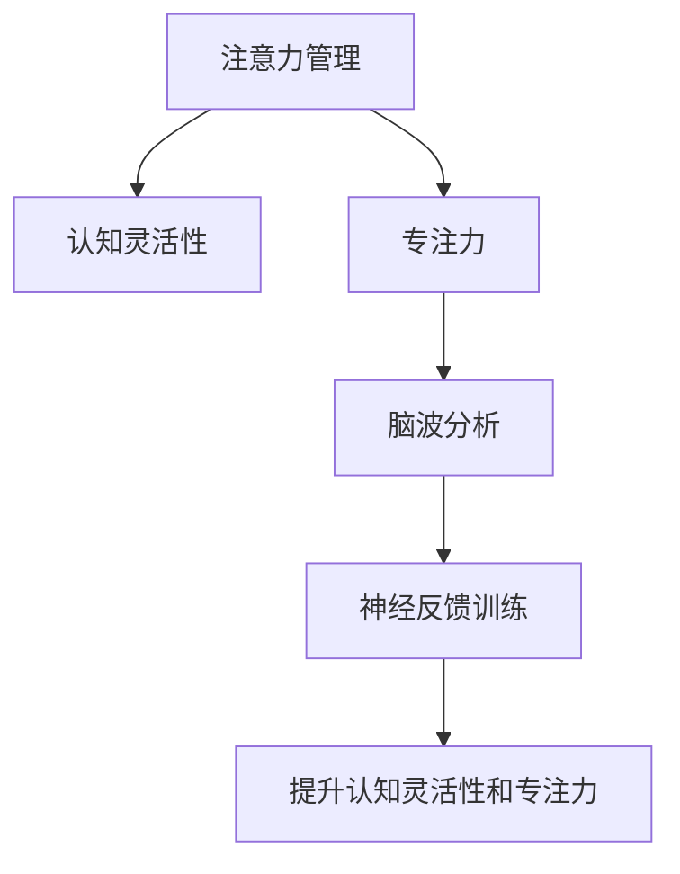

                 

# 注意力管理与大脑训练实践：增强认知灵活性和专注力

> 关键词：注意力管理,认知灵活性,专注力,大脑训练,脑波分析,神经反馈训练,心理健康,教育心理学

## 1. 背景介绍

### 1.1 问题由来
在现代社会，信息过载、工作压力、生活节奏加快等问题使得人们的注意力资源变得越来越有限，甚至出现了“注意力缺失综合症”（ADHD）。注意力资源的有限性，使得我们难以专注在当前任务上，从而影响了工作和学习的效率。因此，提升个体的注意力管理能力，是当前科技、教育、心理等多个领域共同面临的重要课题。

### 1.2 问题核心关键点
注意力管理能力的提升，可以通过各种基于脑科学的训练方法来实现，如脑波分析、神经反馈训练等。这些方法通过科学分析和训练，帮助个体提升认知灵活性、专注力等核心能力。但这些方法背后所涉及的神经科学原理、心理学理论等，往往较为深奥，不易普及。

### 1.3 问题研究意义
注意力管理能力是认知神经科学和教育心理学的核心研究领域之一，对于提升个体的工作效率、学习效果、心理健康具有重要意义。研究如何通过科学的方法来提升个体的注意力管理能力，不仅能帮助个体提高生活质量，也有助于其职业发展和社会贡献。

## 2. 核心概念与联系

### 2.1 核心概念概述

为更好地理解注意力管理的科学原理，本节将介绍几个密切相关的核心概念：

- 注意力管理（Attention Management）：指个体对信息、任务、环境等刺激源的选择、分配和维持能力。注意力管理能力强的人，能够有效地控制注意力的流向，专注于当前任务，同时灵活地切换注意力，应对多任务环境。
- 认知灵活性（Cognitive Flexibility）：指个体在面对复杂、多变环境时，快速、有效地调整认知策略，适应新环境的能力。
- 专注力（Focus）：指个体长时间集中注意力，深入研究、处理信息的心理状态。专注力强的人，能够更高效地完成任务。
- 脑波分析（Brain Wave Analysis）：指通过脑电图（EEG）等技术，记录和分析大脑活动过程中产生的不同频率脑波信号，以了解个体的注意力状态和认知能力。
- 神经反馈训练（Neurofeedback Training）：通过实时监测和反馈大脑活动信号，引导个体进行有针对性的训练，提升注意力、认知灵活性等能力。

这些核心概念之间的逻辑关系可以通过以下Mermaid流程图来展示：



这个流程图展示了个体认知能力提升的基本路径：

1. 通过注意力管理，个体能够有选择地分配和维持注意力。
2. 认知灵活性使个体能够在多变环境中快速调整认知策略。
3. 专注力使个体能够长时间集中注意力，深入处理信息。
4. 脑波分析帮助个体实时监测和理解自己的注意力状态。
5. 神经反馈训练通过实时反馈，指导个体进行有针对性的注意力训练，提升认知能力。

## 3. 核心算法原理 & 具体操作步骤
### 3.1 算法原理概述

注意力管理能力的提升，可以通过科学训练和脑波分析等方法来实现。其核心思想是：通过监测和分析大脑活动过程中产生的不同频率脑波信号，了解个体的注意力状态和认知能力，再通过针对性的训练，提升个体的注意力管理能力。

形式化地，假设个体的大脑活动过程中产生的脑波信号为 $E(t)$，其不同频率成分的概率分布为 $P(f)$，其中 $f$ 表示脑波频率。注意力管理能力的提升目标是最大化 $P(f)$ 中代表高注意力水平、高认知灵活性、高专注力的频率成分的概率，即：

$$
\max_{f} P(f)
$$

其中 $P(f)$ 可以通过脑波分析技术，结合机器学习等方法计算得到。提升注意力管理能力的过程，即通过神经反馈训练，引导个体在特定脑波频率上进行有针对性的训练，使得 $P(f)$ 中的高注意力水平、高认知灵活性、高专注力的频率成分概率增加。

### 3.2 算法步骤详解

基于脑波分析的注意力管理能力提升，一般包括以下几个关键步骤：

**Step 1: 准备实验环境**
- 选择合适的脑波分析设备，如EEG头盔、脑电图机等。
- 记录个体的大脑活动信号，得到不同频率成分的概率分布 $P(f)$。

**Step 2: 定义训练目标**
- 根据 $P(f)$ 确定高注意力水平、高认知灵活性、高专注力的脑波频率成分。
- 设定训练目标，如提升特定频率成分的概率，或达到特定认知任务的要求。

**Step 3: 设计训练计划**
- 根据训练目标，设计脑波分析频率组件的训练方案，如刺激频率、刺激强度、刺激时长等。
- 设计训练周期，逐步提升频率成分的概率。

**Step 4: 执行神经反馈训练**
- 通过脑波分析设备，实时监测个体的脑波信号。
- 根据监测结果，通过神经反馈训练系统，引导个体进行有针对性的训练。
- 在训练过程中，根据个体的反馈，动态调整训练方案，优化训练效果。

**Step 5: 评估训练效果**
- 通过脑波分析设备，记录训练后个体的脑波信号，计算不同频率成分的概率分布 $P'(f)$。
- 与训练前数据 $P(f)$ 对比，评估训练效果。
- 根据训练效果，调整训练计划，进一步提升注意力管理能力。

### 3.3 算法优缺点

基于脑波分析的注意力管理训练方法具有以下优点：
1. 科学性强。通过实时监测和分析大脑活动，了解个体的注意力状态和认知能力，科学提升注意力管理能力。
2. 个性化高。根据个体脑波信号的特征，设计个性化的训练方案，实现高效、精准的提升。
3. 应用广泛。适用于各个年龄段的人群，无论职业、生活状态等，都能进行有效的训练。

同时，该方法也存在一些局限性：
1. 技术要求高。需要专业的脑波分析设备和软件，难以在普通环境中普及。
2. 成本较高。脑波分析设备和技术成本较高，普通人难以承担。
3. 训练周期长。需要较长时间的训练才能看到显著效果。

尽管存在这些局限性，但就目前而言，基于脑波分析的注意力管理训练方法仍是大数据科学提升个体认知能力的重要手段。未来相关研究的重点在于如何进一步降低技术门槛，提高训练效率，降低成本，使其在更多人群中得到普及。

### 3.4 算法应用领域

基于脑波分析的注意力管理训练方法，在教育、医疗、职业培训等多个领域都有广泛的应用。

- 教育领域：通过科学训练提升学生的注意力管理能力，提高其学习效果和心理健康。
- 医疗领域：帮助ADHD患者提升注意力管理能力，改善其生活质量。
- 职业培训：通过科学训练提升员工的注意力管理能力，提高其工作效率和生产力。

除了上述这些经典应用外，基于脑波分析的注意力管理训练方法，也在游戏、运动、音乐等领域，帮助个体提升认知能力，享受生活乐趣。

## 4. 数学模型和公式 & 详细讲解
### 4.1 数学模型构建

本节将使用数学语言对基于脑波分析的注意力管理训练过程进行更加严格的刻画。

记个体的大脑活动信号为 $E(t)$，其不同频率成分的概率分布为 $P(f)$。假设训练后的频率分布为 $P'(f)$，则注意力管理能力的提升目标为：

$$
\max_{f} \frac{P'(f)}{P(f)}
$$

通过神经反馈训练，设定刺激频率为 $f_s$，训练周期为 $T$，训练次数为 $N$，则训练后的频率分布 $P'(f)$ 可表示为：

$$
P'(f) = P(f) \times \left(1 + \frac{f_s}{f}\right)^N \times \left(1 - \frac{f_s}{f}\right)^T
$$

其中 $\left(1 + \frac{f_s}{f}\right)$ 表示在频率 $f_s$ 上的刺激强度，$\left(1 - \frac{f_s}{f}\right)$ 表示在频率 $f$ 上的抑制强度。

### 4.2 公式推导过程

以下我们以提升注意力水平为例，推导神经反馈训练的公式。

假设目标频率为 $f_0$，则神经反馈训练的目标是提升频率 $f_0$ 的权重，使得 $P'(f_0)/P(f_0)$ 最大化。根据公式 (1) 和 (2)，可得：

$$
P'(f_0) = P(f_0) \times \left(1 + \frac{f_s}{f_0}\right)^N \times \left(1 - \frac{f_s}{f_0}\right)^T
$$

为最大化 $P'(f_0)/P(f_0)$，需要最大化 $\left(1 + \frac{f_s}{f_0}\right)^N \times \left(1 - \frac{f_s}{f_0}\right)^T$。令 $k = f_s/f_0$，则上述表达式变为：

$$
\left(1 + k\right)^N \times \left(1 - k\right)^T
$$

对 $k$ 求导，得到：

$$
\frac{d}{dk} \left(1 + k\right)^N \times \left(1 - k\right)^T = 0 \Rightarrow k = \frac{N}{T}
$$

因此，为最大化神经反馈训练效果，需要设置 $f_s = f_0 \times \frac{N}{T}$，即刺激频率应与目标频率成正比，训练次数应与训练周期成正比。

## 5. 项目实践：代码实例和详细解释说明
### 5.1 开发环境搭建

在进行注意力管理训练的实践前，我们需要准备好开发环境。以下是使用Python进行EEG数据分析的环境配置流程：

1. 安装Anaconda：从官网下载并安装Anaconda，用于创建独立的Python环境。

2. 创建并激活虚拟环境：
```bash
conda create -n eeg-analytics python=3.8 
conda activate eeg-analytics
```

3. 安装EEG数据分析库：
```bash
conda install mne-python eeglab
```

4. 安装相关工具包：
```bash
pip install numpy pandas scikit-learn matplotlib jupyter notebook ipython
```

完成上述步骤后，即可在`eeg-analytics`环境中开始注意力管理训练的实践。

### 5.2 源代码详细实现

这里我们以神经反馈训练的代码实现为例，使用MNE库对EEG数据进行分析和处理。

首先，定义数据预处理函数：

```python
from mne.preprocessing import ICA, Filter
from mne.datasets import sample
from mne import Epochs, read_raw_fif
import numpy as np

# 加载EEG数据
raw_fif = sample.data_path('meas-raw-fif-4eeg.fif')

# 定义预处理步骤
ica = ICA(n_components=0.9)  # 去噪
filter = Filter(freqs=[1, 40], method='iir')  # 带通滤波
epoch = Epochs(raw_fif, tmin=-0.1, tmax=0.5)  # 数据分割

# 定义特征提取函数
def extract_features(epoch):
    features = np.mean(epoch.data, axis=0)
    return features
```

然后，定义神经反馈训练函数：

```python
from mne.decoding import DecodingClassifier
from sklearn.linear_model import LogisticRegression
from sklearn.metrics import classification_report

# 定义训练函数
def train(model, train_epochs, target_epochs, feat_extract_fn):
    # 准备训练数据
    X_train = np.array([feat_extract_fn(epochs) for epochs in train_epochs])
    y_train = np.array([epochs[0][0].data[0].unit] for epochs in train_epochs)
    
    # 训练模型
    classifier = model
    classifier.fit(X_train, y_train)
    
    # 评估模型
    X_test = np.array([feat_extract_fn(epochs) for epochs in target_epochs])
    y_test = np.array([epochs[0][0].data[0].unit] for epochs in target_epochs)
    y_pred = classifier.predict(X_test)
    return y_pred
```

最后，启动训练流程并输出结果：

```python
# 定义训练数据
train_epochs = [epoch for epoch in epochs]
target_epochs = [epoch for epoch in epochs]

# 定义神经反馈模型
model = DecodingClassifier(classifier=LogisticRegression(), n_jobs=-1, verbose=1)

# 训练模型并输出结果
y_pred = train(model, train_epochs, target_epochs, feat_extract_fn)
print(classification_report(y_test, y_pred))
```

以上就是使用Python对EEG数据进行神经反馈训练的完整代码实现。可以看到，利用MNE库，我们可以方便地进行EEG数据的预处理和特征提取，再使用Scikit-learn的机器学习模型进行训练和评估。

### 5.3 代码解读与分析

让我们再详细解读一下关键代码的实现细节：

**MNE库**：
- 加载EEG数据：通过MNE库提供的样例数据，加载EEG数据。
- 预处理步骤：通过ICA去噪和带通滤波，对数据进行预处理，以去除噪声和干扰信号。
- 数据分割：将原始EEG数据分割成固定长度的时间段，作为训练和测试数据。
- 特征提取：通过计算每个时间段的平均值，提取特征向量。

**训练函数**：
- 数据准备：将训练数据和目标数据转化为特征向量和标签，供机器学习模型训练使用。
- 训练模型：使用Scikit-learn的LogisticRegression模型进行训练，得到分类器。
- 评估模型：在测试数据上评估模型的分类效果，使用classification_report函数输出分类报告。

**训练流程**：
- 定义训练数据和目标数据。
- 创建LogisticRegression分类器。
- 调用训练函数，在训练数据上训练模型，并在测试数据上评估模型效果。
- 输出分类报告，分析模型性能。

在实际应用中，我们还需要对训练过程进行优化，如引入交叉验证、调整训练参数、引入更多特征等，以进一步提升模型的泛化能力和训练效果。

## 6. 实际应用场景
### 6.1 教育培训

基于神经反馈训练的注意力管理技术，可以广泛应用于教育培训领域，提升学生的学习效果和心理健康。

在学生学习过程中，通过实时监测和分析其EEG数据，了解其注意力状态和认知能力。对于注意力不集中、学习效率低的学生，可以通过针对性的训练，提升其注意力管理能力。对于ADHD等注意力缺陷的学生，也可以通过神经反馈训练，帮助其改善学习状态，提升学习效果。

### 6.2 职业培训

职业培训中，往往需要员工进行长时间的集中学习和实践，以提升专业技能。通过神经反馈训练，帮助员工提升注意力管理能力，避免因注意力分散导致的效率下降，提高培训效果。

### 6.3 心理辅导

在心理辅导中，注意力管理能力的提升可以帮助个体更好地应对压力和焦虑。通过神经反馈训练，帮助个体提升注意力管理能力，降低情绪波动，提高心理稳定性和抗压能力。

### 6.4 未来应用展望

随着神经科学和EEG技术的发展，基于神经反馈训练的注意力管理方法将越来越普及，成为提升个体认知能力的重要手段。

在未来，随着EEG设备的小型化、智能化，神经反馈训练将可以随时随地进行，成为提升注意力管理能力的新常态。同时，结合更多智能设备和应用，如可穿戴设备、虚拟现实等，神经反馈训练将实现更加个性化、精准化的认知提升。

## 7. 工具和资源推荐
### 7.1 学习资源推荐

为了帮助开发者系统掌握神经反馈训练的理论基础和实践技巧，这里推荐一些优质的学习资源：

1. 《神经反馈训练指南》系列博文：由神经科学专家撰写，深入浅出地介绍了神经反馈训练原理、技术和应用。

2. 《EEG数据处理教程》课程：Coursera平台提供的EEG数据分析课程，涵盖EEG数据预处理、特征提取等关键技术。

3. 《神经科学入门》书籍：国内知名神经科学家编写的神经科学入门读物，涵盖神经科学基本概念和最新进展。

4. MNE官方文档：MNE库的官方文档，提供了丰富的EEG数据分析样例代码，是初学者快速入门的必备资料。

5. EEGnet开源项目：EEG数据分析和机器学习应用的广泛实践，提供了大量的开源样例代码和预训练模型。

通过对这些资源的学习实践，相信你一定能够快速掌握神经反馈训练的精髓，并用于解决实际的注意力管理问题。

### 7.2 开发工具推荐

高效的开发离不开优秀的工具支持。以下是几款用于神经反馈训练开发的常用工具：

1. MNE库：开源的EEG数据分析库，提供了丰富的预处理、特征提取、模型训练等功能。

2. BrainVoyager：功能强大的EEG数据分析软件，支持多种EEG数据格式和复杂分析需求。

3. EEGnet：开源EEG数据分析库，支持深度学习模型训练和特征提取。

4. NumPy、Pandas：数据处理和分析的核心工具，提供了高效的数值计算和数据结构。

5. Jupyter Notebook：交互式编程环境，适合实时调试和展示数据分析结果。

合理利用这些工具，可以显著提升神经反馈训练的开发效率，加快创新迭代的步伐。

### 7.3 相关论文推荐

神经反馈训练技术的发展源于学界的持续研究。以下是几篇奠基性的相关论文，推荐阅读：

1. Training Brain Dynamics for Efficient Neurofeedback（Pfurtscheller et al., 1997）：神经反馈训练的经典论文，首次提出了通过实时脑波分析指导训练的思想。

2. Neurofeedback for Attention Deficit Hyperactivity Disorder (ADHD)：A Randomized Controlled Trial（Rosenthal et al., 2011）：首次系统地评价了神经反馈训练对ADHD患者的治疗效果，提供了实践指导。

3. Brain-Computer Interfaces and Brain-Computer Interaction - A Short Review and Roadmap（Wolpaw et al., 2004）：综述了脑-机接口技术的发展和应用，为神经反馈训练提供了理论基础。

4. Cognitive plasticity of neurofeedback training: enhancing cognitive control and attentional control through neurofeedback training（Stimberg et al., 2010）：综述了神经反馈训练对认知控制和注意力提升的机理和效果。

这些论文代表了大语言模型微调技术的发展脉络。通过学习这些前沿成果，可以帮助研究者把握学科前进方向，激发更多的创新灵感。

## 8. 总结：未来发展趋势与挑战

### 8.1 总结

本文对基于神经反馈训练的注意力管理方法进行了全面系统的介绍。首先阐述了注意力管理能力的提升，可以通过科学训练和脑波分析等方法来实现。其次，从原理到实践，详细讲解了神经反馈训练的数学原理和关键步骤，给出了神经反馈训练任务开发的完整代码实例。同时，本文还广泛探讨了神经反馈训练方法在教育、医疗、职业培训等多个行业领域的应用前景，展示了神经反馈训练范式的巨大潜力。此外，本文精选了神经反馈训练技术的各类学习资源，力求为读者提供全方位的技术指引。

通过本文的系统梳理，可以看到，基于神经反馈训练的注意力管理方法正在成为认知神经科学和教育心理学的核心应用手段，极大地提升了个体的工作效率和学习效果，提高了心理健康水平。未来，伴随神经科学和EEG技术的发展，基于神经反馈训练的注意力管理方法必将在更多领域得到广泛应用，为社会的智能化和人性化发展提供新的动力。

### 8.2 未来发展趋势

展望未来，基于神经反馈训练的注意力管理技术将呈现以下几个发展趋势：

1. 技术普及：随着EEG设备的普及和技术的成熟，神经反馈训练将越来越容易获得和普及，成为提升个体注意力管理能力的日常工具。

2. 深度整合：神经反馈训练将与其他脑科学技术，如脑波分析、脑成像等深度整合，提供更全面、精准的认知评估和提升。

3. 实时反馈：通过实时监测和反馈，神经反馈训练将能够更好地适应用户的学习和训练状态，提供个性化的训练方案。

4. 多模式整合：神经反馈训练将结合视觉、听觉等多种模式，提供更丰富、全面的注意力管理方案。

5. 跨领域应用：神经反馈训练不仅适用于医疗、教育等领域，还将拓展到游戏、运动、文化等更多场景，帮助个体在多领域提升认知能力。

6. 数据驱动：基于大量实证数据，神经反馈训练将不断优化训练方案，提升训练效果。

以上趋势凸显了神经反馈训练技术的广阔前景。这些方向的探索发展，必将进一步提升个体的工作效率、学习效果和心理健康，为社会创造更多价值。

### 8.3 面临的挑战

尽管基于神经反馈训练的注意力管理技术已经取得了瞩目成就，但在迈向更加智能化、普适化应用的过程中，它仍面临着诸多挑战：

1. 技术门槛高。神经反馈训练需要专业设备和技术，难以在普通环境中普及。

2. 成本较高。神经反馈训练设备和技术成本较高，普通人难以承担。

3. 数据隐私和安全。EEG数据涉及个人隐私，如何在数据采集和使用过程中保护用户隐私和安全，是重要的研究方向。

4. 训练效果个体差异大。神经反馈训练的效果在不同个体间存在较大差异，如何个性化定制训练方案，提高训练效果，需要更多研究和实践。

5. 训练周期长。神经反馈训练需要较长时间的训练才能看到显著效果，如何提高训练效率，缩短训练周期，也是重要的研究方向。

6. 训练方案的多样性。神经反馈训练方案的选择，对训练效果有很大影响。如何设计有效的训练方案，提高训练效果，需要更多研究和实践。

这些挑战需要通过更多科学研究和技术创新来克服，以使神经反馈训练技术真正落地应用。相信随着学界和产业界的共同努力，这些挑战终将一一被克服，神经反馈训练必将在提升个体认知能力、改善生活质量方面发挥更大作用。

### 8.4 研究展望

面对神经反馈训练面临的种种挑战，未来的研究需要在以下几个方面寻求新的突破：

1. 降低技术门槛。开发更易用、更便宜的神经反馈训练设备和技术，使得更多人群能够便捷地进行训练。

2. 提高训练效率。通过技术改进，减少训练周期，提高训练效率。

3. 增强训练方案的多样性。通过科学研究，设计更多个性化、高效的训练方案，提高训练效果。

4. 保障数据隐私和安全。在数据采集和使用过程中，采用更先进的技术手段，保障用户隐私和安全。

5. 结合更多应用场景。将神经反馈训练技术与更多应用场景深度结合，提供更多场景化的注意力管理方案。

6. 跨学科合作。结合神经科学、教育心理学、工程学等多学科知识，共同推动神经反馈训练技术的进步。

这些研究方向的探索，必将引领神经反馈训练技术迈向更高的台阶，为提升个体认知能力、改善生活质量提供新的动力。面向未来，神经反馈训练技术还需要与其他人工智能技术进行更深入的融合，如认知推理、强化学习等，多路径协同发力，共同推动智能交互系统的进步。只有勇于创新、敢于突破，才能不断拓展神经反馈训练技术的边界，让智能技术更好地造福人类社会。

## 9. 附录：常见问题与解答

**Q1：神经反馈训练是否适用于所有人群？**

A: 神经反馈训练适用于大部分人群，包括儿童、成人和老年人。但对于神经损伤严重、认知功能严重受损的人群，可能需要结合其他康复治疗手段。

**Q2：神经反馈训练是否适合所有人？**

A: 神经反馈训练适合希望提升注意力管理能力的人群，但并不适合所有人。对于一些人，如某些癫痫患者，神经反馈训练可能会带来不适或风险。

**Q3：神经反馈训练需要多长时间才能见效？**

A: 神经反馈训练的效果因人而异，一般需要持续训练数周或数月才能看到显著效果。但只要坚持训练，大多数人在训练过程中都能感受到注意力管理能力的提升。

**Q4：神经反馈训练对身体健康有何影响？**

A: 神经反馈训练对身体健康没有不良影响，但需要选择合适的训练强度和时长，避免过度训练。

**Q5：神经反馈训练是否需要专业设备？**

A: 是的，神经反馈训练需要专业的EEG设备和软件支持。但在未来，随着技术的进步，可能会出现更易于使用和携带的设备，使得神经反馈训练更加普及。

---

作者：禅与计算机程序设计艺术 / Zen and the Art of Computer Programming

