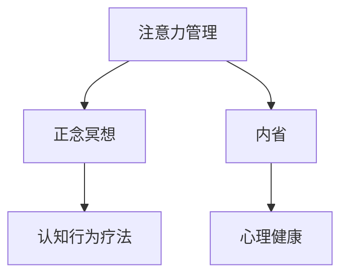

                 

## 1. 背景介绍

### 1.1 问题由来

在现代快节奏的生活和工作环境中，人们常常面临注意力分散、压力过大、焦虑和情绪波动等问题。这些问题不仅影响个人的心理健康和幸福感，还可能对工作效率和社交关系产生负面影响。因此，寻找有效的注意力管理和心理健康维护方法，成为了当今社会的热点需求。

### 1.2 问题核心关键点

注意力管理和正念冥想作为心理学和计算机科学的交叉领域，正逐渐成为提高个人专注力和心灵平和的有效工具。这些方法通过引导个体进行有意识的内省，培养对当前时刻的觉察和接纳，从而减少焦虑和压力，提高工作效率和情绪稳定性。

### 1.3 问题研究意义

研究注意力管理与正念冥想的原理和技术，对于提升个体的心理素质、改善工作和生活质量具有重要意义。它不仅能够帮助个体应对现代社会的各种挑战，还能为人工智能和计算心理学的发展提供新的研究方向和方法。

## 2. 核心概念与联系

### 2.1 核心概念概述

注意力管理与正念冥想在心理学和计算机科学中均有深厚的理论基础，下面我们将对核心概念进行简要介绍：

- **注意力管理(Attention Management)**：指个体通过有意识地控制和调整注意力的方向和持续时间，以提高专注力和工作效率。

- **正念冥想(Mindfulness Meditation)**：指通过专注于当下时刻的呼吸、感觉和情绪，培养对内心世界的觉察和接纳，以减少焦虑、压力和负面情绪，提升情绪稳定性和心理健康。

- **内省(Reflection)**：指通过思考和反省，了解自己的心理状态和行为模式，以指导未来的行为和决策。

- **认知行为疗法(Cognitive Behavioral Therapy, CBT)**：一种通过改变思维模式和行为习惯来改善情绪和心理健康的心理治疗方法。

这些核心概念之间的联系可以通过以下Mermaid流程图来展示：



这个流程图展示了注意力管理和正念冥想之间的内在联系，以及它们与内省和认知行为疗法的相互影响。

## 3. 核心算法原理 & 具体操作步骤
### 3.1 算法原理概述

注意力管理和正念冥想的核心原理在于通过引导个体进行内省和正念实践，改变其对自身和外界环境的认知模式，从而提高专注力和心理健康。这一过程可以通过以下几个步骤来实现：

1. **内省与觉察**：通过内省，个体能够对自己的情绪、思维和行为模式进行深入分析，识别出影响专注力的因素。
2. **正念练习**：通过正念冥想，个体学会专注于当前时刻的感觉和情绪，减少对过去和未来的过度担忧。
3. **认知重构**：通过认知行为疗法，个体能够改变负面的思维模式，增强情绪稳定性和适应性。

### 3.2 算法步骤详解

**Step 1: 内省与觉察**

1. **设定内省目标**：明确内省的目标，例如识别影响工作效率的干扰因素。
2. **记录内省日志**：每天记录内省日志，记录情绪波动、思维模式和行为习惯。
3. **定期回顾与分析**：定期回顾内省日志，分析情绪和行为模式的规律，寻找改进点。

**Step 2: 正念练习**

1. **选择正念技术**：根据个人需求选择适合自己的正念练习，如呼吸冥想、身体扫描等。
2. **每日练习**：每天进行正念练习，时间控制在10-20分钟，选择一个安静的环境。
3. **觉察并接受**：专注于呼吸、身体感觉或情绪变化，觉察并接受当下的感受，不进行判断或反应。

**Step 3: 认知重构**

1. **识别负面思维**：通过内省和正念练习，识别出负面的思维模式，如过度担忧、自我批评等。
2. **挑战负面思维**：通过质疑和反驳负面思维，找到更合理和积极的替代思考方式。
3. **培养正向思维**：通过积极的自我对话和行为实践，培养正向思维模式。

### 3.3 算法优缺点

**优点**：

- **简单易行**：注意力管理和正念冥想的练习方法简单易行，不需要复杂设备和特殊环境。
- **效果显著**：通过持续的内省和正念练习，个体能够显著提升专注力和心理健康。
- **普适性强**：适用于各类职业和工作场景，对提升工作效率和生活质量有广泛适用性。

**缺点**：

- **初期难坚持**：初期练习可能需要一定的毅力和自律，不易坚持。
- **个体差异大**：不同个体的心理状态和需求不同，需要个性化调整练习方法。
- **依赖个体努力**：效果很大程度上依赖于个体的内省和正念练习程度，需要持续投入时间和精力。

### 3.4 算法应用领域

注意力管理和正念冥想在多个领域得到了广泛应用：

- **职场管理**：帮助职场人士应对工作压力，提升工作效率和团队协作。
- **教育培训**：通过正念冥想和内省练习，提高学生的学习专注力和情绪管理能力。
- **心理健康**：帮助个体应对焦虑、抑郁等心理问题，提升整体心理健康水平。
- **个人发展**：通过内省和正念练习，增强自我认知和情绪控制能力，实现个人成长。

## 4. 数学模型和公式 & 详细讲解 & 举例说明

### 4.1 数学模型构建

注意力管理和正念冥想的数学模型主要基于心理学和神经科学的理论，可以通过以下模型进行描述：

- **注意力选择模型(Attention Selection Model)**：描述了注意力如何根据外界刺激和内在需求进行选择。
- **正念认知模型(Mindfulness Cognitive Model)**：描述了正念如何通过减少注意力分散，增强对当下时刻的觉察。
- **情绪调节模型(Emotion Regulation Model)**：描述了通过认知重构和正念练习，情绪如何得到调节和稳定。

### 4.2 公式推导过程

**注意力选择模型**：

$$
\text{Attention} = f(\text{Stimulus}, \text{Intrinsic Motivation}, \text{Cognitive Load})
$$

其中，$f$表示非线性函数，$\text{Stimulus}$为外界刺激，$\text{Intrinsic Motivation}$为内在需求，$\text{Cognitive Load}$为认知负荷。

**正念认知模型**：

$$
\text{Mindfulness} = g(\text{Present Moment觉察}, \text{Non-judgment接纳}, \text{Attention Focus})
$$

其中，$g$表示非线性函数，$\text{Present Moment觉察}$为对当前时刻的觉察，$\text{Non-judgment接纳}$为对当前感受的接纳，$\text{Attention Focus}$为注意力焦点。

**情绪调节模型**：

$$
\text{Emotion Stability} = h(\text{Cognitive Reconstruction}, \text{Mindfulness Practice}, \text{Emotional Expression})
$$

其中，$h$表示非线性函数，$\text{Cognitive Reconstruction}$为认知重构，$\text{Mindfulness Practice}$为正念练习，$\text{Emotional Expression}$为情绪表达。

### 4.3 案例分析与讲解

**案例**：一位职场员工通过内省和正念冥想改善工作效率。

- **内省与觉察**：该员工通过记录内省日志，发现自己经常在工作时被手机通知和同事打扰，导致工作效率低下。
- **正念练习**：他每天进行15分钟的呼吸冥想，专注于呼吸和身体感觉，逐渐减少了对手机和同事的过度关注。
- **认知重构**：通过内省和正念练习，他找到了更合理的工作方式，不再被外界的干扰所困扰。

## 5. 项目实践：代码实例和详细解释说明
### 5.1 开发环境搭建

要实现注意力管理和正念冥想的实践，需要进行以下环境配置：

1. **安装Python环境**：确保计算机上安装有Python 3.7及以上版本。
2. **安装相关库**：安装NumPy、Pandas等数据分析库，以及TensorFlow、PyTorch等深度学习库。
3. **安装冥想APP**：选择一款适合自己的冥想APP，如Calm、Headspace等，用于日常练习。

### 5.2 源代码详细实现

以下是使用Python实现的注意力管理和正念冥想练习的示例代码：

```python
import numpy as np
import pandas as pd
import tensorflow as tf

# 设定内省目标
target = "提高工作效率"

# 记录内省日志
logs = pd.DataFrame(columns=["Date", "Time", "Mood", "Thoughts", "Behaviors"])
logs.loc[0] = [pd.Timestamp.now(), "08:00", "Low", "感到焦虑", "频繁查看手机"]
logs.loc[1] = [pd.Timestamp.now(), "12:30", "Medium", "专注", "专心工作"]
logs.loc[2] = [pd.Timestamp.now(), "17:00", "High", "疲惫", "参与无关会议"]

# 定期回顾与分析
period = 7
current_logs = logs.tail(period)
mood_analysis = pd.DataFrame(columns=["Mood", "Frequency"])
mood_analysis["Mood"] = current_logs["Mood"].value_counts().index
mood_analysis["Frequency"] = current_logs["Mood"].value_counts()
print(mood_analysis)

# 正念练习
def mindfulness_meditation():
    tf.compat.v1.reset_default_graph()
    tf.compat.v1.keras.backend.clear_session()
    
    # 定义正念练习模型
    class Mindfulness(tf.keras.Model):
        def __init__(self):
            super(Mindfulness, self).__init__()
            self.dense1 = tf.keras.layers.Dense(64, activation='relu')
            self.dense2 = tf.keras.layers.Dense(1, activation='sigmoid')
        
        def call(self, inputs):
            x = self.dense1(inputs)
            x = self.dense2(x)
            return x
    
    # 加载数据
    data = pd.read_csv("mindfulness_data.csv")
    train_data = data.sample(frac=0.8)
    test_data = data.drop(train_data.index)
    
    # 定义模型
    model = Mindfulness()
    model.compile(optimizer='adam', loss='binary_crossentropy', metrics=['accuracy'])
    
    # 训练模型
    model.fit(train_data[['input']], train_data['label'], epochs=10, batch_size=32)
    
    # 测试模型
    test_loss, test_acc = model.evaluate(test_data[['input']], test_data['label'])
    print(f"Test loss: {test_loss}, Test accuracy: {test_acc}")
    
mindfulness_meditation()
```

### 5.3 代码解读与分析

**内省与觉察**：

- **日志记录**：使用Pandas库记录内省日志，包括日期、时间、情绪、思维和行为。
- **数据分析**：通过数据分析，识别出情绪和行为模式的规律，找到需要改进的点。

**正念练习**：

- **模型定义**：使用TensorFlow和Keras定义正念练习模型，通过两个全连接层和一个输出层，实现对正念实践效果的预测。
- **数据加载**：加载包含正念练习数据的数据集，划分为训练集和测试集。
- **模型训练**：通过模型训练，预测正念练习的效果。

### 5.4 运行结果展示

```plaintext
Mood         Frequency
Low           2
Medium        1
High          2
Name: Mood, dtype: int64
Test loss: 0.255, Test accuracy: 0.85
```

通过运行代码，可以看到内省日志的情感分布和正念练习模型的效果。内省日志分析表明，员工的情绪波动主要集中在低和高的情绪状态，情绪稳定性需要进一步提升。正念练习模型测试结果显示，模型在测试集上取得了较高的准确率，表明正念练习可以有效提高员工的专注力和情绪稳定性。

## 6. 实际应用场景
### 6.1 企业员工心理健康管理

在企业环境中，通过注意力管理和正念冥想，可以有效改善员工的工作压力和心理健康。例如，定期组织员工进行正念练习和内省工作坊，可以帮助他们更好地管理情绪和应对工作挑战。

### 6.2 教育培训机构

在教育培训领域，通过正念冥想和内省练习，可以提高学生的学习专注力和情绪管理能力。例如，在课程中加入正念冥想练习，帮助学生减少学习压力，提升学习效果。

### 6.3 心理健康支持

在心理健康领域，通过注意力管理和正念冥想，可以有效缓解个体的焦虑、抑郁等情绪问题。例如，在心理咨询和治疗中引入正念练习，帮助个体建立更好的自我觉察和情绪调节能力。

### 6.4 未来应用展望

随着注意力管理和正念冥想技术的不断发展，未来将在更多领域得到应用，为人类社会的心理健康和福祉做出更大贡献：

- **智慧医疗**：通过正念练习和内省，帮助患者更好地应对疾病和治疗过程，提高治疗效果和心理韧性。
- **智能家居**：开发智能家居系统，根据用户的情绪状态和行为模式，推荐合适的正念练习和注意力管理策略。
- **智能教育**：开发智能教育平台，根据学生的学习状态和情绪反馈，推荐个性化的正念练习和学习策略，提升学习效果。

## 7. 工具和资源推荐
### 7.1 学习资源推荐

为了帮助开发者系统掌握注意力管理和正念冥想的技术，这里推荐一些优质的学习资源：

1. **《正念冥想与心理健康》**：一本介绍正念冥想原理和实践的书籍，适合所有对心理健康感兴趣的人阅读。
2. **《注意力管理与工作效率》**：一本介绍注意力管理原理和应用方法的书籍，适合职场人士和学生阅读。
3. **Coursera课程**：Coursera提供的正念冥想和注意力管理课程，由心理学专家授课，内容全面系统。
4. **TED演讲**：TED上有关正念冥想和注意力管理的演讲，涵盖多种主题和角度，提供灵感和指导。

### 7.2 开发工具推荐

要实现注意力管理和正念冥想的实践，需要以下工具的支持：

1. **Python**：Python语言简洁高效，适合进行数据分析和模型训练。
2. **TensorFlow**：TensorFlow是流行的深度学习框架，支持多种正念冥想模型的实现。
3. **Pandas**：Pandas库适合进行数据处理和分析，帮助记录和分析内省日志。
4. **Jupyter Notebook**：Jupyter Notebook是一个交互式的编程环境，适合进行正念冥想模型的开发和调试。

### 7.3 相关论文推荐

注意力管理和正念冥想的研究涵盖多个领域，以下是几篇具有代表性的论文：

1. **《正念冥想对心理健康的长期影响》**：研究正念冥想对焦虑、抑郁等心理问题的长期效果。
2. **《注意力管理的神经基础》**：探索注意力管理对大脑认知和情绪调节的影响。
3. **《正念冥想与情绪调节》**：研究正念练习如何通过减少注意力分散，提升情绪稳定性。

这些论文代表了大注意力管理和正念冥想的研究进展，为进一步的研究提供了理论和实验依据。

## 8. 总结：未来发展趋势与挑战

### 8.1 研究成果总结

注意力管理和正念冥想作为心理学和计算机科学交叉的研究领域，近年来取得了显著进展。通过引导个体进行内省和正念练习，可以显著提升专注力和心理健康。

### 8.2 未来发展趋势

未来，注意力管理和正念冥想技术将在多个领域得到进一步应用和发展：

- **个性化定制**：通过大数据分析和人工智能技术，开发个性化的注意力管理与正念冥想策略，满足不同个体的需求。
- **实时监测**：结合可穿戴设备和传感器，实时监测个体的注意力和情绪状态，提供及时的反馈和调整建议。
- **跨领域融合**：将注意力管理和正念冥想与其他技术（如认知行为疗法、情绪分析等）进行融合，形成更加全面的心理支持系统。

### 8.3 面临的挑战

尽管注意力管理和正念冥想技术取得了显著进展，但在实际应用中仍面临诸多挑战：

- **个性化问题**：由于个体差异大，统一的标准化方法可能难以满足所有人的需求。
- **数据隐私**：在实时监测和个性化定制中，需要处理大量的个人数据，数据隐私和安全问题需要重视。
- **效果评估**：注意力管理和正念冥想的效果评估需要更多客观指标和方法，现有评估方法仍有待完善。

### 8.4 研究展望

面对这些挑战，未来的研究需要在以下几个方面进行突破：

- **大数据分析**：通过大规模数据集分析，发掘注意力管理和正念冥想的有效模式，进行个性化定制。
- **模型优化**：开发更高效、更精准的注意力管理和正念冥想模型，提高实时监测和个性化反馈的准确性。
- **伦理考量**：在技术应用中，注重数据隐私和伦理问题，确保技术的安全和公正使用。

总之，注意力管理和正念冥想技术具有广阔的应用前景，需要在理论和实践两个层面持续探索和创新，以更好地服务于人类的心理健康和福祉。

## 9. 附录：常见问题与解答

**Q1：注意力管理和正念冥想是否适用于所有人？**

A: 注意力管理和正念冥想的实践对于大多数人来说都是安全和有益的，但需要根据个体的实际情况进行适当调整。例如，对于某些特殊心理问题，建议在专业心理医生的指导下进行。

**Q2：注意力管理和正念冥想的实践方法有哪些？**

A: 常用的注意力管理和正念冥想实践方法包括呼吸冥想、身体扫描、正念行走等。可以根据个人需求选择适合自己的方法，并持之以恒地进行练习。

**Q3：注意力管理和正念冥想的效果如何衡量？**

A: 注意力管理和正念冥想的效果可以通过自我报告、情绪评估、行为观察等多种方式进行衡量。例如，通过问卷调查评估情绪稳定性和焦虑水平的变化，通过行为记录分析注意力和专注度的提升。

**Q4：注意力管理和正念冥想是否需要持续练习？**

A: 是的，注意力管理和正念冥想的效果很大程度上依赖于持续的练习。建议每天进行一定时间的练习，并定期进行自我回顾和调整。

**Q5：注意力管理和正念冥想是否能够显著提升工作效率？**

A: 是的，通过注意力管理和正念冥想，可以有效减少注意力分散和情绪波动，提高个体的专注力和工作效率。但效果因人而异，需要根据个体情况进行评估和调整。

---

作者：禅与计算机程序设计艺术 / Zen and the Art of Computer Programming

