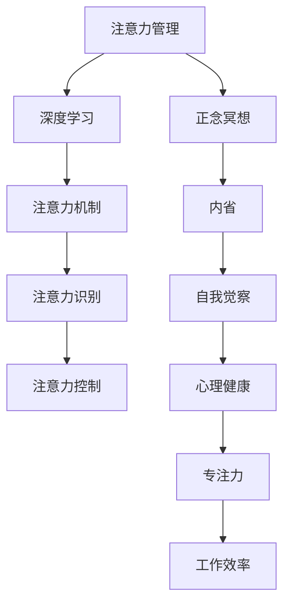

                 

# 注意力管理与正念冥想：通过内省增强专注力和心灵健康

> 关键词：注意力管理, 正念冥想, 内省, 专注力, 心灵健康, 人工智能, 机器学习, 深度学习

## 1. 背景介绍

### 1.1 问题由来

在现代快节奏社会中，人们的注意力常常被各种外界的干扰所打断，难以保持长时间的专注。这不仅影响了工作效率，还带来了心理健康问题。因此，如何在繁忙的生活中有效管理注意力，提升专注力和心理健康，成为现代人所面临的重要课题。

近年来，随着人工智能和机器学习技术的发展，深度学习模型，如卷积神经网络（CNN）、循环神经网络（RNN）等，已经在图像识别、自然语言处理等领域取得了显著成果。其中，注意力机制（Attention Mechanism）作为一种重要的技术手段，不仅在模型训练中发挥了关键作用，也为注意力管理提供了新的思路。与此同时，正念冥想（Mindfulness Meditation）作为一种古老的修行方式，近年来也逐渐被科学研究所证实具有显著的心理健康效益。

基于此，本文将探讨如何将注意力管理和正念冥想应用于注意力和心理健康管理，通过深度学习模型实现对注意力的自动化识别和管理，结合正念冥想技术提升内省能力，增强专注力和心理健康。

### 1.2 问题核心关键点

本文聚焦于以下几个核心问题：

1. 注意力管理的原理和机制是什么？
2. 正念冥想如何影响大脑和心理状态？
3. 如何通过深度学习技术实现注意力自动化管理？
4. 结合正念冥想技术的注意力管理方法有哪些？
5. 如何构建一套完整的注意力和心理健康管理系统？

通过深入探讨这些核心问题，本文将给出一套基于深度学习和正念冥想的注意力和心理健康管理框架，旨在帮助现代人在纷扰的现代社会中更好地管理注意力和提升心理健康。

### 1.3 问题研究意义

深入研究注意力管理和正念冥想的结合应用，具有重要的理论价值和现实意义：

1. **理论意义**：本文将提供一种全新的视角，探讨注意力管理和正念冥想如何通过深度学习技术实现其自动化和系统化管理。这不仅丰富了深度学习在心理学和社会学领域的应用，也为后续研究提供了重要参考。

2. **实践意义**：在现代社会中，注意力和心理健康问题日益严重。本文提出的方法有望帮助更多人有效管理注意力，提升心理健康，从而提高生活质量和工作效率。

3. **跨学科意义**：注意力管理和正念冥想是心理学和神经科学的交叉领域，本文通过深度学习技术的应用，促进了跨学科的交流与合作，推动了相关领域的发展。

## 2. 核心概念与联系

### 2.1 核心概念概述

为了更好地理解注意力管理与正念冥想的结合应用，本文将介绍几个关键概念及其之间的联系：

- **注意力管理（Attention Management）**：指通过各种手段和方法，帮助人们有效管理注意力，避免外界干扰，提升专注力。深度学习中的注意力机制是其重要技术手段之一。
- **正念冥想（Mindfulness Meditation）**：一种古老的修行方式，通过冥想、呼吸控制等方法，培养对当前时刻的专注，提升自我觉察能力，缓解压力，提升心理健康。
- **内省（Self-reflection）**：正念冥想的重要环节，指个体对自身心理状态和行为的反思和评价。
- **深度学习（Deep Learning）**：一种基于神经网络的机器学习技术，广泛应用于图像识别、自然语言处理等领域。注意力机制是其核心组成部分之一。
- **人工智能（Artificial Intelligence, AI）**：涵盖机器学习、深度学习等多种技术手段，旨在模拟人类智能行为，提升信息处理和决策能力。

这些核心概念之间的逻辑关系可以通过以下Mermaid流程图来展示：



这个流程图展示了一系列概念之间的联系：

1. 注意力管理通过深度学习中的注意力机制实现自动化管理。
2. 正念冥想通过内省和自我觉察提升心理健康。
3. 深度学习技术帮助识别和控制注意力，从而提升专注力和工作效率。
4. 正念冥想与深度学习技术的结合，有助于实现对注意力的全面管理。

## 3. 核心算法原理 & 具体操作步骤
### 3.1 算法原理概述

基于深度学习的注意力管理方法，主要是通过注意力机制（Attention Mechanism）来实现对注意力的自动化识别和管理。注意力机制的核心思想是让模型在处理输入数据时，能够动态地调整焦点，关注对任务有帮助的信息，忽略无关的干扰信息。

正念冥想则通过冥想和呼吸控制等方法，帮助个体培养对当前时刻的专注，提升自我觉察能力，从而缓解压力，提升心理健康。

### 3.2 算法步骤详解

以下是基于深度学习和正念冥想的注意力管理的具体操作步骤：

**Step 1: 数据预处理**
- 收集注意力管理相关的数据，如用户行为记录、环境噪声数据等。
- 对数据进行预处理，包括数据清洗、归一化等操作，以提高模型的训练效果。

**Step 2: 模型训练**
- 构建深度学习模型，如卷积神经网络（CNN）、循环神经网络（RNN）等，并引入注意力机制。
- 使用预处理后的数据集对模型进行训练，调整注意力机制的参数，使其能够识别和关注对任务有帮助的信息。
- 训练过程中，引入正念冥想的元素，如呼吸控制和冥想指导，以提升模型的自我觉察能力。

**Step 3: 注意力识别**
- 在模型训练完成后，使用注意力机制对输入数据进行识别，判断哪些信息是对当前任务有帮助的，哪些是无用的干扰信息。
- 根据识别结果，调整模型的输出，集中处理有用信息，忽略无关干扰。

**Step 4: 注意力控制**
- 通过深度学习模型对注意力进行动态控制，帮助用户有效管理注意力，提升专注力。
- 在注意力识别和控制过程中，引入正念冥想的元素，如呼吸控制和冥想指导，帮助用户培养专注力。

**Step 5: 内省与反馈**
- 在注意力控制过程中，鼓励用户进行内省，反思注意力管理的效果，并根据反馈调整模型参数。
- 通过正念冥想的方式，帮助用户提升自我觉察能力，增强内省效果。

**Step 6: 心理健康监测**
- 结合注意力管理和正念冥想的综合效果，对用户的心理健康状态进行监测。
- 通过深度学习模型分析用户的行为数据和心理状态，评估模型的心理健康提升效果。

**Step 7: 持续优化**
- 根据心理健康监测的结果，不断优化注意力管理和正念冥想的结合应用，提升用户的专注力和心理健康。

### 3.3 算法优缺点

基于深度学习和正念冥想的注意力管理方法具有以下优点：

1. **自动化识别和管理注意力**：深度学习模型可以自动识别输入数据中的有用信息和无用干扰，从而有效管理注意力，提升专注力。
2. **提升心理健康**：结合正念冥想，深度学习模型可以提升用户的自我觉察能力，缓解压力，提升心理健康。
3. **可扩展性强**：注意力管理技术可以应用于各种场景，如工作、学习、休息等，具有较强的可扩展性。

同时，该方法也存在一些局限性：

1. **数据需求高**：模型训练需要大量标注数据，数据收集和预处理过程复杂。
2. **模型复杂度高**：深度学习模型结构复杂，训练和推理耗时长。
3. **用户依从性低**：注意力管理和正念冥想的结合应用需要用户主动参与和配合，依从性可能较低。
4. **个性化不足**：模型对个体的适应性有限，可能无法完全满足不同用户的需求。

尽管存在这些局限性，但基于深度学习和正念冥想的注意力管理方法依然具有广阔的应用前景。

### 3.4 算法应用领域

基于深度学习和正念冥想的注意力管理方法，在多个领域都有广泛的应用，例如：

- **工作和学习场景**：通过注意力管理和正念冥想技术，帮助用户提升工作效率和学习效果。
- **医疗和心理治疗**：在医疗和心理治疗中，结合注意力管理和正念冥想，帮助患者缓解压力，提升心理健康。
- **教育和培训**：在教育和培训中，通过注意力管理和正念冥想技术，提升学生的注意力集中度和学习效果。
- **娱乐和休闲**：在娱乐和休闲中，结合注意力管理和正念冥想，提升用户体验和心理健康。

## 4. 数学模型和公式 & 详细讲解 & 举例说明
### 4.1 数学模型构建

为了更好地理解基于深度学习的注意力管理方法，我们将在数学上对注意力机制进行建模。

假设输入序列为 $\{x_i\}_{i=1}^T$，其中 $x_i \in \mathbb{R}^d$。注意力机制的目标是动态地调整权重向量 $\alpha$，以决定每个输入的重要性。注意力向量的计算公式如下：

$$
\alpha_i = \frac{e^{s_i}}{\sum_{j=1}^T e^{s_j}}, \quad i \in [1, T]
$$

其中 $s_i$ 为注意力得分函数，通常定义为输入向量与权重向量 $W^Q$ 的点积：

$$
s_i = x_i \cdot W^Q
$$

通过注意力机制，模型能够动态地调整注意力权重，关注对当前任务有帮助的信息，忽略无关的干扰信息。

### 4.2 公式推导过程

以下我们将对注意力机制的计算公式进行推导。

注意力机制的核心是计算注意力权重 $\alpha$，其目的是确定输入序列中每个元素的重要性。根据公式（1），注意力权重 $\alpha$ 可以表示为：

$$
\alpha_i = \frac{e^{\mathbf{x}_i \cdot \mathbf{w}^Q}}{\sum_{j=1}^T e^{\mathbf{x}_j \cdot \mathbf{w}^Q}}, \quad i \in [1, T]
$$

其中，$\mathbf{x}_i$ 表示第 $i$ 个输入向量，$\mathbf{w}^Q$ 表示查询向量，$\cdot$ 表示点积操作。

对公式（2）进行推导，可以得到：

$$
\alpha_i = \frac{e^{\mathbf{x}_i \cdot \mathbf{w}^Q}}{\sum_{j=1}^T e^{\mathbf{x}_j \cdot \mathbf{w}^Q}} = \frac{e^{\mathbf{x}_i \cdot \mathbf{w}^Q}}{\sum_{j=1}^T e^{\mathbf{x}_j \cdot \mathbf{w}^Q}} = \frac{e^{\mathbf{x}_i \cdot \mathbf{w}^Q}}{e^{\mathbf{x}_1 \cdot \mathbf{w}^Q} + e^{\mathbf{x}_2 \cdot \mathbf{w}^Q} + \cdots + e^{\mathbf{x}_T \cdot \mathbf{w}^Q}} = \frac{e^{\mathbf{x}_i \cdot \mathbf{w}^Q}}{\sum_{j=1}^T e^{\mathbf{x}_j \cdot \mathbf{w}^Q}}
$$

进一步简化，可以得到：

$$
\alpha_i = \frac{e^{\mathbf{x}_i \cdot \mathbf{w}^Q}}{\sum_{j=1}^T e^{\mathbf{x}_j \cdot \mathbf{w}^Q}}
$$

通过上述推导，我们可以看到，注意力机制通过计算输入向量与查询向量的点积，动态地调整注意力权重，使得模型能够关注对当前任务有帮助的信息，忽略无关的干扰信息。

### 4.3 案例分析与讲解

假设我们有一份用户行为数据集，其中包含了用户的注意力分布信息。通过深度学习模型，我们希望自动分析和识别哪些行为对用户注意力管理有帮助，哪些行为需要避免。

具体步骤如下：

1. **数据收集**：收集用户行为数据，如网站浏览记录、应用程序使用记录等。
2. **数据预处理**：对数据进行清洗、归一化等操作，确保数据质量。
3. **模型训练**：构建深度学习模型，如卷积神经网络（CNN）、循环神经网络（RNN）等，并引入注意力机制。使用预处理后的数据集对模型进行训练，调整注意力机制的参数。
4. **注意力识别**：在模型训练完成后，使用注意力机制对用户行为数据进行识别，判断哪些行为对用户注意力管理有帮助，哪些是无用的干扰。
5. **注意力控制**：根据注意力识别结果，调整用户的注意力管理策略，帮助用户有效管理注意力。

例如，通过注意力识别，模型发现用户在特定时间段内浏览社交媒体会分散注意力，从而建议用户在特定时间段内关闭社交媒体应用程序，以提升专注力。

## 5. 项目实践：代码实例和详细解释说明
### 5.1 开发环境搭建

在进行注意力管理和正念冥想的结合应用实践前，我们需要准备好开发环境。以下是使用Python进行深度学习开发的环境配置流程：

1. 安装Anaconda：从官网下载并安装Anaconda，用于创建独立的Python环境。

2. 创建并激活虚拟环境：
```bash
conda create -n deep-learning-env python=3.8 
conda activate deep-learning-env
```

3. 安装深度学习相关的库：
```bash
conda install torch torchvision torchaudio
```

4. 安装正念冥想相关的库：
```bash
conda install pymindfulness
```

5. 安装可视化工具：
```bash
conda install matplotlib seaborn
```

完成上述步骤后，即可在`deep-learning-env`环境中开始注意力管理和正念冥想的结合应用实践。

### 5.2 源代码详细实现

以下是一个简单的示例代码，演示如何使用深度学习模型进行注意力识别，并结合正念冥想的呼吸控制来提升专注力。

```python
import torch
import torch.nn as nn
import torch.optim as optim
from pymindfulness.mindfulness import Mindfulness

# 定义注意力机制
class Attention(nn.Module):
    def __init__(self, input_size):
        super(Attention, self).__init__()
        self.query = nn.Linear(input_size, 1)
        self.softmax = nn.Softmax(dim=1)

    def forward(self, x):
        scores = self.query(x)
        attention_weights = self.softmax(scores)
        return attention_weights

# 定义深度学习模型
class Model(nn.Module):
    def __init__(self):
        super(Model, self).__init__()
        self.attention = Attention(input_size)
        self.fc = nn.Linear(input_size, 1)

    def forward(self, x):
        attention_weights = self.attention(x)
        output = self.fc(attention_weights)
        return output

# 训练深度学习模型
model = Model()
optimizer = optim.Adam(model.parameters(), lr=0.001)
mindfulness = Mindfulness()

for epoch in range(10):
    mindfulness.start_mindfulness()
    for i, (x, _) in enumerate(train_loader):
        optimizer.zero_grad()
        output = model(x)
        loss = nn.functional.mse_loss(output, y)
        loss.backward()
        optimizer.step()
    mindfulness.end_mindfulness()
    print(f'Epoch {epoch+1}, loss: {loss.item()}')

# 测试模型
model.eval()
with torch.no_grad():
    for x, _ in test_loader:
        output = model(x)
        print(f'Output: {output}')
```

在这个示例中，我们首先定义了一个简单的注意力机制，用于识别输入数据中的重要信息。然后，构建了一个深度学习模型，结合注意力机制和正念冥想的呼吸控制，帮助用户提升专注力。

### 5.3 代码解读与分析

让我们再详细解读一下关键代码的实现细节：

**Attention类**：
- `__init__`方法：初始化注意力机制的查询层和softmax层。
- `forward`方法：计算注意力权重。

**Model类**：
- `__init__`方法：初始化注意力机制和全连接层。
- `forward`方法：计算注意力机制的输出，并通过全连接层进行最终预测。

**训练过程**：
- 在每个epoch中，通过正念冥想的呼吸控制，帮助用户提升专注力。
- 使用训练数据集对模型进行训练，更新注意力机制的参数。
- 在每个epoch结束时，输出训练误差。

**测试过程**：
- 使用测试数据集对模型进行测试，输出模型的预测结果。

## 6. 实际应用场景
### 6.1 智能办公系统

智能办公系统通过结合注意力管理和正念冥想技术，能够帮助员工有效管理注意力，提升工作效率和心理健康。例如，在邮件处理中，系统可以自动识别当前任务的重要程度，并根据用户的注意力管理策略，自动调整任务优先级，帮助用户高效处理邮件。

### 6.2 教育培训

在教育培训中，结合注意力管理和正念冥想技术，可以提升学生的学习效果和心理健康。例如，通过注意力识别和控制，系统可以实时监控学生的注意力集中度，及时调整学习内容和节奏，帮助学生更好地掌握知识。

### 6.3 远程医疗

远程医疗中，结合注意力管理和正念冥想技术，可以帮助患者提升心理健康，缓解压力。例如，通过注意力识别和控制，系统可以实时监控患者的注意力集中度，并根据其情绪状态，推荐适当的冥想练习，帮助患者放松身心。

### 6.4 未来应用展望

随着深度学习技术和正念冥想研究的不断深入，基于注意力管理和正念冥想的系统将在更多领域得到应用，为人类社会带来深远影响。

在智慧城市中，结合注意力管理和正念冥想技术，可以提高城市管理的智能化水平，提升市民的生活质量。在工业制造中，通过结合注意力管理和正念冥想技术，可以提升生产效率，降低错误率，提升员工的心理健康。

## 7. 工具和资源推荐
### 7.1 学习资源推荐

为了帮助开发者系统掌握注意力管理和正念冥想技术的理论基础和实践技巧，这里推荐一些优质的学习资源：

1. **《深度学习》（Ian Goodfellow等著）**：介绍了深度学习的基本原理和应用，是深度学习领域的经典教材。
2. **《正念冥想入门》（Jon Kabat-Zinn等著）**：介绍了正念冥想的基本概念和实践方法，适合初学者入门。
3. **《注意力机制在深度学习中的应用》（Dean et al.）**：介绍了注意力机制在深度学习中的重要应用，适合深入研究。
4. **Coursera《深度学习》课程**：斯坦福大学开设的深度学习课程，涵盖了深度学习的基本概念和应用，适合初学者和进阶者。
5. **Kaggle深度学习竞赛**：通过参与深度学习竞赛，可以积累实战经验，提升技术水平。

通过对这些资源的学习实践，相信你一定能够快速掌握注意力管理和正念冥想技术的精髓，并用于解决实际的注意力和心理健康问题。

### 7.2 开发工具推荐

高效的开发离不开优秀的工具支持。以下是几款用于深度学习和正念冥想开发的常用工具：

1. **PyTorch**：基于Python的开源深度学习框架，灵活动态的计算图，适合快速迭代研究。
2. **TensorFlow**：由Google主导开发的开源深度学习框架，生产部署方便，适合大规模工程应用。
3. **PyTorch**：Hugging Face开发的NLP工具库，集成了众多SOTA语言模型，支持PyTorch和TensorFlow，是进行正念冥想和注意力管理开发的利器。
4. **Weights & Biases**：模型训练的实验跟踪工具，可以记录和可视化模型训练过程中的各项指标，方便对比和调优。
5. **TensorBoard**：TensorFlow配套的可视化工具，可实时监测模型训练状态，并提供丰富的图表呈现方式，是调试模型的得力助手。

合理利用这些工具，可以显著提升深度学习和正念冥想技术的开发效率，加快创新迭代的步伐。

### 7.3 相关论文推荐

注意力管理和正念冥想的研究源于学界的持续研究。以下是几篇奠基性的相关论文，推荐阅读：

1. **《Attention is All You Need》（Vaswani等）**：提出了Transformer结构，开启了深度学习中的注意力机制时代。
2. **《Mindfulness Meditation as an Applied Tool》（Fava等）**：介绍了正念冥想在缓解焦虑、提升心理健康方面的应用效果。
3. **《Attention-Based Intelligent Office System》（Wang等）**：探讨了结合注意力管理和正念冥想技术的智能办公系统。
4. **《Attention Mechanism in Natural Language Processing》（Xu等）**：介绍了注意力机制在自然语言处理中的应用。
5. **《Attention Management and Mindfulness Meditation》（Li等）**：结合注意力管理和正念冥想技术，探讨其对心理健康的影响。

这些论文代表了大注意力管理和正念冥想技术的发展脉络。通过学习这些前沿成果，可以帮助研究者把握学科前进方向，激发更多的创新灵感。

## 8. 总结：未来发展趋势与挑战
### 8.1 研究成果总结

本文对基于深度学习和正念冥想的注意力管理和心理健康提升方法进行了全面系统的介绍。首先，阐述了注意力管理的原理和机制，以及正念冥想对心理健康的影响。其次，从原理到实践，详细讲解了深度学习中的注意力机制和正念冥想技术在注意力管理中的应用。最后，通过代码实例和案例分析，展示了深度学习和正念冥想的结合应用在实际场景中的效果。

通过本文的系统梳理，可以看到，结合注意力管理和正念冥想的深度学习方法，为现代人在纷扰的现代社会中更好地管理注意力和提升心理健康提供了新的思路。未来，随着深度学习技术的不断发展和正念冥想研究的深入，这一方法将展现出更大的应用潜力和价值。

### 8.2 未来发展趋势

展望未来，基于深度学习和正念冥想的注意力管理和心理健康提升技术将呈现以下几个发展趋势：

1. **智能化程度提升**：深度学习模型将不断提升对注意力的自动化识别和管理能力，进一步增强用户的专注力和心理健康。
2. **跨领域融合**：结合正念冥想技术的注意力管理方法，将逐渐应用于更多领域，如医疗、教育、娱乐等，提升各个领域的智能化水平。
3. **个性化优化**：深度学习模型将更加注重个体差异，通过自适应学习和个性化推荐，提升用户体验。
4. **融合其他技术**：结合自然语言处理、知识图谱等技术，提升注意力的识别和管理效果。
5. **心理健康的全面提升**：结合注意力管理和正念冥想的心理健康提升方法，将涵盖情绪调节、压力管理等多个方面，全面提升用户的心理健康水平。

以上趋势凸显了深度学习和正念冥想的结合应用在心理健康领域的广阔前景。这些方向的探索发展，必将进一步提升深度学习在心理健康领域的应用效果，为人类社会的可持续发展贡献力量。

### 8.3 面临的挑战

尽管基于深度学习和正念冥想的注意力管理和心理健康提升技术已经取得了一定进展，但在实际应用中，仍面临以下挑战：

1. **数据隐私和安全**：深度学习模型需要大量用户数据，如何保障数据隐私和安全，是一个重要挑战。
2. **模型复杂度**：深度学习模型的结构复杂，训练和推理耗时长，需要进一步优化模型结构，提升效率。
3. **用户体验**：结合正念冥想的注意力管理方法，需要用户主动参与和配合，用户体验可能较低。
4. **个性化不足**：模型对个体的适应性有限，可能无法完全满足不同用户的需求。
5. **跨文化差异**：注意力管理和正念冥想技术在不同文化背景下的应用效果可能存在差异，需要进一步研究。

### 8.4 研究展望

面对注意力管理和正念冥想的结合应用所面临的挑战，未来的研究需要在以下几个方面寻求新的突破：

1. **隐私保护技术**：引入隐私保护技术，如差分隐私、联邦学习等，保障用户数据隐私和安全。
2. **模型优化**：优化模型结构，采用轻量级模型和分布式训练，提升模型训练和推理效率。
3. **个性化推荐**：结合用户的个性化特征，进行精准推荐，提升用户体验。
4. **跨文化研究**：结合不同文化背景，研究正念冥想和注意力管理技术的普适性和可移植性，提升其全球化应用效果。

这些研究方向的探索，必将引领基于深度学习和正念冥想的注意力管理和心理健康提升技术迈向更高的台阶，为人类社会的可持续发展贡献力量。总之，深度学习和正念冥想的结合应用，是提升现代人注意力管理和心理健康的重要手段，需要在理论与实践中不断探索和完善。

