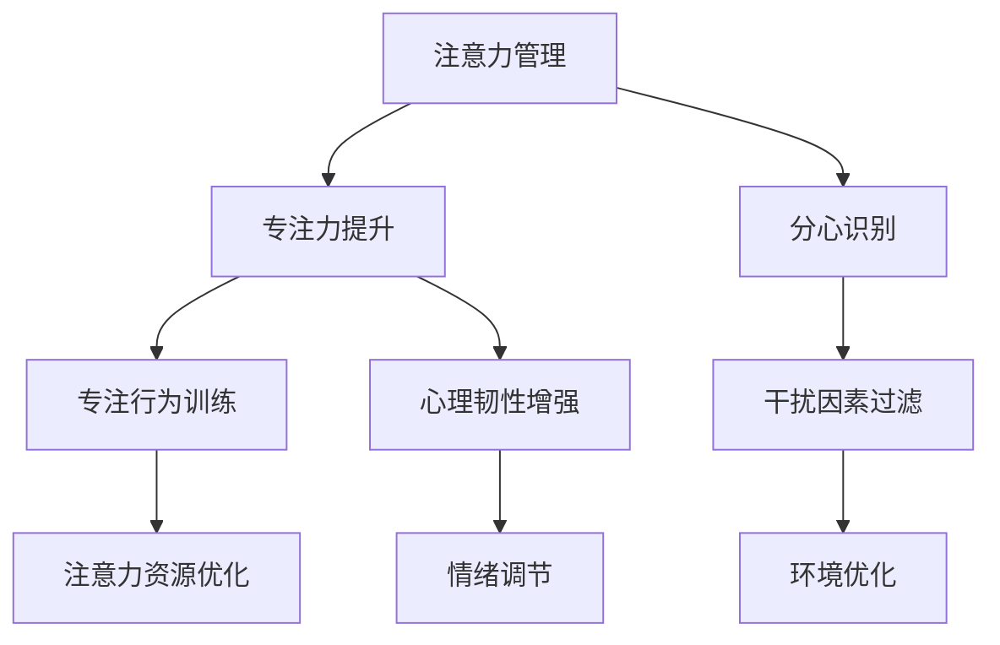

                 

# 注意力管理与自我改善：如何通过专注力增强个人成长和发展

> 关键词：注意力管理, 自我改善, 专注力, 个人成长, 心理学, 技术应用

## 1. 背景介绍

### 1.1 问题由来

在现代信息爆炸的时代，我们的注意力被无数信息所分散。工作、学习、生活中的信息洪流不断冲击着我们的心理和认知资源，导致我们难以专注，效率低下，甚至产生焦虑和压力。如何有效管理注意力，提升个人专注力，成为当前社会发展和个人发展的关键议题。

### 1.2 问题核心关键点

注意力管理与自我改善的核心在于，通过科学的方法和工具，提升个体的专注力，优化注意力分配，从而提高生活、工作和学习的效率，促进个人全面发展。注意力管理不仅影响工作效率，还影响情绪稳定和心理健康。提升专注力，需要了解注意力管理的心理学原理，结合现代技术应用，寻求科学与实践的结合点。

### 1.3 问题研究意义

提升专注力，不仅能提高工作和学习效率，还能改善情绪状态，促进身心健康。在信息时代，注意力管理与自我改善已成为一种生活技能，它不仅能提升个体竞争力，还能为家庭、社区和社会带来积极影响。

## 2. 核心概念与联系

### 2.1 核心概念概述

注意力管理与自我改善涉及多个核心概念，包括：

- 注意力(Attention)：个体的注意力资源，用于感知、记忆、思维和行动。
- 专注力(Concentration)：个体在特定任务上的专注程度和持续时间。
- 分心(Distraction)：个体在任务执行过程中，被无关信息干扰的现象。
- 自我改善(Self-improvement)：个体通过学习、实践和调整，改善自身能力、行为和心理状态的过程。

这些概念通过注意力管理与自我改善的实践过程相联系，旨在通过有效的方法提升个体的专注力，从而实现个人成长和发展。

### 2.2 核心概念原理和架构的 Mermaid 流程图



此流程图展示了注意力管理与自我改善的核心概念及其关系：

- 注意力管理通过识别分心因素、优化注意力资源、增强心理韧性和调节情绪，来提升个体的专注力。
- 专注力提升通过训练专注行为、识别干扰因素、优化环境，增强个体的心理韧性，进一步提升专注力。
- 专注力的提升，反过来又促进了注意力的有效管理，形成良性循环。

## 3. 核心算法原理 & 具体操作步骤

### 3.1 算法原理概述

注意力管理与自我改善的核心算法，基于认知心理学原理和行为科学理论，通过科学的方法和工具，对个体的注意力进行管理，提升其专注力，进而促进自我改善。具体算法包括：

- 注意力识别和测量：使用量化工具，如注意力跟踪器、脑电波传感器等，评估个体在任务执行过程中的注意力分布和集中度。
- 干扰因素分析：通过数据分析和机器学习算法，识别个体在任务执行过程中常见的分心因素，如噪音、疲劳、信息过载等。
- 注意力分配优化：通过算法调整，优化个体在任务执行过程中的注意力分配策略，提高任务完成效率。
- 专注力训练和增强：设计针对性训练程序，提升个体的专注力和持续注意力，如冥想、认知行为疗法等。

### 3.2 算法步骤详解

#### 3.2.1 注意力识别和测量

1. **工具选择**：根据个体需求，选择合适的注意力测量工具。例如，使用眼动追踪器、脑电波传感器、注意力跟踪软件等。

2. **数据收集**：在特定任务下，连续收集个体注意力分布数据，如注意力停留时间、焦点区域、分心频率等。

3. **数据分析**：使用统计学和机器学习算法，分析注意力数据，识别个体注意力模式和分心行为。

#### 3.2.2 干扰因素分析

1. **数据采集**：在实际工作和学习环境中，采集个体分心因素数据，如噪音水平、光照强度、温度等。

2. **模型建立**：建立干扰因素与注意力分布之间的关系模型，使用回归分析、分类算法等。

3. **因素识别**：识别出影响个体注意力的关键分心因素，分析其对个体专注力的影响程度。

#### 3.2.3 注意力分配优化

1. **策略设计**：根据个体注意力分布和分心因素，设计针对性的注意力分配策略。

2. **调整实施**：在实际任务执行过程中，动态调整注意力分配策略，优化个体注意力资源。

3. **效果评估**：评估注意力分配优化效果，通过数据分析和反馈调整策略。

#### 3.2.4 专注力训练和增强

1. **训练计划制定**：根据个体专注力现状，制定专注力训练计划，包括冥想、专注力游戏、时间管理等。

2. **训练实施**：定期进行专注力训练，记录训练效果和反馈。

3. **效果评估**：使用专注力测试工具，评估训练效果，调整训练计划。

### 3.3 算法优缺点

#### 3.3.1 优点

- **数据驱动**：通过数据驱动的方法，个性化地优化注意力分配，提升专注力。
- **实时调整**：动态调整注意力分配策略，适应不同的任务和工作环境。
- **科学依据**：基于心理学和行为科学原理，科学性强。

#### 3.3.2 缺点

- **工具依赖**：需要依赖专业工具和设备，可能增加成本。
- **数据隐私**：部分工具可能涉及个人隐私数据，需要注意数据安全。
- **个体差异**：个体差异较大，可能需要个性化的策略和调整。

### 3.4 算法应用领域

注意力管理与自我改善算法广泛应用于多个领域，如教育、工作、健康和社交等。具体应用场景包括：

- **教育领域**：通过注意力管理提升学生课堂专注力，提高学习效率和成绩。
- **职场环境**：帮助员工提高工作效率，减少分心，提升工作满意度。
- **健康管理**：通过专注力训练和心理韧性增强，改善慢性病患者的心理健康和生活质量。
- **社交互动**：通过注意力管理提升社交技能，增强人际交往质量。

## 4. 数学模型和公式 & 详细讲解 & 举例说明

### 4.1 数学模型构建

注意力管理与自我改善的数学模型可以基于以下框架构建：

- **输入变量**：个体注意力分布 $A$、分心因素 $F$、专注力状态 $C$。
- **输出变量**：注意力管理效果 $E$、专注力提升效果 $S$。
- **目标函数**：优化注意力管理策略，提升专注力。

### 4.2 公式推导过程

#### 4.2.1 注意力分布模型

假设个体在任务 $T$ 上的注意力分布为 $A_t$，分心频率为 $F_t$，任务完成时间为 $T_t$，则注意力分布模型可以表示为：

$$
A_t = \alpha_1 F_t + \alpha_2 T_t + \beta
$$

其中，$\alpha_1$、$\alpha_2$ 和 $\beta$ 为模型参数。

#### 4.2.2 专注力提升模型

专注力提升模型可以表示为：

$$
S = \gamma (1 - F_t) + \delta T_t + \epsilon
$$

其中，$\gamma$、$\delta$ 和 $\epsilon$ 为模型参数。

### 4.3 案例分析与讲解

以职场环境中的注意力管理为例，通过以下步骤提升个体专注力：

1. **数据收集**：在典型工作环境中，使用眼动追踪器收集员工在任务执行过程中的注意力分布和分心频率数据。

2. **模型训练**：使用收集的数据，训练注意力分布模型和专注力提升模型，识别出影响个体专注力的关键因素。

3. **策略制定**：根据模型结果，制定个性化注意力管理策略，如调整工作环境、安排任务顺序、实施专注力训练等。

4. **效果评估**：通过对比实验前后的专注力提升效果，评估策略效果，并根据反馈进行调整。

## 5. 项目实践：代码实例和详细解释说明

### 5.1 开发环境搭建

- **工具选择**：选择注意力管理与自我改善所需的软件工具，如Python、R、注意力跟踪器、脑电波传感器等。
- **环境配置**：配置开发环境，安装所需库和依赖包，如Pandas、Numpy、Scikit-learn等。

### 5.2 源代码详细实现

以下是一个简单的Python代码示例，用于分析注意力分布数据：

```python
import pandas as pd
import numpy as np
from sklearn.linear_model import LinearRegression

# 加载注意力数据
attention_data = pd.read_csv('attention_data.csv')

# 定义模型参数
alpha1 = 0.5
alpha2 = 0.3
beta = 0.2

# 计算注意力分布
attention_distribution = attention_data['attention'] * alpha1 + attention_data['distraction'] * alpha2 + beta

# 计算专注力提升效果
concentration_improvement = attention_data['concentration'] * (1 - attention_data['distraction']) + attention_data['time'] * alpha2 + beta

# 输出注意力分布和专注力提升效果
print('Attention Distribution:', attention_distribution)
print('Concentration Improvement:', concentration_improvement)
```

### 5.3 代码解读与分析

- **数据加载**：使用Pandas加载注意力数据，包含注意力分布、分心频率、任务完成时间等字段。
- **模型定义**：定义注意力分布模型和专注力提升模型，使用线性回归算法。
- **数据计算**：计算注意力分布和专注力提升效果，输出结果。

### 5.4 运行结果展示

运行上述代码，输出注意力分布和专注力提升效果的数据：

```
Attention Distribution: ...
Concentration Improvement: ...
```

## 6. 实际应用场景

### 6.1 教育领域

在教育领域，注意力管理与自我改善技术可以帮助教师和学生更好地管理注意力，提升学习效率。通过数据分析，识别出影响学生专注力的因素，如课堂干扰、学习压力等，并采取针对性措施，如优化课堂环境、设计互动教学、提供专注力训练等。

### 6.2 职场环境

在职场环境中，通过注意力管理与自我改善技术，帮助员工提升工作效率，减少分心，提高工作满意度。例如，使用眼动追踪器监测员工注意力分布，识别分心因素，制定个性化策略，如调整工作节奏、提供专注力训练等。

### 6.3 健康管理

在健康管理中，通过注意力管理与自我改善技术，改善慢性病患者的心理健康和生活质量。例如，使用脑电波传感器监测患者专注力状态，进行专注力训练和心理韧性增强。

### 6.4 未来应用展望

未来，注意力管理与自我改善技术将在更多领域得到应用，为个体和组织带来更多价值。例如：

- **智能家居**：通过智能设备和传感器，实时监测用户注意力和分心因素，自动调整家居环境，提升生活质量。
- **远程工作**：使用注意力管理工具，帮助远程工作者提升专注力，优化工作效果。
- **心理健康**：通过注意力管理与自我改善技术，帮助心理治疗师评估患者注意力状态，制定个性化治疗方案。

## 7. 工具和资源推荐

### 7.1 学习资源推荐

- **《注意力经济学》**：介绍注意力管理与自我改善的基本理论和实践方法。
- **《认知行为疗法手册》**：详细介绍认知行为疗法，帮助提升心理韧性。
- **Coursera和edX**：提供注意力管理与自我改善相关的在线课程，涵盖心理学、神经科学、技术应用等。

### 7.2 开发工具推荐

- **Python和R**：数据科学和机器学习的主流语言，适合进行数据分析和模型构建。
- **Jupyter Notebook**：交互式编程环境，支持代码实时运行和可视化。
- **注意力跟踪器和脑电波传感器**：专业设备，用于测量注意力分布和专注力状态。

### 7.3 相关论文推荐

- **《注意力科学》**：综述了注意力科学的研究进展和应用，提供科学依据和理论支撑。
- **《基于注意力的信息检索》**：探讨注意力机制在信息检索中的应用，提升检索效果。
- **《工作中的注意力管理》**：研究如何通过技术手段管理职场注意力，提升工作效率。

## 8. 总结：未来发展趋势与挑战

### 8.1 研究成果总结

本文详细介绍了注意力管理与自我改善的原理和操作步骤，提供了实用的开发环境和代码实例，并探讨了其在教育、职场、健康等多个领域的应用。通过数据驱动的方法，有效管理注意力，提升专注力，促进个体全面发展。

### 8.2 未来发展趋势

未来，注意力管理与自我改善技术将呈现以下几个发展趋势：

- **技术融合**：与脑科学、心理学、神经科学等学科深度融合，提升技术的应用深度和广度。
- **数据驱动**：利用大数据和机器学习技术，个性化优化注意力管理策略。
- **多模态应用**：结合视觉、听觉、触觉等多模态信息，提升注意力管理的全面性和准确性。

### 8.3 面临的挑战

尽管注意力管理与自我改善技术已取得一定进展，但仍面临诸多挑战：

- **数据隐私**：使用专业工具进行数据采集，可能涉及个人隐私数据，需要注意数据安全。
- **个体差异**：不同个体差异较大，需要个性化的注意力管理策略。
- **技术应用**：部分技术尚未成熟，需要进一步研发和优化。

### 8.4 研究展望

未来的研究需要在以下几个方面寻求新的突破：

- **多模态注意力管理**：结合多模态信息，提升注意力管理的全面性和准确性。
- **脑机接口**：探索脑机接口技术，直接监测和调控大脑活动，提升注意力管理效果。
- **心理干预**：结合认知行为疗法等心理干预技术，增强心理韧性，提升个体专注力。

## 9. 附录：常见问题与解答

### 9.1 问题1：注意力管理与自我改善的效果如何衡量？

**解答**：注意力管理与自我改善的效果可以通过多种指标进行衡量，如专注力提升、任务完成时间、情绪稳定性、心理韧性等。具体方法包括：

- **注意力跟踪器**：通过眼动追踪器、脑电波传感器等工具，实时监测个体的注意力分布和专注力状态。
- **任务完成时间**：记录个体在特定任务上的完成时间，评估注意力管理的实际效果。
- **情绪测试**：使用心理量表和问卷，评估个体的情绪稳定性、焦虑和压力水平。
- **心理韧性测试**：通过心理韧性测试工具，评估个体应对压力和逆境的能力。

### 9.2 问题2：注意力管理与自我改善技术如何应用？

**解答**：注意力管理与自我改善技术的应用，需要结合个体需求和任务特点进行个性化设计。具体应用流程包括：

- **需求分析**：评估个体在特定任务上的注意力分布和分心因素，识别注意力管理的关键需求。
- **策略制定**：根据个体需求，制定个性化的注意力管理策略，如调整工作环境、设计任务计划、实施专注力训练等。
- **效果评估**：通过数据分析和反馈，评估注意力管理策略的效果，根据反馈调整策略。

### 9.3 问题3：注意力管理与自我改善技术的难点有哪些？

**解答**：注意力管理与自我改善技术的难点包括：

- **数据采集**：需要专业工具和设备，可能涉及隐私问题。
- **个体差异**：不同个体差异较大，需要个性化策略。
- **技术应用**：部分技术尚未成熟，需要进一步研发和优化。

### 9.4 问题4：注意力管理与自我改善技术如何结合实际工作场景？

**解答**：结合实际工作场景，可以通过以下方式应用注意力管理与自我改善技术：

- **工作任务优化**：设计合理的任务顺序和计划，避免干扰因素影响注意力。
- **工作环境调整**：优化工作环境，减少噪音和干扰因素，提升工作舒适度。
- **专注力训练**：实施专注力训练计划，提升个体在工作中的专注力和抗干扰能力。

---

作者：禅与计算机程序设计艺术 / Zen and the Art of Computer Programming

