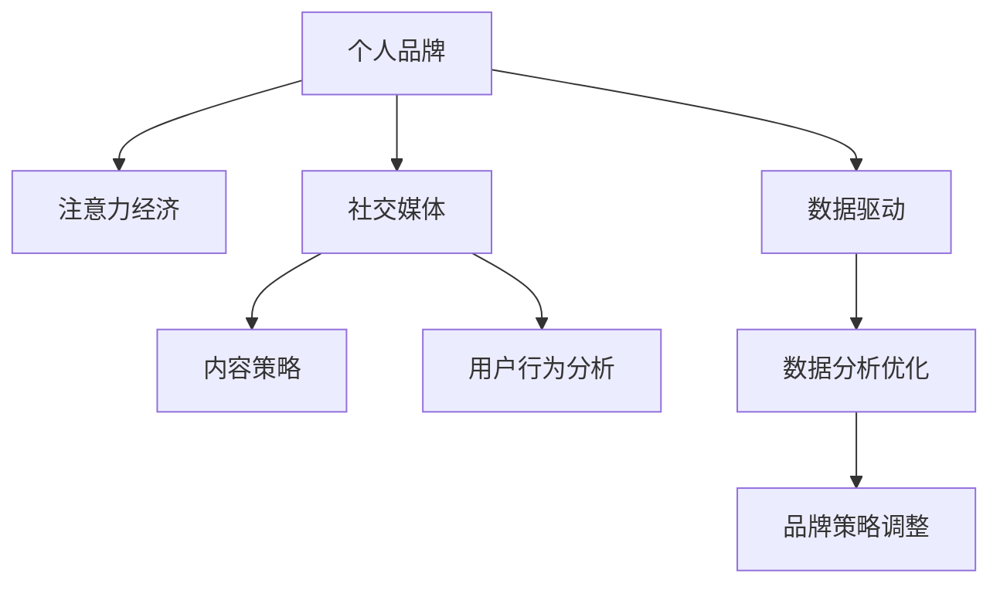

                 

# 注意力经济下的个人品牌塑造策略

> 关键词：个人品牌塑造, 注意力经济, 社交媒体, 数据驱动, 内容策略, 用户行为分析

## 1. 背景介绍

在当今数字化时代，个人品牌的塑造已经成为了一项重要的战略任务。随着互联网的普及和社交媒体的兴起，人们获取信息和娱乐的渠道日益多元化，个人在网络上的可见度和影响力变得越来越重要。尤其是在注意力稀缺的互联网环境中，如何有效吸引和保持用户的关注，成为品牌建设的关键。

### 1.1 问题由来

个人品牌的塑造并非易事。首先，需要理解“注意力经济”的概念。在注意力经济中，注意力被视为一种稀缺资源，需要精心策划和营销才能吸引并留住它。随着内容生产者数量的激增，如何在海量信息中脱颖而出，成为个人品牌塑造的核心问题。

其次，社交媒体的发展为个人品牌的塑造提供了新的机会。诸如微博、微信、抖音等社交平台，通过内容发布、互动评论、直播等多种形式，使得个人品牌的影响力得以迅速扩散。然而，如何高效利用社交媒体的资源，制定切实可行的策略，仍需深入研究。

最后，个人品牌塑造需要结合大数据和用户行为分析，通过精准的定位和内容推送，实现个性化营销。如何在海量用户数据中找到目标群体，并提供他们真正感兴趣的内容，是个人品牌塑造的关键。

### 1.2 问题核心关键点

个人品牌塑造的核心在于如何通过数据驱动，在注意力经济中建立独特且可信的形象。核心关键点包括：

- **用户行为分析**：通过分析用户的行为数据，了解其兴趣和偏好，从而制定更加精准的内容策略。
- **内容策略制定**：基于用户行为分析结果，制定符合用户期望的内容发布策略，提高用户粘性。
- **社交媒体营销**：利用社交媒体的传播特性，实现内容的广泛传播和深度互动。
- **数据分析优化**：持续监控和分析数据，及时调整品牌策略，实现持续优化。

## 2. 核心概念与联系

### 2.1 核心概念概述

为更好地理解个人品牌塑造的策略，本节将介绍几个密切相关的核心概念：

- **个人品牌**：指个体在公众心中的形象和声誉，包括其专业知识、价值观、行为准则等。
- **注意力经济**：指在信息过载的时代，注意力成为一种重要的经济资源，品牌需要通过吸引和维持用户的注意力来实现其价值。
- **社交媒体**：指基于网络技术的平台，如微博、微信、抖音等，通过内容分享和互动，实现个人品牌的传播和互动。
- **数据驱动**：指通过收集、分析和利用数据，制定和优化品牌策略的过程。
- **内容策略**：指品牌通过精心策划的内容，吸引和保持用户关注，建立品牌形象的过程。
- **用户行为分析**：指通过数据分析技术，理解用户行为模式和偏好，实现精准营销的过程。

这些概念之间的逻辑关系可以通过以下Mermaid流程图来展示：



这个流程图展示了个体品牌塑造的主要流程：

1. 个人品牌通过社交媒体和内容策略进行传播。
2. 数据驱动帮助分析用户行为，优化内容策略。
3. 数据分析优化持续监控效果，及时调整策略。

这些概念共同构成了个人品牌塑造的完整框架，通过数据驱动和内容策略的协同工作，实现品牌的精准定位和有效传播。

## 3. 核心算法原理 & 具体操作步骤
### 3.1 算法原理概述

个人品牌塑造的核心在于通过数据驱动和内容策略，在社交媒体上吸引和保持用户的注意力。具体来说，包括以下几个关键步骤：

1. **用户行为分析**：收集和分析用户的数据，了解其兴趣和偏好。
2. **内容策略制定**：基于用户行为分析结果，制定符合用户期望的内容发布策略。
3. **社交媒体营销**：通过社交媒体的传播特性，实现内容的广泛传播和深度互动。
4. **数据分析优化**：持续监控和分析数据，及时调整品牌策略。

### 3.2 算法步骤详解

以下详细介绍个人品牌塑造的具体步骤：

**Step 1: 用户行为分析**

1. **数据收集**：通过社交媒体API、网站分析工具等，收集用户的行为数据，如浏览记录、互动数据、评论内容等。

2. **数据预处理**：对收集到的数据进行清洗和处理，去除噪音和冗余信息。

3. **数据分析**：使用统计分析和机器学习技术，挖掘用户的行为模式和偏好。常见的方法包括：
   - **聚类分析**：将用户分为不同的兴趣群体。
   - **关联规则挖掘**：发现用户行为之间的关联性。
   - **情感分析**：分析用户对内容的情感倾向。

**Step 2: 内容策略制定**

1. **内容类型选择**：基于用户行为分析结果，选择用户最感兴趣的内容类型，如视频、图文、直播等。

2. **内容创作**：创作符合用户期望的内容，如解决用户痛点、提供有趣的知识、展示专业技能等。

3. **内容发布计划**：制定内容发布的时间、频率和渠道，实现内容的有效传播。

**Step 3: 社交媒体营销**

1. **平台选择**：选择合适的社交媒体平台，如微博、微信、抖音等，根据平台特点制定不同的营销策略。

2. **内容互动**：通过评论、点赞、分享等互动形式，增强用户粘性和互动深度。

3. **广告投放**：利用社交媒体的广告功能，精准推送内容，扩大品牌覆盖面。

**Step 4: 数据分析优化**

1. **效果监控**：实时监控内容发布的效果，如浏览量、互动率、转化率等。

2. **数据分析**：对收集到的效果数据进行深入分析，了解用户反馈和行为变化。

3. **策略调整**：根据数据分析结果，及时调整内容策略和发布计划，实现持续优化。

### 3.3 算法优缺点

个人品牌塑造的数据驱动策略具有以下优点：

1. **精准定位**：通过用户行为分析，能够精准定位目标用户群体，实现个性化营销。
2. **内容高效**：基于用户期望的内容创作，能够提高内容的吸引力和传播效果。
3. **效果可监控**：通过数据分析监控效果，及时调整策略，实现持续优化。

然而，该策略也存在以下缺点：

1. **数据隐私问题**：用户行为数据的收集和分析涉及用户隐私保护，需要谨慎处理。
2. **技术门槛高**：需要一定的数据分析和机器学习知识，普通用户难以操作。
3. **算法复杂**：数据驱动策略依赖于复杂的算法模型，容易出现误判和偏差。

### 3.4 算法应用领域

个人品牌塑造的数据驱动策略在多个领域中都有广泛应用，例如：

- **电商**：通过用户行为分析，推荐个性化的商品，提高销售转化率。
- **教育**：根据学生的学习行为数据，提供个性化的教学内容和建议，提高学习效果。
- **金融**：通过用户交易行为分析，推荐个性化的理财产品，提高用户粘性和满意度。
- **医疗**：根据患者的健康行为数据，提供个性化的健康建议，提高患者依从性和治疗效果。
- **媒体**：通过用户阅读行为分析，推送个性化的内容，提高用户停留时间和互动率。

除了上述这些经典领域外，个人品牌塑造的数据驱动策略也在更多场景中得到应用，如旅游、娱乐、公共服务等，为不同行业带来了新的发展机遇。

## 4. 数学模型和公式 & 详细讲解 & 举例说明
### 4.1 数学模型构建

为更好地理解个人品牌塑造的策略，本节将通过数学语言对数据驱动策略进行更加严格的刻画。

记用户集合为 $U$，行为集合为 $B$，行为数据为 $\mathcal{D}=\{(u,b)\}_{i=1}^N$，其中 $u \in U$ 为某个用户，$b \in B$ 为某个行为。假设用户 $u$ 对行为 $b$ 的兴趣度为 $p_{ub} \in [0,1]$，即用户 $u$ 对行为 $b$ 的偏好程度。

定义兴趣度矩阵为 $P=[p_{ub}]_{N\times M}$，其中 $N$ 为用户数，$M$ 为行为数。则用户行为分析的目标是最大化用户对行为的兴趣度，即：

$$
\max_{P} \sum_{u=1}^N \sum_{b=1}^M p_{ub}
$$

### 4.2 公式推导过程

假设我们通过聚类算法将用户分为 $K$ 个兴趣群体，每个群体的兴趣度向量为 $P_k=[p_{ukb}]_{N_k\times M}$，其中 $N_k$ 为第 $k$ 个群体的用户数。则问题转化为最大化每个群体的兴趣度总和：

$$
\max_{P_k} \sum_{k=1}^K \sum_{b=1}^M p_{ukb}
$$

使用机器学习算法，如协同过滤、深度学习等，对每个群体的兴趣度向量进行优化。常见的方法包括：

- **协同过滤**：基于用户-物品的评分矩阵，推荐与用户行为相似的物品。
- **深度学习**：通过神经网络模型，学习用户和行为的表示，实现兴趣度预测。

在得到每个群体的兴趣度向量后，可以根据不同群体的特点，制定相应的内容策略和发布计划。例如，对于科技爱好者群体，可以发布前沿科技新闻和产品评测；对于美食爱好者群体，可以发布美食食谱和旅游攻略。

### 4.3 案例分析与讲解

假设某博主运营抖音账号，关注度高，希望通过数据驱动策略提高其影响力。博主首先收集了用户的互动数据和观看记录，使用机器学习算法对用户进行了聚类分析，得到三个兴趣群体：科技爱好者、时尚达人、旅行家。

针对每个兴趣群体，博主制定了不同的内容策略：

1. **科技爱好者群体**：发布前沿科技视频和产品评测，使用分析工具监控观看量、互动率和转发率。

2. **时尚达人群体**：分享最新的时尚资讯和穿搭技巧，通过评论互动和直播互动，增强用户粘性。

3. **旅行家群体**：发布旅行攻略和目的地的实地视频，利用广告投放提高品牌覆盖面。

通过持续监控和数据分析，博主及时调整了内容策略和发布计划，实现了用户粘性和品牌影响力的持续提升。

## 5. 项目实践：代码实例和详细解释说明
### 5.1 开发环境搭建

在进行数据驱动的个人品牌塑造实践前，我们需要准备好开发环境。以下是使用Python进行Kaggle平台数据驱动策略实践的环境配置流程：

1. 安装Kaggle平台：从官网下载并安装Kaggle平台，获取公开数据集和机器学习库。

2. 创建并激活虚拟环境：
```bash
conda create -n data_strat_env python=3.8 
conda activate data_strat_env
```

3. 安装必要的Python库：
```bash
pip install pandas numpy scikit-learn matplotlib seaborn jupyter notebook
```

4. 安装Kaggle平台API和数据处理工具：
```bash
pip install kaggle kaggle-datasets
```

完成上述步骤后，即可在`data_strat_env`环境中开始数据驱动的个人品牌塑造实践。

### 5.2 源代码详细实现

以下是一个基于Kaggle平台，通过用户行为分析进行个人品牌塑造的Python代码实现。

首先，定义数据集和数据预处理函数：

```python
import pandas as pd
from sklearn.preprocessing import LabelEncoder

# 加载数据集
data = pd.read_csv('user_behavior_data.csv')

# 将行为标签转换为数字标签
label_encoder = LabelEncoder()
data['behavior_label'] = label_encoder.fit_transform(data['behavior'])

# 定义数据预处理函数
def preprocess_data(data):
    # 删除缺失值
    data = data.dropna()
    
    # 标准化处理
    data = (data - data.mean()) / data.std()
    
    # 标签独热编码
    label = data['behavior_label'].unique()
    data = pd.get_dummies(data, columns=['behavior_label'], drop_first=True)
    
    return data, label
```

然后，定义模型训练和评估函数：

```python
from sklearn.model_selection import train_test_split
from sklearn.linear_model import LogisticRegression
from sklearn.metrics import accuracy_score

# 定义训练和评估函数
def train_model(X, y):
    # 划分训练集和测试集
    X_train, X_test, y_train, y_test = train_test_split(X, y, test_size=0.2, random_state=42)
    
    # 训练模型
    model = LogisticRegression()
    model.fit(X_train, y_train)
    
    # 评估模型
    y_pred = model.predict(X_test)
    accuracy = accuracy_score(y_test, y_pred)
    return accuracy

# 定义评估函数
def evaluate_model(X, y):
    accuracy = train_model(X, y)
    return accuracy
```

接着，启动训练流程并在社交媒体上评估：

```python
# 加载数据
data, label = preprocess_data(data)

# 训练模型
accuracy = evaluate_model(data, label)

# 输出模型精度
print(f"Model accuracy: {accuracy:.4f}")
```

以上就是使用Kaggle平台对用户行为数据进行聚类分析，制定个性化内容策略的完整代码实现。可以看到，通过Python和机器学习库，我们可以高效地实现数据驱动的个人品牌塑造。

### 5.3 代码解读与分析

让我们再详细解读一下关键代码的实现细节：

**preprocess_data函数**：
- 数据加载：使用pandas库读取数据集。
- 标签编码：将行为标签转换为数字标签，便于后续处理。
- 数据预处理：删除缺失值，标准化处理，标签独热编码，最终返回预处理后的数据集和标签。

**train_model函数**：
- 数据划分：使用train_test_split函数将数据集划分为训练集和测试集。
- 模型训练：使用Logistic回归模型，在训练集上拟合数据。
- 模型评估：在测试集上评估模型精度，返回精度值。

**evaluate_model函数**：
- 调用train_model函数，获取模型精度。
- 返回模型精度。

通过以上代码实现，我们可以看到，利用Kaggle平台进行用户行为分析，可以高效地制定个性化内容策略，实现个人品牌塑造。

## 6. 实际应用场景
### 6.1 电商平台

在电商平台上，通过数据驱动的个人品牌塑造策略，可以实现更加精准的个性化推荐和营销。电商平台通过收集用户的浏览记录、购买历史、评价反馈等数据，分析用户的兴趣和行为，制定个性化的推荐列表和优惠券，提高用户购买转化率和满意度。

具体而言，电商平台可以采取以下措施：

1. **用户行为分析**：收集用户的行为数据，分析其兴趣偏好和购买行为。
2. **个性化推荐**：根据用户行为分析结果，推荐个性化的商品和优惠活动。
3. **效果监控**：实时监控推荐效果，优化推荐策略。
4. **持续优化**：通过用户反馈和行为数据，不断优化推荐算法。

通过数据驱动的个性化推荐，电商平台可以大幅提高用户粘性和销售额，实现商业价值的最大化。

### 6.2 教育平台

在教育平台上，通过数据驱动的个人品牌塑造策略，可以实现更加高效的教学和个性化学习。教育平台通过收集学生的学习记录、考试成绩、在线互动数据等，分析学生的学习兴趣和薄弱环节，制定个性化的教学内容和推荐资源，提高学生的学习效果和满意度。

具体而言，教育平台可以采取以下措施：

1. **学生行为分析**：收集学生的学习数据，分析其学习行为和兴趣点。
2. **个性化教学**：根据学生行为分析结果，推荐个性化的教学内容和资源。
3. **效果监控**：实时监控教学效果，优化教学策略。
4. **持续优化**：通过学生反馈和行为数据，不断优化教学算法。

通过数据驱动的个性化教学，教育平台可以大幅提高教学效果和学生满意度，促进教育公平和质量提升。

### 6.3 医疗平台

在医疗平台上，通过数据驱动的个人品牌塑造策略，可以实现更加精准的个性化健康建议和诊疗。医疗平台通过收集患者的健康数据、诊疗记录、生活习惯等，分析其健康状况和行为习惯，制定个性化的健康建议和诊疗方案，提高患者的依从性和治疗效果。

具体而言，医疗平台可以采取以下措施：

1. **患者行为分析**：收集患者的健康数据，分析其健康行为和习惯。
2. **个性化建议**：根据患者行为分析结果，推荐个性化的健康建议和诊疗方案。
3. **效果监控**：实时监控诊疗效果，优化诊疗策略。
4. **持续优化**：通过患者反馈和行为数据，不断优化诊疗算法。

通过数据驱动的个性化诊疗，医疗平台可以大幅提高患者满意度和诊疗效果，促进医疗服务的数字化转型。

### 6.4 未来应用展望

随着数据驱动的个人品牌塑造策略的不断成熟，未来的应用场景将更加广泛，涵盖更多领域，带来更深远的影响。

在智慧城市治理中，通过数据驱动的个人品牌塑造，可以实现更加智能化的城市管理。例如，通过分析市民的出行数据、环保行为等，制定个性化的城市管理策略，提高城市治理的智能化水平。

在智慧农业中，通过数据驱动的个人品牌塑造，可以实现更加精准的农业管理。例如，通过分析农业机器人的操作数据、农作物生长数据等，制定个性化的农业管理方案，提高农业生产效率和质量。

在智慧旅游中，通过数据驱动的个人品牌塑造，可以实现更加个性化的旅游体验。例如，通过分析游客的旅游数据、消费行为等，推荐个性化的旅游线路和酒店，提高游客满意度。

随着数据驱动策略的不断拓展，未来将有更多行业受益于个人品牌塑造，实现智能化、个性化、精准化的转型升级。

## 7. 工具和资源推荐
### 7.1 学习资源推荐

为帮助开发者系统掌握数据驱动的个人品牌塑造理论基础和实践技巧，这里推荐一些优质的学习资源：

1. **《数据驱动策略》系列博文**：由数据驱动专家撰写，深入浅出地介绍了数据驱动策略的基本原理、常用技术和实践案例。

2. **《机器学习实战》系列书籍**：适合初学者入门的机器学习实战书籍，涵盖了数据预处理、模型训练、效果评估等核心内容。

3. **《Kaggle实战指南》书籍**：由Kaggle平台编写，提供丰富的数据集和机器学习项目实战指南，帮助你快速上手Kaggle平台。

4. **Coursera《数据科学基础》课程**：斯坦福大学开设的入门级数据科学课程，涵盖数据预处理、统计分析、机器学习等内容。

5. **Kaggle官方博客**：Kaggle平台提供的官方博客，包含大量数据驱动的实际案例和实战经验，是学习实践的宝贵资源。

通过对这些资源的学习实践，相信你一定能够快速掌握数据驱动的个人品牌塑造精髓，并用于解决实际的商业问题。

### 7.2 开发工具推荐

高效的开发离不开优秀的工具支持。以下是几款用于数据驱动的个人品牌塑造开发的常用工具：

1. **Python**：基于Python的开源深度学习框架，灵活动态的计算图，适合快速迭代研究。

2. **Kaggle平台**：提供丰富的数据集和机器学习项目，支持数据预处理、模型训练、效果评估等全流程操作。

3. **Pandas**：基于Python的数据处理库，支持数据清洗、转换、聚合等操作，是数据驱动策略的重要工具。

4. **Scikit-learn**：基于Python的机器学习库，提供多种算法模型和工具，支持模型训练、评估和优化。

5. **TensorFlow**：由Google主导开发的深度学习框架，支持分布式计算、模型优化等高级功能，适合大规模工程应用。

6. **Jupyter Notebook**：交互式编程工具，支持Python代码的编写、执行和可视化展示，是数据驱动策略开发的理想环境。

合理利用这些工具，可以显著提升数据驱动的个人品牌塑造任务的开发效率，加快创新迭代的步伐。

### 7.3 相关论文推荐

数据驱动的个人品牌塑造策略的研究始于学界持续的探索。以下是几篇奠基性的相关论文，推荐阅读：

1. **《基于用户行为的数据驱动策略》**：探讨了数据驱动策略的基本原理和应用方法，是理解数据驱动策略的入门之作。

2. **《深度学习在个性化推荐中的应用》**：介绍了深度学习在推荐系统中的应用，提供了丰富的推荐算法和实战经验。

3. **《用户行为分析与个性化推荐》**：讨论了用户行为分析的多种技术和方法，适合深入研究用户行为分析的读者。

4. **《Kaggle数据驱动策略实战》**：提供了大量Kaggle平台上的数据驱动实践案例，适合实战经验丰富的读者。

5. **《个性化推荐系统的算法研究》**：探讨了个性化推荐系统的多种算法和优化策略，提供了丰富的理论知识和实战经验。

这些论文代表了大数据驱动策略的发展脉络。通过学习这些前沿成果，可以帮助研究者把握学科前进方向，激发更多的创新灵感。

## 8. 总结：未来发展趋势与挑战
### 8.1 研究成果总结

数据驱动的个人品牌塑造策略在多个领域中已经得到了广泛应用，并取得了显著的效果。通过数据驱动的个性化推荐和营销，电商平台、教育平台、医疗平台等实现了显著的商业价值提升和用户体验优化。未来，随着数据驱动策略的不断演进，其应用范围将更加广泛，影响也将更加深远。

### 8.2 未来发展趋势

展望未来，数据驱动的个人品牌塑造策略将呈现以下几个发展趋势：

1. **技术智能化**：随着深度学习、自然语言处理等技术的不断进步，数据驱动策略将更加智能化，能够更好地理解用户需求和行为模式。

2. **数据多样化**：未来的数据驱动策略将不仅依赖于结构化数据，还会利用社交媒体、传感器等多样化数据源，实现更全面的用户画像。

3. **算法个性化**：未来的算法将更加个性化，能够根据用户行为和偏好，制定更加精准的内容推荐和营销策略。

4. **系统集成化**：未来的数据驱动策略将更加集成化，将数据驱动技术与业务系统进行深度融合，实现端到端的智能化应用。

5. **决策自动化**：未来的数据驱动策略将更加自动化，通过机器学习模型和智能决策系统，实现更加高效、智能的决策支持。

6. **安全可靠化**：未来的数据驱动策略将更加注重数据隐私和安全，确保数据使用过程中的合法合规和用户隐私保护。

以上趋势凸显了数据驱动策略的广阔前景。这些方向的探索发展，必将进一步提升品牌塑造的效率和效果，为品牌带来更加智能化、个性化、可靠性的转型升级。

### 8.3 面临的挑战

尽管数据驱动的个人品牌塑造策略已经取得了瞩目成就，但在迈向更加智能化、普适化应用的过程中，它仍面临着诸多挑战：

1. **数据隐私问题**：用户行为数据的收集和分析涉及用户隐私保护，需要谨慎处理，防止数据泄露和滥用。

2. **数据质量问题**：数据质量的不确定性可能导致模型误判和偏见，影响品牌决策的准确性和公正性。

3. **算法复杂性**：数据驱动策略依赖于复杂的算法模型，容易出现误判和偏差，需要持续优化和迭代。

4. **技术门槛高**：数据驱动策略需要一定的技术知识和实践经验，普通用户难以操作，需要提供更加易用的工具和界面。

5. **效果评估难**：品牌效果的评估需要综合考虑多方面因素，难以通过单一指标全面衡量，需要多维度评估体系。

6. **实时响应慢**：数据驱动策略的实时响应速度需要进一步提升，以适应快速变化的用户需求和市场环境。

正视数据驱动策略面临的这些挑战，积极应对并寻求突破，将是大数据驱动策略走向成熟的必由之路。相信随着学界和产业界的共同努力，这些挑战终将一一被克服，数据驱动策略必将在构建人机协同的智能时代中扮演越来越重要的角色。

### 8.4 研究展望

面对数据驱动策略面临的种种挑战，未来的研究需要在以下几个方面寻求新的突破：

1. **隐私保护技术**：开发更加高效、安全的隐私保护技术，确保数据使用的合法合规和用户隐私保护。

2. **数据质量控制**：建立数据质量控制机制，确保数据的准确性和可靠性，防止误判和偏见。

3. **智能算法研究**：深入研究智能算法模型，提高算法的精度和泛化能力，提升品牌决策的准确性和公正性。

4. **用户体验优化**：通过用户行为分析，设计更加符合用户期望的内容和营销策略，提升用户体验和品牌粘性。

5. **实时响应优化**：优化数据驱动策略的实时响应速度，适应快速变化的用户需求和市场环境。

6. **多维度评估体系**：建立多维度评估体系，全面衡量品牌效果的各个方面，确保评估的全面性和公正性。

这些研究方向的探索，必将引领数据驱动策略的不断进步，为品牌建设带来更加智能化、个性化、可靠性的转型升级。面向未来，数据驱动策略还需要与其他人工智能技术进行更深入的融合，如自然语言处理、知识图谱、强化学习等，协同发力，共同推动品牌塑造的持续创新。

## 9. 附录：常见问题与解答

**Q1：数据驱动的个人品牌塑造是否需要收集大量数据？**

A: 数据驱动的个人品牌塑造需要一定量的数据支撑，但不一定需要收集大量数据。关键在于分析数据的质量和代表性，找到最具有代表性的用户群体和行为模式。

**Q2：数据驱动策略是否需要依赖复杂的算法模型？**

A: 数据驱动策略的实现确实需要依赖一些复杂的算法模型，如协同过滤、深度学习等。但这些模型并不是越高深越好，关键在于算法的效果和适用性，能够真实反映用户的兴趣和行为。

**Q3：数据驱动策略是否适合所有领域和场景？**

A: 数据驱动策略适用于大部分领域和场景，但需要根据具体情境进行调整和优化。例如，对于数据量较小、用户行为复杂的情境，可能需要采用不同的算法和技术。

**Q4：如何评估数据驱动策略的效果？**

A: 数据驱动策略的效果评估需要综合考虑多方面因素，如模型精度、用户满意度、转化率等。可以采用A/B测试、用户反馈调查等方式进行评估。

**Q5：数据驱动策略的优缺点是什么？**

A: 数据驱动策略的优点在于精准定位用户需求、提升用户体验和品牌价值。但缺点在于数据隐私问题、算法复杂性高、技术门槛高等，需要谨慎处理。

通过以上问题与解答，相信你能够更全面地理解数据驱动的个人品牌塑造策略，并能够应用于实际的商业场景中。

---

作者：禅与计算机程序设计艺术 / Zen and the Art of Computer Programming

