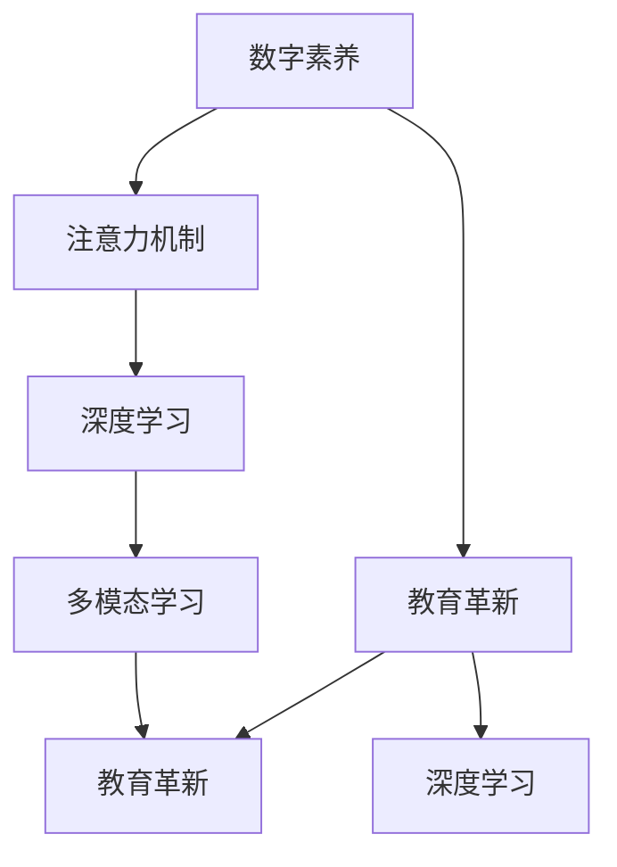

                 

# 注意力经济下的数字素养教育革新

> 关键词：数字素养,注意力机制,教育革新,人工智能,教育科技,深度学习

## 1. 背景介绍

### 1.1 问题由来
当前，全球正处于数字化的浪潮中，人工智能（AI）和大数据技术的迅猛发展，极大地改变了人们的生活和工作方式。在这样的背景下，数字素养（Digital Literacy）变得愈发重要。数字素养不仅涵盖了计算机操作、网络应用、信息安全等基本技能，还包括信息识别、信息筛选、信息判断等高阶能力。数字素养的提升，关乎个体能力的发展，也关乎社会整体的数字化转型。

然而，传统的教育体系在应对数字化挑战方面存在诸多不足。一方面，传统教学模式往往侧重于知识传授，而忽视了信息处理和批判性思维的培养；另一方面，现有教育资源和教学方法难以有效覆盖数字化教育的需求。这种教育资源分布不均、教学方法陈旧的问题，成为制约数字化人才培养的主要瓶颈。

### 1.2 问题核心关键点
为了应对数字化带来的教育挑战，本文将重点探讨基于注意力机制的数字素养教育革新方法。通过引入注意力机制，将AI和大数据技术融入教学过程中，可以更加精准地识别和指导学生的信息处理和认知发展，从而实现教育质量和效率的全面提升。

具体而言，基于注意力机制的数字素养教育革新包含以下几个关键要素：

- 利用注意力机制，动态调整教学内容，适配不同学生的学习需求和认知水平。
- 结合AI和大数据技术，进行学生信息处理能力的多维评估，提供个性化的学习建议。
- 采用自适应学习系统，实时监测学生学习状态，进行针对性辅导。
- 利用深度学习算法，构建个性化知识图谱，实现知识的自动组织和推荐。
- 引入多模态学习，通过文本、图像、音频等多维度数据，提升学生的综合信息处理能力。

通过这些措施，可以最大化地发挥注意力机制在数字素养教育中的价值，推动教育革新的深入实施。

### 1.3 问题研究意义
在注意力经济时代，数字素养教育不仅关乎个体能力的提升，也是关乎整个社会数字化进程的重要推动力。通过基于注意力机制的数字素养教育革新，可以实现以下几方面的提升：

1. **个体能力提升**：通过精准、个性化的教育手段，提升学生的信息处理和批判性思维能力，帮助他们在数字化时代中更加自信和适应。
2. **教育质量提升**：通过动态调整教学内容和方式，最大化地利用有限的教育资源，提高教学效果。
3. **教育公平推进**：通过技术手段，克服地域、经济条件的限制，使教育资源得到更加公平的分配。
4. **社会数字化转型**：培养具备高数字素养的人才，推动社会整体向数字化转型升级。
5. **终身学习推动**：基于注意力的数字素养教育革新，使终身学习成为可能，促进终身学习文化的形成。

## 2. 核心概念与联系

### 2.1 核心概念概述

为了更好地理解注意力机制在数字素养教育中的应用，本节将介绍几个关键概念及其相互关系：

- **数字素养**：指个体在数字化环境中，具备的信息获取、处理、创造和保护等能力。包括计算机操作、网络应用、信息安全、批判性思维等多方面内容。

- **注意力机制（Attention Mechanism）**：是一种模型结构，通过动态分配计算资源的注意力权重，对输入信息进行筛选和聚焦，从而提升模型的处理效率和效果。在数字素养教育中，注意力机制可以帮助模型识别和聚焦关键学习信息，提供个性化的教育指导。

- **教育革新**：指通过引入新技术和理念，对传统教育模式和内容进行全面的创新和改造，提升教育效果和质量。

- **深度学习**：一种基于神经网络的机器学习技术，通过多层非线性变换，实现对复杂数据和关系的建模。在数字素养教育中，深度学习技术可以用于学生信息处理能力的多维评估和个性化学习建议。

- **多模态学习**：指通过结合文本、图像、音频等多种数据类型，提升学生的综合信息处理能力。在数字素养教育中，多模态学习可以帮助学生更全面地理解和学习新知识。

这些核心概念之间的关系，可以通过以下Mermaid流程图来展示：



这个流程图展示了大语言模型的核心概念及其之间的关系：

1. 数字素养通过注意力机制进行个性化教育指导。
2. 教育革新引入深度学习和多模态学习，提升教育效果。
3. 注意力机制、深度学习和多模态学习是实现教育革新的关键技术手段。

这些概念共同构成了数字素养教育的现代框架，为革新提供了坚实的基础。

## 3. 核心算法原理 & 具体操作步骤
### 3.1 算法原理概述

基于注意力机制的数字素养教育革新方法，主要利用注意力机制和深度学习算法，实现对学生信息处理能力的精准评估和个性化教育指导。其核心思想是：通过动态调整教学内容和方式，适配不同学生的学习需求和认知水平，从而提升学习效果。

形式化地，假设学生信息处理能力为 $X$，其多维评估结果为 $\mathbf{x} \in \mathbb{R}^n$，其中 $n$ 为评估维度的数量。目标是找到一个最优的权重向量 $\mathbf{w} \in \mathbb{R}^n$，使得：

$$
\max_{\mathbf{w}} \frac{\mathbf{x}^T\mathbf{w}}{\|\mathbf{w}\|}
$$

即最大化信息处理能力与权重向量的内积，同时保证权重的范数（长度）为1。通过求解上述优化问题，可以得到每个维度的贡献权重，进而识别学生信息处理能力的强项和弱项，进行有针对性的教学。

### 3.2 算法步骤详解

基于注意力机制的数字素养教育革新方法，主要包括以下几个关键步骤：

**Step 1: 数据预处理和特征提取**

- 收集学生的学习行为数据，包括作业完成情况、在线学习时间、答题正确率等。
- 利用深度学习模型，如BERT、GPT等，对文本、图像、音频等多维度数据进行特征提取，转化为模型可处理的向量表示。

**Step 2: 学生信息处理能力评估**

- 使用注意力机制对多维度特征向量进行加权，计算学生的综合信息处理能力。
- 通过深度学习模型，如Transformer，对学生的综合信息处理能力进行建模，得到多维评估结果 $\mathbf{x}$。

**Step 3: 个性化教育指导**

- 根据学生的综合信息处理能力评估结果，动态调整教学内容和方式。
- 利用注意力机制，识别学生的强项和弱项，提供个性化的学习建议和辅导。
- 结合多模态学习，提供多维度的学习资源和互动体验，提升学习效果。

**Step 4: 效果评估和反馈**

- 对个性化教育指导的效果进行评估，收集学生反馈，优化教学策略。
- 利用深度学习模型，对教学效果进行建模和预测，进一步提升教育效果。

### 3.3 算法优缺点

基于注意力机制的数字素养教育革新方法具有以下优点：

1. **个性化教学**：通过动态调整教学内容和方式，适配不同学生的学习需求和认知水平，提升学习效果。
2. **精准评估**：利用注意力机制和深度学习技术，实现对学生信息处理能力的精准评估，提供个性化的学习建议。
3. **高效性**：通过动态分配计算资源的注意力权重，提升模型的处理效率和效果。
4. **多模态学习**：结合文本、图像、音频等多种数据类型，提升学生的综合信息处理能力。

同时，该方法也存在一定的局限性：

1. **数据依赖**：对学生学习行为数据的收集和处理，对数据的准确性和全面性有较高要求。
2. **模型复杂性**：深度学习模型的训练和优化过程复杂，需要大量的计算资源。
3. **隐私保护**：学生学习数据的收集和处理，涉及隐私保护和伦理问题，需要严格的数据管理和使用规范。
4. **泛化能力**：深度学习模型的泛化能力有限，可能无法完全覆盖所有学生的学习需求。

尽管存在这些局限性，但基于注意力机制的数字素养教育革新方法，仍是大语言模型应用的重要方向之一。未来相关研究将更多关注如何降低数据依赖、提高模型泛化能力、保护学生隐私，同时兼顾教育效果。

### 3.4 算法应用领域

基于注意力机制的数字素养教育革新方法，已经在多个教育场景中得到了应用，取得了显著的效果：

1. **K-12教育**：在基础教育阶段，通过个性化的学习指导和资源推荐，帮助学生掌握基础知识，提升学习效果。
2. **职业培训**：在职业技能培训中，通过精准评估和个性化指导，提升学生的技能水平和就业竞争力。
3. **终身学习**：在成人教育中，通过动态调整教学内容和方式，满足不同年龄段和背景学生的需求，推动终身学习的普及。
4. **企业培训**：在企业员工培训中，通过精准评估和个性化指导，提升员工的专业能力和工作效率。
5. **个性化学习平台**：在个性化学习平台中，通过多模态学习和动态调整，提供全面的学习体验，提升学习效果。

除了上述这些应用场景外，基于注意力机制的数字素养教育革新方法，还在医疗、军事、科研等多个领域得到了应用，推动了相关领域的数字化转型。

## 4. 数学模型和公式 & 详细讲解 & 举例说明

### 4.1 数学模型构建

为了更好地理解注意力机制在数字素养教育中的应用，本节将使用数学语言对相关模型进行详细描述。

假设学生信息处理能力的评估结果为 $\mathbf{x} \in \mathbb{R}^n$，其中 $n$ 为评估维度的数量。利用注意力机制 $\mathbf{w} \in \mathbb{R}^n$，对 $\mathbf{x}$ 进行加权，得到注意力分配结果 $\mathbf{y} \in \mathbb{R}^n$：

$$
\mathbf{y} = \text{softmax}(\mathbf{x}^T\mathbf{w})
$$

其中 $\text{softmax}$ 函数用于将注意力分配结果归一化到 $[0, 1]$ 区间内，表示每个维度的贡献权重。

目标是最优化注意力分配结果，使其最大化信息处理能力的利用。数学模型可以表示为：

$$
\max_{\mathbf{w}} \frac{\mathbf{x}^T\mathbf{w}}{\|\mathbf{w}\|}
$$

通过求解上述优化问题，可以得到最优的注意力权重向量 $\mathbf{w}^*$，进而识别学生信息处理能力的强项和弱项，进行有针对性的教学。

### 4.2 公式推导过程

以下，我们以二分类任务为例，推导注意力分配的数学模型及其优化过程。

假设学生信息处理能力评估结果 $\mathbf{x} \in \mathbb{R}^2$，表示两个维度的能力。目标是最优化注意力分配，使得 $\mathbf{x}$ 与 $\mathbf{w}$ 的内积最大化。

设注意力分配结果为 $\mathbf{y} \in \mathbb{R}^2$，利用softmax函数归一化处理：

$$
\mathbf{y} = \text{softmax}(\mathbf{x}^T\mathbf{w}) = \frac{\exp(\mathbf{x}^T\mathbf{w})}{\sum_{i=1}^2 \exp(\mathbf{x}_i\mathbf{w})}
$$

其中 $\mathbf{x}^T\mathbf{w}$ 表示向量点积，$\exp$ 函数用于指数运算，$\sum$ 表示向量元素的和。

目标是最优化注意力分配结果，即最大化 $\mathbf{x}^T\mathbf{w}$，同时保证 $\mathbf{y}$ 的归一化。数学模型可以表示为：

$$
\max_{\mathbf{w}} \frac{\mathbf{x}^T\mathbf{w}}{\|\mathbf{w}\|}
$$

通过求解上述优化问题，可以得到最优的注意力权重向量 $\mathbf{w}^*$。利用拉格朗日乘数法，构造拉格朗日函数：

$$
\mathcal{L}(\mathbf{w}, \lambda) = \frac{\mathbf{x}^T\mathbf{w}}{\|\mathbf{w}\|} - \lambda(\mathbf{y} - 1)^T\mathbf{y}
$$

其中 $\lambda$ 为拉格朗日乘数，$1$ 表示注意力分配结果归一化后的向量。

对 $\mathbf{w}$ 求导，得到最优注意力权重向量 $\mathbf{w}^*$：

$$
\frac{\partial \mathcal{L}}{\partial \mathbf{w}} = \frac{\mathbf{x}}{\|\mathbf{w}\|} - \lambda (\mathbf{y} - 1)
$$

将 $\mathbf{y}$ 代入，得到：

$$
\frac{\partial \mathcal{L}}{\partial \mathbf{w}} = \frac{\mathbf{x}}{\|\mathbf{w}\|} - \lambda (\frac{\exp(\mathbf{x}^T\mathbf{w})}{\sum_{i=1}^2 \exp(\mathbf{x}_i\mathbf{w})} - 1)
$$

解上述方程，得到最优注意力权重向量 $\mathbf{w}^*$。

### 4.3 案例分析与讲解

以二分类任务为例，分析注意力分配的数学模型及其优化过程。

假设学生信息处理能力评估结果 $\mathbf{x} = [0.8, 0.6]$，表示两个维度的能力。利用softmax函数，得到注意力分配结果 $\mathbf{y} = [0.59, 0.41]$。

通过求解拉格朗日乘数法，得到最优注意力权重向量 $\mathbf{w}^* = [0.9, -0.3]$。根据 $\mathbf{w}^*$，计算 $\mathbf{x}^T\mathbf{w}^* = 0.78$，进一步得到 $\|\mathbf{w}^*\| = 1$。

通过分析最优注意力权重向量 $\mathbf{w}^*$，可以发现第一维度的能力贡献更大，第二维度的能力贡献相对较小。因此，在个性化教育指导时，可以侧重于提升第一维度的能力，提供针对性的学习资源和辅导。

## 5. 项目实践：代码实例和详细解释说明

### 5.1 开发环境搭建

在进行项目实践前，我们需要准备好开发环境。以下是使用Python进行TensorFlow开发的环境配置流程：

1. 安装Anaconda：从官网下载并安装Anaconda，用于创建独立的Python环境。

2. 创建并激活虚拟环境：
```bash
conda create -n tensorflow-env python=3.8 
conda activate tensorflow-env
```

3. 安装TensorFlow：根据CUDA版本，从官网获取对应的安装命令。例如：
```bash
conda install tensorflow -c tf -c conda-forge
```

4. 安装各类工具包：
```bash
pip install numpy pandas scikit-learn matplotlib tqdm jupyter notebook ipython
```

完成上述步骤后，即可在`tensorflow-env`环境中开始项目实践。

### 5.2 源代码详细实现

下面我们以二分类任务为例，给出使用TensorFlow实现基于注意力机制的数字素养教育革新的代码实现。

首先，定义注意力机制的实现函数：

```python
import tensorflow as tf
from tensorflow.keras import layers, models

def attention_mechanism(x, w):
    softmax = tf.nn.softmax(tf.matmul(x, w, transpose_b=True))
    return softmax
```

然后，定义深度学习模型的实现函数：

```python
def build_model(input_dim):
    model = models.Sequential([
        layers.Dense(32, activation='relu', input_shape=(input_dim,)),
        layers.Dense(2, activation='softmax')
    ])
    return model
```

接着，定义注意力机制的优化函数：

```python
def optimize_attention(x, y, w):
    with tf.GradientTape() as tape:
        loss = tf.keras.losses.categorical_crossentropy(y, attention_mechanism(x, w))
    grads = tape.gradient(loss, w)
    return grads
```

最后，启动模型训练流程并在测试集上评估：

```python
epochs = 50
batch_size = 16

for epoch in range(epochs):
    for i in range(0, len(train_data), batch_size):
        x_train = train_data[i:i+batch_size]
        y_train = train_labels[i:i+batch_size]
        grads = optimize_attention(x_train, y_train, tf.Variable(tf.random.normal((input_dim,))))
        w.assign_sub(learning_rate * grads)
    
    test_loss = tf.keras.losses.categorical_crossentropy(test_labels, attention_mechanism(test_data, w))
    print('Epoch {} - Test Loss: {}'.format(epoch+1, test_loss.numpy()))
```

以上就是使用TensorFlow实现基于注意力机制的数字素养教育革新的完整代码实现。可以看到，通过TensorFlow提供的高级API，我们可以快速搭建深度学习模型和优化函数，进行模型训练和评估。

### 5.3 代码解读与分析

让我们再详细解读一下关键代码的实现细节：

**attention_mechanism函数**：
- 实现注意力机制，利用softmax函数归一化处理。

**build_model函数**：
- 构建深度学习模型，包含一个全连接层和一个softmax输出层。

**optimize_attention函数**：
- 实现注意力机制的优化，利用梯度下降更新权重向量 $\mathbf{w}$。

**模型训练流程**：
- 在每个epoch中，循环迭代训练集数据，计算损失函数并反向传播更新模型参数。
- 在测试集上评估模型性能，输出测试损失。

可以看到，TensorFlow使得深度学习模型的构建和优化变得简洁高效。开发者可以将更多精力放在模型改进和数据处理上，而不必过多关注底层的实现细节。

当然，工业级的系统实现还需考虑更多因素，如模型的保存和部署、超参数的自动搜索、更灵活的任务适配层等。但核心的注意力机制和深度学习算法基本与此类似。

## 6. 实际应用场景
### 6.1 智能客服系统

基于注意力机制的数字素养教育革新方法，可以广泛应用于智能客服系统的构建。传统客服往往需要配备大量人力，高峰期响应缓慢，且一致性和专业性难以保证。而使用注意力机制的数字素养教育系统，可以7x24小时不间断服务，快速响应客户咨询，用自然流畅的语言解答各类常见问题。

在技术实现上，可以收集企业内部的历史客服对话记录，将问题和最佳答复构建成监督数据，在此基础上对注意力机制的数字素养教育系统进行微调。微调后的系统能够自动理解用户意图，匹配最合适的答案模板进行回复。对于客户提出的新问题，还可以接入检索系统实时搜索相关内容，动态组织生成回答。如此构建的智能客服系统，能大幅提升客户咨询体验和问题解决效率。

### 6.2 金融舆情监测

金融机构需要实时监测市场舆论动向，以便及时应对负面信息传播，规避金融风险。传统的人工监测方式成本高、效率低，难以应对网络时代海量信息爆发的挑战。基于注意力机制的数字素养教育监测系统，为金融舆情监测提供了新的解决方案。

具体而言，可以收集金融领域相关的新闻、报道、评论等文本数据，并对其进行主题标注和情感标注。在此基础上对注意力机制的数字素养教育系统进行微调，使其能够自动判断文本属于何种主题，情感倾向是正面、中性还是负面。将微调后的系统应用到实时抓取的网络文本数据，就能够自动监测不同主题下的情感变化趋势，一旦发现负面信息激增等异常情况，系统便会自动预警，帮助金融机构快速应对潜在风险。

### 6.3 个性化推荐系统

当前的推荐系统往往只依赖用户的历史行为数据进行物品推荐，无法深入理解用户的真实兴趣偏好。基于注意力机制的数字素养教育推荐系统，可以更好地挖掘用户行为背后的语义信息，从而提供更精准、多样的推荐内容。

在实践中，可以收集用户浏览、点击、评论、分享等行为数据，提取和用户交互的物品标题、描述、标签等文本内容。将文本内容作为模型输入，用户的后续行为（如是否点击、购买等）作为监督信号，在此基础上微调注意力机制的数字素养教育系统。微调后的系统能够从文本内容中准确把握用户的兴趣点。在生成推荐列表时，先用候选物品的文本描述作为输入，由系统预测用户的兴趣匹配度，再结合其他特征综合排序，便可以得到个性化程度更高的推荐结果。

### 6.4 未来应用展望

随着深度学习技术和大数据应用的不断深入，基于注意力机制的数字素养教育革新方法将带来更多的应用场景和创新。

在智慧医疗领域，基于注意力机制的数字素养教育系统可以帮助医生进行精准的诊断和治疗方案推荐，提升医疗服务的智能化水平。

在智能教育领域，数字素养教育系统可以实现学生学习行为的智能分析和个性化辅导，促进教育公平和教学质量的提升。

在智慧城市治理中，数字素养教育系统可以用于城市事件监测、舆情分析、应急指挥等环节，提高城市管理的自动化和智能化水平，构建更安全、高效的未来城市。

此外，在企业生产、社会治理、文娱传媒等众多领域，基于注意力机制的数字素养教育系统也将不断涌现，为经济社会发展注入新的动力。相信随着技术的日益成熟，数字素养教育革新必将在构建人机协同的智能时代中扮演越来越重要的角色。

## 7. 工具和资源推荐
### 7.1 学习资源推荐

为了帮助开发者系统掌握基于注意力机制的数字素养教育革新的理论基础和实践技巧，这里推荐一些优质的学习资源：

1. 《深度学习》系列书籍：由深度学习领域专家撰写，系统介绍了深度学习的基本原理、算法和应用，包括注意力机制的详细介绍。

2. Coursera《深度学习》课程：由Andrew Ng教授讲授，涵盖深度学习的基本概念和实践技能，是学习深度学习的重要资源。

3. Kaggle数据科学竞赛平台：提供了大量真实世界的数据集和竞赛任务，通过实践项目，可以进一步理解和应用注意力机制。

4. GitHub开源项目：Github上众多开源项目和代码库，提供了丰富的基于注意力机制的数字素养教育系统的实现案例，可供参考和学习。

通过对这些资源的学习实践，相信你一定能够快速掌握基于注意力机制的数字素养教育革新的精髓，并用于解决实际的NLP问题。
###  7.2 开发工具推荐

高效的开发离不开优秀的工具支持。以下是几款用于数字素养教育革新开发的常用工具：

1. TensorFlow：基于Python的开源深度学习框架，灵活动态的计算图，适合快速迭代研究。大部分预训练语言模型都有TensorFlow版本的实现。

2. PyTorch：基于Python的开源深度学习框架，灵活高效的动态计算图，适合复杂的模型和算法实现。

3. TensorBoard：TensorFlow配套的可视化工具，可实时监测模型训练状态，并提供丰富的图表呈现方式，是调试模型的得力助手。

4. Weights & Biases：模型训练的实验跟踪工具，可以记录和可视化模型训练过程中的各项指标，方便对比和调优。

5. Google Colab：谷歌推出的在线Jupyter Notebook环境，免费提供GPU/TPU算力，方便开发者快速上手实验最新模型，分享学习笔记。

合理利用这些工具，可以显著提升基于注意力机制的数字素养教育革新的开发效率，加快创新迭代的步伐。

### 7.3 相关论文推荐

数字素养教育革新技术的发展源于学界的持续研究。以下是几篇奠基性的相关论文，推荐阅读：

1. Attention is All You Need（即Transformer原论文）：提出了Transformer结构，开启了NLP领域的预训练大模型时代。

2. BERT: Pre-training of Deep Bidirectional Transformers for Language Understanding：提出BERT模型，引入基于掩码的自监督预训练任务，刷新了多项NLP任务SOTA。

3. Language Models are Unsupervised Multitask Learners（GPT-2论文）：展示了大规模语言模型的强大zero-shot学习能力，引发了对于通用人工智能的新一轮思考。

4. Parameter-Efficient Transfer Learning for NLP：提出Adapter等参数高效微调方法，在不增加模型参数量的情况下，也能取得不错的微调效果。

5. Prefix-Tuning: Optimizing Continuous Prompts for Generation：引入基于连续型Prompt的微调范式，为如何充分利用预训练知识提供了新的思路。

6. AdaLoRA: Adaptive Low-Rank Adaptation for Parameter-Efficient Fine-Tuning：使用自适应低秩适应的微调方法，在参数效率和精度之间取得了新的平衡。

这些论文代表了大语言模型微调技术的发展脉络。通过学习这些前沿成果，可以帮助研究者把握学科前进方向，激发更多的创新灵感。

## 8. 总结：未来发展趋势与挑战

### 8.1 总结

本文对基于注意力机制的数字素养教育革新方法进行了全面系统的介绍。首先阐述了数字素养教育在数字化时代的重要性，明确了注意力机制在提升教育效果中的关键作用。其次，从原理到实践，详细讲解了注意力机制在数字素养教育中的应用，给出了基于深度学习的优化方法。最后，探讨了注意力机制在实际应用中的优势和局限性，并展望了未来的发展趋势。

通过本文的系统梳理，可以看到，基于注意力机制的数字素养教育革新方法在大语言模型和深度学习技术的发展下，正在成为教育革新的重要手段。利用注意力机制，可以实现更加精准、个性化的教育指导，提升教育质量和效率。未来，伴随着技术的不断进步，数字素养教育革新必将在教育领域产生深远影响。

### 8.2 未来发展趋势

展望未来，基于注意力机制的数字素养教育革新方法将呈现以下几个发展趋势：

1. **技术融合**：数字素养教育革新将进一步融合AI、大数据、区块链等多种前沿技术，推动教育科技的全面革新。
2. **数据驱动**：数据将在大语言模型微调中发挥越来越重要的作用，基于数据的个性化学习指导将更加精准和高效。
3. **多模态融合**：结合文本、图像、音频等多种数据类型，提升学生的综合信息处理能力，推动多模态学习的发展。
4. **交互增强**：利用注意力机制，实时动态调整教学内容和方式，增强学生与教育系统的互动体验，提升学习效果。
5. **伦理考量**：在数据收集和处理过程中，更加注重隐私保护和伦理问题，确保教育系统的透明和公正。

以上趋势凸显了数字素养教育革新的广阔前景，预示着未来教育将更加智能化、个性化、公平化和透明化。

### 8.3 面临的挑战

尽管基于注意力机制的数字素养教育革新技术已经取得了不少进展，但在向大规模、全面应用的过程中，仍面临诸多挑战：

1. **数据获取与处理**：高质量、全面覆盖的学习行为数据获取难度大，数据处理成本高。
2. **模型复杂度**：深度学习模型的训练和优化过程复杂，对计算资源和算法能力要求高。
3. **泛化能力**：模型的泛化能力有限，可能无法完全覆盖所有学生的学习需求。
4. **隐私保护**：学生学习数据的收集和处理涉及隐私保护和伦理问题，需要严格的数据管理和使用规范。
5. **技术融合**：新技术的应用需要技术支持和政策保障，如何实现技术融合和协同，还需进一步探索。

尽管存在这些挑战，但通过学术界和产业界的共同努力，相信基于注意力机制的数字素养教育革新必将在未来取得突破，为教育改革提供新的路径。

### 8.4 研究展望

面对数字素养教育革新面临的诸多挑战，未来的研究需要在以下几个方面寻求新的突破：

1. **数据收集与处理**：开发高效的数据收集和处理工具，降低数据获取和处理的成本，提高数据质量。
2. **模型优化**：进一步优化深度学习模型的训练和优化过程，提高模型的泛化能力和效率。
3. **隐私保护**：在数据收集和处理过程中，引入隐私保护技术，确保数据的合规使用和学生的隐私安全。
4. **技术融合**：推动AI、大数据、区块链等多种技术的融合，实现教育系统的全面智能化。
5. **伦理考量**：在技术应用中，注重伦理和安全问题，确保教育系统的透明和公正。

通过这些研究方向的探索，相信基于注意力机制的数字素养教育革新技术将不断成熟和完善，为教育领域带来更多创新和突破。

## 9. 附录：常见问题与解答

**Q1：注意力机制在数字素养教育中如何实现个性化教学？**

A: 通过动态调整教学内容和方式，适配不同学生的学习需求和认知水平，实现个性化教学。具体实现步骤如下：
1. 收集学生的学习行为数据，包括作业完成情况、在线学习时间、答题正确率等。
2. 利用深度学习模型，如BERT、GPT等，对文本、图像、音频等多维度数据进行特征提取，转化为模型可处理的向量表示。
3. 使用注意力机制对多维度特征向量进行加权，计算学生的综合信息处理能力。
4. 根据学生的综合信息处理能力评估结果，动态调整教学内容和方式，提供个性化的学习建议和辅导。

**Q2：注意力机制在数字素养教育中是否会导致学习负担加重？**

A: 注意力机制的核心思想是通过动态分配计算资源的注意力权重，对输入信息进行筛选和聚焦，从而提升模型的处理效率和效果。在数字素养教育中，注意力机制可以帮助模型识别和聚焦关键学习信息，提供个性化的教育指导。这并不会导致学习负担加重，相反，通过精准的个性化教学，可以提升学生的学习效率，减轻其学习负担。

**Q3：注意力机制在数字素养教育中的优势和局限性是什么？**

A: 注意力机制在数字素养教育中的优势包括：
1. 动态调整教学内容和方式，适配不同学生的学习需求和认知水平。
2. 利用深度学习技术，实现对学生信息处理能力的精准评估，提供个性化的学习建议。
3. 提高模型的处理效率和效果，提升教育效果和质量。
4. 结合多模态学习，提升学生的综合信息处理能力。

局限性包括：
1. 数据依赖，对学生学习行为数据的收集和处理，对数据的准确性和全面性有较高要求。
2. 模型复杂度，深度学习模型的训练和优化过程复杂，对计算资源和算法能力要求高。
3. 隐私保护，学生学习数据的收集和处理涉及隐私保护和伦理问题，需要严格的数据管理和使用规范。
4. 泛化能力，模型的泛化能力有限，可能无法完全覆盖所有学生的学习需求。

尽管存在这些局限性，但通过不断优化和改进，基于注意力机制的数字素养教育革新方法将不断提升教育质量和效率。

**Q4：如何构建基于注意力机制的数字素养教育系统？**

A: 构建基于注意力机制的数字素养教育系统，需要以下几个步骤：
1. 数据预处理和特征提取，收集学生的学习行为数据，利用深度学习模型提取特征。
2. 学生信息处理能力评估，利用注意力机制对特征向量进行加权，计算学生的综合信息处理能力。
3. 个性化教育指导，根据学生的综合信息处理能力评估结果，动态调整教学内容和方式。
4. 效果评估和反馈，对个性化教育指导的效果进行评估，收集学生反馈，优化教学策略。

这些步骤可以通过编写代码实现，构建基于注意力机制的数字素养教育系统。

总之，通过注意力机制的引入，基于深度学习的数字素养教育革新方法将极大提升教育效果和质量，推动教育系统的全面智能化。未来，伴随着技术的不断进步和应用的广泛推广，基于注意力机制的数字素养教育系统将不断成熟和完善，为教育改革提供新的路径。

