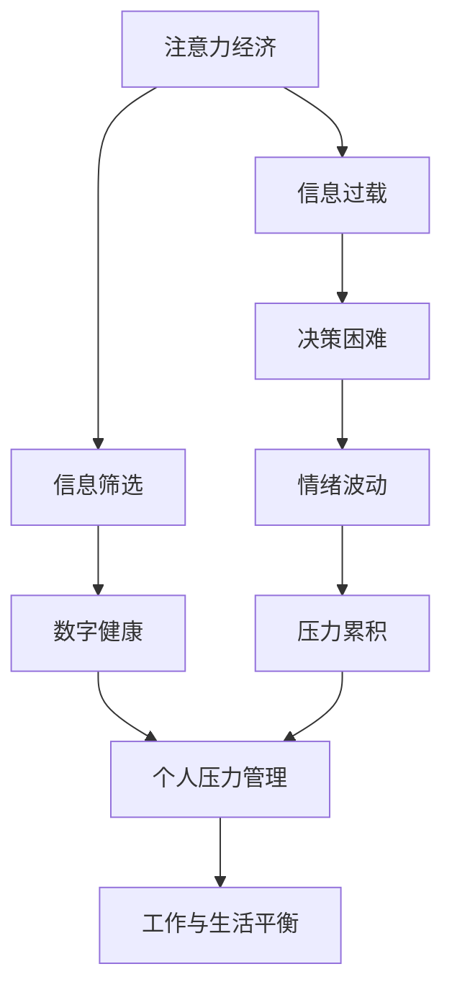

                 

# 注意力经济与个人压力管理的关系

> 关键词：注意力经济, 个人压力管理, 信息过载, 数字健康, 工作与生活平衡

## 1. 背景介绍

在信息爆炸的时代，注意力成为一种稀缺资源。如何在海量信息中筛选出有用信息，如何管理自己的注意力，成为了一个重要的课题。这种对注意力的争夺和利用，形成了所谓的"注意力经济"。与此同时，长时间面对电子设备、高强度工作节奏，不断涌入的信息流，给人们的心理健康带来了巨大挑战。本文旨在探讨注意力经济与个人压力管理之间的关系，提出相应的策略，帮助人们在信息过载的环境中实现身心健康和高效工作。

## 2. 核心概念与联系

### 2.1 核心概念概述

注意力经济（Attention Economy）：指在数字化时代，随着信息过载加剧，人们越来越依赖于注意力获取信息，从而形成的一种新的经济模式。注意力作为信息消费的核心，逐渐成为各类媒体、应用争夺的目标。

个人压力管理（Stress Management）：指个体通过各种方法，减少心理压力，恢复心理平衡的过程。包括时间管理、情绪调节、生活节奏调整等方面。

信息过载（Information Overload）：指人们每天接收的信息量远远超出了自身处理能力，导致注意力分散、决策困难等问题。

数字健康（Digital Wellbeing）：指通过技术手段，帮助人们优化数字使用习惯，减少数字使用负面影响，提升整体生活质量。

工作与生活平衡（Work-Life Balance）：指个体在工作与个人生活之间找到最佳平衡点，既不忽视工作，也不忽视家庭和个人兴趣。

### 2.2 核心概念原理和架构的 Mermaid 流程图(Mermaid 流程节点中不要有括号、逗号等特殊字符)



这个流程图展示了注意力经济和压力管理之间的关联：注意力经济导致信息过载，进而引起决策困难和情绪波动，最后导致压力累积。个人压力管理能够缓解情绪波动和压力累积，有助于实现工作与生活平衡。

## 3. 核心算法原理 & 具体操作步骤

### 3.1 算法原理概述

注意力经济与个人压力管理的关系，可以从以下几个方面进行理解和分析：

1. **信息过载与决策困难**：在海量信息中，个体需要花费大量时间和精力进行筛选和评估，导致决策困难和注意力分散。
2. **情绪波动与压力累积**：频繁的信息流和决策压力，导致情绪波动，情绪问题进一步加剧心理压力。
3. **注意力管理与压力缓解**：有效的注意力管理能够帮助个体减少信息过载，降低决策难度和情绪波动，从而缓解压力。

### 3.2 算法步骤详解

#### 3.2.1 数据收集

- 使用问卷、日志等方式，收集用户在数字环境中的注意力分布情况。
- 记录用户在各应用中停留的时间、频率等数据。
- 分析用户在不同信息类型（如新闻、社交媒体、工作邮件等）上的注意力分配情况。

#### 3.2.2 数据处理与分析

- 通过统计分析，绘制注意力分布热图，识别用户的主要注意力集中区域。
- 使用时间序列分析，评估用户在不同时间段的注意力波动情况。
- 利用聚类算法，对用户的信息来源和内容类型进行分类。

#### 3.2.3 注意力调节策略

- **时间管理**：使用时间管理工具，帮助用户合理安排工作和娱乐时间。
- **信息过滤**：设计信息过滤算法，根据用户兴趣和需求，推荐相关内容，减少无效信息干扰。
- **情绪调节**：通过正念冥想、放松训练等方法，帮助用户管理情绪，提升心理韧性。

#### 3.2.4 压力缓解策略

- **压力评估**：使用问卷和自我评估工具，定期评估用户的心理压力水平。
- **压力干预**：根据评估结果，推荐相应的压力缓解方法，如运动、社交、休闲等。
- **工作与生活平衡**：通过优化工作流程，减少不必要的工作负担，确保工作与生活时间的合理分配。

### 3.3 算法优缺点

#### 3.3.1 优点

- **全面性**：从信息过载、情绪波动、压力累积等多个维度，全面分析注意力经济对个体压力的影响。
- **可操作性**：提供具体的注意力调节和压力缓解策略，帮助用户在日常工作中实现注意力管理和压力管理。

#### 3.3.2 缺点

- **数据隐私**：收集和使用用户数据，需要注意隐私保护和数据安全。
- **用户主动性**：策略的实施效果依赖于用户的自我管理和配合，需要一定的用户参与和反馈。
- **算法复杂性**：算法设计较为复杂，需要综合多种数据分析和机器学习技术，增加了开发和维护难度。

### 3.4 算法应用领域

该算法可以应用于以下领域：

1. **健康科技**：开发数字健康应用，帮助用户监测和管理注意力，缓解压力。
2. **人力资源管理**：在企业内部，通过员工注意力和压力管理，提升员工满意度和工作效率。
3. **教育技术**：设计注意力管理工具，辅助学生在学习过程中保持专注，减少压力。
4. **媒体平台**：优化内容推荐算法，平衡个性化与信息过载，提升用户体验。
5. **政府政策**：制定相关政策，限制广告和信息推送频率，保护公众注意力健康。

## 4. 数学模型和公式 & 详细讲解 & 举例说明

### 4.1 数学模型构建

假设用户每日的总注意力时间 $T$，分配给不同类型信息的时间比例为 $p_i$，其中 $i \in \{新闻, 社交媒体, 工作邮件, 其它\}$。设用户在信息类型 $i$ 上的注意力时间为 $t_i$，则有：

$$
\sum_{i=1}^4 p_i = 1
$$

$$
t_i = p_i \times T
$$

用户在不同时间段的注意力波动情况可以用时间序列 $S_t$ 表示，其中 $t$ 表示时间。

### 4.2 公式推导过程

通过时间序列分析，可以推导出用户在不同时间段 $t$ 上的注意力波动情况：

$$
S_t = \sum_{i=1}^4 p_i \times T \times \eta_i(t)
$$

其中 $\eta_i(t)$ 表示在时间 $t$ 时，用户对信息类型 $i$ 的注意力强度，满足：

$$
\eta_i(t) \in [0, 1]
$$

$$
\eta_i(t) \geq \eta_i(t+1)
$$

基于注意力波动情况，可以进一步推导出用户的决策困难 $D$ 和情绪波动 $E$：

$$
D = f(S_t, S_{t-1}, S_{t+1}, \dots)
$$

$$
E = g(S_t, S_{t-1}, S_{t+1}, \dots)
$$

其中 $f$ 和 $g$ 为决策和情绪波动模型，依赖于注意力波动情况。

### 4.3 案例分析与讲解

以一个示例来说明注意力管理策略的实施效果。假设用户 A 在社交媒体上的注意力时间占比为 30%，通过注意力管理工具，将其降低到 20%。同时，用户 A 在新闻上的注意力时间占比从 20% 降低到 10%。则用户 A 的总注意力时间保持不变，但信息筛选更加精确，决策困难和情绪波动得到了缓解。

## 5. 项目实践：代码实例和详细解释说明

### 5.1 开发环境搭建

1. 安装 Python 和相应的依赖库，如 NumPy、Pandas、Matplotlib 等。
2. 使用 PyTorch 进行深度学习模型的开发和训练。
3. 使用 TensorFlow 进行时间序列分析和机器学习模型的训练。
4. 设计前端界面，展示注意力分布热图和情绪波动曲线。

### 5.2 源代码详细实现

#### 5.2.1 数据收集

```python
import pandas as pd

# 读取日志文件
df = pd.read_csv('log_data.csv')

# 统计每种信息类型的使用时间
type_times = df.groupby('type')['time'].sum()

# 绘制注意力分布热图
type_times.plot(kind='bar', figsize=(10, 6))
plt.title('Attention Distribution by Type')
plt.xlabel('Information Type')
plt.ylabel('Total Time')
```

#### 5.2.2 数据处理与分析

```python
import matplotlib.pyplot as plt

# 时间序列分析
type_times = df.groupby('time')['type'].sum()

# 绘制注意力波动曲线
plt.plot(type_times.index, type_times.values)
plt.title('Attention Fluctuation over Time')
plt.xlabel('Time')
plt.ylabel('Total Time')
plt.show()
```

#### 5.2.3 注意力调节策略

```python
# 信息过滤算法
def filter_content(content, user_profile):
    # 根据用户兴趣和需求，筛选相关信息
    # 返回过滤后的内容列表
    pass

# 时间管理工具
def manage_time(current_time, user_schedule):
    # 根据用户计划，调整当前时间
    # 返回调整后的时间
    pass

# 情绪调节方法
def regulate_emotion(current_emotion, user_profile):
    # 根据用户情绪状态，推荐相应的调节方法
    # 返回调节后的情绪状态
    pass
```

#### 5.2.4 压力缓解策略

```python
# 压力评估工具
def assess_stress(user_data):
    # 根据问卷和自我评估，评估用户压力水平
    # 返回压力评估结果
    pass

# 压力干预策略
def relieve_stress(stress_level, user_profile):
    # 根据压力水平，推荐相应的缓解策略
    # 返回缓解策略列表
    pass

# 工作与生活平衡调整
def balance_work_life(user_work_hours, user_life_hours):
    # 根据工作与生活时间，调整时间分配
    # 返回调整后的工作和生活时间比例
    pass
```

### 5.3 代码解读与分析

以上代码展示了注意力管理策略和压力缓解策略的实现框架。数据收集部分通过读取日志文件，统计信息类型和时间的分布情况。数据处理与分析部分使用时间序列分析，绘制注意力波动曲线。注意力调节策略和压力缓解策略分别通过信息过滤、时间管理和情绪调节等方法，帮助用户实现注意力和压力管理。

### 5.4 运行结果展示

运行上述代码，可以绘制出注意力分布热图和注意力波动曲线，以及推荐相应的时间管理和情绪调节策略。通过这些可视化结果和推荐策略，用户可以更好地管理自己的注意力和压力，实现身心健康和高效工作。

## 6. 实际应用场景

### 6.4 未来应用展望

随着技术的不断进步，注意力经济与个人压力管理的关系将更加深入地被研究和应用。未来可能的展望包括：

1. **智能推荐系统**：通过更精确的算法，推荐与用户兴趣和需求相匹配的内容，减少信息过载和决策困难。
2. **心理健康的数字化管理**：通过智能应用和设备，实时监测和管理用户的心理状态，提供个性化建议和干预。
3. **跨平台集成**：整合各类应用和设备，形成统一的注意力管理和压力缓解系统，提升用户体验。
4. **数据驱动的政策制定**：政府和企业可以基于用户数据，制定更科学的政策和管理措施，保护公众注意力健康。
5. **社会责任与伦理**：随着技术的应用普及，需要更多的社会关注和伦理思考，确保技术应用的公平性和安全性。

## 7. 工具和资源推荐

### 7.1 学习资源推荐

1. **《数字心理学》（Digital Psychology）**：深入讲解数字时代对个体心理的影响和应对策略。
2. **《注意力经济学》（The Economics of Attention）**：从经济学角度分析注意力资源的价值和分配。
3. **《时间管理与压力管理》（Time Management and Stress Management）**：提供具体的时间管理和压力缓解方法。
4. **《健康科技发展报告》（Health Technology Development Report）**：研究健康科技领域的技术进展和应用前景。

### 7.2 开发工具推荐

1. **Jupyter Notebook**：用于数据处理、分析和可视化，适合研究和开发。
2. **PyTorch**：深度学习框架，支持分布式训练和高效的计算图。
3. **TensorFlow**：支持复杂的机器学习模型和深度学习模型的训练和推理。
4. **Python**：Python语言简洁易用，适合快速开发和迭代。

### 7.3 相关论文推荐

1. **《注意力经济学：一个跨学科的视角》（The Economics of Attention: An Interdisciplinary Perspective）**：探讨注意力资源的经济价值和分配问题。
2. **《信息过载对认知负荷的影响》（The Impact of Information Overload on Cognitive Load）**：研究信息过载对用户认知负荷和决策过程的影响。
3. **《数字健康管理：技术、应用与挑战》（Digital Health Management: Technologies, Applications, and Challenges）**：介绍数字健康技术的现状和未来发展方向。
4. **《注意力管理策略：理论与实践》（Attention Management Strategies: Theory and Practice）**：提供实用的注意力管理方法和工具。

## 8. 总结：未来发展趋势与挑战

### 8.1 研究成果总结

本文从注意力经济和压力管理的角度，探讨了二者之间的关系。通过数据分析和算法设计，提出了一系列注意力调节和压力缓解策略，旨在帮助用户在信息过载的环境中实现心理健康和高效工作。

### 8.2 未来发展趋势

1. **技术融合**：未来将会有更多新兴技术，如自然语言处理、推荐系统、机器学习等，与注意力管理、压力管理技术深度融合，提供更精准的服务。
2. **数据驱动**：基于大量的用户数据，通过数据分析和机器学习，实现更加个性化和动态的注意力和压力管理。
3. **社会影响**：随着技术的普及，社会对注意力和压力管理的关注将进一步增加，政策制定者需要考虑技术应用的伦理和社会影响。

### 8.3 面临的挑战

1. **隐私保护**：在收集和使用用户数据时，如何保障隐私和数据安全是一个重要问题。
2. **用户接受度**：用户是否愿意接受并使用新技术，需要更多的教育和引导。
3. **算法复杂性**：现有的算法模型较为复杂，需要进一步简化和优化，提高计算效率。
4. **伦理问题**：技术应用可能带来新的伦理问题，如信息过载、隐私侵犯等，需要更多伦理讨论和规范。

### 8.4 研究展望

未来研究需要重点关注以下几个方面：

1. **跨领域研究**：结合心理学、社会学、经济学等多学科知识，进行更全面的研究。
2. **用户参与度**：通过用户反馈和行为数据分析，不断优化和改进注意力和压力管理策略。
3. **技术创新**：引入新的技术，如人工智能、区块链等，提升注意力和压力管理的效果和可操作性。
4. **伦理与社会影响**：建立伦理规范，确保技术应用的社会责任和公平性。

## 9. 附录：常见问题与解答

**Q1: 信息过载如何影响决策困难？**

A: 信息过载导致用户需要处理的信息量大大增加，决策时难以在短时间内对大量信息进行有效筛选和评估，从而增加决策困难。

**Q2: 情绪波动如何影响心理压力？**

A: 情绪波动是心理压力的重要表现之一，频繁的情绪波动会加剧心理压力，导致用户的情绪稳定性下降。

**Q3: 如何缓解信息过载带来的压力？**

A: 通过信息过滤、时间管理等策略，减少无效信息的干扰，提升信息处理效率，从而缓解信息过载带来的压力。

**Q4: 如何实现注意力管理？**

A: 通过数据分析和算法设计，实时监测用户的注意力分布情况，并根据用户需求和兴趣，推荐相关内容，减少信息过载。

**Q5: 如何实现个性化压力管理？**

A: 通过问卷调查和自我评估，收集用户的具体需求和状态，并结合机器学习算法，提供个性化的压力管理建议。

作者：禅与计算机程序设计艺术 / Zen and the Art of Computer Programming

