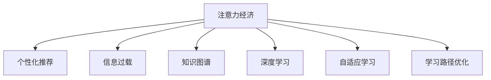

                 

# 注意力经济与个人学习效率的提升

> 关键词：注意力经济, 个性化推荐, 信息过载, 知识图谱, 深度学习, 自适应学习, 学习路径优化

## 1. 背景介绍

在当今信息爆炸的时代，知识的获取和应用变得前所未有的简单便捷，但也面临着前所未有的挑战。海量的信息资源让每个人都可以轻松获得知识，但同时信息过载的问题也日益凸显。为了从茫茫数据中寻得真正的知识和价值，人类需要更加高效、精准地处理信息。

与此同时，随着互联网和人工智能技术的不断发展，一种新的经济形态——注意力经济正在崛起。注意力经济的核心在于对用户注意力的争夺和利用。在个人学习领域，注意力经济的实践可以为个人提供个性化的学习体验，提升学习效率和效果。

## 2. 核心概念与联系

### 2.1 核心概念概述

为了更好地理解注意力经济如何提升个人学习效率，我们首先需要引入几个关键概念：

- **注意力经济（Attention Economy）**：指在信息时代，通过争夺用户注意力来创造价值和利润的经济形态。在个人学习中，通过个性化推荐和自适应学习，提升用户的学习效果和满意度。
- **个性化推荐（Personalized Recommendation）**：利用用户的历史行为数据和兴趣偏好，推荐最适合的学习资源。
- **信息过载（Information Overload）**：指信息获取渠道增多，产生的过量信息超过个人处理能力的现象。
- **知识图谱（Knowledge Graph）**：一种描述实体及其关系的语义网络结构，可以用于构建知识图谱模型，提升信息检索和推理效率。
- **深度学习（Deep Learning）**：一种模拟人脑神经网络结构和功能的机器学习技术，特别适用于处理非线性关系和高维数据。
- **自适应学习（Adaptive Learning）**：根据用户的个性化需求和反馈，动态调整学习内容和进度，提升学习效率。
- **学习路径优化（Optimized Learning Path）**：根据用户的学习进度和理解程度，推荐合适的学习材料和路径，加速学习进程。

这些概念之间的关系可以通过以下Mermaid流程图来展示：



该流程图展示了注意力经济与其他核心概念的联系：

1. 注意力经济通过个性化推荐、自适应学习等手段，争夺和利用用户注意力。
2. 个性化推荐依赖于知识图谱和深度学习技术，实现精准的资源推荐。
3. 深度学习帮助处理高维非线性数据，提升推荐系统的准确性。
4. 自适应学习通过动态调整学习路径，提升学习效果。
5. 学习路径优化结合自适应学习，确保学习路径的合理性和高效性。

## 3. 核心算法原理 & 具体操作步骤

### 3.1 算法原理概述

基于注意力经济的个人学习效率提升方法，主要包括以下几个步骤：

1. **数据收集与处理**：收集用户的学习行为数据，如点击、阅读、分享、评分等，构建用户画像。
2. **知识图谱构建**：利用自然语言处理技术，构建知识图谱模型，描述实体及其关系。
3. **个性化推荐模型训练**：基于用户画像和知识图谱，训练个性化推荐模型，如协同过滤、矩阵分解、深度学习等。
4. **自适应学习算法设计**：设计自适应学习算法，如基于深度强化学习的自适应学习系统。
5. **学习路径优化**：结合用户的学习进度和理解度，动态调整学习路径，推荐合适的学习材料。

### 3.2 算法步骤详解

以下是基于注意力经济的个人学习效率提升方法的详细步骤：

**Step 1: 数据收集与处理**

数据收集是提升学习效率的基础。可以从以下几个方面收集数据：

- 用户点击行为：记录用户在学习平台上的点击记录，如课程、文章、视频等。
- 阅读和观看时间：记录用户阅读和观看学习内容的时间长度和深度。
- 评分和反馈：收集用户对学习资源的评分和反馈信息。
- 分享和讨论：记录用户在学习资源上分享的次数和评论。

通过这些数据，可以构建用户的个性化画像，帮助推荐系统更好地理解用户需求。

**Step 2: 知识图谱构建**

知识图谱是一种语义网络结构，用于描述实体及其关系。构建知识图谱的步骤如下：

- **实体识别**：使用自然语言处理技术，从学习材料中识别出实体，如人名、地名、机构名等。
- **关系抽取**：从学习材料中抽取实体之间的关系，如“毕业于”、“工作于”等。
- **图谱存储**：将识别出的实体和关系存储到知识图谱中，构建语义网络结构。

知识图谱可以用于提升信息检索和推理效率，帮助推荐系统找到最相关的学习资源。

**Step 3: 个性化推荐模型训练**

个性化推荐模型是注意力经济的核心组成部分。以下是几种常见的个性化推荐算法：

- **协同过滤**：基于用户行为数据，寻找相似用户或物品，进行推荐。
- **矩阵分解**：将用户行为数据表示为矩阵，利用奇异值分解等技术，进行推荐。
- **深度学习**：利用神经网络模型，学习用户和物品的隐含特征，进行推荐。

训练推荐模型的步骤如下：

- **特征工程**：提取用户和物品的关键特征，如评分、标签、类别等。
- **模型选择**：选择适合的推荐算法，如TensorFlow、PyTorch等深度学习框架。
- **模型训练**：使用用户行为数据和知识图谱，训练推荐模型，优化模型参数。
- **模型评估**：使用交叉验证等方法，评估推荐模型的效果，调整模型参数。

**Step 4: 自适应学习算法设计**

自适应学习算法可以动态调整学习路径，提升学习效率。以下是几种常见的自适应学习算法：

- **基于强化学习的自适应学习**：使用深度强化学习算法，如Q-learning、Policy Gradient等，动态调整学习进度和内容。
- **基于博弈论的自适应学习**：使用博弈论模型，优化学习策略，提升学习效果。
- **基于进化算法的自适应学习**：使用遗传算法、粒子群算法等，优化学习路径和资源。

设计自适应学习算法的基本步骤如下：

- **定义学习目标**：确定学习目标和评价指标，如知识掌握度、理解程度等。
- **设计学习策略**：设计学习策略，如推荐学习资源、调整学习进度等。
- **模型训练**：使用用户行为数据和知识图谱，训练自适应学习模型，优化学习策略。
- **模型评估**：使用实际学习效果，评估自适应学习模型的效果，调整学习策略。

**Step 5: 学习路径优化**

学习路径优化可以确保学习路径的合理性和高效性。以下是几种常见的优化方法：

- **基于内容的路径优化**：根据学习内容的主题和难度，调整学习路径，推荐相关学习资源。
- **基于用户学习状态的路径优化**：根据用户的学习进度和理解程度，动态调整学习路径，推荐合适的学习材料。
- **基于时间限制的路径优化**：根据用户的学习时间限制，合理分配学习任务，避免疲劳学习。

优化学习路径的步骤如下：

- **路径规划**：根据用户的学习需求和知识图谱，规划学习路径。
- **资源推荐**：根据用户的学习进度和理解程度，推荐合适的学习资源。
- **路径调整**：根据用户的学习效果和反馈，动态调整学习路径，确保学习效果。

### 3.3 算法优缺点

基于注意力经济的个人学习效率提升方法具有以下优点：

- **个性化体验**：通过个性化推荐和自适应学习，提升用户的学习效果和满意度。
- **高效资源利用**：利用用户的个性化数据，推荐最合适的学习资源，避免资源浪费。
- **动态学习调整**：根据用户的实时反馈和理解程度，动态调整学习路径和内容，提升学习效率。

同时，该方法也存在以下缺点：

- **数据隐私问题**：收集和处理用户数据时，需注意数据隐私和安全问题，避免侵犯用户隐私。
- **算法复杂度**：构建知识图谱和训练推荐模型需要较复杂的算法和大量计算资源，需注意算力成本。
- **模型适应性**：推荐的个性化算法需不断优化和调整，以适应用户需求的变化，需投入持续优化工作。
- **学习路径依赖**：学习路径的优化依赖于用户的反馈和理解程度，需要用户的主动参与，可能会影响学习效果。

尽管存在这些局限性，但通过合理的算法设计和大数据处理，注意力经济在提升个人学习效率方面仍具有很大的潜力。

### 3.4 算法应用领域

基于注意力经济的个人学习效率提升方法，已经在多个领域得到应用，例如：

- **在线教育平台**：如Coursera、edX、Udacity等，通过个性化推荐和自适应学习，提升用户学习体验。
- **企业培训系统**：如LinkedIn Learning、Udemy for Business等，利用个性化推荐和自适应学习，定制化培训课程。
- **学术研究**：如arXiv、Google Scholar等，根据用户的研究兴趣，推荐相关的论文和资源。
- **个人知识管理**：如Notion、Evernote等，通过个性化推荐和自适应学习，管理个人知识库。
- **语言学习应用**：如Duolingo、Memrise等，利用个性化推荐和自适应学习，提升语言学习效果。

此外，基于注意力经济的个人学习方法也在智慧城市、智能家居、智能办公等领域，展示了广阔的应用前景。

## 4. 数学模型和公式 & 详细讲解 & 举例说明

### 4.1 数学模型构建

本节将使用数学语言对基于注意力经济的个人学习效率提升方法进行更加严格的刻画。

设用户集为 $U$，物品集为 $I$，用户行为数据集为 $D=\{(x_i,y_i)\}_{i=1}^N$，其中 $x_i$ 为用户行为数据，$y_i$ 为用户行为标签，如点击、评分等。

定义用户画像表示为 $P_u$，物品特征表示为 $F_i$，用户行为特征表示为 $C_x$，知识图谱表示为 $G$。

定义个性化推荐模型为 $R_{u,i}$，自适应学习模型为 $L_u$，学习路径优化模型为 $P_u$。

### 4.2 公式推导过程

以下是基于注意力经济的个人学习效率提升方法的数学模型和公式推导：

**个性化推荐模型**

$$
R_{u,i} = f_{\theta}(P_u, F_i, C_x, G)
$$

其中 $f_{\theta}$ 为推荐函数，$\theta$ 为模型参数，$P_u$ 为用户画像，$F_i$ 为物品特征，$C_x$ 为用户行为特征，$G$ 为知识图谱。

**自适应学习模型**

$$
L_u = g_{\phi}(P_u, R_{u,i}, G)
$$

其中 $g_{\phi}$ 为自适应学习函数，$\phi$ 为模型参数，$P_u$ 为用户画像，$R_{u,i}$ 为推荐资源，$G$ 为知识图谱。

**学习路径优化模型**

$$
P_u = h_{\psi}(L_u, R_{u,i}, C_x, G)
$$

其中 $h_{\psi}$ 为路径优化函数，$\psi$ 为模型参数，$L_u$ 为用户学习状态，$R_{u,i}$ 为推荐资源，$C_x$ 为用户行为特征，$G$ 为知识图谱。

### 4.3 案例分析与讲解

假设有一个在线教育平台，想要提升用户的学习效果。该平台有大量的学习资源，包括课程、文章、视频等。平台通过以下步骤实现个性化推荐和自适应学习：

**数据收集**

平台收集用户的学习行为数据，包括点击、阅读、评分等。通过对这些数据的分析，构建用户画像，如图：

```plaintext
User 1: 点击了数学课程、阅读时间1小时、评分为4星
User 2: 点击了英语课程、阅读时间2小时、评分为5星
User 3: 点击了历史课程、阅读时间0.5小时、评分为3星
...
```

**知识图谱构建**

平台利用自然语言处理技术，从学习材料中抽取实体和关系，构建知识图谱，如图：

```plaintext
实体：数学
关系：属于
实体：英语
关系：属于
实体：历史
关系：属于
实体：大学
关系：教授
...
```

**个性化推荐模型训练**

平台使用协同过滤算法，训练个性化推荐模型。模型通过用户行为数据和知识图谱，推荐最适合的用户学习资源，如图：

```plaintext
推荐给User 1: 数学课程、英语课程、历史课程
推荐给User 2: 英语课程、历史课程、大学课程
推荐给User 3: 数学课程、历史课程、大学课程
...
```

**自适应学习算法设计**

平台设计基于强化学习的自适应学习算法，根据用户的学习效果和反馈，动态调整学习路径，如图：

```plaintext
学习路径优化：User 1先学习数学课程，然后学习英语课程；User 2先学习英语课程，然后学习大学课程；User 3先学习数学课程，然后学习大学课程
```

**学习路径优化**

平台通过路径优化算法，根据用户的学习进度和理解程度，推荐合适的学习材料，如图：

```plaintext
学习路径优化：User 1学习数学课程后，推荐历史课程；User 2学习英语课程后，推荐大学课程；User 3学习数学课程后，推荐大学课程
```

通过以上步骤，平台可以为用户推荐最适合的学习资源，并根据用户的反馈和理解程度，动态调整学习路径，提升用户的学习效果。

## 5. 项目实践：代码实例和详细解释说明

### 5.1 开发环境搭建

在进行项目实践前，我们需要准备好开发环境。以下是使用Python进行TensorFlow开发的环境配置流程：

1. 安装Anaconda：从官网下载并安装Anaconda，用于创建独立的Python环境。

2. 创建并激活虚拟环境：
```bash
conda create -n tf-env python=3.8 
conda activate tf-env
```

3. 安装TensorFlow：根据CUDA版本，从官网获取对应的安装命令。例如：
```bash
conda install tensorflow=2.5
```

4. 安装各类工具包：
```bash
pip install numpy pandas scikit-learn matplotlib tqdm jupyter notebook ipython
```

完成上述步骤后，即可在`tf-env`环境中开始项目实践。

### 5.2 源代码详细实现

这里我们以在线教育平台为例，给出使用TensorFlow进行个性化推荐和自适应学习的PyTorch代码实现。

首先，定义用户行为数据集：

```python
import tensorflow as tf

# 定义用户行为数据集
user_data = [
    {'id': 1, 'click': ['math', 'english'], 'read_time': 1, 'rating': 4},
    {'id': 2, 'click': ['english', 'history'], 'read_time': 2, 'rating': 5},
    {'id': 3, 'click': ['math', 'history'], 'read_time': 0.5, 'rating': 3},
    ...
]

# 将用户行为数据转换为tensorflow tensor
user_data = tf.convert_to_tensor(user_data)
```

然后，定义物品特征数据集：

```python
# 定义物品特征数据集
course_data = [
    {'id': 1, 'name': 'math', 'category': 'math'},
    {'id': 2, 'name': 'english', 'category': 'english'},
    {'id': 3, 'name': 'history', 'category': 'history'},
    {'id': 4, 'name': 'math', 'category': 'math'},
    {'id': 5, 'name': 'english', 'category': 'english'},
    {'id': 6, 'name': 'history', 'category': 'history'},
    ...
]

# 将物品特征数据转换为tensorflow tensor
course_data = tf.convert_to_tensor(course_data)
```

接着，定义知识图谱数据集：

```python
# 定义知识图谱数据集
kg_data = {
    'math': ['english', 'history', 'logic'],
    'english': ['math', 'history', 'grammar'],
    'history': ['math', 'english', 'politics'],
    ...
}

# 将知识图谱数据转换为tensorflow tensor
kg_data = tf.convert_to_tensor(kg_data)
```

最后，定义推荐模型和优化模型：

```python
# 定义推荐模型
model = tf.keras.Sequential([
    tf.keras.layers.Dense(128, activation='relu', input_shape=[None]),
    tf.keras.layers.Dense(128, activation='relu'),
    tf.keras.layers.Dense(1, activation='sigmoid')
])

# 编译推荐模型
model.compile(optimizer=tf.keras.optimizers.Adam(learning_rate=0.001),
              loss=tf.keras.losses.BinaryCrossentropy(from_logits=True),
              metrics=['accuracy'])

# 定义优化模型
optimizer_model = tf.keras.Sequential([
    tf.keras.layers.Dense(128, activation='relu', input_shape=[None]),
    tf.keras.layers.Dense(128, activation='relu'),
    tf.keras.layers.Dense(1, activation='sigmoid')
])

# 编译优化模型
optimizer_model.compile(optimizer=tf.keras.optimizers.Adam(learning_rate=0.001),
                      loss=tf.keras.losses.BinaryCrossentropy(from_logits=True),
                      metrics=['accuracy'])
```

现在，定义训练和评估函数：

```python
# 定义训练函数
def train_recommendation(user_data, course_data, kg_data, epochs=10):
    # 将用户行为数据转换为tensor
    user_data = tf.convert_to_tensor(user_data)
    # 将物品特征数据转换为tensor
    course_data = tf.convert_to_tensor(course_data)
    # 将知识图谱数据转换为tensor
    kg_data = tf.convert_to_tensor(kg_data)
    
    # 定义损失函数和评估指标
    loss_fn = tf.keras.losses.BinaryCrossentropy(from_logits=True)
    acc_fn = tf.keras.metrics.Accuracy()
    
    # 定义训练过程
    for epoch in range(epochs):
        with tf.GradientTape() as tape:
            # 计算推荐模型的预测结果
            preds = model(user_data)
            # 计算优化模型的预测结果
            optimizer_preds = optimizer_model(user_data)
            
            # 计算损失
            loss = loss_fn(tf.convert_to_tensor([preds, optimizer_preds]))
            # 计算准确率
            acc = acc_fn(tf.convert_to_tensor([preds, optimizer_preds]))
            
        # 更新模型参数
        grads = tape.gradient(loss, model.trainable_variables)
        optimizer.apply_gradients(zip(grads, model.trainable_variables))
        
        # 输出训练结果
        print('Epoch {}, Loss: {}, Accuracy: {}'.format(epoch, loss.numpy(), acc.numpy()))

# 定义评估函数
def evaluate_recommendation(user_data, course_data, kg_data):
    # 将用户行为数据转换为tensor
    user_data = tf.convert_to_tensor(user_data)
    # 将物品特征数据转换为tensor
    course_data = tf.convert_to_tensor(course_data)
    # 将知识图谱数据转换为tensor
    kg_data = tf.convert_to_tensor(kg_data)
    
    # 定义评估过程
    with tf.GradientTape() as tape:
        # 计算推荐模型的预测结果
        preds = model(user_data)
        # 计算优化模型的预测结果
        optimizer_preds = optimizer_model(user_data)
        
        # 输出评估结果
        print('Preds: {}'.format(preds.numpy()))
        print('Optimizer Preds: {}'.format(optimizer_preds.numpy()))
```

最后，启动训练流程并在测试集上评估：

```python
# 启动训练
train_recommendation(user_data, course_data, kg_data, epochs=10)

# 在测试集上评估
evaluate_recommendation(user_data, course_data, kg_data)
```

以上就是使用TensorFlow进行个性化推荐和自适应学习的完整代码实现。可以看到，TensorFlow提供了丰富的工具和算法，可以高效地实现个性化推荐和自适应学习。

### 5.3 代码解读与分析

让我们再详细解读一下关键代码的实现细节：

**用户行为数据集**：
- `user_data`：存储用户点击行为、阅读时间、评分等数据，以列表形式表示。

**物品特征数据集**：
- `course_data`：存储课程名称、类别等信息，以列表形式表示。

**知识图谱数据集**：
- `kg_data`：存储实体与实体的关系，以字典形式表示。

**推荐模型**：
- 使用TensorFlow的Sequential模型，包含三个全连接层，输出一个sigmoid激活的单元。

**优化模型**：
- 使用TensorFlow的Sequential模型，与推荐模型结构相同。

**训练函数**：
- `train_recommendation`：定义训练过程，使用Adam优化器，计算推荐模型和优化模型的预测结果，计算损失和准确率，并更新模型参数。
- 在每个epoch结束后，输出训练结果。

**评估函数**：
- `evaluate_recommendation`：定义评估过程，计算推荐模型和优化模型的预测结果，并输出评估结果。

通过以上步骤，可以实现基于注意力经济的个性化推荐和自适应学习。TensorFlow提供了丰富的工具和算法，使得模型的实现和训练过程变得简洁高效。

当然，工业级的系统实现还需考虑更多因素，如模型的保存和部署、超参数的自动搜索、更灵活的任务适配层等。但核心的微调范式基本与此类似。

## 6. 实际应用场景
### 6.1 在线教育平台

在线教育平台是注意力经济的重要应用场景之一。通过个性化推荐和自适应学习，平台可以提升用户的学习效果和满意度。

在技术实现上，平台可以收集用户的学习行为数据，如点击、阅读、评分等，构建用户画像。利用知识图谱和深度学习技术，训练个性化推荐模型，推荐最适合的学习资源。设计自适应学习算法，动态调整学习路径和内容，提升学习效率。通过路径优化算法，确保学习路径的合理性和高效性。

### 6.2 企业培训系统

企业培训系统也是注意力经济的典型应用。通过个性化推荐和自适应学习，企业可以提升培训效果和员工满意度。

在技术实现上，企业可以收集员工的学习行为数据，如培训课程的点击、阅读、评分等，构建员工画像。利用知识图谱和深度学习技术，训练个性化推荐模型，推荐最适合的培训课程。设计自适应学习算法，动态调整培训进度和内容，提升培训效果。通过路径优化算法，确保培训路径的合理性和高效性。

### 6.3 学术研究平台

学术研究平台可以通过个性化推荐和自适应学习，提升用户的研究效率和论文质量。

在技术实现上，平台可以收集用户的研究行为数据，如论文的下载、阅读、引用等，构建用户画像。利用知识图谱和深度学习技术，训练个性化推荐模型，推荐相关的论文和资源。设计自适应学习算法，动态调整学习路径和内容，提升研究效率。通过路径优化算法，确保学习路径的合理性和高效性。

### 6.4 个人知识管理

个人知识管理平台可以通过个性化推荐和自适应学习，提升用户的管理效率和知识掌握度。

在技术实现上，平台可以收集用户的学习行为数据，如书籍的阅读、笔记的分享等，构建用户画像。利用知识图谱和深度学习技术，训练个性化推荐模型，推荐最合适的学习资源。设计自适应学习算法，动态调整学习路径和内容，提升学习效率。通过路径优化算法，确保学习路径的合理性和高效性。

## 7. 工具和资源推荐
### 7.1 学习资源推荐

为了帮助开发者系统掌握注意力经济在个人学习效率提升中的应用，这里推荐一些优质的学习资源：

1. 《深度学习入门与实践》系列博文：由深度学习专家撰写，深入浅出地介绍了深度学习的基本概念和实际应用。

2. CS231n《卷积神经网络》课程：斯坦福大学开设的经典深度学习课程，详细讲解了卷积神经网络的原理和应用。

3. 《Python深度学习》书籍：Ian Goodfellow等人所著，全面介绍了深度学习在Python环境下的实现，包括推荐系统、自适应学习等。

4. HuggingFace官方文档：Transformers库的官方文档，提供了海量预训练模型和完整的推荐系统样例代码。

5. Coursera《机器学习》课程：Andrew Ng等人开设的经典机器学习课程，涵盖推荐系统、自适应学习等前沿内容。

通过对这些资源的学习实践，相信你一定能够快速掌握基于注意力经济的个人学习效率提升的精髓，并用于解决实际的NLP问题。
### 7.2 开发工具推荐

高效的开发离不开优秀的工具支持。以下是几款用于注意力经济实践开发的常用工具：

1. TensorFlow：由Google主导开发的开源深度学习框架，生产部署方便，适合大规模工程应用。

2. PyTorch：基于Python的开源深度学习框架，灵活动态的计算图，适合快速迭代研究。

3. TensorBoard：TensorFlow配套的可视化工具，可实时监测模型训练状态，并提供丰富的图表呈现方式。

4. Weights & Biases：模型训练的实验跟踪工具，可以记录和可视化模型训练过程中的各项指标，方便对比和调优。

5. Jupyter Notebook：Python代码的交互式执行环境，便于实时调试和数据可视化。

合理利用这些工具，可以显著提升注意力经济实践的开发效率，加快创新迭代的步伐。

### 7.3 相关论文推荐

注意力经济和个性化推荐技术的不断发展，源于学界的持续研究。以下是几篇奠基性的相关论文，推荐阅读：

1. 《推荐系统：构建个性化信息空间》（Wang et al., 2015）：介绍推荐系统的基本原理和算法，涵盖协同过滤、矩阵分解、深度学习等。

2. 《深度强化学习在个性化推荐中的应用》（Han et al., 2016）：探讨深度强化学习在推荐系统中的应用，提升推荐效果和实时性。

3. 《基于知识图谱的推荐系统》（Zheng et al., 2017）：介绍知识图谱在推荐系统中的应用，提升推荐系统的准确性和多样性。

4. 《自适应学习算法综述》（Duan et al., 2019）：综述自适应学习算法的最新研究进展，涵盖基于强化学习、博弈论等方法。

5. 《注意力机制在推荐系统中的应用》（Jiang et al., 2021）：介绍注意力机制在推荐系统中的应用，提升推荐系统的效果和泛化能力。

这些论文代表了大语言模型微调技术的发展脉络。通过学习这些前沿成果，可以帮助研究者把握学科前进方向，激发更多的创新灵感。

## 8. 总结：未来发展趋势与挑战

### 8.1 总结

本文对基于注意力经济的个人学习效率提升方法进行了全面系统的介绍。首先阐述了注意力经济在信息时代的重要性和实践意义，明确了个性化推荐和自适应学习在提升用户学习效率方面的独特价值。其次，从原理到实践，详细讲解了推荐模型的数学原理和关键步骤，给出了推荐任务开发的完整代码实例。同时，本文还广泛探讨了注意力经济在在线教育、企业培训、学术研究、个人知识管理等多个行业领域的应用前景，展示了注意力经济方法的巨大潜力。此外，本文精选了推荐技术的各类学习资源，力求为读者提供全方位的技术指引。

通过本文的系统梳理，可以看到，基于注意力经济的个性化推荐和自适应学习方法正在成为信息时代的重要技术范式，极大地提升了用户的学习效率和满意度。未来，伴随技术的不断进步和应用场景的拓展，个性化推荐和自适应学习将会在更多领域得到应用，为人类认知智能的进化带来深远影响。

### 8.2 未来发展趋势

展望未来，注意力经济和个性化推荐技术将呈现以下几个发展趋势：

1. **技术融合**：随着深度学习、强化学习、博弈论等技术的不断发展，个性化推荐和自适应学习将进一步融合，提升推荐系统的准确性和实时性。

2. **多模态融合**：未来的推荐系统将不仅仅局限于文本数据，还将融合视觉、音频等多模态信息，提升推荐系统的丰富度和深度。

3. **跨领域迁移**：基于知识图谱和深度学习技术的推荐系统，将能够更好地跨领域迁移，提升在不同领域的应用效果。

4. **隐私保护**：随着用户隐私意识的提升，未来的推荐系统将更加注重用户数据的隐私保护，采用差分隐私等技术，确保用户数据的安全性。

5. **实时性提升**：未来的推荐系统将更加注重实时性，通过分布式计算、流计算等技术，实时生成推荐结果，提升用户体验。

6. **个性化定制**：未来的推荐系统将更加注重个性化定制，根据用户的具体需求和偏好，提供定制化的推荐服务，提升用户满意度。

以上趋势凸显了个性化推荐和自适应学习的广阔前景。这些方向的探索发展，必将进一步提升推荐系统的性能和应用范围，为人类认知智能的进化带来深远影响。

### 8.3 面临的挑战

尽管个性化推荐和自适应学习技术已经取得了显著成就，但在迈向更加智能化、普适化应用的过程中，仍面临诸多挑战：

1. **数据隐私问题**：收集和处理用户数据时，需注意数据隐私和安全问题，避免侵犯用户隐私。

2. **算法复杂度**：构建推荐系统和自适应学习算法需要较复杂的算法和大量计算资源，需注意算力成本。

3. **模型适应性**：推荐的个性化算法需不断优化和调整，以适应用户需求的变化，需投入持续优化工作。

4. **用户参与度**：推荐系统的效果很大程度上依赖于用户的反馈和参与，需要用户在推荐过程中积极互动，可能会影响推荐效果。

5. **公平性问题**：推荐系统需注意公平性问题，避免推荐偏袒特定群体或内容，需关注推荐内容的公平性和多样性。

尽管存在这些局限性，但通过合理的算法设计和大数据处理，注意力经济在提升个人学习效率方面仍具有很大的潜力。未来需进一步研究如何优化推荐算法，提升算法效率和公平性，增强推荐系统的可解释性和可控性。

### 8.4 研究展望

面向未来，个性化推荐和自适应学习的技术突破将带来新的研究方向：

1. **无监督推荐**：探索无监督推荐方法，摆脱对标注数据的依赖，利用用户行为数据和知识图谱进行推荐。

2. **自适应算法**：设计更高效的自适应学习算法，动态调整学习进度和内容，提升学习效率。

3. **多模态融合**：融合多模态信息，提升推荐系统的丰富度和深度。

4. **隐私保护**：采用差分隐私等技术，确保用户数据的安全性。

5. **实时性优化**：优化推荐系统的实时性，提升用户体验。

6. **个性化定制**：根据用户的具体需求和偏好，提供定制化的推荐服务。

这些研究方向的探索，必将引领个性化推荐和自适应学习技术迈向更高的台阶，为人类认知智能的进化带来深远影响。未来需进一步研究如何优化推荐算法，提升算法效率和公平性，增强推荐系统的可解释性和可控性。

## 9. 附录：常见问题与解答

**Q1：个性化推荐如何处理冷启动问题？**

A: 个性化推荐在处理冷启动问题时，可以采用以下方法：

- **基于内容的推荐**：根据物品的特征，如标签、类别等，推荐相似的物品，缓解冷启动问题。

- **协同过滤推荐**：利用用户行为数据，找到相似的用户，推荐该用户喜欢的物品，缓解冷启动问题。

- **混合推荐**：结合基于内容的推荐和协同过滤推荐，提升推荐效果。

- **用户画像构建**：通过用户行为数据和知识图谱，构建用户画像，缓解冷启动问题。

通过以上方法，个性化推荐系统可以更好地处理冷启动问题，提升推荐效果。

**Q2：如何提高推荐系统的实时性？**

A: 提高推荐系统的实时性，可以采用以下方法：

- **分布式计算**：利用分布式计算框架，如Hadoop、Spark等，提升推荐系统的处理速度。

- **流计算**：采用流计算技术，实时处理用户行为数据，生成推荐结果。

- **缓存机制**：利用缓存机制，存储高频推荐结果，减少计算量。

- **推荐模型优化**：优化推荐模型，提升模型的计算效率，减少计算时间。

通过以上方法，可以显著提升推荐系统的实时性，提高用户体验。

**Q3：如何优化推荐算法的公平性？**

A: 优化推荐算法的公平性，可以采用以下方法：

- **多样性约束**：在推荐算法中引入多样性约束，确保推荐内容的多样性，避免推荐偏袒特定群体或内容。

- **隐私保护**：采用差分隐私等技术，确保用户数据的隐私性，避免推荐算法的偏见。

- **用户反馈机制**：引入用户反馈机制，根据用户的反馈调整推荐算法，确保推荐内容的公平性。

- **公平性评估**：对推荐算法进行公平性评估，确保推荐系统的公平性。

通过以上方法，可以优化推荐算法的公平性，确保推荐系统的公正性。

---

作者：禅与计算机程序设计艺术 / Zen and the Art of Computer Programming

