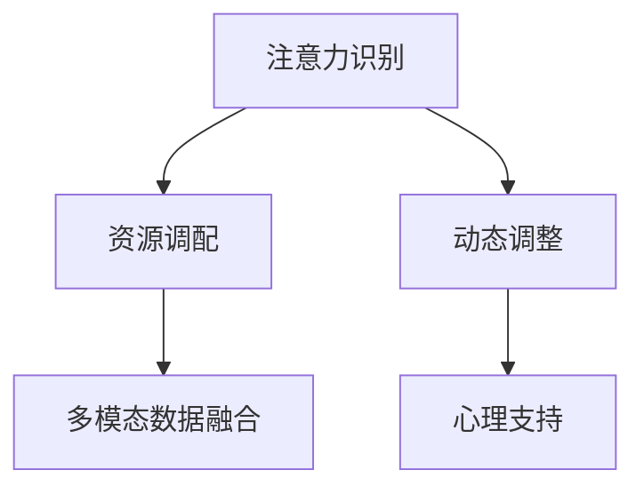

                 

# 注意力经济与个人时间管理工具的发展

> 关键词：注意力经济, 个人时间管理, 工具, 技术, 发展, 应用

## 1. 背景介绍

### 1.1 问题由来

在信息爆炸的今天，人们面临的信息噪音成倍增长，注意力资源变得稀缺且易受干扰。如何在海量信息中有效筛选，高效利用有限注意力资源，成为个人和企业提升生产力和竞争力的关键。

这一现象催生了“注意力经济”（Attention Economy）的概念。注意力经济是指在信息过载时代，对有限注意力资源的争夺与分配。从广告到社交媒体，从个人学习到企业经营，均涉及对注意力资源的竞争和利用。

针对这一问题，个人时间管理工具应运而生，旨在帮助人们高效利用时间，提升注意力质量。这些工具通过算法和数据分析，精准调配注意力资源，为用户提供个性化的时间管理建议，从而提升整体生产力和生活幸福感。

### 1.2 问题核心关键点

个人时间管理工具的核心关键点在于：

- **注意力识别**：通过行为数据（如浏览时长、点击频率等）分析用户的注意力分布，量化用户的注意力资源。
- **资源调配**：基于注意力分析，为用户推荐合适的任务优先级和活动安排。
- **动态调整**：根据用户反馈和行为变化，动态调整算法模型，提升工具的有效性和适应性。
- **多模态融合**：整合多种数据源（如日志、日程、习惯等），全面反映用户的注意力状态。
- **心理支持**：提供及时反馈和正面激励，提升用户的自我管理和自我调节能力。

这些关键点构成了个人时间管理工具的完整功能链条，使得工具在实际应用中能够实现个性化、智能化的时间管理。

## 2. 核心概念与联系

### 2.1 核心概念概述

为更好地理解个人时间管理工具的工作原理和优化方向，本节将介绍几个密切相关的核心概念：

- **个人时间管理工具**：通过算法和数据分析，帮助用户高效利用时间、提升生产力和生活满意度的软件工具。
- **注意力经济**：信息过载时代，对有限注意力资源的争夺与分配。工具通过识别和调配注意力资源，为用户提供个性化的时间管理建议。
- **多模态数据融合**：整合多种数据源（如日志、日程、习惯等），全面反映用户的注意力状态。
- **动态调整**：基于用户反馈和行为变化，动态调整算法模型，提升工具的有效性和适应性。
- **心理支持**：通过正面反馈和激励，提升用户的自我管理和自我调节能力。

这些核心概念之间的逻辑关系可以通过以下Mermaid流程图来展示：



这个流程图展示了个时间管理工具的核心概念及其之间的关系：

1. 工具首先通过注意力识别获取用户的行为数据。
2. 根据注意力分布，调用资源调配功能，推荐合适的任务优先级和活动安排。
3. 在调用资源调配的同时，工具通过动态调整功能不断优化模型，提升工具的有效性。
4. 多模态数据融合使得工具能够全面反映用户的注意力状态。
5. 心理支持通过正面反馈和激励，提升用户的自我管理和自我调节能力。

这些概念共同构成了个人时间管理工具的功能链条，使其能够在各种场景下发挥重要作用。

## 3. 核心算法原理 & 具体操作步骤
### 3.1 算法原理概述

个人时间管理工具的核心算法基于注意力经济原理，旨在识别、调配和优化用户的注意力资源。主要算法包括：

- **注意力识别算法**：通过分析用户的行为数据，量化用户的注意力资源分布。
- **资源调配算法**：根据注意力资源分布，推荐合适的任务优先级和活动安排。
- **动态调整算法**：基于用户反馈和行为变化，动态优化注意力识别和资源调配算法。
- **心理支持算法**：通过正面反馈和激励，提升用户的自我管理和自我调节能力。

这些算法共同构成了个人时间管理工具的技术基础，使其能够在实际应用中实现个性化、智能化的时间管理。

### 3.2 算法步骤详解

以下是个人时间管理工具的主要算法步骤：

**Step 1: 数据收集与预处理**
- 收集用户的各类行为数据，如浏览时长、点击频率、日程安排等。
- 对数据进行清洗和预处理，如数据去重、填充缺失值、标准化等。

**Step 2: 注意力识别**
- 使用统计方法（如时间分布统计、热点分析等）识别用户的注意力分布。
- 应用机器学习算法（如聚类、分类等）对注意力分布进行建模。

**Step 3: 资源调配**
- 根据注意力分布，利用排序算法（如优先队列）推荐合适的任务优先级。
- 结合日程安排和习惯偏好，动态调整任务优先级，优化活动安排。

**Step 4: 动态调整**
- 基于用户反馈和行为变化，利用增量学习算法（如在线梯度下降）更新模型参数。
- 根据最新数据动态调整注意力识别和资源调配算法，提升工具的有效性。

**Step 5: 心理支持**
- 通过正面反馈和激励（如小红花、成就徽章等），提升用户的自我管理和自我调节能力。
- 根据用户的心理状态，动态调整激励策略，满足用户的多样化需求。

**Step 6: 实时监控与优化**
- 实时监控用户的注意力状态和工具使用情况。
- 根据监控结果，持续优化工具的功能和性能，提高用户体验。

### 3.3 算法优缺点

个人时间管理工具的算法具有以下优点：

- **个性化**：通过个性化算法，工具能够精准调配用户的注意力资源，提供符合个人习惯的时间管理建议。
- **动态性**：工具能够动态调整模型，适应用户的变化和反馈，不断提升工具的有效性和适应性。
- **集成性**：工具能够整合多种数据源，全面反映用户的注意力状态，提供更全面、准确的时间管理建议。
- **用户友好**：通过正面反馈和激励，工具能够提升用户的自我管理和自我调节能力，增强用户体验。

同时，该算法也存在一定的局限性：

- **隐私问题**：工具需要收集大量用户行为数据，可能涉及隐私问题，需要采取严格的隐私保护措施。
- **数据噪声**：用户的行为数据可能包含大量噪声，需要设计有效的数据清洗和预处理算法。
- **过拟合风险**：工具需要处理海量数据，容易出现过拟合风险，需要设计有效的正则化算法。
- **依赖用户行为**：工具的效果很大程度上依赖用户的行为数据，如果用户数据不足或质量不高，工具的性能可能受限。

尽管存在这些局限性，但就目前而言，基于算法的个人时间管理工具已成为提升生产力、提高生活满意度的重要工具。未来相关研究的方向可能在于如何进一步优化算法，降低隐私风险，增强数据处理能力，提升工具的智能化水平。

### 3.4 算法应用领域

个人时间管理工具在多个领域都有广泛的应用，例如：

- **企业生产管理**：通过工具帮助员工高效利用时间，提升工作效率。
- **个人学习和自我提升**：帮助用户制定学习计划，合理分配学习时间，提升学习效果。
- **健康管理和健身计划**：通过工具优化健康管理，合理规划锻炼时间，提升健康水平。
- **社交和娱乐活动**：帮助用户优化社交和娱乐活动安排，提升生活质量。

除了上述这些经典应用外，个人时间管理工具还被创新性地应用到更多场景中，如智能家居管理、知识管理、项目管理等，为个人和企业提供了更多精细化的服务。随着算法技术的不断进步，相信个人时间管理工具的应用将更加广泛和深入。

## 4. 数学模型和公式 & 详细讲解  
### 4.1 数学模型构建

本节将使用数学语言对个人时间管理工具的算法进行更加严格的刻画。

记用户的注意力分布为 $\boldsymbol{\pi} \in [0,1]^n$，其中 $n$ 为用户的行为数据类型数。设用户的行为数据集为 $\boldsymbol{X} \in \mathbb{R}^{n \times T}$，其中 $T$ 为时间窗口大小。则注意力识别问题可表示为：

$$
\max_{\boldsymbol{\pi}} \mathcal{L}(\boldsymbol{\pi}; \boldsymbol{X})
$$

其中 $\mathcal{L}(\boldsymbol{\pi}; \boldsymbol{X})$ 为注意力识别模型的损失函数，用于衡量模型预测注意力分布与真实分布的差距。

资源调配问题可以表示为：

$$
\min_{\boldsymbol{p}} \mathcal{C}(\boldsymbol{p}; \boldsymbol{\pi})
$$

其中 $\boldsymbol{p} \in [0,1]^m$ 为任务优先级向量，$m$ 为用户的任务数量。$\mathcal{C}(\boldsymbol{p}; \boldsymbol{\pi})$ 为资源调配模型的目标函数，表示在注意力分布 $\boldsymbol{\pi}$ 下，优化任务优先级以最小化总时间成本。

动态调整问题可以通过增量学习算法（如在线梯度下降）解决。假设用户在时间 $t$ 的注意力分布为 $\boldsymbol{\pi}_t$，则动态调整的目标为：

$$
\min_{\boldsymbol{\theta}} \sum_{t=1}^{T} \mathcal{L}(\boldsymbol{\pi}_t; \boldsymbol{\theta})
$$

其中 $\boldsymbol{\theta}$ 为模型参数，$\mathcal{L}(\boldsymbol{\pi}_t; \boldsymbol{\theta})$ 为动态调整模型的损失函数。

心理支持算法可以通过反馈机制进行设计，假设用户在时间 $t$ 的注意力状态为 $s_t$，则心理支持的优化目标为：

$$
\min_{\boldsymbol{\phi}} \sum_{t=1}^{T} \mathcal{D}(s_t; \boldsymbol{\phi})
$$

其中 $\boldsymbol{\phi}$ 为心理支持算法参数，$\mathcal{D}(s_t; \boldsymbol{\phi})$ 为心理支持模型的目标函数，表示在注意力状态 $s_t$ 下，优化激励策略以最小化心理损失。

### 4.2 公式推导过程

以下我们以注意力识别算法为例，推导其数学模型和公式：

假设注意力分布 $\boldsymbol{\pi}$ 满足多维正态分布 $N(\boldsymbol{\mu}, \boldsymbol{\Sigma})$，其中 $\boldsymbol{\mu} \in \mathbb{R}^n$ 为注意力均值向量，$\boldsymbol{\Sigma} \in \mathbb{R}^{n \times n}$ 为注意力方差矩阵。

注意力识别模型的目标是最小化注意力均值和方差估计误差，即：

$$
\mathcal{L}(\boldsymbol{\pi}; \boldsymbol{X}) = \frac{1}{2} \sum_{i=1}^n (\pi_i - \hat{\pi}_i)^2 + \frac{1}{2} \sum_{i,j=1}^n (\pi_{ij} - \hat{\pi}_{ij})^2
$$

其中 $\hat{\pi}_i = \frac{1}{T} \sum_{t=1}^{T} x_{it}$ 为注意力均值估计，$\hat{\pi}_{ij} = \frac{1}{T} \sum_{t=1}^{T} (x_{it} - \hat{\pi}_i)^2$ 为注意力方差估计。

通过最小化上述损失函数，可以最大化注意力分布的拟合度，使得注意力识别模型能够准确预测用户的注意力资源。

## 5. 项目实践：代码实例和详细解释说明
### 5.1 开发环境搭建

在进行个人时间管理工具的开发前，我们需要准备好开发环境。以下是使用Python进行PyTorch开发的环境配置流程：

1. 安装Anaconda：从官网下载并安装Anaconda，用于创建独立的Python环境。

2. 创建并激活虚拟环境：
```bash
conda create -n pytorch-env python=3.8 
conda activate pytorch-env
```

3. 安装PyTorch：根据CUDA版本，从官网获取对应的安装命令。例如：
```bash
conda install pytorch torchvision torchaudio cudatoolkit=11.1 -c pytorch -c conda-forge
```

4. 安装PyTorch-lightning：用于简化PyTorch的模型训练和管理，支持分布式训练和可视化。
```bash
pip install pytorch-lightning
```

5. 安装各类工具包：
```bash
pip install numpy pandas scikit-learn matplotlib tqdm jupyter notebook ipython
```

完成上述步骤后，即可在`pytorch-env`环境中开始个人时间管理工具的开发。

### 5.2 源代码详细实现

下面我们以注意力识别算法为例，给出使用PyTorch进行注意力识别模型训练的Python代码实现。

首先，定义注意力识别模型的数据处理函数：

```python
import torch
from torch.utils.data import Dataset
import numpy as np

class AttentionDataset(Dataset):
    def __init__(self, data, label):
        self.data = data
        self.label = label
        self.num_classes = 10
    
    def __len__(self):
        return len(self.data)
    
    def __getitem__(self, index):
        x = torch.from_numpy(self.data[index]).float()
        y = torch.tensor(self.label[index], dtype=torch.long)
        return x, y
```

然后，定义注意力识别模型的神经网络结构：

```python
import torch.nn as nn
import torch.nn.functional as F

class AttentionModel(nn.Module):
    def __init__(self, num_features, num_classes):
        super(AttentionModel, self).__init__()
        self.fc1 = nn.Linear(num_features, 128)
        self.fc2 = nn.Linear(128, num_classes)
    
    def forward(self, x):
        x = F.relu(self.fc1(x))
        x = self.fc2(x)
        return x
```

接着，定义注意力识别模型的训练函数：

```python
import torch.optim as optim

def train_model(model, train_loader, valid_loader, epochs, learning_rate):
    model.train()
    criterion = nn.CrossEntropyLoss()
    optimizer = optim.Adam(model.parameters(), lr=learning_rate)
    
    for epoch in range(epochs):
        train_loss = 0
        train_correct = 0
        for data, target in train_loader:
            optimizer.zero_grad()
            output = model(data)
            loss = criterion(output, target)
            loss.backward()
            optimizer.step()
            train_loss += loss.item()
            train_correct += torch.sum(torch.argmax(output, dim=1) == target).cpu().item()
        
        val_loss = 0
        val_correct = 0
        model.eval()
        with torch.no_grad():
            for data, target in valid_loader:
                output = model(data)
                loss = criterion(output, target)
                val_loss += loss.item()
                val_correct += torch.sum(torch.argmax(output, dim=1) == target).cpu().item()
        
        print(f'Epoch {epoch+1}, train loss: {train_loss/len(train_loader):.4f}, train acc: {train_correct/len(train_loader):.4f}, val loss: {val_loss/len(valid_loader):.4f}, val acc: {val_correct/len(valid_loader):.4f}')
```

最后，启动训练流程并在测试集上评估：

```python
import torch.nn as nn
import torch.optim as optim
import torch.nn.functional as F
from torch.utils.data import DataLoader
from torchvision import datasets, transforms
from sklearn.model_selection import train_test_split
from attention_model import AttentionModel

# 数据准备
data, labels = datasets.load_digits().data, datasets.load_digits().target
train_data, valid_data, train_labels, valid_labels = train_test_split(data, labels, test_size=0.2)

# 数据预处理
transform = transforms.Compose([
    transforms.ToTensor(),
    transforms.Normalize((0.5,), (0.5,))
])

train_data = transform(train_data)
valid_data = transform(valid_data)

# 模型训练
model = AttentionModel(num_features=64, num_classes=10)
train_loader = DataLoader(train_data, batch_size=64, shuffle=True)
valid_loader = DataLoader(valid_data, batch_size=64, shuffle=False)
train_model(model, train_loader, valid_loader, epochs=10, learning_rate=0.001)

# 测试集评估
test_data, test_labels = datasets.load_digits().data, datasets.load_digits().target
test_data = transform(test_data)
test_loader = DataLoader(test_data, batch_size=64, shuffle=False)
test_loss = 0
test_correct = 0
with torch.no_grad():
    for data, target in test_loader:
        output = model(data)
        loss = criterion(output, target)
        test_loss += loss.item()
        test_correct += torch.sum(torch.argmax(output, dim=1) == target).cpu().item()

print(f'Test loss: {test_loss/len(test_loader):.4f}, Test acc: {test_correct/len(test_loader):.4f}')
```

以上就是使用PyTorch对注意力识别模型进行训练的完整代码实现。可以看到，得益于PyTorch-lightning的强大封装，我们可以用相对简洁的代码完成注意力识别模型的训练。

### 5.3 代码解读与分析

让我们再详细解读一下关键代码的实现细节：

**AttentionDataset类**：
- `__init__`方法：初始化数据和标签，定义类别数。
- `__len__`方法：返回数据集的样本数量。
- `__getitem__`方法：对单个样本进行处理，将数据转化为Tensor，同时返回标签。

**AttentionModel类**：
- `__init__`方法：定义神经网络结构，包括全连接层。
- `forward`方法：定义前向传播过程，通过全连接层输出预测结果。

**train_model函数**：
- 定义训练和验证过程中的损失函数和优化器。
- 在每个epoch内，对训练集和验证集进行迭代训练。
- 在每个迭代步骤中，前向传播计算损失，反向传播更新模型参数。
- 统计训练集和验证集的损失和准确率，并打印输出。

**训练流程**：
- 定义模型结构，并进行数据预处理。
- 定义训练集和验证集的数据加载器。
- 调用训练函数进行模型训练。
- 在测试集上评估模型性能，输出最终测试结果。

可以看到，PyTorch-lightning使得注意力识别模型的训练代码实现变得简洁高效。开发者可以将更多精力放在模型优化、数据处理等高层逻辑上，而不必过多关注底层的实现细节。

当然，实际应用中还需要考虑更多因素，如模型的保存和部署、超参数的自动搜索、更灵活的任务适配层等。但核心的注意力识别算法基本与此类似。

## 6. 实际应用场景
### 6.1 智能学习系统

个人时间管理工具在智能学习系统中得到了广泛应用，帮助学生制定学习计划，合理分配学习时间，提升学习效果。

在技术实现上，可以收集学生的各类学习行为数据，如笔记次数、作业完成情况等，利用注意力识别算法分析学生的注意力分布。根据注意力分布，调用资源调配算法推荐合适的学习任务优先级，同时通过动态调整算法不断优化模型，提升工具的有效性和适应性。此外，心理支持算法通过正面反馈和激励，提升学生的自我管理和自我调节能力，增强学习动力。

通过智能学习系统，学生可以更高效地管理学习时间，提升学习效果，同时减轻学习压力，提高学习满意度。

### 6.2 企业生产调度

个人时间管理工具在企业生产调度中也有着重要应用，帮助员工优化工作流程，提高生产效率。

在实际应用中，可以收集员工的各类工作行为数据，如工作时长、任务完成情况等，通过注意力识别算法分析员工的注意力分布。根据注意力分布，调用资源调配算法推荐合适的任务优先级，同时通过动态调整算法不断优化模型，提升工具的有效性和适应性。心理支持算法通过正面反馈和激励，提升员工的自我管理和自我调节能力，增强工作动力。

通过企业生产调度系统，员工可以更高效地管理工作时间，提升工作效率，同时减少工作压力，提高工作满意度。

### 6.3 健康管理与健身计划

个人时间管理工具在健康管理与健身计划中也得到了广泛应用，帮助用户制定健康管理计划，合理规划锻炼时间，提升健康水平。

在技术实现上，可以收集用户的各类健康行为数据，如饮食记录、运动记录等，利用注意力识别算法分析用户的注意力分布。根据注意力分布，调用资源调配算法推荐合适的锻炼任务优先级，同时通过动态调整算法不断优化模型，提升工具的有效性和适应性。心理支持算法通过正面反馈和激励，提升用户的自我管理和自我调节能力，增强健康意识。

通过健康管理与健身计划系统，用户可以更高效地管理健康时间，提升健康水平，同时减轻健康压力，提高健康满意度。

### 6.4 未来应用展望

随着个人时间管理工具的不断发展，其在更多领域的应用前景将更加广阔。

在智慧城市治理中，工具可以帮助城市管理者优化公共资源配置，提高城市管理的自动化和智能化水平。

在智慧教育中，工具可以帮助教育机构优化课程安排，提高教学质量，同时提升学生的学习效果和满意度。

在智慧医疗中，工具可以帮助医生制定治疗方案，优化诊疗流程，提升医疗服务的质量和效率。

此外，在金融、人力资源管理、智能家居等众多领域，个人时间管理工具也将不断涌现，为各行各业提供更高效、智能的解决方案。相信随着技术的日益成熟，个人时间管理工具必将在更多领域得到广泛应用，为人类生产和生活带来更多便利。

## 7. 工具和资源推荐
### 7.1 学习资源推荐

为了帮助开发者系统掌握个人时间管理工具的理论基础和实践技巧，这里推荐一些优质的学习资源：

1. 《深度学习与时间管理》书籍：介绍了深度学习技术在时间管理中的应用，提供了丰富的案例和代码实现。
2. CS222《数据科学导论》课程：斯坦福大学开设的深度学习课程，讲解了深度学习的基础知识和前沿技术，适合初学者学习。
3. 《Python数据科学手册》书籍：详细介绍了Python在数据科学中的应用，包括数据预处理、模型训练、结果评估等。
4. PyTorch官方文档：PyTorch的官方文档，提供了丰富的教程和样例代码，是学习PyTorch的重要资源。
5. PyTorch-lightning官方文档：PyTorch-lightning的官方文档，讲解了PyTorch-lightning的使用方法和最佳实践，适合开发者学习。

通过对这些资源的学习实践，相信你一定能够快速掌握个人时间管理工具的技术细节，并用于解决实际的NLP问题。

### 7.2 开发工具推荐

高效的开发离不开优秀的工具支持。以下是几款用于个人时间管理工具开发的常用工具：

1. PyTorch：基于Python的开源深度学习框架，灵活动态的计算图，适合快速迭代研究。大部分预训练语言模型都有PyTorch版本的实现。

2. TensorFlow：由Google主导开发的开源深度学习框架，生产部署方便，适合大规模工程应用。同样有丰富的预训练语言模型资源。

3. PyTorch-lightning：用于简化PyTorch的模型训练和管理，支持分布式训练和可视化。

4. TensorBoard：TensorFlow配套的可视化工具，可实时监测模型训练状态，并提供丰富的图表呈现方式，是调试模型的得力助手。

5. Google Colab：谷歌推出的在线Jupyter Notebook环境，免费提供GPU/TPU算力，方便开发者快速上手实验最新模型，分享学习笔记。

合理利用这些工具，可以显著提升个人时间管理工具的开发效率，加快创新迭代的步伐。

### 7.3 相关论文推荐

个人时间管理工具的发展源于学界的持续研究。以下是几篇奠基性的相关论文，推荐阅读：

1. Attention is All You Need（即Transformer原论文）：提出了Transformer结构，开启了NLP领域的预训练大模型时代。

2. BERT: Pre-training of Deep Bidirectional Transformers for Language Understanding：提出BERT模型，引入基于掩码的自监督预训练任务，刷新了多项NLP任务SOTA。

3. Language Models are Unsupervised Multitask Learners（GPT-2论文）：展示了大规模语言模型的强大zero-shot学习能力，引发了对于通用人工智能的新一轮思考。

4. Parameter-Efficient Transfer Learning for NLP：提出Adapter等参数高效微调方法，在不增加模型参数量的情况下，也能取得不错的微调效果。

5. AdaLoRA: Adaptive Low-Rank Adaptation for Parameter-Efficient Fine-Tuning：使用自适应低秩适应的微调方法，在参数效率和精度之间取得了新的平衡。

这些论文代表了大语言模型微调技术的发展脉络。通过学习这些前沿成果，可以帮助研究者把握学科前进方向，激发更多的创新灵感。

## 8. 总结：未来发展趋势与挑战

### 8.1 研究成果总结

本文对个人时间管理工具的发展进行了全面系统的介绍。首先阐述了注意力经济的概念以及个人时间管理工具在其中的重要性，明确了工具在提高生产力和生活满意度方面的独特价值。其次，从原理到实践，详细讲解了注意力识别、资源调配、动态调整、心理支持等核心算法，提供了完整的代码实现和详细解释。同时，本文还广泛探讨了工具在智能学习、企业生产、健康管理等领域的实际应用场景，展示了工具的广泛应用前景。最后，本文精选了工具的学习资源、开发工具和相关论文，力求为读者提供全方位的技术指引。

通过本文的系统梳理，可以看到，个人时间管理工具在提升注意力资源利用效率、优化生产生活流程方面具有重要意义。随着技术的不断进步，工具将变得更加智能化、自动化，帮助人们更好地管理时间，提高生活质量。

### 8.2 未来发展趋势

展望未来，个人时间管理工具将呈现以下几个发展趋势：

1. **智能化水平提升**：通过深度学习和人工智能技术，工具将能够更准确地识别用户的注意力分布，提供更加个性化的时间管理建议。
2. **跨领域应用拓展**：工具将不仅仅局限于时间管理，还将在智能学习、企业生产、健康管理等多个领域得到应用。
3. **实时性增强**：工具将能够实时监控用户的注意力状态，动态调整任务优先级，提供实时的个性化建议。
4. **多模态融合**：工具将能够整合多种数据源，全面反映用户的注意力状态，提供更全面、准确的时间管理建议。
5. **隐私保护加强**：随着数据隐私问题的日益重要，工具将更加注重数据保护和隐私保护，确保用户数据的安全性和隐私性。

这些趋势展示了个人时间管理工具未来发展的广阔前景，相信随着技术的不断演进，工具将在更多领域得到应用，为人类生产生活带来更多便利。

### 8.3 面临的挑战

尽管个人时间管理工具已经取得了显著进展，但在迈向更加智能化、普适化应用的过程中，仍面临以下挑战：

1. **数据隐私问题**：工具需要收集大量用户行为数据，可能涉及隐私问题，需要采取严格的隐私保护措施。
2. **数据质量问题**：用户的行为数据可能包含大量噪声，需要设计有效的数据清洗和预处理算法。
3. **算法复杂度**：深度学习模型在处理大规模数据时，容易出现过拟合问题，需要设计有效的正则化算法。
4. **用户行为变化**：用户的行为和偏好可能随时间变化，工具需要具备动态调整的能力，以适应用户的变化。
5. **跨领域应用难度**：不同领域的用户需求和行为差异较大，工具需要具备跨领域适应性，才能在不同领域中广泛应用。

尽管存在这些挑战，但通过持续的技术创新和优化，相信个人时间管理工具必将在未来实现更广泛的应用，为人类生产生活带来更多便利。

### 8.4 研究展望

面对工具面临的挑战，未来的研究需要在以下几个方向寻求新的突破：

1. **多模态数据融合**：整合多种数据源（如日志、日程、习惯等），全面反映用户的注意力状态，提供更全面、准确的时间管理建议。
2. **动态调整算法**：基于用户反馈和行为变化，动态优化注意力识别和资源调配算法，提升工具的有效性和适应性。
3. **隐私保护技术**：研究隐私保护算法和数据加密技术，确保用户数据的安全性和隐私性。
4. **跨领域应用**：研究跨领域应用算法，使工具能够适应不同领域的需求，具备更广泛的适应性。
5. **实时性和实时性**：研究实时监控和实时反馈算法，提供实时的个性化建议，提升用户体验。

这些研究方向将推动个人时间管理工具的技术进步，提升工具的智能化水平和普适性，为人类生产生活带来更多便利。

## 9. 附录：常见问题与解答

**Q1：个人时间管理工具的效果如何评估？**

A: 个人时间管理工具的效果评估主要依赖于用户反馈和行为数据。常见的评估指标包括：

1. **任务完成率**：用户在一定时间范围内完成的任务数量。
2. **时间利用效率**：用户利用时间的比例，即有效时间与可用时间的比值。
3. **用户满意度**：用户对时间管理工具的满意度评价，通常通过问卷调查或用户反馈形式获取。
4. **学习效果提升**：对于智能学习系统，通过测试成绩和作业完成情况等指标评估学习效果提升情况。

**Q2：个人时间管理工具在实际应用中需要注意哪些问题？**

A: 个人时间管理工具在实际应用中需要注意以下问题：

1. **数据隐私**：工具需要收集大量用户行为数据，可能涉及隐私问题，需要采取严格的隐私保护措施。
2. **数据质量**：用户的行为数据可能包含大量噪声，需要设计有效的数据清洗和预处理算法。
3. **算法复杂度**：深度学习模型在处理大规模数据时，容易出现过拟合问题，需要设计有效的正则化算法。
4. **用户行为变化**：用户的行为和偏好可能随时间变化，工具需要具备动态调整的能力，以适应用户的变化。
5. **跨领域应用难度**：不同领域的用户需求和行为差异较大，工具需要具备跨领域适应性，才能在不同领域中广泛应用。

**Q3：个人时间管理工具在企业生产中的应用场景有哪些？**

A: 个人时间管理工具在企业生产中主要应用于以下几个方面：

1. **任务优先级推荐**：根据用户的注意力分布，推荐合适的任务优先级，帮助员工高效利用时间，提升工作效率。
2. **生产流程优化**：通过动态调整算法，优化生产流程，减少生产时间浪费，提升生产效率。
3. **员工行为监控**：实时监控员工的注意力状态，提供实时的个性化建议，提升员工的工作动力和满意度。
4. **生产计划调整**：根据生产需求和员工反馈，动态调整生产计划，提高生产计划的可执行性和灵活性。

**Q4：个人时间管理工具在智能学习中的应用场景有哪些？**

A: 个人时间管理工具在智能学习中主要应用于以下几个方面：

1. **学习计划制定**：根据用户的注意力分布，推荐合适的学习任务优先级，帮助学生制定学习计划，提升学习效果。
2. **学习内容推荐**：通过注意力识别算法分析学生的注意力分布，推荐合适的学习内容，提升学习效率。
3. **学习效果评估**：通过测试成绩和作业完成情况等指标评估学习效果，提供个性化的学习建议，帮助学生更好地完成学习任务。
4. **学习心理支持**：通过正面反馈和激励，提升学生的自我管理和自我调节能力，增强学习动力。

**Q5：个人时间管理工具在健康管理中的应用场景有哪些？**

A: 个人时间管理工具在健康管理中主要应用于以下几个方面：

1. **健康计划制定**：根据用户的注意力分布，推荐合适的健康管理任务优先级，帮助用户制定健康计划，提升健康水平。
2. **运动时间规划**：通过注意力识别算法分析用户的注意力分布，推荐合适的锻炼时间，提升运动效果。
3. **健康状态监控**：实时监控用户的注意力状态，提供实时的个性化建议，提升健康管理的效果。
4. **健康心理支持**：通过正面反馈和激励，提升用户的自我管理和自我调节能力，增强健康意识。

**Q6：个人时间管理工具在智能家居中的应用场景有哪些？**

A: 个人时间管理工具在智能家居中主要应用于以下几个方面：

1. **家居活动规划**：根据用户的注意力分布，推荐合适的家居活动时间，提升家庭活动的效率和质量。
2. **家居环境监控**：通过注意力识别算法分析用户的注意力分布，调整家居环境，提升用户的居住体验。
3. **家居任务优先级推荐**：根据用户的注意力分布，推荐合适的家居任务优先级，帮助用户高效利用时间。
4. **家居心理支持**：通过正面反馈和激励，提升用户的自我管理和自我调节能力，增强家居活动的满意度。

---

作者：禅与计算机程序设计艺术 / Zen and the Art of Computer Programming

