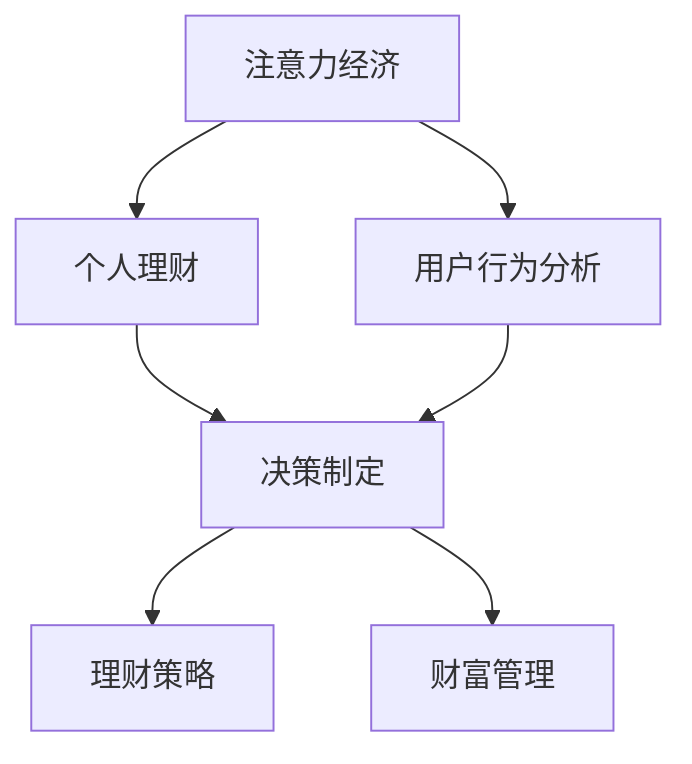

                 

# 注意力经济与个人理财行为的关系

> 关键词：注意力经济, 个人理财, 行为经济学, 用户行为分析, 决策制定

## 1. 背景介绍

### 1.1 问题由来
随着互联网技术的迅猛发展，信息时代已全面到来。大数据、云计算、人工智能等技术的广泛应用，使得海量的信息可以被即时获取和处理，注意力经济逐渐成为互联网时代的新型经济形态。在这样的大背景下，个人理财行为受到了前所未有的影响。

### 1.2 问题核心关键点
- 注意力经济定义：指以争夺用户注意力为核心的经济形态，通过持续吸引用户的注意力，实现商业变现。
- 个人理财行为：指个体利用现有资源，通过投资、消费、储蓄等方式实现财富增长、保值增值的过程。
- 用户行为分析：通过分析用户点击、浏览、购买等行为数据，理解用户需求，优化产品设计和推荐系统。
- 决策制定：指在信息不完全和不确定性下，通过数据驱动的方式进行个人理财的策略选择和资源配置。

### 1.3 问题研究意义
研究注意力经济与个人理财行为的关系，对于理解用户行为、优化理财策略、提升用户体验具有重要意义。通过深入分析注意力经济对用户理财行为的影响，可以提出更有效的理财策略和决策支持方案，促进个性化理财产品的开发和推广，推动金融科技的发展。

## 2. 核心概念与联系

### 2.1 核心概念概述

为更好地理解注意力经济与个人理财行为的关系，本节将介绍几个密切相关的核心概念：

- **注意力经济**：指以争夺用户注意力为核心的经济形态，通过持续吸引用户的注意力，实现商业变现。注意力经济的核心在于利用用户对信息的关注和依赖，创造附加价值，形成新的商业模式。
- **个人理财**：指个体利用现有资源，通过投资、消费、储蓄等方式实现财富增长、保值增值的过程。个人理财包括投资规划、风险管理、财富管理等多个方面，旨在实现财富的最大化。
- **用户行为分析**：通过分析用户点击、浏览、购买等行为数据，理解用户需求，优化产品设计和推荐系统。用户行为分析是注意力经济和个性化理财的重要支撑，通过数据分析可以精准地为用户提供个性化的理财建议。
- **决策制定**：指在信息不完全和不确定性下，通过数据驱动的方式进行个人理财的策略选择和资源配置。决策制定是理财行为的核心，是实现财富目标的关键步骤。

这些核心概念之间的逻辑关系可以通过以下Mermaid流程图来展示：



这个流程图展示了一个完整的注意力经济影响个人理财行为的路径：注意力经济通过用户行为分析对个人理财的决策制定产生影响，进而制定出更有效的理财策略，实现财富管理。

## 3. 核心算法原理 & 具体操作步骤
### 3.1 算法原理概述

注意力经济与个人理财行为的关系主要体现在用户行为分析上。通过数据分析，可以精准地理解用户的关注点、需求和行为规律，进而优化理财策略，提升用户体验。

### 3.2 算法步骤详解

基于注意力经济与个人理财行为的关系，可以设计以下算法步骤：

1. **数据收集**：收集用户的点击、浏览、购买等行为数据，包括用户访问的网站、点击的文章、购买的商品等。
2. **特征提取**：从行为数据中提取关键特征，如访问时间、点击频率、购买频率等，构建用户画像。
3. **数据分析**：利用机器学习算法对用户数据进行分析，找出用户的兴趣偏好和行为模式，识别出用户在不同时间段的行为变化。
4. **策略制定**：根据用户行为数据，制定个性化的理财策略，如推荐适合的理财产品、调整投资组合、优化储蓄计划等。
5. **效果评估**：对制定的理财策略进行效果评估，包括用户满意度、理财收益等，根据评估结果进行调整。

### 3.3 算法优缺点

注意力经济与个人理财行为的关系算法具有以下优点：

- 提高理财效果：通过用户行为分析，可以更准确地了解用户需求，制定出更合适的理财策略，提高理财收益。
- 个性化服务：基于用户行为数据，可以提供个性化的理财服务，满足用户的个性化需求，提升用户体验。
- 数据驱动决策：通过数据分析，减少决策的盲目性，使理财决策更加科学合理。

同时，该算法也存在一定的局限性：

- 数据隐私问题：收集和分析用户行为数据，可能涉及到用户隐私，需要遵守相关法律法规。
- 数据偏差问题：行为数据分析依赖于数据质量，如果数据存在偏差，可能导致分析结果不准确。
- 模型复杂度问题：用户行为数据量庞大且复杂，构建模型时需要考虑算法复杂度和计算效率。

### 3.4 算法应用领域

注意力经济与个人理财行为的关系算法已经在多个领域得到了应用，例如：

- 金融科技：利用用户行为分析，优化理财产品的推荐和销售，提升用户粘性和满意度。
- 电子商务：通过分析用户的购买行为，推荐相关商品，提高用户的购买转化率和复购率。
- 互联网广告：利用用户的点击和浏览行为，精准投放广告，提高广告投放效果。
- 社交媒体：分析用户的社交行为，优化内容推荐和广告投放策略，提升用户活跃度和互动率。

## 4. 数学模型和公式 & 详细讲解  
### 4.1 数学模型构建

本节将使用数学语言对注意力经济与个人理财行为的关系进行严格的刻画。

记用户对商品或服务的关注度为 $A$，理财收益为 $P$，用户对不同商品或服务的偏好程度为 $P_i$。基于注意力经济，可以构建以下数学模型：

$$
P = f(A, P_i)
$$

其中 $f$ 为关注度与理财收益之间的关系函数。假设 $A$ 是用户对商品或服务的点击次数，$P_i$ 是用户对不同商品或服务的偏好程度，可以通过以下线性回归模型进行建模：

$$
P = \alpha_0 + \alpha_1A + \alpha_2P_i + \epsilon
$$

### 4.2 公式推导过程

通过最小二乘法求解上述线性回归模型，可以得到关注度与理财收益之间的关系。设 $\hat{P} = \alpha_0 + \alpha_1A + \alpha_2P_i$ 为模型预测值，则误差 $\epsilon$ 为：

$$
\epsilon = P - \hat{P}
$$

通过最小化误差平方和，可以求解 $\alpha_0$、$\alpha_1$、$\alpha_2$，得到：

$$
\hat{\alpha}_0 = \frac{\sum(X^T Y - \sum X \bar{Y})}{\sum X^T X - \sum X \bar{X}}
$$

$$
\hat{\alpha}_1 = \frac{\sum(X^T Y - \sum X \bar{Y})}{\sum X^2 - \sum X \bar{X}}
$$

$$
\hat{\alpha}_2 = \frac{\sum(X^T Y - \sum X \bar{Y})}{\sum P_i^2 - \sum P_i \bar{P_i}}
$$

### 4.3 案例分析与讲解

以用户购买理财产品的决策为例，设用户对银行理财产品的点击次数为 $A$，对基金产品的点击次数为 $B$，对保险产品的点击次数为 $C$，购买基金产品的概率为 $P_1$，购买保险产品的概率为 $P_2$，理财收益为 $P$。则有：

$$
P = \alpha_0 + \alpha_1A + \alpha_2B + \alpha_3C + \epsilon
$$

通过对用户行为数据的分析，可以构建多个子模型，分别用于预测购买银行理财产品、基金产品和保险产品的概率，进而制定个性化的理财策略。

## 5. 项目实践：代码实例和详细解释说明
### 5.1 开发环境搭建

在进行项目实践前，我们需要准备好开发环境。以下是使用Python进行TensorFlow开发的环境配置流程：

1. 安装Anaconda：从官网下载并安装Anaconda，用于创建独立的Python环境。

2. 创建并激活虚拟环境：
```bash
conda create -n tf-env python=3.8 
conda activate tf-env
```

3. 安装TensorFlow：
```bash
pip install tensorflow
```

4. 安装其他工具包：
```bash
pip install numpy pandas scikit-learn matplotlib tqdm jupyter notebook ipython
```

完成上述步骤后，即可在`tf-env`环境中开始项目实践。

### 5.2 源代码详细实现

这里我们以用户行为数据分析为例，给出使用TensorFlow对用户行为数据进行建模的PyTorch代码实现。

首先，定义用户行为数据：

```python
import pandas as pd
import numpy as np

# 用户行为数据
data = pd.read_csv('user_behavior.csv')
```

然后，定义特征提取函数：

```python
def extract_features(df):
    # 提取点击次数、访问时间、偏好程度等特征
    features = []
    for col in df.columns:
        if col in ['click_count', 'visit_time', 'preference']:
            features.append(df[col])
    return np.array(features)
```

接着，定义模型训练函数：

```python
from tensorflow.keras.layers import Dense, Input, Model
from tensorflow.keras.optimizers import Adam

# 定义输入层
input_layer = Input(shape=(3,))

# 定义隐藏层
hidden_layer = Dense(16, activation='relu')(input_layer)

# 定义输出层
output_layer = Dense(1, activation='sigmoid')(hidden_layer)

# 定义模型
model = Model(input_layer, output_layer)

# 编译模型
model.compile(optimizer=Adam(lr=0.01), loss='binary_crossentropy', metrics=['accuracy'])

# 训练模型
model.fit(x=extract_features(data), y=data['click'].to_numpy(), epochs=10, batch_size=32)
```

最后，进行模型预测：

```python
# 定义测试集
test_data = pd.read_csv('test_data.csv')

# 提取特征
features_test = extract_features(test_data)

# 进行预测
predictions = model.predict(features_test)
```

以上就是使用TensorFlow对用户行为数据进行建模的完整代码实现。可以看到，TensorFlow提供了一系列的高级API，使得模型构建和训练变得简洁高效。

### 5.3 代码解读与分析

让我们再详细解读一下关键代码的实现细节：

**数据预处理**：
- 通过Pandas库读取用户行为数据，并进行初步处理。
- 使用Numpy库对数据进行特征提取，构建输入特征集。

**模型构建**：
- 使用Keras API构建神经网络模型，包括输入层、隐藏层和输出层。
- 使用Adam优化器和二元交叉熵损失函数进行模型编译。
- 调用fit函数进行模型训练，指定训练次数和批次大小。

**模型预测**：
- 对测试数据进行特征提取。
- 使用训练好的模型进行预测，得到用户点击行为的预测结果。

## 6. 实际应用场景
### 6.1 智能投顾系统

基于用户行为数据分析的注意力经济与个人理财行为的关系算法，可以广泛应用于智能投顾系统的构建。智能投顾系统通过分析用户的点击、浏览、购买等行为数据，精准地为用户提供理财建议和投资组合，提升用户粘性和满意度。

在技术实现上，可以收集用户的理财行为数据，如购买理财产品、访问理财指南、咨询理财顾问等行为，将其转化为可量化的特征。在此基础上，对预训练模型进行微调，使其能够根据用户行为数据，预测用户的理财需求和偏好。微调后的模型能够自动生成个性化的理财建议，辅助用户进行投资决策。

### 6.2 金融营销

注意力经济与个人理财行为的关系算法在金融营销中也有广泛应用。银行、保险公司等金融机构可以通过用户行为数据分析，精准定位目标用户，提升广告投放效果和客户转化率。

具体而言，金融机构可以收集用户的访问网站、点击广告、购买产品等行为数据，分析用户的兴趣偏好和行为模式。根据分析结果，设计有针对性的广告投放策略，提高广告的点击率和转化率，实现精准营销。

### 6.3 个人理财平台

个人理财平台可以通过用户行为数据分析，提供个性化的理财服务和建议。平台收集用户的投资、消费、储蓄等行为数据，分析用户的理财需求和行为规律，推荐适合的理财产品，优化用户的理财组合。

通过用户行为数据分析，平台可以识别出用户的理财风险偏好、投资期限、收益期望等特征，制定个性化的理财方案，提升用户的理财体验和满意度。

## 7. 工具和资源推荐
### 7.1 学习资源推荐

为了帮助开发者系统掌握注意力经济与个人理财行为的关系算法的理论基础和实践技巧，这里推荐一些优质的学习资源：

1. 《机器学习实战》系列博文：由机器学习领域专家撰写，深入浅出地介绍了机器学习算法的基本概念和应用场景。

2. CS229《机器学习》课程：斯坦福大学开设的机器学习经典课程，有Lecture视频和配套作业，帮助你系统掌握机器学习算法。

3. 《Python深度学习》书籍：深度学习领域权威书籍，由深度学习专家撰写，全面介绍了深度学习算法的原理和应用。

4. Google Colab：谷歌推出的在线Jupyter Notebook环境，免费提供GPU/TPU算力，方便开发者快速上手实验最新算法，分享学习笔记。

通过对这些资源的学习实践，相信你一定能够快速掌握注意力经济与个人理财行为的关系算法的精髓，并用于解决实际的理财问题。
###  7.2 开发工具推荐

高效的开发离不开优秀的工具支持。以下是几款用于用户行为数据分析和理财决策优化的常用工具：

1. TensorFlow：由Google主导开发的开源深度学习框架，支持分布式训练，适合大规模数据集的分析和处理。

2. Scikit-learn：Python的科学计算库，提供了丰富的机器学习算法和工具，适合构建和优化用户行为分析模型。

3. R语言：广泛应用于统计分析和数据科学，拥有丰富的机器学习算法和图形化工具，适合进行数据可视化和决策分析。

4. Tableau：商业智能和数据可视化工具，支持大规模数据集的快速分析和可视化，适合数据驱动的决策制定。

5. Power BI：微软的商业智能工具，支持数据整合、可视化和报表生成，适合构建智能投顾系统的决策支持系统。

合理利用这些工具，可以显著提升用户行为数据分析和理财决策优化的开发效率，加快创新迭代的步伐。

### 7.3 相关论文推荐

注意力经济与个人理财行为的关系算法的发展源于学界的持续研究。以下是几篇奠基性的相关论文，推荐阅读：

1. "Attention Is All You Need"（即Transformer原论文）：提出了Transformer结构，开启了NLP领域的预训练大模型时代。

2. "Deep Learning for Recommender Systems: A Survey and Tasks"：综述了深度学习在推荐系统中的应用，包括基于用户行为数据分析的推荐算法。

3. "Reinforcement Learning in Online Platforms"：介绍了强化学习在在线平台中的应用，包括基于用户行为数据分析的个性化推荐和广告投放。

4. "Machine Learning for Personal Finance"：综述了机器学习在个人理财中的应用，包括基于用户行为数据分析的理财策略和风险管理。

5. "Behavioral Economics and Online Behavioral Finance"：综述了行为经济学在金融科技中的应用，包括基于用户行为数据分析的理财决策和行为干预。

这些论文代表了大语言模型微调技术的发展脉络。通过学习这些前沿成果，可以帮助研究者把握学科前进方向，激发更多的创新灵感。

## 8. 总结：未来发展趋势与挑战

### 8.1 总结

本文对注意力经济与个人理财行为的关系进行了全面系统的介绍。首先阐述了注意力经济和用户行为分析的基本概念和关系，明确了注意力经济对用户理财行为的影响。其次，从原理到实践，详细讲解了注意力经济与个人理财行为的关系算法的数学模型和操作步骤，给出了用户行为数据建模的代码实现。同时，本文还探讨了算法的实际应用场景和工具资源，展示了注意力经济与个人理财行为的关系算法在智能投顾、金融营销、个人理财平台等领域的广阔应用前景。

通过本文的系统梳理，可以看到，注意力经济与个人理财行为的关系算法已经成为一个新兴的研究领域，正逐步推动金融科技的发展，优化用户理财体验。未来，伴随技术的不断进步，该算法必将在更广泛的场景下得到应用，为个人理财带来更大的便捷和收益。

### 8.2 未来发展趋势

展望未来，注意力经济与个人理财行为的关系算法将呈现以下几个发展趋势：

1. 数据质量提升：随着数据采集和分析技术的不断进步，用户行为数据的质量将逐步提升，分析结果的准确性和可靠性也将得到保障。
2. 算法优化升级：未来的算法将更加注重模型的可解释性和鲁棒性，通过引入更加先进的机器学习算法，提高理财策略的准确性和稳定性。
3. 实时化应用：未来的算法将更加注重实时性和动态调整，通过持续监测用户行为数据，及时调整理财策略，实现智能投顾系统的实时化应用。
4. 跨领域融合：未来的算法将更加注重与其他技术领域的融合，如区块链、物联网、云计算等，构建更加完善的智能金融生态系统。
5. 多模态分析：未来的算法将更加注重多模态数据的融合，结合用户的文字、语音、图像等多种数据，实现更加全面和精准的理财分析。

以上趋势凸显了注意力经济与个人理财行为的关系算法的广阔前景。这些方向的探索发展，必将进一步提升理财系统的性能和应用范围，为金融科技的发展注入新的动力。

### 8.3 面临的挑战

尽管注意力经济与个人理财行为的关系算法已经取得了瞩目成就，但在迈向更加智能化、普适化应用的过程中，它仍面临着诸多挑战：

1. 数据隐私问题：收集和分析用户行为数据，可能涉及到用户隐私，需要遵守相关法律法规。
2. 数据偏差问题：行为数据分析依赖于数据质量，如果数据存在偏差，可能导致分析结果不准确。
3. 模型复杂度问题：用户行为数据量庞大且复杂，构建模型时需要考虑算法复杂度和计算效率。
4. 算法公平性问题：在用户行为数据分析中，可能存在算法偏见，导致某些用户群体被忽视或歧视。
5. 技术普及问题：虽然该算法具有广泛的应用前景，但由于技术门槛较高，推广应用可能面临一定的困难。

这些挑战需要研究者持续关注和解决，以推动注意力经济与个人理财行为的关系算法的发展和应用。

### 8.4 研究展望

面对注意力经济与个人理财行为的关系算法所面临的种种挑战，未来的研究需要在以下几个方面寻求新的突破：

1. 探索更加高效的数据采集和分析方法，提升数据质量和可靠性。
2. 开发更加先进和鲁棒的算法模型，提升理财策略的准确性和稳定性。
3. 引入更加智能的决策机制，实现理财策略的动态调整和优化。
4. 融合多模态数据，提升理财分析的全面性和精准性。
5. 强化数据隐私保护，保障用户数据安全和隐私。

这些研究方向的探索，必将引领注意力经济与个人理财行为的关系算法迈向更高的台阶，为构建智能金融系统提供更加强大的技术支撑。面向未来，我们需要持续关注和解决算法中的技术难题，推动金融科技的发展，提升用户的理财体验和满意度。

## 9. 附录：常见问题与解答

**Q1：注意力经济与个人理财行为的关系算法的核心是什么？**

A: 注意力经济与个人理财行为的关系算法的核心在于利用用户行为数据分析，精准地理解用户的理财需求和行为规律，制定个性化的理财策略。其核心在于理解用户行为数据，构建用户画像，通过数据分析，优化理财策略。

**Q2：在数据收集和分析过程中，如何保护用户隐私？**

A: 在数据收集和分析过程中，需要遵循相关法律法规，如《数据保护法》《个人信息保护法》等，确保用户数据的安全和隐私保护。可以采用数据匿名化、去标识化等技术，保护用户隐私。同时，需要明确告知用户数据收集和使用的目的，获得用户的知情同意。

**Q3：数据质量对算法结果的影响是什么？**

A: 数据质量对算法的准确性和可靠性具有重要影响。如果数据存在偏差、噪声或不完整，可能导致算法结果的不准确。因此，在数据收集和预处理过程中，需要采取严格的清洗和校验措施，确保数据的质量和完整性。

**Q4：如何评估理财策略的效果？**

A: 理财策略的效果评估可以从以下几个方面进行：
1. 收益率：比较不同策略下的投资收益，评估理财策略的盈利能力。
2. 风险控制：评估理财策略的风险控制效果，包括投资组合的分散性、风险偏好等。
3. 用户满意度：通过用户调查和反馈，评估理财策略的接受度和满意度。
4. 收益稳定性：评估理财策略在不同市场环境下的表现，包括市场波动、政策变化等。

通过综合评估理财策略的效果，可以不断优化和调整理财策略，提升理财效果和用户体验。

**Q5：如何应对算法中的技术难题？**

A: 应对算法中的技术难题，可以从以下几个方面进行：
1. 数据预处理：采用数据清洗、特征选择、数据扩充等技术，提升数据质量和模型性能。
2. 模型优化：采用模型调参、超参数搜索、模型压缩等技术，提升模型的效率和效果。
3. 算法创新：结合最新的机器学习算法和领域知识，提出更加先进的算法模型。
4. 跨学科合作：与金融、数学、心理学等领域的专家合作，综合利用多学科知识，提升算法的实用性和普适性。

通过多路径协同发力，不断解决算法中的技术难题，推动算法的发展和应用。

---

作者：禅与计算机程序设计艺术 / Zen and the Art of Computer Programming

