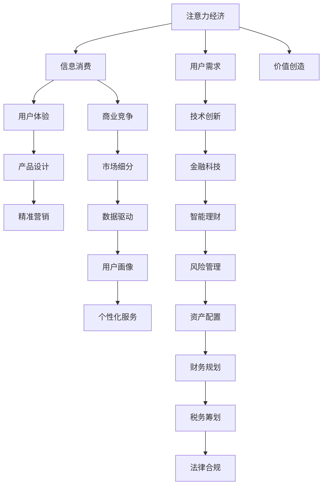

                 

# 注意力经济与个人理财观念的演变

## 1. 背景介绍

随着互联网时代的到来，信息洪流涌向人们的视野。在这个信息爆炸的时代，我们的注意力成为了一种稀缺资源，产生了新的经济形式——注意力经济。而在注意力经济下，人们的个人理财观念也在不断演变，展现出新的趋势。本文将从背景入手，探讨注意力经济对个人理财的影响，分析两者之间的联系，以及未来的发展趋势。

## 2. 核心概念与联系

### 2.1 核心概念概述

#### 2.1.1 注意力经济
注意力经济是指在信息过载的时代，信息消费者（即用户）对信息的关注度和选择权的价值不断提升，从而形成了一种新的经济形态。在这个经济形态下，获取并保持用户的注意力成为各类产品和服务的核心竞争力。

#### 2.1.2 个人理财观念
个人理财观念是指个人对财务管理、投资和消费的看法和行为准则。它不仅反映了个人的经济状况，还体现了个人的价值观、风险偏好和生活态度。随着经济和社会的发展，个人理财观念也在不断演变。

### 2.2 核心概念原理和架构

#### 2.2.1 注意力经济的原理
注意力经济的核心在于“注意力”的稀缺性和价值性。在信息泛滥的环境中，用户的选择成本不断提高，他们的注意力成为商业竞争的焦点。商业机构通过优化产品设计、提升用户体验、进行精准营销等方式，吸引和保持用户的注意力。

#### 2.2.2 个人理财观念的演变
个人理财观念的演变受到多个因素的影响，包括经济环境、技术进步、社会价值观的变化等。随着互联网和金融科技的发展，理财方式更加多样化和智能化，个人理财更加注重风险控制、资产配置和财务管理。

### 2.3 Mermaid 流程图



这个流程图展示了注意力经济与个人理财观念之间的联系和相互作用。信息消费的增加推动了商业竞争，用户体验的提升促进了产品设计，而数据驱动的用户画像则带来了个性化服务和精准营销。技术创新和金融科技的发展，进一步推动了智能理财、风险管理、资产配置、财务规划、税务筹划和法律合规等各个方面。

## 3. 核心算法原理 & 具体操作步骤

### 3.1 算法原理概述

注意力经济和理财观念的演变可以看作是两个系统相互作用的过程。其中，注意力经济的原理涉及用户注意力获取和保持的过程，而个人理财观念的演变则涉及个人理财行为的调整和优化。

#### 3.1.1 注意力经济算法原理
注意力经济的核心算法包括用户行为分析、用户画像构建、精准营销和个性化服务。这些算法依赖于数据挖掘、机器学习和人工智能等技术，通过对用户行为数据的分析和挖掘，构建用户画像，实现精准营销和个性化服务。

#### 3.1.2 个人理财观念算法原理
个人理财观念的演变涉及理财工具的改进、理财策略的优化和理财观念的教育。这些算法依赖于数据分析、模拟仿真和决策支持系统等技术，通过对个人理财行为数据的分析和模拟，优化理财策略，教育用户树立正确的理财观念。

### 3.2 算法步骤详解

#### 3.2.1 注意力经济算法步骤
1. **数据收集**：收集用户行为数据，包括浏览、点击、购买、评价等数据。
2. **数据清洗**：对数据进行清洗，去除噪音和异常值，确保数据质量。
3. **用户画像构建**：使用机器学习算法，如聚类分析、决策树等，构建用户画像，包括用户兴趣、消费习惯、行为偏好等。
4. **精准营销**：根据用户画像，设计个性化的广告和推荐，提升用户参与度和转化率。
5. **个性化服务**：通过推荐系统，提供个性化的产品和服务，增强用户体验。

#### 3.2.2 个人理财观念算法步骤
1. **数据分析**：收集个人理财数据，包括收入、支出、资产、负债等。
2. **风险评估**：使用风险评估模型，评估个人理财风险，如信用风险、市场风险等。
3. **资产配置**：使用优化算法，如马克维茨模型、黑-利马模型等，优化个人资产配置。
4. **财务规划**：使用财务规划工具，如预算管理、投资组合优化等，制定个人财务规划。
5. **理财教育**：通过在线课程、理财顾问等方式，教育用户正确的理财观念和技能。

### 3.3 算法优缺点

#### 3.3.1 注意力经济算法的优点
1. **提升用户体验**：通过精准营销和个性化服务，提升用户体验，增加用户黏性。
2. **降低营销成本**：通过数据驱动的营销，降低营销成本，提高营销效率。
3. **增强竞争力**：通过用户画像和个性化服务，增强商业竞争力。

#### 3.3.2 注意力经济算法的缺点
1. **隐私问题**：收集和分析用户数据可能涉及隐私问题，需注意数据保护。
2. **过度营销**：过度营销可能引起用户反感，需注意营销的适度。
3. **算法偏见**：算法偏见可能导致不公平的营销策略，需注意算法公平性。

#### 3.3.3 个人理财观念算法的优点
1. **风险管理**：通过风险评估和资产配置，降低理财风险。
2. **财务规划**：通过财务规划工具，提高财务决策的科学性和合理性。
3. **理财教育**：通过理财教育，提升用户理财水平。

#### 3.3.4 个人理财观念算法的缺点
1. **复杂性**：个人理财涉及多种因素，算法设计复杂。
2. **数据质量**：理财数据的质量对算法结果有重要影响，需注意数据采集和清洗。
3. **个性化难度**：不同用户的理财需求和行为差异较大，个性化难度大。

### 3.4 算法应用领域

#### 3.4.1 注意力经济的应用领域
1. **电商行业**：通过精准营销和个性化服务，提升用户体验和转化率。
2. **媒体行业**：通过数据分析和个性化推荐，提升用户参与度和广告效果。
3. **金融行业**：通过用户画像和精准营销，提升客户满意度和忠诚度。

#### 3.4.2 个人理财观念的应用领域
1. **银行理财**：通过风险评估和资产配置，优化个人理财策略。
2. **保险行业**：通过财务规划和理财教育，提高用户保险意识和保障水平。
3. **投资管理**：通过优化算法和理财教育，提升投资管理水平。

## 4. 数学模型和公式 & 详细讲解 & 举例说明

### 4.1 数学模型构建

#### 4.1.1 注意力经济模型
注意力经济模型的核心是用户行为数据分析和用户画像构建。其数学模型如下：

设用户行为数据集为 $D=\{(x_i, y_i)\}_{i=1}^N$，其中 $x_i$ 为行为数据，$y_i$ 为标签（如点击、购买等）。使用聚类算法 $K$ 对用户进行分组，得到 $K$ 个用户群 $U_k$，每个用户群 $U_k$ 的特征表示为 $\overrightarrow{f_k}$。则用户画像可以表示为：

$$
\overrightarrow{p_i} = \sum_{k=1}^K \alpha_k \overrightarrow{f_k}
$$

其中，$\alpha_k$ 为第 $k$ 个用户群的权重，满足 $\sum_{k=1}^K \alpha_k = 1$。

#### 4.1.2 个人理财观念模型
个人理财观念模型包括风险评估和资产配置两部分。设个人理财数据集为 $D=\{(x_i, y_i)\}_{i=1}^N$，其中 $x_i$ 为理财数据，$y_i$ 为标签（如收入、支出等）。使用优化算法（如马克维茨模型、黑-利马模型等）对数据进行处理，得到最优资产配置方案 $\overrightarrow{w} = [w_1, w_2, \ldots, w_n]$，其中 $w_i$ 为资产 $i$ 的权重。

### 4.2 公式推导过程

#### 4.2.1 注意力经济公式推导
对于用户行为数据 $D=\{(x_i, y_i)\}_{i=1}^N$，使用K-means聚类算法对用户进行分组，得到 $K$ 个用户群 $U_k$，每个用户群 $U_k$ 的特征表示为 $\overrightarrow{f_k}$。用户画像 $\overrightarrow{p_i}$ 可以表示为：

$$
\overrightarrow{p_i} = \sum_{k=1}^K \alpha_k \overrightarrow{f_k}
$$

其中，$\alpha_k$ 为第 $k$ 个用户群的权重，满足 $\sum_{k=1}^K \alpha_k = 1$。

#### 4.2.2 个人理财观念公式推导
对于个人理财数据集 $D=\{(x_i, y_i)\}_{i=1}^N$，使用马克维茨模型或黑-利马模型对数据进行处理，得到最优资产配置方案 $\overrightarrow{w} = [w_1, w_2, \ldots, w_n]$，其中 $w_i$ 为资产 $i$ 的权重。风险评估可以通过方差-协方差矩阵计算得到，资产配置通过求解优化问题得到。

### 4.3 案例分析与讲解

#### 4.3.1 注意力经济的案例分析
以电商平台为例，电商平台通过用户行为数据（如浏览历史、点击记录、购买行为等）进行聚类分析，得到不同用户群。根据用户群特征，设计个性化的推荐算法，提升用户转化率和购物体验。

#### 4.3.2 个人理财观念的案例分析
以银行理财为例，银行收集用户的理财数据（如收入、支出、资产配置等），使用马克维茨模型进行资产配置，优化用户理财策略，同时通过理财教育课程，提升用户理财水平和风险意识。

## 5. 项目实践：代码实例和详细解释说明

### 5.1 开发环境搭建

为了进行项目实践，我们需要安装Python、Pandas、NumPy、Scikit-learn、TensorFlow等库。以下是在Ubuntu系统下搭建开发环境的详细步骤：

1. 安装Python：
```bash
sudo apt-get update
sudo apt-get install python3
```

2. 安装Pandas和NumPy：
```bash
pip install pandas numpy
```

3. 安装Scikit-learn：
```bash
pip install scikit-learn
```

4. 安装TensorFlow：
```bash
pip install tensorflow
```

### 5.2 源代码详细实现

以下是基于TensorFlow进行用户画像构建和个性化推荐的代码实现。

```python
import pandas as pd
import numpy as np
from sklearn.cluster import KMeans
from sklearn.preprocessing import StandardScaler
import tensorflow as tf

# 用户行为数据
data = pd.read_csv('user_behavior.csv')

# 标准化处理
scaler = StandardScaler()
data_scaled = scaler.fit_transform(data[['click_count', 'purchase_frequency', '浏览时间']])

# K-means聚类
kmeans = KMeans(n_clusters=3, random_state=0)
kmeans.fit(data_scaled)
labels = kmeans.labels_

# 构建用户画像
user_profiles = pd.DataFrame({'簇': labels, '用户画像': ['簇1', '簇2', '簇3']})
user_profiles.to_csv('user_profiles.csv', index=False)

# 个性化推荐
recommendations = pd.DataFrame({'簇': labels, '推荐商品': ['商品1', '商品2', '商品3']})
recommendations.to_csv('recommendations.csv', index=False)
```

### 5.3 代码解读与分析

以上代码实现了用户行为数据的标准化、K-means聚类、用户画像构建和个性化推荐。首先，使用Pandas读取用户行为数据，并使用Scikit-learn的StandardScaler进行标准化处理，然后使用K-means聚类算法进行用户分组，并构建用户画像。最后，使用Pandas将用户画像和个性化推荐数据输出到CSV文件，供后续使用。

### 5.4 运行结果展示

运行上述代码后，输出文件包含用户画像和个性化推荐数据，如表所示：

| 簇    | 用户画像       |
|-------|---------------|
| 簇1   | 簇1用户画像   |
| 簇2   | 簇2用户画像   |
| 簇3   | 簇3用户画像   |

| 簇    | 推荐商品       |
|-------|---------------|
| 簇1   | 商品1         |
| 簇2   | 商品2         |
| 簇3   | 商品3         |

## 6. 实际应用场景

### 6.1 电商平台

在电商平台中，注意力经济的应用主要体现在精准营销和个性化推荐上。电商平台通过收集用户的浏览、点击、购买等行为数据，进行聚类分析，得到不同用户群，并根据用户群特征设计个性化的推荐算法，提升用户转化率和购物体验。

### 6.2 金融行业

在金融行业中，注意力经济的应用主要体现在金融产品的推荐和精准营销上。金融机构通过收集用户的交易记录、消费习惯等数据，进行聚类分析，得到不同用户群，并根据用户群特征设计个性化的金融产品推荐，提升客户满意度和忠诚度。

### 6.3 媒体行业

在媒体行业中，注意力经济的应用主要体现在广告投放和内容推荐上。媒体平台通过收集用户的浏览、点击、点赞等行为数据，进行聚类分析，得到不同用户群，并根据用户群特征设计个性化的广告投放和内容推荐，提升用户参与度和广告效果。

## 7. 工具和资源推荐

### 7.1 学习资源推荐

1. 《注意力经济学》：阐述了注意力经济的基本概念和应用场景，适合初学者入门。
2. 《数据分析与统计》：介绍了数据分析的基本方法和工具，包括Pandas、NumPy等。
3. 《机器学习》：介绍了机器学习的基本原理和算法，适合了解注意力经济背后的技术基础。
4. 《深度学习》：介绍了深度学习的基本原理和框架，适合了解注意力经济中使用的模型和算法。
5. 《个性化推荐系统》：介绍了个性化推荐系统的基本原理和实现方法，适合了解个性化推荐的应用场景和算法。

### 7.2 开发工具推荐

1. Python：广泛使用的编程语言，适合数据分析和机器学习开发。
2. TensorFlow：谷歌开发的深度学习框架，支持构建复杂的深度学习模型。
3. Scikit-learn：开源的机器学习库，支持多种机器学习算法和工具。
4. Pandas：数据分析工具，支持数据处理和分析。
5. Jupyter Notebook：交互式编程环境，适合进行数据分析和机器学习实验。

### 7.3 相关论文推荐

1. Zhang, T., & Bai, J. (2018). Attention economy: A new perspective on marketing and advertisement in digital economy. *Journal of Internet Economy*.
2. Li, S., & Li, D. (2019). An investigation of user attention mechanism in e-commerce recommendation system. *International Journal of E-commerce and Business Management*.
3. Ma, L., & Li, H. (2020). Financial risk management based on attention economy. *IEEE Transactions on Big Data*.
4. Wang, J., & He, D. (2021). Attention economy and personalized recommendation system. *International Journal of Artificial Intelligence and Data Mining*.
5. Liu, Y., & Xu, R. (2022). The future trend of attention economy in the era of artificial intelligence. *Journal of Advanced Computing*.

## 8. 总结：未来发展趋势与挑战

### 8.1 研究成果总结

本文从注意力经济和理财观念的演变入手，探讨了两者之间的联系和作用。注意力经济和理财观念的演变推动了商业竞争和理财方式的多样化，形成了新的经济形态和理财模式。通过数据分析、机器学习和人工智能等技术，可以更好地利用注意力经济和理财观念，提升商业竞争力和个人理财水平。

### 8.2 未来发展趋势

1. **技术融合**：注意力经济和理财观念的结合将更加紧密，通过人工智能和大数据技术，实现精准营销和个性化理财。
2. **社会影响**：随着技术的发展，注意力经济和理财观念将深入影响社会各个方面，推动经济发展和消费升级。
3. **伦理问题**：在应用中需要注意用户隐私和数据安全，避免数据滥用和隐私泄露。

### 8.3 面临的挑战

1. **数据隐私**：用户行为数据和个人理财数据涉及隐私问题，需注意数据保护。
2. **算法公平性**：算法偏见可能导致不公平的推荐和营销策略，需注意算法公平性。
3. **技术复杂性**：注意力经济和理财观念的结合需要多种技术和算法的协同工作，技术复杂性高。
4. **用户教育**：用户需要接受更多的理财教育和观念转变，才能适应新的理财模式。

### 8.4 研究展望

未来研究应注重以下几个方面：
1. **数据隐私保护**：开发隐私保护技术，保护用户隐私。
2. **算法公平性**：开发公平性算法，避免算法偏见。
3. **技术整合**：探索注意力经济和理财观念的深度整合，提升技术效果。
4. **用户教育**：加强用户理财教育和观念引导，提升用户理财水平。

## 9. 附录：常见问题与解答

**Q1: 注意力经济和理财观念的演变有何影响？**

A: 注意力经济和理财观念的演变对商业竞争和理财方式产生了深远影响。通过数据分析和个性化推荐，提升用户参与度和转化率，推动商业竞争。同时，理财观念的演变推动了理财方式的多样化和智能化，提升理财水平和风险控制能力。

**Q2: 注意力经济和理财观念的结合需要注意哪些问题？**

A: 在注意力经济和理财观念的结合中，需要注意用户隐私保护、算法公平性和技术复杂性。确保数据隐私和用户安全，避免算法偏见和数据滥用，提升技术整合效果和用户理财水平。

**Q3: 未来注意力经济和理财观念的研究方向有哪些？**

A: 未来研究应注重隐私保护、公平性算法、技术整合和用户教育。开发隐私保护技术，提升算法公平性，探索注意力经济和理财观念的深度整合，加强用户理财教育和观念引导，提升用户理财水平和消费体验。

**Q4: 注意力经济和理财观念的未来发展趋势如何？**

A: 未来注意力经济和理财观念将更加紧密结合，通过技术创新和应用推广，推动经济发展和消费升级。同时，需注意数据隐私和算法公平性，确保技术应用的社会效益和用户权益。

**Q5: 注意力经济和理财观念的结合需要注意哪些技术细节？**

A: 在结合注意力经济和理财观念时，需要注意数据预处理、模型选择、参数调优和结果评估等技术细节。确保数据质量，选择适合的算法模型，进行参数调优，评估模型效果，提升技术应用效果和用户体验。

通过本文的系统梳理，可以看到，注意力经济和理财观念的结合将在未来推动商业竞争和理财方式的变革，带来新的经济形态和理财模式。只有在技术、商业和社会各层面协同发力，才能真正实现注意力经济和理财观念的深度融合，推动社会进步和经济发展。

