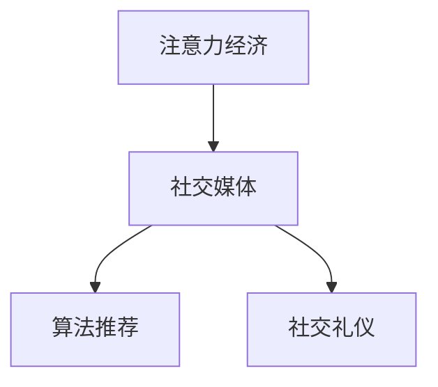

                 

# 注意力经济与个人社交礼仪的演变

在数字时代，注意力成为了最宝贵的资源之一。互联网、社交媒体、新闻媒体等平台，都在竞相争夺用户的注意力。这一趋势不仅改变了市场和经济的运作方式，也深刻影响了个人的社交礼仪。本文将深入探讨注意力经济的本质，分析其对个人社交礼仪演变的驱动作用，并提供一些建议和策略，帮助个人在注意力经济中游刃有余，提升社交礼仪水平。

## 1. 背景介绍

### 1.1 注意力经济的概念与兴起

注意力经济，是指以吸引、利用和优化人类注意力资源为核心内容的经济形态。在互联网时代，信息的爆炸式增长导致注意力成为稀缺资源，争夺注意力的市场应运而生。广告、搜索引擎、社交媒体等都是注意力经济的重要形式。

注意力经济的兴起，源于以下几个关键因素：

1. **信息过载**：现代社会信息量呈指数级增长，用户每天面临海量的信息选择，需要投入大量时间和精力做出决策。
2. **时间稀缺**：随着生活节奏的加快，个人时间变得稀缺，用户更加注重如何有效利用时间。
3. **个性化需求**：用户希望在信息流中获取符合自身兴趣和需求的内容，个性化成为主流。

这些因素共同作用，推动了注意力经济的蓬勃发展。平台和商家通过精准的广告投放、个性化推荐等手段，最大化利用用户的注意力资源。

### 1.2 社交媒体的兴起与影响

社交媒体的兴起，对个人社交礼仪产生了深远影响。以Facebook、Twitter、Instagram等为代表的社交平台，改变了人们的沟通方式和社交习惯。

1. **即时沟通**：社交媒体提供了即时通信工具，如WhatsApp、微信等，改变了传统的电话和邮件沟通方式。
2. **社交网络**：用户可以构建个人社交网络，分享生活点滴，获取朋友动态，这要求用户更加注重个人形象的维护和社交礼仪的遵守。
3. **公共形象管理**：社交媒体平台上的公开信息，可能被公众关注，用户需要更加谨慎地管理自己的公共形象。

## 2. 核心概念与联系

### 2.1 核心概念概述

在探讨注意力经济与个人社交礼仪的演变时，我们需要理解几个核心概念：

- **注意力经济**：以吸引、利用和优化注意力资源为核心内容的经济形态。
- **社交媒体**：通过互联网平台，让用户建立、分享和维护个人社交网络的应用。
- **社交礼仪**：在社交媒体平台上，遵循的规范、习惯和礼仪，旨在维护良好的社交关系。
- **算法推荐**：社交媒体平台利用算法推荐系统，根据用户行为和偏好，个性化推荐内容和广告。

这些概念之间的联系可以通过以下Mermaid流程图来展示：



这个流程图展示了注意力经济与社交媒体、算法推荐和社交礼仪之间的关系。社交媒体平台通过算法推荐，利用用户注意力，提升用户参与度和留存率，同时用户需要在社交媒体上遵循社交礼仪，维护良好的社交关系。

## 3. 核心算法原理 & 具体操作步骤

### 3.1 算法原理概述

社交媒体平台上的算法推荐系统，通常基于用户的浏览、点赞、评论等行为数据，构建用户兴趣模型，进而个性化推荐内容。这种推荐方式能够提升用户满意度和平台留存率。

算法推荐的核心原理包括以下几个步骤：

1. **用户行为数据收集**：平台收集用户的行为数据，如浏览记录、点赞行为、评论内容等。
2. **用户兴趣模型构建**：利用机器学习算法，构建用户兴趣模型，识别用户的偏好和需求。
3. **个性化推荐**：根据用户兴趣模型，为用户推荐最符合其兴趣的内容和广告。

### 3.2 算法步骤详解

以下是社交媒体平台算法推荐的具体操作步骤：

**Step 1: 数据收集与预处理**
- 收集用户的浏览记录、点赞行为、评论内容等数据，进行清洗和预处理。
- 将文本数据转化为向量形式，方便机器学习算法处理。

**Step 2: 用户兴趣模型构建**
- 利用协同过滤、内容推荐、深度学习等算法，构建用户兴趣模型。
- 协同过滤算法通过用户行为矩阵，找到与目标用户兴趣相似的用户，推荐相似用户喜欢的内容。
- 内容推荐算法通过词频统计、TF-IDF等方法，提取内容特征，构建用户兴趣模型。
- 深度学习算法如DNN、LSTM、Transformer等，通过神经网络模型，学习用户兴趣特征。

**Step 3: 个性化推荐**
- 根据用户兴趣模型，为每个用户推荐其最感兴趣的内容和广告。
- 利用A/B测试等方法，评估推荐效果，不断优化算法模型。

### 3.3 算法优缺点

社交媒体平台上的算法推荐具有以下优点：
1. **提升用户满意度**：个性化推荐提高了用户对内容的满意度，增加了用户参与度。
2. **提高留存率**：个性化推荐减少了用户的流失率，提升了平台留存率。
3. **高效运营**：算法推荐能够高效地分配注意力资源，降低运营成本。

同时，该算法也存在一些缺点：
1. **用户隐私问题**：大量用户行为数据的收集和使用，可能侵犯用户隐私。
2. **信息泡沫效应**：个性化推荐可能导致信息泡沫效应，用户陷入同质化的信息圈。
3. **算法偏见**：算法推荐可能受到数据偏见的影响，导致不公平的推荐结果。

### 3.4 算法应用领域

算法推荐技术不仅在社交媒体上广泛应用，还渗透到了电商、新闻、视频等多个领域。以下是一些典型应用场景：

- **电商推荐**：电商平台通过用户浏览和购买记录，推荐个性化商品，提高用户转化率。
- **新闻推荐**：新闻平台通过用户阅读和点赞行为，推荐个性化新闻内容，提升用户留存率。
- **视频推荐**：视频平台通过用户观看记录和点赞行为，推荐个性化视频内容，增加用户观看时长。

这些应用场景展示了算法推荐技术的广泛应用和巨大潜力。

## 4. 数学模型和公式 & 详细讲解 & 举例说明

### 4.1 数学模型构建

社交媒体平台的算法推荐系统，通常基于用户行为数据构建用户兴趣模型。以协同过滤算法为例，构建用户兴趣模型的数学模型如下：

设用户集为 $U$，物品集为 $I$，用户行为矩阵为 $R_{ui}$，表示用户 $u$ 对物品 $i$ 的评分。目标是为新用户 $u'$ 推荐物品 $i$。

协同过滤算法通过计算用户 $u'$ 与已有用户 $u$ 的相似度，找到最相似的用户 $u'$，并推荐其喜欢的物品 $i$。

数学上，协同过滤算法通过计算余弦相似度 $\cos(\theta)$，找到与目标用户 $u'$ 最相似的用户 $u$：

$$
\theta_{u'u} = \frac{R_{u'i} \cdot R_{ui}}{\|R_{u'i}\|\|R_{ui}\|}
$$

### 4.2 公式推导过程

协同过滤算法的核心公式如下：

$$
\hat{R}_{u'i} = \frac{\sum_{u \in U} R_{ui} \cdot \theta_{u'u}}{\sum_{u \in U} \theta_{u'u}}
$$

其中，$\hat{R}_{u'i}$ 表示目标用户 $u'$ 对物品 $i$ 的预测评分。$\theta_{u'u}$ 表示用户 $u'$ 与用户 $u$ 的相似度，$\sum_{u \in U} R_{ui} \cdot \theta_{u'u}$ 表示所有用户的相似度加权行为评分，$\sum_{u \in U} \theta_{u'u}$ 表示所有用户的相似度。

### 4.3 案例分析与讲解

以Amazon推荐系统为例，分析协同过滤算法的实际应用。

**数据收集**：Amazon收集了数亿个用户的浏览和购买记录。

**用户行为预处理**：对用户行为数据进行清洗和标准化，构建用户行为矩阵。

**用户相似度计算**：利用余弦相似度算法，计算用户之间的相似度。

**个性化推荐**：根据相似度加权行为评分，为每个用户生成个性化推荐列表。

## 5. 项目实践：代码实例和详细解释说明

### 5.1 开发环境搭建

在开始实践之前，需要先搭建好开发环境。以下是Python和PyTorch环境的搭建步骤：

1. 安装Python：选择Python 3.x版本，下载并安装。
2. 安装PyTorch：在Python环境中，使用以下命令安装PyTorch：
   ```bash
   pip install torch torchvision torchaudio
   ```
3. 安装相关库：安装Numpy、Pandas、Scikit-learn等常用库，用于数据处理和分析。

### 5.2 源代码详细实现

以下是基于协同过滤算法的用户推荐系统代码实现：

```python
import numpy as np
from sklearn.metrics.pairwise import cosine_similarity

# 构建用户行为矩阵
def build_user_matrix(data):
    user_count = len(set(data['user_id']))
    item_count = len(set(data['item_id']))
    R = np.zeros((user_count, item_count))
    for i in data:
        R[i['user_id']-1, i['item_id']-1] = i['rating']
    return R

# 计算用户相似度
def compute_similarity(R):
    user_count = R.shape[0]
    similarity_matrix = np.zeros((user_count, user_count))
    for i in range(user_count):
        for j in range(user_count):
            if i == j:
                continue
            similarity_matrix[i, j] = cosine_similarity(R[i, :], R[j, :])[0][0]
    return similarity_matrix

# 推荐新用户喜欢的物品
def recommend_items(R, u, k):
    user_count = R.shape[0]
    user_similarity = compute_similarity(R)
    user_interest = R[u]
    recommendation_scores = np.dot(user_similarity, user_interest)
    top_k_indices = np.argsort(recommendation_scores)[::-1][0:k]
    top_k_items = []
    for index in top_k_indices:
        if np.dot(R[:, index], user_interest) > 0:
            top_k_items.append(index + 1)
    return top_k_items
```

### 5.3 代码解读与分析

以上代码实现了基于协同过滤算法的用户推荐系统。其主要步骤如下：

1. **用户行为矩阵构建**：将用户行为数据转化为用户行为矩阵。
2. **用户相似度计算**：利用余弦相似度算法，计算用户之间的相似度。
3. **个性化推荐**：根据相似度加权行为评分，为每个用户生成个性化推荐列表。

## 6. 实际应用场景

### 6.1 电商平台推荐

电商平台通过用户浏览和购买行为，推荐个性化商品。例如，Amazon通过分析用户浏览历史和购买记录，推荐类似商品，提高用户转化率。

### 6.2 新闻平台推荐

新闻平台利用用户阅读和点赞行为，推荐个性化新闻内容。例如，今日头条通过分析用户阅读历史和点赞行为，推荐新闻，提升用户留存率。

### 6.3 视频平台推荐

视频平台通过用户观看记录和点赞行为，推荐个性化视频内容。例如，YouTube通过分析用户观看历史和点赞行为，推荐视频，增加用户观看时长。

## 7. 工具和资源推荐

### 7.1 学习资源推荐

1. **《深度学习入门：基于Python的理论与实现》**：介绍深度学习的基本概念和实现方法，适合初学者。
2. **《Python机器学习》**：讲解机器学习算法及其在Python中的实现，适合中级开发者。
3. **《算法设计与分析基础》**：介绍算法设计和分析的基本原理，适合高级开发者。
4. **Coursera上的深度学习课程**：由斯坦福大学开设，提供系统化的深度学习课程，涵盖理论和实践。
5. **Kaggle数据科学竞赛平台**：提供丰富的数据集和竞赛，适合实践学习。

### 7.2 开发工具推荐

1. **Jupyter Notebook**：免费的交互式笔记本，适合数据分析和算法实验。
2. **TensorFlow**：谷歌开源的深度学习框架，支持分布式训练和模型部署。
3. **PyTorch**：Facebook开源的深度学习框架，适合动态图计算。
4. **Scikit-learn**：Python的机器学习库，提供多种常用的机器学习算法。

### 7.3 相关论文推荐

1. **《Collaborative Filtering for Implicit Feedback Datasets》**：提出协同过滤算法的经典论文，详细介绍了协同过滤算法的原理和实现。
2. **《Wide & Deep Learning for Recommender Systems》**：介绍Wide & Deep框架，用于处理稀疏数据和高维特征。
3. **《Deep Interest Theory for Recommender Systems》**：提出Deep Interest Theory，用于建模用户兴趣，提升推荐效果。

## 8. 总结：未来发展趋势与挑战

### 8.1 研究成果总结

本文深入探讨了注意力经济与个人社交礼仪的演变，分析了社交媒体平台上的算法推荐系统的原理和操作步骤。在实际应用中，算法推荐技术广泛应用于电商平台、新闻平台、视频平台等多个领域，显著提升了用户满意度和平台留存率。然而，算法推荐也面临一些挑战，如用户隐私问题、信息泡沫效应和算法偏见等。

### 8.2 未来发展趋势

未来，算法推荐技术将继续深入发展，主要趋势如下：

1. **跨模态推荐**：结合文本、图像、音频等多模态数据，提升推荐效果。
2. **实时推荐**：利用实时数据，动态调整推荐策略，提高推荐精度。
3. **个性化推荐算法**：引入更多深度学习算法，提升推荐模型的性能。

### 8.3 面临的挑战

尽管算法推荐技术取得了显著进展，但仍面临一些挑战：

1. **用户隐私保护**：如何保护用户隐私，防止数据泄露和滥用。
2. **信息泡沫效应**：如何打破信息泡沫效应，避免用户陷入同质化的信息圈。
3. **算法偏见**：如何减少算法偏见，保证公平和透明的推荐结果。

### 8.4 研究展望

未来的研究应重点关注以下几个方面：

1. **跨模态推荐技术**：将多种数据源结合，提升推荐模型的性能。
2. **实时推荐系统**：开发高效的实时推荐系统，适应动态变化的用户需求。
3. **隐私保护技术**：研发隐私保护算法，保护用户数据安全。

## 9. 附录：常见问题与解答

**Q1: 为什么社交媒体上的推荐算法会推荐一些低质量的内容？**

A: 推荐算法会基于用户的行为数据进行推荐，如果用户曾与低质量内容互动，算法会倾向于推荐类似内容。用户需要主动筛选高质量内容，避免低质量内容对自身体验产生负面影响。

**Q2: 如何应对社交媒体上的信息泡沫效应？**

A: 用户需要主动尝试不同类型的信息，拓宽知识面，避免陷入同质化的信息圈。同时，社交媒体平台可以引入多样性推荐策略，打破信息泡沫效应。

**Q3: 如何保护社交媒体用户的隐私？**

A: 用户需要了解平台的数据使用政策，选择隐私保护措施，如限制数据共享等。平台应加强数据安全防护，遵循数据保护法规。

---

作者：禅与计算机程序设计艺术 / Zen and the Art of Computer Programming

