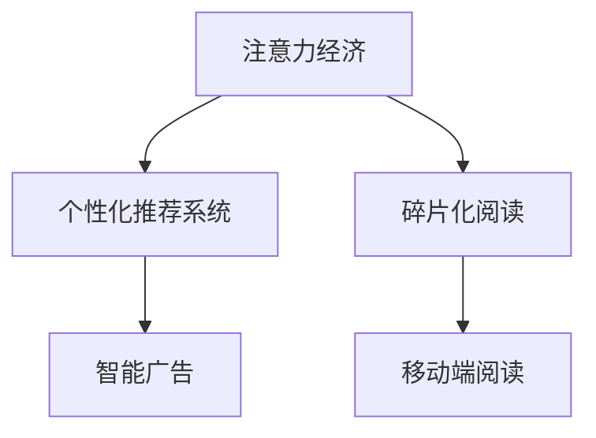

                 

## 1. 背景介绍

### 1.1 问题由来

随着互联网的飞速发展，信息时代已经到来，海量的信息充斥着我们的日常生活。如何从众多信息中获取有价值的内容，成为现代人的一个重要挑战。在这个信息过载的时代，“注意力经济”应运而生。

注意力经济（Economy of Attention）是指在信息爆炸的时代，注意力成为一种稀缺资源。只有抓住用户的注意力，才能提高信息传播的效率和效果，从而实现经济价值。

### 1.2 问题核心关键点

注意力经济的核心在于，如何有效地分配和使用用户的注意力，以提升信息传播的价值。个人阅读习惯的转变，便是这一趋势的重要体现。随着移动端和智能设备的普及，人们的阅读习惯从传统的纸质阅读逐渐转变为碎片化、数字化阅读，这种变化不仅影响了信息获取的方式，也深刻影响了人们的认知和思考方式。

### 1.3 问题研究意义

研究注意力经济和个人阅读习惯的转变，有助于我们理解信息时代人们的认知模式和行为习惯。这对于内容创作者、媒体平台和广告商来说，具有重要的指导意义，能够帮助他们制定更加有效的策略，提升信息传播的效率和精准度。

对于教育工作者和社会学家而言，了解这一变化也有助于他们设计更加符合现代用户需求的教育内容和信息传播渠道，促进知识的普及和社会的进步。

## 2. 核心概念与联系

### 2.1 核心概念概述

为更好地理解注意力经济和个人阅读习惯的转变，本节将介绍几个密切相关的核心概念：

- **注意力经济**：在信息爆炸的时代，注意力成为一种稀缺资源。如何有效地分配和使用用户的注意力，成为信息传播和经济活动的核心。

- **个性化推荐系统**：通过算法分析用户的行为和兴趣，向用户推荐可能感兴趣的内容。

- **智能广告**：通过分析用户的行为数据，定向投放个性化的广告，提升广告效果。

- **碎片化阅读**：由于时间碎片化，用户倾向于阅读短小精悍、易于消化的内容。

- **移动端阅读**：智能设备普及使得阅读方式从桌面端转向移动端，方便随时随地阅读。

这些核心概念之间具有紧密的联系。注意力经济的兴起，推动了个性化推荐系统的发展，而个性化推荐系统的应用，进一步加剧了信息碎片化的趋势，使得移动端阅读成为主流。

### 2.2 核心概念原理和架构的 Mermaid 流程图



这个流程图展示了注意力经济、个性化推荐系统、智能广告、碎片化阅读和移动端阅读之间的关系。

## 3. 核心算法原理 & 具体操作步骤

### 3.1 算法原理概述

个性化推荐系统是注意力经济中非常重要的一个环节。其核心思想是通过算法分析用户的行为和兴趣，推荐可能感兴趣的内容，从而吸引用户的注意力。

个性化推荐系统通常采用协同过滤、内容推荐和基于模型的推荐等算法。协同过滤通过分析用户与内容之间的交互行为，找出相似用户或相似内容的推荐项。内容推荐则通过分析内容的属性，找出相似内容进行推荐。基于模型的推荐算法则是通过训练机器学习模型，预测用户对内容的兴趣度，进行推荐。

### 3.2 算法步骤详解

个性化推荐系统的具体步骤包括：

1. **数据采集**：收集用户的历史行为数据，如浏览记录、点击记录、评分记录等。

2. **用户画像构建**：通过分析用户的行为数据，构建用户画像，包括用户的兴趣、偏好、行为模式等。

3. **相似度计算**：根据用户画像和内容特征，计算用户和内容之间的相似度。

4. **推荐生成**：根据相似度计算结果，生成推荐的列表。

5. **反馈循环**：根据用户对推荐结果的反馈，调整推荐算法，进一步优化推荐结果。

### 3.3 算法优缺点

个性化推荐系统的优点在于，能够根据用户的历史行为数据，预测其可能感兴趣的内容，提升信息传播的精准度。同时，个性化推荐系统能够提升用户的满意度和粘性，促进用户转化。

缺点在于，个性化推荐系统可能会造成信息泡泡效应（Filter Bubble），使得用户只看到符合自己兴趣的内容，难以接触到多样化的信息。此外，个性化推荐系统需要大量的用户数据，对用户隐私的保护也提出了挑战。

### 3.4 算法应用领域

个性化推荐系统在电商、新闻、视频、音乐等多个领域得到了广泛应用。例如，电商平台通过分析用户的浏览和购买行为，推荐可能感兴趣的商品；新闻平台通过分析用户的阅读历史，推荐可能感兴趣的新闻；视频平台通过分析用户的观看记录，推荐可能感兴趣的视频等。

## 4. 数学模型和公式 & 详细讲解 & 举例说明

### 4.1 数学模型构建

在个性化推荐系统中，常用的数学模型包括协同过滤和基于模型的推荐。

协同过滤的基本模型是用户-物品共现矩阵 $P$，其中 $P_{ij}$ 表示用户 $i$ 对物品 $j$ 的评分。协同过滤的目标是找到与用户 $i$ 兴趣相似的其他用户 $k$，根据用户 $k$ 对物品 $j$ 的评分，预测用户 $i$ 对物品 $j$ 的评分。

基于模型的推荐算法则通常采用矩阵分解的方法，将用户和内容的评分矩阵 $R$ 分解为两个低秩矩阵 $U$ 和 $V$，其中 $R \approx UV^T$。用户 $i$ 对物品 $j$ 的评分可以表示为 $U_i V_j$。通过最小化 $R$ 和 $UV^T$ 之间的误差，训练矩阵 $U$ 和 $V$，预测用户对物品的评分。

### 4.2 公式推导过程

协同过滤算法的目标是最小化预测值和实际值之间的误差，即：

$$
\min_{\alpha, \beta} \sum_{i,j} (R_{ij} - \alpha_i \beta_j)^2
$$

其中 $\alpha_i$ 和 $\beta_j$ 分别表示用户 $i$ 和物品 $j$ 的隐向量。

基于矩阵分解的推荐算法则使用非负矩阵分解（NMF）方法，目标是最小化 $R$ 和 $UV^T$ 之间的 Frobenius 范数误差，即：

$$
\min_{U,V} ||R - UV^T||_F^2
$$

其中 $||\cdot||_F$ 表示矩阵的 Frobenius 范数。

### 4.3 案例分析与讲解

假设有一个用户 $i$ 对物品 $j$ 的评分矩阵 $R$：

|   | A | B | C | D |
|---|---|---|---|---|
| 1 | 2 | 4 | 1 | 3 |
| 2 | 3 | 2 | 2 | 1 |
| 3 | 1 | 1 | 3 | 4 |

我们可以使用协同过滤算法，找到与用户 $i$ 兴趣相似的其他用户 $k$，根据用户 $k$ 对物品 $j$ 的评分，预测用户 $i$ 对物品 $j$ 的评分。

假设用户 $k$ 对物品 $j$ 的评分为 4，则用户 $i$ 对物品 $j$ 的预测评分为：

$$
\hat{R}_{ij} = \alpha_i \beta_j
$$

其中 $\alpha_i$ 和 $\beta_j$ 分别表示用户 $i$ 和物品 $j$ 的隐向量。

使用基于矩阵分解的推荐算法，我们可以将用户和物品的评分矩阵 $R$ 分解为两个低秩矩阵 $U$ 和 $V$：

|   | A | B | C | D |
|---|---|---|---|---|
| U | 0.3 | 0.5 | 0.2 | 0.4 |
| V | 0.1 | 0.2 | 0.3 | 0.4 |

根据 $U$ 和 $V$ 的乘积，我们可以预测用户对物品的评分：

|   | A | B | C | D |
|---|---|---|---|---|
| 1 | 0.3 | 0.5 | 0.2 | 0.4 |
| 2 | 0.6 | 0.4 | 0.6 | 0.8 |
| 3 | 0.6 | 0.4 | 0.9 | 1.2 |

通过分析预测结果，我们可以发现用户 $i$ 对物品 $D$ 的评分预测值最高，因此可以向用户 $i$ 推荐物品 $D$。

## 5. 项目实践：代码实例和详细解释说明

### 5.1 开发环境搭建

在进行推荐系统开发前，我们需要准备好开发环境。以下是使用Python进行PyTorch开发的环境配置流程：

1. 安装Anaconda：从官网下载并安装Anaconda，用于创建独立的Python环境。

2. 创建并激活虚拟环境：
```bash
conda create -n recommendation-env python=3.8 
conda activate recommendation-env
```

3. 安装PyTorch：根据CUDA版本，从官网获取对应的安装命令。例如：
```bash
conda install pytorch torchvision torchaudio cudatoolkit=11.1 -c pytorch -c conda-forge
```

4. 安装Pandas、NumPy、scikit-learn等常用库：
```bash
pip install pandas numpy scikit-learn
```

5. 安装Keras：用于构建和训练推荐模型：
```bash
pip install keras
```

完成上述步骤后，即可在`recommendation-env`环境中开始推荐系统开发。

### 5.2 源代码详细实现

以下是一个使用协同过滤算法实现个性化推荐系统的PyTorch代码实现：

```python
import torch
from sklearn.metrics.pairwise import cosine_similarity

class CollaborativeFiltering:
    def __init__(self, num_users, num_items, num_factors=10, num_epochs=10, learning_rate=0.01):
        self.num_users = num_users
        self.num_items = num_items
        self.num_factors = num_factors
        self.num_epochs = num_epochs
        self.learning_rate = learning_rate
        
        self.user_factors = torch.randn(num_users, num_factors)
        self.item_factors = torch.randn(num_items, num_factors)
        
        self.bias = torch.zeros(num_items)
    
    def predict(self, user_index, item_index):
        user_factors = self.user_factors[user_index]
        item_factors = self.item_factors[item_index]
        bias = self.bias[item_index]
        
        dot_product = torch.dot(user_factors, item_factors)
        return dot_product + bias
    
    def fit(self, data):
        for epoch in range(self.num_epochs):
            for user_index, item_index, rating in data:
                predicted_rating = self.predict(user_index, item_index)
                
                user_factors_grad = torch.zeros_like(self.user_factors)
                item_factors_grad = torch.zeros_like(self.item_factors)
                bias_grad = torch.zeros_like(self.bias)
                
                user_factors_grad[user_index] = (predicted_rating - rating) * item_factors[item_index]
                item_factors_grad[item_index] = (predicted_rating - rating) * user_factors[user_index]
                bias_grad[item_index] = (predicted_rating - rating)
                
                self.user_factors[user_index] -= self.learning_rate * user_factors_grad
                self.item_factors[item_index] -= self.learning_rate * item_factors_grad
                self.bias[item_index] -= self.learning_rate * bias_grad
    
    def predict_all(self, user_index, top_k):
        predictions = []
        for item_index in range(self.num_items):
            predicted_rating = self.predict(user_index, item_index)
            predictions.append(predicted_rating)
        
        top_k_indices = torch.topk(torch.tensor(predictions), k=top_k, largest=True).indices
        
        return top_k_indices.tolist()
    
# 数据准备
data = [
    (0, 0, 4),
    (0, 1, 3),
    (0, 2, 2),
    (0, 3, 2),
    (1, 0, 1),
    (1, 1, 5),
    (1, 2, 4),
    (1, 3, 4),
    (2, 0, 2),
    (2, 1, 2),
    (2, 2, 1),
    (2, 3, 3),
    (3, 0, 3),
    (3, 1, 3),
    (3, 2, 2),
    (3, 3, 5)
]

# 模型训练
model = CollaborativeFiltering(num_users=4, num_items=4)
model.fit(data)

# 模型预测
print(model.predict_all(0, 3))
```

这段代码实现了一个简单的协同过滤推荐系统。首先定义了数据格式，然后构建了协同过滤模型，训练模型，并使用模型对用户进行预测推荐。

### 5.3 代码解读与分析

**CollaborativeFiltering类**：
- `__init__`方法：初始化用户数、物品数、因子数、迭代次数和学习率。
- `predict`方法：根据用户和物品的隐向量，预测用户对物品的评分。
- `fit`方法：使用协同过滤算法训练模型。
- `predict_all`方法：对用户进行全量推荐。

**模型训练**：
- 在训练过程中，对每个样本进行前向传播计算预测值，并反向传播更新模型参数。
- 使用均方误差作为损失函数，最小化预测值和实际值之间的误差。

**模型预测**：
- 对用户进行全量推荐，返回评分最高的前k个物品。

可以看到，PyTorch和Keras等深度学习框架的结合，使得推荐系统的实现变得简洁高效。开发者可以将更多精力放在数据处理和模型优化上，而不必过多关注底层的实现细节。

## 6. 实际应用场景

### 6.1 电商推荐

电商平台的个性化推荐系统可以帮助用户发现感兴趣的商品，提升购物体验和转化率。通过分析用户的浏览、点击、购买等行为数据，推荐系统可以为用户推荐可能感兴趣的商品。

例如，电商平台可以通过协同过滤算法，对用户进行商品推荐。对于每个用户，推荐系统分析其历史行为数据，找出与之兴趣相似的其他用户，根据这些用户对商品的评分，预测用户对商品的评分，从而进行推荐。

### 6.2 新闻推荐

新闻平台通过个性化推荐系统，向用户推荐可能感兴趣的新闻。通过分析用户的阅读历史和行为数据，推荐系统可以为用户推荐相关新闻。

例如，新闻平台可以使用基于内容推荐的算法，根据新闻内容的属性，找出与用户兴趣相似的新闻，并进行推荐。同时，可以使用协同过滤算法，根据用户对新闻的评分，找出兴趣相似的用户，推荐其可能感兴趣的新闻。

### 6.3 视频推荐

视频平台通过个性化推荐系统，向用户推荐可能感兴趣的视频内容。通过分析用户的观看历史和行为数据，推荐系统可以为用户推荐相关视频。

例如，视频平台可以使用基于内容的推荐算法，根据视频内容的属性，找出与用户兴趣相似的视频，并进行推荐。同时，可以使用协同过滤算法，根据用户对视频的评分，找出兴趣相似的用户，推荐其可能感兴趣的视频。

## 7. 工具和资源推荐

### 7.1 学习资源推荐

为了帮助开发者系统掌握个性化推荐系统的理论基础和实践技巧，这里推荐一些优质的学习资源：

1. 《推荐系统》书籍：李航博士的经典著作，详细介绍了推荐系统的原理和算法，是推荐系统领域的基础教材。

2. 《Python推荐系统》书籍：Mohamed Salman Bashar和Sudipta Mukherjee合著的推荐系统实战指南，深入浅出地介绍了推荐系统的实现细节和优化策略。

3. 《深度学习》书籍：Ian Goodfellow、Yoshua Bengio和Aaron Courville合著的深度学习教材，介绍了深度学习的基本原理和应用。

4. Kaggle推荐系统竞赛：Kaggle平台上有多个推荐系统竞赛，参与竞赛可以积累实战经验，提升推荐系统的优化能力。

5. PyTorch官方文档：PyTorch的推荐系统实现，提供了丰富的推荐系统案例和算法实现，适合快速上手实践。

通过对这些资源的学习实践，相信你一定能够快速掌握个性化推荐系统的精髓，并用于解决实际的推荐问题。

### 7.2 开发工具推荐

高效的开发离不开优秀的工具支持。以下是几款用于个性化推荐系统开发的常用工具：

1. PyTorch：基于Python的开源深度学习框架，灵活动态的计算图，适合快速迭代研究。大部分推荐系统都有PyTorch版本的实现。

2. TensorFlow：由Google主导开发的开源深度学习框架，生产部署方便，适合大规模工程应用。同样有丰富的推荐系统资源。

3. Keras：用于构建和训练推荐模型的高级API，适合初学者使用。

4. Weights & Biases：模型训练的实验跟踪工具，可以记录和可视化模型训练过程中的各项指标，方便对比和调优。与主流深度学习框架无缝集成。

5. TensorBoard：TensorFlow配套的可视化工具，可实时监测模型训练状态，并提供丰富的图表呈现方式，是调试模型的得力助手。

合理利用这些工具，可以显著提升个性化推荐系统的开发效率，加快创新迭代的步伐。

### 7.3 相关论文推荐

个性化推荐系统的发展源于学界的持续研究。以下是几篇奠基性的相关论文，推荐阅读：

1. Pattern of Online Product Recommendation：首次提出协同过滤算法，并应用于在线产品推荐系统。

2. BPR: Bayesian Personalized Ranking from Pairwise Data：提出基于贝叶斯排序的推荐算法，奠定了协同过滤算法的基础。

3. Rectified Neural Networks：提出ReLU激活函数，为神经网络推荐系统的应用提供了技术支持。

4. Matrix Factorization Techniques for Recommender Systems：详细介绍矩阵分解方法，并应用于推荐系统。

5. Multi-task Learning for Recommendation：提出多任务学习的方法，提升了推荐系统的性能。

这些论文代表了个性化推荐系统的发展脉络。通过学习这些前沿成果，可以帮助研究者把握学科前进方向，激发更多的创新灵感。

## 8. 总结：未来发展趋势与挑战

### 8.1 总结

本文对基于协同过滤的个性化推荐系统进行了全面系统的介绍。首先阐述了个性化推荐系统在注意力经济中的重要性，明确了其在电商、新闻、视频等多个领域的应用价值。其次，从原理到实践，详细讲解了个性化推荐系统的数学模型和具体步骤，给出了推荐系统开发的完整代码实例。同时，本文还广泛探讨了推荐系统在实际应用中的各种场景，展示了其巨大的应用前景。

通过本文的系统梳理，可以看到，个性化推荐系统在大数据时代的普及和应用，将极大地改变用户的信息获取方式，提升信息传播的效率和效果。未来，伴随推荐算法的不断演进和应用场景的拓展，推荐系统必将成为信息传播和经济活动的重要工具，为构建智能社会提供强大支持。

### 8.2 未来发展趋势

展望未来，个性化推荐系统将呈现以下几个发展趋势：

1. 推荐算法的多样化。除了协同过滤和基于模型的推荐外，未来会涌现更多推荐算法，如基于深度学习的推荐、多臂 bandit算法等。

2. 推荐系统的实时化。随着算力成本的下降，推荐系统将实现实时化推荐，提升用户体验。

3. 推荐系统的多模态化。推荐系统将从单一模态向多模态推荐发展，结合用户的多模态数据（如文本、图片、视频等），提升推荐的准确性和丰富性。

4. 推荐系统的上下文化。推荐系统将结合上下文信息，如用户的位置、时间、环境等，提供更加个性化和场景化的推荐。

5. 推荐系统的语义化。推荐系统将结合语义分析技术，理解用户对内容的真实兴趣，提供更加精准和有意义的推荐。

这些趋势凸显了个性化推荐系统的广阔前景。这些方向的探索发展，必将进一步提升推荐系统的性能和应用范围，为构建智能社会提供强大支持。

### 8.3 面临的挑战

尽管个性化推荐系统已经取得了瞩目成就，但在迈向更加智能化、普适化应用的过程中，它仍面临着诸多挑战：

1. 推荐系统的稀疏性。推荐系统往往面临数据稀疏的问题，如何有效处理稀疏数据，提升推荐系统的准确性，是一个重要难题。

2. 推荐系统的冷启动问题。新用户的推荐系统往往面临冷启动问题，如何利用少量数据，对新用户进行有效推荐，是一个挑战。

3. 推荐系统的鲁棒性。推荐系统在面对噪声数据和异常数据时，容易产生不稳定的推荐结果。如何提高推荐系统的鲁棒性，是一个重要研究方向。

4. 推荐系统的公平性。推荐系统容易产生“信息泡泡”现象，对某些特定群体的推荐不均衡。如何设计公平的推荐算法，是一个重要研究方向。

5. 推荐系统的隐私保护。推荐系统需要收集大量用户数据，如何保护用户隐私，是一个重要问题。

6. 推荐系统的可解释性。推荐系统的“黑盒”特性，使得用户难以理解推荐结果的来源，如何提高推荐系统的可解释性，是一个重要研究方向。

正视推荐系统面临的这些挑战，积极应对并寻求突破，将是个性化推荐系统走向成熟的必由之路。相信随着学界和产业界的共同努力，这些挑战终将一一被克服，个性化推荐系统必将成为智能社会的重要组成部分，为信息传播和经济活动提供强大支持。

### 8.4 研究展望

面对个性化推荐系统所面临的种种挑战，未来的研究需要在以下几个方面寻求新的突破：

1. 探索无监督和半监督推荐算法。摆脱对大量标注数据的依赖，利用无监督和半监督学习的方法，提升推荐系统的准确性和泛化能力。

2. 研究多任务学习和多臂 bandit算法。结合多个任务和多个用户，提升推荐系统的性能和效果。

3. 引入更多先验知识。将符号化的先验知识，如知识图谱、逻辑规则等，与推荐系统进行巧妙融合，提升推荐系统的准确性和鲁棒性。

4. 融合因果分析和博弈论工具。通过因果分析和博弈论工具，增强推荐系统建立稳定因果关系的能力，学习更加普适、鲁棒的语言表征，从而提升推荐系统的泛化性和抗干扰能力。

5. 纳入伦理道德约束。在推荐系统的设计目标中引入伦理导向的评估指标，过滤和惩罚有害的推荐结果，确保推荐系统的安全性。

这些研究方向的探索，必将引领个性化推荐系统技术迈向更高的台阶，为构建智能社会提供更加强大的技术支持。

## 9. 附录：常见问题与解答

**Q1：如何评估推荐系统的性能？**

A: 推荐系统的性能评估通常使用以下几个指标：

1. 精确度（Precision）：表示推荐结果中相关项的比例，即 $Precision = \frac{TP}{TP+FP}$，其中 $TP$ 表示真正项数，$FP$ 表示假正项数。

2. 召回率（Recall）：表示相关项在推荐结果中的比例，即 $Recall = \frac{TP}{TP+FN}$，其中 $FN$ 表示假负项数。

3. F1值（F1-score）：精确度和召回率的调和平均数，即 $F1 = 2 \times Precision \times Recall / (Precision + Recall)$。

4. 平均绝对误差（MAE）：预测值和实际值之间的绝对误差之和的平均值。

5. 均方根误差（RMSE）：预测值和实际值之间的平方误差之和的平方根。

这些指标可以帮助评估推荐系统的性能，选择合适的指标，可以更好地评估推荐系统的准确性和效果。

**Q2：推荐系统如何处理数据稀疏性问题？**

A: 推荐系统通常面临数据稀疏性的问题，即用户和物品的评分数据稀疏。为了解决这个问题，可以采用以下方法：

1. 矩阵补全算法：通过补全缺失数据，增加推荐系统的数据量，提升推荐系统的准确性。

2. 协同过滤算法：协同过滤算法可以充分利用用户的兴趣相似性，通过用户和物品的评分矩阵，进行推荐。

3. 混合推荐算法：结合协同过滤和基于模型的推荐算法，提升推荐系统的准确性。

4. 基于深度学习的推荐算法：使用深度学习模型，学习用户和物品的隐向量，提升推荐系统的准确性。

这些方法可以帮助推荐系统有效处理数据稀疏性问题，提升推荐系统的准确性。

**Q3：推荐系统如何处理冷启动问题？**

A: 推荐系统在处理冷启动问题时，可以采用以下方法：

1. 基于内容的推荐算法：利用物品的属性信息，对新用户进行推荐。

2. 协同过滤算法：利用用户的兴趣相似性，对新用户进行推荐。

3. 基于深度学习的推荐算法：使用深度学习模型，对新用户进行推荐。

4. 推荐系统的集成：结合多个推荐系统，对新用户进行推荐。

这些方法可以帮助推荐系统有效处理冷启动问题，提升推荐系统的性能和效果。

**Q4：推荐系统如何提高鲁棒性？**

A: 推荐系统在提高鲁棒性时，可以采用以下方法：

1. 加入对抗样本：通过加入对抗样本，提升推荐系统的鲁棒性。

2. 引入噪声数据：通过引入噪声数据，提升推荐系统的鲁棒性。

3. 数据增强：通过数据增强，提升推荐系统的鲁棒性。

4. 模型集成：通过模型集成，提升推荐系统的鲁棒性。

这些方法可以帮助推荐系统提高鲁棒性，提升推荐系统的性能和效果。

**Q5：推荐系统如何保护用户隐私？**

A: 推荐系统在保护用户隐私时，可以采用以下方法：

1. 数据匿名化：对用户数据进行匿名化处理，保护用户隐私。

2. 差分隐私：通过加入噪声，保护用户隐私。

3. 数据加密：对用户数据进行加密处理，保护用户隐私。

4. 用户选择权：让用户选择是否共享数据，保护用户隐私。

这些方法可以帮助推荐系统保护用户隐私，提升推荐系统的可信度和安全性。

综上所述，个性化推荐系统在注意力经济中的重要性日益凸显。通过算法创新和优化，推荐系统能够更好地满足用户的个性化需求，提升信息传播的效率和效果。然而，推荐系统也面临着数据稀疏性、冷启动问题、鲁棒性、公平性和隐私保护等诸多挑战。未来，随着技术的不断进步和应用的不断拓展，推荐系统必将成为智能社会的重要组成部分，为信息传播和经济活动提供强大支持。

作者：禅与计算机程序设计艺术 / Zen and the Art of Computer Programming

