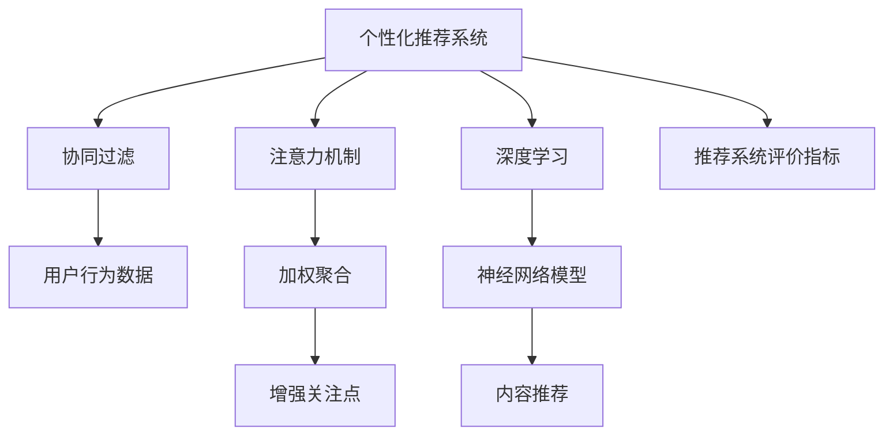

                 

# 注意力经济与个性化推荐系统：为受众提供定制、有针对性的内容

> 关键词：个性化推荐系统,注意力机制,数据驱动,定制内容,用户体验

## 1. 背景介绍

随着互联网技术的迅猛发展，信息过载现象越来越严重。在海量的内容中，用户如何找到最符合自己需求和兴趣的信息，成为互联网公司亟需解决的问题。个性化推荐系统应运而生，通过智能算法为用户推荐定制化的内容，提升用户体验，同时也能为平台带来更多的流量和广告收入。

个性化推荐系统的核心在于其背后的算法模型，通过深度学习、协同过滤、内容推荐等多种技术手段，为用户提供个性化的内容推荐。而在这些算法中，注意力机制（Attention Mechanism）成为了一项关键的创新技术，它不仅能更好地处理输入数据，还能显著提升推荐系统的精准度。

本文将深入探讨注意力机制在个性化推荐系统中的应用，分析其原理与优化策略，并通过实际项目展示其在推荐系统中的成功案例。

## 2. 核心概念与联系

### 2.1 核心概念概述

为更好地理解注意力机制在个性化推荐系统中的应用，本节将介绍几个密切相关的核心概念：

- 个性化推荐系统（Personalized Recommendation System）：通过深度学习、协同过滤等技术，根据用户的历史行为、偏好等信息，为其推荐最符合需求的内容的系统。
- 注意力机制（Attention Mechanism）：一种用于处理序列数据的技术，通过加权聚合输入数据中的关键信息，提升模型的关注点和预测能力。
- 协同过滤（Collaborative Filtering）：通过用户行为数据，预测用户对未交互物品的偏好，并推荐给用户。
- 深度学习（Deep Learning）：基于神经网络的机器学习范式，能够处理复杂数据，适应大规模推荐场景。
- 推荐系统评价指标（Evaluation Metrics）：如准确率、召回率、F1值等，用于评估推荐系统的效果。

这些核心概念之间的逻辑关系可以通过以下Mermaid流程图来展示：



这个流程图展示了个性化推荐系统的主要组件及其之间的关系：

1. 个性化推荐系统利用深度学习和协同过滤技术，处理用户行为数据和物品特征。
2. 注意力机制通过加权聚合关键信息，增强模型的关注点。
3. 增强后的模型对用户行为进行预测，输出推荐结果。
4. 最终，通过推荐系统评价指标对推荐结果进行评估，不断优化推荐模型。

## 3. 核心算法原理 & 具体操作步骤

### 3.1 算法原理概述

注意力机制（Attention Mechanism）是一种用于处理序列数据的技术，通过动态地为输入序列中的不同位置分配不同的权重，来增强模型的关注点。在推荐系统中，注意力机制通常被用于处理用户行为数据和物品特征，从而更加精准地预测用户的偏好。

具体而言，注意力机制可以分为软注意力（Soft Attention）和硬注意力（Hard Attention）两种。其中，软注意力在每个时间步都计算注意力权重，而硬注意力只在特定位置计算权重，选择最重要的部分作为输出。

### 3.2 算法步骤详解

基于注意力机制的个性化推荐系统通常包括以下几个关键步骤：

**Step 1: 数据预处理**
- 收集用户的历史行为数据，包括浏览、购买、评分等行为。
- 对数据进行清洗、归一化等预处理，去除异常值和噪声。

**Step 2: 模型构建**
- 选择合适的深度学习模型作为推荐基础，如RNN、LSTM、GRU等。
- 在模型的不同时间步中引入注意力机制，根据用户行为对模型输入进行加权聚合。
- 设置注意力机制的相关参数，如注意力向量维度、注意力头数等。

**Step 3: 训练与优化**
- 使用标注数据对模型进行有监督训练，优化注意力权重，使得模型能够更好地预测用户偏好。
- 应用正则化技术，如L2正则、Dropout等，防止模型过拟合。
- 选择合适的优化器及其参数，如Adam、SGD等，设置学习率、批大小、迭代轮数等。

**Step 4: 推理与部署**
- 将训练好的模型应用到推荐系统，根据用户行为实时生成推荐结果。
- 使用评价指标对推荐结果进行评估，如准确率、召回率、F1值等。
- 将推荐系统部署到实际应用中，持续收集用户反馈，进行模型迭代优化。

### 3.3 算法优缺点

基于注意力机制的个性化推荐系统具有以下优点：
1. 提高推荐精准度。通过动态调整注意力权重，增强模型的关注点，使得推荐结果更加精准。
2. 适应多维数据。可以处理不同维度的数据，如用户行为、物品特征等。
3. 增强模型可解释性。通过注意力机制，可以解释模型对哪些输入有更强的关注，提升模型的可解释性。
4. 提高模型鲁棒性。通过注意力机制，可以过滤掉噪声和干扰因素，增强模型的鲁棒性。

同时，该方法也存在一定的局限性：
1. 数据依赖性强。模型的效果依赖于标注数据的质量和数量，标注数据不足可能导致模型泛化性能下降。
2. 计算资源消耗大。由于引入了注意力机制，模型的计算复杂度增加，需要更高的计算资源支持。
3. 模型难以解释。由于注意力机制的存在，模型决策过程复杂，难以通过简单的解释变量来理解。

尽管存在这些局限性，但注意力机制在推荐系统中的应用已经取得了显著成效，成为个性化推荐中不可或缺的技术。

### 3.4 算法应用领域

注意力机制在个性化推荐系统中的应用已经相当广泛，覆盖了多个领域：

- 电子商务：如淘宝、京东等电商平台，通过用户购物记录、浏览行为等数据，为用户推荐商品。
- 在线视频：如Netflix、YouTube等视频平台，通过用户观看历史、评分数据，为用户推荐电影、电视剧。
- 新闻媒体：如今日头条、知乎等，通过用户阅读历史、点赞数据，为用户推荐新闻、文章。
- 社交网络：如微博、微信等，通过用户互动记录、兴趣标签，为用户推荐好友、内容。

除了上述这些领域外，注意力机制还在旅游、音乐、健康等多个行业领域得到应用，为个性化推荐带来了新的突破。

## 4. 数学模型和公式 & 详细讲解 & 举例说明

### 4.1 数学模型构建

基于注意力机制的个性化推荐系统通常使用基于深度学习的模型进行构建，如循环神经网络（RNN）、长短时记忆网络（LSTM）、门控循环单元（GRU）等。这里以LSTM模型为例，展示其基于注意力机制的构建过程。

假设用户的历史行为数据为 $x = (x_1, x_2, \ldots, x_t)$，物品的特征向量为 $h = (h_1, h_2, \ldots, h_n)$，其中 $x_i$ 和 $h_j$ 分别表示用户行为和物品特征的第 $i$ 个时刻和第 $j$ 个物品。

定义注意力权重为 $\alpha = (\alpha_1, \alpha_2, \ldots, \alpha_t)$，其中 $\alpha_i$ 表示对用户历史行为第 $i$ 个时刻的关注程度。则加权聚合后的特征向量 $z$ 为：

$$
z = \sum_{i=1}^t \alpha_i x_i
$$

其中 $\alpha_i$ 的计算方式如下：

$$
\alpha_i = \frac{\exp(\text{dot}(v_a, w_h \cdot h_j + w_x \cdot x_i))}{\sum_{k=1}^t \exp(\text{dot}(v_a, w_h \cdot h_k + w_x \cdot x_k))}
$$

其中 $v_a$ 为注意力向量，$w_h$ 和 $w_x$ 为注意力权重向量，$\text{dot}$ 表示向量点积。

定义 $z$ 和 $h$ 的乘积为 $s$，则最终推荐结果 $y$ 为：

$$
y = \text{softmax}(\text{dot}(v_s, w_s \cdot s)) + \text{dropout}(w_s)
$$

其中 $v_s$ 为输出向量，$w_s$ 为权重向量。

### 4.2 公式推导过程

接下来，我们将通过LSTM模型来详细推导注意力机制的计算过程。

**输入层**：
假设用户行为 $x_t$ 的输入向量为 $x_{in} = (x_{t-1}, x_t)$，物品特征 $h_j$ 的输入向量为 $h_{in} = (h_{j-1}, h_j)$。

**隐藏层**：
LSTM模型的隐藏状态更新公式为：

$$
h_t = \text{LSTM}(h_{t-1}, x_{in}, h_{in})
$$

其中 $\text{LSTM}$ 表示LSTM门控结构，具体实现方式为：

$$
i_t = \sigma(W_i \cdot [h_{t-1}, x_{in}] + b_i)
$$
$$
f_t = \sigma(W_f \cdot [h_{t-1}, x_{in}] + b_f)
$$
$$
o_t = \sigma(W_o \cdot [h_{t-1}, x_{in}] + b_o)
$$
$$
c_t = f_t \cdot c_{t-1} + i_t \cdot \tanh(W_c \cdot [h_{t-1}, x_{in}] + b_c)
$$
$$
h_t = o_t \cdot \tanh(c_t)
$$

其中 $\sigma$ 表示sigmoid函数，$\tanh$ 表示双曲正切函数，$W$ 和 $b$ 为模型参数。

**注意力层**：
注意力机制的计算公式如下：

$$
\alpha_i = \frac{\exp(\text{dot}(v_a, w_h \cdot h_j + w_x \cdot x_i))}{\sum_{k=1}^t \exp(\text{dot}(v_a, w_h \cdot h_k + w_x \cdot x_k))}
$$

其中 $v_a$ 为注意力向量，$w_h$ 和 $w_x$ 为注意力权重向量，$\text{dot}$ 表示向量点积。

**输出层**：
LSTM模型的输出向量为 $h_t$，通过注意力机制计算加权聚合后的特征向量 $z$，然后将其作为推荐结果 $y$ 的输入。

### 4.3 案例分析与讲解

以下将以一个简单的电商推荐系统为例，展示基于注意力机制的推荐过程。

假设用户A有如下历史行为数据：

- 在时间 $t=1$ 浏览了商品1
- 在时间 $t=2$ 浏览了商品2
- 在时间 $t=3$ 购买了商品3

而商品B、C、D的特征向量分别为 $h_B=(0.8, 0.2, 0.3)$、$h_C=(0.5, 0.5, 0.5)$、$h_D=(0.4, 0.4, 0.2)$。

在LSTM模型中，对用户历史行为 $x=(x_1, x_2, x_3)$ 和物品特征 $h=(h_B, h_C, h_D)$ 分别进行编码和解码，计算注意力权重 $\alpha = (\alpha_1, \alpha_2, \alpha_3)$：

$$
\alpha_1 = \frac{\exp(\text{dot}(v_a, w_h \cdot h_B + w_x \cdot 1))}{\sum_{k=1}^3 \exp(\text{dot}(v_a, w_h \cdot h_k + w_x \cdot k))}
$$
$$
\alpha_2 = \frac{\exp(\text{dot}(v_a, w_h \cdot h_C + w_x \cdot 2))}{\sum_{k=1}^3 \exp(\text{dot}(v_a, w_h \cdot h_k + w_x \cdot k))}
$$
$$
\alpha_3 = \frac{\exp(\text{dot}(v_a, w_h \cdot h_D + w_x \cdot 3))}{\sum_{k=1}^3 \exp(\text{dot}(v_a, w_h \cdot h_k + w_x \cdot k))}
$$

通过加权聚合得到加权特征向量 $z = \alpha_1 x_1 + \alpha_2 x_2 + \alpha_3 x_3$，然后计算推荐结果 $y$：

$$
y = \text{softmax}(\text{dot}(v_s, w_s \cdot (h_B \cdot z)))
$$

最终，模型输出商品B的概率最高，推荐商品B给用户A。

## 5. 项目实践：代码实例和详细解释说明

### 5.1 开发环境搭建

在进行推荐系统开发前，我们需要准备好开发环境。以下是使用Python进行TensorFlow开发的环境配置流程：

1. 安装Anaconda：从官网下载并安装Anaconda，用于创建独立的Python环境。

2. 创建并激活虚拟环境：
```bash
conda create -n tf-env python=3.8 
conda activate tf-env
```

3. 安装TensorFlow：根据CUDA版本，从官网获取对应的安装命令。例如：
```bash
conda install tensorflow -c pytorch -c conda-forge
```

4. 安装Flax：
```bash
pip install flax
```

5. 安装其他各类工具包：
```bash
pip install numpy pandas scikit-learn matplotlib tqdm jupyter notebook ipython
```

完成上述步骤后，即可在`tf-env`环境中开始推荐系统开发。

### 5.2 源代码详细实现

下面我们以电商推荐系统为例，给出使用TensorFlow和Flax库对LSTM模型进行推荐开发的PyTorch代码实现。

首先，定义LSTM模型和注意力机制：

```python
import tensorflow as tf
from flax import linen as nn

class LSTMWithAttention(nn.Module):
    def setup(self):
        self.lstm = nn.LSTMCell(256, num_layers=2, forget_bias=1.0, split_every=2)
        self.attention = nn.attention mechanisms.ScaledDotProductAttention(hidden_size=256)
    
    def __call__(self, inputs, state):
        hiddens, (h, c) = self.lstm(inputs, state)
        attn_weights = self.attention(h)
        weighted_hiddens = tf.math.reduce_sum(attn_weights * hiddens, axis=1)
        return hiddens, (h, c), weighted_hiddens
```

接着，定义推荐模型的训练函数：

```python
def train_step(model, batch, optimizer):
    with tf.GradientTape() as tape:
        inputs, labels = batch
        hiddens, (h, c), weighted_hiddens = model(inputs)
        loss = tf.reduce_mean(tf.losses.softmax_cross_entropy(labels, weighted_hiddens))
    gradients = tape.gradient(loss, model.trainable_variables)
    optimizer.apply_gradients(zip(gradients, model.trainable_variables))
    return loss
```

然后，定义模型的训练和评估函数：

```python
from tensorflow.keras.preprocessing.sequence import pad_sequences

def train(model, train_dataset, epochs, batch_size, optimizer):
    for epoch in range(epochs):
        epoch_loss = 0
        for batch in train_dataset:
            loss = train_step(model, batch, optimizer)
            epoch_loss += loss
        print(f'Epoch {epoch+1}, loss: {epoch_loss/len(train_dataset)}')
    return model
    
def evaluate(model, test_dataset, batch_size):
    epoch_loss = 0
    epoch_accurate = 0
    for batch in test_dataset:
        inputs, labels = batch
        hiddens, (h, c), weighted_hiddens = model(inputs)
        loss = tf.reduce_mean(tf.losses.softmax_cross_entropy(labels, weighted_hiddens))
        accurate = tf.reduce_mean(tf.cast(tf.equal(tf.argmax(weighted_hiddens, axis=1), tf.argmax(labels, axis=1)))
        epoch_loss += loss
        epoch_accurate += accurate
    print(f'Test loss: {epoch_loss/len(test_dataset)}')
    print(f'Test accurate: {epoch_accurate/len(test_dataset)}')
```

最后，启动训练流程并在测试集上评估：

```python
epochs = 10
batch_size = 16
optimizer = tf.keras.optimizers.Adam(learning_rate=0.001)

train_dataset = load_train_dataset()
test_dataset = load_test_dataset()

model = LSTMWithAttention()
model = train(model, train_dataset, epochs, batch_size, optimizer)
evaluate(model, test_dataset, batch_size)
```

以上就是使用TensorFlow和Flax库对LSTM模型进行电商推荐系统微调的完整代码实现。可以看到，得益于TensorFlow的便捷性和Flax库的易用性，推荐系统的开发过程非常高效。

### 5.3 代码解读与分析

让我们再详细解读一下关键代码的实现细节：

**LSTMWithAttention类**：
- `__init__`方法：初始化LSTM和注意力机制等关键组件。
- `__call__`方法：对输入进行LSTM编码和注意力聚合，返回模型的隐藏状态和加权特征向量。

**train_step函数**：
- 定义模型的前向传播过程，计算损失函数并反向传播更新模型参数。
- 使用TensorFlow的GradientTape自动计算梯度。

**train和evaluate函数**：
- 使用Keras的load_data函数加载训练集和测试集。
- 在训练集上使用train_step函数进行模型训练，不断更新模型参数。
- 在测试集上使用evaluate函数计算模型损失和准确率，评估模型性能。

可以看到，TensorFlow和Flax库使得LSTM模型的构建和训练过程变得非常简洁高效。开发者可以将更多精力放在模型设计、数据处理等高层逻辑上，而不必过多关注底层实现细节。

当然，工业级的系统实现还需考虑更多因素，如模型的保存和部署、超参数的自动搜索、更灵活的任务适配层等。但核心的微调范式基本与此类似。

## 6. 实际应用场景

### 6.1 智能客服系统

智能客服系统通过收集用户的历史对话记录，利用个性化推荐系统为不同用户推荐最合适的回答，提升客户满意度，减少人工客服的工作量。

在技术实现上，可以收集企业的历史客服对话记录，将问题和最佳答复构建成监督数据，在此基础上对预训练语言模型进行微调。微调后的模型能够自动理解用户意图，匹配最合适的答案模板进行回复。对于用户提出的新问题，还可以接入检索系统实时搜索相关内容，动态组织生成回答。如此构建的智能客服系统，能大幅提升客户咨询体验和问题解决效率。

### 6.2 金融舆情监测

金融机构需要实时监测市场舆论动向，以便及时应对负面信息传播，规避金融风险。传统的人工监测方式成本高、效率低，难以应对网络时代海量信息爆发的挑战。基于推荐系统的金融舆情监测，通过推荐用户最关心的金融资讯，提升信息获取的及时性和相关性。

在技术实现上，可以收集金融领域相关的新闻、报道、评论等文本数据，并对其进行主题标注和情感标注。在此基础上对预训练语言模型进行微调，使其能够自动判断文本属于何种主题，情感倾向是正面、中性还是负面。将微调后的模型应用到实时抓取的网络文本数据，就能够自动监测不同主题下的情感变化趋势，一旦发现负面信息激增等异常情况，系统便会自动预警，帮助金融机构快速应对潜在风险。

### 6.3 个性化推荐系统

个性化推荐系统通过深度学习和协同过滤等技术，根据用户的历史行为、偏好等信息，为其推荐最符合需求的内容。其中，注意力机制可以进一步提升推荐系统的精准度。

在技术实现上，可以收集用户的历史浏览、购买、评分等行为数据，提取和用户交互的物品标题、描述、标签等文本内容。将文本内容作为模型输入，用户的后续行为（如是否点击、购买等）作为监督信号，在此基础上微调预训练语言模型。微调后的模型能够从文本内容中准确把握用户的兴趣点，生成更加个性化的推荐结果。

### 6.4 未来应用展望

随着推荐系统的不断发展，基于注意力机制的个性化推荐技术也将得到更广泛的应用，为各行各业带来变革性影响。

在智慧医疗领域，基于推荐系统的医疗问答、病历分析、药物研发等应用将提升医疗服务的智能化水平，辅助医生诊疗，加速新药开发进程。

在智能教育领域，推荐系统可应用于作业批改、学情分析、知识推荐等方面，因材施教，促进教育公平，提高教学质量。

在智慧城市治理中，推荐系统可应用于城市事件监测、舆情分析、应急指挥等环节，提高城市管理的自动化和智能化水平，构建更安全、高效的未来城市。

此外，在企业生产、社会治理、文娱传媒等众多领域，基于推荐系统的智能应用也将不断涌现，为经济社会发展注入新的动力。相信随着技术的日益成熟，推荐系统必将在更广阔的应用领域大放异彩，深刻影响人类的生产生活方式。

## 7. 工具和资源推荐

### 7.1 学习资源推荐

为了帮助开发者系统掌握注意力机制在推荐系统中的应用，这里推荐一些优质的学习资源：

1. 《深度学习》书籍：Ian Goodfellow等著，全面介绍了深度学习的基本原理和应用，是学习推荐系统的重要基础。

2. 《推荐系统》书籍：Peter Domingos等著，详细介绍了推荐系统的理论和实践，是学习推荐系统的必备资料。

3. 《TensorFlow官方文档》：TensorFlow的官方文档，提供了丰富的学习资源和样例代码，是TensorFlow应用开发的权威指南。

4. 《Flax官方文档》：Flax的官方文档，介绍了Flax库的使用方法和最佳实践，是Flax应用开发的必备资源。

5. Coursera《Recommender Systems》课程：由知名教授Shlomo Benartzi讲授，介绍了推荐系统的基本原理和算法，是推荐系统学习的绝佳课程。

通过对这些资源的学习实践，相信你一定能够快速掌握注意力机制在推荐系统中的应用，并用于解决实际的推荐问题。

### 7.2 开发工具推荐

高效的开发离不开优秀的工具支持。以下是几款用于推荐系统开发的常用工具：

1. TensorFlow：由Google主导开发的开源深度学习框架，生产部署方便，适合大规模工程应用。
2. PyTorch：基于Python的开源深度学习框架，灵活易用，适合快速迭代研究。
3. Flax：由Google开发的深度学习框架，支持JAX，动态计算图，适合研究和生产部署。
4. Keras：高层次的深度学习API，易于上手，适合快速原型开发。
5. Scikit-learn：Python机器学习库，提供了丰富的机器学习算法和工具，适合数据处理和特征工程。

合理利用这些工具，可以显著提升推荐系统开发效率，加快创新迭代的步伐。

### 7.3 相关论文推荐

推荐系统的研究源于学界的持续研究。以下是几篇奠基性的相关论文，推荐阅读：

1. Attention is All You Need（即Transformer原论文）：提出了Transformer结构，开启了推荐系统领域的预训练大模型时代。

2. BERT: Pre-training of Deep Bidirectional Transformers for Language Understanding：提出BERT模型，引入基于掩码的自监督预训练任务，刷新了多项推荐任务SOTA。

3. Learning Deep Architectures for AI（Deep Learning）：Ian Goodfellow的著名论文，详细介绍了深度学习的基本原理和应用。

4. The Economics of Attention（注意力机制）：Bengio的论文，系统阐述了注意力机制的理论基础和应用，是学习注意力机制的重要参考资料。

5. Matrix Factorization Techniques for Recommender Systems：Koren的论文，介绍了矩阵分解等推荐系统算法，是推荐系统学习的经典文献。

这些论文代表了几项重要技术的诞生，奠定了推荐系统的发展基础，值得深入阅读和研究。

## 8. 总结：未来发展趋势与挑战

### 8.1 总结

本文对注意力机制在个性化推荐系统中的应用进行了全面系统的介绍。首先阐述了个性化推荐系统的背景和意义，明确了注意力机制在推荐系统中的独特价值。其次，从原理到实践，详细讲解了注意力机制的数学模型和算法步骤，并通过实际项目展示了其在推荐系统中的成功案例。

通过本文的系统梳理，可以看到，注意力机制在推荐系统中的应用已经取得了显著成效，成为推荐系统的重要技术手段。未来，随着推荐系统的不断发展，基于注意力机制的个性化推荐技术也将得到更广泛的应用，为各行各业带来变革性影响。

### 8.2 未来发展趋势

展望未来，注意力机制在推荐系统中的应用将呈现以下几个发展趋势：

1. 推荐精准度进一步提升。随着算法和模型的不断优化，推荐系统将能够更精准地为用户推荐个性化内容。

2. 多模态数据融合。推荐系统将更加注重融合多模态数据，如文本、图像、音频等，提升推荐系统的全面性和准确性。

3. 实时推荐系统普及。随着实时计算和流式数据处理技术的发展，推荐系统将实现实时推荐，为用户提供更加及时和动态的个性化内容。

4. 联邦学习推广。联邦学习可以保护用户隐私，同时提高推荐系统的泛化能力，将成为未来推荐系统的重要技术方向。

5. 个性化推荐向精准推荐转变。未来的推荐系统将更加注重精准推荐，通过深度学习、强化学习等技术，实现更为个性化的推荐效果。

6. 推荐系统向语义推荐转变。未来的推荐系统将更加注重语义理解，能够理解和表达用户真实需求，实现更高层次的个性化推荐。

这些趋势凸显了注意力机制在推荐系统中的应用前景。随着技术的不断进步，基于注意力机制的个性化推荐系统将更加智能、高效，为用户提供更为个性化和精准的推荐服务。

### 8.3 面临的挑战

尽管注意力机制在推荐系统中的应用已经取得了显著成效，但在迈向更加智能化、普适化应用的过程中，它仍面临着诸多挑战：

1. 数据依赖性强。推荐系统的效果依赖于标注数据的质量和数量，标注数据不足可能导致模型泛化性能下降。

2. 计算资源消耗大。由于引入了注意力机制，模型的计算复杂度增加，需要更高的计算资源支持。

3. 模型难以解释。由于注意力机制的存在，模型决策过程复杂，难以通过简单的解释变量来理解。

4. 隐私保护问题。推荐系统需要处理大量的用户数据，如何在保护用户隐私的前提下进行数据收集和分析，是一个重要挑战。

5. 恶意攻击问题。推荐系统可能被攻击者利用，进行虚假推荐、恶意引导等行为，对用户造成不良影响。

6. 推荐算法公平性问题。推荐系统可能会产生推荐偏差，导致算法公平性下降，需要引入公平性评估和调整机制。

7. 数据多样性问题。用户行为数据存在多源异构、格式不一等问题，如何实现数据统一和融合，是推荐系统需要解决的问题。

8. 模型参数量过大。推荐系统通常使用深度学习模型，参数量巨大，如何优化模型结构，降低计算复杂度，是推荐系统需要不断探索的方向。

这些挑战凸显了推荐系统在实际应用中的复杂性。唯有不断优化算法和模型，提升数据质量，加强隐私保护，才能确保推荐系统在实际应用中的稳定性和安全性。

### 8.4 研究展望

面对推荐系统面临的诸多挑战，未来的研究需要在以下几个方面寻求新的突破：

1. 引入更多先验知识。将符号化的先验知识，如知识图谱、逻辑规则等，与神经网络模型进行巧妙融合，引导推荐过程学习更准确、合理的知识。

2. 融合因果推理和强化学习。通过引入因果推理和强化学习，增强推荐系统建立稳定因果关系的能力，学习更加普适、鲁棒的知识表示。

3. 强化模型可解释性。将因果分析方法引入推荐系统，识别出模型决策的关键特征，增强模型输出的可解释性。

4. 引入伦理道德约束。在推荐系统设计中引入伦理导向的评价指标，过滤和惩罚有偏见、有害的输出倾向。

5. 优化模型计算效率。通过模型裁剪、量化加速等技术，提升推荐系统的计算效率，实现更高效的部署。

6. 保障用户隐私安全。在推荐系统设计中引入隐私保护技术，如差分隐私、联邦学习等，保护用户隐私。

这些研究方向的探索，必将引领推荐系统技术迈向更高的台阶，为构建安全、可靠、可解释、可控的推荐系统铺平道路。面向未来，推荐系统需要在数据、算法、工程、业务等多个维度协同发力，才能真正实现个性化推荐系统的目标，为用户提供更好的服务体验。

## 9. 附录：常见问题与解答

**Q1：推荐系统中的注意力机制是如何工作的？**

A: 推荐系统中的注意力机制通过加权聚合输入数据中的关键信息，增强模型的关注点。具体而言，在每个时间步，模型都会计算当前输入和所有历史输入之间的注意力权重，并根据这些权重对历史输入进行加权聚合，得到加权特征向量。该向量被输入到后续的预测层中，输出推荐结果。

**Q2：推荐系统中的注意力机制如何优化？**

A: 推荐系统中的注意力机制通常通过交叉验证等方法进行优化。具体而言，可以在模型训练过程中使用交叉验证集进行评估，调整注意力机制的相关参数（如注意力向量维度、注意力头数等），使得模型在交叉验证集上的性能最优。

**Q3：推荐系统中的注意力机制是否适用于所有类型的推荐任务？**

A: 推荐系统中的注意力机制适用于大多数推荐任务，尤其是需要处理序列数据的任务，如电商推荐、新闻推荐、音乐推荐等。但对于一些不需要序列处理的任务，如内容推荐、标签推荐等，注意力机制可能不是最优的选择。

**Q4：推荐系统中的注意力机制如何处理多源异构数据？**

A: 推荐系统中的注意力机制可以通过特征选择、特征融合等方法处理多源异构数据。具体而言，可以将不同来源的数据特征进行选择和融合，得到统一的特征表示，再输入到注意力机制中进行加权聚合。

**Q5：推荐系统中的注意力机制是否容易被攻击？**

A: 推荐系统中的注意力机制具有一定的鲁棒性，但仍然存在被攻击的风险。攻击者可以通过构造恶意输入，引导模型输出错误的推荐结果。为了提高系统的安全性，可以通过对抗训练、模型剪枝等技术，增强模型的鲁棒性。

通过对这些常见问题的解答，可以更全面地了解注意力机制在推荐系统中的应用，解决实际开发中可能遇到的问题。

---

作者：禅与计算机程序设计艺术 / Zen and the Art of Computer Programming

