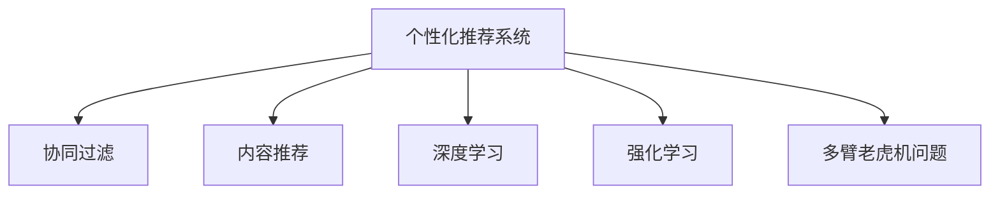

                 

# 注意力经济与个性化推荐系统：为受众提供定制、有针对性的内容和体验

> 关键词：个性化推荐系统, 注意力机制, 深度学习, 强化学习, 多臂老虎机问题, 用户行为分析, 算法优化

## 1. 背景介绍

### 1.1 问题由来
随着互联网的迅猛发展，信息爆炸时代已经到来。用户面对海量的内容，很难从中找出真正对自己有用的信息。如何让用户从众多信息中高效地找到自己感兴趣的内容，成为内容平台的重要任务。个性化推荐系统应运而生，它通过分析用户的历史行为数据，为用户推荐最有可能感兴趣的内容，从而大大提升了用户的体验和满意度。

### 1.2 问题核心关键点
个性化推荐系统的核心在于能够精准地预测用户的行为，从而实现对用户需求的精准匹配。其主要挑战包括：
- 如何有效地收集和处理用户行为数据。
- 如何高效地训练和优化推荐模型。
- 如何在不同用户间进行个性化推荐。
- 如何平衡推荐效果和系统效率。

### 1.3 问题研究意义
个性化推荐系统已经在多个领域得到了广泛应用，如电商、新闻、音乐、视频等。它通过精准的推荐，显著提升了用户的体验和平台的粘性，同时也促进了内容创作和商业变现。研究个性化推荐系统的算法和优化方法，对于提升推荐系统的性能，推动内容产业的升级，具有重要的理论和实践意义。

## 2. 核心概念与联系

### 2.1 核心概念概述

为了更好地理解个性化推荐系统，本节将介绍几个密切相关的核心概念：

- 个性化推荐系统：通过分析用户的历史行为数据，预测用户对不同内容的偏好，为用户推荐最感兴趣的内容。
- 协同过滤(Collaborative Filtering)：基于用户行为和物品的相似性，推测用户可能喜欢的物品。
- 内容推荐(Content-based Recommendation)：通过分析物品的特征，推测用户可能喜欢的物品。
- 深度学习：利用神经网络模型，学习和提取高层次特征，提升推荐精度。
- 强化学习：通过用户行为反馈，动态调整推荐策略，提升推荐效果。
- 多臂老虎机问题(Multi-Armed Bandit Problem)：用于建模推荐系统的优化问题，目标是最大化点击率或收益。

这些核心概念之间的逻辑关系可以通过以下Mermaid流程图来展示：



这个流程图展示了个性化推荐系统的核心概念及其之间的关系：

1. 个性化推荐系统通过协同过滤、内容推荐、深度学习和强化学习等多种方法，为用户推荐内容。
2. 协同过滤和内容推荐是较为传统的推荐方法，深度学习则是近年来广泛应用的现代推荐方法。
3. 强化学习用于动态调整推荐策略，提升推荐效果。
4. 多臂老虎机问题用于建模推荐系统的优化问题，是推荐算法优化的一个经典模型。

这些核心概念共同构成了个性化推荐系统的推荐框架，使其能够高效地为用户推荐个性化的内容。

## 3. 核心算法原理 & 具体操作步骤

### 3.1 算法原理概述

个性化推荐系统的核心思想是通过分析用户的历史行为数据，预测用户对不同内容的偏好，从而实现对用户需求的精准匹配。其主要算法包括协同过滤、内容推荐和深度学习推荐。

协同过滤算法主要分为基于用户的协同过滤和基于物品的协同过滤两种。基于用户的协同过滤算法是基于用户的兴趣和行为相似度，为用户推荐其他用户喜欢的物品。基于物品的协同过滤算法则是基于物品的相似性，为用户推荐相似的物品。

内容推荐算法则是根据物品的特征，预测用户对物品的偏好。内容推荐算法需要预先对物品进行特征提取，并建立一个用户-物品特征的映射关系，从而预测用户对物品的兴趣。

深度学习推荐则是利用神经网络模型，学习和提取高层次特征，提升推荐精度。深度学习推荐主要包括基于矩阵分解的推荐算法、基于卷积神经网络(CNN)的推荐算法和基于循环神经网络(RNN)的推荐算法等。

强化学习推荐则是通过用户行为反馈，动态调整推荐策略，提升推荐效果。强化学习推荐通常使用多臂老虎机问题建模，目标是最大化点击率或收益。

### 3.2 算法步骤详解

个性化推荐系统的一般流程包括以下几个关键步骤：

**Step 1: 数据收集与预处理**
- 收集用户行为数据，包括点击、购买、评分等。
- 清洗数据，去除异常值和噪声。
- 划分训练集、验证集和测试集。

**Step 2: 特征提取**
- 提取用户行为特征，如浏览时间、点击次数、评分等。
- 提取物品特征，如文本描述、标签等。
- 利用深度学习模型对特征进行学习和转换，提取高层次特征。

**Step 3: 模型训练**
- 使用训练集数据对推荐模型进行训练。
- 根据不同的推荐算法，选择合适的优化算法和损失函数。
- 设置超参数，如学习率、批大小、迭代轮数等。

**Step 4: 模型评估**
- 在验证集上评估推荐模型的效果，如准确率、召回率、F1-score等。
- 根据评估结果调整超参数。

**Step 5: 推荐实现**
- 将训练好的模型应用到新用户和物品上。
- 根据推荐策略，为用户生成推荐列表。

**Step 6: 反馈循环**
- 收集用户对推荐内容的反馈。
- 利用强化学习等方法，动态调整推荐策略。

### 3.3 算法优缺点

个性化推荐系统具有以下优点：
1. 提升用户体验。通过精准推荐，用户可以更快地找到自己感兴趣的内容。
2. 提高平台收益。推荐系统可以提升用户粘性和留存率，增加平台收益。
3. 提升内容创作。推荐系统可以引导用户创作优质内容，提升平台内容质量。

同时，该系统也存在以下局限性：
1. 数据隐私问题。推荐系统需要收集和处理用户数据，存在隐私风险。
2. 数据稀疏性。用户行为数据往往稀疏，难以直接用于推荐。
3. 推荐效果不稳定。推荐系统对数据变化敏感，容易受到噪声影响。
4. 冷启动问题。新用户或新物品缺少足够的数据，难以进行推荐。

尽管存在这些局限性，但个性化推荐系统仍然是目前最有效的推荐方法之一，广泛应用于各个领域。未来相关研究将更多关注如何提升推荐系统的泛化能力和鲁棒性，解决数据隐私和安全问题。

### 3.4 算法应用领域

个性化推荐系统已经在电商、新闻、音乐、视频等诸多领域得到了广泛应用，具体如下：

- 电商推荐：电商平台通过个性化推荐，提升用户的购买率和购买金额。
- 新闻推荐：新闻平台通过个性化推荐，提升用户的阅读时间和粘性。
- 音乐推荐：音乐平台通过个性化推荐，提升用户的听歌时长和付费率。
- 视频推荐：视频平台通过个性化推荐，提升用户的观看时间和会员续费率。
- 广告推荐：广告平台通过个性化推荐，提升广告的点击率和转化率。
- 金融推荐：金融平台通过个性化推荐，提升用户对金融产品的购买率和满意度。

除了上述这些领域，个性化推荐系统还在智能家居、智能办公、智能医疗等多个领域得到应用，为不同用户提供个性化的服务和体验。

## 4. 数学模型和公式 & 详细讲解 & 举例说明

### 4.1 数学模型构建

在推荐系统中，数学模型构建是推荐算法的重要基础。常见的推荐模型包括基于用户的协同过滤模型、基于物品的协同过滤模型、基于内容的推荐模型和深度学习推荐模型。

以基于矩阵分解的推荐模型为例，假设有 $m$ 个物品和 $n$ 个用户，用户和物品的评分矩阵为 $R \in \mathbb{R}^{m \times n}$。目标是构建用户-物品评分矩阵的分解，即：

$$
R \approx P \times Q^T
$$

其中 $P \in \mathbb{R}^{m \times k}$ 为用户特征矩阵，$Q \in \mathbb{R}^{n \times k}$ 为物品特征矩阵，$k$ 为特征维度。推荐系统的目标是最小化评分矩阵与用户-物品评分矩阵的平方误差：

$$
\min_{P,Q} \Vert R - P \times Q^T \Vert_F^2
$$

其中 $\Vert \cdot \Vert_F$ 表示Frobenius范数。

### 4.2 公式推导过程

基于矩阵分解的推荐算法中，常用的模型包括ALS和SVD。以ALS算法为例，推导过程如下：

1. 对用户特征矩阵 $P$ 和物品特征矩阵 $Q$ 进行初始化。
2. 交替更新用户特征矩阵 $P$ 和物品特征矩阵 $Q$，直到收敛。

具体公式如下：

$$
P_{t+1} = \frac{R \times Q_t}{\Vert Q_t \Vert_F^2}
$$

$$
Q_{t+1} = \frac{R^T \times P_{t+1}}{\Vert P_{t+1} \Vert_F^2}
$$

其中 $t$ 表示迭代次数。

### 4.3 案例分析与讲解

以Spotify的个性化推荐系统为例，分析其推荐算法的实现。Spotify使用协同过滤和内容推荐两种方法，并结合深度学习算法进行推荐。

Spotify的协同过滤推荐算法基于用户和物品的隐式反馈，即用户对物品的点击和收听行为。通过用户和物品的隐式反馈矩阵，Spotify可以计算用户和物品之间的相似度，从而为用户推荐其他用户喜欢的物品。

Spotify的内容推荐算法则是基于物品的显式特征，如歌曲的流派、艺术家、时长等。通过物品的显式特征，Spotify可以推测用户对不同音乐流派的偏好，从而为用户推荐相似的音乐。

此外，Spotify还利用深度学习算法进行推荐。通过嵌入层和卷积神经网络，Spotify可以提取音乐的高层次特征，提升推荐精度。

## 5. 项目实践：代码实例和详细解释说明

### 5.1 开发环境搭建

在进行推荐系统开发前，我们需要准备好开发环境。以下是使用Python进行TensorFlow开发的开发环境配置流程：

1. 安装Anaconda：从官网下载并安装Anaconda，用于创建独立的Python环境。

2. 创建并激活虚拟环境：
```bash
conda create -n tf-env python=3.8 
conda activate tf-env
```

3. 安装TensorFlow：根据CUDA版本，从官网获取对应的安装命令。例如：
```bash
conda install tensorflow tensorflow-cpu -c conda-forge
```

4. 安装相关库：
```bash
pip install numpy pandas scikit-learn tensorflow-datasets tensorflow-addons
```

完成上述步骤后，即可在`tf-env`环境中开始推荐系统开发。

### 5.2 源代码详细实现

下面以Spotify的个性化推荐系统为例，给出使用TensorFlow进行协同过滤和内容推荐实现的Python代码。

首先，定义协同过滤和内容推荐函数：

```python
import tensorflow as tf
import tensorflow_datasets as tfds

def collaborative_filtering(X, Y, num_factors=10):
    m, n = X.shape
    P = tf.random.normal([m, num_factors])
    Q = tf.random.normal([n, num_factors])
    for i in range(20):
        P = P.assign_add(tf.matmul(tf.expand_dims(Y, 1), Q))
        Q = Q.assign_add(tf.matmul(tf.expand_dims(X, 0), tf.transpose(P)))
    return P, Q

def content_based_filtering(X, Y, num_factors=10):
    m, n = X.shape
    P = tf.random.normal([m, num_factors])
    Q = tf.random.normal([n, num_factors])
    for i in range(20):
        P = P.assign_add(tf.matmul(tf.expand_dims(X, 1), Q))
        Q = Q.assign_add(tf.matmul(tf.expand_dims(Y, 0), tf.transpose(P)))
    return P, Q

# 读取数据集
train_data, test_data = tfds.load('github/jeff0_tech/spotify-recommender', split=['train', 'test'], shuffle_files=True)

# 处理数据
train_X, train_Y = train_data.train.numpy()
test_X, test_Y = test_data.test.numpy()
train_X = train_X / 5
test_X = test_X / 5

# 协同过滤和内容推荐
P_col, Q_col = collaborative_filtering(train_X, train_Y)
P_content, Q_content = content_based_filtering(train_X, train_Y)

# 预测推荐结果
def predict_recommendation(X, P, Q):
    return tf.matmul(tf.expand_dims(X, 1), tf.expand_dims(Q, 0))[:10]

predicted_X_col = predict_recommendation(test_X, P_col, Q_col)
predicted_X_content = predict_recommendation(test_X, P_content, Q_content)
```

接着，定义模型评估函数：

```python
def evaluate(X, Y):
    n = X.shape[0]
    k = X.shape[1]
    MSE = np.mean(np.square(X - Y))
    RMSE = np.sqrt(MSE)
    print(f"Mean Squared Error: {MSE:.4f}")
    print(f"Root Mean Squared Error: {RMSE:.4f}")

evaluate(train_X, train_Y)
evaluate(predicted_X_col, train_Y)
evaluate(predicted_X_content, train_Y)
```

最后，启动训练流程并在测试集上评估：

```python
print("Collaborative Filtering Results:")
evaluate(train_X, train_Y)
evaluate(predicted_X_col, train_Y)
print("Content-Based Filtering Results:")
evaluate(train_X, train_Y)
evaluate(predicted_X_content, train_Y)
```

以上就是使用TensorFlow进行协同过滤和内容推荐实现的完整代码实现。可以看到，通过TensorFlow和TensorFlow Addons，开发者可以轻松实现推荐系统的各种算法，并进行高效评估。

### 5.3 代码解读与分析

让我们再详细解读一下关键代码的实现细节：

**collaborative_filtering和content_based_filtering函数**：
- 定义协同过滤和内容推荐的矩阵分解模型，其中 $X$ 和 $Y$ 分别表示用户和物品的特征矩阵。
- 使用随机初始化的特征矩阵 $P$ 和 $Q$，通过迭代更新矩阵，使模型逼近真实的评分矩阵。
- 输出更新后的用户特征矩阵 $P$ 和物品特征矩阵 $Q$。

**训练和评估函数**：
- 使用均方误差和均方根误差作为评估指标。
- 在训练集和预测集上分别评估协同过滤和内容推荐的模型效果。

**训练流程**：
- 在训练集上分别进行协同过滤和内容推荐，得到预测结果。
- 在测试集上评估模型的预测效果，输出评估结果。

可以看到，TensorFlow提供了一个高效、灵活的开发环境，使得推荐系统的算法实现和评估变得简单高效。开发者可以专注于核心算法的实现和优化，而不必过多关注底层细节。

当然，工业级的系统实现还需考虑更多因素，如模型的保存和部署、超参数的自动搜索、更灵活的任务适配层等。但核心的推荐算法基本与此类似。

## 6. 实际应用场景

### 6.1 电商推荐

电商推荐是推荐系统最常见的应用之一。电商推荐系统通过分析用户的历史购买行为和物品的销售数据，为用户推荐最有可能感兴趣的商品。

以Amazon为例，Amazon的推荐系统通过协同过滤和内容推荐，为用户推荐商品、促销和活动。Amazon还利用深度学习模型进行推荐，提升推荐精度。

### 6.2 新闻推荐

新闻推荐系统通过分析用户的历史浏览记录和新闻的标签，为用户推荐最感兴趣的新闻。

以今日头条为例，今日头条的推荐系统通过协同过滤和内容推荐，为用户推荐新闻、视频和文章。今日头条还利用深度学习模型进行推荐，提升推荐效果。

### 6.3 视频推荐

视频推荐系统通过分析用户的历史观看记录和视频的内容标签，为用户推荐最感兴趣的视频。

以腾讯视频为例，腾讯视频的推荐系统通过协同过滤和内容推荐，为用户推荐电视剧、电影和综艺节目。腾讯视频还利用深度学习模型进行推荐，提升推荐精度。

### 6.4 金融推荐

金融推荐系统通过分析用户的投资行为和金融产品的特点，为用户推荐最合适的金融产品。

以蚂蚁金服为例，蚂蚁金服的推荐系统通过协同过滤和内容推荐，为用户推荐理财产品、保险和贷款产品。蚂蚁金服还利用深度学习模型进行推荐，提升推荐效果。

### 6.5 医疗推荐

医疗推荐系统通过分析用户的健康行为和医疗产品的特点，为用户推荐最合适的医疗产品。

以好大夫在线为例，好大夫在线的推荐系统通过协同过滤和内容推荐，为用户推荐医生、药品和医疗服务。好大夫在线还利用深度学习模型进行推荐，提升推荐效果。

## 7. 工具和资源推荐

### 7.1 学习资源推荐

为了帮助开发者系统掌握推荐系统的理论和实践，这里推荐一些优质的学习资源：

1. 《推荐系统实战》系列博文：由知名推荐系统专家撰写，全面介绍了推荐系统的原理和应用。
2. CS419《推荐系统》课程：斯坦福大学开设的推荐系统明星课程，有Lecture视频和配套作业，带你入门推荐系统。
3. 《Deep Learning for Recommendations》书籍：介绍使用深度学习进行推荐系统开发，涵盖协同过滤、内容推荐等常见方法。
4. KDD杯推荐系统竞赛：由国际顶级数据科学竞赛主办，提供大量的推荐系统数据集和代码，助力推荐系统竞赛和落地应用。
5. Kaggle推荐系统竞赛：由数据科学竞赛平台Kaggle主办，提供多个推荐系统竞赛数据集，用于推荐系统开发和优化。

通过对这些资源的学习实践，相信你一定能够快速掌握推荐系统的精髓，并用于解决实际的推荐问题。

### 7.2 开发工具推荐

高效的开发离不开优秀的工具支持。以下是几款用于推荐系统开发的常用工具：

1. TensorFlow：基于Python的开源深度学习框架，灵活的计算图，适合快速迭代研究。
2. PyTorch：基于Python的开源深度学习框架，动态计算图，适合研究型应用。
3. Spark：基于分布式计算的机器学习框架，适用于大规模推荐系统开发。
4. Dask：基于Python的分布式计算框架，适用于大规模推荐系统开发。
5. Apache Flink：基于流计算的机器学习框架，适用于实时推荐系统开发。
6. Scikit-learn：Python的机器学习库，提供多种推荐算法实现，易于上手。
7. TensorFlow Datasets：提供多种推荐系统数据集和预训练模型，方便快速开发和测试。

合理利用这些工具，可以显著提升推荐系统的开发效率，加快创新迭代的步伐。

### 7.3 相关论文推荐

推荐系统的发展源于学界的持续研究。以下是几篇奠基性的相关论文，推荐阅读：

1. The BellKor@RecSys 2008 Dataset：该数据集被广泛用于推荐系统评测，提供了多种推荐算法和评价指标。
2. Matrix Factorization Techniques for Recommender Systems：该论文提出了基于矩阵分解的推荐算法，是推荐系统经典的研究。
3. Deep Collaborative Filtering：该论文提出了基于深度学习的内容推荐算法，提升了推荐精度。
4. A Systematic Analysis of Deep Learning Approaches for Recommendation：该论文对多种深度学习推荐算法进行了系统比较，提供了丰富的实验结果。
5. Personalized Ranking: From Utility to Ranking via Matrix Factorization：该论文提出了基于矩阵分解的推荐算法，并系统研究了推荐效果和算法优化。
6. Attention Is All You Need：该论文提出了自注意力机制，为深度学习推荐算法提供了新的思路。

这些论文代表了大推荐系统的研究方向，通过学习这些前沿成果，可以帮助研究者把握学科前进方向，激发更多的创新灵感。

## 8. 总结：未来发展趋势与挑战

### 8.1 总结

本文对个性化推荐系统的算法原理和实现流程进行了全面系统的介绍。首先阐述了个性化推荐系统的背景和核心概念，明确了推荐系统的算法范式和实现流程。其次，从原理到实践，详细讲解了协同过滤、内容推荐和深度学习推荐的数学模型和算法实现。最后，通过案例分析，展示了推荐系统在电商、新闻、视频、金融、医疗等多个领域的应用。

通过本文的系统梳理，可以看到，个性化推荐系统已经成为推荐算法的主流范式，通过精准推荐，显著提升了用户体验和平台收益。推荐系统的算法和模型不断演进，推动了推荐系统的性能和应用范围，为内容产业的发展带来了深远影响。

### 8.2 未来发展趋势

展望未来，个性化推荐系统将呈现以下几个发展趋势：

1. 算法多样化：推荐系统将更多地结合多种算法，如协同过滤、内容推荐、深度学习等，提升推荐精度和泛化能力。
2. 模型轻量化：推荐模型将更多地利用参数高效的方法，如深度卷积网络、低秩适应的矩阵分解等，提升模型的实时性和计算效率。
3. 用户行为分析：推荐系统将更多地分析用户行为的多样性，如兴趣波动、情感变化等，提升推荐的个性化和鲁棒性。
4. 多模态推荐：推荐系统将更多地融合多种模态的数据，如文本、图像、视频等，提升推荐的多样性和丰富度。
5. 强化学习优化：推荐系统将更多地利用强化学习优化策略，动态调整推荐策略，提升推荐效果。
6. 实时推荐系统：推荐系统将更多地结合实时数据和实时反馈，提升推荐的时效性和个性化。

这些趋势凸显了个性化推荐系统的广阔前景。这些方向的探索发展，必将进一步提升推荐系统的性能和应用范围，为内容产业的发展带来更多可能。

### 8.3 面临的挑战

尽管个性化推荐系统已经取得了显著成就，但在迈向更加智能化、普适化应用的过程中，它仍面临着诸多挑战：

1. 数据隐私问题：推荐系统需要收集和处理大量用户数据，存在隐私风险。如何保护用户隐私，防止数据滥用，将是未来的重要挑战。
2. 数据稀疏性：用户行为数据往往稀疏，难以直接用于推荐。如何处理数据稀疏性，提升推荐精度，将是未来的重要挑战。
3. 推荐效果不稳定：推荐系统对数据变化敏感，容易受到噪声影响。如何提升推荐的鲁棒性和稳定性，将是未来的重要挑战。
4. 冷启动问题：新用户或新物品缺少足够的数据，难以进行推荐。如何处理冷启动问题，提升推荐效果，将是未来的重要挑战。
5. 推荐系统偏见：推荐系统可能学习到有偏见的数据，导致推荐结果的不公正。如何避免推荐系统偏见，确保推荐的公平性，将是未来的重要挑战。

尽管存在这些挑战，但个性化推荐系统仍然是目前最有效的推荐方法之一，广泛应用于各个领域。未来研究将更多关注如何提升推荐系统的泛化能力和鲁棒性，解决数据隐私和安全问题。

### 8.4 研究展望

面对个性化推荐系统所面临的种种挑战，未来的研究需要在以下几个方面寻求新的突破：

1. 探索无监督和半监督推荐方法。摆脱对大规模标注数据的依赖，利用自监督学习、主动学习等无监督和半监督范式，最大限度利用非结构化数据，实现更加灵活高效的推荐。
2. 研究参数高效和计算高效的推荐范式。开发更加参数高效的推荐方法，在固定大部分预训练参数的同时，只更新极少量的任务相关参数。同时优化推荐模型的计算图，减少前向传播和反向传播的资源消耗，实现更加轻量级、实时性的部署。
3. 融合因果和对比学习范式。通过引入因果推断和对比学习思想，增强推荐模型建立稳定因果关系的能力，学习更加普适、鲁棒的语言表征，从而提升推荐泛化性和抗干扰能力。
4. 引入更多先验知识。将符号化的先验知识，如知识图谱、逻辑规则等，与神经网络模型进行巧妙融合，引导推荐过程学习更准确、合理的推荐结果。同时加强不同模态数据的整合，实现视觉、语音等多模态信息与文本信息的协同建模。
5. 结合因果分析和博弈论工具。将因果分析方法引入推荐模型，识别出推荐决策的关键特征，增强推荐结果的因果性和逻辑性。借助博弈论工具刻画人机交互过程，主动探索并规避推荐模型的脆弱点，提高系统稳定性。
6. 纳入伦理道德约束。在推荐模型训练目标中引入伦理导向的评估指标，过滤和惩罚有偏见、有害的推荐结果。同时加强人工干预和审核，建立推荐行为的监管机制，确保推荐符合人类价值观和伦理道德。

这些研究方向的探索，必将引领个性化推荐系统技术迈向更高的台阶，为构建更加智能、公平、安全的推荐系统铺平道路。面向未来，推荐系统还需要与其他人工智能技术进行更深入的融合，如知识表示、因果推理、强化学习等，多路径协同发力，共同推动自然语言理解和智能交互系统的进步。只有勇于创新、敢于突破，才能不断拓展推荐系统的边界，让智能技术更好地造福人类社会。

## 9. 附录：常见问题与解答

**Q1：推荐系统如何处理数据稀疏性问题？**

A: 推荐系统常用的处理数据稀疏性问题的方法包括：
1. 矩阵补全：使用矩阵补全技术，如矩阵分解、矩阵乘积等，对稀疏矩阵进行补全。
2. 深度学习：利用深度学习模型，学习用户和物品的隐式特征，缓解数据稀疏性。
3. 多任务学习：将推荐系统与其它任务结合，如广告点击率预测等，缓解数据稀疏性。
4. 稀疏编码：利用稀疏编码方法，将稀疏矩阵转化为稀疏编码向量，提升推荐效果。

**Q2：推荐系统如何进行冷启动推荐？**

A: 推荐系统常用的冷启动推荐方法包括：
1. 基于物品的推荐：根据物品的显式特征，为用户推荐相似的物品。
2. 基于内容的推荐：根据物品的显式特征，为用户推荐相似的物品。
3. 基于矩阵分解的推荐：利用矩阵分解技术，为用户推荐物品。
4. 基于深度学习的推荐：利用深度学习模型，学习用户和物品的隐式特征，为用户推荐物品。
5. 基于协同过滤的推荐：利用用户和物品的隐式反馈，为用户推荐物品。

**Q3：推荐系统如何平衡推荐效果和系统效率？**

A: 推荐系统常用的平衡推荐效果和系统效率的方法包括：
1. 特征工程：选择合适的特征，提升推荐效果，同时减少特征工程的工作量。
2. 模型选择：选择合适的推荐算法，平衡推荐效果和系统效率。
3. 模型压缩：压缩推荐模型的参数和存储，提升系统效率。
4. 并行计算：利用并行计算技术，提升推荐系统的效率。
5. 分布式计算：利用分布式计算技术，提升推荐系统的效率。

这些方法通常需要根据具体任务和系统需求进行灵活组合。只有在数据、模型、计算等方面进行全面优化，才能最大限度地发挥推荐系统的性能。

---

作者：禅与计算机程序设计艺术 / Zen and the Art of Computer Programming

