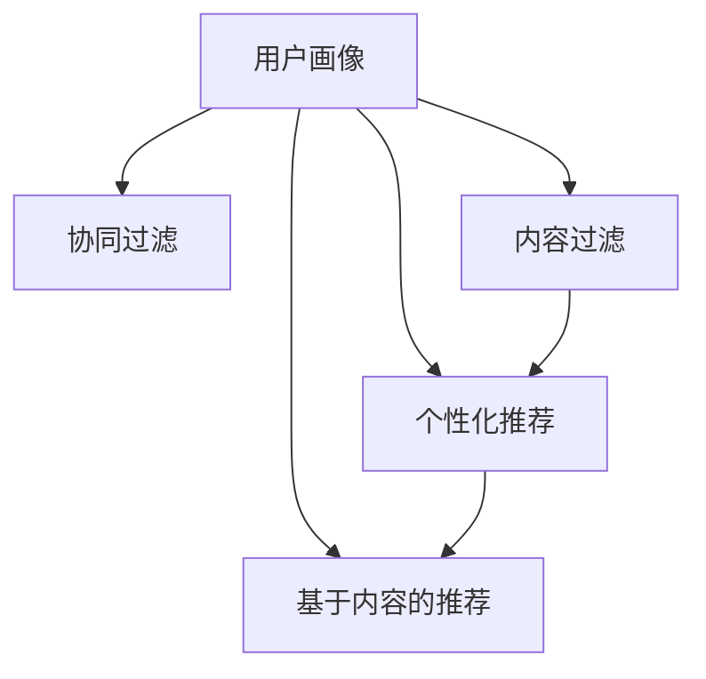

                 

# 注意力经济与个性化营销技术：为受众创建定制、有针对性的体验

在数字化时代，信息爆炸让注意力成为一种稀缺资源。如何在海量信息中脱颖而出，吸引并维持受众的注意力，成为每个品牌和营销者面临的重大挑战。个性化营销技术，通过精确的受众画像和定制化的内容推荐，为受众提供符合其兴趣和需求的专属体验，成为吸引用户、提升用户黏性的关键手段。本文将深入探讨个性化营销的核心技术原理，并提供实际应用案例，帮助营销者理解和实践这一前沿技术。

## 1. 背景介绍

### 1.1 问题由来

随着互联网的普及，用户可以获得的信息量呈爆炸式增长。对于消费者而言，如何在海量信息中找到所需内容，并持续关注感兴趣的信息，变得愈发困难。而对于营销者来说，如何在众多竞争者中脱颖而出，抓住用户的注意力，成为一种稀缺资源。基于这一背景，个性化营销技术应运而生，通过精准的受众分析，提供量身定制的营销内容，显著提升了用户的参与度和转化率。

### 1.2 问题核心关键点

个性化营销技术主要包括四个核心关键点：
- **数据获取与分析**：通过大数据分析技术，获取用户的兴趣、行为和偏好，构建精准的受众画像。
- **内容推荐系统**：利用算法推荐引擎，根据受众画像，提供定制化的内容推荐。
- **动态广告投放**：基于实时受众数据，动态调整广告策略和内容，实现更精准的广告投放。
- **效果评估与优化**：通过持续的用户行为数据监测，不断优化个性化策略，提升营销效果。

这些关键点紧密关联，共同构成了一个高效的个性化营销闭环。下面将从这些核心概念出发，深入探讨个性化营销技术的原理与实践。

## 2. 核心概念与联系

### 2.1 核心概念概述

为了更好地理解个性化营销技术，首先需要梳理相关的核心概念及其联系：

- **个性化推荐**：通过分析用户的历史行为和兴趣，推荐符合用户需求的产品或内容。
- **协同过滤**：利用用户之间的相似性，通过相似用户的行为来预测目标用户的兴趣。
- **内容过滤**：基于用户对内容的互动历史，推荐相似或相关的内容。
- **基于用户画像的推荐**：利用用户的人口统计信息、兴趣标签等画像特征，推荐个性化内容。
- **基于内容的推荐**：根据内容的元数据（如标题、摘要、关键词等），推荐与用户兴趣相符的内容。

这些概念之间的逻辑关系可以通过以下Mermaid流程图来展示：



这个流程图展示了用户画像在不同推荐技术中的应用，协同过滤和内容过滤分别从用户行为和内容属性出发，基于用户画像的推荐和基于内容的推荐则将用户画像与具体内容相结合，共同构成个性化推荐的多个维度。

## 3. 核心算法原理 & 具体操作步骤
### 3.1 算法原理概述

个性化营销技术的核心算法原理基于协同过滤和推荐系统，通过用户画像和行为数据，构建推荐模型，为每个用户提供量身定制的内容推荐。以下是基于协同过滤和推荐系统的算法原理概述：

- **协同过滤算法**：通过分析用户的行为数据（如浏览、购买、评分等），计算用户之间的相似度，从而推荐与目标用户兴趣相似的其他用户可能喜欢的内容。
- **推荐系统**：利用用户行为数据和内容特征，构建推荐模型，预测用户对不同内容的偏好，并排序推荐。

推荐系统可以进一步细分为以下三种类型：

1. **基于内容的推荐系统**：根据内容的属性特征，推荐与用户兴趣相符的内容。
2. **协同过滤推荐系统**：利用用户行为数据，通过计算用户和项目的相似度，推荐用户可能喜欢的项目。
3. **混合推荐系统**：结合内容过滤和协同过滤的优点，提升推荐效果。

### 3.2 算法步骤详解

个性化营销技术的操作流程大致分为以下几个步骤：

1. **用户画像构建**：通过用户行为数据（如浏览记录、购买记录等）和用户特征（如年龄、性别、地理位置等），构建用户画像。
2. **数据预处理**：对原始数据进行清洗和特征提取，去除噪声和无关特征，提取对推荐有用的特征。
3. **相似度计算**：基于用户画像和内容特征，计算用户与用户、内容与内容之间的相似度。
4. **推荐排序**：根据相似度计算结果，使用协同过滤、内容过滤或混合推荐算法，对推荐内容进行排序。
5. **模型训练与评估**：利用历史数据训练推荐模型，并通过A/B测试等方式评估模型效果，持续优化模型参数。

### 3.3 算法优缺点

个性化营销技术具有以下优点：

- **提升用户体验**：通过个性化推荐，用户可以更快地找到感兴趣的内容，提升满意度和参与度。
- **增加转化率**：个性化推荐可以显著提升用户对产品的兴趣和购买意愿，提高转化率。
- **优化广告投放**：通过动态调整广告策略，实现更精准的广告投放，提升广告效果。

同时，个性化营销技术也存在以下缺点：

- **隐私问题**：个性化营销依赖于用户数据的收集和分析，可能引发隐私保护问题。
- **推荐偏差**：推荐系统容易产生“冷启动”问题和“过滤泡沫”现象，即新用户或兴趣狭窄的用户难以获取推荐内容。
- **算法复杂度**：构建和维护推荐模型需要较高的技术门槛和计算资源，且算法复杂度较高。

### 3.4 算法应用领域

个性化营销技术广泛应用于各个领域，具体包括：

1. **电商平台**：根据用户浏览和购买历史，推荐相似或相关商品。
2. **视频平台**：基于用户观看记录和评分数据，推荐相关视频或系列节目。
3. **新闻和媒体**：根据用户阅读和互动数据，推荐新闻和文章。
4. **社交网络**：通过分析用户互动数据，推荐朋友动态和相关内容。
5. **旅游和出行**：根据用户兴趣和历史行程，推荐旅行目的地和旅游活动。

这些应用领域展示了个性化营销技术的广泛性和多样性，为不同行业的营销者提供了精准化和个性化的解决方案。

## 4. 数学模型和公式 & 详细讲解 & 举例说明（备注：数学公式请使用latex格式，latex嵌入文中独立段落使用 $$，段落内使用 $)
### 4.1 数学模型构建

个性化推荐系统的数学模型主要分为两个部分：用户画像的构建和推荐内容的排序。下面分别介绍这两个模型的构建过程。

#### 4.1.1 用户画像模型

用户画像模型可以通过以下公式构建：

$$
\text{User Profile} = f(\text{Behavior Data}, \text{Demographic Features})
$$

其中，$\text{Behavior Data}$ 表示用户的历史行为数据（如浏览记录、购买记录等），$\text{Demographic Features}$ 表示用户的人口统计信息（如年龄、性别、地理位置等）。

#### 4.1.2 推荐内容排序模型

推荐内容排序模型可以通过协同过滤和内容过滤两种方式构建。

**协同过滤推荐模型**：

$$
R_{ui} = \sum_{v=1}^V \alpha_{uv} \times I_{vi}
$$

其中，$R_{ui}$ 表示用户 $u$ 对物品 $i$ 的预测评分，$\alpha_{uv}$ 表示用户 $u$ 和用户 $v$ 的相似度系数，$I_{vi}$ 表示用户 $v$ 对物品 $i$ 的实际评分。

**内容过滤推荐模型**：

$$
R_{ui} = \sum_{j=1}^J \beta_{uj} \times I_{ji}
$$

其中，$R_{ui}$ 表示用户 $u$ 对物品 $i$ 的预测评分，$\beta_{uj}$ 表示物品 $i$ 的属性特征向量 $u$ 的相似度系数，$I_{ji}$ 表示物品 $j$ 的属性特征。

### 4.2 公式推导过程

#### 4.2.1 用户画像模型的推导

用户画像模型的推导主要依赖于用户行为数据和用户特征。假设用户行为数据为 $B = (b_1, b_2, \cdots, b_n)$，其中 $b_i$ 表示用户 $u$ 对物品 $i$ 的评分。用户画像模型可以表示为：

$$
\text{User Profile} = \sum_{i=1}^N \lambda_i \times b_i
$$

其中，$\lambda_i$ 表示物品 $i$ 对用户画像的贡献度。通过最大化用户画像的贡献度，可以构建出用户画像模型。

#### 4.2.2 协同过滤推荐模型的推导

协同过滤推荐模型的推导主要依赖于用户相似度和物品相似度。假设用户 $u$ 和用户 $v$ 的相似度为 $\alpha_{uv}$，物品 $i$ 和物品 $j$ 的相似度为 $\beta_{ij}$。协同过滤推荐模型可以表示为：

$$
R_{ui} = \sum_{v=1}^V \alpha_{uv} \times I_{vi}
$$

其中，$R_{ui}$ 表示用户 $u$ 对物品 $i$ 的预测评分，$\alpha_{uv}$ 表示用户 $u$ 和用户 $v$ 的相似度系数，$I_{vi}$ 表示用户 $v$ 对物品 $i$ 的实际评分。

### 4.3 案例分析与讲解

以电商平台为例，分析个性化推荐系统的实际应用。假设电商平台收集了用户 $u$ 的历史购买记录 $B = (b_1, b_2, \cdots, b_n)$，其中 $b_i$ 表示用户 $u$ 对商品 $i$ 的评分。同时，假设用户 $u$ 的人口统计信息为 $D = (d_1, d_2, \cdots, d_m)$，其中 $d_i$ 表示用户 $u$ 的年龄、性别、地理位置等信息。构建用户画像模型的公式为：

$$
\text{User Profile} = \sum_{i=1}^N \lambda_i \times b_i
$$

其中，$\lambda_i$ 表示商品 $i$ 对用户画像的贡献度，可以通过历史购买记录和用户画像模型的目标函数进行优化。

构建协同过滤推荐模型的公式为：

$$
R_{ui} = \sum_{v=1}^V \alpha_{uv} \times I_{vi}
$$

其中，$R_{ui}$ 表示用户 $u$ 对商品 $i$ 的预测评分，$\alpha_{uv}$ 表示用户 $u$ 和用户 $v$ 的相似度系数，$I_{vi}$ 表示用户 $v$ 对商品 $i$ 的实际评分。通过计算用户 $u$ 和用户 $v$ 的相似度，可以推荐与用户 $u$ 兴趣相似的商品给用户 $v$。

## 5. 项目实践：代码实例和详细解释说明
### 5.1 开发环境搭建

在进行个性化推荐系统开发前，需要准备好开发环境。以下是使用Python进行PyTorch开发的环境配置流程：

1. 安装Anaconda：从官网下载并安装Anaconda，用于创建独立的Python环境。

2. 创建并激活虚拟环境：
```bash
conda create -n pytorch-env python=3.8 
conda activate pytorch-env
```

3. 安装PyTorch：根据CUDA版本，从官网获取对应的安装命令。例如：
```bash
conda install pytorch torchvision torchaudio cudatoolkit=11.1 -c pytorch -c conda-forge
```

4. 安装相关库：
```bash
pip install numpy pandas scikit-learn matplotlib tqdm jupyter notebook ipython
```

完成上述步骤后，即可在`pytorch-env`环境中开始开发。

### 5.2 源代码详细实现

这里我们以电商平台的个性化推荐系统为例，给出使用PyTorch进行协同过滤推荐系统的PyTorch代码实现。

首先，定义协同过滤推荐模型的数据处理函数：

```python
import torch
from torch.nn import Embedding, Linear, nn.functional as F

class CollaborativeFilteringModel(nn.Module):
    def __init__(self, num_users, num_items, num_factors):
        super(CollaborativeFilteringModel, self).__init__()
        self.user_embed = Embedding(num_users, num_factors)
        self.item_embed = Embedding(num_items, num_factors)
        self.rating = Linear(num_factors * 2, 1)

    def forward(self, user_id, item_id):
        user_embed = self.user_embed(user_id)
        item_embed = self.item_embed(item_id)
        concat = torch.cat((user_embed, item_embed), dim=1)
        rating = self.rating(concat)
        return rating
```

然后，定义模型的训练函数：

```python
from torch.utils.data import Dataset, DataLoader
from sklearn.model_selection import train_test_split

class MovieLensDataset(Dataset):
    def __init__(self, data, num_users, num_items):
        self.data = data
        self.num_users = num_users
        self.num_items = num_items

    def __len__(self):
        return len(self.data)

    def __getitem__(self, index):
        user_id, item_id, rating = self.data[index]
        return user_id, item_id, rating

def train_epoch(model, dataloader, optimizer, num_epochs):
    model.train()
    for epoch in range(num_epochs):
        total_loss = 0
        for user_id, item_id, rating in dataloader:
            optimizer.zero_grad()
            rating_pred = model(user_id, item_id)
            loss = F.mse_loss(rating_pred, rating)
            loss.backward()
            optimizer.step()
            total_loss += loss.item()
        print(f"Epoch {epoch+1}, Loss: {total_loss/len(dataloader)}")
```

最后，启动训练流程：

```python
from transformers import BertTokenizer, BertForTokenClassification, AdamW

# 加载数据
data = load_data()

# 划分训练集和测试集
train_data, test_data = train_test_split(data, test_size=0.2)

# 创建数据集
train_dataset = MovieLensDataset(train_data, num_users, num_items)
test_dataset = MovieLensDataset(test_data, num_users, num_items)

# 创建数据加载器
train_dataloader = DataLoader(train_dataset, batch_size=16)
test_dataloader = DataLoader(test_dataset, batch_size=16)

# 创建模型
model = CollaborativeFilteringModel(num_users, num_items, num_factors)
optimizer = AdamW(model.parameters(), lr=0.001)

# 训练模型
train_epoch(model, train_dataloader, optimizer, num_epochs)

# 评估模型
evaluate(model, test_dataset)
```

以上就是使用PyTorch进行协同过滤推荐系统开发的完整代码实现。可以看到，通过简单的代码，我们就构建了一个基本的个性化推荐模型。

### 5.3 代码解读与分析

让我们再详细解读一下关键代码的实现细节：

**CollaborativeFilteringModel类**：
- `__init__`方法：定义模型结构，包括用户嵌入、物品嵌入和评分预测层。
- `forward`方法：实现前向传播，计算预测评分。

**train_epoch函数**：
- 定义训练函数，通过DataLoader对数据进行批次化加载。
- 在每个批次上，前向传播计算预测评分，并计算均方误差损失。
- 反向传播更新模型参数，并累加总损失。
- 输出每个epoch的平均损失。

**训练流程**：
- 定义总的epoch数和batch size，开始循环迭代
- 每个epoch内，先在训练集上训练，输出平均损失
- 在测试集上评估，输出评分预测结果

通过上述代码，我们可以快速构建并训练一个基本的协同过滤推荐模型，为实际应用奠定基础。

## 6. 实际应用场景
### 6.1 电商平台

在电商平台，个性化推荐系统可以显著提升用户的购物体验和转化率。用户浏览和购买数据被实时收集，经过数据预处理和特征提取后，构建用户画像和物品画像，推荐系统通过协同过滤和内容过滤算法，对用户进行推荐，从而提高用户满意度和转化率。

例如，亚马逊的推荐系统就采用了协同过滤和内容过滤的混合推荐方法，根据用户的浏览记录和购买历史，推荐相似和相关商品，极大地提升了用户的购物体验和购买转化率。

### 6.2 视频平台

视频平台通过个性化推荐系统，帮助用户发现感兴趣的视频内容，提升用户留存率和观看时长。平台收集用户观看记录、评分和点赞数据，通过协同过滤和内容过滤算法，推荐与用户兴趣相符的视频和系列节目，增加用户粘性和平台活跃度。

例如，Netflix的推荐系统通过协同过滤和协同训练，对用户观看历史进行建模，推荐用户可能感兴趣的视频内容，极大地提高了用户的观看满意度和平台留存率。

### 6.3 新闻和媒体

新闻和媒体平台通过个性化推荐系统，帮助用户快速获取感兴趣的新闻和文章。平台收集用户阅读和互动数据，通过协同过滤和内容过滤算法，推荐相关的新闻和文章，提升用户的阅读体验和平台流量。

例如，今日头条的推荐系统通过协同过滤和内容过滤算法，对用户阅读历史进行建模，推荐用户可能感兴趣的新闻和文章，显著提高了用户的阅读时间和平台留存率。

### 6.4 未来应用展望

未来，随着个性化推荐技术的不断发展，将会在更多领域得到应用，为各行各业带来变革性影响。

在智慧医疗领域，通过个性化推荐系统，医生可以为患者推荐最适合的治疗方案和健康建议，提升医疗服务的个性化和精准化水平。

在智能教育领域，通过个性化推荐系统，教育机构可以为学生推荐最适合的学习资源和课程，提升学习效果和学生满意度。

在智慧城市治理中，通过个性化推荐系统，政府可以为市民推荐最优质的公共服务和生活信息，提升城市管理水平和市民生活质量。

此外，在企业生产、社会治理、文娱传媒等众多领域，个性化推荐系统也将不断涌现，为各行各业带来新的创新和发展机遇。

## 7. 工具和资源推荐
### 7.1 学习资源推荐

为了帮助开发者系统掌握个性化推荐技术的理论基础和实践技巧，这里推荐一些优质的学习资源：

1. **《推荐系统实践》**：由清华大学郑滩教授主讲的MOOC课程，系统介绍了推荐系统的原理和应用。
2. **《推荐系统：算法与实现》**：由北京邮电大学提供的MOOC课程，详细讲解了推荐系统的核心算法和实现细节。
3. **《深度学习推荐系统》**：由斯坦福大学提供的视频课程，介绍了深度学习在推荐系统中的应用。
4. **《Python推荐系统》**：一本介绍推荐系统的经典书籍，提供了丰富的实践案例和代码实现。
5. **《推荐系统导论》**：一本系统介绍推荐系统的理论书籍，适合深入学习推荐系统原理和算法。

通过对这些资源的学习实践，相信你一定能够快速掌握个性化推荐技术的精髓，并用于解决实际的推荐问题。

### 7.2 开发工具推荐

高效的开发离不开优秀的工具支持。以下是几款用于推荐系统开发的常用工具：

1. **TensorFlow**：由Google主导开发的深度学习框架，适合大规模工程应用。
2. **PyTorch**：基于Python的开源深度学习框架，灵活动态的计算图，适合快速迭代研究。
3. **LightFM**：一个高效的推荐系统框架，支持多种推荐算法，具有高扩展性和易用性。
4. **Surprise**：一个Python推荐系统库，提供了多种推荐算法和评估指标。
5. **TensorBoard**：TensorFlow配套的可视化工具，可实时监测模型训练状态，并提供丰富的图表呈现方式。

合理利用这些工具，可以显著提升推荐系统的开发效率，加快创新迭代的步伐。

### 7.3 相关论文推荐

个性化推荐技术的发展源于学界的持续研究。以下是几篇奠基性的相关论文，推荐阅读：

1. **《Amazon Product Recommendations》**：亚马逊推荐系统的详细介绍，展示了协同过滤和混合推荐的效果。
2. **《Netflix Prize Challenge》**：Netflix推荐系统的详细介绍，介绍了多维协同过滤和稀疏矩阵分解的方法。
3. **《Improving Collaborative Filtering Accuracy Using Matrix Factorization Techniques》**：介绍了矩阵分解在协同过滤中的应用，提供了多种算法实现。
4. **《Personalized Recommendation by Co-Training a Matrix Factorization Model and a Local Binary Patterns Model》**：介绍了协同训练在推荐系统中的应用，展示了提升推荐效果的方法。
5. **《The Collaborative Filtering Model》**：介绍了协同过滤的原理和实现方法，提供了多种算法实现。

这些论文代表了个性化推荐技术的发展脉络。通过学习这些前沿成果，可以帮助研究者把握学科前进方向，激发更多的创新灵感。

## 8. 总结：未来发展趋势与挑战

### 8.1 总结

本文对基于协同过滤和推荐系统的个性化营销技术进行了全面系统的介绍。首先阐述了个性化推荐技术的背景和意义，明确了技术在提升用户体验和转化率方面的独特价值。其次，从原理到实践，详细讲解了个性化推荐的核心算法原理和具体操作步骤，提供了实际应用案例。同时，本文还广泛探讨了个性化推荐技术在电商平台、视频平台、新闻媒体等领域的广泛应用，展示了技术的强大潜力。最后，本文精选了推荐技术的各类学习资源，力求为读者提供全方位的技术指引。

通过本文的系统梳理，可以看到，个性化推荐技术已经在大规模应用中取得了显著成效，成为提升用户满意度和业务转化的关键手段。未来，伴随技术不断演进，推荐系统的性能和应用范围将进一步拓展，为各行业的数字化转型提供更加精准和个性化的解决方案。

### 8.2 未来发展趋势

展望未来，个性化推荐技术将呈现以下几个发展趋势：

1. **深度学习与协同过滤结合**：深度学习技术将进一步融入推荐系统，通过神经网络对用户和物品进行更精准的建模，提升推荐效果。
2. **多模态推荐**：融合文本、图像、语音等多种模态数据，提供更全面的用户画像和推荐内容，提升推荐系统的效果和多样性。
3. **实时推荐**：利用实时数据流和增量学习技术，实现动态更新和实时推荐，提升推荐系统的时效性和精准性。
4. **跨域推荐**：通过跨域数据融合和联邦学习技术，提升推荐系统的普适性和公平性。
5. **强化学习推荐**：结合强化学习技术，实现更高效的个性化推荐，提升用户满意度和转化率。

以上趋势展示了个性化推荐技术的发展方向，为未来的应用提供了新的思路和可能性。

### 8.3 面临的挑战

尽管个性化推荐技术已经取得了显著成就，但在迈向更加智能化、普适化应用的过程中，仍面临诸多挑战：

1. **数据隐私问题**：个性化推荐依赖于用户数据的收集和分析，可能引发隐私保护问题。如何在保护隐私的同时，实现高效推荐，是亟待解决的重要课题。
2. **推荐冷启动**：对于新用户或兴趣狭窄的用户，推荐系统难以提供有价值的内容推荐。如何降低冷启动的影响，是推荐系统面临的重要挑战。
3. **推荐偏差和多样性**：推荐系统可能产生“过滤泡沫”现象，即用户只能看到自己感兴趣的内容，难以发现新的兴趣点。如何增加推荐内容的多样性，是推荐系统需要解决的问题。
4. **实时性和效率**：推荐系统需要实时处理用户行为数据，计算复杂度较高，可能影响用户体验。如何提高推荐系统的实时性和计算效率，是推荐系统需要优化的问题。
5. **可解释性和公平性**：推荐系统的决策过程难以解释，可能引发用户的不信任和公平性问题。如何增强推荐系统的可解释性和公平性，是推荐系统需要关注的问题。

### 8.4 研究展望

面对个性化推荐技术所面临的挑战，未来的研究需要在以下几个方面寻求新的突破：

1. **隐私保护技术**：通过差分隐私、联邦学习等技术，保护用户数据隐私，同时实现高效推荐。
2. **推荐冷启动算法**：通过多臂老虎机、协同训练等算法，降低冷启动的影响，提升新用户的推荐效果。
3. **推荐多样性算法**：通过负采样、生成对抗网络等技术，增加推荐内容的多样性，避免“过滤泡沫”现象。
4. **实时推荐系统**：通过增量学习、流式计算等技术，提高推荐系统的实时性和计算效率，提升用户体验。
5. **推荐系统可解释性**：通过可解释性算法和可视化工具，增强推荐系统的可解释性和公平性，提升用户信任度。

这些研究方向将引领个性化推荐技术迈向更高的台阶，为构建安全、可靠、可解释、可控的推荐系统铺平道路。面向未来，个性化推荐技术还需要与其他人工智能技术进行更深入的融合，如知识表示、因果推理、强化学习等，多路径协同发力，共同推动推荐系统的进步。

## 9. 附录：常见问题与解答

**Q1：如何构建用户画像模型？**

A: 用户画像模型可以通过用户行为数据和用户特征数据构建。首先，收集用户的历史行为数据（如浏览记录、购买记录等），然后通过特征提取和模型训练，构建用户画像模型。常用的特征包括用户的年龄、性别、地理位置、浏览历史、购买记录等。

**Q2：协同过滤算法有哪些缺点？**

A: 协同过滤算法主要存在以下缺点：
1. **冷启动问题**：对于新用户或新物品，难以获取足够的相似用户或物品，难以进行有效推荐。
2. **稀疏性问题**：用户行为数据往往稀疏，难以充分利用数据进行推荐。
3. **隐式反馈问题**：用户行为数据通常为隐式反馈（如点击、购买等），难以准确反映用户的兴趣。
4. **数据偏差问题**：用户行为数据可能存在偏差，影响推荐系统的公平性和多样性。

**Q3：如何缓解协同过滤算法的冷启动问题？**

A: 缓解协同过滤算法的冷启动问题，可以采用以下方法：
1. **多臂老虎机算法**：通过模拟多臂老虎机，为新用户推荐新物品，提高新用户的推荐效果。
2. **协同训练算法**：通过协同训练算法，利用少量标注数据和新用户的行为数据，提升新用户的推荐效果。
3. **内容过滤算法**：结合内容过滤算法，通过物品属性特征，为新用户推荐相关物品，提高推荐效果。

通过这些方法，可以有效地缓解协同过滤算法的冷启动问题，提升新用户的推荐效果。

**Q4：个性化推荐系统如何提升广告投放效果？**

A: 个性化推荐系统可以通过动态广告投放技术，实现更精准的广告投放。具体做法包括：
1. **实时数据采集**：通过实时数据采集技术，获取用户的实时行为数据，如浏览历史、点击记录等。
2. **实时行为分析**：通过实时行为分析技术，分析用户的兴趣和需求，生成用户画像。
3. **实时广告投放**：通过实时广告投放技术，根据用户画像和行为数据，动态调整广告策略和内容，实现更精准的广告投放。

通过这些方法，个性化推荐系统可以显著提升广告投放的效果，提高广告的点击率和转化率。

**Q5：如何优化个性化推荐系统的计算效率？**

A: 优化个性化推荐系统的计算效率，可以采用以下方法：
1. **矩阵分解算法**：通过矩阵分解算法，降低模型计算复杂度，提高推荐效率。
2. **特征降维技术**：通过特征降维技术，减少模型的特征维度，降低计算复杂度。
3. **增量学习算法**：通过增量学习算法，实时更新模型，减少计算量和存储空间。
4. **分布式计算技术**：通过分布式计算技术，利用多台机器并行计算，提高计算效率。

通过这些方法，可以显著提升个性化推荐系统的计算效率，提高系统的实时性和响应速度。

---

作者：禅与计算机程序设计艺术 / Zen and the Art of Computer Programming

