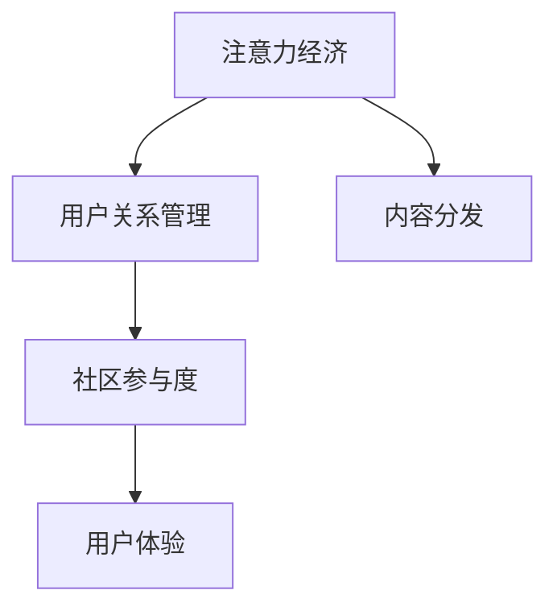

                 

# 注意力经济与在线社区建设策略与实践：吸引并留住忠实的粉丝和受众

## 1. 背景介绍

### 1.1 问题由来

在数字化和互联网技术高速发展的今天，注意力经济已成为各类平台争相竞逐的核心资源。如何有效吸引并留住用户的注意力，构建一个稳定、活跃的在线社区，成为了许多网站和应用的关键挑战。特别对于内容生产者和社区管理者来说，这不仅是一场资源和技术的较量，更是一场以用户体验为中心的竞争。

### 1.2 问题核心关键点

构建在线社区的核心在于建立强而有力的用户关系，提供有价值的内容，提升用户粘性，并创造良好的社交互动环境。然而，在实践中，社区建设常常面临用户流失率高、内容质量参差不齐、用户参与度低等问题。因此，本文将深入探讨注意力经济与在线社区建设的策略与实践，试图提供一个全面的解决方案。

### 1.3 问题研究意义

成功的在线社区不仅能帮助内容生产者扩大影响力，还能增强用户的参与感和归属感。通过系统的策略和科学的实践，可以有效吸引并留住用户，提高社区的活跃度和用户满意度。最终，一个健康、活跃的在线社区将成为内容生产者和平台方的重要资产，推动信息的流通和知识的高效传播。

## 2. 核心概念与联系

### 2.1 核心概念概述

为更好地理解注意力经济与在线社区建设策略，本文将介绍几个关键概念：

- **注意力经济 (Attention Economy)**：指通过获取并维持用户的注意力来创造经济价值的过程。在数字时代，用户的注意力成为稀缺资源，吸引并保持用户关注成为商业活动的核心目标。

- **用户关系管理 (User Relationship Management, CRM)**：通过系统地收集和分析用户数据，实现对用户行为的预测和干预，提升用户满意度和忠诚度。

- **内容分发 (Content Distribution)**：利用算法和策略，将合适的内容推荐给目标用户，提升内容的相关性和用户参与度。

- **社区参与度 (Community Engagement)**：用户对社区活动的参与程度，如发布内容、评论互动、点赞等，直接影响社区的活跃度。

- **用户体验 (User Experience, UX)**：用户在使用产品或服务时的主观体验，包括便捷性、可用性、满意度等，是吸引和留存用户的重要因素。

这些核心概念之间有着紧密的联系，共同构成了在线社区建设的基础。理解并运用这些概念，可以有效构建一个健康、活跃的社区。

### 2.2 核心概念原理和架构的 Mermaid 流程图



这个流程图展示了注意力经济、用户关系管理、内容分发、社区参与度和用户体验之间的联系。每个节点不仅影响着其他节点，同时也与整体社区建设密切相关。

## 3. 核心算法原理 & 具体操作步骤
### 3.1 算法原理概述

基于注意力经济的在线社区建设，本质上是通过算法和策略，最大化用户注意力和社区参与度。其核心在于：

1. **用户画像构建**：通过数据收集和分析，建立详尽的用户画像，了解用户的兴趣和行为。
2. **内容推荐算法**：利用机器学习算法，精准推荐与用户兴趣相符的内容，提升用户粘性。
3. **互动激励机制**：设计有吸引力的互动激励措施，如积分、勋章、排行榜等，激发用户积极参与。
4. **社区治理策略**：制定和执行有效的社区治理措施，如反垃圾、反欺诈、内容审核等，保障社区秩序。
5. **用户体验优化**：通过技术手段和设计改进，提升用户的使用体验，增强用户满意度。

### 3.2 算法步骤详解

下面详细介绍基于注意力经济的在线社区建设的具体步骤：

#### 3.2.1 用户画像构建

1. **数据收集**：收集用户在平台上的行为数据，如浏览记录、点赞、评论、发布内容等。
2. **数据处理**：对收集的数据进行清洗和预处理，去除无效或噪音数据，确保数据的准确性和一致性。
3. **特征工程**：设计合适的特征工程流程，提取有意义的特征向量，如用户的兴趣标签、活跃时间段等。
4. **模型训练**：使用机器学习算法，如K近邻、决策树、随机森林等，训练用户画像模型，构建详尽的用户画像。

#### 3.2.2 内容推荐算法

1. **推荐模型选择**：选择合适的推荐模型，如协同过滤、基于内容的推荐、矩阵分解等。
2. **特征工程**：根据推荐模型需求，设计特征工程流程，提取内容特征、用户特征等。
3. **模型训练**：在推荐模型上进行训练，优化模型参数，提升推荐准确性。
4. **推荐系统部署**：将训练好的推荐模型集成到推荐系统中，实时生成推荐结果。

#### 3.2.3 互动激励机制

1. **激励方案设计**：设计有吸引力的激励方案，如积分系统、排行榜、勋章等。
2. **规则制定**：明确激励方案的规则和限制，避免恶意刷积分等行为。
3. **系统集成**：将激励方案集成到社区平台中，实时计算和更新用户积分、排名等信息。

#### 3.2.4 社区治理策略

1. **规则制定**：制定社区行为规范，明确哪些行为被禁止、哪些行为会被奖励等。
2. **监测与执行**：建立社区监测系统，对用户行为进行实时监控，并对违规行为进行惩罚。
3. **社区反馈**：建立社区反馈机制，收集用户对社区治理的建议和意见，持续优化治理策略。

#### 3.2.5 用户体验优化

1. **界面设计**：优化社区界面设计，提高用户体验，减少操作步骤，提升访问便捷性。
2. **性能优化**：优化系统性能，提升响应速度，确保用户访问流畅。
3. **功能扩展**：根据用户反馈，不断扩展社区功能，增加用户体验的丰富度。

### 3.3 算法优缺点

基于注意力经济的在线社区建设方法具有以下优点：

1. **高效性**：通过数据驱动的推荐和激励机制，可以显著提高用户粘性和活跃度。
2. **可扩展性**：可以根据用户画像和社区数据，动态调整策略，适应用户行为变化。
3. **精准度**：通过精准的推荐算法和用户画像，能够高效识别并推荐高质量内容。

同时，该方法也存在一定的局限性：

1. **数据依赖**：社区建设的效果高度依赖于数据的完整性和准确性。
2. **算法复杂性**：复杂的数据处理和推荐算法，增加了系统实现的难度。
3. **用户隐私**：用户数据的收集和分析，可能带来用户隐私和数据安全问题。

尽管存在这些局限性，但就目前而言，基于注意力经济的在线社区建设方法仍然是最主流和有效的实践手段。

### 3.4 算法应用领域

基于注意力经济的在线社区建设方法，已经在社交网络、问答社区、论坛、直播平台等多个领域得到广泛应用，具体如下：

1. **社交网络**：如微信、微博、Facebook等，通过精准推荐、互动激励等手段，提升用户活跃度和满意度。
2. **问答社区**：如知乎、Quora等，通过用户画像构建和内容推荐，提升问答效果和用户参与度。
3. **论坛**：如Reddit、贴吧等，通过社区治理策略和用户体验优化，提升用户互动质量和论坛氛围。
4. **直播平台**：如Bilibili、YouTube等，通过个性化推荐和互动激励，提升主播和观众的互动体验。

## 4. 数学模型和公式 & 详细讲解 & 举例说明

### 4.1 数学模型构建

为更精确地描述基于注意力经济的在线社区建设，本文将构建一个简单的数学模型。

设社区中用户数为 $U$，内容数为 $C$，用户对内容的交互次数为 $I$，则社区建设的优化目标为最大化用户注意力和社区参与度：

$$
\max_{U, C, I} \left( \sum_{u \in U} \sum_{c \in C} \frac{I_{uc}}{\max(I)} \right)
$$

其中，$I_{uc}$ 表示用户 $u$ 对内容 $c$ 的互动次数，$\max(I)$ 表示用户对内容互动的最大值。

### 4.2 公式推导过程

通过上述优化目标，我们可以进行以下推导：

1. **内容推荐优化**：

设内容 $c$ 的特征向量为 $\mathbf{v}_c$，用户 $u$ 的特征向量为 $\mathbf{u}_u$，则推荐算法可以表示为：

$$
\mathbf{r}_{uc} = \mathbf{v}_c^T \mathbf{u}_u
$$

其中，$\mathbf{r}_{uc}$ 表示内容 $c$ 对用户 $u$ 的推荐度。

2. **用户画像优化**：

设用户 $u$ 的兴趣标签为 $t$，则用户画像可以表示为：

$$
\mathbf{u}_u = \sum_{t \in T_u} \mathbf{p}_t
$$

其中，$T_u$ 表示用户 $u$ 的兴趣标签集合，$\mathbf{p}_t$ 表示标签 $t$ 的特征向量。

3. **互动激励优化**：

设用户 $u$ 的积分 $s$ 为：

$$
s = \sum_{c \in C} r_{uc}
$$

其中，$r_{uc}$ 表示用户 $u$ 对内容 $c$ 的推荐度。

4. **社区治理优化**：

设社区违规行为数为 $V$，则社区治理的目标为最小化违规行为：

$$
\min_{V} \left( \sum_{v \in V} p_v \right)
$$

其中，$p_v$ 表示违规行为 $v$ 的惩罚系数。

### 4.3 案例分析与讲解

#### 案例一：社交网络平台

社交网络平台通过精准推荐和互动激励机制，提高用户活跃度。例如，Facebook通过用户的浏览历史和兴趣标签，生成个性化的内容推荐，并通过点赞、分享等互动行为，增加用户的积分和排名，吸引用户参与。

#### 案例二：问答社区

知乎等问答社区，通过用户画像构建和内容推荐，提升问答效果和用户参与度。例如，知乎通过用户的浏览记录和提问回答历史，构建用户画像，再根据用户画像进行内容推荐，提升问答效果。

## 5. 项目实践：代码实例和详细解释说明

### 5.1 开发环境搭建

在进行在线社区建设的实践前，我们需要准备好开发环境。以下是使用Python进行社区建设的开发环境配置流程：

1. 安装Python：从官网下载并安装Python 3.8，建议选择Anaconda或Miniconda进行安装。
2. 创建虚拟环境：使用conda创建虚拟环境，避免不同项目之间的环境污染。
3. 安装依赖库：使用pip或conda安装必要的依赖库，如pandas、numpy、scikit-learn、TensorFlow等。
4. 配置数据库：配置社区所需的数据库，如MySQL、MongoDB等。
5. 设置服务器：配置社区服务的服务器环境，如使用Nginx或Apache进行Web服务部署。

### 5.2 源代码详细实现

下面以问答社区为例，给出使用TensorFlow进行用户画像构建和内容推荐的PyTorch代码实现。

```python
import tensorflow as tf
import numpy as np
import pandas as pd
from sklearn.preprocessing import LabelEncoder

# 读取数据
train_data = pd.read_csv('train_data.csv')

# 特征工程
train_data['label'] = LabelEncoder().fit_transform(train_data['label'])
train_data = train_data.drop(['id', 'time'], axis=1)

# 模型训练
model = tf.keras.Sequential([
    tf.keras.layers.Dense(64, activation='relu', input_shape=(len(train_data.columns) - 1,)),
    tf.keras.layers.Dense(32, activation='relu'),
    tf.keras.layers.Dense(1, activation='sigmoid')
])
model.compile(optimizer=tf.keras.optimizers.Adam(0.001), loss='binary_crossentropy', metrics=['accuracy'])

# 训练模型
model.fit(train_data.drop(['label'], axis=1), train_data['label'], epochs=10, batch_size=32)

# 模型预测
test_data = pd.read_csv('test_data.csv')
test_data['label'] = LabelEncoder().fit_transform(test_data['label'])
test_data = test_data.drop(['id', 'time'], axis=1)
predictions = model.predict(test_data.drop(['label'], axis=1))
```

以上代码展示了使用TensorFlow进行用户画像构建和内容推荐的基本流程。

### 5.3 代码解读与分析

让我们再详细解读一下关键代码的实现细节：

**数据处理**：
- `train_data`：社区用户的历史行为数据，包括浏览记录、点赞、评论等。
- `label`：用户的兴趣标签，用于构建用户画像。
- `time`：用户行为的时间戳，用于去重和特征工程。

**特征工程**：
- 使用`LabelEncoder`将标签转换为数值形式。
- 删除不需要的列，如用户ID和时间戳。

**模型构建**：
- `Sequential`：定义序列模型，包含多个全连接层。
- `Dense`：定义全连接层，设置激活函数和输入维度。
- `model.compile`：编译模型，设置优化器、损失函数和评价指标。

**模型训练**：
- `model.fit`：使用训练数据训练模型，设置训练轮数和批大小。

**模型预测**：
- `test_data`：社区用户的新行为数据，用于测试模型的效果。
- `predictions`：模型对用户行为的预测结果。

## 6. 实际应用场景

### 6.1 社交网络平台

社交网络平台通过精准推荐和互动激励机制，提高用户活跃度。例如，Facebook通过用户的浏览历史和兴趣标签，生成个性化的内容推荐，并通过点赞、分享等互动行为，增加用户的积分和排名，吸引用户参与。

### 6.2 问答社区

知乎等问答社区，通过用户画像构建和内容推荐，提升问答效果和用户参与度。例如，知乎通过用户的浏览记录和提问回答历史，构建用户画像，再根据用户画像进行内容推荐，提升问答效果。

### 6.3 论坛

如Reddit、贴吧等论坛，通过社区治理策略和用户体验优化，提升用户互动质量和论坛氛围。例如，Reddit通过反垃圾、反欺诈等策略，维护论坛秩序，并通过社区投票、贡献度等机制，鼓励用户积极参与。

### 6.4 直播平台

如Bilibili、YouTube等直播平台，通过个性化推荐和互动激励，提升主播和观众的互动体验。例如，Bilibili通过主播的直播内容、互动情况，生成个性化的观众推荐，增加观众的参与度。

## 7. 工具和资源推荐

### 7.1 学习资源推荐

为帮助开发者系统掌握在线社区建设的理论基础和实践技巧，这里推荐一些优质的学习资源：

1. **《社区心理学与用户行为》**：系统介绍社区心理学的基本概念和用户行为模式，理解社区建设的心理学基础。
2. **《数据科学与社区建设》**：涵盖数据科学在社区建设中的应用，如用户画像构建、内容推荐算法等。
3. **《社区治理策略与实践》**：详细介绍社区治理的策略和方法，提升社区管理水平。
4. **《用户体验设计》**：系统介绍用户体验设计的原理和实践，提升用户满意度。
5. **《深度学习与推荐系统》**：涵盖推荐系统的算法和实现方法，提升推荐精度。

通过这些资源的学习实践，相信你一定能够快速掌握在线社区建设的精髓，并用于解决实际的社区问题。

### 7.2 开发工具推荐

高效的开发离不开优秀的工具支持。以下是几款用于在线社区建设开发的常用工具：

1. **TensorFlow**：谷歌主导的开源深度学习框架，生产部署方便，适合大规模工程应用。
2. **PyTorch**：灵活的深度学习框架，适合快速迭代研究。
3. **Flask**：轻量级的Web框架，适合快速搭建社区服务接口。
4. **Django**：功能全面的Web框架，适合构建复杂社区应用。
5. **MySQL**：稳定可靠的关系型数据库，适合存储社区数据。
6. **Redis**：高性能的内存数据库，适合存储社区缓存数据。

合理利用这些工具，可以显著提升在线社区建设的开发效率，加快创新迭代的步伐。

### 7.3 相关论文推荐

在线社区建设的研究源于学界的持续探索。以下是几篇奠基性的相关论文，推荐阅读：

1. **《社交网络的推荐算法研究》**：介绍社交网络的推荐算法，包括协同过滤、内容推荐等。
2. **《用户画像构建与个性化推荐》**：研究用户画像构建方法和推荐系统的优化策略。
3. **《社区治理策略与实践》**：探讨社区治理策略和机制，提升社区管理效果。
4. **《用户体验设计与社区建设》**：介绍用户体验设计的原理和实践，提升社区建设质量。
5. **《深度学习与在线社区》**：研究深度学习在在线社区建设中的应用，提升社区智能化水平。

这些论文代表了大语言模型微调技术的发展脉络。通过学习这些前沿成果，可以帮助研究者把握学科前进方向，激发更多的创新灵感。

## 8. 总结：未来发展趋势与挑战

### 8.1 总结

本文对基于注意力经济的在线社区建设方法进行了全面系统的介绍。首先阐述了注意力经济与社区建设的背景和意义，明确了社区建设的目标和方法。其次，从原理到实践，详细讲解了社区建设的数学模型和操作步骤，给出了社区建设的完整代码实例。同时，本文还广泛探讨了社区建设在社交网络、问答社区、论坛、直播平台等多个领域的应用前景，展示了社区建设的巨大潜力。最后，本文精选了社区建设的各类学习资源，力求为读者提供全方位的技术指引。

通过本文的系统梳理，可以看到，基于注意力经济的在线社区建设方法已经在多个领域得到广泛应用，并展示了其强大的用户吸引和留存能力。未来，伴随社区技术的持续演进，基于社区的数据驱动和个性化推荐将更加精细化，社区管理将更加智能化和人性化，社区建设将迎来更加广阔的应用前景。

### 8.2 未来发展趋势

展望未来，在线社区建设将呈现以下几个发展趋势：

1. **智能化提升**：社区建设将更加智能化，通过数据分析和机器学习，实现更加精准的内容推荐和用户画像构建。
2. **个性化定制**：社区建设将更加个性化，根据用户兴趣和行为，定制个性化的内容和推荐策略，提升用户满意度。
3. **多模态融合**：社区建设将融合多模态数据，如文本、图片、视频等，提升社区内容的丰富性和互动体验。
4. **全生命周期管理**：社区建设将实现全生命周期管理，从用户画像构建到内容推荐、互动激励、社区治理，全方位提升社区建设质量。
5. **跨平台协同**：社区建设将实现跨平台协同，通过多平台数据共享和用户行为分析，提升社区整体效果。

以上趋势凸显了在线社区建设技术的广阔前景。这些方向的探索发展，必将进一步提升社区建设的智能化水平，为用户创造更加丰富、互动、体验的社交环境。

### 8.3 面临的挑战

尽管在线社区建设已经取得了一定的进展，但在迈向更加智能化、普适化应用的过程中，仍面临诸多挑战：

1. **数据隐私问题**：社区数据的收集和使用可能带来用户隐私和数据安全问题，如何保护用户隐私成为重要课题。
2. **内容质量控制**：社区内容的真实性和质量参差不齐，如何有效过滤低质量内容和违规内容，提升社区内容质量。
3. **用户行为预测**：用户行为难以预测，如何通过模型优化，提升预测准确性，实现更精准的推荐和互动。
4. **社区治理难题**：社区违规行为频发，如何通过算法和策略，及时发现和处理违规行为，保障社区秩序。
5. **用户体验优化**：社区界面和功能设计复杂，如何通过用户体验优化，提升用户的使用体验和满意度。

这些挑战需要技术创新和政策协同，共同推动社区建设的持续发展和优化。

### 8.4 研究展望

面向未来，在线社区建设技术需要进一步研究和探索，主要方向包括：

1. **强化学习在社区建设中的应用**：研究强化学习在推荐系统、用户行为预测等方面的应用，提升社区建设效果。
2. **深度学习在社区建设的融合**：研究深度学习在内容推荐、用户画像构建等方面的应用，提升社区智能化水平。
3. **社区治理的自动化和智能化**：研究自动化和智能化社区治理策略，提升社区管理效果。
4. **跨平台协同和联邦学习**：研究跨平台数据共享和联邦学习技术，提升社区整体效果。

这些研究方向将为社区建设带来新的突破，推动社区建设技术向更智能化、普适化和人性化方向发展。

## 9. 附录：常见问题与解答

**Q1：如何构建详尽的用户画像？**

A: 构建详尽的用户画像需要多维度的数据收集和分析。可以通过用户的历史行为数据、兴趣标签、社交网络关系等，使用机器学习算法，如K近邻、决策树、随机森林等，训练用户画像模型，构建详尽的用户画像。

**Q2：社区推荐系统有哪些推荐算法？**

A: 社区推荐系统常用的推荐算法包括协同过滤、基于内容的推荐、矩阵分解等。协同过滤通过用户相似性推荐内容，基于内容的推荐通过特征匹配推荐内容，矩阵分解通过低秩分解推荐内容。

**Q3：如何设计有吸引力的互动激励机制？**

A: 设计有吸引力的互动激励机制需要考虑用户的多样性和需求。可以考虑积分系统、排行榜、勋章等，并制定合理的规则和限制，避免恶意刷积分等行为。

**Q4：社区如何处理垃圾信息和违规行为？**

A: 社区处理垃圾信息和违规行为需要综合采用技术手段和人工干预。可以设置垃圾信息过滤算法，如基于关键词过滤、基于文本相似度过滤等，并对违规行为进行人工审核和处理。

**Q5：社区如何实现跨平台协同？**

A: 社区实现跨平台协同需要数据共享和标准化。可以通过API接口、数据共享协议等方式，实现不同平台之间的数据互通和协同。同时，需要制定统一的用户标识和数据标准，保障数据的安全和一致性。

---

作者：禅与计算机程序设计艺术 / Zen and the Art of Computer Programming

