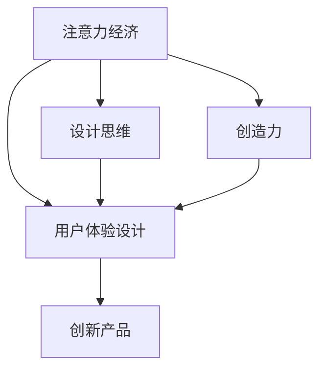

                 

# 注意力经济与用户体验设计思维：创建引人入胜、增强用户体验的产品

> 关键词：注意力经济,用户体验设计,设计思维,创造力,创新产品

## 1. 背景介绍

### 1.1 问题由来
在数字时代，随着互联网的普及和信息技术的不断发展，我们的注意力已成为一种稀缺资源。人们面对海量信息的冲击，已不再能被动接受，而是希望从中找到自己真正感兴趣和有价值的内容。基于这种背景，注意力经济应运而生。注意力经济强调如何吸引并保持用户的注意力，以便为他们提供更有价值的产品或服务。

与此同时，用户体验设计（User Experience Design, UX Design）作为一种全面提升产品竞争力的方式，其重要性日益凸显。好的用户体验不仅能够增强用户的满意度和忠诚度，还能促进产品的市场占有率和品牌影响力。因此，将注意力经济和用户体验设计相结合，已经成为现代企业追求持续增长和创新突破的关键。

### 1.2 问题核心关键点
注意力经济和用户体验设计思维的核心在于：如何通过创新和优化设计，让用户在享受产品的同时，也能够提升注意力和参与度。这不仅需要企业关注用户行为和心理，还需要通过技术手段提升产品互动性和个性化体验，最终实现用户价值的最大化。

本文将从多个角度深入探讨如何将注意力经济和用户体验设计思维融入产品创造，从而打造引人入胜、增强用户体验的创新产品。

## 2. 核心概念与联系

### 2.1 核心概念概述

为更好地理解注意力经济和用户体验设计思维的融合，本节将介绍几个密切相关的核心概念：

- **注意力经济**：指通过吸引用户注意力，提升产品或服务的价值和市场地位的经济模式。其核心在于如何设计有吸引力的内容、界面和交互方式，让用户愿意投入更多的时间和精力。

- **用户体验设计（UX Design）**：一门旨在通过用户研究、交互设计、原型制作等方法，提升产品可用性和满意度的学科。用户体验设计思维强调从用户视角出发，全面考虑产品功能、情感和行为等各方面因素，以提高用户参与度和满意度。

- **设计思维（Design Thinking）**：一种以人为本的创新方法论，强调通过用户研究、需求分析、原型设计和迭代测试等步骤，发现用户痛点和需求，从而创造更好的产品解决方案。设计思维强调以用户为中心的创新和问题解决。

- **创造力（Creativity）**：指通过新颖、独特的方式解决问题和创造价值的能力。在产品设计中，创造力是突破常规、创造差异化竞争优势的关键。

- **创新产品**：指通过创新的设计理念和技术手段，能够满足用户新需求、带来新体验的产品。创新产品不仅是功能上的突破，更在于设计上的独到之处。

这些核心概念之间的逻辑关系可以通过以下Mermaid流程图来展示：



这个流程图展示了几者之间的逻辑关系：

1. 注意力经济通过吸引用户注意力，为用户体验设计提供了基础。
2. 用户体验设计旨在提升用户满意度和参与度，是注意力经济的核心应用。
3. 设计思维指导用户体验设计，提升其科学性和系统性。
4. 创造力驱动设计思维，推动创新产品的创造。
5. 创新产品实现注意力经济和用户体验设计的效果。

这些概念共同构成了注意力经济和用户体验设计思维的完整框架，为产品设计提供了理论支撑和实践指导。

## 3. 核心算法原理 & 具体操作步骤
### 3.1 算法原理概述

将注意力经济和用户体验设计思维融入产品创造，本质上是一个跨学科的创新过程，涉及心理学、认知科学、人机交互等多个领域的知识。其核心在于：

- **用户研究与需求分析**：通过调查问卷、用户访谈、A/B测试等方法，深入了解用户行为和心理，找出其痛点和需求。
- **信息架构与交互设计**：设计直观、易用的信息结构和交互流程，提高用户的操作效率和满意度。
- **数据驱动的个性化体验**：利用用户行为数据，实现内容的个性化推荐和定制化展示，提升用户体验的粘性和参与度。
- **实时反馈与迭代优化**：通过用户反馈和数据分析，不断优化产品功能和服务质量，实现用户需求的动态匹配。

### 3.2 算法步骤详解

基于上述原理，一个典型的注意力经济和用户体验设计思维的应用流程可以大致分为以下几步：

1. **用户研究与需求分析**
   - 通过问卷调查、用户访谈等方法，收集用户的基本信息和需求数据。
   - 利用数据分析工具，如Google Analytics、Mixpanel等，分析用户行为和偏好。
   - 通过定性研究方法，如焦点小组讨论、用户日记等，深入理解用户的情感和动机。

2. **信息架构与交互设计**
   - 设计简洁明了的信息架构，将复杂的信息分解为易于理解和操作的小模块。
   - 进行交互设计的原型制作，如 wireframes、mockups、prototypes 等，进行多轮迭代优化。
   - 利用可用性测试和用户测试，评估和改进设计方案。

3. **数据驱动的个性化体验**
   - 利用机器学习算法，如协同过滤、内容推荐算法等，对用户进行个性化推荐。
   - 实现基于用户行为和偏好的动态内容展示，如推荐引擎、智能推送等。
   - 实施数据安全与隐私保护措施，确保用户数据的安全性和隐私性。

4. **实时反馈与迭代优化**
   - 通过用户反馈、数据分析等方式，持续收集用户对产品体验的反馈信息。
   - 根据反馈结果，对产品功能和服务质量进行迭代优化，不断提升用户体验。
   - 利用A/B测试等方法，比较不同设计方案的效果，选取最优方案。

### 3.3 算法优缺点

将注意力经济和用户体验设计思维融入产品创造的方法，具有以下优点：

- **用户中心**：通过深入了解用户需求和行为，设计符合用户心理和习惯的产品。
- **系统化**：遵循设计思维的方法论，将产品设计过程系统化，确保每一步都有科学依据。
- **数据驱动**：利用用户行为数据，实现个性化和动态化的用户体验。
- **持续优化**：通过实时反馈和迭代，不断提升产品功能和用户体验。

同时，该方法也存在一些局限性：

- **资源需求高**：需要大量用户数据和专业设计人员，初期投入成本较高。
- **技术复杂性**：涉及机器学习、数据科学等多个技术领域，对技术要求较高。
- **市场风险**：设计理念和技术手段的创新性较高，可能面临市场接受度不确定性。
- **隐私保护**：在数据驱动的个性化体验中，如何保护用户隐私，是一个重要的伦理和法律问题。

尽管如此，综合而言，将注意力经济和用户体验设计思维融入产品创造，无疑是提升产品竞争力和用户体验的有效手段。

### 3.4 算法应用领域

注意力经济和用户体验设计思维的应用领域非常广泛，以下是几个典型案例：

- **社交媒体平台**：如Facebook、Instagram等，通过精准推荐和个性化内容展示，提升用户黏性和参与度。
- **电子商务网站**：如Amazon、阿里巴巴等，通过数据分析和机器学习，实现商品推荐和购物路径优化，提升用户购买体验。
- **在线教育和培训**：如Coursera、Udemy等，通过个性化学习路径和实时反馈，提升用户学习效果和满意度。
- **医疗健康应用**：如MyFitnessPal、Fitbit等，通过用户行为分析，实现个性化健康建议和实时监控，提升用户健康管理体验。
- **金融服务**：如银行APP、支付平台等，通过数据分析和风险控制，提升用户金融服务体验和安全保障。

以上案例展示了注意力经济和用户体验设计思维在多个行业的应用前景，为产品设计提供了丰富的实践参考。

## 4. 数学模型和公式 & 详细讲解 & 举例说明

### 4.1 数学模型构建

在注意力经济和用户体验设计中，常用的数学模型包括协同过滤、协同训练、多臂老虎机（Multi-Armed Bandit）等。这些模型可以帮助我们对用户行为进行预测和优化，提升个性化体验的效果。

### 4.2 公式推导过程

以协同过滤算法为例，其基本原理是通过用户-物品评分矩阵，找到与目标用户偏好相似的用户，并根据相似用户对物品的评分，预测目标用户对物品的评分。协同过滤的数学模型可以表示为：

$$
\hat{r}_{ui} = \hat{\theta}_i^T\Phi(u)
$$

其中，$\hat{r}_{ui}$为目标用户$u$对物品$i$的预测评分，$\hat{\theta}_i$为物品$i$的潜在特征向量，$\Phi(u)$为目标用户$u$的潜在特征向量。

### 4.3 案例分析与讲解

假设我们有一个电影推荐系统，需要为用户推荐其可能感兴趣的影片。系统通过分析用户的观影历史和评分数据，利用协同过滤算法预测用户对未观看电影的评分。具体步骤如下：

1. 收集用户的历史观影数据和评分数据。
2. 将用户和电影分别映射为向量，并计算它们之间的相似度。
3. 根据相似度排序，选取最相似的K个用户。
4. 计算这些用户对电影的评分，并加权平均得到目标用户对电影的预测评分。
5. 根据预测评分，对电影进行排序并推荐给用户。

以下是一个简化的Python实现：

```python
from sklearn.metrics.pairwise import cosine_similarity
import numpy as np

# 假设我们有一个3个用户、5个电影的评分矩阵
user_item_matrix = np.array([
    [5, 4, 1, 2, 3],
    [2, 1, 5, 3, 4],
    [4, 3, 2, 1, 5]
])

# 计算用户-电影之间的余弦相似度
user_similarity = cosine_similarity(user_item_matrix)

# 选取与目标用户相似度最高的K个用户
target_user_index = 0
K = 2
similar_user_indices = np.argsort(user_similarity[target_user_index])[::-1][:K]
similar_user_matrix = user_item_matrix[similar_user_indices]

# 计算这些用户对电影的评分，并加权平均得到目标用户对电影的预测评分
item_ratings = np.mean(similar_user_matrix, axis=0)

# 对电影进行排序并推荐给用户
movie_ratings = list(enumerate(item_ratings))
movie_ratings.sort(key=lambda x: x[1], reverse=True)
recommended_movies = [movie[0] for movie in movie_ratings[:5]]
print(recommended_movies)
```

## 5. 项目实践：代码实例和详细解释说明
### 5.1 开发环境搭建

在进行注意力经济和用户体验设计思维的实践前，我们需要准备好开发环境。以下是使用Python进行开发的环境配置流程：

1. 安装Anaconda：从官网下载并安装Anaconda，用于创建独立的Python环境。

2. 创建并激活虚拟环境：
```bash
conda create -n attention-economy python=3.8 
conda activate attention-economy
```

3. 安装PyTorch、Scikit-learn等库：
```bash
conda install pytorch torchvision torchaudio scikit-learn
```

4. 安装Flask、Streamlit等Web开发库：
```bash
conda install flask streamlit
```

5. 安装Jupyter Notebook：
```bash
conda install jupyter notebook
```

6. 安装Python中的机器学习库和数据科学库：
```bash
conda install pandas numpy matplotlib seaborn scikit-learn
```

完成上述步骤后，即可在`attention-economy`环境中开始实践。

### 5.2 源代码详细实现

接下来，我们将以社交媒体平台为例，展示如何使用Python和Flask实现一个简单的推荐系统。

首先，我们需要定义一个简单的推荐算法：

```python
import pandas as pd
import numpy as np
from sklearn.metrics.pairwise import cosine_similarity

# 假设我们有一个3个用户、5个电影的评分矩阵
user_item_matrix = pd.DataFrame({
    'user': ['A', 'B', 'C'],
    'item': ['1', '2', '3', '4', '5'],
    'score': [5, 4, 1, 2, 3]
})

# 计算用户-电影之间的余弦相似度
user_similarity = cosine_similarity(user_item_matrix.pivot_table(values='score', index='user', columns='item'))

# 选取与目标用户相似度最高的K个用户
target_user_index = 0
K = 2
similar_user_indices = np.argsort(user_similarity[target_user_index])[::-1][:K]
similar_user_matrix = user_item_matrix.pivot_table(values='score', index='item', columns='user')[similar_user_indices]

# 计算这些用户对电影的评分，并加权平均得到目标用户对电影的预测评分
item_ratings = np.mean(similar_user_matrix, axis=0)

# 对电影进行排序并推荐给用户
movie_ratings = list(enumerate(item_ratings))
movie_ratings.sort(key=lambda x: x[1], reverse=True)
recommended_movies = [movie[0] for movie in movie_ratings[:5]]
print(recommended_movies)
```

然后，我们将使用Flask和Streamlit搭建一个简单的Web应用，将推荐结果展示给用户：

```python
from flask import Flask, render_template
from streamlit import Streamlit

app = Flask(__name__)

@app.route('/')
def home():
    return render_template('index.html')

@app.route('/recommend')
def recommend():
    user_item_matrix = pd.DataFrame({
        'user': ['A', 'B', 'C'],
        'item': ['1', '2', '3', '4', '5'],
        'score': [5, 4, 1, 2, 3]
    })
    user_similarity = cosine_similarity(user_item_matrix.pivot_table(values='score', index='user', columns='item'))
    target_user_index = 0
    K = 2
    similar_user_indices = np.argsort(user_similarity[target_user_index])[::-1][:K]
    similar_user_matrix = user_item_matrix.pivot_table(values='score', index='item', columns='user')[similar_user_indices]
    item_ratings = np.mean(similar_user_matrix, axis=0)
    movie_ratings = list(enumerate(item_ratings))
    movie_ratings.sort(key=lambda x: x[1], reverse=True)
    recommended_movies = [movie[0] for movie in movie_ratings[:5]]
    return render_template('recommend.html', recommended_movies=recommended_movies)

if __name__ == '__main__':
    app.run(debug=True)
```

最后，我们还需要在`templates`文件夹中创建两个HTML模板：`index.html`和`recommend.html`。

`index.html`的内容：

```html
<!DOCTYPE html>
<html>
    <head>
        <title>社交媒体推荐系统</title>
    </head>
    <body>
        <h1>欢迎使用社交媒体推荐系统</h1>
        <a href="/recommend">开始推荐</a>
    </body>
</html>
```

`recommend.html`的内容：

```html
<!DOCTYPE html>
<html>
    <head>
        <title>社交媒体推荐系统</title>
    </head>
    <body>
        <h1>推荐结果</h1>
        <ul>
            
                <li>{{ movie }}</li>
            
        </ul>
    </body>
</html>
```

运行应用后，在浏览器中输入`http://localhost:5000`，即可看到推荐结果。

### 5.3 代码解读与分析

以下是关键代码的实现细节：

**推荐算法**：
- 首先，我们定义了一个简单的用户-物品评分矩阵`user_item_matrix`，其中包含3个用户和5个电影的评分。
- 使用`pivot_table`方法，将评分矩阵转换为用户-电影评分矩阵`user_item_matrix`。
- 利用`cosine_similarity`方法计算用户-电影之间的余弦相似度`user_similarity`。
- 选取与目标用户相似度最高的K个用户`similar_user_matrix`。
- 计算这些用户对电影的评分，并加权平均得到目标用户对电影的预测评分`item_ratings`。
- 对电影进行排序并推荐给用户`recommended_movies`。

**Web应用**：
- 我们使用Flask和Streamlit搭建了一个简单的Web应用，包含两个路由`/`和`/recommend`。
- 在`/`路由中，我们展示欢迎界面。
- 在`/recommend`路由中，我们使用推荐算法计算推荐结果，并将其传递给`recommend.html`模板。
- 在`recommend.html`模板中，我们展示推荐结果，用户可以看到最推荐的5部电影。

通过这个简单的例子，我们可以看到如何利用注意力经济和用户体验设计思维，将推荐算法和Web应用结合起来，提升用户的使用体验和满意度。

## 6. 实际应用场景
### 6.1 智能推荐系统
智能推荐系统是注意力经济和用户体验设计思维的重要应用场景。通过分析用户行为和偏好，实时推荐个性化内容，可以有效提升用户参与度和满意度。

在实际应用中，智能推荐系统广泛应用于电商、新闻、视频、音乐等领域。例如，Amazon、Netflix等平台通过推荐引擎，为每个用户提供个性化商品、影片和音乐推荐。用户通过这些推荐发现更多感兴趣的内容，平台也通过用户反馈不断优化推荐算法，提升用户满意度。

### 6.2 个性化学习平台
个性化学习平台通过分析用户的学习行为和知识水平，推荐符合用户需求的学习内容和学习路径，提升学习效果和用户体验。

例如，Khan Academy、Coursera等在线学习平台通过推荐引擎，为用户推荐个性化的课程和学习资源。用户可以根据推荐内容，快速找到感兴趣的学习材料，提升学习效率和兴趣。

### 6.3 医疗健康应用
医疗健康应用通过分析用户健康数据和行为，提供个性化的健康建议和干预措施，提升用户健康管理体验。

例如，MyFitnessPal、Fitbit等健康应用通过分析用户日常活动数据，推荐个性化的饮食、运动建议。用户通过这些建议，改善生活习惯，提升健康水平。

### 6.4 金融服务
金融服务通过分析用户消费行为和信用记录，提供个性化的金融服务和产品，提升用户满意度和忠诚度。

例如，银行APP通过推荐引擎，为每个用户推荐个性化的金融产品和服务。用户通过这些推荐，找到符合自己需求的服务，提升金融体验和效率。

### 6.5 社交媒体
社交媒体通过分析用户互动行为和兴趣，推荐个性化的内容和服务，提升用户黏性和参与度。

例如，Facebook、Twitter等社交平台通过推荐引擎，为用户推荐个性化的内容、好友和活动。用户通过这些推荐，找到感兴趣的内容和互动对象，提升社交体验。

### 6.6 智能家居
智能家居通过分析用户行为和偏好，提供个性化的家居控制和服务，提升用户生活品质和便利性。

例如，Google Home、Amazon Alexa等智能家居设备通过推荐引擎，为用户推荐个性化的音乐、天气、新闻等服务。用户通过这些推荐，提升生活品质和便利性。

### 6.7 虚拟现实和增强现实
虚拟现实和增强现实通过分析用户行为和偏好，提供个性化的虚拟体验和服务，提升用户沉浸感和体验效果。

例如，Oculus Rift、Google Glass等VR/AR设备通过推荐引擎，为用户推荐个性化的虚拟场景和游戏。用户通过这些推荐，找到感兴趣的内容，提升虚拟体验。

### 6.8 未来应用展望

随着技术的发展和应用场景的拓展，未来基于注意力经济和用户体验设计思维的产品将更加丰富和多样化。以下是几个未来应用展望：

1. **情感计算**：通过分析用户的情感状态，提供个性化的情感支持和干预措施，提升用户情感体验。

2. **健康管理和个性化医疗**：通过分析用户的健康数据，提供个性化的健康建议和治疗方案，提升用户健康管理效果。

3. **智能城市和智慧交通**：通过分析城市和交通数据，提供个性化的出行和城市服务，提升城市管理效率和居民生活品质。

4. **教育科技和虚拟教室**：通过分析学生的学习行为和兴趣，提供个性化的教育内容和教学路径，提升学习效果和用户体验。

5. **智能农业和智慧农场**：通过分析农业数据，提供个性化的农业服务和产品，提升农业生产效率和农民生活质量。

6. **智能物流和供应链管理**：通过分析物流和供应链数据，提供个性化的物流服务和产品，提升供应链效率和客户满意度。

7. **智能安全和人身安全**：通过分析用户的行踪和行为，提供个性化的安全支持和防护措施，提升人身安全保障。

8. **智能环境监测和管理**：通过分析环境数据，提供个性化的环境监测和管理服务，提升环境保护和治理效果。

## 7. 工具和资源推荐
### 7.1 学习资源推荐

为了帮助开发者系统掌握注意力经济和用户体验设计思维的理论基础和实践技巧，这里推荐一些优质的学习资源：

1. **《用户体验设计：让产品更好》（Don Norman, 2004）**：经典的用户体验设计著作，涵盖用户研究、设计原则、可用性测试等多个方面。
2. **《设计思维手册》（Thomas Horridge, 2014）**：介绍设计思维方法和工具的实用指南，适合设计师和产品经理参考。
3. **《用户行为设计：构建更好的产品》（Terence Whitelaw, 2009）**：介绍用户行为设计和A/B测试的实用书籍，帮助设计团队提高产品决策的科学性和精确性。
4. **《机器学习实战》（Peter Harrington, 2015）**：介绍机器学习算法和工具的实用书籍，适合初学者和中级开发者参考。
5. **《推荐系统实践》（Christopher Kiefer, 2017）**：介绍推荐系统算法和实践的实用书籍，适合推荐系统开发者参考。
6. **《设计心理学》（Don Norman, 2013）**：介绍设计心理学和用户体验设计的实用书籍，适合设计师和产品经理参考。
7. **《数据科学实战》（Joel Grus, 2015）**：介绍数据科学和机器学习实战的实用书籍，适合数据科学家和工程师参考。

通过对这些资源的学习实践，相信你一定能够快速掌握注意力经济和用户体验设计思维的精髓，并用于解决实际的NLP问题。

### 7.2 开发工具推荐

高效的开发离不开优秀的工具支持。以下是几款用于注意力经济和用户体验设计思维开发的工具：

1. **Jupyter Notebook**：支持Python和R等多种语言，集成了代码执行、数据可视化、注释等特性，适合数据科学和机器学习开发者使用。
2. **Flask**：基于Python的Web框架，简单易用，适合构建轻量级Web应用。
3. **Streamlit**：基于Python的Web开发库，适合快速构建交互式Web应用，支持数据可视化、交互式图表等特性。
4. **Kaggle**：数据科学和机器学习竞赛平台，提供海量数据集和竞赛项目，适合数据科学爱好者和竞赛选手参考。
5. **Tableau**：数据可视化工具，支持复杂的数据分析和数据可视化，适合数据科学家和商业分析师使用。
6. **Sketch**：用户界面设计工具，支持原型设计和交互式预览，适合设计师和UI/UX设计师使用。
7. **Adobe XD**：用户体验设计工具，支持原型设计、用户研究和可用性测试，适合设计师和产品经理使用。
8. **Rapid Prototyping Tools**：快速原型设计工具，如InVision、Axure、Sketch等，适合UI/UX设计师和产品经理使用。

合理利用这些工具，可以显著提升注意力经济和用户体验设计思维的开发效率，加快创新迭代的步伐。

### 7.3 相关论文推荐

注意力经济和用户体验设计思维的发展源于学界的持续研究。以下是几篇奠基性的相关论文，推荐阅读：

1. **《用户行为分析与个性化推荐》（Joachim Pfeiffer, 2010）**：介绍用户行为分析和个性化推荐的基本理论和算法，适合推荐系统开发者参考。
2. **《设计思维：创造用户价值》（Tim Brown, 2009）**：介绍设计思维方法和工具的实用指南，适合设计师和产品经理参考。
3. **《情感计算：机器对人类情感的计算和设计》（Pamela M. Wheeler, 2005）**：介绍情感计算的基本理论和实践，适合情感计算开发者参考。
4. **《用户界面设计原则》（Nigel Cross, 2012）**：介绍用户界面设计原则和实践的实用指南，适合UI/UX设计师参考。
5. **《推荐系统：算法与实现》（Jian Zhang, 2014）**：介绍推荐系统算法和实现的实用指南，适合推荐系统开发者参考。
6. **《个性化学习：用户模型与推荐系统》（Yang Zhang, 2018）**：介绍个性化学习和推荐系统的基本理论和算法，适合个性化学习开发者参考。

这些论文代表了大语言模型微调技术的发展脉络。通过学习这些前沿成果，可以帮助研究者把握学科前进方向，激发更多的创新灵感。

## 8. 总结：未来发展趋势与挑战

### 8.1 研究成果总结

本文对注意力经济和用户体验设计思维进行了全面系统的介绍。首先阐述了注意力经济和用户体验设计思维的背景和意义，明确了两者在提升产品竞争力和用户体验方面的独特价值。其次，从原理到实践，详细讲解了如何将注意力经济和用户体验设计思维融入产品创造，从而打造引人入胜、增强用户体验的创新产品。最后，本文还探讨了注意力经济和用户体验设计思维的应用场景和未来展望，为产品设计提供了丰富的实践参考。

通过本文的系统梳理，可以看到，注意力经济和用户体验设计思维在提升产品竞争力和用户体验方面具有重要意义，是大语言模型微调技术的重要组成部分。未来，随着技术的不断发展，这些理论和方法将不断融入更多的应用场景，为人工智能技术带来新的突破和机遇。

### 8.2 未来发展趋势

展望未来，注意力经济和用户体验设计思维的发展趋势如下：

1. **数据驱动的个性化体验**：随着数据技术的不断进步，用户行为数据的获取和处理将更加高效和精准。通过分析用户行为数据，可以提供更加个性化的内容和服务，提升用户体验。
2. **实时化的推荐系统**：实时推荐系统将成为未来的主流方向，通过实时分析用户行为和偏好，提供动态化的推荐内容，提升用户参与度和满意度。
3. **多模态的交互体验**：未来的用户体验设计将更多地融合多模态交互方式，如语音、手势、虚拟现实等，提供更加丰富和沉浸式的用户体验。
4. **人工智能和人类协作**：未来的用户体验设计将更多地融合人工智能技术和人类协作，通过智能推荐、情感计算等方式，提升用户体验和满意度。
5. **跨学科的融合创新**：未来的用户体验设计将更多地融合心理学、社会学、认知科学等多个学科的知识，提供更加全面和深入的解决方案。
6. **伦理和隐私保护**：未来的用户体验设计将更多地关注伦理和隐私保护，确保用户数据的安全性和隐私性。
7. **全球化的用户体验**：未来的用户体验设计将更多地关注全球化，通过文化差异和用户需求的分析，提供更加本地化的解决方案。

这些趋势展示了注意力经济和用户体验设计思维的未来发展方向，为产品设计提供了丰富的想象空间。

### 8.3 面临的挑战

尽管注意力经济和用户体验设计思维在产品设计中具有重要意义，但在实践中仍面临诸多挑战：

1. **数据隐私和安全**：在数据驱动的个性化体验中，如何保护用户隐私和数据安全，是一个重要的伦理和法律问题。
2. **算力成本**：大规模数据处理和实时推荐系统需要强大的算力支持，成本较高。如何优化算法和提高计算效率，是一个重要的技术挑战。
3. **用户体验的多样性**：不同用户群体有不同的需求和偏好，如何设计普适的用户体验，是一个复杂的技术和市场挑战。
4. **算法公平性**：推荐算法和个性化服务可能存在算法偏见，如何确保算法的公平性和透明性，是一个重要的伦理和法律问题。
5. **用户隐私保护**：在个性化推荐中，如何确保用户的隐私保护，避免数据滥用和信息泄露，是一个重要的技术挑战。
6. **跨学科协作**：用户体验设计需要多学科的协作和知识整合，如何协调不同学科的专家，是一个重要的组织和团队挑战。

这些挑战凸显了注意力经济和用户体验设计思维在实践中的复杂性和挑战性，需要更多的研究和实践来解决。

### 8.4 研究展望

面对注意力经济和用户体验设计思维所面临的诸多挑战，未来的研究需要在以下几个方面寻求新的突破：

1. **数据隐私保护技术**：开发更加高效和安全的隐私保护技术，确保用户数据的安全性和隐私性。
2. **实时算法优化**：研究优化实时推荐算法，提升计算效率和准确性，降低算力成本。
3. **跨学科协作机制**：建立跨学科的协作机制，促进不同学科的专家和团队协同合作。
4. **用户体验的普适性**：研究设计普适的用户体验，确保不同用户群体都能获得良好的体验。
5. **算法公平性和透明性**：研究算法公平性和透明性，确保推荐算法的公平性和透明性。
6. **用户体验的伦理和法律框架**：制定用户体验设计的伦理和法律框架，确保用户体验设计的合法性和道德性。
7. **用户体验设计的全球化**：研究全球化的用户体验设计，提供更加本地化的解决方案。

这些研究方向展示了未来在注意力经济和用户体验设计思维领域的研究重点，为产品设计提供了丰富的理论支撑和实践指导。

## 9. 附录：常见问题与解答

**Q1：如何设计一个有效的个性化推荐系统？**

A: 设计一个有效的个性化推荐系统需要从多个方面进行考虑：

1. 数据收集和处理：收集用户行为数据，如浏览记录、购买记录、评分数据等。处理数据，如数据清洗、归一化、特征工程等。
2. 算法选择和优化：选择合适的推荐算法，如协同过滤、协同训练、深度学习等。优化算法，如调整超参数、引入正则化等。
3. 模型评估和反馈：评估推荐系统的性能，如准确率、召回率、覆盖率等。收集用户反馈，优化推荐算法。
4. 数据安全和隐私保护：确保用户数据的安全性和隐私性，采用加密、脱敏等技术。

通过以上步骤，可以设计出高效的个性化推荐系统。

**Q2：如何在用户体验设计中融入设计思维？**

A: 在用户体验设计中融入设计思维需要以下几个步骤：

1. 用户研究：通过调查问卷、用户访谈、A/B测试等方法，深入了解用户需求和行为。
2. 用户旅程绘制：绘制用户旅程图，明确用户在整个产品使用过程中的体验路径和痛点。
3. 原型设计和迭代：制作原型，进行多轮迭代优化。通过用户测试，收集反馈信息，优化设计方案。
4. 用户体验评估：采用可用性测试、满意度调查等方法，评估用户体验效果。
5. 持续改进：根据用户反馈和数据分析，持续改进设计方案，提升用户体验。

通过以上步骤，可以设计出符合用户需求和行为的用户体验，提升用户满意度和参与度。

**Q3：如何在设计中保护用户隐私？**

A: 保护用户隐私需要以下几个方面进行考虑：

1. 数据最小化：只收集必要的数据，避免过度收集。
2. 匿名化处理：对用户数据进行匿名化处理，确保用户数据的安全性。
3. 加密技术：采用加密技术，保护用户数据在传输和存储过程中的安全。
4. 隐私政策：制定透明的隐私政策，告知用户数据的使用方式和保护措施。
5. 用户控制：赋予用户控制权，如选择数据共享、修改隐私设置等。

通过以上措施，可以保护用户隐私，确保用户数据的安全性和隐私性。

**Q4：如何实现个性化学习平台的推荐引擎？**

A: 实现个性化学习平台的推荐引擎需要以下几个步骤：

1. 数据收集和处理：收集学生的学习行为数据，如课程完成情况、成绩记录、阅读记录等。处理数据，如数据清洗、归一化、特征工程等。
2. 算法选择和优化：选择合适的推荐算法，如协同过滤、协同训练、深度学习等。优化算法，如调整超参数、引入正则化等。
3. 模型评估和反馈：评估推荐系统的性能，如准确率、召回率、覆盖率等。收集学生反馈，优化推荐算法。
4. 数据安全和隐私保护：确保学生数据的安全性和隐私性，采用加密、脱敏等技术。
5. 个性化学习路径设计：根据推荐结果，设计个性化的学习路径，提升学习效果和用户体验。

通过以上步骤，可以设计出高效的个性化学习平台推荐引擎。

**Q5：如何在社交媒体平台上实现智能推荐？**

A: 在社交媒体平台上实现智能推荐需要以下几个步骤：

1. 数据收集和处理：收集用户互动数据，如点赞、评论、分享等。处理数据，如数据清洗、归一化、特征工程等。
2. 算法选择和优化：选择合适的推荐算法，如协同过滤、协同训练、深度学习等。优化算法，如调整超参数、引入正则化等。
3. 模型评估和反馈：评估推荐系统的性能，如准确率、召回率、覆盖率等。收集用户反馈，优化推荐算法。
4. 数据安全和隐私保护：确保用户数据的安全性和隐私性，采用加密、脱敏等技术。
5. 实时推荐系统设计：设计实时推荐系统，根据用户实时行为进行动态推荐。

通过以上步骤，可以实现高效的智能推荐系统，提升用户参与度和满意度。

**Q6：如何在医疗健康应用中实现个性化健康建议？**

A: 在医疗健康应用中实现个性化健康建议需要以下几个步骤：

1. 数据收集和处理：收集用户的健康数据，如运动数据、饮食数据、睡眠数据等。处理数据，如数据清洗、归一化、特征工程等。
2. 算法选择和优化：选择合适的推荐算法，如协同过滤、协同训练、深度学习等。优化算法，如调整超参数、引入正则化等。
3. 模型评估和反馈：评估推荐系统的性能，如准确率、召回率、覆盖率等。收集用户反馈，优化推荐算法。
4. 数据安全和隐私保护：确保用户数据的安全性和隐私性，采用加密、脱敏等技术。
5. 个性化健康建议设计：根据推荐结果，设计个性化的健康建议，提升用户健康管理效果。

通过以上步骤，可以设计出高效的个性化健康建议系统。

**Q7：如何在金融服务中实现个性化金融产品推荐？**

A: 在金融服务中实现个性化金融产品推荐需要以下几个步骤：

1. 数据收集和处理：收集用户的消费行为数据，如购买记录、交易记录等。处理数据，如数据清洗、归一化、特征工程等。
2. 算法选择和优化：选择合适的推荐算法，如协同过滤、协同训练、深度学习等。优化算法，如调整超参数、引入正则化等。
3. 模型评估和反馈：评估推荐系统的性能，如准确率、召回率、覆盖率等。收集用户反馈，优化推荐算法。
4. 数据安全和隐私保护：确保用户数据的安全性和隐私性，采用加密、脱敏等技术。
5. 个性化金融产品推荐设计：根据推荐结果，设计个性化的金融产品推荐，提升用户金融服务体验。

通过以上步骤，可以设计出高效的个性化金融产品推荐系统。

**Q8：如何在智能家居中实现个性化控制和服务？**

A: 在智能家居中实现个性化控制和服务需要以下几个步骤：

1. 数据收集和处理：收集用户的行踪数据、行为数据等。处理数据，如数据清洗、归一化、特征工程等。
2. 算法选择和优化：选择合适的推荐算法，如协同过滤、协同训练、深度学习等。优化算法，如调整超参数、引入正则化等。
3. 模型评估和反馈：评估推荐系统的性能，如准确率、召回率、覆盖率等。收集用户反馈，优化推荐算法。
4. 数据安全和隐私保护：确保用户数据的安全性和隐私性，采用加密、脱敏等技术。
5. 个性化控制和服务设计：根据推荐结果，设计个性化的控制和服务，提升用户生活品质和便利性。

通过以上步骤，可以设计出高效的个性化控制和服务系统。

**Q9：如何在虚拟现实和增强现实中实现个性化虚拟体验？**

A: 在虚拟现实和增强现实中实现个性化虚拟体验需要以下几个步骤：

1. 数据收集和处理：收集用户的虚拟行为数据，如游戏行为数据、虚拟互动数据等。处理数据，如数据清洗、归一化、特征工程等。
2. 算法选择和优化：选择合适的推荐算法，如协同过滤、协同训练、深度学习等。优化算法，如调整超参数、引入正则化等。
3. 模型评估和反馈：评估推荐系统的性能，如准确率、召回率、覆盖率等。收集用户反馈，优化推荐算法。
4. 数据安全和隐私保护：确保用户数据的安全性和隐私性，采用加密、脱敏等技术。
5. 个性化虚拟体验设计：根据推荐结果，设计个性化的虚拟体验，提升用户沉浸感和体验效果。

通过以上步骤，可以设计出高效的个性化虚拟体验系统。

---

作者：禅与计算机程序设计艺术 / Zen and the Art of Computer Programming

