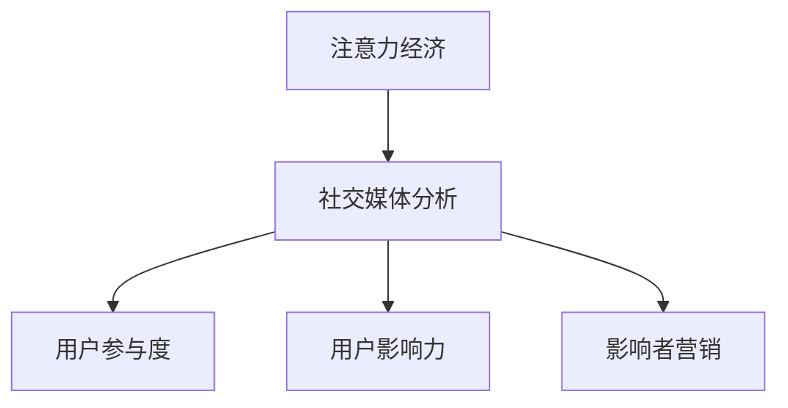

                 

# 注意力经济与社交媒体分析：了解受众参与度和影响力的秘诀

## 1. 背景介绍

在数字化时代，数据成为一种宝贵的资源，吸引了越来越多的关注和投入。注意力经济(Anti-infrance Economy)，即以用户注意力为商品的经济活动，正在迅速崛起。社交媒体平台作为注意力经济的重要承载体，通过吸引、集中和传播用户注意力，实现商业模式创新和价值增值。在社交媒体分析中，如何精确度量用户的参与度和影响力，是每个运营者、营销者和研究者必须解答的问题。

本文旨在通过探讨注意力经济和社交媒体分析的关键技术，帮助读者深入理解受众参与度和影响力的衡量方法，掌握社交媒体平台上数据驱动决策的秘诀。

## 2. 核心概念与联系

### 2.1 核心概念概述

为更好地理解社交媒体分析的原理，本节将介绍几个密切相关的核心概念：

- 注意力经济：以用户注意力为商品的商业模式，通过优化注意力获取和分配，实现商业价值的最大化。
- 社交媒体分析：通过对社交媒体数据进行采集、处理和分析，衡量用户的参与度和影响力，指导内容生产和运营策略。
- 用户参与度：用户与社交媒体平台互动的频率和深度，常以点击率、浏览时间、评论数、分享数等指标度量。
- 用户影响力：用户在社交媒体平台上的话语权和传播力，通常通过粉丝数量、关注度、转发率、点赞数等指标衡量。
- 影响者营销：利用社交媒体上的意见领袖或明星的影响力，进行品牌推广和产品营销。

这些概念之间的逻辑关系可以通过以下Mermaid流程图来展示：



这个流程图展示出注意力经济、社交媒体分析、用户参与度、用户影响力和影响者营销之间的相互联系：注意力经济提供商业价值基础，社交媒体分析通过数据驱动决策，用户参与度和影响力是衡量关注度、互动频率的指标，而影响者营销则是通过聚焦个体影响力实现商业目的的一种重要手段。

## 3. 核心算法原理 & 具体操作步骤
### 3.1 算法原理概述

社交媒体分析的核心是度量用户参与度和影响力，这通常涉及多维度的数据分析和建模。其核心思想是：

1. **用户行为分析**：通过对用户的点击、浏览、互动等行为数据进行统计和分析，量化用户的参与度。
2. **网络结构分析**：分析用户之间的关系网络，识别出意见领袖和影响者，量化其影响力。
3. **影响传播分析**：通过追踪信息在社交媒体上的传播路径，量化消息的扩散效果和影响范围。

这些分析过程通常使用机器学习和数据挖掘技术，构建相应的数学模型和算法。

### 3.2 算法步骤详解

社交媒体分析的算法步骤一般包括以下几个关键环节：

**Step 1: 数据采集与预处理**
- 使用API或其他手段从社交媒体平台获取原始数据。
- 对数据进行清洗、去重、格式转换等预处理操作，确保数据的质量和可用性。

**Step 2: 用户行为分析**
- 计算每个用户的点击率、浏览时间、互动频率等行为指标。
- 通过时间序列分析、时间分段统计等方式，评估用户行为随时间的变化趋势。

**Step 3: 网络结构分析**
- 构建社交网络图，包括用户-用户连接关系、用户-内容连接关系等。
- 使用中心性度量算法（如PageRank、HITS等），识别出社交网络中的核心用户（意见领袖、影响者）。

**Step 4: 影响传播分析**
- 使用图神经网络（Graph Neural Network, GNN）等模型，追踪信息在社交网络上的传播路径。
- 计算信息的传播速度、扩散范围、影响力大小等指标。

**Step 5: 模型优化与评估**
- 根据实际需求，构建用户参与度和影响力评估模型，如多层次感知机模型、序列化聚类模型等。
- 使用交叉验证、A/B测试等方法，评估模型的预测性能和应用效果。

**Step 6: 可视化与报告**
- 使用可视化工具（如Tableau、Power BI等），将分析结果以图表、报表形式呈现。
- 结合业务需求，编写详细分析报告，提出改进策略和运营建议。

### 3.3 算法优缺点

社交媒体分析的优势在于：

1. 全面客观：通过对大规模数据进行量化分析，能够全面、客观地评估用户参与度和影响力。
2. 实时动态：借助实时数据采集和处理技术，能够及时捕捉用户行为和市场动态，快速调整策略。
3. 精细定位：通过精细化的数据分析，能够识别出关键影响者和意见领袖，进行针对性营销。

其劣势在于：

1. 数据质量问题：社交媒体数据可能存在噪声、缺失、偏差等问题，影响分析结果的准确性。
2. 用户隐私风险：在获取和分析用户数据时，可能涉及用户隐私保护的问题，需谨慎处理。
3. 复杂度较高：社交网络结构和信息传播路径复杂多变，建模难度较大。
4. 资源消耗大：大规模数据分析需要高性能计算资源，对算力、存储等资源需求较高。

尽管存在这些局限性，社交媒体分析仍然是大数据时代的重要技术手段，通过科学的模型和算法，可以有效提升用户参与度和影响力的度量精度，为社交媒体平台的运营和营销提供强有力的决策支撑。

### 3.4 算法应用领域

社交媒体分析技术在多个领域中得到了广泛的应用，例如：

- 营销推广：通过分析用户参与度和影响力，指导精准营销和广告投放。
- 内容优化：衡量内容的受欢迎程度，指导内容生产策略和改进方案。
- 风险管理：识别出潜在的负面信息和网络舆情，进行风险预警和应急处理。
- 用户研究：分析用户行为和心理特征，进行用户画像构建和市场细分。
- 平台优化：评估平台的用户粘性、活跃度等关键指标，优化平台功能和用户体验。

这些应用场景凸显了社交媒体分析的广泛价值，为社交媒体平台的健康发展和用户价值的提升提供了科学依据。

## 4. 数学模型和公式 & 详细讲解  
### 4.1 数学模型构建

社交媒体分析的数学模型主要包括以下几个方面：

- **用户行为模型**：定义用户行为特征，如点击率、浏览时间、互动频率等。
- **社交网络模型**：描述用户之间的关系，如好友关系、关注关系等。
- **信息传播模型**：刻画信息在网络中的传播路径和影响范围。

以用户行为模型为例，设 $X$ 为用户的点击行为，$Y$ 为用户的浏览时间，则模型的目标函数可以表示为：

$$
f(X,Y) = \frac{X}{X+Y} + \frac{Y}{X+Y} = 1
$$

这里，点击率 $X$ 和浏览时间 $Y$ 被定义为两个独立特征，通过计算这两个特征的加权平均值，评估用户的参与度。

### 4.2 公式推导过程

以用户影响力计算为例，PageRank算法是评估网络中心性的经典方法。PageRank算法的核心思想是：一个节点的影响力由所有指向它的节点影响力之和决定。假设社交网络 $G(V,E)$ 中，节点 $v$ 的入度为 $d_{in}(v)$，指向节点 $v$ 的节点集合为 $N(v)$，则节点 $v$ 的PageRank值 $R(v)$ 可以表示为：

$$
R(v) = \frac{1}{d_{in}(v)} \sum_{u \in N(v)} \frac{R(u)}{c(u)}
$$

其中 $c(u)$ 为节点 $u$ 的PageRank值，$d_{in}(v)$ 为节点 $v$ 的入度。通过迭代计算，直到收敛，得到所有节点的PageRank值。

### 4.3 案例分析与讲解

假设某电商平台希望通过社交媒体分析，评估其用户参与度和影响力。

首先，通过API获取用户行为数据，包括点击、浏览、购买等行为，并进行数据清洗和预处理。然后，构建社交网络图，包括用户之间的好友关系、关注关系等，并使用PageRank算法识别出社交网络中的核心用户。

接下来，通过图神经网络（GNN）追踪信息在社交网络上的传播路径，计算信息的传播速度和扩散范围。最后，构建用户参与度和影响力评估模型，如多层次感知机模型，并使用交叉验证评估模型性能。

## 5. 项目实践：代码实例和详细解释说明
### 5.1 开发环境搭建

在进行社交媒体分析项目前，我们需要准备好开发环境。以下是使用Python进行Scikit-learn和GNN开发的开发环境配置流程：

1. 安装Anaconda：从官网下载并安装Anaconda，用于创建独立的Python环境。

2. 创建并激活虚拟环境：
```bash
conda create -n social-analyse python=3.8 
conda activate social-analyse
```

3. 安装Scikit-learn：
```bash
conda install scikit-learn
```

4. 安装Graph Neural Network库：
```bash
pip install pyg
```

5. 安装各类工具包：
```bash
pip install numpy pandas scikit-learn matplotlib tqdm jupyter notebook ipython
```

完成上述步骤后，即可在`social-analyse`环境中开始社交媒体分析项目的开发。

### 5.2 源代码详细实现

下面我们以社交网络分析为例，给出使用Scikit-learn和Graph Neural Network库进行社交网络分析的Python代码实现。

```python
import networkx as nx
import numpy as np
from sklearn.preprocessing import normalize
from pyg import DGLGraph

# 构建社交网络图
G = nx.karate_club_graph()
edge_labels = {(u, v): 'friend' if v in G.neighbors(u) else 'not friend' for u, v in G.edges()}

# 将社交网络图转换为Pyg图
dgl_G = DGLGraph(nx.to_scipy_sparse_matrix(G), edge_labels=edge_labels)

# 使用PageRank算法计算中心性
dgl_G.page_rank(normalize=True, alpha=0.85, max_iter=100, tol=1e-5)

# 获取中心性最高的节点（影响者）
influencers = np.argsort(dgl_G.page_rank())[::-1]
```

以上代码实现了从社交网络图到Pyg图的转换，并使用PageRank算法计算社交网络中的核心节点（影响者）。

### 5.3 代码解读与分析

让我们再详细解读一下关键代码的实现细节：

**构建社交网络图**：
- 使用NetworkX库的Karate Club数据集，构建社交网络图。
- 定义社交网络中的边标签，标记好友关系和普通关系。

**转换为Pyg图**：
- 使用Pyg库的DGLGraph函数，将NetworkX图转换为Pyg图。
- 将社交网络图的邻接矩阵转换为稀疏矩阵形式，方便后续的图神经网络处理。

**PageRank算法**：
- 使用Pyg库的page_rank函数，对社交网络图进行PageRank算法计算。
- 设置算法参数，如最大迭代次数、收敛阈值等。
- 使用sklearn库的normalize函数对计算结果进行归一化处理。

**获取影响者**：
- 使用numpy库的argsort函数，根据PageRank值对节点排序，获取中心性最高的节点，即影响者。

可以看到，通过将NetworkX图转换为Pyg图，并使用PageRank算法，我们能够高效地识别出社交网络中的核心用户（影响者）。

## 6. 实际应用场景
### 6.1 社交媒体广告投放

社交媒体广告投放是社交媒体分析的重要应用场景之一。通过分析用户参与度和影响力，可以识别出对广告投放效果有显著影响的核心用户，进行精准广告投放，提高广告效果和ROI。

例如，某电商平台希望通过Facebook广告推广新品。通过社交媒体分析，可以获取Facebook用户的点击率、浏览时间等行为数据，构建社交网络图，识别出对广告效果有显著影响的核心用户。在此基础上，进行定向投放，能够大幅提升广告转化率和效果。

### 6.2 内容生成与优化

内容生成与优化是社交媒体平台的另一重要应用场景。通过分析用户对内容的互动数据，可以量化内容的受欢迎程度，指导内容生产策略和改进方案。

例如，某视频平台希望通过社交媒体分析，评估其视频内容的观看次数、点赞数、评论数等指标。通过分析这些数据，可以识别出用户对内容的偏好和需求，指导视频内容的生产和优化，提高平台的活跃度和用户粘性。

### 6.3 品牌舆情监测

品牌舆情监测是社交媒体分析在品牌管理中的重要应用。通过分析社交媒体上的品牌提及、评论等数据，可以识别出用户对品牌的正面和负面情感，进行风险预警和应急处理。

例如，某知名品牌希望通过Twitter分析，评估其品牌在社交媒体上的舆情状况。通过社交媒体分析，可以获取Twitter上与品牌相关的提及、评论等数据，并使用情感分析技术，识别出用户对品牌的正面和负面情感。在此基础上，品牌方可以及时调整营销策略，提升品牌形象。

### 6.4 未来应用展望

随着社交媒体平台的快速发展，社交媒体分析技术将在更多领域得到应用，为社交媒体平台的健康发展和用户价值的提升提供科学依据。

在智慧城市治理中，社交媒体分析可以应用于网络舆情监测、社会事件预警、公共服务评估等环节，提高城市治理的智能化水平。

在智慧医疗中，社交媒体分析可以应用于患者反馈分析、医疗知识普及、健康状况监测等场景，提升医疗服务的质量和效率。

在智慧教育中，社交媒体分析可以应用于学生互动分析、课程反馈评估、教学效果优化等环节，促进教育公平，提高教学质量。

## 7. 工具和资源推荐
### 7.1 学习资源推荐

为了帮助开发者系统掌握社交媒体分析的理论基础和实践技巧，这里推荐一些优质的学习资源：

1. 《社交网络分析》系列博文：由社交媒体分析专家撰写，深入浅出地介绍了社交网络分析的基本概念和经典算法。

2. 《Graph Neural Networks: A Survey on Deep Learning Approaches》论文：Graph Neural Network领域的综述性论文，涵盖最新研究进展和技术应用。

3. 《Social Network Analysis for Managers》书籍：面向管理层的社交网络分析入门书籍，结合案例分析，实用性较强。

4. 《Social Media Analytics: Techniques and Tools for Insightful Interpretation of Social Media Data》书籍：社交媒体分析的经典教材，详细讲解了社交媒体数据分析的各类方法和工具。

5. 社交媒体分析开源项目：如Tweepy、Scrapy等，提供了丰富的数据采集和分析工具，方便快速上手实验。

通过对这些资源的学习实践，相信你一定能够快速掌握社交媒体分析的精髓，并用于解决实际的社交媒体问题。

### 7.2 开发工具推荐

高效的开发离不开优秀的工具支持。以下是几款用于社交媒体分析开发的常用工具：

1. NetworkX：用于构建和分析社交网络图的Python库。
2. PyTorch Geometric：用于构建和训练图神经网络(GNN)的Python库。
3. Scikit-learn：用于数据预处理、特征工程、模型训练等任务的Python库。
4. Tableau：用于数据可视化和报表制作的商业智能工具。
5. Power BI：微软的商业智能和数据分析工具，支持数据可视化和报表制作。
6. Jupyter Notebook：Python开发的交互式编程环境，支持代码编写、数据可视化等。

合理利用这些工具，可以显著提升社交媒体分析任务的开发效率，加快创新迭代的步伐。

### 7.3 相关论文推荐

社交媒体分析技术的发展源于学界的持续研究。以下是几篇奠基性的相关论文，推荐阅读：

1. "PageRank: A Brief Survey"：PageRank算法的发明者L Page等人撰写的综述性论文，介绍了PageRank算法的基本原理和应用。
2. "Graph Neural Networks: A Review of Methods and Applications"：Graph Neural Network领域的综述性论文，介绍了各类GNN算法的原理和应用场景。
3. "Deep Learning for Social Network Analysis"：由社交媒体分析专家撰写的综述性论文，介绍了各类机器学习算法在社交网络分析中的应用。
4. "Social Media Analytics: Techniques and Tools for Insightful Interpretation of Social Media Data"：社交媒体分析的经典教材，详细讲解了各类社交媒体数据分析方法和工具。
5. "Analysis of Social Media Content for Brand Management"：社交媒体分析在品牌管理中的应用案例，展示了品牌舆情监测和情感分析的具体应用。

这些论文代表了大语言模型微调技术的发展脉络。通过学习这些前沿成果，可以帮助研究者把握学科前进方向，激发更多的创新灵感。

## 8. 总结：未来发展趋势与挑战
### 8.1 总结

本文对社交媒体分析的核心技术进行了全面系统的介绍。首先阐述了社交媒体分析的背景和意义，明确了社交媒体分析在用户参与度和影响力度量方面的独特价值。其次，从原理到实践，详细讲解了社交媒体分析的数学模型和算法步骤，给出了社交媒体分析任务开发的完整代码实例。同时，本文还广泛探讨了社交媒体分析在广告投放、内容优化、品牌管理等多个领域的应用前景，展示了社交媒体分析技术的广泛价值。此外，本文精选了社交媒体分析的各类学习资源，力求为读者提供全方位的技术指引。

通过本文的系统梳理，可以看到，社交媒体分析技术在用户参与度和影响力度量方面具有广泛的应用前景，是数据驱动决策的重要手段。未来，伴随社交媒体平台的快速发展和数据技术的不断进步，社交媒体分析技术必将进一步提升用户价值，为社交媒体平台的健康发展提供强有力的决策支撑。

### 8.2 未来发展趋势

展望未来，社交媒体分析技术将呈现以下几个发展趋势：

1. 实时动态化：随着实时数据采集和处理技术的不断进步，社交媒体分析将实现实时动态化的分析能力，及时捕捉用户行为和市场动态，快速调整策略。
2. 多模态融合：社交媒体不仅包含文本信息，还涉及图片、视频等多模态数据。未来的社交媒体分析将更多地融合多模态数据，提升分析的全面性和准确性。
3. 数据隐私保护：用户数据隐私保护将成为社交媒体分析的重要关注点。未来的分析技术将更加注重数据隐私和安全，确保用户数据的安全性和可追溯性。
4. 自然语言理解：社交媒体分析的核心是对文本信息的理解和分析。未来的分析技术将更加深入地融合自然语言处理技术，提升对复杂语言现象的理解和处理能力。
5. 智能决策辅助：社交媒体分析将更多地与人工智能、大数据等技术结合，构建智能决策支持系统，提升决策的科学性和精准性。

这些趋势凸显了社交媒体分析技术的广阔前景，为社交媒体平台的健康发展和用户价值的提升提供了新动力。

### 8.3 面临的挑战

尽管社交媒体分析技术已经取得了显著进展，但在迈向更加智能化、普适化应用的过程中，它仍面临着诸多挑战：

1. 数据获取难度：社交媒体数据的获取和处理仍存在一定的复杂性，尤其是在隐私保护和数据共享方面，需要谨慎处理。
2. 模型复杂性：社交网络结构和信息传播路径复杂多变，建模难度较大。如何在复杂网络中高效提取有用信息，仍是一个需要深入研究的课题。
3. 数据质量问题：社交媒体数据可能存在噪声、缺失、偏差等问题，影响分析结果的准确性。如何在数据处理和预处理阶段，有效地去除噪声和处理缺失值，仍是一大难题。
4. 计算资源消耗：社交媒体数据的规模和多样性，对计算资源和存储空间的需求较高。如何在资源受限的情况下，高效地进行数据分析，仍是一大挑战。
5. 结果解释性：社交媒体分析结果通常较为复杂，不易解释。如何在保障结果准确性的同时，提升结果的可解释性和可理解性，仍是一大挑战。

尽管存在这些挑战，社交媒体分析技术的不断进步，将使得其在用户参与度和影响力度量方面的应用前景更加广阔。未来的研究需要在数据获取、模型设计、资源优化、结果解释等方面进行全方位的改进，才能更好地发挥社交媒体分析技术的价值。

### 8.4 研究展望

未来的社交媒体分析研究将在以下几个方向进行深入探索：

1. 动态分析框架：研究如何在实时数据流中高效地进行社交媒体分析，提升实时分析的准确性和实时性。
2. 多模态融合算法：研究如何将文本、图片、视频等多模态数据融合，提升社交媒体分析的全面性和准确性。
3. 隐私保护技术：研究如何在社交媒体数据分析中更好地保护用户隐私，确保数据的合法合规使用。
4. 深度学习技术：研究如何更深入地融合深度学习技术，提升社交媒体分析的智能化水平。
5. 智能决策系统：研究如何将社交媒体分析与决策支持系统结合，构建智能决策支持平台，提升决策的科学性和精准性。

这些研究方向将为社交媒体分析技术带来新的突破，使其在用户参与度和影响力度量方面发挥更大的作用，为社交媒体平台的健康发展和用户价值的提升提供更加坚实的技术保障。

## 9. 附录：常见问题与解答

**Q1: 社交媒体分析如何衡量用户参与度？**

A: 用户参与度可以通过多种指标进行衡量，如点击率、浏览时间、评论数、分享数等。具体的衡量方式需要根据社交媒体平台的特性和用户行为模式进行选择。

**Q2: 如何识别社交网络中的影响者？**

A: 识别社交网络中的影响者通常使用中心性度量算法，如PageRank、HITS等。通过计算每个节点的中心性，可以识别出社交网络中的核心用户（影响者）。

**Q3: 社交媒体分析的计算资源消耗大吗？**

A: 社交媒体分析的计算资源消耗较大，尤其是在处理大规模社交网络数据时。为了降低计算资源消耗，可以使用分布式计算、模型压缩、数据采样等技术进行优化。

**Q4: 社交媒体分析的模型复杂性高吗？**

A: 社交媒体分析的模型复杂性较高，尤其是涉及到图神经网络等复杂算法时。为了降低模型的复杂性，可以采用简化模型、特征选择等方法进行优化。

**Q5: 社交媒体分析的算法需要实时动态化吗？**

A: 社交媒体分析需要实时动态化，以捕捉用户行为和市场动态的变化。通过实时数据采集和处理技术，可以实现社交媒体分析的实时动态化。

这些问题的解答，将帮助读者更好地理解社交媒体分析的核心技术和应用场景，为实际的社交媒体分析项目提供参考。

