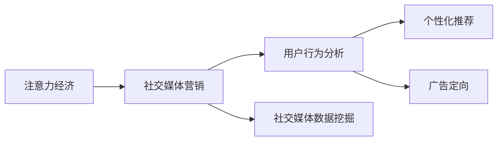

                 

# 注意力经济与社交媒体营销策略：在不牺牲用户体验的情况下有效吸引受众

> 关键词：注意力经济,社交媒体营销,用户行为分析,个性化推荐,广告定向,社交媒体数据挖掘,用户体验,内容优化

## 1. 背景介绍

随着互联网技术的飞速发展和数字经济的兴起，社交媒体成为信息传播和内容消费的重要平台，吸引了大量的用户。社交媒体上信息爆炸、用户注意力分散，如何有效吸引受众、提升用户体验、优化广告投放，成为数字营销中的核心问题。

注意力经济的概念由此应运而生。注意力经济（Attention Economy）强调在信息过载的背景下，如何吸引和保持用户注意力，从而在有限的时间内获得更多收益。在社交媒体平台上，企业和品牌需要通过创新策略，利用数据驱动和算法优化，实现精准营销，提高用户参与度和转化率。

本博客将从注意力经济的视角，探讨社交媒体营销的策略与实践，结合算法和数据技术，在不牺牲用户体验的前提下，有效吸引和保持用户注意力。

## 2. 核心概念与联系

### 2.1 核心概念概述

为更好理解注意力经济与社交媒体营销策略，本节将介绍几个关键概念：

- 注意力经济（Attention Economy）：信息时代下，注意力成为稀缺资源。企业和品牌需要利用算法和创意，精准触达用户，提升用户参与度和转化率。
- 社交媒体营销（Social Media Marketing）：通过社交媒体平台，企业进行品牌推广、产品宣传、用户互动等营销活动。
- 用户行为分析（User Behavior Analysis）：利用数据挖掘和机器学习技术，分析用户行为模式，优化产品和服务，提升用户体验。
- 个性化推荐（Personalized Recommendation）：根据用户历史行为和偏好，推荐个性化的内容和服务，提升用户粘性和满意度。
- 广告定向（Ad Targeting）：通过数据分析和算法优化，精准识别目标用户群体，实现高效广告投放。
- 社交媒体数据挖掘（Social Media Data Mining）：从社交媒体数据中提取有价值的信息，辅助决策和优化。

这些概念之间存在密切的联系。注意力经济是目标，社交媒体营销是手段，用户行为分析提供数据支持，个性化推荐和广告定向是具体策略，社交媒体数据挖掘为实现注意力经济提供数据基础。

### 2.2 核心概念原理和架构的 Mermaid 流程图



这个流程图展示了注意力经济、社交媒体营销、用户行为分析、个性化推荐、广告定向和社交媒体数据挖掘之间的逻辑关系。

## 3. 核心算法原理 & 具体操作步骤
### 3.1 算法原理概述

基于注意力经济的社交媒体营销策略，核心在于精准定位用户，提升用户参与度和转化率。其算法原理可概括为以下几点：

1. **用户行为分析**：通过社交媒体数据挖掘技术，提取用户兴趣、行为模式等信息，建立用户画像。
2. **个性化推荐**：利用机器学习算法，根据用户画像和历史行为，推荐个性化的内容和服务。
3. **广告定向**：使用精准的算法模型，识别目标用户群体，进行定向广告投放。
4. **模型优化**：持续收集用户反馈和行为数据，不断优化算法模型，提高广告效果和用户体验。

### 3.2 算法步骤详解

以下是基于注意力经济的社交媒体营销策略的具体操作步骤：

#### 3.2.1 用户行为分析
1. **数据收集**：从社交媒体平台收集用户数据，包括浏览记录、点赞、评论、分享等行为数据。
2. **数据预处理**：清洗数据，处理缺失值和异常值，进行特征工程，提取用户兴趣、社交关系等信息。
3. **用户画像建立**：利用聚类、分类等算法，构建用户画像，识别不同用户群体。

#### 3.2.2 个性化推荐
1. **推荐算法选择**：根据任务需求，选择合适的推荐算法，如协同过滤、基于内容的推荐、深度学习推荐等。
2. **特征工程**：提取和选择对推荐效果有影响的特征，如用户兴趣、物品属性、时间戳等。
3. **模型训练与评估**：在标注数据上训练推荐模型，使用评估指标（如精确率、召回率、点击率等）评估模型效果，进行调参优化。

#### 3.2.3 广告定向
1. **目标用户识别**：基于用户画像和行为数据，构建广告定向模型，识别目标用户群体。
2. **定向策略设计**：设计定向策略，如基于兴趣、基于行为、基于地理位置等，提高广告的精准性和效果。
3. **广告投放优化**：实时监测广告效果，根据效果反馈调整投放策略，提升广告转化率和用户参与度。

#### 3.2.4 模型优化
1. **反馈收集**：收集用户反馈和行为数据，识别模型的不足之处。
2. **模型更新**：基于反馈数据，更新模型参数，提升模型效果。
3. **性能监控**：实时监控模型性能，进行异常检测和预警，确保模型稳定运行。

### 3.3 算法优缺点

基于注意力经济的社交媒体营销策略，具有以下优点：
1. **精准触达**：通过用户行为分析，精准识别目标用户群体，实现高效广告投放。
2. **提升用户体验**：个性化推荐和广告定向，提高用户参与度和满意度。
3. **优化广告效果**：模型优化和持续迭代，提升广告转化率和ROI。

同时，该策略也存在以下缺点：
1. **数据隐私问题**：用户行为数据的收集和使用，可能涉及隐私问题，需要严格遵守相关法律法规。
2. **算法偏见**：模型可能学习到数据中的偏见，导致推荐和广告定向的公平性问题。
3. **过度依赖数据**：算法效果依赖于数据质量，数据不足或数据偏差可能影响模型性能。
4. **技术门槛高**：算法设计和优化需要一定的技术积累，企业需要投入较多的资源。

### 3.4 算法应用领域

基于注意力经济的社交媒体营销策略，已经广泛应用于多个领域，例如：

1. **电商推荐**：通过用户行为分析，推荐个性化商品，提升用户购买转化率。
2. **社交广告**：根据用户兴趣和行为，精准投放社交媒体广告，提升广告效果和用户参与度。
3. **新闻推荐**：根据用户阅读行为，推荐个性化新闻内容，提升用户粘性和平台留存率。
4. **内容营销**：通过数据分析和推荐算法，优化内容发布策略，提升用户互动和分享。
5. **品牌推广**：基于用户画像和行为数据，设计品牌推广活动，提高品牌知名度和用户忠诚度。

## 4. 数学模型和公式 & 详细讲解 & 举例说明

### 4.1 数学模型构建

假设社交媒体平台上有 $N$ 个用户，每个用户 $i$ 对 $M$ 个物品 $j$ 感兴趣，用 $I_{ij}$ 表示用户对物品的兴趣度，其中 $I_{ij} \in [0,1]$。

用户行为数据 $X_{i}$ 包含 $d$ 个特征 $x_{i1}, x_{i2}, ..., x_{id}$，物品属性数据 $Y_{j}$ 包含 $m$ 个特征 $y_{j1}, y_{j2}, ..., y_{jm}$。

用户行为分析的数学模型可表示为：
$$
I_{ij} = f(x_{i1}, x_{i2}, ..., x_{id}, y_{j1}, y_{j2}, ..., y_{jm})
$$

个性化推荐的数学模型可表示为：
$$
\hat{I}_{ij} = g(x_{i1}, x_{i2}, ..., x_{id}, y_{j1}, y_{j2}, ..., y_{jm})
$$

其中 $f$ 和 $g$ 为模型函数，可以使用线性回归、逻辑回归、深度学习等算法。

### 4.2 公式推导过程

以协同过滤算法为例，其基本思想是通过用户-物品的评分矩阵，找到相似用户和物品，进行推荐。协同过滤的推荐公式为：
$$
\hat{I}_{ij} = \frac{\sum_{k \in K} I_{ik} \cdot I_{kj}}{\sqrt{\sum_{k \in K} I_{ik}^2 \cdot \sum_{k \in K} I_{kj}^2}} \quad \text{（用户-物品协同过滤）}
$$
$$
\hat{I}_{ij} = \frac{\sum_{k \in K} I_{ik} \cdot I_{kj}}{\sqrt{\sum_{k \in K} I_{ik}^2 \cdot \sum_{k \in K} I_{kj}^2}} \quad \text{（物品-用户协同过滤）}
$$

其中 $I_{ik}$ 表示用户 $i$ 对物品 $k$ 的评分，$K$ 表示相似用户或相似物品的集合。

### 4.3 案例分析与讲解

以电商推荐系统为例，分析个性化推荐算法在实际应用中的效果。

1. **数据准备**：收集用户历史行为数据，提取用户画像和物品属性信息，构建用户-物品评分矩阵。
2. **协同过滤推荐**：使用基于用户的协同过滤算法，找到与目标用户相似的用户，推荐其喜欢的物品。
3. **模型评估**：使用交叉验证和ROC曲线等评估指标，评估推荐模型的效果。
4. **效果优化**：根据评估结果，调整推荐算法和参数，提升推荐效果。

## 5. 项目实践：代码实例和详细解释说明

### 5.1 开发环境搭建

在进行社交媒体营销策略开发前，我们需要准备好开发环境。以下是使用Python进行PyTorch开发的环境配置流程：

1. 安装Anaconda：从官网下载并安装Anaconda，用于创建独立的Python环境。

2. 创建并激活虚拟环境：
```bash
conda create -n pytorch-env python=3.8 
conda activate pytorch-env
```

3. 安装PyTorch：根据CUDA版本，从官网获取对应的安装命令。例如：
```bash
conda install pytorch torchvision torchaudio cudatoolkit=11.1 -c pytorch -c conda-forge
```

4. 安装Transformers库：
```bash
pip install transformers
```

5. 安装各类工具包：
```bash
pip install numpy pandas scikit-learn matplotlib tqdm jupyter notebook ipython
```

完成上述步骤后，即可在`pytorch-env`环境中开始社交媒体营销策略的开发实践。

### 5.2 源代码详细实现

下面以电商推荐系统为例，给出使用Transformers库对物品推荐算法进行PyTorch代码实现。

首先，定义推荐模型的输入输出：

```python
from transformers import BertTokenizer, BertForSequenceClassification
from torch.utils.data import TensorDataset, DataLoader, RandomSampler, SequentialSampler
import torch
from sklearn.metrics import accuracy_score, precision_recall_fscore_support

class BertItemRecommender:
    def __init__(self, model_path, tokenizer_path):
        self.model = BertForSequenceClassification.from_pretrained(model_path)
        self.tokenizer = BertTokenizer.from_pretrained(tokenizer_path)
        self.device = torch.device("cuda" if torch.cuda.is_available() else "cpu")

    def predict(self, text):
        encoded_input = self.tokenizer.encode(text, add_special_tokens=True, return_tensors='pt')
        encoded_input = encoded_input.to(self.device)
        with torch.no_grad():
            logits = self.model(encoded_input)
            logits = logits[:, 1] # 仅关注目标物品类别
        return logits

    def evaluate(self, preds, labels):
        acc = accuracy_score(labels, preds)
        precision, recall, f1, _ = precision_recall_fscore_support(labels, preds, average='binary')
        return acc, precision, recall, f1
```

然后，定义推荐系统的主函数：

```python
from sklearn.model_selection import train_test_split
from torch.optim import Adam

def main():
    # 加载数据
    with open('train.txt', 'r') as f:
        train_data = [line.strip().split('\t') for line in f]

    train_x, train_y = train_data
    train_x, test_x, train_y, test_y = train_test_split(train_x, train_y, test_size=0.2, random_state=42)

    # 训练模型
    model = BertItemRecommender('bert-base-cased', 'bert-base-cased')
    optimizer = Adam(model.model.parameters(), lr=2e-5)

    for epoch in range(10):
        loss = 0
        for text in train_x:
            preds = model.predict(text)
            loss += model.model.loss(preds, torch.tensor(train_y)).item()
            optimizer.zero_grad()
            loss.backward()
            optimizer.step()

        if epoch % 2 == 0:
            print(f'Epoch {epoch+1}, loss: {loss:.3f}')

    # 测试模型
    test_preds = []
    for text in test_x:
        test_preds.append(model.predict(text).argmax().item())
    acc, precision, recall, f1 = model.evaluate(test_preds, test_y)
    print(f'Test Accuracy: {acc:.3f}, Precision: {precision:.3f}, Recall: {recall:.3f}, F1 Score: {f1:.3f}')
```

完成上述步骤后，即可在`pytorch-env`环境中进行电商推荐系统的开发实践。

### 5.3 代码解读与分析

让我们再详细解读一下关键代码的实现细节：

**BertItemRecommender类**：
- `__init__`方法：初始化模型和分词器，并设置设备。
- `predict`方法：对输入文本进行编码，前向传播得到物品推荐概率。
- `evaluate`方法：计算模型在测试集上的精度、召回率和F1得分。

**main函数**：
- 从数据文件中加载训练集和测试集。
- 定义模型和优化器，训练模型。
- 在测试集上评估模型性能，并输出结果。

通过上述代码，可以看出使用PyTorch和Transformers库进行电商推荐系统的开发非常简单和高效。

## 6. 实际应用场景
### 6.1 智能推荐系统

基于社交媒体数据的个性化推荐系统，已经在电商、新闻、社交媒体等多个领域得到了广泛应用。推荐系统通过分析用户行为数据，生成个性化推荐内容，提升用户体验和平台留存率。

例如，在电商推荐系统中，通过收集用户浏览、点击、购买等行为数据，构建用户画像，利用协同过滤、深度学习等算法进行推荐，能够有效提升用户转化率和购买率。

### 6.2 社交广告

社交媒体平台上的广告投放，通常具有高用户参与度和低成本的特点。通过分析用户兴趣和行为数据，实现精准的广告定向，能够显著提升广告效果和用户参与度。

例如，某电商品牌在社交媒体上推广一款新产品，利用用户行为数据，分析用户兴趣和购买行为，设计精准的广告策略，能够在有限预算内获得更高的曝光量和转化率。

### 6.3 内容推荐系统

社交媒体上的内容推荐系统，能够根据用户的历史行为和兴趣，推荐符合其口味的文章、视频、图片等内容。这不仅提升了用户满意度，也增加了平台粘性和互动率。

例如，某社交媒体平台上的新闻推荐系统，通过分析用户阅读行为和兴趣，推荐相关的新闻内容，能够提高用户阅读量和平台留存率。

### 6.4 未来应用展望

随着社交媒体数据的不断增长，基于用户行为分析和个性化推荐的社交媒体营销策略，将在更多领域得到应用，为传统行业带来变革性影响。

在智慧医疗领域，基于社交媒体数据的健康信息推荐，能够帮助用户及时获取健康知识，提升健康素养，降低医疗风险。

在智能教育领域，基于用户学习行为的数据分析，能够推荐个性化的学习内容，提高学习效率和效果，实现因材施教。

在智慧城市治理中，基于用户行为数据的智慧社区建设，能够提升城市管理效率和居民满意度，构建更和谐的社区环境。

## 7. 工具和资源推荐
### 7.1 学习资源推荐

为了帮助开发者系统掌握社交媒体营销的理论基础和实践技巧，这里推荐一些优质的学习资源：

1. 《社交媒体营销指南》系列博文：由社交媒体营销专家撰写，深入浅出地介绍了社交媒体营销的核心概念、策略和实践技巧。

2. 《数据驱动的社交媒体营销》课程：由知名大学开设的线上课程，涵盖社交媒体数据挖掘、用户行为分析等内容，是入门社交媒体营销的好选择。

3. 《Attention Is All You Need》论文：Transformer模型原论文，介绍了注意力机制的核心思想，是了解深度学习推荐算法的基础。

4. 《深度学习推荐系统》书籍：系统介绍了推荐算法的原理和应用，涵盖协同过滤、基于内容的推荐、深度学习推荐等方法。

5. 《数据科学在社交媒体营销中的应用》书籍：结合实际案例，详细介绍了数据科学在社交媒体营销中的具体应用，包括用户行为分析、推荐系统等。

通过对这些资源的学习实践，相信你一定能够快速掌握社交媒体营销的理论基础和实践技巧，并用于解决实际的社交媒体营销问题。

### 7.2 开发工具推荐

高效的开发离不开优秀的工具支持。以下是几款用于社交媒体营销开发的常用工具：

1. PyTorch：基于Python的开源深度学习框架，灵活动态的计算图，适合快速迭代研究。大部分推荐算法都有PyTorch版本的实现。

2. TensorFlow：由Google主导开发的开源深度学习框架，生产部署方便，适合大规模工程应用。同样有丰富的推荐算法资源。

3. Transformers库：HuggingFace开发的NLP工具库，集成了众多SOTA推荐算法，支持PyTorch和TensorFlow，是进行推荐任务开发的利器。

4. Weights & Biases：模型训练的实验跟踪工具，可以记录和可视化模型训练过程中的各项指标，方便对比和调优。与主流深度学习框架无缝集成。

5. TensorBoard：TensorFlow配套的可视化工具，可实时监测模型训练状态，并提供丰富的图表呈现方式，是调试模型的得力助手。

6. Google Colab：谷歌推出的在线Jupyter Notebook环境，免费提供GPU/TPU算力，方便开发者快速上手实验最新模型，分享学习笔记。

合理利用这些工具，可以显著提升社交媒体营销任务的开发效率，加快创新迭代的步伐。

### 7.3 相关论文推荐

社交媒体营销技术的发展源于学界的持续研究。以下是几篇奠基性的相关论文，推荐阅读：

1. Attention Is All You Need（即Transformer原论文）：提出了Transformer结构，开启了深度学习推荐算法的新纪元。

2. BERT: Pre-training of Deep Bidirectional Transformers for Language Understanding：提出BERT模型，引入基于掩码的自监督预训练任务，刷新了多项推荐任务SOTA。

3. Click-Through Rate Prediction and Its Applications in Recommendation System（点击率预测及其在推荐系统中的应用）：研究了点击率预测问题，并应用于推荐系统，提升推荐精度和效果。

4. A Hybrid Recommendation System for Personalized Search in Social Networks（基于社交网络的个性化搜索推荐系统）：提出了一种融合用户社交关系和行为数据的推荐算法，提升推荐效果。

5. Multi-Modal Recommendation System for Social Network Platforms（社交网络平台的跨模态推荐系统）：研究了基于用户文本和行为数据的推荐系统，提升推荐多样性和覆盖率。

这些论文代表了大数据推荐技术的发展脉络。通过学习这些前沿成果，可以帮助研究者把握学科前进方向，激发更多的创新灵感。

## 8. 总结：未来发展趋势与挑战

### 8.1 总结

本文对基于社交媒体数据的个性化推荐和广告定向策略进行了全面系统的介绍。首先阐述了社交媒体营销策略的原理和背景，明确了社交媒体营销的核心理念和关键技术。其次，从用户行为分析、个性化推荐、广告定向等角度，详细讲解了社交媒体营销的具体操作步骤和实现方法。同时，本文还广泛探讨了社交媒体营销在多个行业领域的应用前景，展示了社交媒体营销的广泛潜力和巨大价值。

通过本文的系统梳理，可以看到，基于社交媒体数据的个性化推荐和广告定向策略，是实现精准营销、提升用户体验、优化广告效果的关键技术。未来，伴随社交媒体数据的不断增长和算法的持续演进，社交媒体营销将迎来更大的发展空间和更高的技术要求。

### 8.2 未来发展趋势

展望未来，社交媒体营销技术将呈现以下几个发展趋势：

1. **多模态数据融合**：未来的推荐系统将不仅仅基于文本数据，还将结合图像、视频、语音等多模态数据，提升推荐效果和用户体验。

2. **深度学习和神经网络**：随着深度学习技术的发展，未来的推荐系统将更多采用深度神经网络模型，提升推荐精度和效果。

3. **个性化推荐引擎**：推荐引擎将更加智能化、自适应，能够根据用户实时行为动态调整推荐策略，提升用户满意度。

4. **实时推荐系统**：未来的推荐系统将实时收集和处理用户数据，动态更新推荐模型，提升推荐时效性和准确性。

5. **跨平台推荐**：未来的推荐系统将跨平台、跨设备协同工作，提升用户在不同设备上的推荐体验。

6. **推荐效果评估**：推荐系统将引入更多评估指标，如用户交互深度、内容丰富度等，全面衡量推荐效果。

以上趋势凸显了社交媒体营销技术的广阔前景。这些方向的探索发展，必将进一步提升推荐系统的性能和应用范围，为社交媒体营销带来更大的价值。

### 8.3 面临的挑战

尽管社交媒体营销技术已经取得了瞩目成就，但在迈向更加智能化、普适化应用的过程中，它仍面临着诸多挑战：

1. **数据隐私问题**：用户行为数据的收集和使用，可能涉及隐私问题，需要严格遵守相关法律法规。

2. **算法偏见**：模型可能学习到数据中的偏见，导致推荐和广告定向的公平性问题。

3. **过度依赖数据**：算法效果依赖于数据质量，数据不足或数据偏差可能影响模型性能。

4. **技术门槛高**：算法设计和优化需要一定的技术积累，企业需要投入较多的资源。

5. **推荐透明性**：推荐算法的黑盒特性，可能导致用户对推荐结果的不信任，需要增强推荐过程的透明性和可解释性。

6. **模型鲁棒性**：推荐模型面对多样化的数据和复杂的场景，需要具备较强的鲁棒性，避免模型崩溃或失效。

正视社交媒体营销面临的这些挑战，积极应对并寻求突破，将使社交媒体营销技术走向成熟，为数字经济的发展带来更多的机遇和挑战。

### 8.4 研究展望

面对社交媒体营销技术所面临的种种挑战，未来的研究需要在以下几个方面寻求新的突破：

1. **隐私保护与合规性**：开发隐私保护技术，确保用户数据安全，符合法律法规要求。

2. **公平性算法**：引入公平性约束，设计公平性推荐算法，避免算法偏见。

3. **多源数据融合**：研究跨平台、跨设备的数据融合技术，提升推荐效果。

4. **推荐透明性**：提高推荐过程的透明性和可解释性，增强用户信任。

5. **鲁棒性优化**：提升推荐模型的鲁棒性和稳定性，确保在复杂环境中正常运行。

这些研究方向的探索，必将引领社交媒体营销技术迈向更高的台阶，为数字经济的发展提供更多的技术和创新动力。面向未来，社交媒体营销技术还需要与其他人工智能技术进行更深入的融合，如知识表示、因果推理、强化学习等，多路径协同发力，共同推动数字经济的发展。只有勇于创新、敢于突破，才能不断拓展社交媒体营销技术的边界，让数字经济的发展更加健康、可持续。

## 9. 附录：常见问题与解答

**Q1：社交媒体营销策略的主要原理是什么？**

A: 社交媒体营销策略的主要原理是通过用户行为分析，建立用户画像，利用个性化推荐和广告定向技术，精准触达用户，提升用户参与度和转化率。其核心在于数据驱动和算法优化，最大化利用社交媒体数据，提高广告效果和用户体验。

**Q2：推荐算法有哪些种类？**

A: 推荐算法主要分为以下几种：
1. 协同过滤算法：基于用户-物品或物品-用户评分矩阵，寻找相似用户或物品进行推荐。
2. 基于内容的推荐算法：根据物品属性和用户兴趣，进行推荐。
3. 深度学习推荐算法：利用神经网络模型，学习用户和物品的隐含特征，进行推荐。
4. 混合推荐算法：综合多种推荐算法，提高推荐效果。

**Q3：如何进行推荐系统的模型优化？**

A: 推荐系统的模型优化通常包括以下步骤：
1. 数据清洗和预处理：处理缺失值和异常值，进行特征工程。
2. 模型训练和调参：在标注数据上训练推荐模型，选择合适算法和超参数进行调参优化。
3. 评估指标选择：选择合适的评估指标，如精确率、召回率、点击率等，评估模型效果。
4. 模型迭代和优化：根据评估结果，更新模型参数，优化推荐算法。

**Q4：社交媒体推荐系统如何处理推荐效果的不确定性？**

A: 社交媒体推荐系统通常采用多种技术手段，处理推荐效果的不确定性：
1. 不确定性传播：通过模型参数和不确定性传播，传播不确定性，提高推荐效果的稳定性。
2. 集成学习：通过集成多个推荐模型，减少单模型的不确定性，提高推荐效果。
3. 模型融合：通过融合多种推荐算法和数据源，提高推荐效果的稳定性和多样性。

通过以上常见问题的解答，相信读者能够更好地理解社交媒体营销策略的核心原理和实现方法，并为未来的实践提供指导。

---

作者：禅与计算机程序设计艺术 / Zen and the Art of Computer Programming

