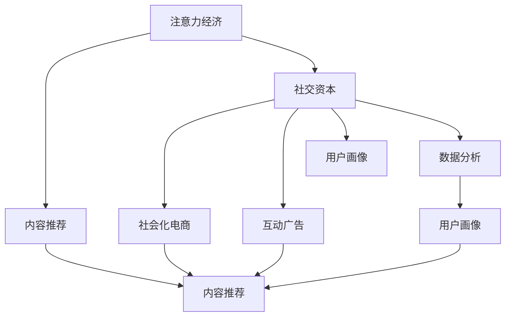

                 

# 注意力经济与社交资本的积累

## 1. 背景介绍

在数字化浪潮中，信息过载成为了不争的事实。面对海量内容，用户的注意力成为了稀缺资源，形成了所谓的“注意力经济”。同时，社交平台让人们可以轻易地建立联系，分享观点，形成了一种新的资本形态——“社交资本”。如何高效地积累和管理这两类资本，是当今互联网时代的一个重要课题。本文旨在探讨注意力经济与社交资本的概念、特点，以及它们在数字时代的积累和运营策略。

## 2. 核心概念与联系

### 2.1 核心概念概述

- **注意力经济**：基于用户注意力的经济模式，用户注意力成为稀缺资源，成为广告、内容生产等商业模式的基础。

- **社交资本**：通过社交网络建立起来的关系和信任网络，能够帮助个人或组织在社会中获得更多的资源和机会，形成的一种新型资本。

- **内容推荐**：根据用户的兴趣和行为，推荐用户可能感兴趣的内容，是提升用户注意力的重要手段。

- **社交网络**：如Facebook、Twitter、微信等平台，通过连接人与人，构建信任和关系网络，形成社交资本。

- **数据分析**：通过对用户行为数据的分析，了解用户兴趣，优化推荐内容，提升社交资本的价值。

- **用户画像**：基于用户的历史行为、偏好等数据构建的用户标签和行为特征，用于个性化推荐和广告投放。

- **社会化电商**：如拼多多的社交购物，通过社交网络效应，提升电商平台的转化率和用户体验。

- **互动广告**：如抖音中的视频广告，通过互动方式提升用户参与度，增强品牌影响。

- **用户参与**：通过用户评论、点赞、分享等行为，增强内容的传播和社交资本的价值。

### 2.2 核心概念原理和架构的 Mermaid 流程图(Mermaid 流程节点中不要有括号、逗号等特殊字符)



这个流程图展示了注意力经济与社交资本之间的联系和作用机制：

1. 注意力经济通过对用户注意力的分配，形成内容推荐，进而影响用户的消费决策。
2. 社交资本通过社交网络中的信任和关系，增强用户的参与度和互动性，进一步提升内容推荐的效果。
3. 用户画像和数据分析帮助平台更好地了解用户，优化推荐内容，增强社交资本的积累。
4. 社会化电商和互动广告通过社交网络的传播效应，扩大品牌的市场影响，提升社交资本的价值。

## 3. 核心算法原理 & 具体操作步骤

### 3.1 算法原理概述

注意力经济与社交资本的积累主要依赖于算法和数据驱动。具体来说，包括以下几个关键步骤：

1. **数据收集**：通过各种方式收集用户行为数据，如点击、浏览、购买、社交互动等。

2. **数据分析**：使用机器学习算法对数据进行深度分析，了解用户兴趣、行为模式、社交网络等。

3. **模型训练**：根据分析结果，训练推荐模型，预测用户可能感兴趣的内容或商品。

4. **个性化推荐**：根据用户画像和历史行为数据，实现个性化推荐，提升用户满意度。

5. **社交网络分析**：分析用户之间的互动关系，构建社交网络，识别关键节点和影响力人物。

6. **社交资本管理**：通过社交网络管理工具，增强用户参与度和互动，积累和运营社交资本。

### 3.2 算法步骤详解

以下是注意力经济与社交资本积累的核心算法步骤：

**Step 1: 数据收集**
- 利用SDK、API等手段，收集用户的点击、浏览、购买、评论、点赞等行为数据。
- 数据存储在数据仓库中，便于后续分析和处理。

**Step 2: 数据预处理**
- 清洗和处理数据，去除异常值和噪声，确保数据质量。
- 将数据转化为机器学习算法能够处理的格式，如特征矩阵、标签向量等。

**Step 3: 特征工程**
- 提取和构造用户画像特征，如兴趣、行为、社交关系等。
- 使用数据增强技术，如用户序列补全、数据变换等，增加数据的多样性。

**Step 4: 模型训练**
- 选择合适的算法，如协同过滤、基于内容的推荐、深度神经网络等。
- 使用训练集对模型进行训练，优化模型参数，提升预测准确率。

**Step 5: 推荐系统部署**
- 将训练好的模型部署到推荐系统，实时处理用户请求，生成个性化推荐。
- 监控推荐系统性能，根据反馈调整模型参数和策略。

**Step 6: 社交资本运营**
- 使用社交网络分析工具，识别关键节点和影响力人物，制定社交资本运营策略。
- 通过社交媒体、论坛、社区等渠道，与用户互动，增强用户黏性和参与度。
- 定期评估社交资本运营效果，优化运营策略，提升社交资本价值。

### 3.3 算法优缺点

注意力经济与社交资本积累的算法具有以下优点：
1. 数据驱动：基于大量用户行为数据的分析，能够提供精准的个性化推荐和社交资本运营策略。
2. 效果显著：在提升用户满意度和社交资本价值方面，效果明显，能够显著提升平台的用户留存和转化率。
3. 技术成熟：基于经典机器学习和深度学习算法，技术成熟度较高，已有大量成熟的落地应用。

同时，这些算法也存在以下缺点：
1. 隐私风险：对用户行为的深度分析可能带来隐私风险，需要采取严格的隐私保护措施。
2. 过拟合风险：在训练过程中，模型可能过拟合训练数据，影响推荐效果。
3. 数据依赖：依赖于高质量的数据和数据处理技术，数据质量不佳可能影响算法效果。
4. 技术复杂：算法实现和部署较为复杂，需要较高的技术门槛。

### 3.4 算法应用领域

注意力经济与社交资本积累的算法已经在多个领域得到广泛应用，如：

- 电商推荐：如亚马逊、淘宝，通过个性化推荐提升用户购买转化率。
- 内容推荐：如YouTube、抖音，通过推荐系统提升用户粘性，增强用户参与度。
- 社交平台：如微信、微博，通过社交网络分析，提升用户互动和参与度。
- 在线广告：如Facebook、Google Ads，通过分析用户行为，优化广告投放策略。
- 新闻推送：如今日头条、腾讯新闻，通过个性化推荐提升用户停留时间和转化率。

除了上述这些经典应用，这些算法还被创新性地应用到更多场景中，如知识图谱构建、智能客服、智能家居等，为数字经济发展提供了新的动力。

## 4. 数学模型和公式 & 详细讲解 & 举例说明

### 4.1 数学模型构建

在注意力经济与社交资本的积累中，数学模型的构建是非常关键的。这里以推荐系统为例，介绍常见的数学模型和公式。

假设用户与物品之间的关系可以用矩阵 $R$ 表示，其中 $R_{ui}$ 表示用户 $u$ 对物品 $i$ 的评分。推荐系统的目标是通过模型 $F$ 预测 $R_{ui}$，并生成推荐列表。

数学模型可以表示为：

$$
R_{ui} \sim F(X_u, X_i, R, \theta)
$$

其中 $X_u$ 和 $X_i$ 分别为用户 $u$ 和物品 $i$ 的特征向量，$\theta$ 为模型参数。

### 4.2 公式推导过程

推荐系统常用的模型包括协同过滤和基于内容的推荐。以协同过滤为例，常用的矩阵分解方法有矩阵分解和奇异值分解（SVD）。

矩阵分解的目标是将 $R$ 分解为两个低维矩阵 $U$ 和 $V$，即：

$$
R \approx UV^T
$$

其中 $U$ 和 $V$ 的大小为 $n \times k$，$k$ 为分解后的维度。

通过对 $U$ 和 $V$ 进行优化，可以得到推荐系统模型。

### 4.3 案例分析与讲解

以Spotify的推荐系统为例，Spotify通过协同过滤和深度神经网络两种方法进行推荐。其中协同过滤模型使用奇异值分解（SVD）进行矩阵分解，深度神经网络使用一个多层的神经网络结构。

对于协同过滤模型，训练目标函数为：

$$
\min_{U,V} \sum_{u,i} (R_{ui} - \langle U_u, V_i \rangle)^2
$$

其中 $\langle \cdot,\cdot \rangle$ 表示向量点乘。

对于深度神经网络模型，训练目标函数为：

$$
\min_{\theta} \sum_{u,i} (R_{ui} - \hat{R}_{ui})^2
$$

其中 $\hat{R}_{ui}$ 表示模型的预测值。

通过这些模型，Spotify能够实现个性化的音乐推荐，提升用户满意度和留存率。

## 5. 项目实践：代码实例和详细解释说明

### 5.1 开发环境搭建

在开发注意力经济与社交资本积累的算法时，需要安装和配置以下环境：

1. Python：3.8及以上版本，确保支持机器学习库和深度学习库。
2. 机器学习库：如Scikit-learn、TensorFlow、PyTorch等，用于算法实现。
3. 数据处理库：如Pandas、NumPy等，用于数据预处理和分析。
4. 可视化库：如Matplotlib、Seaborn等，用于数据可视化。

### 5.2 源代码详细实现

以下是一个基于协同过滤模型的推荐系统代码实现示例：

```python
import numpy as np
from scipy.optimize import minimize
import pandas as pd

def svd_decomposition(R):
    # 奇异值分解
    U, S, V = np.linalg.svd(R)
    return U, V

def train_cf_model(R, k):
    # 协同过滤模型训练
    U, V = svd_decomposition(R)
    U = U[:, :k]
    V = V[:k, :]
    U /= np.linalg.norm(U, axis=0)
    V /= np.linalg.norm(V, axis=1)
    R_hat = np.dot(U, np.dot(np.diag(S[:k]), V))
    return R_hat

def predict_cf(u, i, R_hat):
    # 协同过滤模型预测
    return R_hat[u, i]

def main():
    # 数据读取
    data = pd.read_csv('ratings.csv')
    
    # 数据预处理
    R = data.pivot_table(index='user_id', columns='item_id', values='rating').values
    
    # 分解矩阵
    k = 10
    R_hat = train_cf_model(R, k)
    
    # 预测新用户对新物品的评分
    u = 0
    i = 0
    rating_hat = predict_cf(u, i, R_hat)
    print(f'预测用户 {u} 对物品 {i} 的评分为 {rating_hat}')

if __name__ == '__main__':
    main()
```

### 5.3 代码解读与分析

该代码实现了一个基于协同过滤的推荐系统，主要步骤如下：

1. 数据读取：从CSV文件中读取评分数据，构建评分矩阵 $R$。
2. 数据预处理：将评分矩阵 $R$ 进行矩阵分解。
3. 模型训练：使用奇异值分解（SVD）进行矩阵分解，得到低维矩阵 $U$ 和 $V$。
4. 模型预测：根据新用户和新物品的特征，使用训练好的模型 $R_{ui} \approx \langle U_u, V_i \rangle$ 进行预测。

## 6. 实际应用场景

### 6.1 智能客服系统

智能客服系统通过用户与客服的互动数据，构建用户画像和社交资本，实现精准推荐和个性化服务。如京东客服机器人，通过分析用户的问题和历史交互记录，推荐可能的解决方案，提升用户满意度和服务效率。

### 6.2 智能投顾

智能投顾系统通过用户的历史交易数据和社交网络信息，构建用户画像和社交资本，推荐合适的投资组合和策略。如蚂蚁金服的智能投顾，通过分析用户的风险偏好和社交圈，提供个性化的投资建议。

### 6.3 社交电商

社交电商通过社交网络效应，提升用户的购物体验和转化率。如拼多多社交购物模式，通过用户社交关系和互动，增强用户的购物黏性和转化率。

### 6.4 未来应用展望

随着数据技术的发展，注意力经济与社交资本积累的应用将更加广泛。未来的趋势包括：

1. 个性化推荐系统：通过深度学习模型和大数据技术，实现更加精准的用户推荐。
2. 社交网络分析：使用机器学习算法，对社交网络进行深度分析，发现潜在的社交影响力和关系链。
3. 社会化媒体：利用社交媒体平台，构建社交资本，增强用户的参与度和互动。
4. 数据隐私保护：加强数据隐私保护，避免用户隐私泄露，确保用户数据安全。
5. 跨领域应用：将注意力经济与社交资本积累的技术，应用到更多领域，如医疗、教育、旅游等，提升整体社会效益。

## 7. 工具和资源推荐

### 7.1 学习资源推荐

- 《推荐系统实战》：一本深度学习实战书籍，详细介绍了推荐系统的原理和实践。
- 《机器学习实战》：一本经典机器学习书籍，介绍了常用的机器学习算法和实现。
- 《社交网络分析》：一本社交网络分析的书籍，介绍了社交网络的基本概念和分析方法。
- 《深度学习》：一本深度学习入门书籍，介绍了深度学习的基本概念和实现。

### 7.2 开发工具推荐

- Python：最流行的编程语言，广泛用于数据科学和机器学习。
- Jupyter Notebook：一个交互式的数据分析平台，方便进行数据可视化和算法实现。
- TensorFlow：一个开源的机器学习框架，支持深度学习模型的训练和部署。
- PyTorch：另一个开源的机器学习框架，支持深度学习模型的训练和部署。
- Spark：一个大数据处理框架，支持分布式数据处理和分析。

### 7.3 相关论文推荐

- 《社交网络中的影响力分析》：一篇关于社交网络分析的论文，介绍了影响力分析的方法和应用。
- 《推荐系统研究综述》：一篇推荐系统的综述论文，介绍了推荐系统的常用算法和实现。
- 《基于深度学习的推荐系统》：一篇深度学习推荐系统的论文，介绍了深度学习在推荐系统中的应用。
- 《注意力机制在推荐系统中的应用》：一篇介绍注意力机制在推荐系统中的应用的论文。

## 8. 总结：未来发展趋势与挑战

### 8.1 总结

本文对注意力经济与社交资本的积累进行了全面系统的介绍。首先阐述了注意力经济和社交资本的概念和特点，明确了它们在数字时代的积累和运营策略。其次，从原理到实践，详细讲解了注意力经济与社交资本积累的数学模型和算法步骤，给出了推荐系统的代码实现。同时，本文还广泛探讨了注意力经济与社交资本在多个行业领域的应用前景，展示了其巨大的潜力和价值。通过对这些资源的利用，相信读者能够系统掌握注意力经济与社交资本的积累方法，并将其应用于实际业务中。

### 8.2 未来发展趋势

展望未来，注意力经济与社交资本积累技术将呈现以下几个发展趋势：

1. 数据智能：未来将更多地依赖于AI驱动的数据智能，实现自动化的数据收集和分析。
2. 跨领域应用：随着数据和技术的发展，注意力经济与社交资本积累的应用将拓展到更多领域。
3. 数据隐私保护：隐私保护和数据安全将成为越来越重要的课题，需要更多的技术创新和监管机制。
4. 多模态融合：未来的推荐系统和社交网络将更多地融合多模态数据，提升系统的准确性和鲁棒性。
5. 用户参与度提升：未来的社交平台将更多地注重用户参与度和互动，提升社交资本的价值。
6. 技术融合：未来的注意力经济与社交资本积累将更多地融合其他人工智能技术，如自然语言处理、计算机视觉等，提升系统的综合能力。

### 8.3 面临的挑战

尽管注意力经济与社交资本积累技术已经取得了显著进展，但在迈向更加智能化、普适化应用的过程中，它仍面临诸多挑战：

1. 数据质量和隐私：高质量的数据和隐私保护是实现精准推荐和社交资本积累的基础，但数据隐私和安全问题仍需解决。
2. 算法复杂性：复杂的算法和模型需要高技术门槛，难以快速落地应用。
3. 算法公平性：推荐系统中的算法可能存在偏见，需要更多的公平性研究。
4. 跨平台协作：不同的社交平台和推荐系统之间需要更多的协作和数据共享，才能实现跨平台的深度整合。
5. 用户体验：推荐系统需要更加注重用户体验，提升用户参与度和满意度。
6. 数据冷启动：新用户和冷启动问题仍需解决，确保推荐系统对新用户的覆盖。

### 8.4 研究展望

未来的研究需要在以下几个方面寻求新的突破：

1. 数据智能驱动：研究如何利用AI技术，实现自动化的数据智能，提升数据质量。
2. 跨领域应用拓展：研究将注意力经济与社交资本积累技术应用到更多领域，提升各行业的数字化水平。
3. 隐私保护技术：研究如何更好地保护用户隐私，提升数据安全性和信任度。
4. 算法公平性和鲁棒性：研究如何设计公平性更强的算法，提升系统的鲁棒性。
5. 用户参与度提升：研究如何增强用户参与度和互动，提升社交资本的价值。
6. 数据冷启动解决方案：研究如何更好地解决新用户和冷启动问题，提升系统的覆盖度。

这些研究方向的探索，必将引领注意力经济与社交资本积累技术迈向更高的台阶，为构建安全、可靠、可解释、可控的智能系统铺平道路。面向未来，需要更多的跨学科合作，将注意力经济与社交资本积累技术与其他人工智能技术进行更深入的融合，共同推动数字经济的持续发展。

## 9. 附录：常见问题与解答

**Q1：如何有效地收集用户行为数据？**

A: 用户行为数据可以从以下几个渠道收集：
1. 网站和应用：通过网站和应用中的日志文件、跟踪像素、事件跟踪等手段，收集用户的行为数据。
2. 社交媒体：通过社交媒体平台的用户互动、点赞、评论等数据，收集用户的社交行为。
3. 传感器和设备：通过智能设备中的传感器数据，收集用户的生活行为和健康数据。
4. 问卷调查：通过问卷调查收集用户的偏好和需求。

**Q2：如何处理数据隐私问题？**

A: 处理数据隐私问题需要从以下几个方面入手：
1. 数据匿名化：对用户数据进行匿名化处理，防止数据泄露。
2. 数据加密：使用加密技术对数据进行加密保护，防止数据被恶意访问。
3. 数据最小化：只收集必要的数据，避免过度收集用户隐私。
4. 用户授权：在收集用户数据时，明确告知用户并获取其授权。
5. 数据访问控制：严格控制数据的访问权限，防止数据泄露。

**Q3：推荐系统的准确性和鲁棒性如何提升？**

A: 提升推荐系统的准确性和鲁棒性需要从以下几个方面入手：
1. 数据多样性：增加数据的多样性，防止过拟合。
2. 算法优化：优化推荐算法，提升模型的泛化能力和鲁棒性。
3. 上下文信息：结合上下文信息，提升推荐系统的准确性。
4. 模型融合：将多个推荐模型进行融合，提升系统的综合能力。
5. 用户反馈：利用用户反馈信息，不断优化推荐算法。

**Q4：如何提高用户参与度和互动？**

A: 提高用户参与度和互动需要从以下几个方面入手：
1. 内容质量：提供高质量的内容，吸引用户参与。
2. 互动设计：设计互动性强的界面和功能，增强用户的参与感。
3. 社交网络：利用社交网络效应，增强用户互动。
4. 奖励机制：设计合理的奖励机制，激励用户参与。
5. 实时反馈：提供实时的反馈和互动，提升用户满意度。

**Q5：推荐系统中的算法公平性如何保障？**

A: 保障推荐系统中的算法公平性需要从以下几个方面入手：
1. 数据平衡：确保训练数据中的各类样本数量平衡，避免算法偏见。
2. 模型监控：对推荐模型进行监控，及时发现和纠正偏见。
3. 算法优化：设计公平性更强的算法，提升模型的公平性。
4. 人工干预：在关键节点上进行人工干预，确保推荐的公平性。
5. 用户反馈：利用用户反馈信息，不断优化推荐算法。

---

作者：禅与计算机程序设计艺术 / Zen and the Art of Computer Programming

