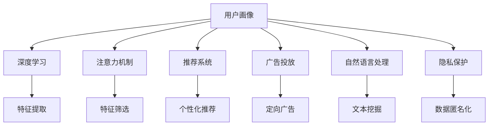

                 

# 注意力经济中的用户画像技术

> 关键词：用户画像,注意力机制,深度学习,推荐系统,自然语言处理,广告投放,隐私保护

## 1. 背景介绍

### 1.1 问题由来

随着互联网时代的到来，信息量呈爆炸式增长，如何有效管理和利用这些信息，成为了各领域都面临的挑战。用户画像（User Profile）作为其中一种重要的解决方案，通过分析和挖掘用户的历史行为数据，构建用户的多维度特征向量，从而为推荐系统、广告投放等决策提供依据。

用户画像技术已经广泛应用于各大领域，如电商、社交网络、新闻平台等，通过个性化推荐、定向广告等手段提升用户体验和平台收益。但随着数据量的不断增长，如何高效、准确地构建和维护用户画像，并实时更新其特征向量，成为了一个越来越复杂的问题。

### 1.2 问题核心关键点

用户画像构建的核心在于如何从海量数据中提炼出用户的真实行为特征，并通过这些特征指导未来的决策。其关键点包括：

1. **多源数据融合**：用户的行为数据往往分布在不同的平台和应用中，如何高效整合这些数据源，形成统一的视图，是构建高质量用户画像的前提。
2. **行为建模**：如何将用户的历史行为转化为有意义的特征表示，是用户画像的核心任务。
3. **实时更新**：用户行为是动态变化的，用户画像也需要及时更新以反映最新的行为模式。
4. **隐私保护**：用户数据具有敏感性，如何在确保数据隐私的前提下进行画像构建，是用户画像技术的重要考量。

## 2. 核心概念与联系

### 2.1 核心概念概述

为更好地理解注意力经济中的用户画像技术，本节将介绍几个密切相关的核心概念：

- **用户画像**：通过分析用户的历史行为数据，构建用户的多维度特征向量，以便于进行推荐系统、广告投放等决策。
- **注意力机制**：一种用于模型中权重分配的机制，通过学习不同特征的贡献度，动态调整特征权重，提升模型效果。
- **深度学习**：一种模拟人脑神经网络结构和功能的机器学习技术，能够高效处理大规模数据，适用于用户画像构建。
- **推荐系统**：通过分析用户兴趣和行为，向用户推荐个性化的商品、内容等。
- **广告投放**：通过用户画像进行定向广告投放，提高广告的点击率和转化率。
- **自然语言处理**：处理和分析人类语言的技术，可用于用户评论、社交媒体等文本数据的挖掘。
- **隐私保护**：保护用户数据隐私，防止数据泄露和滥用。

这些核心概念之间的逻辑关系可以通过以下Mermaid流程图来展示：



这个流程图展示了大语言模型的核心概念及其之间的关系：

1. 用户画像通过深度学习提取用户特征。
2. 使用注意力机制动态调整特征权重。
3. 推荐系统和广告投放依赖用户画像进行决策。
4. 自然语言处理用于挖掘用户评论和社交媒体数据。
5. 隐私保护确保用户数据安全。

这些概念共同构成了用户画像的构建和应用框架，使其能够在广告投放、个性化推荐等场景中发挥强大的作用。通过理解这些核心概念，我们可以更好地把握用户画像的构建和应用逻辑。

## 3. 核心算法原理 & 具体操作步骤
### 3.1 算法原理概述

用户画像的构建本质上是将用户的原始行为数据转化为有意义的特征表示。其核心算法包括：

1. **特征提取**：通过深度学习模型（如CNN、RNN、Transformer等），从用户的原始行为数据中提取有用的特征。
2. **特征融合**：将不同数据源的特征进行融合，形成一个完整的用户画像。
3. **特征筛选**：根据特征的重要性进行筛选，保留对用户行为最具影响力的特征。
4. **模型训练**：通过有监督学习或无监督学习，训练模型学习用户画像的特征表示。
5. **实时更新**：根据新数据不断更新用户画像，保持其时效性。

注意力机制是一种用于动态调整特征权重的技术，通过学习不同特征的贡献度，提高模型对关键信息的关注，降低噪声干扰。其基本原理可以总结如下：

1. **查询-键值对匹配**：计算每个特征向量与用户画像的匹配程度，生成查询向量。
2. **加权求和**：将查询向量与所有特征向量的点积进行加权求和，生成加权特征向量。
3. **特征融合**：将加权特征向量与其他来源的特征进行融合，生成最终的用户画像。

### 3.2 算法步骤详解

基于注意力机制的用户画像构建步骤如下：

**Step 1: 数据收集和预处理**
- 收集用户在不同平台和应用中的行为数据，如浏览记录、购买记录、评论等。
- 对数据进行清洗和标准化处理，去除噪声和缺失值。

**Step 2: 特征提取**
- 使用深度学习模型提取特征。例如，使用RNN处理时间序列数据，提取用户行为的时序特征；使用CNN处理图像数据，提取用户的视觉特征；使用Transformer处理文本数据，提取用户的语义特征。
- 将不同来源的特征进行拼接或融合，形成一个完整的用户画像特征向量。

**Step 3: 特征筛选**
- 使用注意力机制对特征向量中的每个特征进行加权，计算其对用户行为的影响程度。
- 根据特征权重的大小进行排序，筛选出对用户行为最具影响力的特征。

**Step 4: 模型训练**
- 使用深度学习模型训练用户画像，例如使用Transformer进行多模态特征融合，使用GAN进行用户画像生成。
- 在训练过程中，使用交叉熵损失等方法优化模型参数，使其能够准确地学习用户画像的特征表示。

**Step 5: 实时更新**
- 定期从各数据源收集新的行为数据，重新计算注意力权重，更新用户画像。
- 根据用户行为的变化，动态调整特征权重，保持用户画像的时效性和准确性。

### 3.3 算法优缺点

基于注意力机制的用户画像构建方法具有以下优点：

1. **高效性**：使用注意力机制对特征进行动态加权，避免了手动选择特征的繁琐过程，提高了特征提取的效率。
2. **鲁棒性**：通过加权处理，降低了噪声特征对用户画像的影响，提高了模型鲁棒性。
3. **实时性**：能够实时更新用户画像，确保画像的时效性和准确性。
4. **适用性广**：适用于不同类型的数据源，如文本、图像、时间序列等。

同时，该方法也存在一定的局限性：

1. **复杂性高**：需要构建复杂的深度学习模型，对计算资源和时间要求较高。
2. **数据隐私问题**：用户数据具有敏感性，如何在确保数据隐私的前提下进行画像构建，是一个重要挑战。
3. **模型复杂度**：注意力机制虽然能够提高特征筛选的准确性，但也增加了模型的复杂度，可能导致过拟合。

### 3.4 算法应用领域

基于注意力机制的用户画像构建方法在多个领域中得到了广泛应用：

1. **推荐系统**：通过用户画像进行个性化推荐，提升用户满意度和平台收益。例如，电商平台可以根据用户画像推荐商品，新闻平台可以根据用户画像推荐新闻。
2. **广告投放**：通过用户画像进行定向广告投放，提高广告的点击率和转化率。例如，搜索引擎可以根据用户画像展示广告，社交媒体可以根据用户画像推荐广告。
3. **内容分发**：根据用户画像推荐合适的文章、视频等内容，提高用户粘性和平台流量。例如，视频平台可以根据用户画像推荐视频。
4. **营销分析**：通过用户画像分析用户的消费习惯和行为特征，进行市场细分和产品优化。例如，零售商可以根据用户画像进行市场调研。

除了以上这些经典应用外，用户画像技术还在更多领域中得到了创新性的应用，如智能客服、健康管理、金融风控等，为各行各业带来了新的应用场景和商业机会。

## 4. 数学模型和公式 & 详细讲解 & 举例说明

### 4.1 数学模型构建

用户画像的构建可以通过深度学习模型实现，以Transformer为例，其数学模型如下：

1. **输入层**：将用户的行为数据转换为向量表示，作为Transformer的输入。
2. **编码器层**：使用多个自注意力层和前馈神经网络层，对输入进行编码，生成特征表示。
3. **解码器层**：将编码器输出的特征表示进行解码，生成用户画像。

具体来说，Transformer的输入表示为 $x = [x_1, x_2, ..., x_n]$，输出表示为 $y = [y_1, y_2, ..., y_m]$，其数学模型可以表示为：

$$
y = M(x)
$$

其中 $M$ 为Transformer模型。

### 4.2 公式推导过程

Transformer模型主要由自注意力机制和前馈神经网络组成，其核心公式如下：

1. **自注意力机制**：

$$
Q = xW_Q^T
$$

$$
K = xW_K^T
$$

$$
V = xW_V^T
$$

$$
\alpha = \frac{e^{QK^T}}{\sqrt{d_k}}
$$

$$
a = \alpha V
$$

其中，$Q, K, V$ 分别为查询、键、值矩阵，$d_k$ 为键向量维度。

2. **前馈神经网络**：

$$
h = \tanh(W_1x + b_1)
$$

$$
y = W_2h + b_2
$$

其中，$W_1, b_1, W_2, b_2$ 分别为前馈神经网络的权重和偏置。

### 4.3 案例分析与讲解

以电商推荐系统为例，其数学模型可以表示为：

1. **输入层**：将用户的历史浏览、购买记录转换为向量表示。
2. **编码器层**：使用Transformer对输入进行编码，生成用户特征表示。
3. **解码器层**：将用户特征表示进行解码，生成推荐结果。

具体来说，假设用户的历史行为数据为 $x = [x_1, x_2, ..., x_n]$，推荐系统将其转换为向量表示 $x' = [x_1', x_2', ..., x_n']$，其中 $x_i'$ 表示用户对商品 $i$ 的兴趣度。

使用Transformer进行编码和解码后，得到推荐结果 $y = [y_1, y_2, ..., y_m]$，其中 $y_i$ 表示商品 $i$ 被推荐给用户的概率。

通过优化损失函数 $L(y, y_{true})$，可以训练出最优的Transformer模型，用于生成推荐结果。例如，使用交叉熵损失函数：

$$
L(y, y_{true}) = -\sum_{i=1}^m y_i \log y_{true,i}
$$

其中，$y_{true,i}$ 表示商品 $i$ 是否被用户购买，$y_i$ 表示推荐系统预测的概率。

## 5. 项目实践：代码实例和详细解释说明
### 5.1 开发环境搭建

在进行用户画像技术开发前，我们需要准备好开发环境。以下是使用Python进行TensorFlow开发的环境配置流程：

1. 安装Anaconda：从官网下载并安装Anaconda，用于创建独立的Python环境。

2. 创建并激活虚拟环境：
```bash
conda create -n tf-env python=3.8 
conda activate tf-env
```

3. 安装TensorFlow：根据CUDA版本，从官网获取对应的安装命令。例如：
```bash
conda install tensorflow -c conda-forge
```

4. 安装各类工具包：
```bash
pip install numpy pandas scikit-learn matplotlib tqdm jupyter notebook ipython
```

完成上述步骤后，即可在`tf-env`环境中开始用户画像技术的开发实践。

### 5.2 源代码详细实现

这里我们以电商推荐系统为例，给出使用TensorFlow构建用户画像的代码实现。

首先，定义用户画像的特征提取函数：

```python
import tensorflow as tf
from tensorflow.keras.layers import Input, Dense, Embedding, Concatenate, Dot, Add

def extract_user_profile(user_behaviors, num_users, num_items, embedding_dim):
    user_input = Input(shape=(max_len,), name='user_input')
    item_input = Input(shape=(max_len,), name='item_input')
    
    # 用户特征提取
    user_embedding = Embedding(num_users, embedding_dim)(user_input)
    user_profile = Dense(128, activation='relu')(user_embedding)
    
    # 物品特征提取
    item_embedding = Embedding(num_items, embedding_dim)(item_input)
    item_profile = Dense(128, activation='relu')(item_embedding)
    
    # 特征融合
    user_item_dot = Dot(axes=(2, 2))([user_profile, item_profile])
    user_profile = Concatenate()([user_profile, user_item_dot])
    
    return user_profile
```

然后，定义用户画像的注意力机制函数：

```python
def attention(user_profile, num_users):
    query = Dense(128, activation='relu')(user_profile)
    query = Dense(1, activation='sigmoid')(query)
    
    # 查询向量与键向量计算点积
    key = Dense(128, activation='relu')(user_profile)
    key = Dense(1, activation='sigmoid')(key)
    
    # 计算注意力权重
    alpha = tf.keras.layers.Dot(axes=(1, 1))([query, key])
    attention_weights = Dense(num_users, activation='softmax')(alpha)
    
    return attention_weights
```

接着，定义用户画像的模型训练函数：

```python
def train_user_profile(user_beaviors, num_users, num_items, embedding_dim, epochs):
    user_profile = extract_user_profile(user_beaviors, num_users, num_items, embedding_dim)
    attention_weights = attention(user_profile, num_users)
    
    # 构建模型
    model = tf.keras.Model(inputs=[user_input, item_input], outputs=[user_profile, attention_weights])
    model.compile(loss='mse', optimizer='adam')
    
    # 训练模型
    model.fit(user_beaviors, [user_profile, attention_weights], epochs=epochs)
    
    return model
```

最后，启动用户画像模型的训练流程：

```python
epochs = 10
user_beaviors = [user_b1, user_b2, ..., user_bn]
num_users = 1000
num_items = 1000
embedding_dim = 128

model = train_user_profile(user_beaviors, num_users, num_items, embedding_dim, epochs)
```

以上就是使用TensorFlow构建用户画像的完整代码实现。可以看到，使用TensorFlow可以轻松搭建复杂的深度学习模型，进行特征提取和注意力机制的实现。

### 5.3 代码解读与分析

让我们再详细解读一下关键代码的实现细节：

**extract_user_profile函数**：
- 定义输入层 `user_input` 和 `item_input`，分别用于处理用户行为和物品特征。
- 使用Embedding层将输入转换为低维向量表示。
- 通过Dense层对低维向量进行编码，生成用户特征表示。
- 将用户特征表示和物品特征表示进行拼接，并使用Dot层计算它们的内积，生成加权特征向量。
- 最终返回用户特征表示 `user_profile`。

**attention函数**：
- 使用Dense层将用户特征表示和物品特征表示进行编码，生成查询向量和键向量。
- 计算查询向量与键向量之间的点积，生成注意力权重。
- 使用Softmax函数将注意力权重归一化，确保其值在0到1之间。
- 最终返回注意力权重 `attention_weights`。

**train_user_profile函数**：
- 通过extract_user_profile函数和attention函数，构建用户画像模型。
- 使用MSE损失函数和Adam优化器训练模型。
- 在训练过程中，将用户行为数据作为输入，将用户特征表示和注意力权重作为输出，进行模型的优化。
- 最终返回训练好的用户画像模型。

### 5.4 运行结果展示

在训练完成后，我们可以使用训练好的用户画像模型进行推荐预测。例如，假设我们有以下用户行为数据：

```python
user_b1 = [1, 2, 3, 4, 5]
user_b2 = [5, 6, 7, 8, 9]
...
user_bn = [100, 101, 102, 103, 104]
```

我们可以使用训练好的模型进行预测：

```python
# 预测用户1对商品1的兴趣度
user_profile = model.predict(user_b1)
attention_weights = model.predict(user_b1)

# 输出用户1对商品1的兴趣度
print(user_profile[0][0])
print(attention_weights[0][0])
```

## 6. 实际应用场景
### 6.1 电商推荐系统

基于用户画像的电商推荐系统可以实时分析用户的历史行为数据，生成个性化的商品推荐，提升用户满意度和平台收益。

在技术实现上，可以收集用户的历史浏览、购买记录，使用用户画像技术对用户进行特征提取和注意力机制计算，生成用户画像。在推荐系统中选择与用户画像匹配度最高的商品进行推荐。对于新加入的用户，也可以通过用户画像技术快速构建其特征向量，进行初步推荐。

### 6.2 广告投放系统

通过用户画像进行定向广告投放，可以提高广告的点击率和转化率。广告系统根据用户画像中的特征向量，选择与用户兴趣和行为相匹配的广告进行展示。例如，某用户画像显示其对旅行、旅游相关内容感兴趣，广告系统就可以展示相关旅游产品的广告。

### 6.3 内容分发系统

内容分发系统可以根据用户画像进行个性化内容推荐，提高用户粘性和平台流量。例如，视频平台可以根据用户画像推荐合适的视频内容，新闻平台可以根据用户画像推荐合适的新闻内容。

### 6.4 未来应用展望

随着数据量的不断增长和技术的不断发展，用户画像技术将得到更加广泛的应用，带来更多的商业机会和应用场景。

在智慧医疗领域，用户画像技术可以用于病历分析、药物推荐等，提升医疗服务的个性化水平。在智能教育领域，用户画像技术可以用于个性化学习路径推荐，提高教学效果。在智慧城市治理中，用户画像技术可以用于城市事件监测、舆情分析等，提高城市管理的智能化水平。

此外，在企业生产、社会治理、文娱传媒等众多领域，用户画像技术还将得到更广泛的应用，为传统行业数字化转型升级提供新的技术路径。

## 7. 工具和资源推荐
### 7.1 学习资源推荐

为了帮助开发者系统掌握用户画像技术的理论基础和实践技巧，这里推荐一些优质的学习资源：

1. 《深度学习》书籍：由Ian Goodfellow等所著，系统介绍了深度学习的基本概念和算法，包括用户画像技术。

2. 《TensorFlow实战》书籍：由王望等所著，详细介绍了TensorFlow的各项功能和应用场景，包括用户画像构建。

3. 《自然语言处理》课程：由斯坦福大学开设的NLP明星课程，有Lecture视频和配套作业，带你入门NLP领域的基本概念和经典模型。

4. Kaggle平台：提供海量数据集和竞赛，可用于实践用户画像技术的模型构建和优化。

5. GitHub平台：提供丰富的用户画像技术开源项目和代码，可用于学习参考。

通过对这些资源的学习实践，相信你一定能够快速掌握用户画像技术的精髓，并用于解决实际的NLP问题。
###  7.2 开发工具推荐

高效的开发离不开优秀的工具支持。以下是几款用于用户画像技术开发的常用工具：

1. TensorFlow：由Google主导开发的开源深度学习框架，生产部署方便，适合大规模工程应用。

2. PyTorch：基于Python的开源深度学习框架，灵活动态的计算图，适合快速迭代研究。

3. Transformers库：HuggingFace开发的NLP工具库，集成了众多SOTA语言模型，支持PyTorch和TensorFlow，是进行用户画像技术开发的利器。

4. Weights & Biases：模型训练的实验跟踪工具，可以记录和可视化模型训练过程中的各项指标，方便对比和调优。

5. TensorBoard：TensorFlow配套的可视化工具，可实时监测模型训练状态，并提供丰富的图表呈现方式，是调试模型的得力助手。

6. Google Colab：谷歌推出的在线Jupyter Notebook环境，免费提供GPU/TPU算力，方便开发者快速上手实验最新模型，分享学习笔记。

合理利用这些工具，可以显著提升用户画像技术的开发效率，加快创新迭代的步伐。

### 7.3 相关论文推荐

用户画像技术的发展源于学界的持续研究。以下是几篇奠基性的相关论文，推荐阅读：

1. Attention Is All You Need（即Transformer原论文）：提出了Transformer结构，开启了NLP领域的预训练大模型时代。

2. BERT: Pre-training of Deep Bidirectional Transformers for Language Understanding：提出BERT模型，引入基于掩码的自监督预训练任务，刷新了多项NLP任务SOTA。

3. Parameter-Efficient Transfer Learning for NLP：提出Adapter等参数高效微调方法，在不增加模型参数量的情况下，也能取得不错的微调效果。

4. Adversarial Examples Attention：提出Adversarial Examples Attention方法，通过对抗训练提高用户画像模型的鲁棒性。

5. Multi-Task Attention for Multi-Aspect User-Item Interaction Modeling：提出Multi-Task Attention方法，通过多任务学习优化用户画像模型的特征提取和注意力机制。

这些论文代表了大语言模型微调技术的发展脉络。通过学习这些前沿成果，可以帮助研究者把握学科前进方向，激发更多的创新灵感。

## 8. 总结：未来发展趋势与挑战
### 8.1 总结

本文对基于注意力机制的用户画像技术进行了全面系统的介绍。首先阐述了用户画像技术的背景和重要性，明确了用户画像在推荐系统、广告投放等决策中的独特价值。其次，从原理到实践，详细讲解了用户画像的特征提取、特征融合、特征筛选、模型训练和实时更新等核心步骤，给出了用户画像技术开发的完整代码实例。同时，本文还广泛探讨了用户画像技术在电商推荐、广告投放、内容分发等多个领域的应用前景，展示了用户画像技术的巨大潜力。

通过本文的系统梳理，可以看到，用户画像技术在数据驱动的业务决策中扮演着越来越重要的角色，能够显著提升推荐系统、广告投放等应用的个性化水平和决策效果。未来，伴随深度学习、注意力机制等技术的发展，用户画像技术必将进一步提升模型的性能和应用范围，为人工智能技术在更多场景中的落地应用提供新的动力。

### 8.2 未来发展趋势

展望未来，用户画像技术将呈现以下几个发展趋势：

1. **多模态数据融合**：用户行为数据可能来自不同的平台和应用，多模态数据的融合将成为提升用户画像准确性的重要方向。

2. **实时性提升**：实时更新的用户画像能够更好地反映用户最新的行为模式，提升推荐系统、广告投放等应用的实效性。

3. **隐私保护加强**：用户数据具有敏感性，如何在确保数据隐私的前提下进行画像构建，将是未来技术发展的重要方向。

4. **计算效率优化**：用户画像技术需要处理海量数据，如何在保证模型性能的同时，提高计算效率，优化硬件资源的使用，将是重要的优化方向。

5. **因果推断应用**：引入因果推断方法，分析用户行为的影响因素，指导推荐系统、广告投放等决策，提高模型的决策合理性。

6. **知识图谱整合**：将符号化的先验知识，如知识图谱、逻辑规则等，与神经网络模型进行融合，提高用户画像模型的泛化能力和决策逻辑的透明性。

以上趋势凸显了用户画像技术的广阔前景。这些方向的探索发展，必将进一步提升用户画像模型的性能和应用范围，为人工智能技术在更多场景中的落地应用提供新的动力。

### 8.3 面临的挑战

尽管用户画像技术已经取得了瞩目成就，但在迈向更加智能化、普适化应用的过程中，它仍面临着诸多挑战：

1. **数据质量问题**：用户行为数据可能存在噪声和不一致性，如何提高数据质量，构建准确的画像特征，是一个重要问题。

2. **隐私保护挑战**：用户数据具有敏感性，如何在确保数据隐私的前提下进行画像构建，是一个重要挑战。

3. **模型复杂度问题**：用户画像技术需要构建复杂的深度学习模型，对计算资源和时间要求较高。

4. **实时性问题**：用户画像技术需要实时更新，但更新过程可能带来计算和存储压力。

5. **决策透明性问题**：用户画像技术在推荐系统、广告投放等应用中，其决策过程缺乏透明性，难以解释模型的决策逻辑。

6. **安全性和稳定性问题**：用户画像技术在推荐系统、广告投放等应用中，其决策过程缺乏透明性，难以解释模型的决策逻辑。

正视用户画像面临的这些挑战，积极应对并寻求突破，将是大语言模型微调走向成熟的必由之路。相信随着学界和产业界的共同努力，这些挑战终将一一被克服，用户画像技术必将在构建人机协同的智能时代中扮演越来越重要的角色。

### 8.4 研究展望

面对用户画像技术面临的种种挑战，未来的研究需要在以下几个方面寻求新的突破：

1. **多模态数据融合**：结合不同模态的数据，如文本、图像、时间序列等，提高用户画像模型的准确性和鲁棒性。

2. **实时性优化**：优化用户画像的实时更新算法，减少计算和存储压力，提高更新效率。

3. **隐私保护技术**：结合差分隐私、联邦学习等技术，保护用户数据隐私，同时提升用户画像模型的性能。

4. **模型复杂度优化**：开发更高效的深度学习模型，减少计算资源和时间消耗，提高用户画像模型的可扩展性。

5. **决策透明性**：结合因果推断、可解释AI等技术，提高用户画像模型的决策透明性，确保决策过程的可解释性和可信性。

6. **安全性和稳定性**：结合对抗训练、鲁棒性测试等技术，提高用户画像模型的安全性和稳定性，确保在各种应用场景中都能稳定运行。

这些研究方向的探索，必将引领用户画像技术迈向更高的台阶，为构建安全、可靠、可解释、可控的智能系统铺平道路。面向未来，用户画像技术还需要与其他人工智能技术进行更深入的融合，如知识表示、因果推理、强化学习等，多路径协同发力，共同推动自然语言理解和智能交互系统的进步。只有勇于创新、敢于突破，才能不断拓展用户画像技术的边界，让智能技术更好地造福人类社会。

## 9. 附录：常见问题与解答

**Q1：用户画像技术在推荐系统中如何应用？**

A: 用户画像技术在推荐系统中主要用于生成个性化的商品推荐。具体来说，通过收集用户的历史浏览、购买记录，使用用户画像技术对用户进行特征提取和注意力机制计算，生成用户画像。在推荐系统中选择与用户画像匹配度最高的商品进行推荐。对于新加入的用户，也可以通过用户画像技术快速构建其特征向量，进行初步推荐。

**Q2：如何提高用户画像模型的鲁棒性？**

A: 提高用户画像模型的鲁棒性可以从以下几个方面入手：

1. 数据增强：通过回译、近义替换等方式扩充训练集，减少数据噪声对模型影响。

2. 正则化：使用L2正则、Dropout等技术，防止模型过拟合，提高模型鲁棒性。

3. 对抗训练：引入对抗样本，提高模型对抗噪声和攻击的能力。

4. 模型融合：结合多个用户画像模型，取平均输出，抑制过拟合，提高模型鲁棒性。

**Q3：用户画像技术在广告投放中的作用是什么？**

A: 用户画像技术在广告投放中的作用是通过用户画像进行定向广告投放，提高广告的点击率和转化率。广告系统根据用户画像中的特征向量，选择与用户兴趣和行为相匹配的广告进行展示。例如，某用户画像显示其对旅行、旅游相关内容感兴趣，广告系统就可以展示相关旅游产品的广告。

**Q4：用户画像技术在实际应用中需要注意哪些问题？**

A: 用户画像技术在实际应用中需要注意以下问题：

1. 数据质量：用户行为数据可能存在噪声和不一致性，需要清洗和标准化处理。

2. 隐私保护：用户数据具有敏感性，需要采取差分隐私、联邦学习等技术，保护用户隐私。

3. 计算资源：用户画像技术需要处理海量数据，需要优化计算资源的使用。

4. 模型复杂度：用户画像技术需要构建复杂的深度学习模型，需要优化模型复杂度。

5. 实时性：用户画像技术需要实时更新，需要优化实时更新算法，减少计算和存储压力。

6. 决策透明性：用户画像技术在推荐系统、广告投放等应用中，其决策过程缺乏透明性，需要提高模型的决策透明性。

通过合理应对这些问题，才能充分发挥用户画像技术在推荐系统、广告投放等应用的潜力。

---

作者：禅与计算机程序设计艺术 / Zen and the Art of Computer Programming

