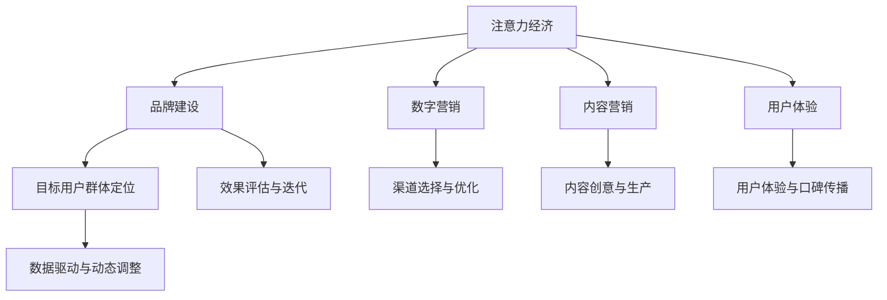

                 

# 注意力经济对企业品牌建设的新挑战

## 1. 背景介绍

在信息爆炸的互联网时代，“注意力”成为了一种稀缺资源。企业的品牌建设不再是简单的产品宣传和市场推广，而是一个需要精心策划、长期投入、精细运营的战略过程。如何高效地吸引和利用用户的注意力，成为了企业品牌建设面临的新挑战。

### 1.1 问题由来

随着社交媒体、短视频、在线广告等数字营销手段的兴起，企业品牌建设进入了一个新的阶段。传统的品牌宣传手段，如电视广告、户外广告等，面临着巨大的竞争压力，难以在用户有限注意力的竞争中脱颖而出。而注意力经济的出现，进一步加剧了这种竞争，使得企业需要寻找更有效、更精准的方式，来吸引和保持用户的关注。

### 1.2 问题核心关键点

注意力经济下，企业的品牌建设需要关注以下几个核心关键点：

1. **目标用户群体定位**：明确品牌的目标用户，分析用户需求和行为，制定精准的品牌策略。
2. **内容创意与生产**：产出高质量、有吸引力的内容，通过创意与技术的结合，提升内容的传播力和影响力。
3. **渠道选择与优化**：选择合适的数字营销渠道，如社交媒体、搜索引擎、视频平台等，并根据数据反馈进行渠道优化。
4. **数据驱动与动态调整**：利用数据分析，实时监控品牌表现，动态调整策略，确保品牌建设的精准和高效。
5. **用户体验与口碑传播**：提升用户体验，利用社交媒体等渠道进行口碑传播，增强用户粘性和品牌忠诚度。

这些关键点共同构成了企业品牌建设在注意力经济下的新挑战，要求企业从多个维度进行全方位的战略规划和技术实施。

## 2. 核心概念与联系

### 2.1 核心概念概述

为更好地理解注意力经济对企业品牌建设的影响，本节将介绍几个密切相关的核心概念：

- **注意力经济**：指在信息过载的环境中，注意力作为一种稀缺资源，企业通过各种手段吸引和利用用户注意力的经济活动。
- **品牌建设**：指企业通过一系列营销活动，建立和维护品牌的知名度、美誉度和市场份额，形成品牌忠诚度的过程。
- **数字营销**：指利用互联网和数字技术，如社交媒体、搜索引擎、电子邮件等，进行品牌推广和用户互动的活动。
- **内容营销**：通过创意内容吸引用户，建立与用户的关系，提升品牌认知度和用户粘性。
- **用户体验(UX)**：指用户在接触品牌和产品过程中产生的情感体验和行为反应，直接关系到品牌忠诚度和口碑传播。

这些核心概念之间的逻辑关系可以通过以下Mermaid流程图来展示：



这个流程图展示出注意力经济下企业品牌建设的整体框架，强调了内容、渠道、数据和用户体验等关键要素的协同作用。

## 3. 核心算法原理 & 具体操作步骤

### 3.1 算法原理概述

在注意力经济下，企业的品牌建设可以通过以下核心算法原理来实现：

1. **目标用户群体定位**：利用用户画像和数据分析技术，精准定位目标用户群体，分析用户需求和行为。
2. **内容创意与生产**：利用算法生成创意内容，并通过A/B测试等手段，优化内容质量。
3. **渠道选择与优化**：通过算法分析各数字营销渠道的效果，选择合适的渠道，并根据用户反馈进行动态优化。
4. **数据驱动与动态调整**：利用数据挖掘和机器学习技术，实时监控品牌表现，动态调整策略。
5. **用户体验与口碑传播**：利用用户体验设计(UX Design)和情感分析等技术，提升用户体验，利用社交媒体等渠道进行口碑传播。

### 3.2 算法步骤详解

#### 3.2.1 目标用户群体定位

**步骤1：用户数据收集**
- 收集用户的基本信息、行为数据、社交媒体互动数据等。
- 使用数据清洗和预处理技术，确保数据质量和可用性。

**步骤2：用户画像构建**
- 利用机器学习算法，如K-means、LDA等，对用户数据进行聚类和主题建模，形成用户画像。
- 根据用户画像，分析目标用户群体的特征和需求。

**步骤3：市场细分与定位**
- 通过市场细分技术，如RFM分析、聚类分析等，将目标用户群体进行细分。
- 根据细分结果，制定针对性的品牌定位策略，确保品牌信息传递的精准性。

#### 3.2.2 内容创意与生产

**步骤1：内容创意生成**
- 利用自然语言处理技术，如文本生成、情感分析等，生成创意内容。
- 使用A/B测试、用户反馈分析等手段，不断优化内容质量和形式。

**步骤2：内容生产与分发**
- 根据内容创意，进行内容制作，包括文本、图片、视频等。
- 选择合适的分发渠道，如社交媒体、企业网站、视频平台等，进行内容分发。

#### 3.2.3 渠道选择与优化

**步骤1：渠道效果分析**
- 利用数据分析工具，如Google Analytics、社交媒体分析工具等，分析各渠道的效果。
- 收集渠道互动数据、用户反馈等，评估渠道的表现。

**步骤2：渠道选择与优化**
- 根据分析结果，选择效果最佳的渠道进行重点推广。
- 利用动态优化算法，如强化学习、在线学习等，实时调整渠道策略，提升渠道效果。

#### 3.2.4 数据驱动与动态调整

**步骤1：数据采集与处理**
- 利用数据采集工具，如Web爬虫、API接口等，获取品牌相关的数据。
- 使用数据清洗、特征提取等技术，处理数据，确保数据质量。

**步骤2：实时监控与分析**
- 利用数据监控工具，如数据仪表盘、实时数据流等，实时监控品牌表现。
- 使用机器学习算法，如时间序列分析、回归分析等，分析品牌数据，识别趋势和异常。

**步骤3：动态调整与优化**
- 根据分析结果，动态调整品牌策略，优化内容、渠道等要素。
- 使用A/B测试、多臂老虎机等技术，评估策略效果，进行持续优化。

#### 3.2.5 用户体验与口碑传播

**步骤1：用户体验设计**
- 根据用户需求和行为，设计高质量的用户体验(UX)。
- 使用用户研究、用户测试等手段，不断优化用户体验。

**步骤2：口碑传播与互动**
- 利用社交媒体、用户评论等渠道，进行品牌口碑传播。
- 建立与用户的互动机制，提升用户粘性和品牌忠诚度。

### 3.3 算法优缺点

#### 3.3.1 优点

- **精准定位**：利用数据和算法，精准定位目标用户群体，确保品牌信息传递的精准性。
- **高效产出**：通过自动化内容生成和优化，快速产出高质量的内容，提升内容创作效率。
- **动态调整**：利用数据驱动，实时监控和动态调整策略，确保品牌建设的精准性和高效性。
- **用户体验优化**：通过用户体验设计，提升用户体验，增强用户粘性和品牌忠诚度。

#### 3.3.2 缺点

- **数据依赖**：依赖高质量的数据和用户行为数据，数据收集和处理成本较高。
- **技术复杂性**：需要综合运用多种算法和技术，技术复杂性较高，需要跨学科团队合作。
- **用户隐私**：在数据收集和处理过程中，需要考虑用户隐私和数据安全问题。

## 4. 数学模型和公式 & 详细讲解 & 举例说明

### 4.1 数学模型构建

在注意力经济下，企业的品牌建设可以构建以下数学模型：

设品牌在渠道 $i$ 上的互动次数为 $x_i$，品牌在渠道 $i$ 上的转化率为 $r_i$，渠道 $i$ 的平均用户质量为 $q_i$，渠道 $i$ 的用户互动成本为 $c_i$，则品牌在渠道 $i$ 上的净收益 $p_i$ 可以表示为：

$$
p_i = x_ir_i - c_i
$$

品牌在所有渠道上的净收益总和 $P$ 可以表示为：

$$
P = \sum_{i=1}^{n} p_i
$$

其中 $n$ 为渠道总数。

### 4.2 公式推导过程

**推导过程**：
1. **净收益计算**：品牌在渠道 $i$ 上的净收益 $p_i$ 为互动次数 $x_i$ 与转化率 $r_i$ 的乘积减去用户互动成本 $c_i$。
2. **总净收益计算**：将品牌在所有渠道上的净收益累加，得到总净收益 $P$。

### 4.3 案例分析与讲解

假设某品牌在社交媒体和搜索引擎两个渠道上进行推广，社交媒体的互动次数为 $x_1=100000$，转化率为 $r_1=0.01$，用户互动成本为 $c_1=0.1$；搜索引擎的互动次数为 $x_2=50000$，转化率为 $r_2=0.05$，用户互动成本为 $c_2=0.05$。

**计算过程**：
1. **社交媒体净收益**：$p_1 = 100000 \times 0.01 - 0.1 = 990$
2. **搜索引擎净收益**：$p_2 = 50000 \times 0.05 - 0.05 = 2375$
3. **总净收益**：$P = p_1 + p_2 = 992.75$

通过以上计算，可以看到品牌在两个渠道上的总净收益为992.75，这为品牌的渠道选择和优化提供了重要参考。

## 5. 项目实践：代码实例和详细解释说明

### 5.1 开发环境搭建

在进行品牌建设项目的开发前，需要准备好开发环境。以下是使用Python进行项目开发的环境配置流程：

1. 安装Anaconda：从官网下载并安装Anaconda，用于创建独立的Python环境。

2. 创建并激活虚拟环境：
```bash
conda create -n brand-env python=3.8 
conda activate brand-env
```

3. 安装必要的Python库：
```bash
pip install numpy pandas matplotlib scikit-learn statsmodels
```

4. 安装相关Python库：
```bash
pip install beautifulsoup4 lxml requests
```

5. 安装PyTorch：
```bash
pip install torch torchvision torchaudio
```

完成上述步骤后，即可在`brand-env`环境中开始项目开发。

### 5.2 源代码详细实现

下面我们以某品牌在社交媒体上的内容创意与生产为例，给出使用Python和PyTorch进行内容生成和分发的代码实现。

首先，定义内容创意生成的函数：

```python
import torch
from torch import nn
from torch.nn import functional as F

# 定义内容生成模型
class ContentGenerator(nn.Module):
    def __init__(self, vocab_size, embedding_dim, hidden_dim, output_dim, n_layers):
        super(ContentGenerator, self).__init__()
        self.embedding = nn.Embedding(vocab_size, embedding_dim)
        self.rnn = nn.LSTM(embedding_dim, hidden_dim, n_layers, batch_first=True)
        self.fc = nn.Linear(hidden_dim, output_dim)
        
    def forward(self, input, hidden):
        embedded = self.embedding(input)
        output, hidden = self.rnn(embedded, hidden)
        return self.fc(output), hidden
    
# 定义训练函数
def train(model, input, target, hidden, optimizer, criterion):
    model.train()
    optimizer.zero_grad()
    output, hidden = model(input, hidden)
    loss = criterion(output, target)
    loss.backward()
    optimizer.step()
    return loss.item()
```

然后，定义数据准备和模型训练函数：

```python
# 准备训练数据
vocab = ['cat', 'dog', 'tree', 'house']
embedding_dim = 64
hidden_dim = 128
output_dim = len(vocab)
n_layers = 1

model = ContentGenerator(len(vocab), embedding_dim, hidden_dim, output_dim, n_layers)

input = torch.tensor([[vocab.index('cat'), vocab.index('dog')]])
target = torch.tensor([[vocab.index('house')]])
hidden = (torch.zeros(n_layers, 1, hidden_dim), torch.zeros(n_layers, 1, hidden_dim))

optimizer = torch.optim.Adam(model.parameters(), lr=0.01)
criterion = nn.CrossEntropyLoss()

for i in range(10):
    loss = train(model, input, target, hidden, optimizer, criterion)
    print(f'Epoch {i+1}, loss: {loss:.3f}')
```

最后，启动内容生成过程：

```python
# 生成内容
input = torch.tensor([[vocab.index('cat')]])
hidden = (torch.zeros(n_layers, 1, hidden_dim), torch.zeros(n_layers, 1, hidden_dim))
output, hidden = model(input, hidden)
print(f'Generated content: {vocab[output.argmax(1)[0]]}')
```

以上就是使用PyTorch进行内容创意与生产的基本代码实现。可以看到，利用深度学习模型，可以高效生成创意内容，并根据用户反馈进行不断优化。

### 5.3 代码解读与分析

让我们再详细解读一下关键代码的实现细节：

**ContentGenerator类**：
- `__init__`方法：初始化模型参数，包括嵌入层、LSTM层和全连接层。
- `forward`方法：前向传播计算模型的输出。

**train函数**：
- 将模型置于训练模式，重置优化器梯度。
- 将输入、目标、隐藏状态输入模型，计算输出和损失。
- 反向传播更新模型参数，返回损失值。

**数据准备**：
- 定义词汇表和模型参数。
- 初始化模型、优化器和损失函数。

**模型训练**：
- 循环迭代训练模型，每次训练一个epoch，输出损失值。
- 使用Adam优化器更新模型参数。

**内容生成**：
- 输入单个词汇，生成下一个词汇。
- 输出生成的内容。

在实际应用中，可以根据具体的品牌策略和用户需求，调整模型参数和训练数据，实现更加精准的内容创意与生产。

## 6. 实际应用场景

### 6.1 智能客服系统

在智能客服系统中，通过注意力经济，企业可以更高效地吸引和利用用户注意力，提升客户服务体验。智能客服系统可以通过以下几个方面进行优化：

1. **目标用户群体定位**：分析客户的历史交互数据，构建用户画像，制定精准的品牌策略。
2. **内容创意与生产**：生成有针对性的内容，如常见问题解答、智能导引等，提升客户满意度。
3. **渠道选择与优化**：通过分析客户在不同渠道上的互动数据，选择合适的客服渠道，并进行动态优化。
4. **数据驱动与动态调整**：利用数据分析工具，实时监控客户反馈，动态调整客服策略。
5. **用户体验与口碑传播**：提升客户互动体验，利用社交媒体等渠道进行品牌口碑传播。

通过以上措施，智能客服系统可以更高效地吸引和利用用户注意力，提升客户服务体验和品牌忠诚度。

### 6.2 社交媒体广告

社交媒体广告是企业品牌建设的重要渠道之一。通过注意力经济，企业可以更精准地吸引和利用用户的注意力，提升广告效果。社交媒体广告可以通过以下几个方面进行优化：

1. **目标用户群体定位**：利用数据分析工具，精准定位目标用户群体，确保广告信息的精准性。
2. **内容创意与生产**：生成高质量、有吸引力的广告内容，通过A/B测试等手段，优化广告效果。
3. **渠道选择与优化**：通过分析各社交媒体平台的用户互动数据，选择合适的广告渠道，并进行动态优化。
4. **数据驱动与动态调整**：利用数据分析工具，实时监控广告表现，动态调整广告策略。
5. **用户体验与口碑传播**：提升用户体验，利用社交媒体等渠道进行品牌口碑传播。

通过以上措施，社交媒体广告可以更精准地吸引和利用用户注意力，提升广告效果和品牌认知度。

### 6.3 企业官网

企业官网是品牌信息传递的重要平台。通过注意力经济，企业可以更高效地吸引和利用用户注意力，提升品牌效果。企业官网可以通过以下几个方面进行优化：

1. **目标用户群体定位**：分析用户的行为数据，构建用户画像，制定精准的品牌策略。
2. **内容创意与生产**：生成高质量、有吸引力的网站内容，提升用户体验和品牌认知度。
3. **渠道选择与优化**：通过分析用户在网站上的互动数据，选择合适的页面布局和内容，并进行动态优化。
4. **数据驱动与动态调整**：利用数据分析工具，实时监控网站表现，动态调整网站策略。
5. **用户体验与口碑传播**：提升用户体验，利用社交媒体等渠道进行品牌口碑传播。

通过以上措施，企业官网可以更高效地吸引和利用用户注意力，提升品牌效果和用户体验。

### 6.4 未来应用展望

随着注意力经济的发展，企业品牌建设将面临更多的机遇和挑战。未来的应用展望主要包括以下几个方面：

1. **个性化推荐**：通过分析用户的兴趣和行为数据，实现个性化推荐，提升用户粘性和品牌忠诚度。
2. **实时互动**：利用AI技术，实现与用户的实时互动，提升用户体验和品牌互动性。
3. **多渠道整合**：整合不同渠道的用户数据，实现全渠道的用户管理和服务，提升用户忠诚度和品牌影响力。
4. **情感分析**：利用情感分析技术，实时监控用户的情感变化，动态调整品牌策略，提升用户满意度。

通过以上措施，企业品牌建设将更精准、高效地吸引和利用用户注意力，提升品牌效果和用户体验。

## 7. 工具和资源推荐

### 7.1 学习资源推荐

为了帮助开发者系统掌握注意力经济对企业品牌建设的影响，这里推荐一些优质的学习资源：

1. **《注意力经济：数字时代的品牌建设》书籍**：该书系统介绍了注意力经济下品牌建设的理论和实践，适合对品牌建设感兴趣的人士阅读。
2. **《机器学习实战》课程**：斯坦福大学开设的机器学习课程，介绍了机器学习的基本概念和应用，适合初学者的入门。
3. **《数据驱动的品牌建设》课程**：Coursera上的一门数据科学课程，介绍了数据驱动的品牌建设方法，适合品牌经理等从业人员学习。
4. **《内容营销的艺术与科学》课程**：HubSpot上的一门内容营销课程，介绍了内容营销的理论和实践，适合内容营销从业人员学习。

通过对这些资源的学习实践，相信你一定能够系统掌握注意力经济下企业品牌建设的精髓，并用于解决实际的品牌问题。

### 7.2 开发工具推荐

高效的开发离不开优秀的工具支持。以下是几款用于品牌建设开发的常用工具：

1. **Jupyter Notebook**：一个免费的Web应用，支持编写和运行Python代码，适合快速迭代和分享学习笔记。
2. **Google Analytics**：一个免费的分析工具，可以实时监控品牌表现，分析用户行为，提供丰富的数据支持。
3. **Facebook Ads Manager**：一个社交媒体广告管理平台，可以创建和管理广告活动，实时监控广告效果。
4. **Google Analytics**：一个免费的分析工具，可以实时监控网站表现，分析用户行为，提供丰富的数据支持。
5. **Hotjar**：一个用户行为分析工具，可以实时监控用户行为，提供用户反馈和优化建议。

合理利用这些工具，可以显著提升品牌建设的效率和效果，加快创新迭代的步伐。

### 7.3 相关论文推荐

注意力经济下品牌建设的研究源于学界的持续研究。以下是几篇奠基性的相关论文，推荐阅读：

1. **Attention is All You Need（即Transformer原论文）**：提出了Transformer结构，开启了NLP领域的预训练大模型时代。
2. **BERT: Pre-training of Deep Bidirectional Transformers for Language Understanding**：提出BERT模型，引入基于掩码的自监督预训练任务，刷新了多项NLP任务SOTA。
3. **Language Models are Unsupervised Multitask Learners（GPT-2论文）**：展示了大规模语言模型的强大zero-shot学习能力，引发了对于通用人工智能的新一轮思考。
4. **Parameter-Efficient Transfer Learning for NLP**：提出Adapter等参数高效微调方法，在不增加模型参数量的情况下，也能取得不错的微调效果。
5. **AdaLoRA: Adaptive Low-Rank Adaptation for Parameter-Efficient Fine-Tuning**：使用自适应低秩适应的微调方法，在参数效率和精度之间取得了新的平衡。

这些论文代表了大语言模型微调技术的发展脉络。通过学习这些前沿成果，可以帮助研究者把握学科前进方向，激发更多的创新灵感。

## 8. 总结：未来发展趋势与挑战

### 8.1 研究成果总结

本文对注意力经济下企业品牌建设的新挑战进行了全面系统的介绍。首先阐述了注意力经济对品牌建设的深远影响，明确了品牌建设在信息过载环境下的新目标和新方法。其次，从核心概念到实际操作，详细讲解了注意力经济下企业品牌建设的数学模型和算法原理。最后，通过代码实例和实际应用场景，展示了注意力经济在品牌建设中的具体应用。

通过本文的系统梳理，可以看到，注意力经济下企业品牌建设需要从多个维度进行全方位的战略规划和技术实施。借助深度学习和大数据技术，品牌建设可以实现更精准、高效、动态的优化，提升用户粘性和品牌忠诚度。

### 8.2 未来发展趋势

展望未来，注意力经济下的企业品牌建设将呈现以下几个发展趋势：

1. **数据驱动**：品牌建设将更加依赖数据驱动，通过数据分析和机器学习，实现精准定位和优化。
2. **个性化推荐**：利用用户画像和推荐算法，实现个性化推荐，提升用户体验和品牌忠诚度。
3. **实时互动**：通过AI技术，实现与用户的实时互动，提升品牌互动性和用户体验。
4. **多渠道整合**：整合不同渠道的用户数据，实现全渠道的用户管理和服务，提升用户忠诚度和品牌影响力。
5. **情感分析**：利用情感分析技术，实时监控用户的情感变化，动态调整品牌策略，提升用户满意度。

这些趋势凸显了注意力经济下企业品牌建设的高效性和精准性，要求品牌建设从多个维度进行全方位的战略规划和技术实施。

### 8.3 面临的挑战

尽管注意力经济为品牌建设带来了诸多机遇，但在迈向更加智能化、普适化应用的过程中，它仍面临着诸多挑战：

1. **数据质量问题**：品牌建设依赖高质量的数据和用户行为数据，数据收集和处理成本较高，数据质量难以保证。
2. **技术复杂性**：品牌建设需要综合运用多种算法和技术，技术复杂性较高，需要跨学科团队合作。
3. **用户隐私**：在数据收集和处理过程中，需要考虑用户隐私和数据安全问题。
4. **算法透明性**：品牌建设中的算法模型需要具备较高的透明性和可解释性，避免“黑盒”系统难以理解。
5. **市场竞争**：品牌建设需要在激烈的市场竞争中脱颖而出，创新和差异化是关键。

正视品牌建设面临的这些挑战，积极应对并寻求突破，将是大语言模型微调走向成熟的必由之路。相信随着学界和产业界的共同努力，这些挑战终将一一被克服，品牌建设必将在构建人机协同的智能时代中扮演越来越重要的角色。

### 8.4 研究展望

面对品牌建设面临的种种挑战，未来的研究需要在以下几个方面寻求新的突破：

1. **数据质量提升**：提升数据采集和处理的技术，确保数据质量和可用性。
2. **算法透明性增强**：开发更具透明性和可解释性的算法模型，增强用户信任。
3. **用户体验优化**：通过用户体验设计，提升用户互动体验，增强用户粘性和品牌忠诚度。
4. **市场竞争应对**：利用品牌建设中的数据和算法优势，实现差异化竞争，提升市场份额。
5. **多渠道整合优化**：实现全渠道的用户管理和服务，提升用户忠诚度和品牌影响力。

这些研究方向的研究突破，必将引领品牌建设技术迈向更高的台阶，为构建安全、可靠、可解释、可控的智能系统铺平道路。面向未来，品牌建设技术还需要与其他人工智能技术进行更深入的融合，如知识表示、因果推理、强化学习等，多路径协同发力，共同推动自然语言理解和智能交互系统的进步。只有勇于创新、敢于突破，才能不断拓展品牌建设的边界，让智能技术更好地造福人类社会。

## 9. 附录：常见问题与解答

**Q1：什么是注意力经济？**

A: 注意力经济是指在信息过载的环境中，注意力作为一种稀缺资源，企业通过各种手段吸引和利用用户注意力的经济活动。

**Q2：注意力经济对品牌建设有哪些影响？**

A: 注意力经济对品牌建设有以下几个影响：
1. **精准定位**：利用数据分析工具，精准定位目标用户群体，确保品牌信息传递的精准性。
2. **高效产出**：通过自动化内容生成和优化，快速产出高质量的内容，提升内容创作效率。
3. **动态调整**：利用数据驱动，实时监控和动态调整策略，确保品牌建设的精准性和高效性。
4. **用户体验优化**：通过用户体验设计，提升用户体验，增强用户粘性和品牌忠诚度。

**Q3：如何进行目标用户群体定位？**

A: 目标用户群体定位可以通过以下几个步骤实现：
1. 收集用户的基本信息、行为数据、社交媒体互动数据等。
2. 使用数据清洗和预处理技术，确保数据质量和可用性。
3. 利用机器学习算法，如K-means、LDA等，对用户数据进行聚类和主题建模，形成用户画像。
4. 根据用户画像，分析目标用户群体的特征和需求，制定精准的品牌策略。

**Q4：如何实现个性化推荐？**

A: 个性化推荐可以通过以下几个步骤实现：
1. 分析用户的兴趣和行为数据，构建用户画像。
2. 利用推荐算法，如协同过滤、矩阵分解等，实现个性化推荐。
3. 实时监控推荐效果，动态调整推荐策略。

**Q5：如何提升用户体验？**

A: 提升用户体验可以通过以下几个方面实现：
1. 通过用户体验设计(UX Design)，优化品牌网站的交互和视觉体验。
2. 利用情感分析技术，实时监控用户的情感变化，动态调整品牌策略。
3. 利用社交媒体等渠道，进行品牌口碑传播，提升用户体验。

通过本文的系统梳理，可以看到，注意力经济下企业品牌建设需要从多个维度进行全方位的战略规划和技术实施。借助深度学习和大数据技术，品牌建设可以实现更精准、高效、动态的优化，提升用户粘性和品牌忠诚度。未来，随着技术不断进步，品牌建设将更加智能化、普适化，助力企业在数字化时代中脱颖而出。

