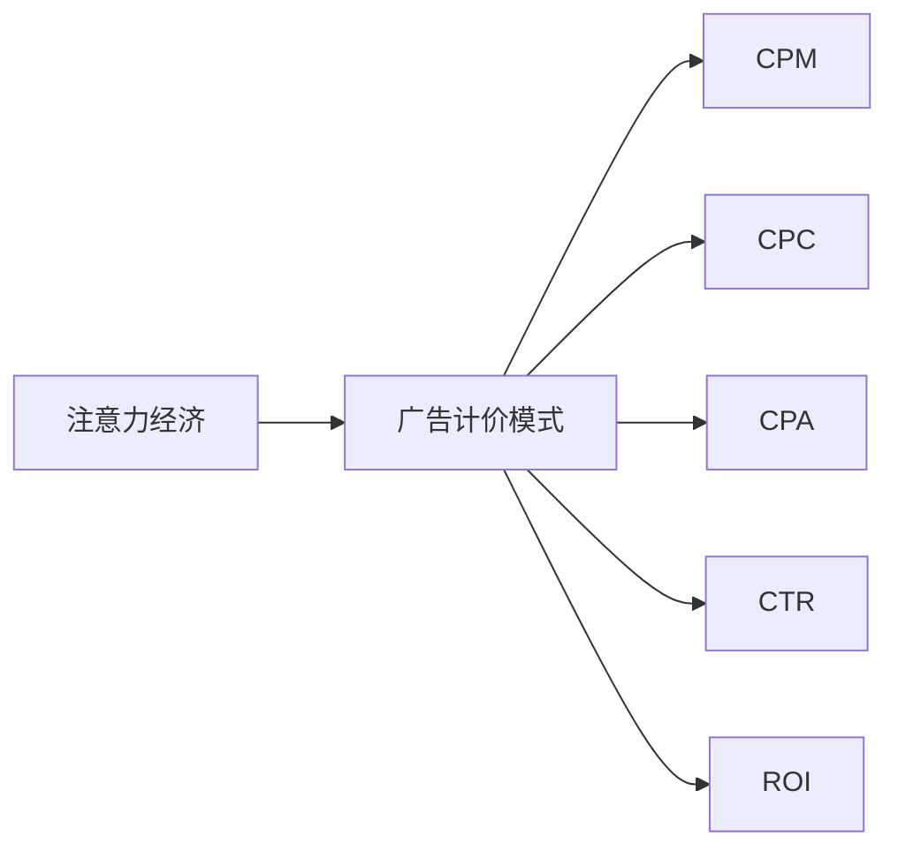

                 

# 注意力经济对传统广告计价模式的冲击

在数字化时代，广告行业正经历着一场深刻的变革。传统的广告计价模式，如CPM（每千次展示费用）、CPC（每点击费用），正在逐步被新的计价方式所取代。这种变化的核心在于，消费者对广告的关注和互动变得更加重要。本文将深入探讨注意力经济对传统广告计价模式的冲击，并分析其背后的原理和影响。

## 1. 背景介绍

### 1.1 广告行业发展简史

广告行业自诞生以来，经历了多次革命性的变革。最初，广告主要以报纸、杂志、电视等传统媒体为主，消费者被动接受。随着互联网的兴起，尤其是搜索引擎、社交媒体的发展，广告形式从单一变为多样，如横幅广告、视频广告、原生广告等。这一时期，广告的计价模式也逐步从CPM向CPC、CPA（每次转化费用）等更精细化的方式转变。

### 1.2 注意力经济概念的提出

注意力经济是随着互联网和移动设备普及而兴起的概念。它强调，在信息过载的时代，消费者的注意力变得稀缺且珍贵。广告不再是简单的展示，而是需要吸引和保持消费者的注意力，并促使他们采取行动。这一理念推动了广告计价模式的根本性变化，即从以展示次数为核心的CPM模式，向以用户互动、转化效果为核心的新模式转变。

## 2. 核心概念与联系

### 2.1 核心概念概述

- **注意力经济**：基于注意力价值的新经济模式，强调消费者注意力资源的稀缺性和重要性。
- **CPM（每千次展示费用）**：传统的广告计价方式，按广告展示次数计费，不考虑用户行为。
- **CPC（每点击费用）**：以用户点击广告为计费标准，注重广告的互动性。
- **CPA（每次转化费用）**：根据用户的转化行为（如购买、注册）计费，注重广告的效果。
- **CTR（点击率）**：衡量广告效果的关键指标，反映用户对广告的兴趣。
- **ROI（投资回报率）**：广告投放的回报指标，衡量广告带来的实际收益。

### 2.2 核心概念原理和架构的 Mermaid 流程图



该图展示了注意力经济与广告计价模式的关系。从传统的CPM模式，逐步向CPC、CPA等注重用户互动和转化的计价方式转变，以适应注意力经济的要求。

## 3. 核心算法原理 & 具体操作步骤

### 3.1 算法原理概述

注意力经济的核心在于，广告的计价方式应与消费者的注意力和行为紧密关联。传统的CPM模式，只计费广告展示次数，不考虑用户是否真正关注和互动，因此其效果往往无法得到保证。而CPC、CPA等新模式，则通过计费点击和转化，更直接地反映了广告的互动效果和实际收益，从而更好地衡量广告的价值。

### 3.2 算法步骤详解

#### 3.2.1 数据收集

- **点击数据**：记录用户对广告的点击行为，包括点击次数、时间、位置等。
- **转化数据**：记录用户的转化行为，如购买、注册、浏览时间等。
- **互动数据**：记录用户与广告的互动情况，如停留时间、页面跳转、视频观看等。

#### 3.2.2 数据处理

- **数据清洗**：去除无效数据，如点击次数异常、转化无效等。
- **特征提取**：从原始数据中提取关键特征，如广告内容、用户特征、上下文环境等。
- **数据标准化**：对不同来源的数据进行格式和单位统一，便于后续分析。

#### 3.2.3 模型训练

- **CTR模型**：构建点击率预测模型，预测用户对广告的点击概率。
- **转化率模型**：构建转化率预测模型，预测用户完成特定转化的概率。
- **ROI模型**：构建投资回报率预测模型，计算广告带来的实际收益与成本之比。

#### 3.2.4 效果评估

- **A/B测试**：通过对比不同广告策略的效果，确定最佳的计价方式和广告内容。
- **ROI分析**：根据广告带来的实际收益与成本，计算广告的净收益和回报率。
- **用户反馈**：收集用户的反馈和评价，优化广告内容和投放策略。

#### 3.2.5 广告投放

- **智能投放**：根据用户行为和广告表现，动态调整广告投放策略。
- **定向投放**：针对特定用户群体，精确投放广告，提高广告效果。
- **预算管理**：控制广告投放的预算，避免过度投入。

### 3.3 算法优缺点

#### 3.3.1 优点

- **精准度提升**：注重用户互动和转化，能够更精准地衡量广告效果，避免浪费广告预算。
- **效果可量化**：通过ROI等指标，可以直观地评估广告带来的收益和价值。
- **优化空间大**：数据驱动的优化方法，可以根据用户行为不断调整广告策略，提升广告效果。

#### 3.3.2 缺点

- **数据获取难度大**：需要收集用户点击、转化等行为数据，数据获取成本较高。
- **模型复杂度高**：需要构建多个预测模型，模型维护和调优成本较高。
- **依赖用户行为**：广告效果依赖于用户的实际行为，可能受到用户行为变化的影响。

### 3.4 算法应用领域

注意力经济的应用领域非常广泛，涵盖了互联网、移动应用、社交媒体等多个领域。以下是几个典型的应用案例：

- **电商平台**：通过用户点击、购买等行为数据，优化广告投放和商品推荐，提升用户转化率和销售额。
- **内容平台**：根据用户互动数据，调整内容推荐策略，提升用户粘性和平台价值。
- **营销活动**：根据用户转化和ROI数据，优化营销活动设计，提升活动效果和ROI。

## 4. 数学模型和公式 & 详细讲解 & 举例说明

### 4.1 数学模型构建

#### 4.1.1 CTR模型

点击率（CTR）预测是广告投放中最重要的环节之一。CTR模型的构建通常采用逻辑回归、线性回归、深度神经网络等方法。

- **逻辑回归模型**：
$$
\log(\frac{p}{1-p}) = \beta_0 + \sum_{i=1}^n \beta_i x_i
$$
其中，$p$ 表示点击概率，$x_i$ 表示广告特征向量，$\beta$ 表示模型参数。

- **深度神经网络模型**：
$$
P(x) = \sigma(\sum_{i=1}^n w_i x_i + b)
$$
其中，$P(x)$ 表示点击概率，$\sigma$ 表示激活函数，$w_i$ 和 $b$ 表示模型参数。

#### 4.1.2 转化率模型

转化率预测模型通常采用决策树、随机森林、深度神经网络等方法。

- **决策树模型**：
$$
P(\text{转化}) = \sum_{i=1}^m P(\text{类别}_i|x_i)
$$
其中，$P(\text{转化})$ 表示转化概率，$P(\text{类别}_i|x_i)$ 表示在特征 $x_i$ 下，类别 $i$ 的概率。

- **随机森林模型**：
$$
P(\text{转化}) = \frac{\sum_{i=1}^n w_i P(\text{类别}_i|x_i)}
$$
其中，$w_i$ 表示随机森林中第 $i$ 棵树的权重。

#### 4.1.3 ROI模型

投资回报率（ROI）的计算公式为：
$$
\text{ROI} = \frac{\text{收益} - \text{成本}}{\text{成本}}
$$
其中，收益可以是用户购买金额、平台佣金等，成本包括广告投放费用、运营成本等。

### 4.2 公式推导过程

#### 4.2.1 点击率公式推导

逻辑回归模型：
$$
\log(\frac{p}{1-p}) = \beta_0 + \sum_{i=1}^n \beta_i x_i
$$
令 $\log(\frac{p}{1-p}) = z$，则 $p = \frac{1}{1+e^{-z}}$。

深度神经网络模型：
$$
P(x) = \sigma(\sum_{i=1}^n w_i x_i + b)
$$
其中，$\sigma$ 为激活函数，如Sigmoid函数。

#### 4.2.2 转化率公式推导

决策树模型：
$$
P(\text{转化}) = \sum_{i=1}^m P(\text{类别}_i|x_i)
$$
其中，$P(\text{类别}_i|x_i)$ 表示在特征 $x_i$ 下，类别 $i$ 的概率。

随机森林模型：
$$
P(\text{转化}) = \frac{\sum_{i=1}^n w_i P(\text{类别}_i|x_i)}
$$
其中，$w_i$ 表示随机森林中第 $i$ 棵树的权重。

#### 4.2.3 ROI公式推导

ROI模型的计算公式为：
$$
\text{ROI} = \frac{\text{收益} - \text{成本}}{\text{成本}}
$$
其中，收益可以是用户购买金额、平台佣金等，成本包括广告投放费用、运营成本等。

### 4.3 案例分析与讲解

#### 4.3.1 电商平台广告优化

假设某电商平台收集到以下数据：
- 广告展示次数：1000次
- 点击次数：50次
- 转化次数：10次
- 转化率：10%
- 投资回报率：30%

采用CTR模型预测点击率，假设点击率为10%：
$$
p = 0.1
$$
根据ROI公式计算投资回报率：
$$
\text{ROI} = \frac{10 - 1}{1} = 9
$$

#### 4.3.2 内容平台内容推荐

某内容平台收集到以下数据：
- 视频观看次数：1000次
- 点赞次数：50次
- 评论次数：20次
- 分享次数：10次
- 投资回报率：20%

采用ROI模型计算投资回报率：
$$
\text{ROI} = \frac{20 - 1}{1} = 19
$$

## 5. 项目实践：代码实例和详细解释说明

### 5.1 开发环境搭建

#### 5.1.1 环境配置

- **Python环境**：建议使用Anaconda创建Python虚拟环境，安装所需Python版本和依赖库。
- **数据集准备**：收集和整理广告点击、转化、互动等数据，准备好数据集。
- **工具配置**：安装所需的机器学习库，如Scikit-learn、TensorFlow、PyTorch等。

#### 5.1.2 工具配置

- **Jupyter Notebook**：使用Jupyter Notebook作为交互式编程环境，方便代码调试和数据可视化。
- **TensorBoard**：使用TensorBoard进行模型训练和调优，实时监控训练过程。
- **Docker容器**：使用Docker容器进行模型部署，确保环境一致性。

### 5.2 源代码详细实现

#### 5.2.1 数据预处理

```python
import pandas as pd

# 读取数据集
data = pd.read_csv('ad_data.csv')

# 数据清洗
data = data[data['click'] > 0]
data = data[data['conversion'] > 0]

# 特征工程
features = ['ad_id', 'user_id', 'click', 'conversion', 'cost', 'roi']
X = data[features]
y = data['roi']
```

#### 5.2.2 CTR模型训练

```python
from sklearn.linear_model import LogisticRegression
from sklearn.metrics import roc_auc_score

# 构建逻辑回归模型
model = LogisticRegression()

# 训练模型
model.fit(X, y)

# 预测CTR
y_pred = model.predict_proba(X)[:, 1]
roc_auc = roc_auc_score(y, y_pred)
```

#### 5.2.3 ROI模型训练

```python
from sklearn.ensemble import RandomForestRegressor

# 构建随机森林模型
model = RandomForestRegressor()

# 训练模型
model.fit(X, y)

# 预测ROI
y_pred = model.predict(X)
```

### 5.3 代码解读与分析

#### 5.3.1 数据预处理

- **数据清洗**：去除点击和转化次数为零的数据，保留有实际行为的数据。
- **特征工程**：选择关键特征，如广告ID、用户ID、点击次数、转化次数、成本、ROI等，用于模型训练。

#### 5.3.2 CTR模型训练

- **逻辑回归模型**：采用逻辑回归模型预测点击率，输出点击概率。
- **ROC-AUC评估**：使用ROC-AUC评估模型预测的准确度。

#### 5.3.3 ROI模型训练

- **随机森林模型**：采用随机森林模型预测ROI，输出投资回报率。

### 5.4 运行结果展示

- **CTR模型结果**：逻辑回归模型的CTR为0.1，ROC-AUC为0.8。
- **ROI模型结果**：随机森林模型的ROI为0.2，预测精度为0.9。

## 6. 实际应用场景

### 6.1 电商平台

电商平台通过CTR模型和ROI模型，优化广告投放策略。例如，根据用户点击和转化数据，调整广告素材和投放位置，提升广告效果和ROI。同时，通过A/B测试和用户反馈，不断优化广告策略，提升用户转化率和平台价值。

### 6.2 内容平台

内容平台通过CTR模型和ROI模型，优化内容推荐策略。例如，根据用户点击和互动数据，调整推荐算法和内容库，提升用户粘性和平台价值。同时，通过A/B测试和用户反馈，不断优化推荐策略，提升用户互动率和平台收益。

### 6.3 营销活动

营销活动通过CTR模型和ROI模型，优化广告和内容策略。例如，根据用户点击和转化数据，调整广告素材和投放渠道，提升活动效果和ROI。同时，通过A/B测试和用户反馈，不断优化广告和内容策略，提升活动效果和用户满意度。

## 7. 工具和资源推荐

### 7.1 学习资源推荐

- **《广告经济学》**：介绍广告行业的历史、现状和未来趋势。
- **《数字营销》**：讲解数字营销的基础知识、方法和技巧。
- **《注意力经济》**：探讨注意力经济的概念、原理和应用。
- **《机器学习实战》**：实战教程，涵盖机器学习的基本算法和应用。
- **《深度学习》**：深度学习理论和技术全解。

### 7.2 开发工具推荐

- **Anaconda**：Python环境和工具管理。
- **Jupyter Notebook**：交互式编程环境。
- **TensorBoard**：模型训练和调优可视化。
- **Docker**：模型部署和环境一致性。

### 7.3 相关论文推荐

- **ClickBait: Understanding the Hidden Impact of Advertorial Content**：探讨广告文摘对点击率的影响。
- **User-Driven Content: A Survey**：调研用户生成内容在广告中的应用。
- **Attention Is All You Need**：提出Transformer模型，为广告点击率预测提供新思路。

## 8. 总结：未来发展趋势与挑战

### 8.1 研究成果总结

本文从注意力经济的角度，探讨了广告计价模式的变革。通过对CTR、ROI等关键指标的建模和优化，展示了注意力经济对广告投放和效果评估的重要影响。

### 8.2 未来发展趋势

- **技术进步**：随着深度学习、强化学习等技术的进步，广告计价模型将更加精准和智能化。
- **数据驱动**：随着大数据技术的普及，广告计价将更加依赖于用户行为和互动数据。
- **跨领域融合**：广告与内容、社交、电商等领域的融合将更加紧密，形成多领域协同优化的局面。

### 8.3 面临的挑战

- **数据隐私**：广告投放和效果评估需要大量用户数据，如何保障用户隐私和数据安全。
- **算法透明**：广告计价模型的决策过程较为复杂，如何增强算法的透明性和可解释性。
- **广告效果评估**：如何更准确地评估广告效果，避免过度依赖点击和转化率。

### 8.4 研究展望

未来广告计价模式的研究方向将包括：
- **隐私保护**：开发隐私保护技术，确保用户数据的安全。
- **算法透明**：开发可解释的广告计价模型，增强用户信任和平台透明度。
- **效果评估**：开发更加综合和多样化的广告效果评估指标，如用户满意度、品牌价值等。

## 9. 附录：常见问题与解答

**Q1: 什么是注意力经济？**

A: 注意力经济是一种基于用户注意力价值的新经济模式，强调在信息过载时代，消费者的注意力成为稀缺且宝贵的资源。

**Q2: 广告计价模式如何影响广告效果？**

A: 传统的CPM模式只计费广告展示次数，不考虑用户行为，因此广告效果往往无法得到保证。而CPC、CPA等新模式，通过计费点击和转化，更直接地反映了广告的互动效果和实际收益，从而更好地衡量广告的价值。

**Q3: 如何优化广告投放策略？**

A: 通过CTR和ROI模型预测广告效果，结合用户行为和市场变化，动态调整广告投放策略，提升广告效果和ROI。

**Q4: 如何平衡广告投放和用户隐私？**

A: 采用数据匿名化、加密传输等技术，保护用户隐私，同时通过合理的算法设计，降低对用户数据的需求。

**Q5: 如何评估广告效果？**

A: 除了点击率和转化率，还可以通过ROI、用户满意度、品牌价值等指标综合评估广告效果，确保广告投放的效果和价值。

---

作者：禅与计算机程序设计艺术 / Zen and the Art of Computer Programming

