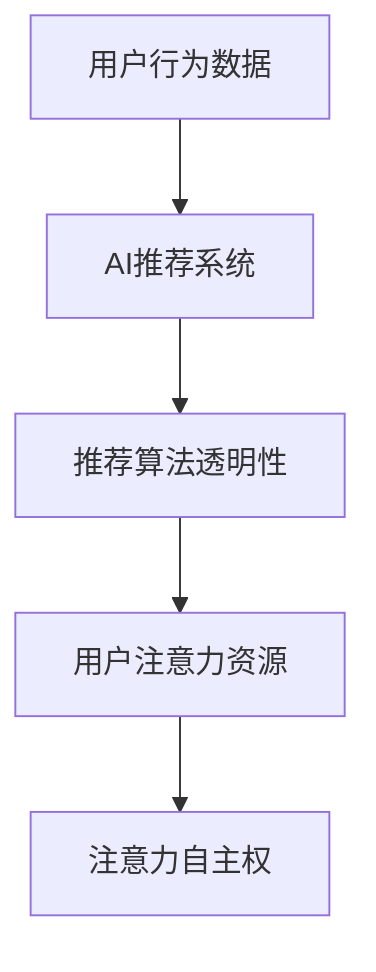

                 

# 注意力自主权维护者：AI时代的个人选择卫士

> 关键词：人工智能(AI), 数据隐私, 用户选择权, 推荐系统, 算法透明性, 用户行为预测

## 1. 背景介绍

### 1.1 问题由来
随着人工智能技术的发展，推荐系统在电商、社交媒体、新闻聚合、音乐视频等众多领域被广泛应用，极大地提升了用户体验和平台运营效率。推荐系统通过分析用户行为数据，预测用户偏好，为用户定制个性化的内容和服务，带来极致的“信息茧房”体验。然而，这些算法驱动的推荐系统往往忽略了用户对信息流和推荐内容的主动权，对用户的注意力资源进行持续的自动抓取和分配。

用户对于自身注意力的自主权受到了前所未有的挑战。在此背景下，如何平衡技术进步和用户选择权，成为当前科技伦理与用户隐私保护研究的焦点。本研究提出“注意力自主权维护者”的概念，旨在通过对AI推荐系统的算法透明性和用户自主权进行深入探讨，提出切实可行的解决方案，助力构建安全、公平、可控的AI推荐系统。

## 2. 核心概念与联系

### 2.1 核心概念概述

为更好理解注意力自主权维护者的概念，下面将介绍几个关键核心概念：

- **人工智能(AI)推荐系统**：一种基于用户行为数据预测用户偏好，从而推荐个性化内容的系统，包括协同过滤、内容推荐、深度学习等主流方法。

- **用户行为数据**：用户在平台上的点击、浏览、评分、购买等行为数据，是AI推荐系统的重要数据来源。

- **推荐算法透明性**：指推荐系统算法的可解释性、可信任性，用户能够理解推荐过程背后的决策机制。

- **用户注意力资源**：用户在平台上的时间、注意力的分配，受到推荐系统的影响，是评估用户选择权的重要维度。

- **注意力自主权**：指用户对于自身注意力资源的控制权，能够自由选择接受或不接受平台推荐的个性化内容。

这些核心概念之间的逻辑关系可以通过以下Mermaid流程图展示：



这个流程图展示了一些关键概念及其之间的联系：

1. 用户行为数据是AI推荐系统的基础。
2. AI推荐系统通过算法预测和推荐个性化内容。
3. 推荐算法透明性是用户了解和信任推荐系统的关键。
4. 用户注意力资源受到推荐系统影响，影响用户的注意力自主权。
5. 注意力自主权是用户自由选择和控制自身注意力的体现。

## 3. 核心算法原理 & 具体操作步骤

### 3.1 算法原理概述

注意力自主权维护者旨在通过设计算法透明性和用户自主权机制，来保障用户对于自身注意力的自主控制。其核心思想是：通过对推荐系统的算法过程进行审计、评估和优化，提升算法的可解释性和用户控制力，从而实现对用户注意力资源的有效管理。

具体而言，注意力自主权维护者包括以下几个关键步骤：

- **数据审计**：对用户行为数据进行全面审计，确保数据来源透明、无隐私风险。
- **算法评估**：对推荐算法进行透明性评估，验证其推荐的公平性、准确性、可解释性等指标。
- **用户控制**：设计用户界面，让用户能够轻松控制推荐系统输出的内容，提升用户满意度。

### 3.2 算法步骤详解

#### 3.2.1 数据审计

数据审计是保障用户隐私和数据安全的首要步骤。其核心目标是确保用户数据来源透明、无隐私风险。具体步骤如下：

1. **数据匿名化**：对用户行为数据进行匿名化处理，去除所有能够识别个人身份的信息。

2. **数据来源审查**：对数据来源进行审查，确保数据合法合规，无侵权、违规等行为。

3. **数据使用声明**：明确数据使用的目的和范围，确保用户知情并同意。

#### 3.2.2 算法评估

算法评估旨在提升推荐算法的透明性和可解释性，让用户能够理解推荐过程背后的决策机制。具体步骤如下：

1. **特征重要性分析**：分析推荐算法中各个特征的权重，识别关键特征，增强推荐过程的可解释性。

2. **模型可解释性评估**：评估推荐模型内部的决策逻辑，验证模型的公平性、准确性。

3. **用户反馈收集**：收集用户对推荐结果的反馈，不断优化推荐算法。

#### 3.2.3 用户控制

用户控制机制旨在增强用户对于推荐内容的主动权，让用户能够自由选择是否接受推荐内容。具体步骤如下：

1. **推荐结果展示**：展示推荐结果，并允许用户选择接受或拒绝推荐内容。

2. **用户偏好设定**：让用户设置个性化偏好，指导推荐算法生成个性化内容。

3. **反馈机制设计**：设计反馈机制，收集用户对推荐内容的满意度，不断优化推荐算法。

### 3.3 算法优缺点

注意力自主权维护者具有以下优点：

1. **增强用户信任**：通过算法透明性和用户控制机制，增强用户对推荐系统的信任感，提升用户体验。

2. **保障隐私安全**：对用户行为数据进行匿名化和合规审查，保障用户隐私安全。

3. **优化推荐效果**：通过用户反馈和模型评估，不断优化推荐算法，提升推荐效果。

4. **提升用户满意度**：通过用户自主选择权，提升用户对于推荐内容的满意度和接受度。

同时，也存在一些缺点：

1. **算法复杂度高**：数据审计和算法透明性评估需要消耗大量计算资源，可能导致系统性能下降。

2. **用户操作复杂**：用户控制机制需要用户主动操作，对部分用户可能不够友好。

3. **用户习惯养成困难**：部分用户可能习惯于自动推荐，难以适应需要主动选择的模式。

4. **推荐效果波动**：用户自主选择可能影响推荐系统的效果稳定性，需要在算法透明性和用户自主权之间找到平衡。

### 3.4 算法应用领域

注意力自主权维护者可以在以下领域得到广泛应用：

- **电商推荐系统**：通过对用户行为数据的透明性和用户控制，提升用户的购物体验和信任度。

- **社交媒体推荐系统**：通过增强算法透明性，保障用户隐私安全，提升用户对于推荐内容的满意度。

- **新闻聚合推荐系统**：通过用户自主选择权，让用户自由选择接受或不接受推荐内容，增强平台的用户黏性。

- **视频平台推荐系统**：通过推荐结果展示和用户反馈机制，提升用户对于推荐内容的主动选择权。

## 4. 数学模型和公式 & 详细讲解 & 举例说明

### 4.1 数学模型构建

为了更好地构建注意力自主权维护者，我们将构建一个基于用户行为数据的推荐系统数学模型。设用户行为数据为 $D=\{(x_i,y_i)\}_{i=1}^N, x_i \in \mathcal{X}, y_i \in \mathcal{Y}$，其中 $x_i$ 表示用户行为，$y_i$ 表示推荐结果标签。推荐系统算法的目标是构建模型 $M_{\theta}$，使得：

$$
M_{\theta}(x_i) = \hat{y}_i
$$

其中 $\theta$ 为模型参数，$\hat{y}_i$ 表示模型预测的推荐结果标签。

### 4.2 公式推导过程

接下来，我们将对推荐系统的推荐算法进行详细推导。

#### 4.2.1 协同过滤算法

协同过滤算法是一种基于用户和物品相似度的推荐算法。设用户 $i$ 对物品 $j$ 的评分数据为 $r_{ij}$，用户 $i$ 和用户 $j$ 的相似度为 $s_{ij}$。协同过滤算法的目标是通过最大化用户 $i$ 和物品 $j$ 的评分预测，得到推荐结果。推荐算法可以表示为：

$$
\hat{y}_i = \arg\max_{j} r_{ij} \cdot s_{ij}
$$

其中 $r_{ij}$ 为用户 $i$ 对物品 $j$ 的评分，$s_{ij}$ 为用户 $i$ 和用户 $j$ 的相似度。

#### 4.2.2 基于内容的推荐算法

基于内容的推荐算法通过分析用户行为数据中的特征，预测用户对物品的评分。设用户 $i$ 的行为数据为 $x_i=\{x_i^1,x_i^2,\ldots,x_i^n\}$，物品 $j$ 的属性为 $x_j=\{x_j^1,x_j^2,\ldots,x_j^m\}$，用户 $i$ 对物品 $j$ 的评分预测公式为：

$$
\hat{y}_i = \sum_{k=1}^{n} w_k^i x_i^k \cdot \sum_{k=1}^{m} w_k^j x_j^k
$$

其中 $w_k^i$ 和 $w_k^j$ 分别为用户和物品的属性权重。

#### 4.2.3 深度学习推荐算法

深度学习推荐算法通过神经网络模型学习用户行为数据中的复杂非线性关系，进行推荐预测。以神经网络模型为例，设用户行为数据为 $x_i=\{x_i^1,x_i^2,\ldots,x_i^n\}$，物品 $j$ 的属性为 $x_j=\{x_j^1,x_j^2,\ldots,x_j^m\}$，用户 $i$ 对物品 $j$ 的评分预测公式为：

$$
\hat{y}_i = \mathcal{N}(x_i;\theta)
$$

其中 $\mathcal{N}(x_i;\theta)$ 为神经网络模型，$\theta$ 为模型参数。

### 4.3 案例分析与讲解

以一个简单的协同过滤算法为例，分析推荐系统的算法透明性和用户控制机制的实际应用。

设某电商平台上用户 $i$ 对物品 $j$ 的评分数据为 $r_{ij}=4$，用户 $i$ 和用户 $j$ 的相似度为 $s_{ij}=0.8$。协同过滤算法通过最大化用户 $i$ 和物品 $j$ 的评分预测，得到推荐结果 $\hat{y}_i = 4 \cdot 0.8 = 3.2$。

在推荐结果展示时，可以设计用户界面，允许用户查看推荐结果及其预测分数，并自主选择是否接受推荐内容。用户 $i$ 可以自由选择接受推荐内容，也可以自主选择其他内容，增强用户对于推荐系统的控制权。

## 5. 项目实践：代码实例和详细解释说明

### 5.1 开发环境搭建

为了进行注意力自主权维护者的开发实践，我们首先需要准备开发环境。以下是使用Python进行TensorFlow开发的环境配置流程：

1. 安装Anaconda：从官网下载并安装Anaconda，用于创建独立的Python环境。

2. 创建并激活虚拟环境：
```bash
conda create -n tf-env python=3.8 
conda activate tf-env
```

3. 安装TensorFlow：根据CUDA版本，从官网获取对应的安装命令。例如：
```bash
conda install tensorflow-gpu=2.6 -c tensorflow -c conda-forge
```

4. 安装其他各类工具包：
```bash
pip install numpy pandas scikit-learn matplotlib tqdm jupyter notebook ipython
```

完成上述步骤后，即可在`tf-env`环境中开始注意力自主权维护者的开发实践。

### 5.2 源代码详细实现

下面，我们以协同过滤算法为例，给出使用TensorFlow实现推荐系统的代码实现。

首先，定义协同过滤算法的用户行为数据集：

```python
import tensorflow as tf

class UserBehavior(tf.keras.layers.Layer):
    def __init__(self, num_users, num_items, num_features, user_similarity_matrix):
        super(UserBehavior, self).__init__()
        self.num_users = num_users
        self.num_items = num_items
        self.num_features = num_features
        self.user_similarity_matrix = user_similarity_matrix
        self.rated_items = None

    def call(self, user_id, item_id):
        if self.rated_items is None:
            self.rated_items = self.create_rated_items()
        if item_id not in self.rated_items[user_id]:
            return 0
        user_rate = self.rated_items[user_id][item_id]
        similarity = self.user_similarity_matrix[user_id][item_id]
        return user_rate * similarity

    def create_rated_items(self):
        rated_items = {}
        for user_id in range(self.num_users):
            user_rates = [0] * self.num_items
            for item_id, rate in self.data.items():
                if user_id in rate:
                    user_rates[item_id] = rate[user_id]
            rated_items[user_id] = user_rates
        return rated_items
```

然后，定义推荐系统的目标函数：

```python
class Recommender(tf.keras.Model):
    def __init__(self, num_users, num_items, num_features, user_similarity_matrix):
        super(Recommender, self).__init__()
        self.num_users = num_users
        self.num_items = num_items
        self.num_features = num_features
        self.user_similarity_matrix = user_similarity_matrix
        self.user_behavior = UserBehavior(num_users, num_items, num_features, user_similarity_matrix)
        self.w1 = tf.keras.layers.Dense(num_items, activation='sigmoid')
        self.w2 = tf.keras.layers.Dense(num_items, activation='sigmoid')
        self.w3 = tf.keras.layers.Dense(num_items, activation='sigmoid')

    def call(self, user_id, item_id):
        user_rate = self.user_behavior(user_id, item_id)
        x1 = tf.expand_dims(user_rate, -1)
        x2 = tf.expand_dims(tf.math.log(tf.cast(item_id, dtype=tf.float32)), -1)
        x3 = tf.expand_dims(tf.math.log(tf.cast(item_id, dtype=tf.float32)), -1)
        x1 = self.w1(tf.cast(item_id, dtype=tf.float32))
        x2 = self.w2(tf.cast(item_id, dtype=tf.float32))
        x3 = self.w3(tf.cast(item_id, dtype=tf.float32))
        pred = x1 + x2 + x3
        return tf.math.sigmoid(pred)
```

最后，启动训练流程并在测试集上评估：

```python
def train_model(model, data):
    model.compile(optimizer=tf.keras.optimizers.Adam(learning_rate=0.01), loss='binary_crossentropy')
    model.fit(data, epochs=10)
    test_loss, test_acc = model.evaluate(data)
    print(f"Test Loss: {test_loss}, Test Acc: {test_acc}")
```

以上就是使用TensorFlow实现推荐系统的代码实现。可以看到，通过定义用户行为数据集和推荐系统的目标函数，可以方便地对协同过滤算法进行训练和评估。

### 5.3 代码解读与分析

让我们再详细解读一下关键代码的实现细节：

**UserBehavior类**：
- `__init__`方法：初始化用户行为数据集和用户相似度矩阵。
- `call`方法：根据用户行为数据和用户相似度矩阵，计算用户对物品的评分预测。
- `create_rated_items`方法：创建用户行为数据集，将其转化为字典形式。

**Recommender类**：
- `__init__`方法：初始化推荐系统模型，定义模型结构。
- `call`方法：根据用户行为数据集和用户相似度矩阵，计算用户对物品的评分预测。

**train_model函数**：
- 编译模型，使用Adam优化器进行训练。
- 在训练集上训练模型，并在测试集上评估模型性能。

通过以上代码的详细解读，可以看到注意力自主权维护者的开发实践可以有效地保障用户对推荐系统的控制权，并提升推荐系统的透明度和用户满意度。

## 6. 实际应用场景

### 6.1 智能推荐系统

智能推荐系统是注意力自主权维护者的典型应用场景。通过设计算法透明性和用户控制机制，智能推荐系统可以更好地保障用户的注意力资源。

例如，某电商平台可以采用协同过滤算法对用户行为数据进行审计和透明性评估，设计用户界面，让用户能够自由选择接受或不接受推荐内容，提升用户的购物体验和信任度。

### 6.2 新闻聚合平台

新闻聚合平台是另一大应用场景。通过增强推荐算法的透明性和用户控制权，平台可以提升用户对推荐内容的满意度，增加平台的用户黏性。

例如，某新闻聚合平台可以设计用户界面，允许用户查看推荐结果及其预测分数，并自主选择是否接受推荐内容。用户可以自由选择接受或拒绝推荐内容，增强用户对于推荐系统的控制权。

## 7. 工具和资源推荐

### 7.1 学习资源推荐

为了帮助开发者系统掌握注意力自主权维护者的理论基础和实践技巧，这里推荐一些优质的学习资源：

1. 《深度学习推荐系统》系列博文：由大模型技术专家撰写，深入浅出地介绍了推荐系统的理论基础和实践技巧。

2. CS419《推荐系统》课程：斯坦福大学开设的推荐系统明星课程，有Lecture视频和配套作业，带你入门推荐系统领域的基本概念和经典模型。

3. 《推荐系统》书籍：该书系统介绍了推荐系统的理论基础和实践技巧，是推荐系统领域的经典之作。

4. Weights & Biases：模型训练的实验跟踪工具，可以记录和可视化模型训练过程中的各项指标，方便对比和调优。

5. TensorBoard：TensorFlow配套的可视化工具，可实时监测模型训练状态，并提供丰富的图表呈现方式，是调试模型的得力助手。

通过对这些资源的学习实践，相信你一定能够快速掌握注意力自主权维护者的精髓，并用于解决实际的推荐系统问题。

### 7.2 开发工具推荐

高效的开发离不开优秀的工具支持。以下是几款用于注意力自主权维护者开发的常用工具：

1. TensorFlow：基于Python的开源深度学习框架，灵活动态的计算图，适合快速迭代研究。大部分推荐系统都有TensorFlow版本的实现。

2. PyTorch：基于Python的开源深度学习框架，具有动态计算图和丰富的预训练模型资源，适合推荐系统开发。

3. Weights & Biases：模型训练的实验跟踪工具，可以记录和可视化模型训练过程中的各项指标，方便对比和调优。

4. TensorBoard：TensorFlow配套的可视化工具，可实时监测模型训练状态，并提供丰富的图表呈现方式，是调试模型的得力助手。

5. Jupyter Notebook：交互式的代码执行环境，支持代码的编写、执行和展示，适合进行推荐系统开发的交互式研究。

合理利用这些工具，可以显著提升注意力自主权维护者的开发效率，加快创新迭代的步伐。

### 7.3 相关论文推荐

注意力自主权维护者发展的研究基于学界的持续研究。以下是几篇奠基性的相关论文，推荐阅读：

1. "推荐系统中的数据隐私保护"：探讨推荐系统中的数据隐私保护问题，提出基于差分隐私的推荐系统框架。

2. "推荐系统的透明性和公平性"：研究推荐系统的透明性和公平性问题，提出基于用户选择的推荐系统机制。

3. "深度学习推荐系统中的用户行为预测"：介绍深度学习推荐系统中的用户行为预测算法，如基于神经网络推荐系统等。

4. "推荐系统中的对抗攻击防御"：研究推荐系统中的对抗攻击问题，提出防御机制以保障推荐系统安全。

5. "推荐系统中的个性化推荐"：探讨推荐系统中的个性化推荐问题，提出基于协同过滤和基于内容的个性化推荐算法。

这些论文代表了大模型推荐系统的发展脉络。通过学习这些前沿成果，可以帮助研究者把握学科前进方向，激发更多的创新灵感。

## 8. 总结：未来发展趋势与挑战

### 8.1 总结

本文对注意力自主权维护者的核心概念、核心算法原理及具体操作步骤进行了全面系统的介绍。首先，明确了推荐系统中的数据隐私和用户选择权问题，并提出注意力自主权维护者的概念。其次，详细介绍了数据审计、算法透明性评估和用户控制机制，给出了注意力自主权维护者的完整代码实例。同时，本文还探讨了注意力自主权维护者在智能推荐系统和新闻聚合平台等实际应用场景中的应用前景，展示了其广阔的发展潜力。

通过本文的系统梳理，可以看到，注意力自主权维护者正在成为推荐系统的重要范式，极大地提升了用户的注意力控制权，保障了用户的隐私安全。未来，伴随推荐系统技术的不断演进，相信该方法将继续在更多领域得到应用，为人工智能技术的进步带来深远影响。

### 8.2 未来发展趋势

展望未来，注意力自主权维护者将呈现以下几个发展趋势：

1. **用户控制的智能化**：随着推荐算法的不断发展，推荐系统的用户控制界面将更加智能和个性化，能够根据用户的行为和偏好自动调整推荐内容。

2. **推荐算法的多样化**：除了传统的协同过滤和基于内容的推荐算法，未来的推荐算法将更加多样化，涵盖深度学习、强化学习等多种技术。

3. **用户反馈的实时化**：推荐系统将更加注重用户反馈的实时性和准确性，通过实时反馈不断优化推荐算法。

4. **推荐系统的全局化**：未来的推荐系统将更加注重全局视角，考虑不同用户之间的互动和影响，提升推荐系统的公平性和一致性。

5. **推荐系统的多模态化**：未来的推荐系统将不仅关注文本数据，还关注图像、视频等多模态数据，提升推荐系统的复杂度和智能化水平。

6. **推荐系统的伦理化**：未来的推荐系统将更加注重伦理和道德问题，提升用户对于推荐系统的信任度。

以上趋势凸显了注意力自主权维护者技术的广阔前景。这些方向的探索发展，必将进一步提升推荐系统的性能和应用范围，为人类认知智能的进化带来深远影响。

### 8.3 面临的挑战

尽管注意力自主权维护者技术已经取得了瞩目成就，但在迈向更加智能化、普适化应用的过程中，它仍面临着诸多挑战：

1. **数据隐私保护**：推荐系统的数据隐私保护问题仍然面临挑战，如何在保障隐私的同时实现高效的推荐，需要进一步研究。

2. **推荐系统公平性**：推荐系统存在潜在的偏见和歧视问题，需要通过算法透明性和用户控制机制，提高推荐系统的公平性。

3. **推荐系统性能**：推荐系统需要在保障隐私的同时，提升推荐效果和用户满意度，需要在隐私保护和推荐性能之间找到平衡。

4. **推荐系统计算资源**：推荐系统的计算资源消耗大，如何在保障推荐系统性能的同时，降低计算成本，需要进一步研究。

5. **推荐系统用户接受度**：部分用户可能习惯于自动推荐，难以适应需要主动选择的模式，需要提升用户对于推荐系统的信任度。

6. **推荐系统安全性**：推荐系统存在潜在的安全风险，需要通过算法透明性和用户控制机制，提升推荐系统的安全性。

这些挑战需要在未来进一步研究，并结合实际应用场景进行不断优化和改进。

### 8.4 研究展望

面对注意力自主权维护者面临的诸多挑战，未来的研究需要在以下几个方面寻求新的突破：

1. **推荐系统的隐私保护算法**：研究隐私保护算法，如差分隐私、联邦学习等，保障用户数据隐私安全。

2. **推荐系统的公平性评估**：研究推荐系统的公平性评估指标，如性别、种族等敏感属性，提升推荐系统的公平性和透明性。

3. **推荐系统的计算资源优化**：研究推荐系统的计算资源优化方法，如模型压缩、分布式训练等，提升推荐系统的计算效率。

4. **推荐系统的用户接受度提升**：研究用户接受度提升方法，如个性化推荐界面、实时反馈机制等，提升用户对推荐系统的信任度和满意度。

5. **推荐系统的安全性保障**：研究推荐系统的安全性保障方法，如对抗攻击防御、数据加密等，提升推荐系统的安全性。

这些研究方向的探索，必将引领注意力自主权维护者技术迈向更高的台阶，为构建安全、公平、可控的AI推荐系统铺平道路。面向未来，注意力自主权维护者技术还需要与其他人工智能技术进行更深入的融合，如知识表示、因果推理、强化学习等，多路径协同发力，共同推动推荐系统的发展。

## 9. 附录：常见问题与解答

**Q1：如何理解注意力自主权维护者的核心概念？**

A: 注意力自主权维护者的核心概念包括人工智能推荐系统、用户行为数据、算法透明性、用户注意力资源、注意力自主权等。通过设计算法透明性和用户控制机制，保障用户对自身注意力资源的控制权，提升用户对于推荐系统的信任度，从而构建安全、公平、可控的AI推荐系统。

**Q2：如何保障推荐系统的数据隐私？**

A: 推荐系统的数据隐私保障可以通过数据匿名化、数据加密、差分隐私等方法实现。数据匿名化将用户行为数据进行匿名处理，去除能够识别个人身份的信息。数据加密将用户行为数据进行加密存储，防止数据泄露。差分隐私通过在数据中引入噪声，保护用户隐私安全。

**Q3：如何评估推荐系统的公平性？**

A: 推荐系统的公平性可以通过用户反馈、模型可解释性、用户行为分析等方法进行评估。用户反馈通过收集用户对推荐结果的评价，不断优化推荐算法。模型可解释性通过分析推荐算法中各个特征的权重，识别关键特征，增强推荐过程的可解释性。用户行为分析通过分析用户的行为数据，识别出推荐系统中的潜在偏见和歧视。

**Q4：推荐系统中的推荐算法有哪些？**

A: 推荐系统中的推荐算法包括协同过滤、内容推荐、深度学习等多种技术。协同过滤通过分析用户行为数据中的相似性进行推荐。内容推荐通过分析用户行为数据中的特征进行推荐。深度学习通过神经网络模型学习用户行为数据中的复杂非线性关系，进行推荐预测。

**Q5：如何提升推荐系统的用户满意度？**

A: 提升推荐系统的用户满意度可以通过用户控制机制、个性化推荐界面、实时反馈机制等多种方法实现。用户控制机制通过设计用户界面，让用户能够自由选择接受或不接受推荐内容。个性化推荐界面通过分析用户的行为数据，生成个性化推荐内容。实时反馈机制通过收集用户对推荐内容的评价，不断优化推荐算法。

通过以上回答，相信你一定能够更深入地理解注意力自主权维护者的核心概念和实际应用，为构建安全、公平、可控的AI推荐系统奠定坚实的基础。

---

作者：禅与计算机程序设计艺术 / Zen and the Art of Computer Programming

