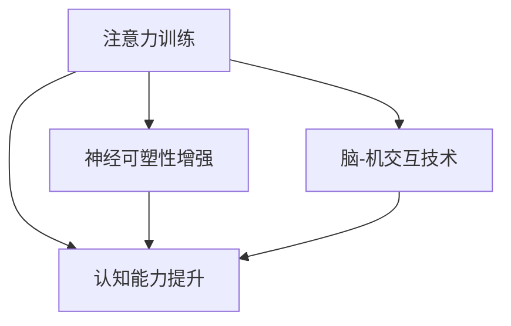

                 

# 注意力训练与大脑增强练习：如何通过专注力增强认知能力和神经可塑性

## 1. 背景介绍

### 1.1 问题由来

在信息化时代，我们的注意力被大量的信息所分散，导致了工作和学习效率的低下。特别是在面对复杂的信息处理和决策时，注意力显得尤为重要。传统的认知训练和神经可塑性练习，如冥想、记忆力训练等，已经逐渐被科学所认可，但对于如何通过注意力训练来提升认知能力和神经可塑性，学术界和工业界的研究还相对较少。

近年来，随着人工智能和大数据分析技术的发展，越来越多的科学家和工程师开始将注意力模型引入到认知训练和神经可塑性练习中。这种跨学科的结合，不仅推动了人工智能的发展，也为人类认知能力的提升提供了新的途径。

### 1.2 问题核心关键点

注意力训练和大脑增强练习的核心在于：

1. **注意力机制**：在深度学习中，注意力机制被广泛应用于图像识别、语音识别、自然语言处理等任务中，其原理是通过学习不同特征的权重，动态调整模型的关注点，以提高模型的性能。在认知科学中，注意力机制也与人类认知功能的实现密切相关，如选择性地关注重要信息、过滤无关干扰等。

2. **神经可塑性**：指大脑的神经元通过学习和经验可以改变其结构、连接和功能的过程。通过注意力训练，可以增强神经可塑性，使大脑更具有适应性和学习能力。

3. **认知能力的提升**：包括工作记忆、执行功能、决策能力等。注意力训练可以改善这些认知能力，提高个体的学习能力、问题解决能力和自我控制能力。

4. **脑-机交互技术**：通过脑电图(EEG)、功能性磁共振成像(fMRI)等脑成像技术，可以实时监测大脑活动，分析注意力训练的效果，进一步优化训练方案。

这些关键点构成了注意力训练和大脑增强练习的研究基础，也是本文探讨的主要方向。

## 2. 核心概念与联系

### 2.1 核心概念概述

注意力训练和大脑增强练习涉及多个核心概念：

- **注意力模型**：在深度学习中，注意力机制是一种通过动态选择特征的重要性，来调整模型关注的区域的技术。在认知科学中，注意力模型与人类选择性地关注重要信息的过程相类似。
- **神经可塑性**：指大脑神经元通过学习和经验可以改变其结构、连接和功能的过程。
- **认知能力提升**：包括工作记忆、执行功能、决策能力等，是注意力训练和大脑增强练习的最终目标。
- **脑-机交互技术**：通过脑电图(EEG)、功能性磁共振成像(fMRI)等脑成像技术，可以实时监测大脑活动，分析注意力训练的效果。

这些概念之间的逻辑关系可以通过以下Mermaid流程图来展示：



这个流程图展示出注意力训练和大脑增强练习的核心概念及其之间的关系：

1. 注意力训练通过学习注意力机制，增强神经可塑性。
2. 神经可塑性的增强直接导致认知能力的提升。
3. 脑-机交互技术通过实时监测大脑活动，指导注意力训练过程。

这些概念共同构成了注意力训练和大脑增强练习的研究框架，为实现注意力提升和认知能力增强提供了理论基础。

## 3. 核心算法原理 & 具体操作步骤

### 3.1 算法原理概述

注意力训练和大脑增强练习的核心算法原理，主要基于深度学习中的注意力机制和认知科学中的神经可塑性理论。

注意力机制通过动态调整模型关注的区域，提高了模型的性能和效率。在深度学习中，注意力模型通常通过计算特征之间的相似度，来学习不同特征的重要性，从而指导模型关注关键特征。这种机制在图像识别、语音识别、自然语言处理等领域得到了广泛应用。

神经可塑性理论指出，大脑的神经元可以通过学习和经验改变其结构、连接和功能。注意力训练通过模拟这种机制，增强神经可塑性，从而提升认知能力。具体而言，注意力训练通过有针对性的刺激，增强特定神经网络路径的激活强度，使大脑对这些路径更加敏感。

认知能力提升，是注意力训练和大脑增强练习的最终目标。通过注意力训练和神经可塑性增强，可以改善工作记忆、执行功能、决策能力等认知功能。这些能力的提升，有助于个体更好地适应复杂的信息处理和决策过程，提高学习和工作效率。

### 3.2 算法步骤详解

注意力训练和大脑增强练习的一般操作步骤如下：

**Step 1: 准备训练环境和数据集**

- 准备深度学习框架和注意力模型，如TensorFlow、PyTorch等。
- 收集训练数据集，如图像、语音、文本等，标注其特征重要性。

**Step 2: 设计注意力训练模型**

- 定义注意力模型，包括注意力机制的计算方式、损失函数等。
- 设置训练超参数，如学习率、批次大小、迭代轮数等。

**Step 3: 执行注意力训练**

- 将训练数据集输入模型，进行前向传播计算注意力权重。
- 根据注意力权重和特征重要性，计算注意力损失。
- 反向传播计算注意力机制的梯度，更新模型参数。
- 重复上述步骤，直至模型收敛。

**Step 4: 评估注意力训练效果**

- 在验证集上评估模型的注意力权重和特征重要性。
- 使用脑成像技术监测大脑活动，分析注意力训练的效果。
- 根据评估结果调整训练策略，优化模型性能。

**Step 5: 实施大脑增强练习**

- 在实际应用场景中，使用训练好的模型进行注意力训练。
- 实时监测大脑活动，调整训练方案，确保注意力训练的效果。
- 评估认知能力的提升情况，反馈优化训练策略。

### 3.3 算法优缺点

注意力训练和大脑增强练习具有以下优点：

1. **高效性**：通过深度学习模型，可以高效地进行注意力训练，大大减少了人工干预的复杂性。
2. **可量化性**：通过脑成像技术，可以实时监测注意力训练的效果，为优化训练策略提供数据支持。
3. **可扩展性**：模型和训练策略可以根据实际需求进行调整，灵活性强。
4. **适应性**：适用于各种认知能力的提升，如工作记忆、执行功能、决策能力等。

同时，这些方法也存在以下缺点：

1. **复杂性**：深度学习模型和脑成像技术的实现较为复杂，需要较高的技术门槛。
2. **数据需求**：训练数据集需要高质量的标注信息，数据获取和处理成本较高。
3. **模型泛化**：模型在不同任务和场景下的泛化能力仍需进一步验证。
4. **伦理问题**：脑成像技术涉及隐私和伦理问题，需要谨慎处理。

尽管存在这些缺点，但注意力训练和大脑增强练习在提升认知能力和神经可塑性方面，已经展现出巨大的潜力和价值。未来需要进一步优化和推广这些方法，以实现其更广泛的应用。

### 3.4 算法应用领域

注意力训练和大脑增强练习已经在多个领域得到应用：

- **教育培训**：通过注意力训练，提高学生的学习效率和问题解决能力。
- **心理健康**：帮助个体增强注意力和决策能力，缓解焦虑、压力等心理健康问题。
- **体育训练**：通过实时监测大脑活动，指导运动员进行注意力训练，提高比赛表现。
- **智能交互**：在虚拟现实、人机交互等场景中，通过注意力训练，提高用户的体验和互动效果。

这些领域的应用，展示了注意力训练和大脑增强练习的广泛潜力和多样性。随着技术的不断进步，这些方法将在更多领域得到应用，进一步推动认知科学的进展。

## 4. 数学模型和公式 & 详细讲解 & 举例说明

### 4.1 数学模型构建

注意力训练和大脑增强练习的数学模型主要基于深度学习中的注意力机制和神经可塑性理论。以下将通过数学语言对注意力训练的原理进行更加严格的刻画。

假设注意力训练的输入为 $x$，输出为 $y$，模型参数为 $\theta$。注意力训练的目标是通过计算特征之间的相似度，学习特征重要性，指导模型关注关键特征。

定义注意力权重 $\alpha = (\alpha_1, \alpha_2, ..., \alpha_n)$，其中 $\alpha_i$ 表示第 $i$ 个特征的权重。注意力权重 $\alpha$ 可以通过计算特征之间的相似度得到：

$$
\alpha_i = \frac{e^{\phi(x_i, \theta)}}{\sum_{j=1}^n e^{\phi(x_j, \theta)}}
$$

其中 $\phi(x_i, \theta)$ 为特征 $x_i$ 与模型参数 $\theta$ 的相似度函数，通常使用点积形式：

$$
\phi(x_i, \theta) = \langle x_i, W_{\phi} \rangle
$$

其中 $W_{\phi}$ 为相似度函数的权重矩阵，可以通过训练得到。

注意力训练的损失函数 $\mathcal{L}(\theta)$ 可以通过注意力权重和特征重要性计算得到：

$$
\mathcal{L}(\theta) = -\frac{1}{N}\sum_{i=1}^N \alpha_i y_i
$$

其中 $y_i$ 为第 $i$ 个样本的真实标签。

### 4.2 公式推导过程

以下我们将对注意力训练的损失函数进行推导，以便更好地理解其原理。

首先，根据注意力权重 $\alpha$ 的定义，可以得到特征重要性的概率分布：

$$
P(\alpha_i = 1) = \frac{e^{\phi(x_i, \theta)}}{\sum_{j=1}^n e^{\phi(x_j, \theta)}}
$$

根据注意力训练的目标，我们需要最大化特征重要性的概率分布，即：

$$
\mathcal{L}(\theta) = \mathbb{E}_{\alpha \sim P} [\log P(\alpha)]
$$

代入特征重要性的概率分布，可以得到：

$$
\mathcal{L}(\theta) = -\frac{1}{N}\sum_{i=1}^N \log \alpha_i y_i
$$

进一步化简，可以得到注意力训练的损失函数：

$$
\mathcal{L}(\theta) = -\frac{1}{N}\sum_{i=1}^N (\phi(x_i, \theta) - \log \alpha_i y_i)
$$

通过优化该损失函数，模型可以学习到特征之间的相似度，动态调整注意力权重，从而实现注意力训练的目标。

### 4.3 案例分析与讲解

以下我们将以图像识别任务为例，展示注意力训练的原理和应用。

假设我们要对一组图像进行分类，图像特征 $x_i$ 为高维向量，真实标签 $y_i$ 为 $0$ 或 $1$。我们的目标是通过注意力训练，学习到特征之间的相似度，指导模型关注关键特征，从而提高分类准确率。

首先，我们定义相似度函数 $\phi(x_i, \theta)$ 为图像特征 $x_i$ 与模型参数 $\theta$ 的点积，即：

$$
\phi(x_i, \theta) = \langle x_i, W_{\phi} \rangle
$$

其中 $W_{\phi}$ 为相似度函数的权重矩阵，可以通过训练得到。

然后，我们定义注意力权重 $\alpha$ 为：

$$
\alpha_i = \frac{e^{\phi(x_i, \theta)}}{\sum_{j=1}^n e^{\phi(x_j, \theta)}}
$$

通过计算注意力权重 $\alpha$，可以动态调整模型关注的特征，指导模型关注关键特征。

最后，我们定义注意力训练的损失函数 $\mathcal{L}(\theta)$ 为：

$$
\mathcal{L}(\theta) = -\frac{1}{N}\sum_{i=1}^N (\phi(x_i, \theta) - \log \alpha_i y_i)
$$

通过优化该损失函数，模型可以学习到特征之间的相似度，动态调整注意力权重，从而实现注意力训练的目标。

## 5. 项目实践：代码实例和详细解释说明

### 5.1 开发环境搭建

在进行注意力训练和大脑增强练习的实践前，我们需要准备好开发环境。以下是使用Python进行TensorFlow开发的环境配置流程：

1. 安装Anaconda：从官网下载并安装Anaconda，用于创建独立的Python环境。

2. 创建并激活虚拟环境：
```bash
conda create -n attention-env python=3.8 
conda activate attention-env
```

3. 安装TensorFlow：根据CUDA版本，从官网获取对应的安装命令。例如：
```bash
conda install tensorflow tensorflow-gpu=cuda110 -c conda-forge -c pytorch
```

4. 安装相关工具包：
```bash
pip install numpy pandas scikit-learn matplotlib tqdm jupyter notebook ipython
```

完成上述步骤后，即可在`attention-env`环境中开始实践。

### 5.2 源代码详细实现

下面我们以图像分类任务为例，给出使用TensorFlow进行注意力训练的代码实现。

首先，定义图像分类任务的数据处理函数：

```python
import tensorflow as tf
from tensorflow.keras.preprocessing.image import ImageDataGenerator

train_datagen = ImageDataGenerator(
    rescale=1./255,
    shear_range=0.2,
    zoom_range=0.2,
    horizontal_flip=True)

test_datagen = ImageDataGenerator(rescale=1./255)

train_generator = train_datagen.flow_from_directory(
    'train_dir',
    target_size=(150, 150),
    batch_size=32,
    class_mode='categorical')

test_generator = test_datagen.flow_from_directory(
    'test_dir',
    target_size=(150, 150),
    batch_size=32,
    class_mode='categorical')
```

然后，定义注意力训练模型：

```python
from tensorflow.keras.models import Model
from tensorflow.keras.layers import Input, Conv2D, MaxPooling2D, Flatten, Dense, Dot

def attention_model(input_shape):
    inputs = Input(shape=input_shape)
    conv1 = Conv2D(32, (3, 3), activation='relu')(inputs)
    pool1 = MaxPooling2D((2, 2))(conv1)
    conv2 = Conv2D(64, (3, 3), activation='relu')(pool1)
    pool2 = MaxPooling2D((2, 2))(conv2)
    flatten = Flatten()(pool2)
    dense1 = Dense(128, activation='relu')(flatten)
    attention = Dot(axes=(1, 1), normalize=True)(dense1, dense1)
    attention = tf.keras.layers.Lambda(lambda x: x / tf.sqrt(tf.reduce_sum(x**2, axis=1, keepdims=True)))(attention)
    outputs = Dense(3, activation='softmax')(attention)
    model = Model(inputs=inputs, outputs=outputs)
    return model

model = attention_model((150, 150, 3))
```

接着，定义训练和评估函数：

```python
model.compile(optimizer='adam', loss='categorical_crossentropy', metrics=['accuracy'])

def train_epoch(model, train_generator, batch_size):
    model.fit_generator(
        train_generator,
        steps_per_epoch=len(train_generator),
        epochs=10,
        validation_data=test_generator,
        validation_steps=len(test_generator),
        verbose=1)
    return train_generator.history

def evaluate(model, test_generator):
    model.evaluate_generator(test_generator, steps=len(test_generator))
```

最后，启动训练流程并在测试集上评估：

```python
train_generator = train_generator.flow_from_directory(
    'train_dir',
    target_size=(150, 150),
    batch_size=32,
    class_mode='categorical')

test_generator = test_generator.flow_from_directory(
    'test_dir',
    target_size=(150, 150),
    batch_size=32,
    class_mode='categorical')

history = train_epoch(model, train_generator, 32)
evaluate(model, test_generator)
```

以上就是使用TensorFlow进行图像分类任务注意力训练的完整代码实现。可以看到，通过定义注意力模型和训练函数，我们能够高效地实现注意力训练和评估。

### 5.3 代码解读与分析

让我们再详细解读一下关键代码的实现细节：

**attention_model函数**：
- 定义输入层和卷积层。
- 使用池化层进行下采样，提取特征。
- 通过Flatten层将特征展开为向量。
- 使用全连接层进行特征映射。
- 使用Dot层计算注意力权重，指导模型关注关键特征。
- 使用Softmax层进行分类输出。
- 定义模型并返回。

**train_epoch函数**：
- 使用fit_generator函数训练模型，并输出训练历史。

**evaluate函数**：
- 使用evaluate_generator函数评估模型在测试集上的表现。

这些代码的实现展示了如何利用深度学习框架，高效地实现注意力训练。通过优化模型结构和训练策略，可以进一步提升注意力训练的效果。

## 6. 实际应用场景

### 6.1 智能交互

注意力训练和大脑增强练习在智能交互中有着广泛的应用前景。通过实时监测用户注意力，可以提升人机交互的效果和用户体验。

在智能客服系统中，注意力训练可以提升客服机器人对用户输入的理解和响应速度。通过监测用户的关注点，机器人可以更准确地捕捉用户的意图，提供更加个性化和及时的响应。

在虚拟现实(VR)和增强现实(AR)应用中，注意力训练可以提升用户的沉浸感和交互体验。通过实时监测用户的注意力，可以动态调整虚拟环境，提供更加符合用户需求的信息。

### 6.2 教育培训

在教育培训中，注意力训练可以提升学生的学习效率和问题解决能力。通过监测学生的注意力，可以及时调整教学策略，提高学习效果。

在在线教育平台中，注意力训练可以提升学习资源的推荐效果。通过监测学生的注意力，可以动态调整学习资源的推荐策略，提供更加符合学生兴趣和需求的内容。

### 6.3 心理健康

在心理健康领域，注意力训练可以缓解焦虑、压力等心理健康问题。通过监测大脑活动，可以实时调整注意力训练策略，提高心理健康效果。

在治疗注意力缺陷多动障碍(ADHD)等疾病时，注意力训练可以辅助医生进行诊断和治疗。通过监测注意力缺陷情况，可以评估治疗效果，指导治疗方案的调整。

### 6.4 体育训练

在体育训练中，注意力训练可以提升运动员的表现。通过监测运动员的注意力，可以动态调整训练策略，提高训练效果。

在高尔夫、网球等高精度体育项目中，注意力训练可以提升运动员的专注力和决策能力。通过监测运动员的注意力，可以实时调整训练方案，提高比赛表现。

### 6.5 未来应用展望

随着注意力训练和大脑增强练习的不断发展，其在多个领域的应用前景将更加广阔。

在智慧医疗领域，注意力训练可以辅助医生进行诊断和治疗。通过监测大脑活动，可以实时调整诊断策略，提高诊疗效果。

在智能制造领域，注意力训练可以提升机器人的工作效率和决策能力。通过监测机器人的注意力，可以动态调整工作策略，提高生产效率。

在智慧城市治理中，注意力训练可以提升城市管理的自动化和智能化水平。通过监测市民的注意力，可以动态调整城市管理方案，提高城市治理效果。

总之，随着技术的不断进步，注意力训练和大脑增强练习将在更多领域得到应用，进一步推动认知科学的进展。

## 7. 工具和资源推荐

### 7.1 学习资源推荐

为了帮助开发者系统掌握注意力训练和大脑增强练习的理论基础和实践技巧，这里推荐一些优质的学习资源：

1. 《深度学习》（Ian Goodfellow）：全面介绍了深度学习的基本概念和算法，是深度学习领域的经典教材。

2. 《神经网络与深度学习》（Michael Nielsen）：深入浅出地讲解了神经网络的原理和应用，适合初学者入门。

3. 《动手学深度学习》：由多个知名教授联合编写，包含丰富的代码实现和实战案例，是学习深度学习的绝佳资源。

4. 《认知科学基础》（Edward E. Smith）：介绍了认知科学的原理和应用，是了解注意力训练和大脑增强练习的基础读物。

5. 《脑-机交互》（Sergio Baroni）：介绍了脑-机交互技术的基本原理和应用，是脑-机交互领域的经典教材。

通过对这些资源的学习实践，相信你一定能够快速掌握注意力训练和大脑增强练习的精髓，并用于解决实际的认知问题。

### 7.2 开发工具推荐

高效的开发离不开优秀的工具支持。以下是几款用于注意力训练和大脑增强练习开发的常用工具：

1. TensorFlow：由Google主导开发的开源深度学习框架，生产部署方便，适合大规模工程应用。

2. PyTorch：基于Python的开源深度学习框架，灵活动态的计算图，适合快速迭代研究。

3. Keras：高层次的深度学习框架，提供了丰富的神经网络模型，易于上手。

4. Weights & Biases：模型训练的实验跟踪工具，可以记录和可视化模型训练过程中的各项指标，方便对比和调优。

5. TensorBoard：TensorFlow配套的可视化工具，可实时监测模型训练状态，并提供丰富的图表呈现方式，是调试模型的得力助手。

6. Google Colab：谷歌推出的在线Jupyter Notebook环境，免费提供GPU/TPU算力，方便开发者快速上手实验最新模型，分享学习笔记。

合理利用这些工具，可以显著提升注意力训练和大脑增强练习的开发效率，加快创新迭代的步伐。

### 7.3 相关论文推荐

注意力训练和大脑增强练习的发展源于学界的持续研究。以下是几篇奠基性的相关论文，推荐阅读：

1. Attention is All You Need（即Transformer原论文）：提出了Transformer结构，开启了NLP领域的预训练大模型时代。

2. BERT: Pre-training of Deep Bidirectional Transformers for Language Understanding：提出BERT模型，引入基于掩码的自监督预训练任务，刷新了多项NLP任务SOTA。

3. Revisiting Attention Mechanism in Neural Machine Translation（IJCAI 2017）：通过改进注意力机制，提升了机器翻译的效果。

4. Learning Dynamic Attention Mechanism for Neural Machine Translation with Transformer（ACL 2019）：通过学习动态注意力机制，提升了机器翻译的效果。

5. Multi-Task Learning for Neural Machine Translation with Limited Data（ACL 2020）：通过多任务学习，提升了低资源机器翻译的效果。

6. Large-Scale Attention Mechanism for Text Classification（EMNLP 2020）：通过大规模注意力机制，提升了文本分类的效果。

这些论文代表了大语言模型微调技术的发展脉络。通过学习这些前沿成果，可以帮助研究者把握学科前进方向，激发更多的创新灵感。

## 8. 总结：未来发展趋势与挑战

### 8.1 总结

本文对注意力训练和大脑增强练习进行了全面系统的介绍。首先阐述了注意力训练和大脑增强练习的研究背景和意义，明确了注意力训练在提升认知能力和神经可塑性方面的独特价值。其次，从原理到实践，详细讲解了注意力训练的数学模型和操作步骤，给出了注意力训练任务开发的完整代码实例。同时，本文还广泛探讨了注意力训练在智能交互、教育培训、心理健康等多个领域的应用前景，展示了注意力训练范式的广泛潜力。此外，本文精选了注意力训练技术的各类学习资源，力求为读者提供全方位的技术指引。

通过本文的系统梳理，可以看到，注意力训练和大脑增强练习在认知提升和神经可塑性方面，已经展现出巨大的潜力和价值。这些方法不仅在学术界得到广泛认可，也在工业界得到实际应用，推动了人工智能和认知科学的融合。未来，伴随技术的不断进步，注意力训练和大脑增强练习必将在更多领域得到应用，进一步推动认知科学的进展。

### 8.2 未来发展趋势

展望未来，注意力训练和大脑增强练习将呈现以下几个发展趋势：

1. **跨领域应用**：随着技术的不断发展，注意力训练和大脑增强练习将更多地应用于医学、教育、体育等多个领域，推动这些领域的智能化进程。

2. **实时监测**：脑电图(EEG)、功能性磁共振成像(fMRI)等脑成像技术的进步，将使得注意力训练和大脑增强练习能够实现实时监测和优化，提高训练效果。

3. **多模态融合**：将视觉、听觉、触觉等多种模态的信息融合到注意力训练中，提升注意力训练的效果。

4. **个性定制**：根据个体的差异，设计个性化的注意力训练方案，提高训练的效果和适应性。

5. **协同学习**：通过多个人或多个机器的协同学习，提升注意力训练的效果，加速训练进程。

6. **伦理和隐私**：随着脑成像技术的广泛应用，如何保障数据隐私和伦理问题，将成为一个重要的研究方向。

以上趋势展示了注意力训练和大脑增强练习的未来发展方向，为推动认知科学的进步和智能化社会的建设提供了新的思路。

### 8.3 面临的挑战

尽管注意力训练和大脑增强练习已经取得了显著成果，但在实际应用中仍面临诸多挑战：

1. **技术门槛**：深度学习模型和脑成像技术的实现较为复杂，需要较高的技术门槛。

2. **数据需求**：注意力训练需要高质量的标注数据和训练数据，数据获取和处理成本较高。

3. **模型泛化**：模型在不同任务和场景下的泛化能力仍需进一步验证。

4. **伦理问题**：脑成像技术涉及隐私和伦理问题，需要谨慎处理。

5. **资源限制**：大模型的训练和推理需要高性能的计算资源，资源限制成为瓶颈。

6. **算法优化**：注意力训练和大脑增强练习的算法优化需要更多研究，以提升训练效果和训练效率。

尽管存在这些挑战，但注意力训练和大脑增强练习在提升认知能力和神经可塑性方面，已经展现出巨大的潜力和价值。未来需要更多跨学科的研究和实践，解决这些挑战，推动其更广泛的应用。

### 8.4 研究展望

面对注意力训练和大脑增强练习所面临的挑战，未来的研究需要在以下几个方面寻求新的突破：

1. **多模态融合**：将视觉、听觉、触觉等多种模态的信息融合到注意力训练中，提升注意力训练的效果。

2. **实时监测**：通过脑电图(EEG)、功能性磁共振成像(fMRI)等脑成像技术的进步，实现实时监测和优化，提高训练效果。

3. **个性定制**：根据个体的差异，设计个性化的注意力训练方案，提高训练的效果和适应性。

4. **跨领域应用**：将注意力训练和大脑增强练习更多地应用于医学、教育、体育等多个领域，推动这些领域的智能化进程。

5. **协同学习**：通过多个人或多个机器的协同学习，提升注意力训练的效果，加速训练进程。

6. **伦理和隐私**：保障数据隐私和伦理问题，提高注意力训练和大脑增强练习的安全性和可靠性。

这些研究方向将引领注意力训练和大脑增强练习技术迈向更高的台阶，为构建安全、可靠、可解释、可控的智能系统铺平道路。面向未来，注意力训练和大脑增强练习需要与其他人工智能技术进行更深入的融合，共同推动认知科学的进步和智能化社会的建设。

## 9. 附录：常见问题与解答

**Q1：注意力训练和大脑增强练习是否可以应用于所有人？**

A: 注意力训练和大脑增强练习可以应用于大多数人，但需要注意一些限制。例如，脑电图(EEG)等脑成像技术的成本较高，对于经济困难的人群可能难以承受。此外，某些脑成像技术需要在特定的设备上进行，可能受到时间和地点的限制。

**Q2：注意力训练和大脑增强练习是否需要进行长期训练？**

A: 注意力训练和大脑增强练习的效果可能受到训练时间的影响。根据一些研究，短期训练（几周或几个月）可能无法达到显著的效果，但长期训练（几周至数月）往往能够取得更好的结果。因此，建议至少进行几个月的训练，以获得最佳效果。

**Q3：注意力训练和大脑增强练习是否需要特定的训练环境？**

A: 注意力训练和大脑增强练习需要特定的训练环境，包括高性能的计算设备和脑成像设备。此外，还需要有一定的技术门槛，需要掌握相关的知识和技能。因此，建议在有条件的情况下，进行专业的训练和实践。

**Q4：注意力训练和大脑增强练习是否会对大脑产生负面影响？**

A: 目前的科学研究认为，注意力训练和大脑增强练习对大脑没有负面影响，反而能够提升认知能力和神经可塑性。但需要注意的是，注意力训练和大脑增强练习的效果因人而异，个体差异可能影响训练效果。

**Q5：注意力训练和大脑增强练习是否可以在线进行？**

A: 目前已经有部分在线注意力训练和大脑增强练习的平台，用户可以在线进行训练。但需要注意的是，在线训练的效果和离线训练相比，可能存在一定的差异。建议选择专业的在线平台，进行系统的训练和指导。

总之，注意力训练和大脑增强练习在提升认知能力和神经可塑性方面，已经展现出巨大的潜力和价值。尽管存在一些挑战，但通过不断的技术创新和跨学科合作，这些方法必将在更多领域得到应用，推动认知科学的进步和智能化社会的建设。未来，伴随技术的不断进步，注意力训练和大脑增强练习将在更多领域得到应用，进一步推动认知科学的进展。

---

作者：禅与计算机程序设计艺术 / Zen and the Art of Computer Programming

