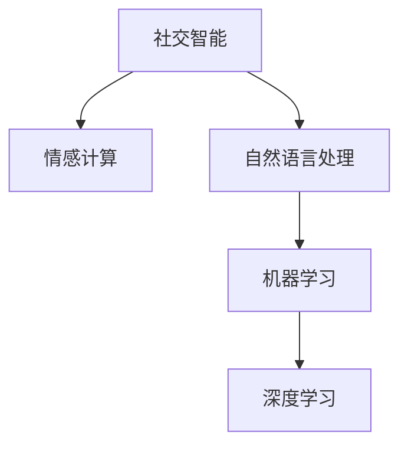

                 

# 洞察力与情商：社交智能的核心

## 1. 背景介绍

### 1.1 问题由来
随着社交媒体的普及，人们之间的互动变得前所未有的频繁和深入。然而，这种互动也带来了新的挑战。如何更准确地理解他人的情感，有效地沟通，提升人际交往的效率和质量，成为了一个重要课题。传统的情感识别和沟通技术往往依赖于固定规则和模板，难以应对复杂多变的社交场景。

### 1.2 问题核心关键点
社交智能的核心理念是通过算法模型模拟人类的情感理解和社交推理能力，从而实现更精准、自然的社交互动。该技术融合了自然语言处理(NLP)、机器学习、情感计算等多学科知识，旨在构建一个具备人类情感感知和社交智能的智能系统。

### 1.3 问题研究意义
研究社交智能，对于构建智能化的社交应用、提升用户互动体验、改善心理健康、促进社会融合等具有重要意义：

1. **提升社交体验**：通过精准理解和响应用户的情感需求，提升社交应用的用户满意度和忠诚度。
2. **心理健康支持**：利用情感识别技术监测用户心理健康状态，提供及时的心理支持和干预。
3. **社会融合**：通过智能化的交流工具，打破语言和文化的隔阂，促进不同群体之间的沟通与理解。
4. **市场应用**：在客服、教育、医疗等多个行业，社交智能技术有望带来新的商业机会和价值。

## 2. 核心概念与联系

### 2.1 核心概念概述

为更好地理解社交智能的核心，本节将介绍几个密切相关的核心概念：

- **社交智能(Social Intelligence)**：指理解和分析社交信息，识别他人的情感和意图，并据此做出适当反应的能力。
- **情感计算(Affective Computing)**：利用计算机技术分析和处理人类情感，是社交智能的关键组成部分。
- **自然语言处理(NLP)**：处理和理解人类自然语言的技术，是社交智能应用的基础。
- **机器学习(Machine Learning)**：通过算法模型学习数据规律，提升社交智能系统的预测能力和决策质量。
- **深度学习(Deep Learning)**：一种机器学习技术，使用多层神经网络模型，实现对复杂数据的高效学习。

这些核心概念之间的逻辑关系可以通过以下Mermaid流程图来展示：



这个流程图展示了几项核心概念及其之间的关系：

1. 社交智能是核心目标，其他概念均为其组成部分或技术手段。
2. 情感计算和自然语言处理是社交智能的基础，提供数据源和分析手段。
3. 机器学习和深度学习提供算法和模型支持，提升社交智能的精度和泛化能力。

## 3. 核心算法原理 & 具体操作步骤
### 3.1 算法原理概述

社交智能的算法原理可以概括为情感分析和社交推理两个部分。情感分析旨在识别和理解文本中的情感信息，社交推理则是在情感信息的基础上，分析社交关系和行为，做出适当的响应。

**情感分析**：通过机器学习模型，从文本中提取出情感词、情感强度等信息，进行情感分类或评分。常用的模型包括基于规则的情感词典、基于SVM的分类模型和基于深度学习的神经网络模型。

**社交推理**：通过模型学习社交网络结构、用户行为和上下文信息，推断用户意图和关系。常用的模型包括图神经网络、注意力机制和循环神经网络。

### 3.2 算法步骤详解

#### 3.2.1 数据准备
1. **数据收集**：收集社交媒体上的文本数据，如微博、微信、论坛等。可以使用网络爬虫技术获取数据。
2. **数据标注**：手动或半自动标注数据，标记出情感词、情感强度、用户意图等信息。

#### 3.2.2 特征工程
1. **文本特征提取**：使用分词、词性标注、情感词典等技术，从文本中提取特征。
2. **社交特征提取**：利用社交网络数据，提取用户关系、好友列表、群组信息等。

#### 3.2.3 模型训练
1. **情感分类**：使用监督学习模型（如SVM、神经网络等）进行情感分类训练。
2. **社交推理**：使用深度学习模型（如GRU、LSTM、GNN等）进行社交推理训练。

#### 3.2.4 模型评估
1. **情感分类评估**：使用准确率、召回率、F1-score等指标评估情感分类效果。
2. **社交推理评估**：使用推理准确率、响应质量等指标评估社交推理效果。

### 3.3 算法优缺点

#### 3.3.1 优点
1. **精度高**：深度学习和机器学习模型可以自动学习复杂数据规律，情感分析和社交推理的精度较高。
2. **泛化能力强**：基于大量数据训练的模型具有较强的泛化能力，适用于多种社交场景。
3. **高效性**：机器学习模型的自动化特征提取和模型训练，提升了效率。

#### 3.3.2 缺点
1. **数据依赖**：社交智能模型高度依赖标注数据，标注成本高，数据获取难度大。
2. **对抗样本敏感**：深度学习模型对抗样本较为敏感，难以处理恶意攻击和误导性信息。
3. **解释性不足**：黑箱模型难以解释其内部决策过程，缺乏透明度。
4. **伦理挑战**：社交智能模型涉及用户隐私和伦理问题，数据使用和模型应用需要慎重考虑。

### 3.4 算法应用领域

社交智能技术已在多个领域得到应用，包括但不限于：

- **社交媒体情感分析**：通过分析社交媒体上的情感信息，监测舆论动态和用户情绪变化。
- **客户服务**：基于用户情感分析，自动回答用户问题，提供个性化服务。
- **智能客服**：利用社交智能技术，构建智能客服系统，提升服务效率和质量。
- **心理健康**：通过情感识别技术，监测用户心理健康状态，提供心理支持和干预。
- **社交网络分析**：分析社交网络中的关系和行为，预测用户行为和趋势。

## 4. 数学模型和公式 & 详细讲解 & 举例说明
### 4.1 数学模型构建

社交智能模型的构建包括以下几个关键步骤：

1. **数据预处理**：对原始文本数据进行清洗、分词、标注等预处理。
2. **特征表示**：将文本数据转换为模型可以处理的数值形式，如词向量表示、TF-IDF向量等。
3. **模型训练**：使用机器学习或深度学习模型对特征进行训练，学习情感分类和社交推理的规律。
4. **模型评估**：使用测试集对模型进行评估，调整模型参数，提升性能。

### 4.2 公式推导过程

以情感分类为例，假设情感分类问题可以表示为二分类问题，即判断一段文本是否为正面情感。设情感标签 $y \in \{0, 1\}$，其中1表示正面情感，0表示负面情感。文本特征向量为 $x \in \mathbb{R}^d$，模型的线性分类函数为 $f(x;w) = w^Tx + b$，其中 $w$ 为模型参数， $b$ 为偏置项。模型的决策边界为 $f(x;w) > 0$，即 $w^Tx + b > 0$。

假设我们有 $N$ 个训练样本 $(x_i, y_i)$，其中 $y_i \in \{0, 1\}$，$x_i \in \mathbb{R}^d$。则情感分类的损失函数为交叉熵损失：

$$
\mathcal{L}(w, b) = -\frac{1}{N} \sum_{i=1}^N [y_i \log \sigma(f(x_i;w)) + (1-y_i) \log(1-\sigma(f(x_i;w)))
$$

其中 $\sigma$ 为sigmoid函数， $\log$ 为自然对数。

使用随机梯度下降优化算法更新模型参数 $w$ 和 $b$，最小化损失函数 $\mathcal{L}(w, b)$，最终得到情感分类的决策边界。

### 4.3 案例分析与讲解

#### 4.3.1 情感词典
情感词典是一种基于规则的情感分析方法，通过预先定义好的情感词表，对文本中的情感词进行标注，并计算情感强度。例如，SentiWordNet是一个常用的情感词典，包含单词情感强度值和情感极性。情感词典的应用流程如下：

1. **构建情感词典**：收集和标注情感词汇，并计算其情感强度。
2. **文本预处理**：对文本进行分词和词性标注。
3. **情感分析**：遍历文本中的情感词，根据情感词典计算情感强度。
4. **情感评分**：对文本情感强度进行评分，得出情感分类结果。

#### 4.3.2 基于SVM的情感分类
支持向量机(SVM)是一种经典的机器学习分类算法，可以用于情感分类任务。假设情感分类问题为二分类问题，情感标签为 $y \in \{0, 1\}$，文本特征表示为 $x \in \mathbb{R}^d$。SVM的训练目标为：

$$
\min_{w, b} \frac{1}{2}||w||^2 + C \sum_{i=1}^N \xi_i
$$

其中 $w$ 为分类超平面，$b$ 为偏置项，$\xi_i$ 为误差变量，$C$ 为正则化参数。

通过优化上述目标函数，可以得到分类超平面 $w^Tx + b = 0$，将样本分为正负两类。

## 5. 项目实践：代码实例和详细解释说明
### 5.1 开发环境搭建

社交智能项目通常使用Python和相关的深度学习框架进行开发。以下是开发环境搭建的基本步骤：

1. **安装Python和相关依赖**：使用pip安装Python和必要的依赖库，如TensorFlow、PyTorch、scikit-learn等。
2. **设置数据集和标注工具**：准备数据集和标注工具，如NLTK、spaCy等。
3. **搭建模型架构**：设计模型结构，使用TensorFlow或PyTorch搭建模型。
4. **训练和评估模型**：使用训练数据集训练模型，在测试数据集上评估模型效果。

### 5.2 源代码详细实现

以下是一个使用PyTorch进行情感分类的代码实现示例：

```python
import torch
import torch.nn as nn
import torch.optim as optim
from torchtext.datasets import IMDB
from torchtext.data import Field, BucketIterator

# 定义模型结构
class SentimentClassifier(nn.Module):
    def __init__(self, embedding_dim=300, hidden_dim=128, output_dim=1):
        super(SentimentClassifier, self).__init__()
        self.embedding = nn.Embedding(vocab_size=10000, embedding_dim=embedding_dim)
        self.fc1 = nn.Linear(embedding_dim, hidden_dim)
        self.fc2 = nn.Linear(hidden_dim, output_dim)
        self.sigmoid = nn.Sigmoid()

    def forward(self, text):
        embedding = self.embedding(text)
        hidden = self.fc1(embedding)
        output = self.fc2(hidden)
        return self.sigmoid(output)

# 定义数据预处理函数
TEXT = Field(tokenize='spacy', lower=True, batch_first=True)
LABEL = Field(sequential=False, use_vocab=False)

train_data, test_data = IMDB.splits(TEXT, LABEL)
TEXT.build_vocab(train_data, max_size=10000)
LABEL.build_vocab(train_data)
train_iterator, test_iterator = BucketIterator.splits((train_data, test_data), batch_size=64, device='cuda')

# 定义模型和优化器
model = SentimentClassifier()
optimizer = optim.Adam(model.parameters(), lr=0.001)

# 定义训练函数
def train(model, iterator, optimizer, criterion):
    model.train()
    for batch in iterator:
        optimizer.zero_grad()
        predictions = model(batch.text)
        loss = criterion(predictions, batch.label)
        loss.backward()
        optimizer.step()

# 训练模型
N_EPOCHS = 10
for epoch in range(N_EPOCHS):
    train(model, train_iterator, optimizer, criterion)
```

### 5.3 代码解读与分析

#### 5.3.1 模型结构
- `SentimentClassifier` 类定义了情感分类模型的结构。模型包括一个嵌入层、两个全连接层和一个sigmoid输出层。
- `nn.Embedding` 类用于将文本转换为嵌入向量。
- `nn.Linear` 类用于定义全连接层。
- `nn.Sigmoid` 类用于计算二分类概率。

#### 5.3.2 数据预处理
- `TEXT` 和 `LABEL` 定义了文本和标签的预处理函数。使用 `spacy` 进行分词和转换，使用 `TensorText` 库构建词汇表。
- `TEXT.build_vocab(train_data)` 和 `LABEL.build_vocab(train_data)` 构建词汇表和标签映射。
- `BucketIterator.splits()` 函数用于批量化数据，适应GPU加速。

#### 5.3.3 模型训练
- `model.train()` 开启模型训练模式。
- `optimizer.zero_grad()` 清空优化器梯度。
- `predictions = model(batch.text)` 前向传播计算预测结果。
- `loss = criterion(predictions, batch.label)` 计算损失函数。
- `loss.backward()` 反向传播计算梯度。
- `optimizer.step()` 更新模型参数。

## 6. 实际应用场景
### 6.1 智能客服系统

智能客服系统利用社交智能技术，通过分析用户情感和意图，提供个性化服务。在实际应用中，智能客服系统可以通过以下步骤实现：

1. **情感分析**：使用社交智能模型分析用户情感，识别情感类别和强度。
2. **意图识别**：根据用户问题，使用社交智能模型识别用户意图，如问题解答、订单处理、账户管理等。
3. **智能回答**：根据情感和意图，系统自动生成回答，提升用户满意度。

### 6.2 心理健康监测

心理健康监测利用社交智能技术，通过分析用户社交媒体上的情感信息，监测其心理健康状态。在实际应用中，心理健康监测系统可以通过以下步骤实现：

1. **情感监测**：使用社交智能模型分析用户情感信息，识别情感类别和强度。
2. **行为分析**：通过社交网络分析，监测用户行为模式和社交关系。
3. **预警干预**：根据情感和行为数据，系统自动预警并干预用户，提供心理支持和建议。

### 6.3 智能推荐系统

智能推荐系统利用社交智能技术，通过分析用户社交关系和行为，提供个性化推荐。在实际应用中，智能推荐系统可以通过以下步骤实现：

1. **社交关系分析**：使用社交智能模型分析用户社交关系，识别好友、群组、话题等信息。
2. **行为分析**：通过社交智能模型分析用户行为，识别兴趣和偏好。
3. **推荐生成**：根据社交关系和行为数据，系统生成个性化推荐内容，提升用户体验。

### 6.4 未来应用展望

未来，社交智能技术将在更多领域得到应用，为社会带来更多福祉：

1. **智能教育**：通过分析学生情感和行为，提供个性化学习建议，提升学习效果。
2. **智慧医疗**：通过分析患者情感和行为，提供心理支持和医疗建议，提升医疗服务质量。
3. **公共安全**：通过分析社交媒体上的舆情信息，预测社会动向，提供预警和干预。
4. **智慧城市**：通过分析市民情感和行为，提供智能交通、环境监测等服务，提升城市管理水平。

## 7. 工具和资源推荐
### 7.1 学习资源推荐

为了帮助开发者系统掌握社交智能的理论基础和实践技巧，这里推荐一些优质的学习资源：

1. **《情感计算导论》**：张志华、张伟等著，介绍了情感计算的基础知识和应用场景。
2. **《社交媒体情感分析》**：张宇等著，介绍了社交媒体情感分析的技术和算法。
3. **《机器学习基础》**：李航著，介绍了机器学习的基本原理和常用算法。
4. **《深度学习入门》**：斋藤康毅著，介绍了深度学习的基础知识和实践技巧。
5. **《自然语言处理综述》**：贾宇辰等著，介绍了自然语言处理的基本概念和常用技术。

通过对这些资源的学习实践，相信你一定能够快速掌握社交智能的精髓，并用于解决实际的情感分析和社交推理问题。

### 7.2 开发工具推荐

高效的开发离不开优秀的工具支持。以下是几款用于社交智能开发的常用工具：

1. **TensorFlow**：由Google主导开发的开源深度学习框架，生产部署方便，适合大规模工程应用。
2. **PyTorch**：基于Python的开源深度学习框架，灵活动态的计算图，适合快速迭代研究。
3. **NLTK**：自然语言处理工具包，提供了丰富的文本处理和分析功能。
4. **spaCy**：自然语言处理工具包，提供了高效的文本分析和标注功能。
5. **scikit-learn**：机器学习工具库，提供了多种经典算法的实现。

合理利用这些工具，可以显著提升社交智能应用的开发效率，加快创新迭代的步伐。

### 7.3 相关论文推荐

社交智能技术的发展源于学界的持续研究。以下是几篇奠基性的相关论文，推荐阅读：

1. **《情感计算的概念、模型、系统和应用》**：Lee等著，介绍了情感计算的基本概念和应用场景。
2. **《基于深度学习的社交网络分析》**：Choi等著，介绍了基于深度学习的社交网络分析技术。
3. **《情感分析的最新进展》**：Zhao等著，介绍了情感分析的技术和应用。
4. **《社交智能系统的设计与实现》**：Bengio等著，介绍了社交智能系统的设计思路和实现方法。

这些论文代表了大语言模型微调技术的发展脉络。通过学习这些前沿成果，可以帮助研究者把握学科前进方向，激发更多的创新灵感。

## 8. 总结：未来发展趋势与挑战
### 8.1 总结

本文对社交智能的核心技术进行了全面系统的介绍。首先阐述了社交智能的研究背景和意义，明确了社交智能在提升用户体验、心理健康支持等方面的价值。其次，从原理到实践，详细讲解了社交智能的数学模型和算法步骤，给出了社交智能应用开发的完整代码实现。同时，本文还探讨了社交智能在智能客服、心理健康、智能推荐等多个行业领域的应用前景，展示了社交智能技术的发展潜力。

通过本文的系统梳理，可以看到，社交智能技术正在成为人工智能领域的重要方向，为社交应用带来了新的突破。未来，伴随社交智能技术的持续演进，社交智能系统将变得更加智能化、个性化，为社会带来更多福祉。

### 8.2 未来发展趋势

展望未来，社交智能技术将呈现以下几个发展趋势：

1. **数据驱动**：通过大规模数据的积累和分析，提升社交智能模型的精度和泛化能力。
2. **多模态融合**：融合文本、语音、图像等多种模态数据，提升社交智能系统的感知和理解能力。
3. **实时性增强**：通过优化模型结构和计算图，提升社交智能系统的实时性，实现即时的情感分析和社交推理。
4. **伦理和隐私保护**：在模型训练和使用过程中，充分考虑用户隐私和伦理问题，保障数据安全。
5. **跨领域应用**：在医疗、教育、金融等多个领域推广社交智能技术，实现更广泛的智能化应用。

### 8.3 面临的挑战

尽管社交智能技术已经取得了瞩目成就，但在迈向更加智能化、普适化应用的过程中，它仍面临着诸多挑战：

1. **数据获取**：大规模、高质量的数据获取难度大，数据隐私和伦理问题需慎重考虑。
2. **模型鲁棒性**：模型对对抗样本和误导性信息的鲁棒性不足，容易受到攻击。
3. **解释性**：模型决策过程缺乏透明度，难以解释其内部机制和决策逻辑。
4. **跨领域适应**：模型在不同领域的应用效果可能存在差异，适应性有待提升。
5. **隐私保护**：社交智能模型涉及用户隐私，数据使用和模型应用需确保隐私保护。

### 8.4 研究展望

面对社交智能面临的挑战，未来的研究需要在以下几个方面寻求新的突破：

1. **无监督学习**：探索无监督和半监督学习方法，降低数据标注成本，提升模型泛化能力。
2. **可解释性增强**：开发可解释性更强的模型，提升模型的透明度和可理解性。
3. **多模态融合**：研究多模态数据融合技术，提升系统的感知和理解能力。
4. **隐私保护**：开发隐私保护技术，保障数据安全，增强模型伦理和隐私保护。
5. **实时系统设计**：优化模型结构和计算图，提升系统的实时性，实现即时的情感分析和社交推理。

这些研究方向的探索，必将引领社交智能技术迈向更高的台阶，为构建智能化的社交系统提供更多的技术支持。

## 9. 附录：常见问题与解答
----------------------------------------------------------------

**Q1：如何评估社交智能系统的性能？**

A: 社交智能系统的性能评估主要依赖于情感分析和社交推理两个维度。常见的评估指标包括：

- **情感分析**：准确率、召回率、F1-score等指标。
- **社交推理**：推理准确率、响应质量等指标。

可以使用各种数据集进行模型训练和评估，如IMDB情感分类数据集、Twitter情感分析数据集等。

**Q2：社交智能系统面临的主要挑战是什么？**

A: 社交智能系统面临的主要挑战包括：

- **数据获取难度大**：大规模、高质量的数据获取难度大，数据隐私和伦理问题需慎重考虑。
- **模型鲁棒性不足**：模型对对抗样本和误导性信息的鲁棒性不足，容易受到攻击。
- **解释性不足**：模型决策过程缺乏透明度，难以解释其内部机制和决策逻辑。
- **跨领域适应性差**：模型在不同领域的应用效果可能存在差异，适应性有待提升。
- **隐私保护问题**：社交智能模型涉及用户隐私，数据使用和模型应用需确保隐私保护。

**Q3：社交智能系统如何实现跨领域适应？**

A: 社交智能系统实现跨领域适应的方法包括：

- **领域自适应**：通过在目标领域进行小规模微调，适应新的数据分布。
- **多模态融合**：融合多种数据源，提升模型的适应性。
- **迁移学习**：利用预训练模型和目标领域的少量数据，进行迁移学习，提升模型泛化能力。
- **零样本学习**：通过零样本学习技术，利用目标领域的少量示例，实现模型的跨领域迁移。

通过这些方法，可以提升社交智能系统在不同领域的适应性和泛化能力。

**Q4：社交智能系统如何保护用户隐私？**

A: 社交智能系统保护用户隐私的方法包括：

- **数据匿名化**：对用户数据进行匿名化处理，保护用户隐私。
- **差分隐私**：使用差分隐私技术，限制模型对个人数据的泄露。
- **隐私计算**：利用隐私计算技术，在数据不出本地的情况下进行模型训练和推理。
- **用户授权**：确保用户对数据的使用和共享具有明确的授权，保障用户知情权。

通过这些方法，可以保障社交智能系统在保护用户隐私的同时，实现高效的数据分析和推理。

**Q5：社交智能系统如何提升模型的解释性？**

A: 提升社交智能系统模型的解释性方法包括：

- **可解释性算法**：使用可解释性算法（如LIME、SHAP等），分析模型的决策过程，提升模型的透明度。
- **可视化工具**：使用可视化工具（如t-SNE、UMAP等），展示模型的特征分布和决策边界。
- **特征重要性分析**：分析模型特征的重要性，理解模型对不同特征的依赖程度。

通过这些方法，可以提升社交智能系统的可解释性和可理解性，增强用户对系统的信任和接受度。

总之，社交智能技术在人工智能领域具有广阔的应用前景和重要研究价值。面对数据获取、模型鲁棒性、解释性等挑战，未来的研究需要在多个方面寻求突破，提升模型的精度、泛化能力和可解释性，实现更加智能化、个性化和可靠化的社交应用。

