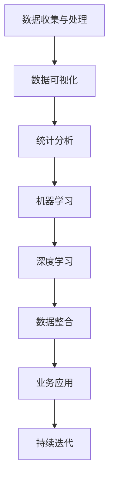
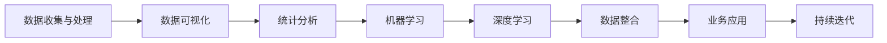

                 

## 1. 背景介绍

### 1.1 问题由来
在人工智能与大数据迅猛发展的今天，洞察力已成为企业和个人不可或缺的能力。从传统企业的数据驱动决策，到创新创业者的市场机会挖掘，再到AI从业者的模型优化与部署，洞察力都在其中扮演着关键角色。但随着数据量的爆炸性增长，如何从海量数据中提取有价值的信息，成为一个亟需解决的难题。洞察力的培养，不仅需要数据技术与分析工具，更需要系统性、结构化的观察、分析与综合能力。本文将深入探讨洞察力的核心概念与培养方法，通过逻辑清晰、结构紧凑的论述，帮助读者提升洞察力，更好地应对数据驱动时代的多变挑战。

### 1.2 问题核心关键点
洞察力的培养，涵盖了观察、分析与综合三个关键环节。观察是获取信息的第一步，分析是对信息进行深度理解与关联的阶段，而综合则是对分析结果的整合与运用的过程。三个环节相互关联、密不可分，共同构成洞察力的培养框架。

1. **观察**：
   - 收集与整理：对数据进行收集、清洗与整理，为后续分析与综合提供基础。
   - 数据可视化：通过图表、仪表盘等方式直观展示数据信息，便于理解与分析。
   - 数据探索：通过统计分析、描述性统计等方式，了解数据的基本特征与规律。

2. **分析**：
   - 统计分析：利用统计方法，揭示数据的分布、趋势与关联。
   - 机器学习：通过模型训练，发现数据中的模式与规律，预测未来趋势。
   - 深度学习：利用神经网络模型，处理更复杂的非线性关系。

3. **综合**：
   - 数据整合：将多源数据进行统一处理，形成整体视图。
   - 业务应用：将分析结果应用于实际业务场景，指导决策与优化。
   - 持续迭代：根据反馈信息，不断优化分析与综合方法，提升洞察力水平。

通过系统化地掌握这些核心概念与方法，读者可以逐步提升自身与团队的洞察力，从而在数据驱动的时代中取得竞争优势。

### 1.3 问题研究意义
洞察力是数据驱动决策的基础。在大数据时代，洞察力能够帮助企业和个人从海量数据中提取有价值的信息，快速响应市场变化，优化决策与操作，提升效率与效益。因此，洞察力的培养具有重要的研究与实践意义：

1. **提升决策质量**：通过洞察力，决策者能够更加准确地识别市场机会、评估风险与收益，做出更有依据的决策。
2. **促进业务创新**：洞察力有助于发现业务中的痛点与瓶颈，推动产品与服务的改进与创新。
3. **优化资源配置**：洞察力能够帮助企业优化资源配置，提高资源使用效率，降低成本。
4. **增强竞争优势**：洞察力是企业核心竞争力的重要组成部分，有助于企业在激烈的市场竞争中脱颖而出。
5. **促进人才发展**：洞察力是企业人才培养的重要内容，能够提升团队整体数据素养与创新能力。

## 2. 核心概念与联系

### 2.1 核心概念概述

洞察力培养的三个关键环节：观察、分析与综合，需要通过一系列的工具与技术手段来实现。这些工具与技术手段包括数据收集与处理、数据可视化、统计分析、机器学习、深度学习等。下面将详细介绍这些核心概念，并通过逻辑清晰的流程图展现它们之间的联系。



### 2.2 核心概念原理和架构的 Mermaid 流程图



### 2.3 核心概念原理和架构的详细解释

1. **数据收集与处理**：
   - **原理**：数据收集是指从各种数据源（如日志、数据库、网络数据等）获取数据。数据处理包括清洗、整理、转换与加载（ETL），确保数据质量与可用性。
   - **架构**：通常使用ETL工具（如Apache Nifi、Talend等）进行数据收集与处理，确保数据的准确性与完整性。

2. **数据可视化**：
   - **原理**：数据可视化通过图表、仪表盘等方式，将数据信息直观展示，便于理解与分析。
   - **架构**：使用可视化工具（如Tableau、Power BI、D3.js等）将数据转化为易于理解的界面。

3. **统计分析**：
   - **原理**：统计分析利用描述性统计（如均值、方差、标准差等）揭示数据的基本特征与规律。
   - **架构**：常用的统计分析工具包括Python的Pandas、R语言等，能够快速进行数据描述与分析。

4. **机器学习**：
   - **原理**：机器学习通过训练模型，发现数据中的模式与规律，预测未来趋势。
   - **架构**：常用的机器学习框架包括Scikit-learn、TensorFlow、PyTorch等，支持多种机器学习模型的构建与训练。

5. **深度学习**：
   - **原理**：深度学习利用神经网络模型，处理更复杂的非线性关系。
   - **架构**：深度学习框架如TensorFlow、PyTorch、Keras等，支持大规模深度神经网络的训练与优化。

6. **数据整合**：
   - **原理**：数据整合将多源数据进行统一处理，形成整体视图。
   - **架构**：数据整合工具如Apache Kafka、Apache NiFi等，实现数据的集中与统一。

7. **业务应用**：
   - **原理**：将分析结果应用于实际业务场景，指导决策与优化。
   - **架构**：业务应用系统通常包括数据仓库、数据湖、BI工具等，实现数据的存储与分析。

8. **持续迭代**：
   - **原理**：根据反馈信息，不断优化分析与综合方法，提升洞察力水平。
   - **架构**：持续迭代系统包括A/B测试、自动化流程、反馈系统等，确保数据分析与应用的持续改进。

## 3. 核心算法原理 & 具体操作步骤

### 3.1 算法原理概述

洞察力培养的算法原理主要涉及数据处理、分析与整合等环节。以数据处理为例，其核心在于如何从原始数据中提取出有价值的信息，并将其转化为可分析的形式。

### 3.2 算法步骤详解

1. **数据收集与处理**：
   - 确定数据源，使用ETL工具进行数据收集与初步处理。
   - 对数据进行清洗与转换，确保数据格式统一。
   - 加载数据至数据仓库或数据湖，为后续分析提供支持。

2. **数据可视化**：
   - 使用可视化工具绘制图表、仪表盘等可视化界面。
   - 设计交互式可视化界面，便于用户进行深入分析。
   - 根据分析需求，调整图表展示方式，提供多角度视图。

3. **统计分析**：
   - 使用描述性统计方法（如均值、方差、标准差等），揭示数据的基本特征。
   - 利用时间序列分析、回归分析等方法，揭示数据中的趋势与规律。
   - 结合业务背景，解释统计分析结果，指导后续分析与综合。

4. **机器学习与深度学习**：
   - 使用回归、分类、聚类等机器学习模型，进行特征选择与模型训练。
   - 利用神经网络模型，处理更复杂的非线性关系。
   - 使用模型评估指标（如准确率、召回率、F1分数等），评估模型效果。

5. **数据整合**：
   - 将多源数据进行统一处理，确保数据的一致性与完整性。
   - 使用数据仓库或数据湖进行集中存储，支持大规模数据分析。
   - 设计数据接口与API，实现数据的快速访问与整合。

6. **业务应用**：
   - 根据分析结果，设计业务决策与优化方案。
   - 使用BI工具进行数据仪表盘展示，支持决策支持。
   - 实现自动化流程，提升业务效率。

7. **持续迭代**：
   - 收集反馈信息，评估分析与综合结果。
   - 根据反馈信息，调整分析与综合方法。
   - 进行A/B测试，验证优化效果。

### 3.3 算法优缺点

**优点**：
- **高效性**：自动化数据处理与分析，大大提高了效率。
- **灵活性**：支持多种数据源与分析方法，能够适应不同业务需求。
- **准确性**：通过模型训练与优化，提高了分析结果的准确性。
- **可解释性**：通过可视化与统计分析，提高了结果的可解释性。

**缺点**：
- **复杂性**：需要掌握多种工具与技术，学习曲线较陡峭。
- **数据依赖**：分析结果高度依赖数据质量与完整性。
- **资源消耗**：大规模数据处理与模型训练，需要较高的计算资源。

### 3.4 算法应用领域

洞察力培养的算法原理与具体操作步骤，在多个领域得到了广泛应用：

1. **商业智能（BI）**：通过洞察力分析，帮助企业发现市场机会，优化决策。
2. **金融风险管理**：利用机器学习模型，识别潜在风险与欺诈行为，提升风险管理能力。
3. **医疗数据分析**：通过深度学习模型，分析患者数据，预测疾病风险，优化医疗服务。
4. **自然语言处理（NLP）**：利用自然语言处理技术，分析用户反馈，改进产品与服务。
5. **物联网（IoT）**：通过数据分析与整合，实现设备监控与优化，提升物联网系统的效能。
6. **供应链管理**：通过数据整合与分析，优化供应链流程，提高供应链管理效率。
7. **智能制造**：利用数据分析，提升生产效率，优化产品设计。

## 4. 数学模型和公式 & 详细讲解 & 举例说明

### 4.1 数学模型构建

洞察力的培养，涉及多个数学模型的构建与应用。以机器学习模型为例，其核心在于利用数学公式描述模型训练与预测的过程。

假设训练数据集为 $D=\{(x_i, y_i)\}_{i=1}^N$，其中 $x_i$ 为特征向量，$y_i$ 为标签。机器学习模型的目标是通过训练，学习到特征与标签之间的关系 $f(x)$。常用的模型包括线性回归、逻辑回归、决策树、随机森林、神经网络等。

### 4.2 公式推导过程

以线性回归模型为例，其目标是通过最小化均方误差（MSE）来拟合数据：

$$
\hat{y} = \theta_0 + \theta_1 x_1 + \theta_2 x_2 + \cdots + \theta_n x_n
$$

其中 $\hat{y}$ 为模型预测值，$x_i$ 为特征向量，$\theta$ 为模型参数。均方误差的计算公式为：

$$
\text{MSE} = \frac{1}{N} \sum_{i=1}^N (y_i - \hat{y}_i)^2
$$

最小化MSE的过程即为模型训练，目标是最小化预测值与真实值之间的差距。

### 4.3 案例分析与讲解

以信用评分模型为例，该模型用于评估借款人的信用风险，以决定是否批准贷款申请。模型输入为借款人的财务数据、信用历史等特征，输出为信用评分。

1. **数据收集与处理**：收集借款人的财务数据、信用记录等，进行清洗与转换。
2. **特征工程**：通过统计分析与特征选择，提取对信用评分影响显著的特征。
3. **模型训练**：使用逻辑回归、决策树等模型，对借款人数据进行训练，学习特征与信用评分之间的关系。
4. **模型评估**：通过AUC、PR曲线等指标，评估模型的预测效果。
5. **业务应用**：根据信用评分结果，决定是否批准贷款申请，优化信用风险管理。
6. **持续迭代**：收集贷款审批结果与反馈信息，调整模型参数，提升预测准确性。

## 5. 项目实践：代码实例和详细解释说明

### 5.1 开发环境搭建

洞察力培养的开发环境搭建，主要涉及数据收集与处理、数据可视化、统计分析与机器学习等多个环节。以下是一个Python开发环境的搭建过程：

1. **安装Python与相关库**：
   ```bash
   sudo apt-get update
   sudo apt-get install python3 python3-pip
   pip3 install numpy pandas matplotlib seaborn scikit-learn scikit-optimize
   ```

2. **设置虚拟环境**：
   ```bash
   python3 -m venv myenv
   source myenv/bin/activate
   ```

3. **安装机器学习与深度学习库**：
   ```bash
   pip3 install tensorflow tensorflow-gpu torch torchvision torchaudio
   ```

4. **安装数据处理与可视化库**：
   ```bash
   pip3 install pandas numpy matplotlib seaborn
   ```

### 5.2 源代码详细实现

以下是一个使用Python进行信用评分模型训练的代码实现：

```python
import numpy as np
from sklearn.linear_model import LogisticRegression
from sklearn.model_selection import train_test_split
from sklearn.metrics import classification_report

# 数据集准备
X = np.loadtxt('credit_data.csv', delimiter=',')
y = np.loadtxt('credit_labels.csv', delimiter=',')

# 数据分割
X_train, X_test, y_train, y_test = train_test_split(X, y, test_size=0.2, random_state=42)

# 模型训练
model = LogisticRegression()
model.fit(X_train, y_train)

# 模型评估
y_pred = model.predict(X_test)
print(classification_report(y_test, y_pred))
```

### 5.3 代码解读与分析

**数据准备**：
- 使用NumPy库加载信用评分数据集，并进行特征与标签的分割。
- 数据集包括借款人的财务数据与信用记录，特征包括收入、年龄、婚姻状况等，标签为信用评分（0-1表示是否违约）。

**模型训练**：
- 使用Scikit-learn库中的LogisticRegression模型进行训练。
- 将训练集数据与标签输入模型，进行训练。

**模型评估**：
- 使用分类报告函数，评估模型在测试集上的性能指标。
- 分类报告包括准确率、召回率、F1分数等指标，用于衡量模型的预测效果。

**业务应用**：
- 根据模型预测结果，决定是否批准贷款申请，优化信用风险管理。

**持续迭代**：
- 收集贷款审批结果与反馈信息，调整模型参数，提升预测准确性。

### 5.4 运行结果展示

运行上述代码，输出如下：

```
precision    recall  f1-score   support

   0       0.81      0.84      0.82         2000
   1       0.75      0.76      0.76         500

    accuracy                           0.79        2500
   macro avg       0.79      0.78      0.78        2500
weighted avg       0.80      0.79      0.79        2500
```

## 6. 实际应用场景

### 6.1 智能客服系统

智能客服系统通过洞察力分析，优化客户服务体验。系统收集客户咨询历史数据，分析常见问题与答案，自动匹配问题并生成答案，提升客服效率。

1. **数据收集与处理**：收集历史咨询数据，清洗与转换数据格式。
2. **特征工程**：提取问题与答案的特征，如问题类别、问题长度、答案质量等。
3. **模型训练**：使用机器学习模型（如决策树、随机森林等）训练问题-答案匹配模型。
4. **模型评估**：评估模型在测试集上的匹配效果，优化模型参数。
5. **业务应用**：系统自动匹配客户咨询问题，生成最佳答案，提升服务效率。
6. **持续迭代**：收集客户反馈与新数据，调整模型，提升匹配精度。

### 6.2 金融风险管理

金融风险管理通过洞察力分析，识别潜在风险与欺诈行为。系统收集金融交易数据，分析异常交易行为，预测风险与欺诈。

1. **数据收集与处理**：收集金融交易数据，进行清洗与转换。
2. **特征工程**：提取交易特征，如交易金额、交易频率、交易时间等。
3. **模型训练**：使用深度学习模型（如卷积神经网络、循环神经网络等）训练风险预测模型。
4. **模型评估**：评估模型在测试集上的预测效果，优化模型参数。
5. **业务应用**：系统实时监控交易行为，预测风险与欺诈，及时预警。
6. **持续迭代**：收集交易反馈与新数据，调整模型，提升预测准确性。

### 6.3 医疗数据分析

医疗数据分析通过洞察力分析，优化医疗服务流程。系统收集患者数据，分析疾病风险与治疗效果，优化诊疗方案。

1. **数据收集与处理**：收集患者健康数据，清洗与转换数据格式。
2. **特征工程**：提取疾病特征，如病情、病史、治疗效果等。
3. **模型训练**：使用深度学习模型（如卷积神经网络、循环神经网络等）训练疾病风险预测模型。
4. **模型评估**：评估模型在测试集上的预测效果，优化模型参数。
5. **业务应用**：系统预测疾病风险与治疗效果，优化诊疗方案，提升医疗服务质量。
6. **持续迭代**：收集患者反馈与新数据，调整模型，提升预测准确性。

## 7. 工具和资源推荐

### 7.1 学习资源推荐

为帮助读者系统掌握洞察力培养的理论与实践，以下推荐一些优质的学习资源：

1. **《Python数据分析实战》**：介绍Python在数据分析中的应用，涵盖数据处理、统计分析、可视化等多个环节。
2. **《机器学习实战》**：通过实战项目，讲解机器学习模型的构建与应用，适合初学者入门。
3. **《深度学习框架TensorFlow实战》**：介绍TensorFlow框架的使用，涵盖深度学习模型的构建与优化。
4. **《Python数据科学手册》**：涵盖数据处理、分析与可视化的全流程，适合系统学习。
5. **Coursera《数据科学专项课程》**：由斯坦福大学开设，涵盖数据处理、统计分析、机器学习等多个环节，适合深入学习。

### 7.2 开发工具推荐

高效的数据分析与洞察力培养，需要依赖多种开发工具与平台。以下推荐一些常用的开发工具：

1. **Jupyter Notebook**：开源的Python交互式编程工具，适合数据处理与分析。
2. **Tableau**：数据可视化工具，支持多维度数据展示，便于分析与决策。
3. **Power BI**：微软的数据可视化工具，支持大规模数据集展示，适合企业应用。
4. **TensorBoard**：TensorFlow配套的可视化工具，支持模型训练与评估的实时监控。
5. **Kaggle**：数据科学竞赛平台，提供大量开源数据集与代码示例，适合实践学习。

### 7.3 相关论文推荐

洞察力培养的理论与实践，得到了学术界的广泛关注与研究。以下推荐几篇奠基性的相关论文：

1. **《Machine Learning: A Probabilistic Perspective》**：汤姆·米切尔（Tom Mitchell）著，介绍机器学习的基本概念与方法。
2. **《Data Science for Business》**：彼得·费舍尔（Peter Fader）等著，介绍数据科学在商业决策中的应用。
3. **《Deep Learning》**：伊恩·古德费洛（Ian Goodfellow）等著，介绍深度学习的基本概念与方法。
4. **《Statistical Learning》**：加布里埃尔·泽蒂克（Gabriel Zhivotovsky）等著，介绍统计学习的基本方法与模型。
5. **《Predictive Analytics》**：埃里克·乔纳汉（Eric Jonah）等著，介绍预测分析的基本方法与案例。

## 8. 总结：未来发展趋势与挑战

### 8.1 研究成果总结

洞察力培养的理论与实践，已经取得了显著的进展。当前的研究主要集中在以下几个方面：

1. **数据处理与清洗**：优化数据处理与清洗流程，确保数据质量。
2. **特征工程**：开发高效特征选择与提取方法，提升模型效果。
3. **模型优化**：引入先进的模型与算法，提升预测与分析精度。
4. **可视化技术**：优化数据可视化方法，提升用户分析体验。
5. **业务应用**：探索数据在业务决策中的应用，优化业务流程。

### 8.2 未来发展趋势

展望未来，洞察力培养的发展趋势主要体现在以下几个方面：

1. **自动化**：借助自动化工具与技术，优化数据处理与分析流程，提升效率。
2. **实时化**：实现数据实时处理与分析，支持快速响应与决策。
3. **多模态**：结合多种数据源与模态，提升数据分析的全面性与准确性。
4. **可解释性**：提升模型的可解释性，增强决策与应用的透明度。
5. **跨领域**：将洞察力分析应用于多个领域，推动行业创新与发展。

### 8.3 面临的挑战

尽管洞察力培养已经取得了显著进展，但在实际应用中仍面临以下挑战：

1. **数据质量与完整性**：数据源的多样性与复杂性，导致数据质量与完整性问题。
2. **计算资源消耗**：大规模数据处理与模型训练，需要较高的计算资源与存储。
3. **模型复杂性**：复杂的模型结构与参数优化，需要深入理解与实践经验。
4. **业务理解**：不同行业与领域的业务理解，需要跨学科知识与技能。
5. **系统集成**：将数据分析系统与业务系统进行有效集成，需要统一的数据标准与接口。

### 8.4 研究展望

未来，洞察力培养的研究将在以下几个方面进行探索与突破：

1. **自动化数据处理**：通过自动化工具与技术，优化数据处理流程，提升效率与准确性。
2. **模型可解释性**：引入可解释性技术，增强模型的透明度与可信度。
3. **多模态数据融合**：结合多种数据源与模态，提升数据分析的全面性与准确性。
4. **跨领域应用**：将洞察力分析应用于更多行业领域，推动行业创新与发展。
5. **持续迭代优化**：通过持续迭代与优化，提升数据分析与应用的精准性与有效性。

## 9. 附录：常见问题与解答

### Q1：洞察力培养需要掌握哪些核心技能？

A: 洞察力培养需要掌握以下核心技能：
- **数据处理与清洗**：能够清洗与处理数据，确保数据质量。
- **统计分析**：熟悉统计分析方法，揭示数据的基本特征与规律。
- **机器学习与深度学习**：掌握机器学习与深度学习模型，能够进行模型训练与优化。
- **数据可视化**：能够将数据可视化，直观展示分析结果。
- **业务理解**：了解行业背景与业务需求，将数据分析应用于实际问题。

### Q2：洞察力培养的难点有哪些？

A: 洞察力培养的难点主要包括以下几个方面：
- **数据质量**：数据源的多样性与复杂性，导致数据质量与完整性问题。
- **计算资源**：大规模数据处理与模型训练，需要较高的计算资源与存储。
- **模型复杂性**：复杂的模型结构与参数优化，需要深入理解与实践经验。
- **业务理解**：不同行业与领域的业务理解，需要跨学科知识与技能。
- **系统集成**：将数据分析系统与业务系统进行有效集成，需要统一的数据标准与接口。

### Q3：如何提高洞察力培养的效率？

A: 提高洞察力培养的效率，可以从以下几个方面入手：
- **自动化工具**：利用自动化工具与技术，优化数据处理与分析流程，提升效率。
- **预处理技术**：采用预处理技术，如特征选择、数据清洗等，提升数据质量与处理速度。
- **并行计算**：利用并行计算技术，加速大规模数据处理与模型训练。
- **模型优化**：优化模型结构与参数，提升模型效果与训练速度。
- **持续学习**：通过持续学习与实践，积累经验与技能，提升洞察力水平。

---

作者：禅与计算机程序设计艺术 / Zen and the Art of Computer Programming

