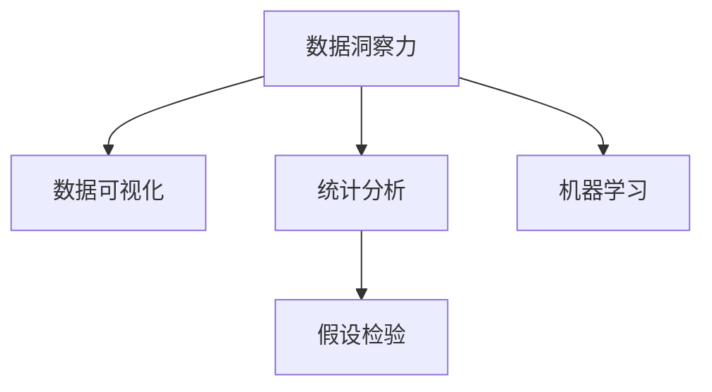

                 

# 洞察力的训练：提升观察和分析能力

## 1. 背景介绍

### 1.1 问题由来
在当今信息爆炸的时代，数据源越来越多，质量参差不齐。如何在海量数据中快速发现潜在价值，形成有见地的洞察力，是数据分析师和数据科学家面临的重大挑战。虽然随着数据科学和机器学习技术的不断发展，自动化算法正在变得越来越智能，但人类观察和分析的洞察力仍然是无可替代的。

### 1.2 问题核心关键点
洞察力训练的核心在于通过训练有素的方法，提升数据分析师和科学家的观察和分析能力，使其能够从复杂的数据集中提取关键信息，形成有意义的洞察力。这种训练通常包括以下几个方面：

1. **数据理解**：理解和熟悉数据分析的基本原则和方法，如统计学、概率论、机器学习等。
2. **数据可视化**：学会使用数据可视化工具，将复杂数据以直观的形式呈现出来，有助于发现数据中的模式和趋势。
3. **统计推断**：掌握统计推断的基本技术，如假设检验、回归分析等，从数据中提取因果关系和相关性。
4. **模式识别**：学习和应用机器学习算法，如聚类、分类、异常检测等，识别数据中的模式和结构。
5. **问题建模**：能够从问题定义到模型构建，系统地设计解决方案，并评估其效果。

### 1.3 问题研究意义
洞察力的训练对于数据驱动决策至关重要。通过对数据分析师和科学家的持续训练，可以提升其工作效率和准确性，加速决策过程。同时，有洞察力的分析还能帮助企业和组织在激烈的市场竞争中脱颖而出，形成竞争优势。

## 2. 核心概念与联系

### 2.1 核心概念概述

为更好地理解洞察力训练的方法，本节将介绍几个密切相关的核心概念：

- **数据洞察力**：通过分析数据，识别出隐藏的模式、趋势和关联，形成有价值的结论和预测。
- **数据可视化**：使用图表、图形等直观方式呈现数据，帮助识别数据中的重要信息。
- **统计分析**：应用统计学方法，分析数据的分布、相关性、显著性等，提取有意义的结论。
- **机器学习**：利用算法对数据进行建模，实现自动化的预测、分类、聚类等功能。
- **假设检验**：通过构建和检验假设，评估数据中观察到的现象是否具有统计学意义。

这些核心概念之间的逻辑关系可以通过以下Mermaid流程图来展示：



这个流程图展示了大语言模型微调的核心概念及其之间的关系：

1. 数据洞察力通过对数据可视化、统计分析、机器学习等方法的综合应用，识别出数据中的模式和趋势。
2. 数据可视化提供数据直观表达，辅助观察和分析。
3. 统计分析通过科学的统计方法，评估数据的分布和相关性，提取有意义的信息。
4. 机器学习利用算法进行数据建模，实现自动化分析。
5. 假设检验验证数据中观察到的现象是否具有统计学意义。

## 3. 核心算法原理 & 具体操作步骤
### 3.1 算法原理概述

洞察力训练的算法原理主要基于数据处理和分析的基本方法。其核心思想是通过一系列技术手段，从数据中提取有意义的洞察力，形成能够支持决策的有效结论。

形式化地，假设原始数据集为 $D=\{(x_i,y_i)\}_{i=1}^N$，其中 $x_i$ 为输入特征，$y_i$ 为输出标签。洞察力训练的目标是找到最优的洞察力模型 $f$，使得其预测结果与真实标签尽可能接近。即：

$$
\min_{f} \mathcal{L}(f, D)
$$

其中 $\mathcal{L}$ 为损失函数，通常选择均方误差、交叉熵等。

### 3.2 算法步骤详解

洞察力训练的一般步骤包括：

**Step 1: 数据收集和预处理**
- 收集与任务相关的数据集，进行清洗和预处理，如缺失值处理、特征工程等。

**Step 2: 特征工程**
- 根据任务需求，选择合适的特征，并进行特征提取、变换和选择。

**Step 3: 数据可视化**
- 使用Matplotlib、Seaborn等工具，将数据以图表形式呈现，直观观察数据分布和关系。

**Step 4: 统计分析**
- 应用统计学方法，如均值、方差、回归分析等，分析数据分布和趋势。
- 进行假设检验，如t检验、卡方检验等，验证数据中观察到的现象是否具有统计学意义。

**Step 5: 模型选择与训练**
- 根据任务类型，选择合适的模型，如线性回归、决策树、支持向量机等。
- 使用训练数据，通过梯度下降等优化算法，最小化损失函数，训练模型。

**Step 6: 模型评估与优化**
- 在测试集上评估模型性能，如准确率、召回率、F1值等。
- 根据评估结果，调整模型参数，优化模型性能。

**Step 7: 洞察力形成**
- 基于模型结果，结合领域知识和经验，形成有意义的洞察力。

### 3.3 算法优缺点

洞察力训练的算法具有以下优点：

1. **灵活性高**：可以灵活应用多种技术和方法，根据数据和任务特点进行优化。
2. **可解释性强**：数据可视化、统计分析等手段，使得模型的决策过程具有较好的可解释性。
3. **适用性广**：适用于各种类型的数据和任务，如分类、回归、聚类等。

同时，该方法也存在一定的局限性：

1. **依赖领域知识**：需要分析师具有较强的领域知识和经验，才能正确应用各种方法。
2. **数据质量要求高**：数据的质量和完整性直接影响分析结果，需要严格的数据清洗和预处理。
3. **计算成本高**：某些统计和机器学习方法的计算成本较高，特别是在处理大规模数据时。
4. **模型解释性有限**：部分机器学习模型（如深度学习）缺乏可解释性，难以理解其内部工作机制。

尽管存在这些局限性，但就目前而言，洞察力训练方法在数据驱动决策中仍然是非常有效的手段。未来相关研究的重点在于如何进一步提高算法的自动化和可解释性，降低对领域知识和数据质量的依赖。

### 3.4 算法应用领域

洞察力训练的算法在多个领域都有广泛的应用，例如：

- **金融分析**：利用历史数据和市场信息，进行股票价格预测、风险评估、投资组合优化等。
- **健康监测**：从医疗数据中识别出疾病的早期迹象，辅助医生进行诊断和治疗。
- **客户分析**：通过分析客户行为数据，提升市场营销策略，优化用户体验。
- **产品设计**：利用用户反馈数据，改进产品功能和设计，提升用户满意度。
- **供应链管理**：从订单数据中识别出异常和瓶颈，优化供应链流程，降低成本。
- **公共政策**：分析社会和经济数据，评估政策效果，提供决策支持。

除了上述这些经典应用外，洞察力训练还被创新性地应用到更多场景中，如智能城市管理、灾害预测、资源优化等，为各行各业带来了新的发展机遇。

## 4. 数学模型和公式 & 详细讲解  
### 4.1 数学模型构建

本节将使用数学语言对洞察力训练的方法进行更加严格的刻画。

记数据集为 $D=\{(x_i,y_i)\}_{i=1}^N$，其中 $x_i \in \mathbb{R}^d$ 为输入特征，$y_i \in \mathbb{R}$ 为输出标签。

定义洞察力模型 $f: \mathbb{R}^d \rightarrow \mathbb{R}$，其中 $f(\cdot)$ 为待训练的函数。

假设损失函数为均方误差，则洞察力训练的目标为：

$$
\min_{f} \sum_{i=1}^N (y_i - f(x_i))^2
$$

通过梯度下降等优化算法，最小化损失函数，得到最优的洞察力模型。

### 4.2 公式推导过程

以下我们以回归任务为例，推导洞察力训练的公式及其梯度的计算过程。

假设洞察力模型为线性回归模型 $f(x) = \theta^Tx$，其中 $\theta \in \mathbb{R}^d$ 为模型参数。则损失函数为：

$$
\mathcal{L}(\theta) = \frac{1}{N} \sum_{i=1}^N (y_i - \theta^Tx_i)^2
$$

根据链式法则，损失函数对参数 $\theta_k$ 的梯度为：

$$
\frac{\partial \mathcal{L}(\theta)}{\partial \theta_k} = \frac{2}{N} \sum_{i=1}^N (y_i - \theta^Tx_i)(-x_{ik})
$$

其中 $x_{ik}$ 为特征向量 $x_i$ 的第 $k$ 个元素。

将梯度公式带入参数更新公式，即可进行模型迭代优化。重复上述过程直至收敛，最终得到适应数据的洞察力模型。

## 5. 项目实践：代码实例和详细解释说明
### 5.1 开发环境搭建

在进行洞察力训练实践前，我们需要准备好开发环境。以下是使用Python进行Scikit-learn开发的环境配置流程：

1. 安装Anaconda：从官网下载并安装Anaconda，用于创建独立的Python环境。

2. 创建并激活虚拟环境：
```bash
conda create -n insight-env python=3.8 
conda activate insight-env
```

3. 安装Scikit-learn和其他相关库：
```bash
conda install scikit-learn pandas numpy matplotlib seaborn
```

4. 安装TensorFlow和相关工具：
```bash
conda install tensorflow-gpu -c pytorch
```

完成上述步骤后，即可在`insight-env`环境中开始洞察力训练实践。

### 5.2 源代码详细实现

下面我们以回归任务为例，给出使用Scikit-learn进行洞察力训练的Python代码实现。

首先，定义回归任务的数据处理函数：

```python
import pandas as pd
import numpy as np
from sklearn.model_selection import train_test_split

def load_data(file_path):
    data = pd.read_csv(file_path)
    X = data.drop(['y'], axis=1).values
    y = data['y'].values
    return X, y

def train_test_split_data(X, y, test_size=0.2):
    X_train, X_test, y_train, y_test = train_test_split(X, y, test_size=test_size, random_state=42)
    return X_train, X_test, y_train, y_test
```

然后，定义洞察力模型和优化器：

```python
from sklearn.linear_model import LinearRegression

model = LinearRegression()

# 设置优化参数
optimizer = {'learning_rate': 0.01, 'penalty': 'l2', 'alpha': 0.01}
```

接着，定义训练和评估函数：

```python
def train(model, X_train, y_train, optimizer):
    model.fit(X_train, y_train, **optimizer)

def evaluate(model, X_test, y_test):
    y_pred = model.predict(X_test)
    mse = np.mean((y_pred - y_test)**2)
    print(f'Mean Squared Error: {mse:.2f}')
```

最后，启动训练流程并在测试集上评估：

```python
# 加载数据集
X, y = load_data('data.csv')

# 划分训练集和测试集
X_train, X_test, y_train, y_test = train_test_split_data(X, y, test_size=0.2)

# 训练模型
model = train(model, X_train, y_train, optimizer)

# 评估模型
evaluate(model, X_test, y_test)
```

以上就是使用Scikit-learn进行回归任务洞察力训练的完整代码实现。可以看到，Scikit-learn提供了简单易用的接口，可以快速搭建和优化模型。

### 5.3 代码解读与分析

让我们再详细解读一下关键代码的实现细节：

**数据处理函数**：
- `load_data`函数：从CSV文件中加载数据，并返回特征和标签。
- `train_test_split_data`函数：对数据集进行训练集和测试集的划分，保证测试集数据在训练过程中不参与训练。

**模型定义**：
- `LinearRegression`类：Scikit-learn提供的线性回归模型，适合解决简单的回归问题。

**优化器设置**：
- `optimizer`字典：定义优化算法的参数，包括学习率、正则化系数等。

**训练和评估函数**：
- `train`函数：使用训练数据训练模型，并使用优化器更新参数。
- `evaluate`函数：使用测试数据评估模型性能，输出均方误差（Mean Squared Error, MSE）。

**训练流程**：
- 加载数据集。
- 划分训练集和测试集。
- 训练模型。
- 评估模型性能。

可以看到，Scikit-learn提供了简洁的接口和丰富的工具，使得洞察力训练的实践变得非常高效。开发者可以快速实现常见的回归问题，并在实践中不断优化模型和算法。

当然，工业级的系统实现还需考虑更多因素，如模型的保存和部署、超参数的自动搜索、更灵活的特征工程等。但核心的洞察力训练流程基本与此类似。

## 6. 实际应用场景
### 6.1 智能金融分析

在金融领域，洞察力训练技术可以用于风险评估、资产定价、投资策略设计等。通过对历史金融数据的分析，洞察力训练可以识别出市场趋势、风险因素和投资机会，辅助决策者制定更加科学的投资方案。

### 6.2 医疗健康监测

医疗健康领域需要快速准确地识别疾病模式和风险因素。洞察力训练技术可以从医疗记录和监测数据中提取关键信息，辅助医生进行诊断和治疗。

### 6.3 智能客服

智能客服系统通过洞察力训练，可以从用户互动数据中识别出常见问题和需求，优化响应策略，提升用户体验。

### 6.4 市场营销

市场营销团队可以通过洞察力训练，从用户反馈和行为数据中发现潜在客户群体和市场趋势，优化营销策略。

### 6.5 智能制造

智能制造通过洞察力训练，可以从生产线数据中识别出故障模式和生产瓶颈，优化生产流程，提高生产效率。

### 6.6 供应链优化

供应链管理团队可以通过洞察力训练，从物流和库存数据中识别出异常和瓶颈，优化供应链流程，降低成本。

### 6.7 公共政策评估

政府机构可以通过洞察力训练，从社会和经济数据中评估政策效果，提供决策支持。

除了上述这些经典应用外，洞察力训练还被创新性地应用到更多场景中，如智能城市管理、灾害预测、资源优化等，为各行各业带来了新的发展机遇。

## 7. 工具和资源推荐
### 7.1 学习资源推荐

为了帮助开发者系统掌握洞察力训练的理论基础和实践技巧，这里推荐一些优质的学习资源：

1. 《统计学习方法》教材：李航所著，全面介绍了统计学习的基本原理和算法。
2. 《机器学习实战》书籍：Peter Harrington所著，提供了大量的Python代码示例，帮助理解机器学习算法。
3. 《Python数据科学手册》书籍：Jake VanderPlas所著，系统介绍了Python在数据科学中的应用。
4. Coursera和edX等在线平台上的统计学和机器学习课程，如《机器学习基础》（Coursera）、《数据科学导论》（edX）等。
5. Kaggle竞赛和数据集：Kaggle是数据科学竞赛平台，提供了大量的数据集和解决方案，适合实践学习和技能提升。

通过对这些资源的学习实践，相信你一定能够快速掌握洞察力训练的精髓，并用于解决实际的问题。
###  7.2 开发工具推荐

高效的开发离不开优秀的工具支持。以下是几款用于洞察力训练开发的常用工具：

1. Jupyter Notebook：交互式编程环境，方便调试和实验。
2. Pandas：Python数据分析库，适合处理和清洗大数据。
3. NumPy：Python数学计算库，适合进行数学运算和矩阵操作。
4. Matplotlib和Seaborn：数据可视化库，方便将数据以图表形式呈现。
5. Scikit-learn：Python机器学习库，提供多种常见的统计和机器学习算法。
6. TensorFlow和PyTorch：深度学习框架，适合处理复杂的数据建模问题。
7. Weights & Biases：模型训练的实验跟踪工具，可以记录和可视化模型训练过程中的各项指标。
8. TensorBoard：TensorFlow配套的可视化工具，可实时监测模型训练状态，并提供丰富的图表呈现方式。

合理利用这些工具，可以显著提升洞察力训练的开发效率，加快创新迭代的步伐。

### 7.3 相关论文推荐

洞察力训练技术的发展得益于学界的持续研究。以下是几篇奠基性的相关论文，推荐阅读：

1. J. Friedman，《Greedy Function Approximation: A Gradient Boosting Machine》：提出梯度提升树算法，成为机器学习领域的经典模型。
2. T. Hastie, R. Tibshirani, J. Friedman，《The Elements of Statistical Learning》：全面介绍了统计学习的方法和算法。
3. G. Hinton，《A Neural Probabilistic Language Model》：提出神经网络语言模型，开创了深度学习在NLP领域的应用。
4. I. Goodfellow, Y. Bengio, A. Courville，《Deep Learning》：全面介绍了深度学习的基本原理和算法。
5. C. M. Bishop，《Pattern Recognition and Machine Learning》：系统介绍了模式识别和机器学习的原理和方法。
6. P. S. Yu，《Integrative Data Mining: Clustering, Classification, and Association Rules》：介绍数据挖掘的多种方法，包括聚类、分类和关联规则挖掘。

这些论文代表了大语言模型微调技术的发展脉络。通过学习这些前沿成果，可以帮助研究者把握学科前进方向，激发更多的创新灵感。

## 8. 总结：未来发展趋势与挑战
### 8.1 总结

本文对洞察力训练的方法进行了全面系统的介绍。首先阐述了洞察力训练的背景和意义，明确了洞察力训练在数据分析中的重要作用。其次，从原理到实践，详细讲解了洞察力训练的数学原理和关键步骤，给出了洞察力训练任务开发的完整代码实例。同时，本文还广泛探讨了洞察力训练方法在多个行业领域的应用前景，展示了洞察力训练范式的巨大潜力。此外，本文精选了洞察力训练技术的各类学习资源，力求为读者提供全方位的技术指引。

通过本文的系统梳理，可以看到，洞察力训练方法在数据驱动决策中具有不可替代的作用。通过对数据分析师和科学家的持续训练，可以显著提升其工作效率和准确性，加速决策过程。未来，伴随洞察力训练技术的不断进步，相信其将在更多领域发挥更大的作用，为人类生产和生活带来新的变革。

### 8.2 未来发展趋势

展望未来，洞察力训练技术将呈现以下几个发展趋势：

1. **自动化程度提高**：自动化算法将进一步发展，使得洞察力训练过程更加智能和高效。
2. **多模态数据融合**：从文本、图像、语音等多种模态数据中提取信息，实现跨模态分析。
3. **实时化分析**：通过流式数据处理技术，实现对实时数据的洞察力训练，支持实时决策。
4. **因果推断**：引入因果推断方法，评估数据的因果关系，提升洞察力训练的科学性。
5. **强化学习**：结合强化学习技术，优化洞察力训练过程，提升模型的鲁棒性和适应性。
6. **可解释性增强**：开发更加可解释的洞察力训练方法，提升模型的透明度和可信度。

这些趋势凸显了洞察力训练技术的广阔前景。这些方向的探索发展，必将进一步提升洞察力训练的效果，为数据驱动决策带来新的突破。

### 8.3 面临的挑战

尽管洞察力训练技术已经取得了瞩目成就，但在迈向更加智能化、普适化应用的过程中，它仍面临着诸多挑战：

1. **数据质量要求高**：洞察力训练的效果依赖于高质量的数据，如何处理噪声和缺失值，是一个重要的挑战。
2. **模型复杂性高**：洞察力训练涉及多种算法和工具，模型的实现和优化难度较大。
3. **计算成本高**：洞察力训练往往需要大量的计算资源，特别是在处理大规模数据时。
4. **可解释性不足**：部分机器学习模型（如深度学习）缺乏可解释性，难以理解其内部工作机制。
5. **领域知识依赖**：洞察力训练的效果很大程度上依赖于领域知识和经验，不同领域的数据和问题可能需要不同的训练方法。

尽管存在这些挑战，但随着学界和产业界的共同努力，这些挑战终将一一被克服，洞察力训练必将在数据驱动决策中扮演越来越重要的角色。相信随着技术的日益成熟，洞察力训练技术将为各行各业带来更多的机遇和挑战。

### 8.4 研究展望

面对洞察力训练面临的种种挑战，未来的研究需要在以下几个方面寻求新的突破：

1. **自动化算法**：开发更加自动化的洞察力训练算法，减少人工干预，提高训练效率。
2. **多模态数据融合**：研究跨模态分析方法，提升数据融合的准确性和鲁棒性。
3. **实时化分析**：结合流式数据处理技术，实现对实时数据的洞察力训练，支持实时决策。
4. **因果推断**：引入因果推断方法，评估数据的因果关系，提升洞察力训练的科学性。
5. **强化学习**：结合强化学习技术，优化洞察力训练过程，提升模型的鲁棒性和适应性。
6. **可解释性增强**：开发更加可解释的洞察力训练方法，提升模型的透明度和可信度。
7. **数据质量提升**：研究数据清洗和预处理方法，提升数据质量，减少噪声和缺失值的影响。

这些研究方向的探索，必将引领洞察力训练技术迈向更高的台阶，为数据驱动决策带来新的突破。面向未来，洞察力训练技术还需要与其他人工智能技术进行更深入的融合，如知识表示、因果推理、强化学习等，多路径协同发力，共同推动数据驱动决策系统的进步。只有勇于创新、敢于突破，才能不断拓展数据驱动决策系统的边界，让智能技术更好地造福人类社会。

## 9. 附录：常见问题与解答

**Q1：如何提高洞察力训练的自动化程度？**

A: 提高自动化程度的方法包括：
1. 开发自动特征工程工具，自动识别和提取特征。
2. 使用自动化模型选择和调参方法，如网格搜索、随机搜索等。
3. 引入自动化评估指标，实时监测模型性能，及时调整训练策略。
4. 开发自动数据清洗工具，减少人工干预。

**Q2：如何提升洞察力训练的可解释性？**

A: 提升可解释性的方法包括：
1. 使用可解释性更高的模型，如决策树、线性回归等。
2. 结合可视化工具，如图表、热力图等，展示模型内部的重要特征。
3. 开发可解释性算法，如LIME、SHAP等，揭示模型的决策依据。
4. 记录和解释模型训练过程中的关键步骤，提供详细的文档说明。

**Q3：如何降低洞察力训练的计算成本？**

A: 降低计算成本的方法包括：
1. 使用分布式计算框架，如Hadoop、Spark等，并行化计算过程。
2. 采用高效的算法和数据结构，减少计算量。
3. 利用GPU和TPU等高性能计算资源，加速计算过程。
4. 优化数据存储和传输，减少I/O操作。

**Q4：如何处理高质量数据的要求？**

A: 处理高质量数据的要求的方法包括：
1. 进行数据清洗，去除噪声和异常值。
2. 进行特征工程，提取和构造有意义的特征。
3. 使用数据增强技术，扩充训练数据集。
4. 进行数据预处理，如归一化、标准化等。

**Q5：如何结合强化学习进行洞察力训练？**

A: 结合强化学习的方法包括：
1. 将洞察力训练过程视为一个强化学习任务，设计合适的奖励机制。
2. 使用Q-learning、SARSA等算法，优化洞察力训练过程。
3. 结合模型训练和策略优化，提升模型的鲁棒性和适应性。
4. 引入在线学习技术，实时调整模型参数，适应数据变化。

这些方法可以结合实际应用场景，进一步提升洞察力训练的效果，推动数据驱动决策技术的进步。总之，洞察力训练需要开发者根据具体任务，不断迭代和优化模型、数据和算法，方能得到理想的效果。

---

作者：禅与计算机程序设计艺术 / Zen and the Art of Computer Programming

