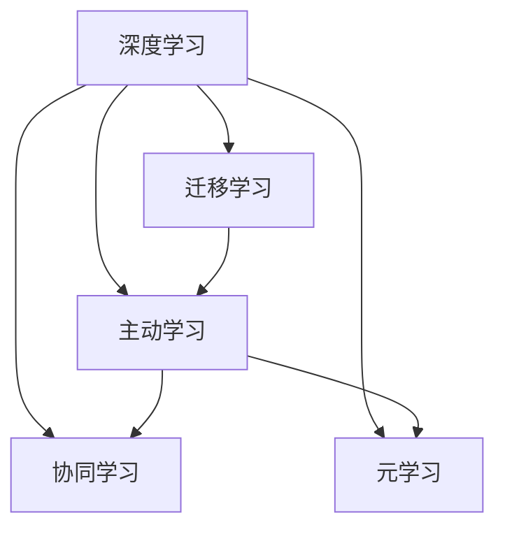

                 

# 洞察力：人类认知的新高度

## 1. 背景介绍

### 1.1 问题由来

人类认知的提升，是人类文明进步的重要推动力。从史前时期到现代社会，人类的认知能力经历了几次质的飞跃。首先是文字的出现，让人类能够保存知识和经验，形成深厚的文化底蕴；接着是印刷术的发明，使得知识传播速度和范围大大加快，更多人能接受教育；再到电子计算机和互联网的普及，信息处理速度和能力达到了前所未有的水平，人类的认知和知识积累速度也随之提升。

在当前这个信息爆炸的时代，人类的认知面临新的挑战。大量未经处理的信息数据，让人类无从下手；深度学习和大数据技术的进步，为解决这些问题提供了新的思路。本文聚焦于深度学习如何帮助我们提高认知能力，特别是如何借助人工智能技术，拓展人类认知的新高度。

### 1.2 问题核心关键点

深度学习在提高人类认知能力方面，具有以下几个核心关键点：

- **数据处理能力**：深度学习能处理大规模复杂数据，从大量数据中提取有用信息，大大提升了人类处理信息的能力。
- **模式识别与学习**：深度学习通过学习数据中的模式，自动进行特征提取，能够识别出人类难以发现的模式和规律。
- **泛化与迁移能力**：深度学习模型通过迁移学习，能够从旧任务中学习到的知识迁移到新任务上，提高了学习效率和适应能力。
- **人机协作**：深度学习结合人类知识与机器学习算法，能够辅助人类进行决策和分析，提高认知深度和广度。
- **主动学习**：深度学习能够通过主动学习，不断改进和优化自身的认知能力，逐步向更高级别的认知进化。

这些关键点使得深度学习成为提高人类认知能力的重要手段，有望在未来的智能社会中发挥更大的作用。

## 2. 核心概念与联系

### 2.1 核心概念概述

为更好地理解深度学习如何提高人类认知能力，本节将介绍几个密切相关的核心概念：

- **深度学习**：一类通过多层神经网络实现的机器学习技术，擅长处理非线性数据和高维特征，适用于复杂的模式识别和学习任务。
- **迁移学习**：在一种任务上学到的知识迁移到另一种相关任务上的技术，避免了从头开始训练，加快了学习速度。
- **主动学习**：一种机器学习方法，通过主动选择数据来训练模型，减少训练成本，提高学习效果。
- **协同学习**：多个智能体通过共享知识进行协同训练，达到更优的训练效果和学习能力。
- **元学习**：学习如何快速学习新任务的元方法，可以在新的任务上快速适应，具备更强的泛化能力。

这些核心概念之间的逻辑关系可以通过以下Mermaid流程图来展示：



这个流程图展示了几类重要概念及其之间的关系：

1. 深度学习提供基础的计算能力，是各类学习技术的基础。
2. 迁移学习、主动学习、协同学习和元学习都是深度学习的重要扩展和应用。
3. 这些技术相互结合，形成了深度学习在实际应用中的多种范式。

## 3. 核心算法原理 & 具体操作步骤

### 3.1 算法原理概述

深度学习通过多层神经网络来实现对数据的复杂非线性映射，使得模型能够从大量数据中提取高维特征，发现数据中的模式和规律。深度学习模型通常由输入层、隐藏层和输出层组成，隐藏层通过前向传播计算出中间表示，反向传播更新模型参数，实现对数据的拟合。

深度学习模型在训练过程中，通过迭代优化损失函数来逐步改进模型性能。常用的损失函数包括交叉熵、均方误差、KL散度等。模型训练时，一般使用梯度下降等优化算法来更新模型参数，通过不断迭代逼近最优解。

### 3.2 算法步骤详解

深度学习模型的训练过程一般包括以下几个步骤：

**Step 1: 数据准备**
- 收集和标注训练数据集，通常使用监督学习、半监督学习或无监督学习的方式进行数据标注。
- 将数据划分为训练集、验证集和测试集，确保模型在独立数据集上的泛化性能。

**Step 2: 模型设计**
- 选择合适的神经网络架构和参数设置，如卷积神经网络(CNN)、循环神经网络(RNN)、自编码器、生成对抗网络(GAN)等。
- 确定网络层数、每层神经元数量、激活函数、优化器、学习率等参数。

**Step 3: 模型训练**
- 将训练数据输入模型，进行前向传播计算中间表示。
- 计算损失函数，并通过反向传播算法更新模型参数。
- 在验证集上周期性评估模型性能，避免过拟合。
- 重复上述步骤直至收敛，得到最终的模型参数。

**Step 4: 模型评估**
- 在测试集上评估模型性能，通常使用准确率、召回率、F1值等指标进行评估。
- 分析模型在不同数据分布下的泛化能力。
- 识别模型的局限性和改进方向。

### 3.3 算法优缺点

深度学习的优点包括：

- **高精度**：在处理非线性和高维数据方面表现优秀，能发现复杂的模式和规律。
- **自适应**：能够通过自动化的方式进行特征提取和优化，提高模型的泛化能力。
- **通用性强**：在图像、语音、文本等多种领域中都有广泛应用。

同时，深度学习也存在一些缺点：

- **计算成本高**：深度学习模型通常参数量庞大，需要大量的计算资源进行训练。
- **可解释性差**：深度学习模型通常被视为“黑盒”，难以解释其内部的决策过程。
- **数据依赖性强**：模型性能高度依赖于数据质量和数量，数据标注成本高昂。
- **过拟合风险大**：在大规模数据和复杂模型中，容易出现过拟合现象。

尽管存在这些局限，但深度学习在提高人类认知能力方面依然展现了巨大的潜力。随着技术的发展，这些缺点有望逐步得到克服。

### 3.4 算法应用领域

深度学习在多个领域中得到了广泛应用，以下是一些典型的应用场景：

- **图像识别**：深度学习能够识别图像中的物体、场景、人脸等，广泛应用于医疗影像分析、自动驾驶、安防监控等领域。
- **语音识别**：深度学习能够实现对语音信号的分析和处理，支持智能客服、语音助手、语音翻译等功能。
- **自然语言处理**：深度学习能够理解和生成自然语言，支持机器翻译、情感分析、问答系统等应用。
- **推荐系统**：深度学习能够通过用户行为数据预测用户偏好，提升推荐系统的效果和个性化程度。
- **生物信息学**：深度学习能够处理大规模生物数据，支持基因组学、蛋白质组学、药物研发等领域的研究。
- **金融分析**：深度学习能够处理金融数据，支持股票预测、风险评估、信用评分等功能。

除了上述这些应用场景，深度学习还被用于时间序列预测、自动驾驶、智能制造等多个领域，为社会带来了深刻变革。

## 4. 数学模型和公式 & 详细讲解 & 举例说明

### 4.1 数学模型构建

本节将使用数学语言对深度学习模型的训练过程进行更加严格的刻画。

记深度学习模型为 $f_{\theta}(x)$，其中 $\theta$ 为模型参数，$x$ 为输入数据。假设训练数据集为 $\{(x_i,y_i)\}_{i=1}^N$，其中 $x_i$ 为输入样本，$y_i$ 为标签。

定义模型 $f_{\theta}$ 在数据样本 $(x,y)$ 上的损失函数为 $\ell(f_{\theta}(x),y)$，则在数据集 $D$ 上的经验风险为：

$$
\mathcal{L}(\theta) = \frac{1}{N} \sum_{i=1}^N \ell(f_{\theta}(x_i),y_i)
$$

训练目标是最小化经验风险，即找到最优参数：

$$
\theta^* = \mathop{\arg\min}_{\theta} \mathcal{L}(\theta)
$$

在实践中，我们通常使用基于梯度的优化算法（如SGD、Adam等）来近似求解上述最优化问题。设 $\eta$ 为学习率，$\lambda$ 为正则化系数，则参数的更新公式为：

$$
\theta \leftarrow \theta - \eta \nabla_{\theta}\mathcal{L}(\theta) - \eta\lambda\theta
$$

其中 $\nabla_{\theta}\mathcal{L}(\theta)$ 为损失函数对参数 $\theta$ 的梯度，可通过反向传播算法高效计算。

### 4.2 公式推导过程

以下我们以线性回归为例，推导最小二乘法损失函数的梯度计算公式。

假设模型 $f_{\theta}$ 在输入 $x$ 上的输出为 $\hat{y}=f_{\theta}(x)$，真实标签 $y$。则线性回归模型的损失函数定义为：

$$
\ell(f_{\theta}(x),y) = \frac{1}{2}(y-\hat{y})^2
$$

将其代入经验风险公式，得：

$$
\mathcal{L}(\theta) = \frac{1}{N}\sum_{i=1}^N (y_i-\hat{y}_i)^2
$$

根据链式法则，损失函数对参数 $\theta_k$ 的梯度为：

$$
\frac{\partial \mathcal{L}(\theta)}{\partial \theta_k} = -\frac{2}{N}\sum_{i=1}^N (y_i-\hat{y}_i)(x_i^T \nabla_{\theta}\hat{y}_i)
$$

其中 $\nabla_{\theta}\hat{y}_i$ 可进一步展开为 $\frac{\partial f_{\theta}(x_i)}{\partial \theta_k}$，然后通过自动微分技术完成计算。

在得到损失函数的梯度后，即可带入参数更新公式，完成模型的迭代优化。重复上述过程直至收敛，最终得到适应数据的模型参数 $\theta^*$。

### 4.3 案例分析与讲解

考虑一个简单的房价预测任务。假设数据集 $\{(x_i,y_i)\}_{i=1}^N$，其中 $x_i$ 为 $[1,0]$ 向量，表示房屋的面积、房间数、位置等特征，$y_i$ 为房屋的实际价格。构建一个线性回归模型 $f_{\theta}(x) = \theta_0 + \theta_1 x_1 + \theta_2 x_2 + \cdots$。

假设训练数据集如下：

| x       | y |
|---------|---|
| [1,1]   | 100 |
| [2,2]   | 200 |
| [3,3]   | 300 |
| ...     | ...|

根据最小二乘法损失函数的梯度计算公式，得到：

$$
\frac{\partial \mathcal{L}(\theta)}{\partial \theta_0} = -\frac{2}{N} \sum_{i=1}^N (y_i - (\theta_0 + \theta_1 x_{1,i} + \theta_2 x_{2,i} + \cdots)) = -\frac{2}{N} \sum_{i=1}^N (y_i - \hat{y}_i)
$$

$$
\frac{\partial \mathcal{L}(\theta)}{\partial \theta_1} = -\frac{2}{N} \sum_{i=1}^N (y_i - (\theta_0 + \theta_1 x_{1,i} + \theta_2 x_{2,i} + \cdots)) x_{1,i}
$$

依此类推，可以计算出模型各参数的梯度。通过梯度下降等优化算法，不断更新模型参数，最小化损失函数，即可得到适应训练数据的线性回归模型参数 $\theta^*$。

## 5. 项目实践：代码实例和详细解释说明

### 5.1 开发环境搭建

在进行深度学习实践前，我们需要准备好开发环境。以下是使用Python进行TensorFlow开发的环境配置流程：

1. 安装Anaconda：从官网下载并安装Anaconda，用于创建独立的Python环境。

2. 创建并激活虚拟环境：
```bash
conda create -n tf-env python=3.8 
conda activate tf-env
```

3. 安装TensorFlow：根据CUDA版本，从官网获取对应的安装命令。例如：
```bash
conda install tensorflow -c conda-forge -c pytorch -c tensorflow -c anaconda -c nvidia
```

4. 安装各类工具包：
```bash
pip install numpy pandas scikit-learn matplotlib tqdm jupyter notebook ipython
```

完成上述步骤后，即可在`tf-env`环境中开始深度学习实践。

### 5.2 源代码详细实现

这里我们以线性回归任务为例，给出使用TensorFlow进行深度学习的PyTorch代码实现。

首先，定义数据生成器和模型参数：

```python
import tensorflow as tf
import numpy as np

# 定义数据生成器
def generate_data(num_samples):
    x = np.random.uniform(low=-1, high=1, size=(num_samples, 2))
    y = np.dot(x, np.array([[1, 1], [0, 2]])) + np.random.normal(loc=0, scale=5, size=num_samples)
    return x, y

# 定义模型参数
theta = tf.Variable(tf.zeros([2]))

# 定义线性回归模型
def linear_regression(x):
    return tf.matmul(x, theta)

# 定义损失函数
def loss(x, y):
    y_pred = linear_regression(x)
    return tf.reduce_mean(tf.square(y_pred - y))

# 定义优化器
optimizer = tf.keras.optimizers.SGD(learning_rate=0.1)

# 定义模型训练函数
def train(num_epochs, batch_size):
    for epoch in range(num_epochs):
        for i in range(0, x.shape[0], batch_size):
            x_batch = x[i:i+batch_size]
            y_batch = y[i:i+batch_size]
            with tf.GradientTape() as tape:
                loss_value = loss(x_batch, y_batch)
            grads = tape.gradient(loss_value, theta)
            optimizer.apply_gradients(zip(grads, [theta]))
```

然后，启动模型训练流程：

```python
x, y = generate_data(1000)
train(num_epochs=50, batch_size=32)
```

这段代码展示了使用TensorFlow进行线性回归训练的完整过程。可以看到，通过定义数据生成器、模型参数、损失函数和优化器，可以很方便地构建和训练深度学习模型。

### 5.3 代码解读与分析

让我们再详细解读一下关键代码的实现细节：

**数据生成器**：
- 生成 $[1,0]$ 向量的随机数据集，标签为线性函数加上噪声。
- 通过 `numpy` 库生成数据，能够保证数据生成过程的灵活性和可重复性。

**模型参数**：
- 使用 `tf.Variable` 创建可训练的参数变量。
- 线性回归模型 $f_{\theta}(x) = \theta_0 + \theta_1 x_1 + \theta_2 x_2 + \cdots$。

**损失函数**：
- 定义损失函数为 $L(y,f(x)) = \frac{1}{N}\sum_{i=1}^N (y_i - f(x_i))^2$，使用 `tf.square` 和 `tf.reduce_mean` 计算平方误差和平均误差。

**优化器**：
- 使用梯度下降优化算法 `tf.keras.optimizers.SGD`，指定学习率 `learning_rate`。

**模型训练函数**：
- 通过 `tf.GradientTape` 计算梯度，使用 `optimizer.apply_gradients` 更新参数。
- 通过迭代训练，最小化损失函数，得到最终模型参数 $\theta^*$。

可以看到，TensorFlow提供的高阶API使得深度学习模型的构建和训练过程非常简洁高效。开发者可以将更多精力放在模型设计和优化上，而不必过多关注底层实现细节。

当然，工业级的系统实现还需考虑更多因素，如模型保存和部署、超参数调优、分布式训练等。但核心的深度学习训练流程基本与此类似。

## 6. 实际应用场景

### 6.1 智慧医疗

深度学习在医疗领域有着广泛的应用，能够处理复杂的医疗数据，辅助医生进行诊断和治疗。

例如，深度学习可以用于医学影像分析，自动识别和定位病变区域。通过训练大量医学影像数据，深度学习模型能够学习到病变区域的特征，对新的医学影像进行自动识别和分类。这不仅提高了诊断的效率，还能帮助医生发现微小的病变，避免漏诊和误诊。

### 6.2 金融分析

深度学习在金融领域的应用同样广泛，能够处理大量的金融数据，支持风险评估、股票预测等任务。

例如，深度学习可以用于股票预测，通过分析历史股价、市场情绪、经济指标等数据，预测未来的股价走势。通过训练大量的历史数据，深度学习模型能够学习到股市中的复杂关系，对未来股价做出精准预测。这不仅帮助投资者做出更明智的投资决策，还能提升金融市场的透明度和公平性。

### 6.3 智能制造

深度学习在制造业中的应用也逐渐增多，能够处理生产线上的大量数据，提升生产效率和质量。

例如，深度学习可以用于生产过程监控，通过分析生产线的传感器数据，实时监控生产状态，预测设备故障，提前进行维护。通过训练大量的生产线数据，深度学习模型能够学习到生产过程中的异常模式，对未来的生产过程进行预测和优化。这不仅提升了生产线的稳定性，还降低了生产成本，提高了生产效率。

### 6.4 未来应用展望

随着深度学习技术的发展，未来的应用场景将更加多样化，影响更加广泛。

在智慧农业领域，深度学习可以用于农作物生长监测，通过分析土壤、气象、病虫害等数据，预测农作物的生长情况，优化种植方案，提高农业生产的效率和质量。

在智能交通领域，深度学习可以用于交通流量预测，通过分析交通数据，预测未来交通流量，优化交通管理，减少交通拥堵，提升交通安全。

在智慧城市领域，深度学习可以用于城市规划和资源管理，通过分析城市数据，优化城市布局，提升城市的智能化水平，提高居民的生活质量。

总之，深度学习在未来的智慧社会中将发挥重要作用，推动各行业的智能化升级。

## 7. 工具和资源推荐

### 7.1 学习资源推荐

为了帮助开发者系统掌握深度学习的理论和实践，这里推荐一些优质的学习资源：

1. **《深度学习》一书**：Ian Goodfellow等人的经典著作，全面介绍了深度学习的基本概念和算法，是入门和进阶的必读书籍。

2. **Coursera《深度学习专项课程》**：由Andrew Ng等人的Coursera深度学习专项课程，涵盖深度学习的基本理论和实践技能，适合入门学习。

3. **斯坦福大学CS231n《深度学习在计算机视觉中的应用》课程**：斯坦福大学的经典课程，深入讲解了深度学习在图像识别和计算机视觉中的应用。

4. **Kaggle竞赛平台**：Kaggle是世界上最大的数据科学竞赛平台，通过参加比赛，可以实践和提升深度学习的实战能力。

5. **DeepLearning.AI《深度学习基石》课程**：由Google和DeepLearning.AI合作的在线课程，系统讲解了深度学习的基本原理和实现技巧。

6. **GitHub开源项目**：通过参与和贡献开源项目，可以学习到深度学习的最新进展和实践经验。

通过对这些资源的学习实践，相信你一定能够系统掌握深度学习的理论和实践技能，并在实际应用中取得成功。

### 7.2 开发工具推荐

高效的开发离不开优秀的工具支持。以下是几款用于深度学习开发的常用工具：

1. **TensorFlow**：由Google主导开发的深度学习框架，支持多种编程语言，易于扩展和部署。

2. **PyTorch**：由Facebook主导开发的深度学习框架，以其动态图机制和灵活性著称，广泛应用于研究领域。

3. **MXNet**：由亚马逊主导开发的深度学习框架，支持多种编程语言，易于部署和扩展。

4. **Keras**：基于TensorFlow和Theano等深度学习框架的高级API，易于使用和上手。

5. **Jax**：由Google主导开发的深度学习框架，支持动态图和静态图，具有出色的性能和可扩展性。

6. **TorchScript**：PyTorch的静态图机制，可以将模型导出为可部署的形式，支持多种语言和平台。

合理利用这些工具，可以显著提升深度学习的开发效率，加快创新迭代的步伐。

### 7.3 相关论文推荐

深度学习技术的发展源于学界的持续研究。以下是几篇奠基性的相关论文，推荐阅读：

1. **《深度学习》论文**：Ian Goodfellow等人的深度学习奠基之作，奠定了深度学习的基本框架和算法。

2. **《ImageNet大规模视觉识别挑战》论文**：AlexNet在ImageNet比赛中的胜利，标志着深度学习在图像识别领域的重大突破。

3. **《Google Brain的深度学习研究》论文**：Google Brain团队的多项深度学习研究，包括AlphaGo、BERT等，推动了深度学习技术的发展。

4. **《DeepMind的AlphaGo研究》论文**：DeepMind的AlphaGo在围棋比赛中战胜人类冠军，展示了深度学习在决策和策略优化中的强大能力。

5. **《BERT: Pre-training of Deep Bidirectional Transformers for Language Understanding》论文**：BERT模型在自然语言处理中的突破性表现，推动了大规模预训练语言模型的发展。

6. **《Google的BERT论文》论文**：Google的BERT模型在自然语言处理中的突破性表现，展示了深度学习在语言理解中的强大能力。

这些论文代表了大深度学习技术的发展脉络。通过学习这些前沿成果，可以帮助研究者把握学科前进方向，激发更多的创新灵感。

## 8. 总结：未来发展趋势与挑战

### 8.1 总结

本文对深度学习在提高人类认知能力方面的研究进行了全面系统的介绍。首先阐述了深度学习在提升人类认知能力方面的应用前景，明确了深度学习在处理大规模数据和复杂模式中的独特优势。其次，从原理到实践，详细讲解了深度学习的数学模型和核心算法，给出了深度学习任务开发的完整代码实例。同时，本文还广泛探讨了深度学习在医疗、金融、智能制造等多个领域的应用前景，展示了深度学习技术的广阔应用空间。

通过本文的系统梳理，可以看到，深度学习技术在提高人类认知能力方面展现出了巨大的潜力，有望在未来的智能社会中发挥更大的作用。未来，深度学习技术将不断拓展，推动各行业的智能化升级，为人类认知智能的进化带来深远影响。

### 8.2 未来发展趋势

展望未来，深度学习技术的发展将呈现以下几个趋势：

1. **计算能力提升**：随着硬件技术的进步，深度学习模型的计算能力将不断提升，能够处理更复杂、更大规模的数据。

2. **模型结构优化**：未来的深度学习模型将更加复杂、更加高效，具备更强的特征提取和模式识别能力。

3. **跨领域应用拓展**：深度学习将广泛应用于更多的领域，推动各行业的智能化升级，提升生产力水平。

4. **多模态融合**：深度学习将能够处理多种模态数据，实现视觉、语音、文本等多种信息的协同建模，提升信息处理能力。

5. **自监督学习**：未来的深度学习模型将更多地利用无监督数据进行预训练，减少对标注数据的依赖。

6. **人机协同**：深度学习将与人机协同工作，通过辅助人类进行决策和分析，提升认知深度和广度。

以上趋势凸显了深度学习技术的未来发展方向，将为各行业带来深远变革。

### 8.3 面临的挑战

尽管深度学习技术在提高人类认知能力方面展现了巨大潜力，但在迈向更加智能化、普适化应用的过程中，仍面临诸多挑战：

1. **数据隐私和安全**：深度学习模型需要大量数据进行训练，如何保护用户数据隐私，防止数据泄露，是一个重要问题。

2. **模型可解释性**：深度学习模型通常是“黑盒”，难以解释其内部的决策过程，如何提高模型的可解释性，也是一个重要的研究方向。

3. **计算资源消耗**：深度学习模型的训练和推理需要大量的计算资源，如何在资源有限的情况下，实现高效的深度学习应用，是一个重要挑战。

4. **泛化能力不足**：深度学习模型在训练集上的表现往往优于测试集，如何提高模型的泛化能力，防止过拟合，也是一个重要问题。

5. **鲁棒性和稳定性**：深度学习模型面对噪声和异常数据时，容易发生波动，如何提高模型的鲁棒性和稳定性，也是一个重要挑战。

6. **伦理和社会问题**：深度学习模型可能学习到有害的偏见和歧视，如何保证模型的公平性和伦理道德，也是一个重要问题。

正视深度学习面临的这些挑战，积极应对并寻求突破，将是大深度学习技术迈向成熟的必由之路。相信随着学界和产业界的共同努力，这些挑战终将一一被克服，深度学习技术必将在构建安全、可靠、可解释、可控的智能系统铺平道路。

### 8.4 研究展望

面对深度学习面临的挑战，未来的研究需要在以下几个方面寻求新的突破：

1. **数据隐私保护**：研究如何保护用户数据隐私，防止数据泄露，提升数据利用效率。

2. **模型可解释性**：研究如何提高深度学习模型的可解释性，增强其透明度和可信度。

3. **高效计算**：研究如何优化深度学习模型的计算效率，降低计算资源消耗。

4. **泛化能力提升**：研究如何提高深度学习模型的泛化能力，防止过拟合，提升模型适应性。

5. **鲁棒性和稳定性**：研究如何提高深度学习模型的鲁棒性和稳定性，提升系统可靠性。

6. **伦理和社会问题**：研究如何保证深度学习模型的公平性和伦理道德，防止有害偏见和歧视。

这些研究方向将推动深度学习技术向更高级别进化，提升其应用价值和社会影响。

## 9. 附录：常见问题与解答

**Q1: 深度学习是否能够替代人类智能？**

A: 深度学习在处理特定任务时，表现出强大的能力和效率，但在复杂情境下，仍需要人类智能的辅助。深度学习能够处理大量数据，但缺乏对复杂情境的全面理解和判断，仍需人类智能的参与。

**Q2: 深度学习如何保护用户数据隐私？**

A: 深度学习模型需要大量数据进行训练，为保护用户数据隐私，可以采用数据脱敏、差分隐私等技术，减少对敏感数据的依赖。同时，可以使用分布式训练和联邦学习等技术，在不共享原始数据的情况下，实现模型的协同训练。

**Q3: 如何提高深度学习模型的可解释性？**

A: 提高深度学习模型的可解释性，可以采用可视化工具和解释性模型，如LIME、SHAP等，帮助理解模型的决策过程。同时，可以通过改进模型结构和训练方式，提高模型的透明度和可信度。

**Q4: 如何优化深度学习模型的计算效率？**

A: 优化深度学习模型的计算效率，可以采用分布式训练、模型剪枝、量化加速等技术，降低计算资源消耗。同时，可以使用更高效的前向传播和反向传播算法，提升计算速度。

**Q5: 如何提升深度学习模型的泛化能力？**

A: 提升深度学习模型的泛化能力，可以采用数据增强、正则化、对抗训练等技术，避免模型过拟合。同时，可以通过多模型集成和迁移学习，提升模型的适应性和鲁棒性。

这些问题的解答，希望能为你理解深度学习技术提供更多参考。深度学习在提高人类认知能力方面展现了巨大潜力，相信在未来的研究中，深度学习技术将不断进步，为人类认知智能的进化带来深远影响。

