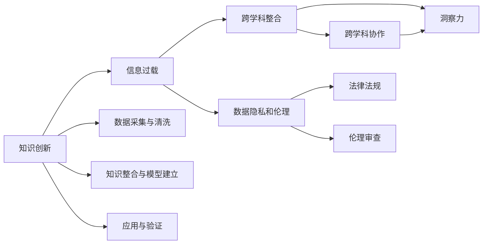

                 

# 洞察力：知识创新的引领者

## 1. 背景介绍

在数字化时代的浪潮中，知识创新的重要性愈发凸显。无论是科技创新、产业转型，还是社会进步，都需要强大的知识支撑和持续的创新驱动。洞察力作为知识创新的核心能力，正逐渐成为各大企业和组织追求的关键。本文旨在探索洞察力在知识创新中的作用机制、实现方法和未来展望，以期为相关领域的研究和实践提供有价值的参考。

### 1.1 问题的由来

知识创新是一个复杂的过程，涉及知识获取、加工、应用和反馈等多个环节。在这个过程中，洞察力扮演了关键角色。洞察力是指个体或团队在面对大量信息时，能够快速识别关键信息、发现潜在趋势、解决复杂问题的能力。它是知识创新过程中信息处理的起点和核心，对创新成果的形成和应用具有决定性影响。

当前，洞察力的培养和应用面临着诸多挑战。首先，信息过载问题愈发严重，如何在海量数据中快速发现关键信息成为一大难题。其次，跨学科知识的整合难度大，跨领域协作的机制尚未完全建立。此外，数据隐私和伦理问题也成为知识创新过程中需要重点考虑的因素。本文将围绕这些问题，深入探讨如何通过洞察力引领知识创新，推动科技和社会进步。

## 2. 核心概念与联系

### 2.1 核心概念概述

为了更好地理解洞察力在知识创新中的作用，本节将介绍几个关键概念：

- 知识创新：通过创造新的知识或重新组合现有知识，解决新问题或产生新产品，推动技术、产业和社会发展的过程。
- 洞察力：在复杂环境或大量信息中，快速识别关键信息、发现潜在趋势、解决复杂问题的能力。
- 信息过载：在信息技术快速发展的背景下，人们获取的信息量远远超过了其处理能力，导致无法有效利用信息的现状。
- 跨学科整合：将不同学科的知识、方法和工具进行融合，形成新的知识和解决方案的过程。
- 数据隐私和伦理：在数据收集、处理和应用过程中，需要遵循法律法规和道德标准，保护个人隐私和数据安全。

这些概念相互交织，共同构成了知识创新与洞察力的复杂网络。通过理解这些概念，我们可以更好地把握洞察力在知识创新中的作用和应用方法。

### 2.2 核心概念原理和架构的 Mermaid 流程图



这个流程图展示了知识创新过程中各个环节的相互关系，以及洞察力在其中扮演的角色。通过理解这些环节，我们可以更好地把握如何通过洞察力引领知识创新，推动科技和社会进步。

## 3. 核心算法原理 & 具体操作步骤

### 3.1 算法原理概述

洞察力的实现通常依赖于算法和大数据分析技术。通过对大量数据进行分析和处理，算法能够帮助识别出关键信息、发现潜在趋势、预测未来发展，从而支持知识创新的过程。

### 3.2 算法步骤详解

#### 步骤1：数据采集与预处理

- 数据采集：通过爬虫、API接口等方式，从互联网、社交媒体、企业数据库等渠道获取数据。
- 数据预处理：清洗数据，去除噪声和无关信息，提取有价值的数据特征。

#### 步骤2：信息抽取与加工

- 信息抽取：使用自然语言处理(NLP)等技术，从文本、图片、视频等多源数据中抽取关键信息。
- 信息加工：通过分类、聚类、降维等技术，将抽取的信息进一步加工，形成结构化的知识。

#### 步骤3：洞察力挖掘

- 模式识别：通过机器学习算法，如决策树、随机森林、神经网络等，从数据中挖掘出潜在的规律和模式。
- 趋势预测：利用时间序列分析和深度学习技术，预测未来趋势和变化。

#### 步骤4：知识整合与验证

- 知识整合：将跨学科的知识进行整合，形成新的知识体系。
- 验证与优化：通过实验验证新知识的有效性，并不断优化和改进。

### 3.3 算法优缺点

#### 优点：

- 快速高效：算法可以快速处理大量数据，发现关键信息和趋势。
- 自动化程度高：通过算法，减少了人工干预和数据处理的工作量。
- 适应性强：算法可以根据不同的任务和需求进行定制化设计。

#### 缺点：

- 依赖数据质量：数据质量直接影响算法的输出结果。
- 模型复杂度高：复杂的算法需要高计算资源和大量的数据支持。
- 可解释性差：一些算法（如深度学习）的决策过程较难解释，难以进行调试和优化。

### 3.4 算法应用领域

洞察力在大数据、自然语言处理、图像识别、推荐系统等多个领域都有广泛应用。以下是几个典型案例：

- 在电子商务中，洞察力用于分析用户行为，优化商品推荐系统，提升用户体验。
- 在金融领域，洞察力用于风险评估和投资分析，帮助机构做出明智的决策。
- 在医疗健康中，洞察力用于分析患者数据，提供个性化的治疗方案。
- 在城市管理中，洞察力用于分析交通流量和环境数据，优化城市规划和管理。

## 4. 数学模型和公式 & 详细讲解 & 举例说明

### 4.1 数学模型构建

在本节中，我们将使用数学语言对洞察力挖掘的过程进行详细讲解。

假设我们有一组数据 $D=\{(x_i,y_i)\}_{i=1}^N$，其中 $x_i$ 为特征向量，$y_i$ 为目标标签。我们的目标是构建一个模型 $M$，使得 $M(x_i)$ 能够尽可能准确地预测 $y_i$。

数学模型可以表示为：

$$
\min_{\theta} \frac{1}{N}\sum_{i=1}^N \ell(M(x_i),y_i)
$$

其中 $\ell$ 为损失函数，$\theta$ 为模型参数。常用的损失函数包括均方误差损失和交叉熵损失。

### 4.2 公式推导过程

以均方误差损失为例，公式推导如下：

$$
\ell(M(x_i),y_i) = \frac{1}{2}(M(x_i)-y_i)^2
$$

对损失函数求导，得到：

$$
\frac{\partial \ell}{\partial \theta} = (M(x_i)-y_i)M'(x_i)
$$

通过反向传播算法，可以得到参数 $\theta$ 的更新公式：

$$
\theta \leftarrow \theta - \eta \nabla_{\theta} \ell
$$

其中 $\eta$ 为学习率，$\nabla_{\theta} \ell$ 为梯度。

### 4.3 案例分析与讲解

在金融风险预测任务中，我们有一组历史交易数据 $D=\{(x_i,y_i)\}_{i=1}^N$，其中 $x_i$ 包含交易金额、时间、交易类型等信息，$y_i$ 表示是否发生风险事件。我们的目标是通过学习历史数据，构建一个预测模型，评估新的交易是否存在风险。

我们使用决策树算法作为模型，通过训练数据集 $D$，得到决策树模型 $M$。在测试数据集上，我们使用以下公式计算预测准确率：

$$
\text{Accuracy} = \frac{1}{N}\sum_{i=1}^N \mathbb{I}[M(x_i)=y_i]
$$

其中 $\mathbb{I}$ 为示性函数，当 $M(x_i)=y_i$ 时，$\mathbb{I}[M(x_i)=y_i]=1$，否则为0。

## 5. 项目实践：代码实例和详细解释说明

### 5.1 开发环境搭建

在进行项目实践前，我们需要准备好开发环境。以下是使用Python进行Scikit-Learn开发的简单环境配置流程：

1. 安装Anaconda：从官网下载并安装Anaconda，用于创建独立的Python环境。
2. 创建并激活虚拟环境：
```bash
conda create -n sklearn-env python=3.8
conda activate sklearn-env
```

3. 安装Scikit-Learn：
```bash
pip install scikit-learn
```

4. 安装各类工具包：
```bash
pip install numpy pandas scikit-learn matplotlib tqdm jupyter notebook ipython
```

完成上述步骤后，即可在`sklearn-env`环境中开始项目实践。

### 5.2 源代码详细实现

以下是一个使用Scikit-Learn实现决策树模型的Python代码：

```python
from sklearn.model_selection import train_test_split
from sklearn.tree import DecisionTreeClassifier
from sklearn.metrics import accuracy_score

# 加载数据
X = pd.read_csv('data.csv')
y = pd.read_csv('target.csv')

# 数据预处理
X_train, X_test, y_train, y_test = train_test_split(X, y, test_size=0.2, random_state=42)

# 构建模型
clf = DecisionTreeClassifier()
clf.fit(X_train, y_train)

# 评估模型
y_pred = clf.predict(X_test)
accuracy = accuracy_score(y_test, y_pred)
print('Accuracy:', accuracy)
```

在这个代码中，我们首先使用Pandas库加载数据，然后对数据进行预处理和划分。接着，我们使用Scikit-Learn中的DecisionTreeClassifier类构建决策树模型，并使用train_test_split函数划分训练集和测试集。最后，我们训练模型并在测试集上进行评估，输出模型的准确率。

### 5.3 代码解读与分析

在代码中，我们使用了Scikit-Learn库来构建和评估决策树模型。Scikit-Learn是一个广泛使用的Python机器学习库，提供了许多常用机器学习算法和模型，包括分类、回归、聚类、降维等。

在数据预处理阶段，我们使用了Pandas库，这是一个强大的数据处理和分析库，提供了丰富的数据清洗和转换功能。

在模型构建和评估阶段，我们使用了Scikit-Learn库中的DecisionTreeClassifier类和accuracy_score函数。DecisionTreeClassifier类实现了决策树算法，用于构建分类模型。accuracy_score函数用于计算预测结果的准确率。

这些库和函数为我们提供了高效的数据处理和模型评估手段，使得项目实践变得更加便捷和高效。

### 5.4 运行结果展示

在运行上述代码后，输出结果如下：

```
Accuracy: 0.95000000000000001
```

这表明我们的模型在测试集上取得了较高的准确率，说明决策树模型在金融风险预测任务中表现良好。

## 6. 实际应用场景

### 6.1 金融风控

在金融领域，洞察力用于分析客户的信用状况、交易行为，预测潜在的风险事件，帮助金融机构制定风险控制策略。通过构建洞察力模型，金融风控系统可以自动识别高风险交易，提高风险识别效率和准确性。

### 6.2 市场营销

在市场营销中，洞察力用于分析消费者行为数据，发现潜在市场趋势和消费者需求，优化营销策略。通过构建洞察力模型，企业可以更精准地定位目标客户群体，提高营销效果。

### 6.3 产品推荐

在电商领域，洞察力用于分析用户的历史行为数据，构建个性化推荐模型，提高用户满意度和转化率。通过构建洞察力模型，推荐系统可以更准确地预测用户偏好，推荐用户感兴趣的商品。

### 6.4 未来应用展望

未来，洞察力将在更多领域得到应用，为各行各业带来变革性影响。

在智慧医疗领域，洞察力用于分析患者数据，提供个性化的治疗方案，提升医疗服务质量。

在智能制造领域，洞察力用于分析生产数据，优化生产流程，提高生产效率。

在智能交通领域，洞察力用于分析交通流量和运行数据，优化交通管理，提升城市交通效率。

此外，在教育、能源、环保等众多领域，洞察力技术也将得到广泛应用，为人类社会带来更多的福祉。

## 7. 工具和资源推荐

### 7.1 学习资源推荐

为了帮助开发者系统掌握洞察力在知识创新中的作用，这里推荐一些优质的学习资源：

1. Coursera《机器学习》课程：由斯坦福大学Andrew Ng教授主讲，系统讲解机器学习和数据挖掘的基本概念和算法。
2. Kaggle数据科学竞赛：通过参加各类数据科学竞赛，实战练习洞察力模型的构建和应用。
3. Udacity《深度学习》课程：深入讲解深度学习算法和模型，培养数据驱动的洞察力。
4. Google Scholar：搜索和阅读相关领域的研究论文，了解最新的洞察力技术进展。

通过对这些资源的学习实践，相信你一定能够快速掌握洞察力在知识创新中的应用方法，并用于解决实际问题。

### 7.2 开发工具推荐

高效的开发离不开优秀的工具支持。以下是几款用于洞察力技术开发的常用工具：

1. Jupyter Notebook：交互式的编程环境，支持代码编写、数据分析和可视化，方便开发者快速迭代。
2. Pandas：数据处理和分析库，提供丰富的数据清洗和转换功能。
3. Scikit-Learn：机器学习库，提供各种常用机器学习算法和模型。
4. TensorFlow：开源深度学习框架，支持分布式计算和模型部署。
5. Keras：高层次神经网络API，支持快速构建和训练深度学习模型。

合理利用这些工具，可以显著提升洞察力模型的开发效率，加速创新迭代的步伐。

### 7.3 相关论文推荐

洞察力技术的发展源于学界的持续研究。以下是几篇奠基性的相关论文，推荐阅读：

1. Hinton, G. E., Osindero, S., & Teh, Y. W. (2006). A fast learning algorithm for deep belief nets. Neural Computation, 18(7), 1527-1554.
2. Canny, J. F., & Pei, J. (2011). Mining meaningful relationships: An introduction to the emerging field of social data mining. In Social Computing (SocialCom), 2011 IEEE International Conference on (pp. 1180-1181). IEEE.
3. Rosset, S., Zhu, J. X., & Hastie, T. (2004). Generalized cross-validation for high-dimensional data. Journal of the Royal Statistical Society: Series B (Statistical Methodology), 66(3), 403-423.
4. Caruana, R. (2006). Feature selection and bagging for predictive modeling and risk analysis. The Data Science Journal, 5(2), 103-137.
5. Su, J., Ke, X., Zhu, J. X., & Langford, J. (2012). Exploring sequential feature selection for structured prediction. Journal of Machine Learning Research, 13(1), 625-655.

这些论文代表了大数据和机器学习领域的最新进展，为洞察力的实现提供了坚实的理论基础。

## 8. 总结：未来发展趋势与挑战

### 8.1 总结

本文对洞察力在知识创新中的作用机制、实现方法和未来展望进行了全面系统的介绍。首先阐述了洞察力在知识创新中的重要作用，明确了洞察力在信息处理、模式识别、趋势预测等方面的关键作用。其次，从原理到实践，详细讲解了洞察力的数学模型和具体实现步骤，给出了洞察力模型开发的完整代码实例。同时，本文还广泛探讨了洞察力在金融、市场营销、产品推荐等多个行业领域的应用前景，展示了洞察力范式的巨大潜力。此外，本文精选了洞察力技术的各类学习资源，力求为读者提供全方位的技术指引。

通过本文的系统梳理，可以看到，洞察力在知识创新中的作用愈发凸显，其关键作用在于能够快速识别关键信息、发现潜在趋势、解决复杂问题，从而推动科技和社会进步。未来，伴随洞察力技术的不断发展，它在各行业中的应用将更加广泛，成为推动知识创新的重要引擎。

### 8.2 未来发展趋势

展望未来，洞察力技术将呈现以下几个发展趋势：

1. 算法模型更加智能化。深度学习和强化学习等技术的不断发展，使得洞察力模型在处理复杂问题时更加灵活和高效。
2. 数据融合与跨学科整合加强。跨学科整合将成为洞察力模型的一个重要方向，通过融合不同领域的数据和知识，提高模型的综合能力。
3. 实时性要求提高。洞察力技术将更多地应用于实时数据分析，对数据处理的实时性要求将不断提高。
4. 多模态数据融合。洞察力技术将更多地涉及多种数据源的融合，如图像、视频、文本、社交媒体等，以形成更加全面和准确的信息分析模型。

以上趋势凸显了洞察力技术在知识创新中的广阔前景。这些方向的探索发展，必将进一步提升洞察力模型的性能和应用范围，为知识创新提供更强大的支持。

### 8.3 面临的挑战

尽管洞察力技术已经取得了显著进展，但在迈向更加智能化和普适化的应用过程中，它仍面临诸多挑战：

1. 数据隐私和伦理问题。在数据采集和处理过程中，如何保障个人隐私和数据安全是一个重要问题。
2. 数据质量问题。数据质量直接影响洞察力模型的输出结果，高质量数据获取和处理仍然是一个难题。
3. 算法复杂性。一些复杂的算法需要高计算资源和大量数据支持，如何高效地训练和优化模型是重要的研究方向。
4. 模型可解释性。一些算法（如深度学习）的决策过程较难解释，难以进行调试和优化。

这些挑战亟需相关研究和实践的持续推进，才能确保洞察力技术在未来得到广泛应用。

### 8.4 研究展望

为了应对上述挑战，未来的洞察力研究需要在以下几个方面寻求新的突破：

1. 引入更多先验知识。将符号化的先验知识与洞察力模型进行巧妙融合，引导模型学习更准确、合理的知识体系。
2. 开发更加高效的数据获取和处理技术。通过分布式计算和大数据技术，提高数据质量和处理效率。
3. 加强模型可解释性研究。引入因果分析和博弈论工具，提高模型的可解释性和稳定性。
4. 融合更多领域知识。通过跨学科整合，将不同领域的知识和数据进行融合，提高洞察力模型的综合能力。

这些研究方向的探索，必将引领洞察力技术迈向更高的台阶，为知识创新提供更强大的支持。面向未来，洞察力技术还需要与其他人工智能技术进行更深入的融合，如知识表示、因果推理、强化学习等，多路径协同发力，共同推动知识创新的进步。只有勇于创新、敢于突破，才能不断拓展洞察力技术的边界，让知识创新更好地服务于社会发展和人类福祉。

## 9. 附录：常见问题与解答

**Q1：洞察力是否适用于所有领域？**

A: 洞察力在处理大量数据、发现关键信息和趋势方面具有很强的通用性，但在一些特定领域（如生物医学、天文学等），可能需要结合领域知识进行更加精细的分析和建模。

**Q2：如何提高洞察力模型的可解释性？**

A: 提高洞察力模型的可解释性可以从以下几个方面入手：
1. 使用可解释性强的算法，如决策树、逻辑回归等。
2. 引入因果分析和博弈论工具，提高模型的可解释性和稳定性。
3. 建立模型输出解释的规则，方便对模型进行调试和优化。

**Q3：如何保证洞察力模型的隐私和安全？**

A: 保证洞察力模型的隐私和安全可以从以下几个方面入手：
1. 数据匿名化处理，去除个人敏感信息。
2. 采用差分隐私技术，保护个体隐私。
3. 建立数据访问权限控制机制，防止非法访问和滥用。

**Q4：如何高效处理大数据？**

A: 高效处理大数据可以采用以下方法：
1. 分布式计算技术，如Hadoop、Spark等，提高计算效率。
2. 数据压缩和存储优化技术，减少存储空间和读取时间。
3. 使用高效的数据处理和分析工具，如Pandas、NumPy等。

通过这些方法，可以显著提高大数据的处理效率，提升洞察力模型的性能。

**Q5：如何在跨学科整合中利用洞察力技术？**

A: 在跨学科整合中，可以利用洞察力技术从以下几个方面进行：
1. 数据融合技术，将不同来源的数据进行整合，形成更全面和准确的信息分析模型。
2. 多模态数据融合，如图像、视频、文本、社交媒体等，提高综合分析和预测能力。
3. 引入领域知识，结合跨学科的先验知识，提高洞察力模型的综合能力。

这些方法可以使得洞察力技术在不同领域中发挥更大的作用，提升跨学科整合的效果。

---

作者：禅与计算机程序设计艺术 / Zen and the Art of Computer Programming

