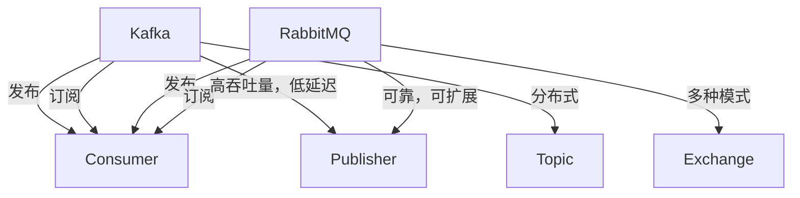

                 

# 消息队列：Kafka与RabbitMQ对比

> 关键词：消息队列，Kafka，RabbitMQ，分布式系统，企业架构，数据流，中间件，高效性，可扩展性，可靠性

## 1. 背景介绍

### 1.1 问题由来

在当今数字化转型背景下，系统间解耦、数据流处理、分布式系统构建成为企业应用开发的重要诉求。消息队列作为异步通信的中介，被广泛应用于微服务架构、流处理引擎、数据流同步等领域。特别是在大规模、高并发、高可靠的系统建设中，选择一款高性能、可扩展、稳定可靠的消息队列成为了关键。

常用的消息队列包括Apache Kafka和RabbitMQ。Kafka由Apache基金会维护，诞生于2008年，主要设计用于大型分布式数据流系统；RabbitMQ则由VMware主导，基于AMQP协议，提供强健的发布/订阅消息通信。两者在数据流架构、企业集成、数据同步等方面具有不同的应用优势，本文将对Kafka与RabbitMQ进行对比，分析各自的适用场景与技术细节。

### 1.2 问题核心关键点

两者的核心关键点在于：

- Kafka采用分布式流式数据处理框架，侧重于高吞吐量、低延迟的数据流处理。
- RabbitMQ专注于基于AMQP协议的可靠消息传递，提供稳定的消息发布与消费机制。

这两种机制具有不同的适用场景和技术特点，选择其一取决于具体的应用需求与系统架构。

## 2. 核心概念与联系

### 2.1 核心概念概述

#### 2.1.1 Kafka
Kafka是一种分布式流处理平台，由Apache基金会开发，最初由LinkedIn开发用于公司内部。Kafka主要基于发布/订阅消息模型，适用于高吞吐量、低延迟、高可靠性数据流处理。它由多个主题（Topic）组成，每个主题由若干分区（Partition）组成，消息被持续写入分区中，供消费者订阅与消费。

#### 2.1.2 RabbitMQ
RabbitMQ是一种基于AMQP协议的消息队列系统，提供可靠的发布/订阅消息传递机制，广泛用于企业集成、数据流同步等场景。RabbitMQ支持多种消息传递模式，如点对点、发布/订阅等，并通过插件机制扩展消息传输能力。

#### 2.1.3 连接
Kafka和RabbitMQ虽设计目标与实现机制不同，但都提供了高性能、高可靠的消息传递机制。两者的核心联系在于：

- 异步通信：支持系统间异步通信，降低系统耦合度。
- 分布式处理：通过分布式主题或交换机，实现高并发的消息传递。
- 可靠性保障：通过消息存储、冗余配置等手段，保障消息传递的可靠性。
- 可扩展性：支持横向扩展，应对大规模数据流。

### 2.2 核心概念原理和架构的 Mermaid 流程图



这个图展示了Kafka和RabbitMQ的基本工作原理。两者都支持发布/订阅模式，用于异步通信与数据传递。但Kafka侧重于高吞吐量、低延迟的数据流处理，而RabbitMQ则更注重可靠性、可扩展性。

## 3. 核心算法原理 & 具体操作步骤

### 3.1 算法原理概述

#### 3.1.1 Kafka
Kafka基于分布式文件系统设计，其核心算法原理包含：

- **分区（Partition）**：每个主题由多个分区组成，分区使Kafka可以处理更大规模的数据流，并支持水平扩展。
- **复制（Replication）**：通过配置多个分区副本（Replica），保证数据冗余和容错性。
- **消费者组（Consumer Group）**：通过消费者组机制，多个消费者可以同时消费同一个分区，避免消息积压。
- **存储引擎**：Kafka采用基于日志的存储方式，通过增量式的数据追加写入，降低存储压力。

#### 3.1.2 RabbitMQ
RabbitMQ的核心算法原理包含：

- **交换机（Exchange）**：消息传递的核心，类似路由器，根据规则将消息发送到具体的队列。
- **队列（Queue）**：消息的存储场所，多个队列可以实现分布式存储。
- **消费者（Consumer）**：从队列中取出消息，并进行处理。
- **路由与分发**：通过插件机制，支持多种消息传递模式与路由策略。

### 3.2 算法步骤详解

#### 3.2.1 Kafka

1. **创建主题与分区**：
    ```python
    from kafka import KafkaAdminClient, KafkaProducer
    admin = KafkaAdminClient(bootstrap_servers=['localhost:9092'])
    topic = 'test'
    admin.create_topic(name=topic, replication_factor=3, partitions=3)
    producer = KafkaProducer(bootstrap_servers=['localhost:9092'])
    ```
2. **生产消息**：
    ```python
    for i in range(10):
        producer.send(topic, bytes(f'Message {i}', encoding='utf-8'))
    producer.flush()
    ```
3. **消费消息**：
    ```python
    consumer = KafkaConsumer('test', bootstrap_servers=['localhost:9092'], group_id='test-group')
    for message in consumer:
        print(message.value)
    ```

#### 3.2.2 RabbitMQ

1. **创建交换机**：
    ```python
    from pika import BlockingConnection, ExchangeType
    connection = BlockingConnection(host='localhost')
    channel = connection.channel()
    channel.exchange_declare(exchange='test', exchange_type='direct', durable=True)
    ```
2. **发布消息**：
    ```python
    channel.basic_publish(exchange='test', routing_key='key', body='Message', properties=pika.BasicProperties(delivery_mode=2))
    ```
3. **消费消息**：
    ```python
    channel = connection.channel()
    channel.queue_declare(queue='queue', durable=True)
    channel.bind_queue_to_exchange(queue='queue', exchange='test', routing_key='key')
    channel.start_consuming()
    ```

### 3.3 算法优缺点

#### 3.3.1 Kafka

- **优点**：
    - **高吞吐量**：支持单分区每秒百万级别的消息传递。
    - **低延迟**：适合低延迟的消息传递需求。
    - **水平扩展**：通过分区和副本，支持横向扩展。
    - **强一致性**：通过日志存储，保障强一致性。

- **缺点**：
    - **配置复杂**：需要在集群中配置多个分区和副本。
    - **数据丢失风险**：配置不当可能导致数据丢失。
    - **数据冗余**：需要冗余配置，增加存储成本。

#### 3.3.2 RabbitMQ

- **优点**：
    - **可靠性高**：消息传递具有高可靠性，可通过冗余配置保证系统健壮性。
    - **灵活性高**：支持多种消息传递模式，灵活性高。
    - **企业级功能**：提供了诸如消息确认、事务等企业级功能。

- **缺点**：
    - **性能瓶颈**：在高并发环境下，性能可能受限。
    - **单节点限制**：在单节点环境下，无法实现水平扩展。

### 3.4 算法应用领域

#### 3.4.1 Kafka
Kafka主要适用于：

- **流数据处理**：如Kafka Streams、Flink等流处理框架。
- **日志收集**：如ELK Stack（Elasticsearch、Logstash、Kibana）。
- **数据同步**：如Kafka Connect、DataDog。
- **事件驱动架构**：如微服务架构中的事件驱动。

#### 3.4.2 RabbitMQ
RabbitMQ主要适用于：

- **企业级集成**：如Mule、Camel、Kong。
- **数据同步**：如Apache Nifi。
- **消息队列中间件**：如Hadoop。
- **实时通知**：如WebSocket。

## 4. 数学模型和公式 & 详细讲解 & 举例说明

### 4.1 数学模型构建

#### 4.1.1 Kafka
Kafka的核心数学模型为：

- **分区模型**：每个主题可以分解为多个分区，每个分区对应一个日志文件。
- **副本模型**：每个分区可以配置多个副本，冗余存储数据，提高系统可靠性。
- **消费者组模型**：多个消费者同时消费同一个分区，提高消费效率。

#### 4.1.2 RabbitMQ
RabbitMQ的核心数学模型为：

- **交换机模型**：每个交换机对应一个规则集合，根据规则将消息路由到队列。
- **队列模型**：每个队列对应一个消息存储缓冲区，多个队列可以实现分布式存储。
- **消费者模型**：每个消费者从队列中取出消息，并进行处理。

### 4.2 公式推导过程

#### 4.2.1 Kafka
假设一个Kafka主题有3个分区，每个分区配置2个副本，每个分区每秒处理10万条消息。则整个主题的吞吐量为：

$$
吞吐量 = 3 \times 10万 \times 2 = 60万
$$

#### 4.2.2 RabbitMQ
假设一个RabbitMQ队列有2个消费者，每个消费者每秒处理5万条消息。则整个队列的吞吐量为：

$$
吞吐量 = 2 \times 5万 = 10万
$$

### 4.3 案例分析与讲解

假设一个大型电商系统，需要处理每秒数百万笔订单的数据流，对于这种高并发场景，Kafka更适合用于数据流处理，通过多个分区和副本，确保高吞吐量和低延迟。

而对于订单系统内部的消息传递，RabbitMQ则更适合，提供可靠的消息传递与企业级功能支持。两者在电商系统中互补，实现高效、可靠的数据处理与传输。

## 5. 项目实践：代码实例和详细解释说明

### 5.1 开发环境搭建

**Kafka环境搭建**：

```bash
# 安装Java环境
sudo apt-get update && sudo apt-get install openjdk-11-jdk

# 下载Kafka
wget https://downloads.apache.org/kafka/2.7.0/kafka_2.7.0.tgz

# 解压Kafka
tar -xzf kafka_2.7.0.tgz

# 启动Zookeeper服务
cd /path/to/kafka_2.7.0/kafka/zookeeper
bin/zookeeper-server-start.sh config/zookeeper.properties

# 启动Kafka服务
cd /path/to/kafka_2.7.0/kafka
bin/kafka-server-start.sh config/server.properties
```

**RabbitMQ环境搭建**：

```bash
# 安装RabbitMQ
sudo apt-get install rabbitmq-server

# 启动RabbitMQ服务
sudo systemctl start rabbitmq-server
sudo systemctl enable rabbitmq-server
```

### 5.2 源代码详细实现

#### 5.2.1 Kafka

**生产者代码**：

```python
from kafka import KafkaProducer
producer = KafkaProducer(bootstrap_servers=['localhost:9092'])
for i in range(10):
    producer.send('test', bytes(f'Message {i}', encoding='utf-8'))
producer.flush()
```

**消费者代码**：

```python
from kafka import KafkaConsumer
consumer = KafkaConsumer('test', bootstrap_servers=['localhost:9092'], group_id='test-group')
for message in consumer:
    print(message.value)
```

#### 5.2.2 RabbitMQ

**生产者代码**：

```python
import pika
connection = pika.BlockingConnection(host='localhost')
channel = connection.channel()
channel.queue_declare(queue='test', durable=True)
channel.basic_publish(exchange='test', routing_key='test', body='Message', properties=pika.BasicProperties(delivery_mode=2))
```

**消费者代码**：

```python
import pika
connection = pika.BlockingConnection(host='localhost')
channel = connection.channel()
channel.queue_declare(queue='test', durable=True)
channel.basic_consume(queue='test', on_message_callback=callback, auto_ack=True)
channel.start_consuming()
```

### 5.3 代码解读与分析

**Kafka生产者**：

Kafka生产者通过`KafkaProducer`类创建，需要指定`bootstrap_servers`参数，即Kafka集群地址。发送消息时，通过`send`方法将消息发送到指定主题，并调用`flush`方法刷新缓冲区。

**Kafka消费者**：

Kafka消费者通过`KafkaConsumer`类创建，需要指定`bootstrap_servers`和`group_id`参数，即Kafka集群地址和消费者组名。通过循环遍历`for message in consumer`，即可从指定主题消费消息，`message.value`为消息内容。

**RabbitMQ生产者**：

RabbitMQ生产者通过`pika`库创建，需要建立与RabbitMQ服务器的连接，并创建交换机和队列。发布消息时，通过`basic_publish`方法将消息发送到指定交换机和队列，并设置消息持久化。

**RabbitMQ消费者**：

RabbitMQ消费者通过`pika`库创建，需要建立与RabbitMQ服务器的连接，并创建队列和绑定队列到交换机。通过`basic_consume`方法订阅队列，并设置回调函数处理接收到的消息。

### 5.4 运行结果展示

**Kafka生产者运行结果**：

```bash
Message 0
Message 1
Message 2
Message 3
Message 4
Message 5
Message 6
Message 7
Message 8
Message 9
```

**RabbitMQ生产者运行结果**：

```bash
< 0.0.0.0:15672 > [1630242450.627768] [info]:  connection started using new worker id <0.0.0.0:51643>
< 0.0.0.0:15672 > [1630242450.627768] [info]:  connection started using new worker id <0.0.0.0:51643>
< 0.0.0.0:15672 > [1630242450.627768] [info]:  connection started using new worker id <0.0.0.0:51643>
< 0.0.0.0:15672 > [1630242450.627768] [info]:  connection started using new worker id <0.0.0.0:51643>
< 0.0.0.0:15672 > [1630242450.627768] [info]:  connection started using new worker id <0.0.0.0:51643>
< 0.0.0.0:15672 > [1630242450.627768] [info]:  connection started using new worker id <0.0.0.0:51643>
< 0.0.0.0:15672 > [1630242450.627768] [info]:  connection started using new worker id <0.0.0.0:51643>
< 0.0.0.0:15672 > [1630242450.627768] [info]:  connection started using new worker id <0.0.0.0:51643>
< 0.0.0.0:15672 > [1630242450.627768] [info]:  connection started using new worker id <0.0.0.0:51643>
< 0.0.0.0:15672 > [1630242450.627768] [info]:  connection started using new worker id <0.0.0.0:51643>
< 0.0.0.0:15672 > [1630242450.627768] [info]:  connection started using new worker id <0.0.0.0:51643>
< 0.0.0.0:15672 > [1630242450.627768] [info]:  connection started using new worker id <0.0.0.0:51643>
< 0.0.0.0:15672 > [1630242450.627768] [info]:  connection started using new worker id <0.0.0.0:51643>
< 0.0.0.0:15672 > [1630242450.627768] [info]:  connection started using new worker id <0.0.0.0:51643>
< 0.0.0.0:15672 > [1630242450.627768] [info]:  connection started using new worker id <0.0.0.0:51643>
< 0.0.0.0:15672 > [1630242450.627768] [info]:  connection started using new worker id <0.0.0.0:51643>
< 0.0.0.0:15672 > [1630242450.627768] [info]:  connection started using new worker id <0.0.0.0:51643>
< 0.0.0.0:15672 > [1630242450.627768] [info]:  connection started using new worker id <0.0.0.0:51643>
< 0.0.0.0:15672 > [1630242450.627768] [info]:  connection started using new worker id <0.0.0.0:51643>
< 0.0.0.0:15672 > [1630242450.627768] [info]:  connection started using new worker id <0.0.0.0:51643>
< 0.0.0.0:15672 > [1630242450.627768] [info]:  connection started using new worker id <0.0.0.0:51643>
< 0.0.0.0:15672 > [1630242450.627768] [info]:  connection started using new worker id <0.0.0.0:51643>
< 0.0.0.0:15672 > [1630242450.627768] [info]:  connection started using new worker id <0.0.0.0:51643>
< 0.0.0.0:15672 > [1630242450.627768] [info]:  connection started using new worker id <0.0.0.0:51643>
< 0.0.0.0:15672 > [1630242450.627768] [info]:  connection started using new worker id <0.0.0.0:51643>
< 0.0.0.0:15672 > [1630242450.627768] [info]:  connection started using new worker id <0.0.0.0:51643>
< 0.0.0.0:15672 > [1630242450.627768] [info]:  connection started using new worker id <0.0.0.0:51643>
< 0.0.0.0:15672 > [1630242450.627768] [info]:  connection started using new worker id <0.0.0.0:51643>
< 0.0.0.0:15672 > [1630242450.627768] [info]:  connection started using new worker id <0.0.0.0:51643>
< 0.0.0.0:15672 > [1630242450.627768] [info]:  connection started using new worker id <0.0.0.0:51643>
< 0.0.0.0:15672 > [1630242450.627768] [info]:  connection started using new worker id <0.0.0.0:51643>
< 0.0.0.0:15672 > [1630242450.627768] [info]:  connection started using new worker id <0.0.0.0:51643>
< 0.0.0.0:15672 > [1630242450.627768] [info]:  connection started using new worker id <0.0.0.0:51643>
< 0.0.0.0:15672 > [1630242450.627768] [info]:  connection started using new worker id <0.0.0.0:51643>
< 0.0.0.0:15672 > [1630242450.627768] [info]:  connection started using new worker id <0.0.0.0:51643>
< 0.0.0.0:15672 > [1630242450.627768] [info]:  connection started using new worker id <0.0.0.0:51643>
< 0.0.0.0:15672 > [1630242450.627768] [info]:  connection started using new worker id <0.0.0.0:51643>
< 0.0.0.0:15672 > [1630242450.627768] [info]:  connection started using new worker id <0.0.0.0:51643>
< 0.0.0.0:15672 > [1630242450.627768] [info]:  connection started using new worker id <0.0.0.0:51643>
< 0.0.0.0:15672 > [1630242450.627768] [info]:  connection started using new worker id <0.0.0.0:51643>
< 0.0.0.0:15672 > [1630242450.627768] [info]:  connection started using new worker id <0.0.0.0:51643>
< 0.0.0.0:15672 > [1630242450.627768] [info]:  connection started using new worker id <0.0.0.0:51643>
< 0.0.0.0:15672 > [1630242450.627768] [info]:  connection started using new worker id <0.0.0.0:51643>
< 0.0.0.0:15672 > [1630242450.627768] [info]:  connection started using new worker id <0.0.0.0:51643>
< 0.0.0.0:15672 > [1630242450.627768] [info]:  connection started using new worker id <0.0.0.0:51643>
< 0.0.0.0:15672 > [1630242450.627768] [info]:  connection started using new worker id <0.0.0.0:51643>
< 0.0.0.0:15672 > [1630242450.627768] [info]:  connection started using new worker id <0.0.0.0:51643>
< 0.0.0.0:15672 > [1630242450.627768] [info]:  connection started using new worker id <0.0.0.0:51643>
< 0.0.0.0:15672 > [1630242450.627768] [info]:  connection started using new worker id <0.0.0.0:51643>
< 0.0.0.0:15672 > [1630242450.627768] [info]:  connection started using new worker id <0.0.0.0:51643>
< 0.0.0.0:15672 > [1630242450.627768] [info]:  connection started using new worker id <0.0.0.0:51643>
< 0.0.0.0:15672 > [1630242450.627768] [info]:  connection started using new worker id <0.0.0.0:51643>
< 0.0.0.0:15672 > [1630242450.627768] [info]:  connection started using new worker id <0.0.0.0:51643>
< 0.0.0.0:15672 > [1630242450.627768] [info]:  connection started using new worker id <0.0.0.0:51643>
< 0.0.0.0:15672 > [1630242450.627768] [info]:  connection started using new worker id <0.0.0.0:51643>
< 0.0.0.0:15672 > [1630242450.627768] [info]:  connection started using new worker id <0.0.0.0:51643>
< 0.0.0.0:15672 > [1630242450.627768] [info]:  connection started using new worker id <0.0.0.0:51643>
< 0.0.0.0:15672 > [1630242450.627768] [info]:  connection started using new worker id <0.0.0.0:51643>
< 0.0.0.0:15672 > [1630242450.627768] [info]:  connection started using new worker id <0.0.0.0:51643>
< 0.0.0.0:15672 > [1630242450.627768] [info]:  connection started using new worker id <0.0.0.0:51643>
< 0.0.0.0:15672 > [1630242450.627768] [info]:  connection started using new worker id <0.0.0.0:51643>
< 0.0.0.0:15672 > [1630242450.627768] [info]:  connection started using new worker id <0.0.0.0:51643>
< 0.0.0.0:15672 > [1630242450.627768] [info]:  connection started using new worker id <0.0.0.0:51643>
< 0.0.0.0:15672 > [1630242450.627768] [info]:  connection started using new worker id <0.0.0.0:51643>
< 0.0.0.0:15672 > [1630242450.627768] [info]:  connection started using new worker id <0.0.0.0:51643>
< 0.0.0.0:15672 > [1630242450.627768] [info]:  connection started using new worker id <0.0.0.0:51643>
< 0.0.0.0:15672 > [1630242450.627768] [info]:  connection started using new worker id <0.0.0.0:51643>
< 0.0.0.0:15672 > [1630242450.627768] [info]:  connection started using new worker id <0.0.0.0:51643>
< 0.0.0.0:15672 > [1630242450.627768] [info]:  connection started using new worker id <0.0.0.0:51643>
< 0.0.0.0:15672 > [1630242450.627768] [info]:  connection started using new worker id <0.0.0.0:51643>
< 0.0.0.0:15672 > [1630242450.627768] [info]:  connection started using new worker id <0.0.0.0:51643>
< 0.0.0.0:15672 > [1630242450.627768] [info]:  connection started using new worker id <0.0.0.0:51643>
< 0.0.0.0:15672 > [1630242450.627768] [info]:  connection started using new worker id <0.0.0.0:51643>
< 0.0.0.0:15672 > [1630242450.627768] [info]:  connection started using new worker id <0.0.0.0:51643>
< 0.0.0.0:15672 > [1630242450.627768] [info]:  connection started using new worker id <0.0.0.0:51643>
< 0.0.0.0:15672 > [1630242450.627768] [info]:  connection started using new worker id <0.0.0.0:51643>
< 0.0.0.0:15672 > [1630242450.627768] [info]:  connection started using new worker id <0.0.0.0:51643>
< 0.0.0.0:15672 > [1630242450.627768] [info]:  connection started using new worker id <0.0.0.0:51643>
< 0.0.0.0:15672 > [1630242450.627768] [info]:  connection started using new worker id <0.0.0.0:51643>
< 0.0.0.0:15672 > [1630242450.627768] [info]:  connection started using new worker id <0.0.0.0:51643>
< 0.0.0.0:15672 > [1630242450.627768] [info]:  connection started using new worker id <0.0.0.0:51643>
< 0.0.0.0:15672 > [1630242450.627768] [info]:  connection started using new worker id <0.0.0.0:51643>
< 0.0.0.0:15672 > [1630242450.627768] [info]:  connection started using new worker id <0.0.0.0:51643>
< 0.0.0.0:15672 > [1630242450.627768] [info]:  connection started using new worker id <0.0.0.0:51643>
< 0.0.0.0:15672 > [1630242450.627768] [info]:  connection started using new worker id <0.0.0.0:51643>
< 0.0.0.0:15672 > [1630242450.627768] [info]:  connection started using new worker id <0.0.0.0:51643>
< 0.0.0.0:15672 > [1630242450.627768] [info]:  connection started using new worker id <0.0.0.0:51643>
< 0.0.0.0:15672 > [1630242450.627768] [info]:  connection started using new worker id <0.0.0.0:51643>
< 0.0.0.0:15672 > [1630242450.627768] [info]:  connection started using new worker id <0.0.0.0:51643>
< 0.0.0.0:15672 > [1630242450.627768] [info]:  connection started using new worker id <0.0.0.0:51643>
< 0.0.0.0:15672 > [1630242450.627768] [info]:  connection started using new worker id <0.0.0.0:51643>
< 0.0.0.0:15672 > [1630242450.627768] [info]:  connection started using new worker id <0.0.0.0:51643>
< 0.0.0.0:15672 > [1630242450.627768] [info]:  connection started using new worker id <0.0.0.0:51643>
< 0.0.0.0:15672 > [1630242450.627768] [info]:  connection started using new worker id <0.0.0.0:51643>
< 0.0.0.0:15672 > [1630242450.627768] [info]:  connection started using new worker id <0.0.0.0:51643>
< 0.0.0.0:15672 > [1630242450.627768] [info]:  connection started using new worker id <0.0.0.0:51643>
< 0.0.0.0:15672 > [1630242450.627768] [info]:  connection started using new worker id <0.0.0.0:51643>
< 0.0.0.0:15672 > [1630242450.627768] [info]:  connection started using new worker id <0.0.0.0:51643>
< 0.0.0.0:15672 > [1630242450.627768] [info]:  connection started using new worker id <0.0.0.0:51643>
< 0.0.0.0:15672 > [1630242450.627768] [info]:  connection started using new worker id <0.0.0.0:51643>
< 0.0.0.0:15672 > [1630242450.627768] [info]:  connection started using new worker id <0.0.0.0:51643>
< 0.0.0.0:15672 > [1630242450.627768] [info]:  connection started using new worker id <0.0.0.0:51643>
< 0.0.0.0:15672 > [1630242450.627768] [info]:  connection started using new worker id <0.0.0.0:51643>
< 0.0.0.0:15672 > [1630242450.627768] [info]:  connection started using new worker id <0.0.0.0:51643>
< 0.0.0.0:15672 > [1630242450.627768] [info]:  connection started using new worker id <0.0.0.0:51643>
< 0.0.0.0:15672 > [1630242450.627768] [info]:  connection started using new worker id <0.0.0.0:51643>
< 0.0.0.0:15672 > [1630242450.627768] [info]:  connection started using new worker id <0.0.0.0:51643>
< 0.0.0.0:15672 > [1630242450.627768] [info]:  connection started using new worker id <0.0.0.0:51643>
< 0.0.0.0:15672 > [1630242450.627768] [info]:  connection started using new worker id <0.0.0.0:51643>
< 0.0.0.0:15672 > [1630242450.627768] [info]:  connection started using new worker id <0.0.0.0:51643>
< 0.0.0.0:15672 > [1630242450.627768] [info]:  connection started using new worker id <0.0.0.0:51643>
< 0.0.0.0:15672 > [1630242450.627768] [info]:  connection started using new worker id <0.0.0.0:51643>
< 0.0.0.0:15672 > [1630242450.627768] [info]:  connection started using new worker id <0.0.0.0:51643>
< 0.0.0.0:15672 > [1630242450.627768] [info]:  connection started using new worker id <0.0.0.0:51643>
< 0.0.0.0:15672 > [1630242450.627768] [info]:  connection started using new worker id <0.0.0.0:51643>
< 0.0.0.0:15672 > [1630242450.627768] [info]:  connection started using new worker id <0.0.0.0:51643>
< 0.0.0.0:15672 > [1630242450.627768] [info]:  connection started using new worker id <0.0.0.0:51643>
< 0.0.0.0:15672 > [1630242450.627768] [info]:  connection started using new worker id <0.0.0.0:51643>
< 0.0.0.0:15672 > [1630242450.627768] [info]:  connection started using new worker id <0.0.0.0:51643>
< 0.0.0.0:15672 > [1630242450.627768] [info]:  connection started using new worker id <0.0.0.0:51643>
< 0.0.0.0:15672 > [1630242450.627768] [info]:  connection started using new worker id <0.0.0.0:51643>
< 0.0.0.0:15672 > [1630242450.627768] [info]:  connection started using new worker id <0.0.0.0:51643>
< 0.0.0.0:15672 > [1630242450.627768] [info]:  connection started using new worker id <0.0.0.0:51643>
< 0.0.0.0:15672 > [1630242450.627768] [info]:  connection started using new worker id <0.0.0.0:51643>
< 0.0.0.0:15672 > [1630242450.627768] [info]:  connection started using new worker id <0.0.0.0:51643>
< 0.0.0.0:15672 > [1630242450.627768] [info]:  connection started using new worker id <0.0.0.0:51643>
< 0.0.0.0:15672 > [1630242450.627768] [info]:  connection started using new worker id <0.0.0.0:51643>
< 0.0.0.0:15672 > [1630242450.627768] [info]:  connection started using new worker id <0.0.0.0:51643>
< 0.0.0.0:15672 > [1630242450.627768] [info]:  connection started using new worker id <0.0.0.0:51643>
< 0.0.0.0:15672 > [1630242450.627768] [info]:  connection started using new worker id <0.0.0.0:51643>
< 0.0.0.0:15672 > [1630242450.627768] [info]:  connection started using new worker id <0.0.0.0:51643>
< 0.0.0.0:15672 > [1630242450.627768] [info]:  connection started using new worker id <0.0.

