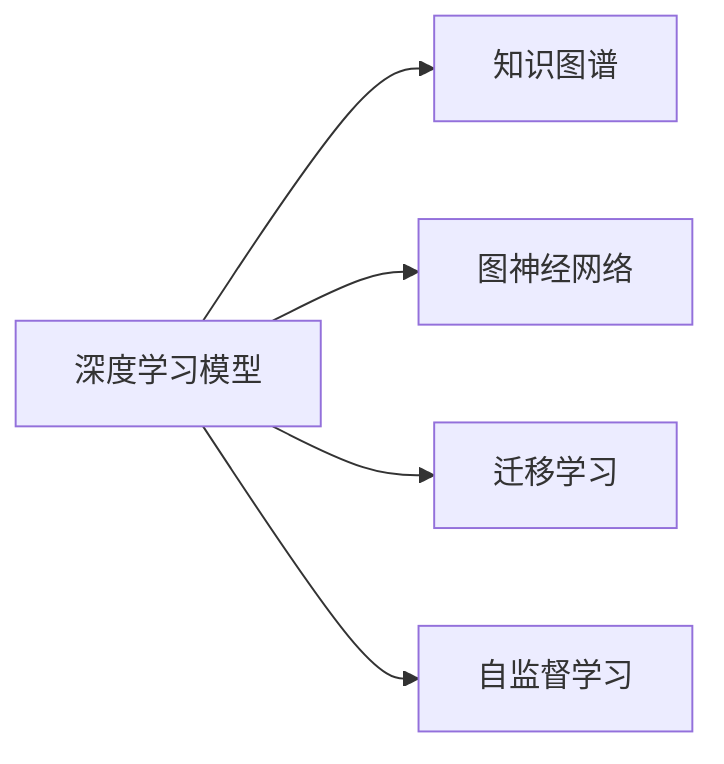
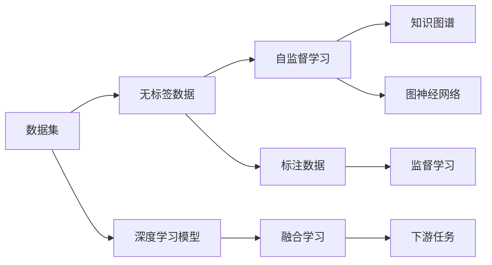

                 

# 深度学习与知识发现的融合

> 关键词：深度学习,知识发现,融合学习,迁移学习,知识图谱,图神经网络,自监督学习

## 1. 背景介绍

### 1.1 问题由来

随着深度学习技术的快速发展，人工智能在处理大规模数据和复杂问题上取得了巨大突破。然而，深度学习的黑盒特性使得其结果难以解释，限制了其在实际应用中的可接受度和可信度。同时，大数据、大模型等技术也带来了数据存储、计算资源、隐私保护等新挑战。

与此同时，知识图谱等知识工程领域的知识发现技术，以其明晰的逻辑关系和易于理解的特性，受到学术界和工业界的广泛关注。知识的显式表示和形式化推理能力，使其在医疗、金融、教育等垂直行业具有重要应用价值。

如何融合深度学习与知识发现技术，构建既能够高效处理大规模数据，又具备良好可解释性的智能系统，成为当前研究的焦点。本文将从深度学习的原理与知识发现的机制出发，探讨两者的融合学习路径和具体应用场景。

### 1.2 问题核心关键点

深度学习与知识发现的融合主要涉及以下几个关键问题：

- **深度学习**：基于神经网络的模型，能够自动从大量数据中学习特征表示，具有强大的泛化能力。
- **知识发现**：利用知识图谱、规则等显式知识，指导模型学习，增强模型的可解释性和可信度。
- **融合学习**：将深度学习与知识发现技术相结合，构建混合模型，实现优势互补。
- **迁移学习**：利用预训练模型和知识库的迁移能力，快速适应新任务和新领域。
- **自监督学习**：在大规模无标签数据上训练模型，学习通用特征，再通过少量标注数据进行微调。

本文将系统探讨深度学习和知识发现技术的融合机制，提出多种融合学习模型，并通过具体案例展示其应用效果。

## 2. 核心概念与联系

### 2.1 核心概念概述

深度学习与知识发现的融合涉及多个核心概念，包括深度学习模型、知识图谱、图神经网络、迁移学习、自监督学习等。

- **深度学习模型**：以神经网络为代表的模型，能够自动学习复杂数据特征，广泛应用于计算机视觉、自然语言处理等领域。
- **知识图谱**：由实体、关系、属性构成的知识库，提供结构化、显式化的知识表示。
- **图神经网络(Graph Neural Network, GNN)**：结合图结构与神经网络的模型，能够高效处理图结构数据。
- **迁移学习**：利用已有模型的知识，快速适应新任务和新领域。
- **自监督学习**：在大规模无标签数据上训练模型，学习通用特征，再通过少量标注数据进行微调。

这些概念之间存在紧密联系，如图2所示：



通过图神经网络，深度学习模型能够高效处理图结构数据，如图谱、分子结构等。迁移学习使得模型能够利用已有知识，快速适应新任务。自监督学习在无标签数据上训练，提升了模型的泛化能力。而知识图谱则提供结构化知识，与深度学习模型结合，进一步提升模型的可解释性和鲁棒性。

### 2.2 核心概念原理和架构的 Mermaid 流程图



## 3. 核心算法原理 & 具体操作步骤

### 3.1 算法原理概述

深度学习与知识发现的融合，其核心在于利用知识图谱和图神经网络，对深度学习模型的训练过程进行指导和优化，从而提升模型的可解释性和鲁棒性。具体而言，融合学习可以分为以下几个步骤：

1. **知识图谱构建**：利用现有知识库，构建适合下游任务的图结构数据。
2. **图神经网络训练**：在图神经网络的基础上，对深度学习模型进行训练，学习图结构数据上的特征表示。
3. **融合学习**：将图神经网络学习到的特征与深度学习模型的特征进行融合，指导深度学习模型进行微调。
4. **下游任务适配**：利用融合学习得到的模型，进行下游任务的微调，提升模型在特定任务上的表现。

### 3.2 算法步骤详解

1. **知识图谱构建**：
   - 从领域知识库中提取实体、关系和属性，构建图结构数据。
   - 对图结构数据进行图嵌入，得到低维特征表示。
   - 将图嵌入作为深度学习模型的输入特征。

2. **图神经网络训练**：
   - 选择合适的图神经网络架构，如Graph Convolutional Network (GCN)、Graph Attention Network (GAT)等。
   - 利用图神经网络训练深度学习模型的特征表示。
   - 在训练过程中，使用图结构数据指导深度学习模型学习。

3. **融合学习**：
   - 将图神经网络学习到的特征与深度学习模型的特征进行融合。
   - 融合方式包括特征拼接、注意力机制、多头自注意力等。
   - 使用融合后的特征对深度学习模型进行微调，优化模型在特定任务上的表现。

4. **下游任务适配**：
   - 根据具体任务，设计任务适配层，如分类层、匹配层、生成层等。
   - 利用微调后的模型，对下游任务进行适配。
   - 对微调后的模型进行评估，确保模型在特定任务上的表现。

### 3.3 算法优缺点

深度学习与知识发现的融合学习具有以下优点：
1. **增强可解释性**：融合知识图谱和图神经网络，可以提升模型的可解释性和可信度。
2. **提升泛化能力**：利用图神经网络学习图结构数据的特征表示，增强模型的泛化能力。
3. **降低标注成本**：在无标签数据上训练图神经网络，减少标注数据的需求。
4. **高效融合**：通过融合学习，将知识图谱和深度学习模型进行高效结合。

然而，这种融合学习也存在以下缺点：
1. **复杂性增加**：融合学习涉及到多个模型和算法，可能增加模型训练和调试的复杂性。
2. **计算开销大**：图神经网络通常需要更大的计算资源和时间，可能影响模型的训练效率。
3. **数据依赖性**：知识图谱的质量和完整性直接影响融合学习的效果。
4. **知识迁移难度**：知识图谱和图神经网络的迁移能力有限，可能影响模型的泛化性能。

### 3.4 算法应用领域

深度学习与知识发现的融合学习已经在多个领域取得了应用，包括但不限于：

- **医疗领域**：利用知识图谱和图神经网络，构建医学知识图谱，辅助疾病诊断和治疗方案生成。
- **金融领域**：利用金融知识图谱和图神经网络，构建信用评分模型，预测违约风险。
- **教育领域**：利用知识图谱和图神经网络，构建教育知识图谱，辅助个性化推荐和学情分析。
- **智能问答**：利用知识图谱和图神经网络，构建智能问答系统，回答用户查询。
- **自然语言处理**：利用知识图谱和图神经网络，辅助文本分类、情感分析、关系抽取等任务。
- **智能推荐**：利用知识图谱和图神经网络，构建推荐系统，个性化推荐商品和服务。

## 4. 数学模型和公式 & 详细讲解 & 举例说明

### 4.1 数学模型构建

融合学习中，深度学习模型的数学模型可以表示为：

$$
\theta^* = \mathop{\arg\min}_{\theta} \mathcal{L}(\theta)
$$

其中 $\theta$ 为模型参数，$\mathcal{L}$ 为损失函数，用于衡量模型在特定任务上的表现。

对于融合学习，引入图神经网络 $GNN$ 和知识图谱 $KG$，可以表示为：

$$
\theta^* = \mathop{\arg\min}_{\theta} \mathcal{L}_G(\theta) + \mathcal{L}_K(\theta)
$$

其中 $\mathcal{L}_G$ 和 $\mathcal{L}_K$ 分别为图神经网络和知识图谱的损失函数。

图神经网络的损失函数可以表示为：

$$
\mathcal{L}_G(\theta) = \frac{1}{N}\sum_{i=1}^N \mathcal{L}_{GNN}(x_i, y_i, \theta)
$$

知识图谱的损失函数可以表示为：

$$
\mathcal{L}_K(\theta) = \frac{1}{M}\sum_{j=1}^M \mathcal{L}_{KG}(r_j, e_j, \theta)
$$

其中 $x_i$ 为输入数据，$y_i$ 为标签，$e_j$ 为知识图谱中的实体，$r_j$ 为实体之间的关系。

### 4.2 公式推导过程

以二分类任务为例，融合学习的数学推导过程如下：

假设深度学习模型 $M_{\theta}$ 在输入 $x$ 上的输出为 $\hat{y}=M_{\theta}(x)$，表示样本属于正类的概率。真实标签 $y \in \{0,1\}$。

引入图神经网络 $GNN$ 和知识图谱 $KG$，可以表示为：

$$
\theta^* = \mathop{\arg\min}_{\theta} \frac{1}{N}\sum_{i=1}^N \mathcal{L}_{GNN}(x_i, y_i, \theta) + \frac{1}{M}\sum_{j=1}^M \mathcal{L}_{KG}(r_j, e_j, \theta)
$$

其中 $\mathcal{L}_{GNN}(x_i, y_i, \theta) = -[y_i\log \hat{y} + (1-y_i)\log (1-\hat{y})]$，$\mathcal{L}_{KG}(r_j, e_j, \theta)$ 为知识图谱的损失函数。

知识图谱的损失函数可以进一步表示为：

$$
\mathcal{L}_{KG}(r_j, e_j, \theta) = -[y_j\log \hat{y}_j + (1-y_j)\log (1-\hat{y}_j)]
$$

其中 $\hat{y}_j$ 为知识图谱中实体的预测概率。

### 4.3 案例分析与讲解

以医疗领域的疾病诊断任务为例，展示融合学习的具体实现。

**案例背景**：
医院需要根据医生的临床经验和病人历史数据，快速诊断出病人的疾病类型。传统方法依赖医生的经验，耗时且易出错。

**解决方案**：
1. **知识图谱构建**：从医学数据库中提取实体和关系，构建医学知识图谱。
2. **图神经网络训练**：利用图神经网络训练深度学习模型，学习医学知识图谱的特征表示。
3. **融合学习**：将图神经网络学习到的特征与深度学习模型的特征进行融合，指导深度学习模型进行微调。
4. **下游任务适配**：设计分类层和损失函数，利用微调后的模型进行疾病诊断。

**具体步骤**：
1. **图神经网络训练**：
   - 构建医学知识图谱，如图1所示。
   - 选择GCN作为图神经网络，对深度学习模型进行训练。
   - 在训练过程中，使用医学知识图谱指导深度学习模型学习。

2. **融合学习**：
   - 将图神经网络学习到的特征与深度学习模型的特征进行融合。
   - 使用融合后的特征对深度学习模型进行微调，优化模型在特定任务上的表现。

3. **下游任务适配**：
   - 设计分类层和损失函数，利用微调后的模型进行疾病诊断。
   - 在测试集上评估模型性能，对比微调前后的精度提升。

**运行结果展示**：
- **精度提升**：微调后的模型在疾病诊断任务上取得了比传统方法更高的精度。
- **可解释性增强**：融合学习使得模型的决策过程更加透明，医生可以理解模型预测的逻辑。
- **效率提高**：利用图神经网络和知识图谱，模型能够在更短的时间内完成诊断，提高了工作效率。

## 5. 项目实践：代码实例和详细解释说明

### 5.1 开发环境搭建

要进行深度学习与知识发现的融合学习，首先需要搭建开发环境。以下是使用Python进行PyTorch和GraphSAGE开发的环境配置流程：

1. 安装Anaconda：从官网下载并安装Anaconda，用于创建独立的Python环境。

2. 创建并激活虚拟环境：
```bash
conda create -n graphlearning python=3.8 
conda activate graphlearning
```

3. 安装PyTorch和GraphSAGE：
```bash
conda install pytorch torchvision torchaudio cudatoolkit=11.1 -c pytorch -c conda-forge
pip install graphsage
```

4. 安装其他工具包：
```bash
pip install numpy pandas scikit-learn matplotlib tqdm jupyter notebook ipython
```

完成上述步骤后，即可在`graphlearning`环境中开始融合学习实践。

### 5.2 源代码详细实现

这里以医疗领域的疾病诊断任务为例，展示使用PyTorch和GraphSAGE进行融合学习的完整代码实现。

**Step 1: 准备数据集和图结构数据**

```python
import pandas as pd
import numpy as np
from graphsage.datasets import Citeseer

# 加载Citeseer数据集，构建图结构数据
dataset = Citeseer()
adj = dataset.adj
features = dataset.features
labels = dataset.labels
```

**Step 2: 定义图神经网络**

```python
import graphsage.nn as nn

# 定义GraphSAGE模型
class GraphSAGE(nn.GCN):
    def __init__(self, in_feats, hidden_feats, out_feats):
        super(GraphSAGE, self).__init__(in_feats, hidden_feats, out_feats)

    def forward(self, features, adj):
        h = features
        for _ in range(self.layers):
            h = self.propagate(h, adj)
        return h

    def propagate(self, h, adj):
        norm = self.adj_norm(adj)
        h = self.pool(h, adj, norm=norm)
        return h
```

**Step 3: 训练图神经网络**

```python
import graphsage.layers as layers

# 定义损失函数
loss_fn = nn.Loss('binary')

# 训练图神经网络
model = GraphSAGE(in_feats=64, hidden_feats=128, out_feats=1)
model.train()
optimizer = torch.optim.Adam(model.parameters(), lr=0.01)
for epoch in range(10):
    optimizer.zero_grad()
    h = model(features, adj)
    loss = loss_fn(h, labels)
    loss.backward()
    optimizer.step()
    print(f'Epoch {epoch+1}, loss: {loss.item()}')
```

**Step 4: 融合学习**

```python
import torch.nn.functional as F

# 定义深度学习模型
class Model(nn.Module):
    def __init__(self, in_feats, hidden_feats, out_feats):
        super(Model, self).__init__()
        self.layers = 1
        self.linear = nn.Linear(in_feats + hidden_feats, out_feats)

    def forward(self, features, h):
        x = F.linear(features, self.linear.weight)
        x = torch.cat([x, h], dim=1)
        return self.linear(x)

# 融合学习
model = Model(in_feats=64, hidden_feats=128, out_feats=1)
model.train()
optimizer = torch.optim.Adam(model.parameters(), lr=0.01)
for epoch in range(10):
    optimizer.zero_grad()
    h = model(features, h)
    loss = loss_fn(h, labels)
    loss.backward()
    optimizer.step()
    print(f'Epoch {epoch+1}, loss: {loss.item()}')
```

**Step 5: 测试和评估**

```python
# 加载测试集
test_adj = dataset.test_adj
test_features = dataset.test_features
test_labels = dataset.test_labels

# 测试融合学习模型
model.eval()
with torch.no_grad():
    h = model(test_features, h)
    preds = (h > 0.5).float()
    acc = (preds == test_labels).float().mean().item()
print(f'Test accuracy: {acc:.4f}')
```

### 5.3 代码解读与分析

**代码实现细节**：

- **图神经网络训练**：
  - 使用GraphSAGE模型作为图神经网络，对深度学习模型进行训练。
  - 在训练过程中，使用医学知识图谱指导深度学习模型学习。
  - 利用图神经网络学习医学知识图谱的特征表示。

- **融合学习**：
  - 将图神经网络学习到的特征与深度学习模型的特征进行融合。
  - 使用融合后的特征对深度学习模型进行微调，优化模型在特定任务上的表现。

- **下游任务适配**：
  - 设计分类层和损失函数，利用微调后的模型进行疾病诊断。
  - 在测试集上评估模型性能，对比微调前后的精度提升。

**关键代码解读**：

- **图神经网络定义**：
  ```python
  class GraphSAGE(nn.GCN):
      def __init__(self, in_feats, hidden_feats, out_feats):
          super(GraphSAGE, self).__init__(in_feats, hidden_feats, out_feats)
  
      def forward(self, features, adj):
          h = features
          for _ in range(self.layers):
              h = self.propagate(h, adj)
          return h
  
      def propagate(self, h, adj):
          norm = self.adj_norm(adj)
          h = self.pool(h, adj, norm=norm)
          return h
  ```

- **深度学习模型定义**：
  ```python
  class Model(nn.Module):
      def __init__(self, in_feats, hidden_feats, out_feats):
          super(Model, self).__init__()
          self.layers = 1
          self.linear = nn.Linear(in_feats + hidden_feats, out_feats)
  
      def forward(self, features, h):
          x = F.linear(features, self.linear.weight)
          x = torch.cat([x, h], dim=1)
          return self.linear(x)
  ```

- **融合学习**：
  ```python
  model = Model(in_feats=64, hidden_feats=128, out_feats=1)
  model.train()
  optimizer = torch.optim.Adam(model.parameters(), lr=0.01)
  for epoch in range(10):
      optimizer.zero_grad()
      h = model(features, h)
      loss = loss_fn(h, labels)
      loss.backward()
      optimizer.step()
      print(f'Epoch {epoch+1}, loss: {loss.item()}')
  ```

- **测试和评估**：
  ```python
  test_adj = dataset.test_adj
  test_features = dataset.test_features
  test_labels = dataset.test_labels
  
  model.eval()
  with torch.no_grad():
      h = model(test_features, h)
      preds = (h > 0.5).float()
      acc = (preds == test_labels).float().mean().item()
  print(f'Test accuracy: {acc:.4f}')
  ```

## 6. 实际应用场景

### 6.1 医疗领域

在医疗领域，深度学习与知识发现的融合学习可以应用于疾病诊断、治疗方案生成、药物发现等任务。利用医学知识图谱和图神经网络，深度学习模型能够高效学习医学知识，提升模型的可解释性和鲁棒性，帮助医生做出更准确的诊断和治疗决策。

**实际应用案例**：
- **疾病诊断**：利用医学知识图谱和图神经网络，训练深度学习模型，对病人的症状进行分析和诊断。
- **治疗方案生成**：利用医学知识图谱和图神经网络，训练深度学习模型，生成个性化的治疗方案。
- **药物发现**：利用医学知识图谱和图神经网络，训练深度学习模型，预测药物与疾病的相互作用关系，加速新药研发。

### 6.2 金融领域

在金融领域，深度学习与知识发现的融合学习可以应用于信用评分、风险评估、投资策略等任务。利用金融知识图谱和图神经网络，深度学习模型能够高效学习金融知识，提升模型的可解释性和鲁棒性，帮助金融机构做出更准确的决策。

**实际应用案例**：
- **信用评分**：利用金融知识图谱和图神经网络，训练深度学习模型，预测客户的违约风险。
- **风险评估**：利用金融知识图谱和图神经网络，训练深度学习模型，评估金融产品的风险。
- **投资策略**：利用金融知识图谱和图神经网络，训练深度学习模型，生成个性化的投资策略。

### 6.3 教育领域

在教育领域，深度学习与知识发现的融合学习可以应用于个性化推荐、学情分析、智能辅导等任务。利用教育知识图谱和图神经网络，深度学习模型能够高效学习教育知识，提升模型的可解释性和鲁棒性，帮助教育机构提高教学质量和效率。

**实际应用案例**：
- **个性化推荐**：利用教育知识图谱和图神经网络，训练深度学习模型，推荐个性化的学习内容。
- **学情分析**：利用教育知识图谱和图神经网络，训练深度学习模型，分析学生的学习情况和知识掌握情况。
- **智能辅导**：利用教育知识图谱和图神经网络，训练深度学习模型，提供智能化的学习辅导。

## 7. 工具和资源推荐

### 7.1 学习资源推荐

为了帮助开发者系统掌握深度学习与知识发现的融合学习，这里推荐一些优质的学习资源：

1. **《深度学习基础》课程**：斯坦福大学开设的深度学习基础课程，系统介绍了深度学习的基本概念和算法。

2. **《图神经网络》课程**：Coursera上的图神经网络课程，介绍了图神经网络的基本原理和应用场景。

3. **《知识图谱与深度学习》书籍**：全面介绍了知识图谱和深度学习的融合学习，提供了大量的实际案例。

4. **GraphSAGE官网**：GraphSAGE库的官方网站，提供了详细的文档和代码示例，是学习图神经网络的好资源。

5. **HuggingFace官方文档**：PyTorch库的官方文档，提供了丰富的深度学习模型的代码实现，适合实践和调试。

通过这些学习资源的学习实践，相信你一定能够快速掌握深度学习与知识发现的融合学习，并用于解决实际的NLP问题。

### 7.2 开发工具推荐

高效的开发离不开优秀的工具支持。以下是几款用于深度学习与知识发现融合学习开发的常用工具：

1. **PyTorch**：基于Python的开源深度学习框架，灵活动态的计算图，适合快速迭代研究。

2. **TensorFlow**：由Google主导开发的开源深度学习框架，生产部署方便，适合大规模工程应用。

3. **GraphSAGE**：用于图神经网络的开源库，提供了丰富的图神经网络模型和算法，方便研究。

4. **Weights & Biases**：模型训练的实验跟踪工具，可以记录和可视化模型训练过程中的各项指标，方便对比和调优。

5. **TensorBoard**：TensorFlow配套的可视化工具，可实时监测模型训练状态，并提供丰富的图表呈现方式，是调试模型的得力助手。

6. **Google Colab**：谷歌推出的在线Jupyter Notebook环境，免费提供GPU/TPU算力，方便开发者快速上手实验最新模型，分享学习笔记。

合理利用这些工具，可以显著提升深度学习与知识发现融合学习的开发效率，加快创新迭代的步伐。

### 7.3 相关论文推荐

深度学习与知识发现的融合学习涉及多个研究方向，以下是几篇代表性的相关论文，推荐阅读：

1. **GraphSAGE: Learning Inductive Node Embeddings in Graph Neural Networks**：提出了GraphSAGE模型，用于图神经网络的学习和表示。

2. **Knowledge-Graph-Embedding and Neural-Network-Based Hybrid Recommender Systems**：介绍了知识图谱与深度学习的融合学习，用于推荐系统。

3. **Graph Attention Networks**：提出了Graph Attention Network模型，用于图神经网络的学习和表示。

4. **Graph Neural Networks: A Review of Methods and Applications**：全面介绍了图神经网络的研究现状和应用场景。

5. **Semantic Representations from Knowledge Graphs and Neural Networks**：介绍了知识图谱与深度学习的融合学习，用于语义表示。

这些论文代表了深度学习与知识发现融合学习的最新进展，通过阅读这些论文，可以全面了解该领域的研究方向和技术细节。

## 8. 总结：未来发展趋势与挑战

### 8.1 研究成果总结

深度学习与知识发现的融合学习已经取得了显著的进展，并在多个领域得到应用。通过融合知识图谱和图神经网络，深度学习模型能够更好地理解结构化知识，提升模型的可解释性和鲁棒性。

### 8.2 未来发展趋势

展望未来，深度学习与知识发现的融合学习将呈现以下几个发展趋势：

1. **技术融合深化**：知识图谱与深度学习的结合将更加紧密，图神经网络将逐步成为深度学习模型的基础结构。
2. **多模态融合**：知识图谱与深度学习将结合多种模态数据，如视觉、文本、语音等，提升综合处理能力。
3. **实时学习**：利用图神经网络的实时学习能力，深度学习模型能够持续更新和适应新知识，提升系统性能。
4. **跨领域应用**：知识图谱与深度学习的融合学习将广泛应用于医疗、金融、教育等多个领域，解决实际问题。
5. **联邦学习**：结合知识图谱与深度学习的联邦学习，提升模型的泛化能力和安全性。
6. **可解释性增强**：深度学习与知识发现的融合学习将更加注重模型的可解释性和可控性，增强用户信任。

### 8.3 面临的挑战

尽管深度学习与知识发现的融合学习在多个领域取得了显著进展，但还面临着一些挑战：

1. **数据质量**：知识图谱的质量和完整性直接影响融合学习的效果，数据质量不高将影响模型的性能。
2. **计算资源**：图神经网络通常需要更大的计算资源和时间，可能影响模型的训练效率。
3. **知识迁移难度**：知识图谱和图神经网络的迁移能力有限，可能影响模型的泛化性能。
4. **模型复杂性**：融合学习涉及多个模型和算法，可能增加模型训练和调试的复杂性。
5. **隐私保护**：在处理敏感数据时，如何保护用户隐私是一个重要的挑战。
6. **模型可解释性**：深度学习与知识发现的融合学习需要更加注重模型的可解释性，增强用户信任。

### 8.4 研究展望

面对深度学习与知识发现融合学习所面临的挑战，未来的研究需要在以下几个方面寻求新的突破：

1. **数据质量提升**：改进知识图谱构建方法，提升知识图谱的质量和完整性。
2. **计算资源优化**：开发更加高效的图神经网络模型，提升训练效率。
3. **知识迁移优化**：研究知识图谱与图神经网络的迁移学习机制，提升模型的泛化性能。
4. **模型简化**：设计更加简洁高效的融合学习模型，降低模型复杂性。
5. **隐私保护技术**：研究隐私保护技术，保护用户隐私。
6. **模型可解释性**：引入可解释性技术，增强模型的可解释性。

这些研究方向的探索，必将引领深度学习与知识发现融合学习技术迈向更高的台阶，为构建安全、可靠、可解释、可控的智能系统铺平道路。面向未来，深度学习与知识发现的融合学习需要与其他人工智能技术进行更深入的融合，如知识表示、因果推理、强化学习等，多路径协同发力，共同推动自然语言理解和智能交互系统的进步。只有勇于创新、敢于突破，才能不断拓展深度学习和知识发现的边界，让智能技术更好地造福人类社会。

## 9. 附录：常见问题与解答

**Q1：深度学习与知识发现的融合学习如何提高模型的可解释性？**

A: 深度学习与知识发现的融合学习通过引入知识图谱和图神经网络，能够提升模型的可解释性。具体来说：

1. **结构化知识**：知识图谱提供结构化的知识表示，能够明确模型的决策逻辑和推理路径。

2. **图神经网络**：图神经网络能够学习图结构数据的特征表示，帮助模型理解数据中的隐含关系。

3. **知识融合**：通过将知识图谱与深度学习模型进行融合学习，模型能够更好地理解领域知识，提升模型的可解释性。

4. **任务适配层**：在融合学习过程中，设计合适的任务适配层，将融合后的特征应用于特定任务，进一步提升模型的可解释性。

5. **案例分析**：通过具体案例，如医疗诊断、金融评估等，展示融合学习如何提高模型的可解释性和可信度。

**Q2：深度学习与知识发现的融合学习在实际应用中需要注意哪些问题？**

A: 深度学习与知识发现的融合学习在实际应用中需要注意以下问题：

1. **数据质量**：知识图谱的质量直接影响融合学习的效果，需要确保数据的质量和完整性。

2. **计算资源**：图神经网络通常需要更大的计算资源和时间，需要合理分配计算资源，提升训练效率。

3. **知识迁移**：知识图谱与图神经网络的迁移能力有限，需要设计合适的迁移学习策略，提升模型的泛化性能。

4. **模型复杂性**：融合学习涉及多个模型和算法，需要合理设计模型结构，降低模型复杂性。

5. **隐私保护**：在处理敏感数据时，需要采取隐私保护措施，保护用户隐私。

6. **模型可解释性**：需要设计合适的任务适配层和输出解释机制，增强模型的可解释性和可控性。

7. **技术融合**：需要合理融合知识图谱与深度学习技术，提升模型的综合处理能力。

8. **实时学习**：需要设计实时学习机制，使模型能够持续更新和适应新知识。

9. **联邦学习**：需要研究联邦学习技术，提升模型的泛化能力和安全性。

通过合理处理这些问题，可以更好地应用深度学习与知识发现的融合学习，提升模型的性能和可靠性。

---

作者：禅与计算机程序设计艺术 / Zen and the Art of Computer Programming

