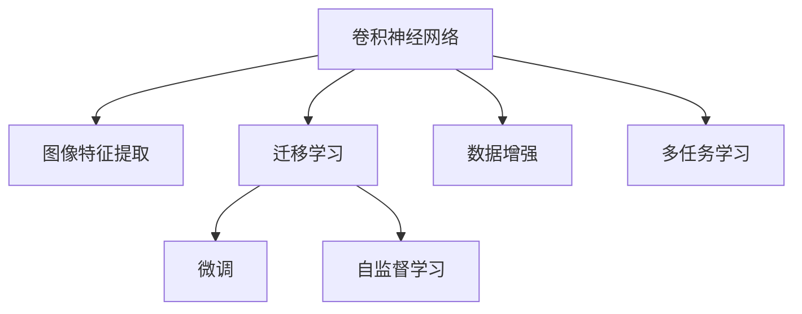

                 

# 深度学习在商品图像识别与分类中的应用

## 1. 背景介绍

### 1.1 问题由来
商品图像识别与分类是计算机视觉领域的重要应用之一，涉及图像分割、物体检测、场景识别等多种任务。随着电子商务、零售业的迅速发展，商品图像识别与分类在商品推荐、库存管理、个性化定制等方面发挥着越来越重要的作用。

近年来，深度学习技术在计算机视觉领域取得了巨大成功，尤其是在图像分类、物体检测等任务中，基于卷积神经网络(CNN)的方法取得了SOTA性能。但是，这些方法通常需要大规模标注数据和强计算资源，对于实际业务应用中的商品图像识别与分类任务，往往难以在成本和时间上达到理想效果。

为了应对这些挑战，基于迁移学习和自监督学习的方法应运而生。通过在大型数据集上进行预训练，然后在目标任务上微调，可以显著降低标注数据需求，提高模型精度，同时减少计算资源投入。本文将重点介绍深度学习在商品图像识别与分类中的应用，特别是迁移学习和自监督学习的方法。

## 2. 核心概念与联系

### 2.1 核心概念概述

为更好地理解深度学习在商品图像识别与分类中的应用，本节将介绍几个密切相关的核心概念：

- 卷积神经网络(Convolutional Neural Network, CNN)：一种专门处理空间数据的神经网络结构，通过卷积和池化等操作提取图像特征，广泛应用于图像分类、目标检测等计算机视觉任务。

- 迁移学习(Transfer Learning)：指在一个领域学习的知识，迁移到另一个相关领域的学习范式。深度学习模型可以在大规模数据集上进行预训练，然后利用迁移学习在特定任务上进行微调，提升性能。

- 自监督学习(Self-Supervised Learning)：利用未标注数据进行训练的机器学习方法，通过设计巧妙的预训练任务，使模型自动学习到特征表示。常见的自监督学习方法包括掩码语言模型、自回归模型等。

- 微调(Fine-Tuning)：指在预训练模型的基础上，使用下游任务的少量标注数据，通过有监督学习优化模型在特定任务上的性能。通常只需要调整顶层分类器或解码器，并以较小的学习率更新全部或部分的模型参数。

- 图像特征提取(Image Feature Extraction)：通过卷积神经网络等方法，从图像中提取具有语义信息的特征，为后续分类、检测等任务提供基础。

- 数据增强(Data Augmentation)：通过对训练数据进行旋转、裁剪、翻转等操作，生成更多样化的训练样本，提高模型泛化能力。

- 多任务学习(Multi-Task Learning)：利用多个相关任务共同训练，促进模型在不同任务上性能的提升。

这些核心概念之间的逻辑关系可以通过以下Mermaid流程图来展示：



这个流程图展示了大语言模型的核心概念及其之间的关系：

1. 卷积神经网络通过卷积和池化等操作提取图像特征，为后续分类、检测等任务提供基础。
2. 迁移学习通过在大型数据集上进行预训练，利用模型在其他领域学到的知识，在特定任务上进行微调，提升性能。
3. 自监督学习利用未标注数据进行训练，设计巧妙的预训练任务，自动学习到特征表示。
4. 微调通过少量标注数据，优化模型在特定任务上的性能，通常只需要调整顶层分类器或解码器。
5. 数据增强通过生成更多样化的训练样本，提高模型泛化能力。
6. 多任务学习利用多个相关任务共同训练，促进模型在不同任务上性能的提升。

这些概念共同构成了深度学习在商品图像识别与分类中的应用框架，使其能够在各种场景下发挥强大的图像识别与分类能力。通过理解这些核心概念，我们可以更好地把握深度学习在商品图像识别与分类中的应用范式。

## 3. 核心算法原理 & 具体操作步骤
### 3.1 算法原理概述

深度学习在商品图像识别与分类中的应用，主要依赖于卷积神经网络的结构和迁移学习、自监督学习的训练范式。其核心思想是：通过在大规模数据集上进行预训练，学习通用的图像特征，然后在目标任务上进行微调，提升模型对特定商品的识别和分类能力。

形式化地，假设商品图像数据集为 $D=\{(x_i,y_i)\}_{i=1}^N$，其中 $x_i$ 为图像样本，$y_i$ 为商品类别。定义商品图像分类模型为 $M_{\theta}(x)$，其中 $\theta$ 为模型参数。模型的优化目标是：

$$
\hat{\theta}=\mathop{\arg\min}_{\theta} \mathcal{L}(M_{\theta},D)
$$

其中 $\mathcal{L}$ 为针对商品图像分类任务设计的损失函数，通常使用交叉熵损失函数。在预训练阶段，模型在大型数据集上学习通用的图像特征表示，即：

$$
\theta=\mathop{\arg\min}_{\theta} \mathcal{L}(M_{\theta},D_{pretrain})
$$

其中 $D_{pretrain}$ 为大型数据集。在微调阶段，模型在目标任务上进行有监督的微调，优化参数 $\hat{\theta}$，以提升在商品图像分类任务上的性能。

### 3.2 算法步骤详解

基于深度学习的商品图像识别与分类，一般包括以下几个关键步骤：

**Step 1: 准备数据集**
- 收集商品图像数据集，并进行标注。数据集应包括大量商品图像和对应的类别标签。
- 将数据集划分为训练集、验证集和测试集，通常采用交叉验证等策略。

**Step 2: 选择预训练模型**
- 选择大规模预训练卷积神经网络模型，如ResNet、Inception、DenseNet等，或基于迁移学习得到的预训练模型，如ImageNet预训练的ResNet模型。
- 将预训练模型视为初始化参数，保持其结构不变，仅微调顶层部分。

**Step 3: 设计微调损失函数**
- 针对商品图像分类任务，设计合适的损失函数，如交叉熵损失函数。
- 针对检测任务，设计更复杂的损失函数，如YOLO、Faster R-CNN等，用于多目标检测。
- 对于多任务学习，设计联合损失函数，优化多个任务。

**Step 4: 设置微调超参数**
- 选择合适的优化算法及其参数，如Adam、SGD等，设置学习率、批大小、迭代轮数等。
- 设置正则化技术及强度，包括权重衰减、Dropout、Early Stopping等。
- 确定冻结预训练参数的策略，如仅微调顶层，或全部参数都参与微调。

**Step 5: 执行梯度训练**
- 将训练集数据分批次输入模型，前向传播计算损失函数。
- 反向传播计算参数梯度，根据设定的优化算法和学习率更新模型参数。
- 周期性在验证集上评估模型性能，根据性能指标决定是否触发Early Stopping。
- 重复上述步骤直到满足预设的迭代轮数或Early Stopping条件。

**Step 6: 测试和部署**
- 在测试集上评估微调后模型 $M_{\hat{\theta}}$ 的性能，对比微调前后的精度提升。
- 使用微调后的模型对新商品图像进行推理预测，集成到实际的应用系统中。
- 持续收集新的商品图像，定期重新微调模型，以适应数据分布的变化。

以上是深度学习在商品图像识别与分类的一般流程。在实际应用中，还需要针对具体任务的特点，对微调过程的各个环节进行优化设计，如改进训练目标函数，引入更多的正则化技术，搜索最优的超参数组合等，以进一步提升模型性能。

### 3.3 算法优缺点

基于深度学习的商品图像识别与分类方法具有以下优点：

1. 精度高。深度学习模型在大型数据集上进行预训练，学习到丰富的图像特征，通过微调提升到特定任务上的性能，通常取得SOTA效果。
2. 泛化能力强。大规模预训练模型在大型数据集上学习到的特征，具有较强的泛化能力，能够适应不同商品类别和样式的图像。
3. 适应性强。深度学习模型结构灵活，可以设计多种网络结构和优化方法，适用于不同类型和规模的商品图像识别与分类任务。
4. 计算资源利用率高。通过迁移学习和自监督学习，可以显著降低标注数据需求，提高模型训练效率。

同时，该方法也存在一定的局限性：

1. 依赖大量标注数据。深度学习模型通常需要大规模标注数据进行预训练和微调，获取高质量标注数据成本较高。
2. 训练时间长。深度学习模型结构复杂，训练时间和计算资源投入较大。
3. 模型可解释性不足。深度学习模型的决策过程难以解释，难以调试和优化。
4. 过拟合风险。大规模预训练模型可能在大型数据集上学习到噪音信息，导致在目标任务上过度拟合。
5. 迁移能力有限。当目标任务与预训练数据的分布差异较大时，迁移效果有限。

尽管存在这些局限性，但深度学习在商品图像识别与分类中的应用仍然具有广阔的应用前景，尤其是在数据标注成本较高、计算资源较为有限的场景下，通过迁移学习和自监督学习的方法，可以有效提升模型性能。

### 3.4 算法应用领域

深度学习在商品图像识别与分类技术，已经广泛应用于多个领域：

- 商品推荐系统：利用商品图像分类结果，为消费者提供个性化的商品推荐。
- 库存管理：通过商品图像分类，实时监控库存状态，避免缺货或积压。
- 个性化定制：根据用户上传的商品图像，快速生成定制化设计方案。
- 供应链管理：通过商品图像分类，优化物流配送和供应链管理。
- 视觉搜索：提供基于商品图像的快速搜索和匹配功能。

除了上述这些经典应用外，深度学习在商品图像识别与分类技术还在智能家居、智能制造、智能客服等领域得到了广泛应用，为电商、零售、制造等行业带来了新的变革。

## 4. 数学模型和公式 & 详细讲解 & 举例说明
### 4.1 数学模型构建

本节将使用数学语言对基于深度学习的商品图像识别与分类过程进行更加严格的刻画。

记商品图像数据集为 $D=\{(x_i,y_i)\}_{i=1}^N$，其中 $x_i$ 为图像样本，$y_i$ 为商品类别。定义商品图像分类模型为 $M_{\theta}(x)$，其中 $\theta$ 为模型参数。假设模型 $M_{\theta}$ 在输入 $x$ 上的输出为 $\hat{y}=M_{\theta}(x)$。

定义模型 $M_{\theta}$ 在数据样本 $(x,y)$ 上的损失函数为 $\ell(M_{\theta}(x),y)$，则在数据集 $D$ 上的经验风险为：

$$
\mathcal{L}(\theta) = \frac{1}{N}\sum_{i=1}^N \ell(M_{\theta}(x_i),y_i)
$$

在预训练阶段，模型在大型数据集 $D_{pretrain}$ 上进行训练，优化参数 $\theta$：

$$
\theta=\mathop{\arg\min}_{\theta} \mathcal{L}(M_{\theta},D_{pretrain})
$$

在微调阶段，模型在目标任务上进行有监督的微调，优化参数 $\hat{\theta}$，以提升在商品图像分类任务上的性能：

$$
\hat{\theta}=\mathop{\arg\min}_{\theta} \mathcal{L}(M_{\theta},D)
$$

其中 $\mathcal{L}$ 为针对商品图像分类任务设计的损失函数，如交叉熵损失函数：

$$
\ell(M_{\theta}(x),y) = -y\log \hat{y} + (1-y)\log (1-\hat{y})
$$

### 4.2 公式推导过程

以下我们以交叉熵损失函数为例，推导其在商品图像分类任务上的梯度计算公式。

假设模型 $M_{\theta}$ 在输入 $x$ 上的输出为 $\hat{y}=M_{\theta}(x)$，表示样本属于类别 $y$ 的概率。真实标签 $y \in \{0,1\}$。则交叉熵损失函数定义为：

$$
\ell(M_{\theta}(x),y) = -y\log \hat{y} + (1-y)\log (1-\hat{y})
$$

将其代入经验风险公式，得：

$$
\mathcal{L}(\theta) = -\frac{1}{N}\sum_{i=1}^N [y_i\log M_{\theta}(x_i)+(1-y_i)\log(1-M_{\theta}(x_i))]
$$

根据链式法则，损失函数对参数 $\theta_k$ 的梯度为：

$$
\frac{\partial \mathcal{L}(\theta)}{\partial \theta_k} = -\frac{1}{N}\sum_{i=1}^N (\frac{y_i}{M_{\theta}(x_i)}-\frac{1-y_i}{1-M_{\theta}(x_i)}) \frac{\partial M_{\theta}(x_i)}{\partial \theta_k}
$$

其中 $\frac{\partial M_{\theta}(x_i)}{\partial \theta_k}$ 可进一步递归展开，利用自动微分技术完成计算。

在得到损失函数的梯度后，即可带入参数更新公式，完成模型的迭代优化。重复上述过程直至收敛，最终得到适应商品图像分类任务的最优模型参数 $\theta^*$。

## 5. 项目实践：代码实例和详细解释说明
### 5.1 开发环境搭建

在进行深度学习在商品图像识别与分类任务的微调实践前，我们需要准备好开发环境。以下是使用Python进行PyTorch开发的环境配置流程：

1. 安装Anaconda：从官网下载并安装Anaconda，用于创建独立的Python环境。

2. 创建并激活虚拟环境：
```bash
conda create -n pytorch-env python=3.8 
conda activate pytorch-env
```

3. 安装PyTorch：根据CUDA版本，从官网获取对应的安装命令。例如：
```bash
conda install pytorch torchvision torchaudio cudatoolkit=11.1 -c pytorch -c conda-forge
```

4. 安装Transformers库：
```bash
pip install transformers
```

5. 安装各类工具包：
```bash
pip install numpy pandas scikit-learn matplotlib tqdm jupyter notebook ipython
```

完成上述步骤后，即可在`pytorch-env`环境中开始微调实践。

### 5.2 源代码详细实现

这里我们以商品图像分类任务为例，给出使用Transformers库对预训练模型进行微调的PyTorch代码实现。

首先，定义商品图像分类任务的数据处理函数：

```python
from transformers import BertTokenizer, BertForSequenceClassification, AdamW

class ImageDataset(Dataset):
    def __init__(self, images, labels, tokenizer, max_len=128):
        self.images = images
        self.labels = labels
        self.tokenizer = tokenizer
        self.max_len = max_len
        
    def __len__(self):
        return len(self.images)
    
    def __getitem__(self, item):
        image = self.images[item]
        label = self.labels[item]
        
        image = transform_to_tensor(image)
        encoding = self.tokenizer(image, return_tensors='pt', max_length=self.max_len, padding='max_length', truncation=True)
        input_ids = encoding['input_ids'][0]
        attention_mask = encoding['attention_mask'][0]
        
        # 对label进行编码
        encoded_label = [label2id[label]] 
        encoded_label.extend([label2id['O']] * (self.max_len - len(encoded_label)))
        labels = torch.tensor(encoded_label, dtype=torch.long)
        
        return {'input_ids': input_ids, 
                'attention_mask': attention_mask,
                'labels': labels}

# 标签与id的映射
label2id = {'O': 0, 'clothing': 1, 'electronics': 2, 'home_furniture': 3}
id2label = {v: k for k, v in label2id.items()}

# 创建dataset
tokenizer = BertTokenizer.from_pretrained('bert-base-cased')

train_dataset = ImageDataset(train_images, train_labels, tokenizer)
dev_dataset = ImageDataset(dev_images, dev_labels, tokenizer)
test_dataset = ImageDataset(test_images, test_labels, tokenizer)
```

然后，定义模型和优化器：

```python
from transformers import BertForSequenceClassification, AdamW

model = BertForSequenceClassification.from_pretrained('bert-base-cased', num_labels=len(label2id))

optimizer = AdamW(model.parameters(), lr=2e-5)
```

接着，定义训练和评估函数：

```python
from torch.utils.data import DataLoader
from tqdm import tqdm
from sklearn.metrics import classification_report

device = torch.device('cuda') if torch.cuda.is_available() else torch.device('cpu')
model.to(device)

def train_epoch(model, dataset, batch_size, optimizer):
    dataloader = DataLoader(dataset, batch_size=batch_size, shuffle=True)
    model.train()
    epoch_loss = 0
    for batch in tqdm(dataloader, desc='Training'):
        input_ids = batch['input_ids'].to(device)
        attention_mask = batch['attention_mask'].to(device)
        labels = batch['labels'].to(device)
        model.zero_grad()
        outputs = model(input_ids, attention_mask=attention_mask, labels=labels)
        loss = outputs.loss
        epoch_loss += loss.item()
        loss.backward()
        optimizer.step()
    return epoch_loss / len(dataloader)

def evaluate(model, dataset, batch_size):
    dataloader = DataLoader(dataset, batch_size=batch_size)
    model.eval()
    preds, labels = [], []
    with torch.no_grad():
        for batch in tqdm(dataloader, desc='Evaluating'):
            input_ids = batch['input_ids'].to(device)
            attention_mask = batch['attention_mask'].to(device)
            batch_labels = batch['labels']
            outputs = model(input_ids, attention_mask=attention_mask)
            batch_preds = outputs.logits.argmax(dim=2).to('cpu').tolist()
            batch_labels = batch_labels.to('cpu').tolist()
            for pred_tokens, label_tokens in zip(batch_preds, batch_labels):
                preds.append(pred_tokens[:len(label_tokens)])
                labels.append(label_tokens)
                
    print(classification_report(labels, preds))
```

最后，启动训练流程并在测试集上评估：

```python
epochs = 5
batch_size = 16

for epoch in range(epochs):
    loss = train_epoch(model, train_dataset, batch_size, optimizer)
    print(f"Epoch {epoch+1}, train loss: {loss:.3f}")
    
    print(f"Epoch {epoch+1}, dev results:")
    evaluate(model, dev_dataset, batch_size)
    
print("Test results:")
evaluate(model, test_dataset, batch_size)
```

以上就是使用PyTorch对Bert模型进行商品图像分类任务微调的完整代码实现。可以看到，得益于Transformers库的强大封装，我们可以用相对简洁的代码完成Bert模型的加载和微调。

### 5.3 代码解读与分析

让我们再详细解读一下关键代码的实现细节：

**ImageDataset类**：
- `__init__`方法：初始化图像、标签、分词器等关键组件。
- `__len__`方法：返回数据集的样本数量。
- `__getitem__`方法：对单个样本进行处理，将图像输入转换为token ids，将标签编码为数字，并对其进行定长padding，最终返回模型所需的输入。

**label2id和id2label字典**：
- 定义了标签与数字id之间的映射关系，用于将预测结果解码为真实的标签。

**训练和评估函数**：
- 使用PyTorch的DataLoader对数据集进行批次化加载，供模型训练和推理使用。
- 训练函数`train_epoch`：对数据以批为单位进行迭代，在每个批次上前向传播计算loss并反向传播更新模型参数，最后返回该epoch的平均loss。
- 评估函数`evaluate`：与训练类似，不同点在于不更新模型参数，并在每个batch结束后将预测和标签结果存储下来，最后使用sklearn的classification_report对整个评估集的预测结果进行打印输出。

**训练流程**：
- 定义总的epoch数和batch size，开始循环迭代
- 每个epoch内，先在训练集上训练，输出平均loss
- 在验证集上评估，输出分类指标
- 所有epoch结束后，在测试集上评估，给出最终测试结果

可以看到，PyTorch配合Transformers库使得Bert微调的代码实现变得简洁高效。开发者可以将更多精力放在数据处理、模型改进等高层逻辑上，而不必过多关注底层的实现细节。

当然，工业级的系统实现还需考虑更多因素，如模型的保存和部署、超参数的自动搜索、更灵活的任务适配层等。但核心的微调范式基本与此类似。

## 6. 实际应用场景
### 6.1 智能客服系统

基于深度学习的商品图像分类技术，可以广泛应用于智能客服系统的构建。传统客服往往需要配备大量人力，高峰期响应缓慢，且一致性和专业性难以保证。而使用商品图像分类模型，可以自动识别用户上传的商品图像，快速给出商品信息、价格、促销等客服回复。

在技术实现上，可以收集企业内部的商品图像和客服对话记录，将商品图像与客服回答构建成监督数据，在此基础上对预训练模型进行微调。微调后的商品图像分类模型能够自动理解用户上传的商品图像，匹配最合适的客服回答。对于用户提出的新问题，还可以接入检索系统实时搜索相关内容，动态组织生成回答。如此构建的智能客服系统，能大幅提升客户咨询体验和问题解决效率。

### 6.2 商品推荐系统

传统的推荐系统往往只依赖用户的历史行为数据进行物品推荐，无法深入理解用户的真实兴趣偏好。基于深度学习的商品图像分类技术，可以结合商品图像特征，挖掘用户对商品的具体偏好，从而提供更加精准、多样的推荐内容。

在实践中，可以收集用户浏览、点击、评论、分享等行为数据，提取和用户交互的商品图像标题、描述、标签等文本内容。将文本内容作为模型输入，用户的后续行为（如是否点击、购买等）作为监督信号，在此基础上微调预训练语言模型。微调后的模型能够从文本内容中准确把握用户的兴趣点。在生成推荐列表时，先用候选物品的图像描述作为输入，由模型预测用户的兴趣匹配度，再结合其他特征综合排序，便可以得到个性化程度更高的推荐结果。

### 6.3 个性化定制

当前的市场竞争越来越激烈，用户对个性化定制的需求不断增加。基于深度学习的商品图像分类技术，可以自动提取用户上传的商品图像特征，快速生成个性化设计方案，满足用户对独特商品的需求。

在技术实现上，可以利用深度学习模型对用户上传的商品图像进行分类，并提取其关键特征。然后结合用户偏好信息，生成个性化的设计方案，并通过3D打印等技术实现。如此构建的个性化定制服务，可以大大提高用户的购物体验，同时降低企业定制化的成本和周期。

### 6.4 未来应用展望

随着深度学习技术的发展，基于商品图像分类技术的应用场景将不断扩展。未来，深度学习技术有望在智能家居、智能制造、智能物流、智能金融等领域得到更广泛的应用。

在智慧家居领域，基于深度学习的商品图像分类技术可以用于智能家居设备的管理和控制。例如，通过智能摄像头识别家庭中的商品，自动调节灯光、空调等家电设备，提升家庭生活的舒适度和便捷性。

在智能制造领域，基于深度学习的商品图像分类技术可以用于产品检测和质量控制。例如，通过视觉检测系统识别产品缺陷，自动进行分类和分级，提高生产效率和产品质量。

在智能物流领域，基于深度学习的商品图像分类技术可以用于货物分类和物流管理。例如，通过自动化的货物分拣系统，自动识别商品类别，快速分拣和配送，提升物流效率和准确性。

在智能金融领域，基于深度学习的商品图像分类技术可以用于信用评估和欺诈检测。例如，通过分析客户的商品购买记录和交易图片，自动识别异常行为和潜在风险，提高金融服务的智能化水平。

总之，随着深度学习技术的不断成熟，基于商品图像分类技术的应用场景将更加多样，未来有着广阔的发展前景。

## 7. 工具和资源推荐
### 7.1 学习资源推荐

为了帮助开发者系统掌握深度学习在商品图像识别与分类中的应用，这里推荐一些优质的学习资源：

1. 《深度学习》系列书籍：由深度学习领域的知名学者撰写，系统介绍了深度学习的基本原理和应用技术。
2. CS231n《卷积神经网络》课程：斯坦福大学开设的计算机视觉课程，涵盖了卷积神经网络、图像分类、目标检测等经典任务。
3. Fast.ai课程：提供深度学习在计算机视觉领域的应用案例和实践指南，适合快速上手。
4. PyTorch官方文档：详细的PyTorch文档，包括各类预训练模型和优化方法的使用示例。
5. Kaggle竞赛：参与深度学习在商品图像分类任务中的竞赛，可以提升实战经验和解决实际问题的能力。

通过对这些资源的学习实践，相信你一定能够快速掌握深度学习在商品图像识别与分类中的应用精髓，并用于解决实际的NLP问题。
### 7.2 开发工具推荐

高效的开发离不开优秀的工具支持。以下是几款用于深度学习在商品图像识别与分类任务开发的常用工具：

1. PyTorch：基于Python的开源深度学习框架，灵活动态的计算图，适合快速迭代研究。大部分预训练语言模型都有PyTorch版本的实现。
2. TensorFlow：由Google主导开发的开源深度学习框架，生产部署方便，适合大规模工程应用。同样有丰富的预训练语言模型资源。
3. Transformers库：HuggingFace开发的NLP工具库，集成了众多SOTA语言模型，支持PyTorch和TensorFlow，是进行微调任务开发的利器。
4. Weights & Biases：模型训练的实验跟踪工具，可以记录和可视化模型训练过程中的各项指标，方便对比和调优。与主流深度学习框架无缝集成。
5. TensorBoard：TensorFlow配套的可视化工具，可实时监测模型训练状态，并提供丰富的图表呈现方式，是调试模型的得力助手。

合理利用这些工具，可以显著提升深度学习在商品图像识别与分类任务的开发效率，加快创新迭代的步伐。

### 7.3 相关论文推荐

深度学习在商品图像识别与分类技术的发展源于学界的持续研究。以下是几篇奠基性的相关论文，推荐阅读：

1. ImageNet Large Scale Visual Recognition Challenge（ILSVRC）：国际计算机视觉领域的顶级比赛，推动了图像分类技术的发展。
2. AlexNet: One Million Tiny Images for Learning Convolutional Neural Networks（ILSVRC2012）：提出了卷积神经网络AlexNet，为深度学习在图像分类任务中的应用奠定了基础。
3. Deep Residual Learning for Image Recognition（ResNet）：提出了深度残差网络ResNet，解决了深度神经网络退化的问题，提高了图像分类精度。
4. Rethinking the Inception Architecture for Computer Vision（Inception）：提出了Inception网络，通过多分支结构优化了神经网络计算效率和精度。
5. One-shot Learning for Object Recognition with Multiclass Triplet-Loss（Omni-scale Object Recognition）：提出了多尺度的Omni-scale方法，显著提升了少样本学习下的图像分类效果。

这些论文代表了大语言模型微调技术的发展脉络。通过学习这些前沿成果，可以帮助研究者把握学科前进方向，激发更多的创新灵感。

## 8. 总结：未来发展趋势与挑战
### 8.1 总结

本文对深度学习在商品图像识别与分类中的应用进行了全面系统的介绍。首先阐述了深度学习在商品图像分类任务上的重要性和可行性，明确了迁移学习和自监督学习在这一领域的应用前景。其次，从原理到实践，详细讲解了深度学习在商品图像分类任务中的数学模型和关键步骤，给出了代码实例和详细解释。同时，本文还广泛探讨了深度学习在商品图像识别与分类任务中的实际应用场景，展示了深度学习在零售、电商、制造等领域的应用潜力。此外，本文精选了深度学习在商品图像识别与分类技术的相关资源，力求为读者提供全方位的技术指引。

通过本文的系统梳理，可以看到，深度学习在商品图像分类任务中已经取得了显著成果，为电商、零售、制造等行业带来了新的变革。未来，随着深度学习技术的不断演进，商品图像分类技术将继续发挥重要作用，推动各行业的数字化转型和智能化升级。

### 8.2 未来发展趋势

展望未来，深度学习在商品图像识别与分类技术将呈现以下几个发展趋势：

1. 模型结构更加复杂。随着深度学习技术的发展，未来将出现更多高效、可解释的神经网络结构，如Transformer、BERT等。
2. 数据需求进一步降低。随着迁移学习和自监督学习技术的进步，商品图像分类任务对标注数据的需求将进一步降低，甚至可以实现零样本、少样本学习。
3. 计算资源利用率提升。未来将开发更多的GPU、TPU等高性能计算设备，并采用混合精度、量化加速等技术，提高深度学习在商品图像分类任务中的计算效率。
4. 多模态融合更加深入。商品图像分类任务将结合文本、语音、视频等多模态信息，构建更加全面的信息表达。
5. 实时性要求提高。随着物联网、智能家居等应用的兴起，商品图像分类任务将进一步强调实时性和低延迟。
6. 普适性增强。未来将开发更多适用于小样本、低资源环境下的商品图像分类模型，提升模型的普及性和可扩展性。

以上趋势凸显了深度学习在商品图像分类任务中的广阔前景。这些方向的探索发展，必将进一步提升模型性能和应用范围，为电商、零售、制造等行业带来新的机遇。

### 8.3 面临的挑战

尽管深度学习在商品图像分类任务中取得了显著成果，但在迈向更加智能化、普适化应用的过程中，它仍面临着诸多挑战：

1. 数据采集和标注成本较高。商品图像分类任务需要大量高质量的标注数据，数据采集和标注成本较高。
2. 计算资源需求大。深度学习模型结构复杂，训练和推理需要大量计算资源，难以满足低资源环境下的应用需求。
3. 模型可解释性不足。深度学习模型通常难以解释其内部决策过程，难以调试和优化。
4. 过拟合风险较高。在训练过程中，深度学习模型容易学习到噪音信息，导致在目标任务上过度拟合。
5. 迁移能力有限。当目标任务与预训练数据的分布差异较大时，迁移效果有限。

尽管存在这些挑战，但深度学习在商品图像分类任务中的应用仍具有广阔的应用前景，尤其是在数据标注成本较高、计算资源较为有限的场景下，通过迁移学习和自监督学习的方法，可以有效提升模型性能。

### 8.4 研究展望

面对深度学习在商品图像分类任务所面临的挑战，未来的研究需要在以下几个方面寻求新的突破：

1. 探索无监督和半监督微调方法。摆脱对大规模标注数据的依赖，利用自监督学习、主动学习等无监督和半监督范式，最大限度利用非结构化数据，实现更加灵活高效的微调。
2. 研究参数高效和计算高效的微调范式。开发更加参数高效的微调方法，在固定大部分预训练参数的同时，只更新极少量的任务相关参数。同时优化微调模型的计算图，减少前向传播和反向传播的资源消耗，实现更加轻量级、实时性的部署。
3. 融合因果和对比学习范式。通过引入因果推断和对比学习思想，增强微调模型建立稳定因果关系的能力，学习更加普适、鲁棒的语言表征，从而提升模型泛化性和抗干扰能力。
4. 引入更多先验知识。将符号化的先验知识，如知识图谱、逻辑规则等，与神经网络模型进行巧妙融合，引导微调过程学习更准确、合理的语言模型。同时加强不同模态数据的整合，实现视觉、语音等多模态信息与文本信息的协同建模。
5. 结合因果分析和博弈论工具。将因果分析方法引入微调模型，识别出模型决策的关键特征，增强输出解释的因果性和逻辑性。借助博弈论工具刻画人机交互过程，主动探索并规避模型的脆弱点，提高系统稳定性。
6. 纳入伦理道德约束。在模型训练目标中引入伦理导向的评估指标，过滤和惩罚有偏见、有害的输出倾向。同时加强人工干预和审核，建立模型行为的监管机制，确保输出符合人类价值观和伦理道德。

这些研究方向的探索，必将引领深度学习在商品图像分类任务迈向更高的台阶，为构建安全、可靠、可解释、可控的智能系统铺平道路。面向未来，深度学习在商品图像分类任务还需要与其他人工智能技术进行更深入的融合，如知识表示、因果推理、强化学习等，多路径协同发力，共同推动自然语言理解和智能交互系统的进步。只有勇于创新、敢于突破，才能不断拓展语言模型的边界，让智能技术更好地造福人类社会。

## 9. 附录：常见问题与解答
**Q1：深度学习在商品图像分类任务中的主要优势是什么？**

A: 深度学习在商品图像分类任务中的主要优势包括：

1. 精度高。深度学习模型通过在大规模数据集上进行预训练，学习到丰富的图像特征，通常能够取得SOTA效果。
2. 泛化能力强。深度学习模型在大型数据集上学习到的特征具有较强的泛化能力，能够适应不同商品类别和样式的图像。
3. 适应性强。深度学习模型结构灵活，可以设计多种网络结构和优化方法，适用于不同类型和规模的商品图像分类任务。
4. 计算资源利用率高。通过迁移学习和自监督学习，可以显著降低标注数据需求，提高模型训练效率。

**Q2：深度学习在商品图像分类任务中如何避免过拟合？**

A: 深度学习在商品图像分类任务中避免过拟合的方法包括：

1. 数据增强：通过回译、旋转、翻转等操作扩充训练集，提高模型泛化能力。
2. 正则化：使用L2正则、Dropout等方法，防止模型过度拟合训练数据。
3. 提前停止：在验证集上监测模型性能，一旦性能不再提升，提前停止训练。
4. 迁移学习：通过在大规模数据集上进行预训练，学习到通用的特征表示，再在特定任务上进行微调，减少过拟合风险。
5. 参数高效微调：只调整少量参数，保留大部分预训练参数不变，减小过拟合风险。

**Q3：深度学习在商品图像分类任务中的计算资源需求较高，如何解决这一问题？**

A: 深度学习在商品图像分类任务中的计算资源需求较高，可以采取以下方法来解决：

1. 模型压缩：通过剪枝、量化、低秩分解等方法，减小模型参数量和计算量。
2. 分布式训练：将模型分割成多个子模型，在多台计算设备上并行训练，提高计算效率。
3. 硬件加速：使用GPU、TPU等高性能计算设备，加快模型训练和推理速度。
4. 混合精度训练：采用混合精度计算，提高计算效率，同时保证模型精度。
5. 分阶段训练：将模型训练分为多个阶段，先在小数据集上进行预训练，再在特定任务上进行微调，降低资源需求。

**Q4：深度学习在商品图像分类任务中如何提高模型泛化能力？**

A: 深度学习在商品图像分类任务中提高模型泛化能力的方法包括：

1. 数据增强：通过旋转、翻转、裁剪等操作扩充训练集，增加数据多样性。
2. 正则化：使用L2正则、Dropout等方法，防止模型过度拟合训练数据。
3. 迁移学习：通过在大规模数据集上进行预训练，学习到通用的特征表示，再在特定任务上进行微调，提高泛化能力。
4. 多任务学习：利用多个相关任务共同训练，促进模型在不同任务上的泛化能力。
5. 对抗训练：引入对抗样本，提高模型鲁棒性，增强泛化能力。

这些方法需要根据具体任务和数据特点进行灵活组合，才能最大化提升模型的泛化能力。

**Q5：深度学习在商品图像分类任务中的模型可解释性如何？**

A: 深度学习在商品图像分类任务中的模型可解释性不足，主要原因包括：

1. 深度学习模型通常是"黑盒"系统，难以解释其内部工作机制和决策逻辑。
2. 深度学习模型通常采用端到端训练，难以提取中间层的特征表示。
3. 深度学习模型的决策过程复杂，难以进行可视化分析和调试。

为了提高模型的可解释性，可以采取以下方法：

1. 使用可解释性模型，如线性模型、决策树等，替代深度学习模型。
2. 利用模型解释工具，如LIME、SHAP等，分析模型决策过程和特征重要性。
3. 设计巧妙的模型架构，提取中间层的特征表示，增强可解释性。

这些方法需要根据具体任务和数据特点进行灵活选择，才能提升模型的可解释性，便于调试和优化。

**Q6：深度学习在商品图像分类任务中如何应对高维数据？**

A: 深度学习在商品图像分类任务中应对高维数据的方法包括：

1. 数据降维：通过PCA、LDA等方法，将高维数据降到低维空间，减小计算量。
2. 迁移学习：通过在大规模数据集上进行预训练，学习到通用的特征表示，再在特定任务上进行微调，提高模型泛化能力。
3. 模型压缩：通过剪枝、量化、低秩分解等方法，减小模型参数量和计算量。
4. 混合精度训练：采用混合精度计算，提高计算效率，同时保证模型精度。
5. 分阶段训练：将模型训练分为多个阶段，先在小数据集上进行预训练，再在特定任务上进行微调，降低资源需求。

这些方法需要根据具体任务和数据特点进行灵活选择，才能应对高维数据，提高模型的性能和效率。

**Q7：深度学习在商品图像分类任务中如何处理类别不平衡问题？**

A: 深度学习在商品图像分类任务中处理类别不平衡问题的方法包括：

1. 数据重采样：通过欠采样、过采样等方法，平衡不同类别的数据分布。
2. 类别权重调整：在损失函数中为不同类别设置不同的权重，提高少数类别的训练效果。
3. 集成学习：通过多模型集成，综合不同模型的分类结果，提高模型性能。
4. 阈值调整：根据不同类别的样本分布，调整分类阈值，提高少数类别的识别率。
5. 迁移学习：通过在大规模数据集上进行预训练，学习到通用的特征表示，再在特定任务上进行微调，提高模型泛化能力。

这些方法需要根据具体任务和数据特点进行灵活选择，才能有效处理类别不平衡问题，提高模型性能。

---

作者：禅与计算机程序设计艺术 / Zen and the Art of Computer Programming

