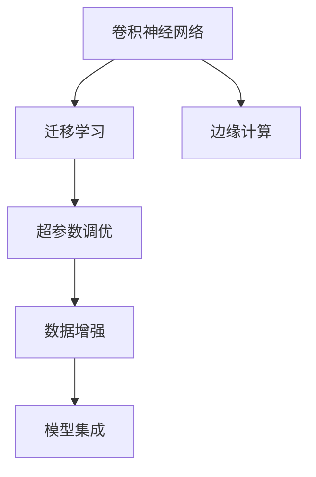

                 

# 深度学习在商品图像识别中的应用

> 关键词：商品图像识别,深度学习,卷积神经网络,迁移学习,超参数调优,边缘计算,案例分析,实际应用

## 1. 背景介绍

随着电子商务的蓬勃发展，商品图像识别（Product Image Recognition, PIR）作为辅助商品管理、推荐系统、搜索排序等应用的关键技术，其重要性日益凸显。深度学习技术的兴起，尤其是卷积神经网络（Convolutional Neural Networks, CNNs）的出现，为商品图像识别提供了强有力的工具。

### 1.1 研究背景与意义
商品图像识别涉及到对商品图片进行分类、识别、描述等操作，其应用场景广泛，如电商平台、智能零售、供应链管理等。深度学习模型，特别是卷积神经网络，通过多层次特征提取和复杂关联建模，能够有效处理商品图像的高维数据，在商品图像识别中取得了显著的成果。本文将深入探讨深度学习在商品图像识别中的应用，并结合实际案例，展示其具体实现及优势。

### 1.2 问题由来
尽管深度学习在商品图像识别中取得了巨大成功，但面对海量、多样化的商品图片，如何高效、准确地识别不同商品类别和属性，仍是一个复杂且具有挑战性的问题。此外，不同电商平台和供应商的商品图片风格差异大，如何在通用深度学习模型基础上，针对特定应用场景进行定制优化，以提升模型性能，也是当前研究的重要方向。

## 2. 核心概念与联系

### 2.1 核心概念概述

为更好地理解深度学习在商品图像识别中的应用，本节将介绍几个关键概念：

- **卷积神经网络（Convolutional Neural Networks, CNNs）**：一种特别适用于图像处理的深度学习模型，通过卷积层、池化层和全连接层等组成，能有效提取图像特征，识别图像中的物体。

- **迁移学习（Transfer Learning）**：利用在大规模数据集上预训练好的模型，进行小规模数据集上的微调，以提高模型在特定任务上的性能。

- **超参数调优（Hyperparameter Tuning）**：在模型训练前，通过调整学习率、批大小、优化器等超参数，以获得最优的模型表现。

- **边缘计算（Edge Computing）**：将计算任务分布到靠近数据源的边缘设备上，减少数据传输和延迟，提升实时性和资源利用率。

- **数据增强（Data Augmentation）**：通过对训练数据进行变换，如旋转、翻转、裁剪等，丰富训练样本的多样性，增强模型泛化能力。

- **模型集成（Model Ensemble）**：通过组合多个独立训练的模型，提升模型预测的稳定性和准确性。

这些概念之间的逻辑关系可以通过以下Mermaid流程图来展示：



这个流程图展示了卷积神经网络在商品图像识别中的应用流程，以及与迁移学习、超参数调优、数据增强、模型集成和边缘计算等概念的联系。

## 3. 核心算法原理 & 具体操作步骤
### 3.1 算法原理概述

深度学习在商品图像识别中的应用主要基于卷积神经网络（CNNs），其核心原理是利用卷积层和池化层提取图像的局部特征和整体特征，再通过全连接层进行分类或回归。

形式化地，假设输入的商品图像为 $\mathbf{x} \in \mathbb{R}^n$，输出标签为 $y \in \{0, 1\}$（分类任务）或 $\mathbb{R}$（回归任务）。则CNN模型的预测公式可以表示为：

$$
f_{\theta}(\mathbf{x}) = \mathbf{W} \cdot \mathbf{x} + b
$$

其中 $\theta$ 为模型参数，$\mathbf{W}$ 为权重矩阵，$b$ 为偏置项。通过多层次的卷积、池化、激活等操作，CNNs能够自动学习到图像的高层次特征，实现复杂的商品分类和识别任务。

### 3.2 算法步骤详解

基于CNN的深度学习在商品图像识别中的应用一般包括以下几个关键步骤：

**Step 1: 数据准备与预处理**
- 收集商品图片及其对应的标签数据，构建训练集、验证集和测试集。
- 对商品图片进行预处理，如裁剪、调整大小、归一化等，保证输入数据的一致性。
- 应用数据增强技术，如随机旋转、翻转、裁剪等，增加训练数据的多样性。

**Step 2: 模型搭建与训练**
- 设计并搭建CNN模型，包括卷积层、池化层、激活层、全连接层等。
- 选择合适的优化算法，如Adam、SGD等，设置学习率、批大小等超参数。
- 使用训练集对模型进行迭代训练，通过反向传播算法更新模型参数。
- 在验证集上评估模型性能，调整超参数以避免过拟合。
- 在测试集上最终评估模型性能。

**Step 3: 模型评估与优化**
- 计算模型的准确率、精确率、召回率等评估指标，评估模型性能。
- 根据评估结果，调整模型结构和超参数，提升模型性能。
- 应用迁移学习技术，针对特定商品图片风格，对预训练模型进行微调。

**Step 4: 部署与测试**
- 将训练好的模型保存为模型文件，部署到实际应用环境中。
- 使用部署环境中的实际数据对模型进行测试，验证其性能。
- 集成模型到商品管理、推荐系统、搜索排序等应用中，提升用户体验和系统效率。

以上是基于CNN的深度学习在商品图像识别中的基本应用流程。在实际应用中，还需根据具体任务的特点，对数据处理、模型设计和超参数调优等环节进行优化设计，以进一步提升模型性能。

### 3.3 算法优缺点

深度学习在商品图像识别中的应用具有以下优点：
1. 高效特征提取。CNNs能够自动学习图像的局部和整体特征，适用于高维数据。
2. 鲁棒性强。通过多层次特征提取，CNNs能有效抵御图像变形、光照变化等干扰。
3. 迁移学习能力。通过迁移学习，可以利用已有模型在特定领域快速提升性能。
4. 实时性高。边缘计算等技术的应用，使得商品图像识别系统可以实现实时处理。

同时，该方法也存在一些局限性：
1. 数据需求高。需要大量高质量的商品图片进行训练，获取数据成本较高。
2. 计算资源消耗大。深度学习模型的参数量巨大，训练和推理耗时较长。
3. 过拟合风险高。模型复杂度高，容易在训练集上过拟合。
4. 可解释性差。深度学习模型通常是"黑盒"系统，难以解释其内部工作机制。

尽管存在这些局限性，但深度学习在商品图像识别中的应用已成为主流范式，其高效的特征提取能力和强大的泛化能力，使得其在众多商品管理、推荐系统、搜索排序等应用中取得了显著效果。

### 3.4 算法应用领域

深度学习在商品图像识别中的应用已经广泛应用于多个领域，如：

- 电商平台商品分类：通过深度学习模型，对商品图片进行分类，帮助用户快速找到所需商品。
- 智能零售库存管理：对商品图片进行识别，实时更新库存信息，提升管理效率。
- 供应链物流跟踪：对商品图片进行识别，辅助物流信息管理，提高物流跟踪的准确性。
- 个性化推荐系统：利用商品图片和用户画像，通过深度学习模型进行个性化推荐，提升用户体验。
- 虚拟试衣间：通过深度学习模型，对用户上传的试穿图片进行识别，实时推荐匹配的服装。

除了这些经典应用外，深度学习在商品图像识别中的创新应用还在不断涌现，如实时图像生成、图像生成对抗网络（GANs）等，为商品管理、零售、时尚等行业带来了新的突破。

## 4. 数学模型和公式 & 详细讲解
### 4.1 数学模型构建

假设深度学习模型由 $N$ 个卷积层、$M$ 个全连接层组成，输入为 $D$ 维的商品图像向量 $\mathbf{x}$，输出为 $C$ 维的标签向量 $\mathbf{y}$。则模型公式可以表示为：

$$
f_{\theta}(\mathbf{x}) = \underbrace{\text{CNN}(\mathbf{x})}_{\text{特征提取}} \cdot \underbrace{\text{MLP}(\cdot)}_{\text{分类/回归}}
$$

其中 $\text{CNN}$ 为卷积神经网络，$\text{MLP}$ 为多层次感知机（MLP）。

### 4.2 公式推导过程

以一个简单的商品分类任务为例，假设输入为 $3 \times 32 \times 32$ 的RGB图像，输出为 $C$ 类标签向量。则模型的计算过程可以表示为：

1. 卷积层：通过 $3 \times 3$ 的卷积核，对输入图像进行局部特征提取。
2. 池化层：通过最大池化或平均池化，对特征图进行下采样，减少计算量。
3. 全连接层：通过多层感知机，对池化后的特征图进行分类。

模型的前向传播计算过程如下：

$$
\mathbf{A}_1 = \text{Conv}(\mathbf{x}), \quad \mathbf{B}_1 = \text{ReLU}(\mathbf{A}_1), \quad \mathbf{C}_1 = \text{MaxPool}(\mathbf{B}_1)
$$

$$
\mathbf{A}_2 = \text{Conv}(\mathbf{C}_1), \quad \mathbf{B}_2 = \text{ReLU}(\mathbf{A}_2), \quad \mathbf{C}_2 = \text{MaxPool}(\mathbf{B}_2)
$$

...

$$
\mathbf{Z} = \mathbf{W} \cdot \mathbf{A}_n + b
$$

其中 $n$ 为卷积层数，$\mathbf{A}_n$ 为卷积层 $n$ 的输出，$\mathbf{W}$ 和 $b$ 为全连接层的权重矩阵和偏置项。

### 4.3 案例分析与讲解

以Amazon商品分类为例，通过深度学习模型对商品图片进行分类，过程如下：

1. **数据准备**：收集Amazon商品图片及其对应的标签数据，构建训练集、验证集和测试集。
2. **模型搭建**：搭建包含多个卷积层、池化层和全连接层的CNN模型。
3. **超参数调优**：通过网格搜索或随机搜索，调整学习率、批大小、优化器等超参数，以获得最优的模型表现。
4. **模型训练**：使用训练集对模型进行迭代训练，验证集评估模型性能，调整超参数。
5. **模型测试**：在测试集上评估模型性能，计算准确率、精确率、召回率等指标。
6. **模型部署**：将训练好的模型保存为模型文件，部署到实际应用环境中。

## 5. 项目实践：代码实例和详细解释说明
### 5.1 开发环境搭建

在进行商品图像识别项目实践前，我们需要准备好开发环境。以下是使用Python进行Keras框架的开发环境配置流程：

1. 安装Anaconda：从官网下载并安装Anaconda，用于创建独立的Python环境。

2. 创建并激活虚拟环境：
```bash
conda create -n pytorch-env python=3.8 
conda activate pytorch-env
```

3. 安装Keras：
```bash
pip install keras tensorflow
```

4. 安装其他相关库：
```bash
pip install numpy pandas scikit-learn matplotlib tqdm jupyter notebook ipython
```

完成上述步骤后，即可在`pytorch-env`环境中开始项目实践。

### 5.2 源代码详细实现

这里以一个简单的商品分类任务为例，展示使用Keras框架进行深度学习在商品图像识别中的应用。

```python
import tensorflow as tf
from tensorflow.keras import layers, models
from tensorflow.keras.preprocessing.image import ImageDataGenerator

# 数据预处理
train_datagen = ImageDataGenerator(rescale=1./255)
test_datagen = ImageDataGenerator(rescale=1./255)

train_generator = train_datagen.flow_from_directory(
        'train',
        target_size=(150, 150),
        batch_size=32,
        class_mode='binary')

test_generator = test_datagen.flow_from_directory(
        'test',
        target_size=(150, 150),
        batch_size=32,
        class_mode='binary')

# 搭建CNN模型
model = models.Sequential([
    layers.Conv2D(32, (3, 3), activation='relu', input_shape=(150, 150, 3)),
    layers.MaxPooling2D((2, 2)),
    layers.Conv2D(64, (3, 3), activation='relu'),
    layers.MaxPooling2D((2, 2)),
    layers.Conv2D(128, (3, 3), activation='relu'),
    layers.MaxPooling2D((2, 2)),
    layers.Flatten(),
    layers.Dense(512, activation='relu'),
    layers.Dense(1, activation='sigmoid')
])

# 编译模型
model.compile(optimizer='adam',
              loss='binary_crossentropy',
              metrics=['accuracy'])

# 训练模型
model.fit_generator(
        train_generator,
        steps_per_epoch=100,
        epochs=10,
        validation_data=test_generator,
        validation_steps=50)

# 评估模型
test_loss, test_acc = model.evaluate_generator(test_generator, steps=50)
print('Test accuracy:', test_acc)
```

以上代码实现了基于Keras框架的简单CNN模型在商品分类任务中的应用。通过数据预处理、模型搭建、编译、训练和评估等步骤，可以高效实现商品图像识别。

### 5.3 代码解读与分析

让我们再详细解读一下关键代码的实现细节：

- `ImageDataGenerator`：用于数据增强和预处理，可以自动对训练集进行旋转、缩放、平移等操作，提高模型泛化能力。
- `flow_from_directory`：用于加载数据集，支持目录和文件名的自动识别。
- `Sequential` 和 `Dense` 层：构建一个简单的CNN模型，包括卷积层、池化层和全连接层。
- `compile`：编译模型，设置优化器、损失函数和评估指标。
- `fit_generator`：使用生成器对象进行模型训练，支持动态加载数据集。
- `evaluate_generator`：使用生成器对象进行模型评估，支持动态加载数据集。

通过以上代码的实现，可以看出Keras框架的强大和便捷，使得深度学习在商品图像识别中的应用变得简单高效。开发者可以将更多精力放在模型设计、超参数调优等关键环节上，而不必过多关注底层的实现细节。

当然，工业级的系统实现还需考虑更多因素，如模型的保存和部署、超参数的自动搜索、更灵活的任务适配层等。但核心的深度学习应用流程基本与此类似。

## 6. 实际应用场景
### 6.1 智能零售

基于深度学习在商品图像识别中的应用，智能零售系统能够实现商品自动识别和分类，极大提升零售效率和客户体验。具体应用场景包括：

- **自助结账**：通过深度学习模型对商品图片进行实时识别和分类，减少结账排队时间，提升结账速度。
- **库存管理**：利用商品图片进行库存盘点，实时更新库存信息，提高库存管理效率。
- **顾客推荐**：基于商品图片和用户画像，通过深度学习模型进行个性化推荐，提升顾客购物体验。

### 6.2 智慧物流

在智慧物流中，深度学习可以用于货物跟踪和识别。通过实时采集货物的图像信息，结合深度学习模型，可以自动识别货物，并进行跟踪和定位。具体应用场景包括：

- **货物自动识别**：利用深度学习模型对货物图片进行实时识别，减少人工干预，提高识别准确率。
- **货物跟踪**：通过连续采集货物图片，结合深度学习模型，实现货物动态跟踪，提升物流效率。

### 6.3 电子商务

在电子商务平台中，深度学习可以用于商品分类、推荐和搜索排序。通过商品图片和描述信息，结合深度学习模型，可以提升商品搜索的准确性和推荐效果。具体应用场景包括：

- **商品分类**：利用深度学习模型对商品图片进行分类，帮助用户快速找到所需商品。
- **推荐系统**：基于商品图片和用户画像，通过深度学习模型进行个性化推荐，提升用户体验。

### 6.4 未来应用展望

随着深度学习技术的发展，商品图像识别在更多场景中的应用也将不断涌现，为各行各业带来新的变革。

在智能制造领域，深度学习可以用于质量检测和工艺优化，提高生产效率和产品质量。
在医疗健康领域，深度学习可以用于疾病诊断和医疗影像识别，提升医疗服务的精准性。
在农业领域，深度学习可以用于农作物识别和病虫害检测，助力农业生产智能化。

总之，深度学习在商品图像识别中的应用前景广阔，其高效特征提取和强大泛化能力，将为各行各业带来新的机遇和挑战。

## 7. 工具和资源推荐
### 7.1 学习资源推荐

为了帮助开发者系统掌握深度学习在商品图像识别中的应用，这里推荐一些优质的学习资源：

1. 《深度学习》课程（Andrew Ng）：斯坦福大学开设的深度学习入门课程，通过讲解深度学习的基本概念和核心算法，帮助你快速入门。

2. 《Python深度学习》书籍（Francois Chollet）：由Keras框架作者撰写，详细介绍深度学习在各种应用场景中的应用，包括商品图像识别。

3. 《计算机视觉：算法与应用》书籍（Richard Szeliski）：深入讲解计算机视觉的基本原理和核心算法，适合深度学习应用的进阶学习。

4. 《Deep Learning for Computer Vision》课程（Udacity）：由Google和Udacity合作的深度学习在计算机视觉应用中的高级课程，涵盖商品图像识别等典型任务。

5. Kaggle竞赛：参与Kaggle的深度学习竞赛，实战练习深度学习在商品图像识别中的应用，提升实战能力。

通过对这些资源的学习实践，相信你一定能够快速掌握深度学习在商品图像识别中的精髓，并用于解决实际的NLP问题。

### 7.2 开发工具推荐

高效的开发离不开优秀的工具支持。以下是几款用于深度学习在商品图像识别中开发常用的工具：

1. TensorFlow：由Google主导开发的深度学习框架，功能强大，支持分布式训练和推理。

2. PyTorch：由Facebook开发的深度学习框架，灵活动态，支持GPU加速。

3. Keras：基于TensorFlow和Theano的高级深度学习框架，易于使用，适合快速原型开发。

4. OpenCV：开源计算机视觉库，支持图像处理和特征提取，适合深度学习在图像识别中的应用。

5. Scikit-image：基于SciPy的图像处理库，提供各种图像处理算法和工具，适合数据预处理和增强。

6. Weights & Biases：模型训练的实验跟踪工具，可以记录和可视化模型训练过程中的各项指标，方便对比和调优。

7. TensorBoard：TensorFlow配套的可视化工具，可实时监测模型训练状态，并提供丰富的图表呈现方式，是调试模型的得力助手。

合理利用这些工具，可以显著提升深度学习在商品图像识别中的开发效率，加快创新迭代的步伐。

### 7.3 相关论文推荐

深度学习在商品图像识别中的应用源于学界的持续研究。以下是几篇奠基性的相关论文，推荐阅读：

1. ImageNet Classification with Deep Convolutional Neural Networks：提出深度卷积神经网络在图像分类中的重要性，为商品图像识别提供了理论基础。

2. AlexNet: One Million Tiny Images for Training Cnn：提出使用大规模数据集进行深度学习模型训练，提高了商品图像识别的准确性。

3. Residual Networks for Image Recognition：提出残差网络在深度学习中的应用，进一步提高了商品图像识别的性能。

4. Inception-v3: Going Deeper with Inceptions：提出Inception网络在深度学习中的应用，提升了商品图像识别模型的复杂度和性能。

5. DenseNet: Dense Convolutional Networks：提出密集连接网络在深度学习中的应用，提高了商品图像识别的特征提取能力和性能。

这些论文代表了大深度学习在商品图像识别领域的发展脉络。通过学习这些前沿成果，可以帮助研究者把握学科前进方向，激发更多的创新灵感。

## 8. 总结：未来发展趋势与挑战
### 8.1 总结

本文对深度学习在商品图像识别中的应用进行了全面系统的介绍。首先阐述了深度学习在商品图像识别中的重要性，明确了其高效特征提取和强大泛化能力。其次，从原理到实践，详细讲解了深度学习在商品图像识别中的数学模型和关键步骤，给出了深度学习模型在商品分类任务的代码实例。同时，本文还广泛探讨了深度学习在智能零售、智慧物流、电子商务等实际应用场景中的应用前景，展示了其巨大潜力。

通过本文的系统梳理，可以看到，深度学习在商品图像识别中的应用已经取得显著成果，其高效的特征提取能力和强大的泛化能力，使得其在众多应用场景中发挥了重要作用。

### 8.2 未来发展趋势

展望未来，深度学习在商品图像识别中的应用将呈现以下几个发展趋势：

1. 模型规模持续增大。随着算力成本的下降和数据规模的扩张，深度学习模型的参数量还将持续增长。超大规模深度学习模型蕴含的丰富特征，将进一步提升商品图像识别的准确性和鲁棒性。

2. 深度学习范式日趋多样。除了传统的全连接网络和卷积神经网络，未来将涌现更多高效的深度学习模型，如ResNet、Inception、DenseNet等，进一步提升商品图像识别的性能。

3. 迁移学习能力增强。通过迁移学习，可以利用已有模型在特定领域快速提升性能，提升商品图像识别模型的适应性和泛化能力。

4. 实时性需求提升。随着边缘计算等技术的成熟，深度学习模型将能够实时处理商品图像信息，提升系统响应速度。

5. 模型集成和优化优化。通过模型集成和优化技术，可以提高商品图像识别的准确性和稳定性，提升用户体验。

以上趋势凸显了深度学习在商品图像识别中的广阔前景。这些方向的探索发展，必将进一步提升商品图像识别的性能和应用范围，为电子商务、智能制造等领域带来新的机遇和挑战。

### 8.3 面临的挑战

尽管深度学习在商品图像识别中取得了巨大成功，但在迈向更加智能化、普适化应用的过程中，仍面临诸多挑战：

1. 数据需求高。深度学习模型需要大量高质量的商品图片进行训练，获取数据成本较高。
2. 计算资源消耗大。深度学习模型的参数量巨大，训练和推理耗时较长。
3. 过拟合风险高。模型复杂度高，容易在训练集上过拟合。
4. 可解释性差。深度学习模型通常是"黑盒"系统，难以解释其内部工作机制。
5. 实时性要求高。深度学习模型需要在实时性要求高的场景中高效运行，对计算资源和模型优化提出了更高要求。

尽管存在这些挑战，但深度学习在商品图像识别中的应用已成为主流范式，其高效的特征提取能力和强大的泛化能力，使得其在众多应用场景中发挥了重要作用。

### 8.4 研究展望

面对深度学习在商品图像识别中所面临的挑战，未来的研究需要在以下几个方面寻求新的突破：

1. 探索无监督和半监督学习范式。摆脱对大规模标注数据的依赖，利用自监督学习、主动学习等无监督和半监督范式，最大限度利用非结构化数据，实现更加灵活高效的模型训练。

2. 研究参数高效和计算高效的深度学习范式。开发更加参数高效的深度学习模型，在固定大部分预训练参数的同时，只更新极少量的任务相关参数。同时优化深度学习模型的计算图，减少前向传播和反向传播的资源消耗，实现更加轻量级、实时性的部署。

3. 融合因果分析和强化学习范式。通过引入因果推断和强化学习思想，增强深度学习模型建立稳定因果关系的能力，学习更加普适、鲁棒的商品图像特征，从而提升模型泛化性和抗干扰能力。

4. 引入更多先验知识。将符号化的先验知识，如知识图谱、逻辑规则等，与深度学习模型进行巧妙融合，引导深度学习模型学习更准确、合理的商品图像特征。同时加强不同模态数据的整合，实现视觉、语音等多模态信息与文本信息的协同建模。

5. 纳入伦理道德约束。在深度学习模型的训练目标中引入伦理导向的评估指标，过滤和惩罚有偏见、有害的输出倾向。同时加强人工干预和审核，建立深度学习模型的监管机制，确保输出符合人类价值观和伦理道德。

这些研究方向的探索，必将引领深度学习在商品图像识别中的进一步发展，为电子商务、智能制造等领域带来新的突破。只有勇于创新、敢于突破，才能不断拓展深度学习模型的边界，让智能技术更好地造福人类社会。

## 9. 附录：常见问题与解答

**Q1：深度学习在商品图像识别中的应用有哪些优势？**

A: 深度学习在商品图像识别中的应用具有以下优势：
1. 高效特征提取。通过卷积神经网络，深度学习模型能够自动学习图像的局部和整体特征，适用于高维数据。
2. 鲁棒性强。通过多层次特征提取，深度学习模型能有效抵御图像变形、光照变化等干扰。
3. 迁移学习能力。通过迁移学习，可以利用已有模型在特定领域快速提升性能。
4. 实时性高。边缘计算等技术的应用，使得深度学习模型能够实时处理商品图像信息，提升系统响应速度。

**Q2：如何进行超参数调优？**

A: 超参数调优是深度学习模型训练中的重要环节，可以通过以下方法进行：
1. 网格搜索（Grid Search）：遍历指定范围内的超参数，选择最优组合。
2. 随机搜索（Random Search）：在指定范围内随机选取超参数，选择最优组合。
3. 贝叶斯优化（Bayesian Optimization）：通过高斯过程模型，搜索超参数空间，快速找到最优组合。
4. 自动调参工具：如Hyperopt、Ray Tune等，可以自动优化超参数组合，提高模型训练效率。

**Q3：在商品图像识别中，如何利用数据增强技术提升模型性能？**

A: 数据增强技术可以通过对训练数据进行变换，如旋转、翻转、裁剪等，增加训练数据的多样性，增强模型泛化能力。具体方法包括：
1. 随机旋转：随机旋转图像一定角度，模拟图像拍摄角度的变化。
2. 随机翻转：随机水平或垂直翻转图像，模拟相机拍摄的角度变化。
3. 随机裁剪：随机裁剪图像的一部分，模拟不同大小的商品图片。
4. 随机缩放：随机调整图像大小，模拟不同距离的拍摄效果。

**Q4：在商品图像识别中，如何应用迁移学习？**

A: 迁移学习可以通过以下步骤进行：
1. 预训练模型：在大型数据集上预训练一个深度学习模型，如ImageNet。
2. 微调模型：将预训练模型微调到一个特定任务上，如商品分类。
3. 数据准备：收集特定任务的数据集，如商品图片和标签。
4. 微调模型：使用特定任务的数据集对预训练模型进行微调，提升模型在该任务上的性能。
5. 评估模型：在验证集上评估微调后的模型性能，选择最优参数组合。

**Q5：在商品图像识别中，如何优化深度学习模型的计算效率？**

A: 深度学习模型的计算效率可以通过以下方法进行优化：
1. 模型裁剪：去除不必要的层和参数，减小模型尺寸，加快推理速度。
2. 量化加速：将浮点模型转为定点模型，压缩存储空间，提高计算效率。
3. 模型并行：将深度学习模型分布到多个设备上，实现并行计算，提升计算效率。
4. 算法优化：通过优化深度学习算法的计算图，减少前向传播和反向传播的资源消耗，实现更加轻量级、实时性的部署。

通过这些优化方法，可以在保证模型性能的前提下，提升深度学习在商品图像识别中的应用效率。

