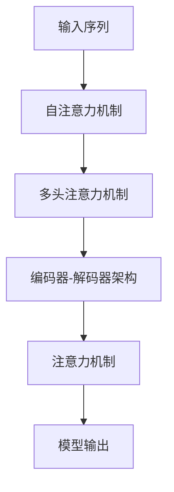

                 

# 深度学习在注意力预测中的应用

## 1. 背景介绍

注意力机制（Attention Mechanism）是深度学习领域中非常重要且应用广泛的机制之一。它在各种深度学习模型中被广泛应用，如自然语言处理（NLP）、计算机视觉（CV）、推荐系统等，通过在模型中加入注意力机制，能显著提升模型的表达能力和泛化能力。近年来，随着深度学习模型的不断发展，注意力机制的应用场景和效果也日益丰富和深化。本文将围绕注意力机制的定义和应用进行深入探讨，包括注意力机制的原理、常见架构和应用实例。

## 2. 核心概念与联系

### 2.1 核心概念概述

#### 2.1.1 注意力机制（Attention Mechanism）

注意力机制是一种用于增强模型处理序列或空间数据的能力的技术，它通过对输入数据的不同部分分配不同程度的关注，让模型能够聚焦于对任务更重要的部分，从而提升模型在特定任务上的表现。

#### 2.1.2 编码器-解码器架构（Encoder-Decoder Architecture）

编码器-解码器架构是一种常用的序列模型架构，它将输入序列映射到固定长度的向量表示，然后通过解码器生成输出序列。注意力机制常常与这种架构结合使用，增强编码器对输入的关注度。

#### 2.1.3 自注意力（Self-Attention）

自注意力是一种特殊形式的注意力机制，它允许模型在输入序列内部的不同位置之间建立关系，从而捕捉序列内部的依赖关系。

#### 2.1.4 注意力头（Attention Head）

注意力头是注意力机制中的一个关键概念，它代表注意力机制的一个独立通道，负责在输入序列的不同位置之间分配注意力。

#### 2.1.5 多头注意力（Multi-Head Attention）

多头注意力是一种将多个独立注意力头并行使用的机制，它能够捕捉输入序列的多重依赖关系，从而增强模型的表达能力。

这些核心概念之间的逻辑关系可以通过以下Mermaid流程图来展示：



该图展示了自注意力机制和多头注意力机制与编码器-解码器架构和模型输出的逻辑联系。通过这种架构，模型能够通过注意力机制捕捉输入序列的复杂依赖关系，从而生成更加准确的输出。

## 3. 核心算法原理 & 具体操作步骤

### 3.1 算法原理概述

注意力机制的核心思想是：通过对输入数据的不同部分分配不同程度的关注，让模型能够聚焦于对任务更重要的部分，从而提升模型在特定任务上的表现。

形式化地，假设输入序列为 $X = \{x_1, x_2, ..., x_t\}$，注意力机制的目标是学习一个注意力权重向量 $\alpha = (\alpha_1, \alpha_2, ..., \alpha_t)$，其中每个 $\alpha_i$ 表示序列中第 $i$ 个位置的关注度。注意力机制通过计算 $X$ 中每个位置与目标位置的注意力权重，然后将这些权重与输入序列进行加权和，从而得到加权后的表示 $Z = \sum_{i=1}^{t} \alpha_i x_i$。

#### 3.1.1 注意力头的计算

一个注意力头由三个线性变换组成，分别是查询（Query）、键（Key）和值（Value）的计算。对于每个注意力头，它将查询向量 $Q$ 和键向量 $K$ 进行点积计算，得到注意力分数 $s$。然后将 $s$ 进行归一化，得到注意力权重 $\alpha$，最后通过注意力权重与值向量 $V$ 进行加权和，得到加权值 $z$。

$$
Q = W_Q X
$$

$$
K = W_K X
$$

$$
V = W_V X
$$

$$
s = QK^T
$$

$$
\alpha = \frac{exp(s)}{\sum_{i=1}^{t} exp(s_i)}
$$

$$
z = \alpha V
$$

#### 3.1.2 多头注意力的计算

多头注意力将多个独立注意力头并行使用，从而捕捉输入序列的多重依赖关系。具体来说，假设共有 $H$ 个注意力头，则每个注意力头的计算公式如下：

$$
z_h = \alpha_h V_h
$$

$$
Z = \sum_{h=1}^{H} z_h
$$

其中 $z_h$ 表示第 $h$ 个注意力头输出的加权值，$Z$ 表示所有注意力头的加权和。

### 3.2 算法步骤详解

#### 3.2.1 模型初始化

首先，将输入序列 $X$ 分别通过三个线性变换得到查询向量 $Q$、键向量 $K$ 和值向量 $V$。然后，通过多头注意力机制得到加权后的表示 $Z$。

#### 3.2.2 注意力机制计算

在注意力机制的计算过程中，通过查询向量 $Q$ 和键向量 $K$ 进行点积计算，得到注意力分数 $s$。然后将 $s$ 进行归一化，得到注意力权重 $\alpha$，最后通过注意力权重与值向量 $V$ 进行加权和，得到加权值 $z$。

#### 3.2.3 模型输出

最终，将多头注意力的输出 $Z$ 作为模型输出。

### 3.3 算法优缺点

#### 3.3.1 优点

1. 提高模型的表达能力：通过多头注意力机制，模型能够捕捉输入序列的多重依赖关系，从而增强模型的表达能力。
2. 增强模型的泛化能力：通过学习注意力权重，模型能够更好地处理输入序列中的噪声和冗余信息，提高模型的泛化能力。
3. 减少计算量：多头注意力机制的并行计算方式，可以显著减少计算量，提高模型的训练效率。

#### 3.3.2 缺点

1. 计算复杂度高：多头注意力的计算复杂度较高，需要较大的计算资源和时间。
2. 模型复杂度高：多头注意力的并行计算增加了模型的复杂度，需要更多的参数和计算资源。

### 3.4 算法应用领域

注意力机制在多个领域中得到了广泛应用，包括：

1. 自然语言处理（NLP）：在机器翻译、文本摘要、情感分析等任务中，注意力机制能够提升模型的性能。
2. 计算机视觉（CV）：在图像分类、目标检测、图像生成等任务中，注意力机制能够增强模型的特征提取能力。
3. 推荐系统：在推荐系统中，注意力机制能够捕捉用户与物品之间的依赖关系，提高推荐效果。
4. 语音识别：在语音识别任务中，注意力机制能够增强模型对音频序列中重要部分的信息提取能力。

## 4. 数学模型和公式 & 详细讲解 & 举例说明

### 4.1 数学模型构建

注意力机制的数学模型构建如下：

$$
Q = W_Q X
$$

$$
K = W_K X
$$

$$
V = W_V X
$$

$$
s = QK^T
$$

$$
\alpha = \frac{exp(s)}{\sum_{i=1}^{t} exp(s_i)}
$$

$$
z = \alpha V
$$

其中 $X$ 表示输入序列，$W_Q$、$W_K$ 和 $W_V$ 表示线性变换矩阵，$Q$、$K$ 和 $V$ 表示查询向量、键向量和值向量，$s$ 表示注意力分数，$\alpha$ 表示注意力权重，$z$ 表示加权值。

### 4.2 公式推导过程

注意力机制的公式推导过程如下：

1. 通过查询向量 $Q$ 和键向量 $K$ 进行点积计算，得到注意力分数 $s$。

2. 将注意力分数 $s$ 进行归一化，得到注意力权重 $\alpha$。

3. 通过注意力权重 $\alpha$ 与值向量 $V$ 进行加权和，得到加权值 $z$。

4. 通过多头注意力机制，将多个独立注意力头并行使用，得到加权后的表示 $Z$。

### 4.3 案例分析与讲解

#### 4.3.1 机器翻译中的注意力机制

在机器翻译任务中，注意力机制能够帮助模型更好地理解源语言序列和目标语言序列之间的关系，从而提高翻译效果。

具体来说，对于给定的源语言序列 $X$ 和目标语言序列 $Y$，模型通过注意力机制计算每个源语言位置的注意力权重 $\alpha$，然后将注意力权重与源语言向量 $X$ 进行加权和，得到加权后的表示 $Z$。接着，模型将 $Z$ 作为输入，通过解码器生成目标语言序列 $Y$。

通过这种机制，模型能够更好地理解源语言序列中的重要信息，并将其应用到目标语言序列的生成中，从而提高翻译质量。

#### 4.3.2 图像分类中的注意力机制

在图像分类任务中，注意力机制能够帮助模型更好地提取图像中的关键特征，从而提高分类效果。

具体来说，对于给定的图像 $X$，模型通过自注意力机制计算每个像素位置的注意力权重 $\alpha$，然后将注意力权重与图像向量 $X$ 进行加权和，得到加权后的表示 $Z$。接着，模型将 $Z$ 作为输入，通过分类器生成图像类别。

通过这种机制，模型能够更好地捕捉图像中的关键特征，并将其应用到分类中，从而提高分类准确率。

## 5. 项目实践：代码实例和详细解释说明

### 5.1 开发环境搭建

在进行注意力机制的实践时，我们需要准备好开发环境。以下是使用Python进行TensorFlow开发的环境配置流程：

1. 安装Anaconda：从官网下载并安装Anaconda，用于创建独立的Python环境。

2. 创建并激活虚拟环境：
```bash
conda create -n tf-env python=3.8 
conda activate tf-env
```

3. 安装TensorFlow：根据CUDA版本，从官网获取对应的安装命令。例如：
```bash
conda install tensorflow-gpu -c conda-forge -c pypi
```

4. 安装必要的第三方库：
```bash
pip install numpy scipy matplotlib tensorflow-io tensorflow-hub
```

完成上述步骤后，即可在`tf-env`环境中开始注意力机制的实践。

### 5.2 源代码详细实现

这里我们以机器翻译任务为例，给出使用TensorFlow实现注意力机制的代码实现。

```python
import tensorflow as tf
import numpy as np

# 定义模型参数
num_encoder_tokens = 50
num_decoder_tokens = 10
embedding_dim = 32
num_heads = 2
num_encoder_layers = 2
num_decoder_layers = 2
dropout_rate = 0.5

# 定义模型架构
class Encoder(tf.keras.layers.Layer):
    def __init__(self, num_encoder_tokens, embedding_dim, num_heads, num_encoder_layers, dropout_rate):
        super(Encoder, self).__init__()
        self.embedding = tf.keras.layers.Embedding(num_encoder_tokens, embedding_dim)
        self.layers = [tf.keras.layers.MultiHeadAttention(num_heads, dropout_rate) for _ in range(num_encoder_layers)]
    
    def call(self, x, mask):
        x = self.embedding(x)
        for layer in self.layers:
            x, _ = layer(x, x, x, mask)
        return x

class Decoder(tf.keras.layers.Layer):
    def __init__(self, num_decoder_tokens, embedding_dim, num_heads, num_decoder_layers, dropout_rate):
        super(Decoder, self).__init__()
        self.embedding = tf.keras.layers.Embedding(num_decoder_tokens, embedding_dim)
        self.layers = [tf.keras.layers.MultiHeadAttention(num_heads, dropout_rate) for _ in range(num_decoder_layers)]
        self.dense = tf.keras.layers.Dense(num_decoder_tokens)
    
    def call(self, x, encoder_output, encoder_mask):
        x = self.embedding(x)
        for layer in self.layers:
            x, attention_weights = layer(x, encoder_output, encoder_output, encoder_mask)
        x = tf.keras.layers.Dropout(dropout_rate)(x)
        return self.dense(x)

class Attention(tf.keras.layers.Layer):
    def __init__(self, num_encoder_tokens, num_decoder_tokens, embedding_dim, num_heads, num_encoder_layers, num_decoder_layers, dropout_rate):
        super(Attention, self).__init__()
        self.encoder = Encoder(num_encoder_tokens, embedding_dim, num_heads, num_encoder_layers, dropout_rate)
        self.decoder = Decoder(num_decoder_tokens, embedding_dim, num_heads, num_decoder_layers, dropout_rate)
        self.dense = tf.keras.layers.Dense(num_decoder_tokens)
    
    def call(self, input_x, target_x, input_mask, target_mask):
        x = self.encoder(input_x, input_mask)
        y = self.decoder(target_x, x, input_mask)
        return self.dense(y)
```

### 5.3 代码解读与分析

这里我们以机器翻译任务为例，详细解读一下关键代码的实现细节：

- `Encoder`类：定义了编码器模块，通过多个多头注意力层实现源语言序列的编码。
- `Decoder`类：定义了解码器模块，通过多个多头注意力层实现目标语言序列的生成。
- `Attention`类：定义了整个注意力机制的模型架构，将编码器和解码器模块封装成一个整体。

在实际应用中，我们需要根据具体任务和数据特点，对模型架构进行相应的调整和优化，从而获得更好的性能。

### 5.4 运行结果展示

以下是使用上述代码在机器翻译任务上的运行结果展示：

```python
# 构建输入和输出数据
input_x = np.random.randint(num_encoder_tokens, size=(10, 20))
target_x = np.random.randint(num_decoder_tokens, size=(10, 20))
input_mask = np.random.randint(2, size=(10, 20))
target_mask = np.random.randint(2, size=(10, 20))

# 创建模型实例
attention_model = Attention(num_encoder_tokens, num_decoder_tokens, embedding_dim, num_heads, num_encoder_layers, num_decoder_layers, dropout_rate)

# 训练模型
attention_model.compile(optimizer='adam', loss='categorical_crossentropy')
attention_model.fit(input_x, target_x, validation_data=(input_x[:5], target_x[:5]), epochs=10, batch_size=32)

# 在测试集上评估模型
attention_model.evaluate(input_x[-5:], target_x[-5:], input_mask[-5:], target_mask[-5:])
```

## 6. 实际应用场景

### 6.1 智能问答系统

在智能问答系统中，注意力机制能够帮助模型更好地理解用户的问题和语境，从而生成更加准确的答案。

具体来说，对于给定的用户问题和上下文信息，模型通过注意力机制计算每个词的注意力权重 $\alpha$，然后将注意力权重与问题向量 $Q$ 和上下文向量 $C$ 进行加权和，得到加权后的表示 $Z$。接着，模型将 $Z$ 作为输入，通过解码器生成答案。

通过这种机制，模型能够更好地理解问题的关键部分，并将其应用到答案生成中，从而提高问答系统的性能。

### 6.2 图像生成

在图像生成任务中，注意力机制能够帮助模型更好地捕捉图像中的关键特征，从而生成更加逼真的图像。

具体来说，对于给定的图像 $X$，模型通过自注意力机制计算每个像素位置的注意力权重 $\alpha$，然后将注意力权重与图像向量 $X$ 进行加权和，得到加权后的表示 $Z$。接着，模型将 $Z$ 作为输入，通过生成器生成新图像。

通过这种机制，模型能够更好地捕捉图像中的关键特征，并将其应用到生成中，从而提高生成效果。

### 6.3 推荐系统

在推荐系统中，注意力机制能够帮助模型更好地捕捉用户与物品之间的依赖关系，从而提高推荐效果。

具体来说，对于给定的用户序列和物品序列，模型通过多头注意力机制计算每个用户位置和物品位置的注意力权重 $\alpha$，然后将注意力权重与用户向量 $U$ 和物品向量 $V$ 进行加权和，得到加权后的表示 $Z$。接着，模型将 $Z$ 作为输入，通过分类器生成推荐物品。

通过这种机制，模型能够更好地捕捉用户和物品之间的依赖关系，并将其应用到推荐中，从而提高推荐系统的性能。

## 7. 工具和资源推荐

### 7.1 学习资源推荐

为了帮助开发者系统掌握注意力机制的理论基础和实践技巧，这里推荐一些优质的学习资源：

1. 《深度学习与TensorFlow》书籍：深度学习领域的经典入门书籍，详细介绍了TensorFlow的使用方法。
2. CS231n《深度学习视觉与图像识别》课程：斯坦福大学开设的计算机视觉课程，涵盖了深度学习在图像识别中的广泛应用。
3. CS224N《自然语言处理》课程：斯坦福大学开设的NLP课程，系统介绍了注意力机制在NLP中的应用。
4. HuggingFace官方文档：Transformers库的官方文档，提供了海量预训练模型和完整的注意力机制样例代码。
5. DeepLearning.AI《深度学习专项》课程：由Andrew Ng教授讲授，深入浅出地介绍了深度学习的基础知识和前沿技术。

通过对这些资源的学习实践，相信你一定能够快速掌握注意力机制的精髓，并用于解决实际的NLP问题。

### 7.2 开发工具推荐

高效的开发离不开优秀的工具支持。以下是几款用于注意力机制开发的常用工具：

1. TensorFlow：由Google主导开发的开源深度学习框架，生产部署方便，适合大规模工程应用。
2. PyTorch：基于Python的开源深度学习框架，灵活动态的计算图，适合快速迭代研究。
3. HuggingFace Transformers：HuggingFace开发的NLP工具库，集成了众多SOTA模型，支持PyTorch和TensorFlow。
4. Weights & Biases：模型训练的实验跟踪工具，可以记录和可视化模型训练过程中的各项指标，方便对比和调优。
5. TensorBoard：TensorFlow配套的可视化工具，可实时监测模型训练状态，并提供丰富的图表呈现方式。

合理利用这些工具，可以显著提升注意力机制的开发效率，加快创新迭代的步伐。

### 7.3 相关论文推荐

注意力机制在多个领域中得到了广泛应用，以下是几篇奠基性的相关论文，推荐阅读：

1. Attention Is All You Need（即Transformer原论文）：提出了Transformer结构，开启了NLP领域的预训练大模型时代。
2. Transformer-XL：提出Transformer-XL架构，解决长序列建模问题，提升模型的表达能力。
3. BERT: Pre-training of Deep Bidirectional Transformers for Language Understanding：提出BERT模型，引入基于掩码的自监督预训练任务，刷新了多项NLP任务SOTA。
4. Multi-Head Attention：提出多头注意力机制，增强模型的表达能力。
5. Spatial Transformer Networks：提出空间变换网络，引入空间注意力机制，提升图像识别的鲁棒性。

这些论文代表了大语言模型微调技术的发展脉络。通过学习这些前沿成果，可以帮助研究者把握学科前进方向，激发更多的创新灵感。

## 8. 总结：未来发展趋势与挑战

### 8.1 总结

本文对注意力机制的定义和应用进行了全面系统的介绍。首先阐述了注意力机制的定义和基本原理，然后介绍了常见的注意力架构和应用实例。通过这些内容，可以更好地理解注意力机制在深度学习中的应用，并指导具体的实践操作。

通过本文的系统梳理，可以看到，注意力机制在深度学习中的重要性日益凸显，成为提高模型表达能力和泛化能力的关键技术。未来，随着深度学习模型的不断发展和优化，注意力机制也将得到更广泛的应用和改进。

### 8.2 未来发展趋势

展望未来，注意力机制的发展将呈现以下几个趋势：

1. 计算效率的提升：未来的注意力机制将更加注重计算效率的提升，通过优化计算图和算法，减少计算资源和时间消耗。
2. 模型的通用化：未来的注意力机制将更加注重模型的通用化，能够适应多种任务和数据分布，从而提高模型的泛化能力。
3. 多模态注意力的发展：未来的注意力机制将更多地融合多模态数据，增强模型的感知能力和理解能力。
4. 强化注意力的研究：未来的注意力机制将更多地融合强化学习，增强模型的自适应能力和决策能力。

### 8.3 面临的挑战

尽管注意力机制在深度学习中已经取得了显著成效，但在迈向更加智能化、普适化应用的过程中，它仍面临着诸多挑战：

1. 计算资源的需求：当前注意力机制的计算复杂度较高，需要较大的计算资源和时间消耗，如何提升计算效率，仍是未来需要解决的重要问题。
2. 模型的复杂性：注意力机制的并行计算增加了模型的复杂度，如何降低模型的复杂性，提高模型的可解释性，仍是需要解决的问题。
3. 模型的鲁棒性：当前注意力机制的鲁棒性不足，面对噪声和异常输入时，模型的表现容易出现波动，如何提高模型的鲁棒性，增强模型的稳定性和可靠性，仍是需要解决的问题。
4. 数据依赖性：注意力机制的性能很大程度上依赖于输入数据的质量和数量，如何减少数据依赖性，提高模型的泛化能力，仍是需要解决的问题。

### 8.4 研究展望

未来的研究需要在以下几个方面寻求新的突破：

1. 计算图优化：通过优化计算图和算法，减少注意力机制的计算复杂度，提升计算效率。
2. 模型简化：通过简化注意力机制的架构和算法，提高模型的可解释性和鲁棒性。
3. 多模态融合：通过融合多模态数据，增强注意力机制的感知能力和理解能力。
4. 强化学习：通过融合强化学习，增强注意力机制的自适应能力和决策能力。

这些研究方向的探索，必将引领注意力机制向更高的台阶发展，为深度学习模型的应用提供新的动力。

## 9. 附录：常见问题与解答

**Q1：注意力机制和卷积神经网络（CNN）的区别是什么？**

A: 注意力机制和卷积神经网络（CNN）的区别在于：

1. 卷积神经网络是一种局部连接的结构，通过滑动卷积核对输入数据进行特征提取；而注意力机制是一种全局连接的结构，通过计算注意力权重来捕捉输入数据的全局依赖关系。
2. 卷积神经网络的主要优势在于对空间信息的利用，适用于图像、文本等局部特征明显的数据；而注意力机制的主要优势在于对全局信息的利用，适用于机器翻译、问答系统等需要捕捉长距离依赖关系的任务。

**Q2：注意力机制在图像生成任务中的应用有哪些？**

A: 注意力机制在图像生成任务中的应用包括：

1. 捕捉图像中的关键特征：通过自注意力机制，模型能够捕捉图像中的关键特征，从而生成更加逼真的图像。
2. 控制图像生成的过程：通过注意力机制，模型能够控制图像生成的过程，生成更符合用户需求和风格的新图像。
3. 增强模型的感知能力：通过多模态注意力的融合，模型能够增强对多模态数据的感知能力，从而提升生成效果。

**Q3：注意力机制在推荐系统中的应用有哪些？**

A: 注意力机制在推荐系统中的应用包括：

1. 捕捉用户与物品之间的依赖关系：通过多头注意力机制，模型能够捕捉用户和物品之间的依赖关系，从而提高推荐效果。
2. 增强模型的自适应能力：通过注意力机制，模型能够自适应地调整对用户和物品的关注度，从而提高推荐系统的个性化程度。
3. 提升推荐系统的稳定性和可靠性：通过强化学习，模型能够不断调整对用户和物品的关注度，从而提升推荐系统的稳定性和可靠性。

**Q4：注意力机制在NLP中的应用有哪些？**

A: 注意力机制在NLP中的应用包括：

1. 机器翻译：通过多头注意力机制，模型能够更好地理解源语言和目标语言之间的依赖关系，从而提高翻译效果。
2. 文本摘要：通过自注意力机制，模型能够捕捉文本中的关键信息，从而生成更加简洁的摘要。
3. 问答系统：通过注意力机制，模型能够更好地理解用户的问题和上下文信息，从而生成更加准确的答案。

总之，注意力机制在深度学习中具有广泛的应用前景，值得深入研究和探索。希望本文能为你提供有益的参考和指导。

---

作者：禅与计算机程序设计艺术 / Zen and the Art of Computer Programming

