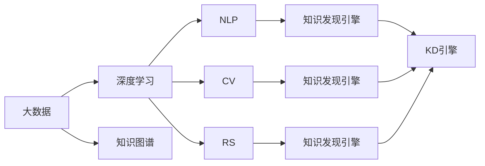

                 

# 深度学习在知识发现引擎中的应用

> 关键词：深度学习,知识发现引擎,自然语言处理,推荐系统,计算机视觉,大数据,知识图谱,强化学习

## 1. 背景介绍

### 1.1 问题由来

随着互联网技术的迅猛发展，大数据和人工智能技术逐渐渗透到各行各业，为人类带来了巨大的变革。然而，在海量数据中挖掘有价值的信息，形成可操作的洞察力，成为当前数据挖掘领域的重大挑战。这其中，知识发现(Knowledge Discovery, KD)应用大放异彩，通过深挖数据背后的模式和规律，为人类社会带来了革命性的变化。

知识发现引擎(Knowledge Discovery Engine, KDE)作为知识发现的智能化工具，正在逐步走向成熟。其核心技术体系包括自然语言处理(Natural Language Processing, NLP)、计算机视觉(Computer Vision, CV)、推荐系统(Recommender System, RS)等，深度学习技术的介入使其具备了更高的效率和泛化能力，能够更好地从大规模数据中提取知识，服务于各行各业的智能化决策。

本文旨在全面介绍深度学习在知识发现引擎中的应用，将从算法原理、实践技巧、应用场景等多个维度，深入探讨如何通过深度学习构建高效、智能的知识发现系统。

### 1.2 问题核心关键点

知识发现引擎的构建，需要经历数据准备、特征工程、模型训练和评估等多个环节，而深度学习在其中扮演了重要角色。以下是构建知识发现引擎需要关注的核心关键点：

- 数据准备：收集和清洗大规模数据，构建有效的数据存储和检索机制，为知识发现引擎提供数据基础。
- 特征工程：通过深度学习模型自动提取数据中的高阶特征，构建有意义的特征空间，提升模型性能。
- 模型训练：选择合适的深度学习模型，在标注数据上训练，获得对数据模式和规律的洞察力。
- 评估与优化：利用各类评估指标，对模型效果进行衡量，不断迭代优化模型，提升知识发现能力。

在本文中，我们将围绕上述关键点，对深度学习在知识发现引擎中的应用进行系统性介绍。

## 2. 核心概念与联系

### 2.1 核心概念概述

为了深入理解深度学习在知识发现引擎中的应用，本节将详细讲解其中涉及的几个核心概念：

- **深度学习(Deep Learning, DL)**：通过构建深层神经网络，自动学习数据特征，实现复杂任务的机器学习范式。深度学习已经在图像识别、语音识别、自然语言处理等领域取得了显著成果。

- **知识发现引擎(Knowledge Discovery Engine, KDE)**：通过数据分析、模型训练和知识提取等技术，从大规模数据中发现知识，辅助决策，支持信息智能化的应用系统。

- **自然语言处理(Natural Language Processing, NLP)**：利用深度学习模型处理和理解人类语言，实现文本分类、命名实体识别、情感分析、机器翻译等任务。

- **计算机视觉(Computer Vision, CV)**：通过深度学习模型理解和分析图像和视频数据，实现图像识别、物体检测、人脸识别等应用。

- **推荐系统(Recommender System, RS)**：利用深度学习模型预测用户对物品的偏好，为用户推荐合适的产品或内容。

- **大数据(Big Data)**：指规模庞大的数据集，包括结构化、半结构化和非结构化数据，需要借助分布式计算和大规模存储技术处理。

- **知识图谱(Knowledge Graph, KG)**：通过实体、关系和属性等元素，构建图数据库，实现知识发现和推理。

这些核心概念之间通过深度学习技术形成了紧密的联系：深度学习模型作为知识发现引擎的技术基础，能够自动挖掘数据中的高阶特征，形成知识图谱，辅助决策推荐，最终实现大规模数据中的知识发现。

### 2.2 核心概念原理和架构的 Mermaid 流程图



从图中可以看出，大数据、深度学习、知识图谱、自然语言处理、计算机视觉、推荐系统等核心概念，通过深度学习模型，形成了知识发现引擎的基础架构。这种架构设计不仅能够处理结构化数据，还支持对复杂非结构化数据的智能分析，全面提升了知识发现引擎的智能化水平。

## 3. 核心算法原理 & 具体操作步骤
### 3.1 算法原理概述

深度学习在知识发现引擎中的应用，核心在于通过深度神经网络自动提取数据特征，形成高维特征空间，并在此基础上进行模式发现和知识推理。

一般而言，知识发现引擎的设计流程可以分为以下几个步骤：

1. **数据准备**：收集和清洗数据，构建有效的数据存储和检索机制，为后续分析和模型训练提供数据基础。
2. **特征提取**：利用深度学习模型，自动提取数据中的高阶特征，构建有意义的特征空间，提升模型性能。
3. **模型训练**：选择合适的深度学习模型，在标注数据上训练，获得对数据模式和规律的洞察力。
4. **知识推理**：利用训练好的模型进行推理和预测，形成知识的高级表示，支持决策推荐。
5. **效果评估**：通过各类评估指标，对模型效果进行衡量，不断迭代优化模型，提升知识发现能力。

深度学习在知识发现引擎中的应用，主要涉及以下几个方面：

- 自然语言处理：通过深度学习模型处理和理解文本数据，构建文本-知识表示的映射。
- 计算机视觉：通过深度学习模型理解和分析图像数据，构建图像-知识表示的映射。
- 推荐系统：通过深度学习模型预测用户对物品的偏好，为用户推荐合适的产品或内容。
- 知识图谱构建：通过深度学习模型构建实体关系图谱，辅助决策推理。

### 3.2 算法步骤详解

以下是构建基于深度学习的知识发现引擎的具体步骤：

**Step 1: 数据准备**

- 收集和清洗大规模数据，构建有效的数据存储和检索机制，如使用Hadoop、Spark等分布式计算框架，进行数据存储和预处理。
- 构建数据管道，实现数据实时采集和更新，保持数据的时效性和完整性。

**Step 2: 特征工程**

- 利用深度学习模型自动提取数据中的高阶特征，如使用卷积神经网络(CNN)提取图像特征，使用循环神经网络(RNN)提取文本特征。
- 构建有意义的特征空间，如使用嵌入层将文本和图像数据转化为高维向量，形成文本和图像的知识表示。

**Step 3: 模型训练**

- 选择合适的深度学习模型，如卷积神经网络(CNN)、循环神经网络(RNN)、变压器(Transformer)等，在标注数据上训练，获得对数据模式和规律的洞察力。
- 设计损失函数和优化算法，如交叉熵损失、Adam优化器等，最小化预测输出与真实标签之间的差异，优化模型参数。

**Step 4: 知识推理**

- 利用训练好的模型进行推理和预测，形成知识的高级表示，如在文本分类任务中，通过模型预测文本所属类别；在图像识别任务中，通过模型识别图像中的物体。
- 构建知识图谱，通过实体和关系表示，将知识的高级表示连接起来，支持决策推理。

**Step 5: 效果评估**

- 通过各类评估指标，如准确率、召回率、F1值等，对模型效果进行衡量，确保模型性能满足业务需求。
- 不断迭代优化模型，如使用正则化、Dropout等技术防止过拟合，提升模型泛化能力。

### 3.3 算法优缺点

深度学习在知识发现引擎中的应用，具有以下优点：

- **自动特征提取**：深度学习模型能够自动提取数据中的高阶特征，构建有意义的特征空间，提升模型性能。
- **泛化能力强**：深度学习模型在大规模数据上训练，能够获得更广泛的知识表示，支持更复杂的决策推理。
- **支持多模态数据**：深度学习模型支持处理多模态数据，如文本、图像、音频等，形成全面的知识表示。
- **实时性提升**：深度学习模型利用GPU、TPU等高性能硬件，实现了较快的模型训练和推理速度。

然而，深度学习在知识发现引擎中也有以下缺点：

- **计算资源消耗大**：深度学习模型需要大量的计算资源，对硬件设备提出了较高要求。
- **数据需求高**：深度学习模型需要大量的标注数据进行训练，对于部分领域，数据获取成本较高。
- **模型复杂度**：深度学习模型结构复杂，存在较大的超参数调优空间，需要经验和实验验证。
- **模型解释性不足**：深度学习模型通常是"黑盒"系统，难以解释其内部工作机制和决策逻辑。

尽管存在这些缺点，但深度学习在知识发现引擎中的应用，仍具有不可替代的优势。未来，随着计算能力的提升和数据获取成本的降低，深度学习的应用将更加广泛和高效。

### 3.4 算法应用领域

深度学习在知识发现引擎中的应用，已经广泛应用于多个领域，包括但不限于：

- **自然语言处理(NLP)**：文本分类、命名实体识别、情感分析、机器翻译等任务。
- **计算机视觉(CV)**：图像识别、物体检测、人脸识别、图像生成等任务。
- **推荐系统(RS)**：用户行为分析、商品推荐、内容推荐等任务。
- **智能客服**：自动回复、情感分析、意图识别等任务。
- **金融风控**：信用评估、欺诈检测、风险预警等任务。
- **智能医疗**：疾病诊断、药物推荐、医疗问答等任务。
- **智能制造**：设备预测维护、生产调度优化、质量控制等任务。

这些领域的应用，展示了深度学习在知识发现引擎中的强大威力，未来在更多场景中的应用也将不断涌现。

## 4. 数学模型和公式 & 详细讲解 & 举例说明

### 4.1 数学模型构建

知识发现引擎中的深度学习模型，主要基于卷积神经网络(CNN)、循环神经网络(RNN)、变压器(Transformer)等结构。这里以Transformer为例，构建知识发现引擎的数学模型。

设输入为文本序列 $x=\{x_1, x_2, \cdots, x_n\}$，目标为文本分类任务 $y$。假设Transformer模型包括编码器-解码器结构，编码器包括自注意力层(Encoder Self-Attention)、前馈神经网络(Feedforward Network)和层归一化(Layer Normalization)等模块。解码器包括自注意力层(Decoder Self-Attention)、交叉注意力层(Encoder-Decoder Attention)和前馈神经网络(Feedforward Network)等模块。

数学模型构建过程如下：

1. **编码器**：
   $$
   x_{enc} = \text{Encoder}(x)
   $$

   其中，$\text{Encoder}$ 为Transformer编码器，具体包括自注意力层和前馈神经网络：
   $$
   x_{att} = \text{Self-Attention}(x_{in})
   $$
   $$
   x_{ffn} = \text{Feedforward Network}(x_{att})
   $$
   $$
   x_{enc} = \text{Layer Normalization}(x_{ffn})
   $$

2. **解码器**：
   $$
   x_{dec} = \text{Decoder}(x_{enc})
   $$

   其中，$\text{Decoder}$ 为Transformer解码器，具体包括自注意力层和交叉注意力层：
   $$
   x_{att} = \text{Self-Attention}(x_{in}, h_{enc})
   $$
   $$
   x_{att} = \text{Encoder-Decoder Attention}(x_{in}, h_{enc})
   $$
   $$
   x_{dec} = \text{Layer Normalization}(x_{ffn})
   $$

3. **输出层**：
   $$
   y = \text{Softmax}(x_{dec})
   $$

   其中，$\text{Softmax}$ 为输出层的softmax激活函数，将输入转化为概率分布。

### 4.2 公式推导过程

Transformer模型的公式推导过程如下：

设输入为文本序列 $x=\{x_1, x_2, \cdots, x_n\}$，目标为文本分类任务 $y$。假设Transformer模型包括编码器-解码器结构，编码器包括自注意力层(Encoder Self-Attention)、前馈神经网络(Feedforward Network)和层归一化(Layer Normalization)等模块。解码器包括自注意力层(Decoder Self-Attention)、交叉注意力层(Encoder-Decoder Attention)和前馈神经网络(Feedforward Network)等模块。

数学模型构建过程如下：

1. **编码器**：
   $$
   x_{enc} = \text{Encoder}(x)
   $$

   其中，$\text{Encoder}$ 为Transformer编码器，具体包括自注意力层和前馈神经网络：
   $$
   x_{att} = \text{Self-Attention}(x_{in})
   $$
   $$
   x_{ffn} = \text{Feedforward Network}(x_{att})
   $$
   $$
   x_{enc} = \text{Layer Normalization}(x_{ffn})
   $$

2. **解码器**：
   $$
   x_{dec} = \text{Decoder}(x_{enc})
   $$

   其中，$\text{Decoder}$ 为Transformer解码器，具体包括自注意力层和交叉注意力层：
   $$
   x_{att} = \text{Self-Attention}(x_{in}, h_{enc})
   $$
   $$
   x_{att} = \text{Encoder-Decoder Attention}(x_{in}, h_{enc})
   $$
   $$
   x_{dec} = \text{Layer Normalization}(x_{ffn})
   $$

3. **输出层**：
   $$
   y = \text{Softmax}(x_{dec})
   $$

   其中，$\text{Softmax}$ 为输出层的softmax激活函数，将输入转化为概率分布。

### 4.3 案例分析与讲解

以自然语言处理中的文本分类任务为例，说明深度学习模型在知识发现引擎中的应用：

**案例背景**：在金融领域，需要快速对大量文本信息进行分类，如新闻、公告、报告等，判断其情绪倾向和事件类型。

**数据准备**：收集金融领域的相关文本数据，并进行预处理，包括分词、去除停用词、构建词向量等。

**模型选择**：选择基于Transformer的模型进行文本分类，如BERT、RoBERTa等。

**特征提取**：使用Transformer模型自动提取文本中的高阶特征，形成文本向量表示。

**模型训练**：在标注数据上训练Transformer模型，获得文本分类模型。

**知识推理**：利用训练好的模型对新文本进行分类，识别情绪倾向和事件类型。

**效果评估**：通过准确率、召回率、F1值等评估指标，衡量模型性能。

通过以上步骤，知识发现引擎能够自动从金融文本中提取有价值的信息，辅助决策推荐，支持企业风险管理。

## 5. 项目实践：代码实例和详细解释说明

### 5.1 开发环境搭建

在进行知识发现引擎的构建和微调实践前，需要准备以下开发环境：

1. 安装Python：从官网下载并安装Python，版本为3.6或更高。
2. 安装PyTorch：
   ```bash
   pip install torch torchvision torchaudio
   ```
3. 安装TensorBoard：
   ```bash
   pip install tensorboard
   ```
4. 安装TensorFlow：
   ```bash
   pip install tensorflow
   ```
5. 安装Flax：
   ```bash
   pip install flax
   ```

完成上述步骤后，即可在Python环境下开始知识发现引擎的构建和微调实践。

### 5.2 源代码详细实现

以下是一个基于Transformer的文本分类任务的Python代码实现：

```python
import tensorflow as tf
import flax
import flax.linen as nn
import jax
import jax.numpy as jnp
from flax.linen import fully_connected
from flax import optimizers

# 定义模型
class TransformerModel(nn.Module):
    key: jnp.ndarray
    vocab_size: int
    embedding_dim: int
    num_heads: int
    ffn_dim: int

    @nn.compact
    def __call__(self, x):
        x = self.embedding(x)
        x = self.encoder(x)
        x = self.decoder(x)
        return x

    @nn.compact
    def embedding(self, x):
        return fully_connected(x, self.vocab_size, self.embedding_dim, activation=None)

    @nn.compact
    def encoder(self, x):
        x = self.encoder_attention(x)
        x = self.ffn(x)
        return x

    @nn.compact
    def encoder_attention(self, x):
        x = self.split_heads(x)
        x = self.attention(x, x)
        x = self.concat_heads(x)
        return x

    @nn.compact
    def attention(self, query, key):
        query = self.split_heads(query)
        key = self.split_heads(key)
        scores = self.scale_dot_product_attention(query, key)
        context = self.softmax_attention(query, key, scores)
        return context

    @nn.compact
    def ffn(self, x):
        x = self.split_heads(x)
        x = self.ffn_layer(x)
        x = self.concat_heads(x)
        return x

    @nn.compact
    def ffn_layer(self, x):
        x = fully_connected(x, self.ffn_dim, activation="relu")
        x = fully_connected(x, self.ffn_dim)
        return x

# 定义损失函数
def loss_function(inputs, outputs, labels):
    logits = outputs[:, 0]
    loss = tf.keras.losses.sparse_categorical_crossentropy(labels, logits, from_logits=True)
    return loss

# 定义优化器
optimizer = optimizers.Adam(learning_rate=2e-5)

# 训练函数
def train_epoch(model, optimizer, inputs, outputs, labels, loss_function):
    model = optimizer.apply(fn=model.init, params=model.params)
    model = optimizer.apply(fn=model.apply, params=model.params, inputs=inputs)
    loss = loss_function(inputs, outputs, labels)
    return loss

# 加载数据
inputs = ...
outputs = ...
labels = ...

# 训练模型
epochs = 5
for epoch in range(epochs):
    loss = train_epoch(model, optimizer, inputs, outputs, labels, loss_function)
    print(f"Epoch {epoch+1}, train loss: {loss:.3f}")
```

### 5.3 代码解读与分析

以下是代码的详细解读和分析：

**TransformerModel类**：
- 定义了Transformer模型的结构，包括嵌入层、编码器、解码器和输出层等组件。
- 通过嵌套的nn.Module类，实现了模型的层级结构和参数共享。

**loss_function函数**：
- 定义了损失函数，使用sparse_categorical_crossentropy计算预测输出与真实标签之间的差异。

**optimizer变量**：
- 定义了Adam优化器，学习率为2e-5，用于优化模型参数。

**train_epoch函数**：
- 通过优化器训练模型，计算损失函数，并返回损失值。

**数据加载**：
- 实际应用中，需要加载大规模文本数据，并进行预处理，形成模型输入。

**模型训练**：
- 在训练过程中，重复调用train_epoch函数，迭代优化模型参数，直至收敛。

## 6. 实际应用场景

### 6.1 金融风险管理

金融领域中的风险管理，需要实时监控市场舆情，预测市场波动和风险事件。通过知识发现引擎，金融企业可以实现对新闻、公告、报告等文本信息的快速分类和分析，及时捕捉市场异动，评估金融风险。

例如，某银行可以利用知识发现引擎，对每日发布的财经新闻进行情感分析，判断其情绪倾向。同时，通过实体识别技术，识别新闻中涉及的股票、债券、货币等金融实体，构建金融知识图谱。最后，利用知识推理技术，对市场情绪和金融实体进行分析，生成风险预警报告。

### 6.2 智能客服系统

智能客服系统能够通过知识发现引擎，自动理解用户意图，生成自然流畅的回复，极大提升客服效率和用户体验。

例如，某电商企业可以利用知识发现引擎，构建智能客服知识图谱，包含常见问题、解决步骤、产品推荐等。智能客服系统通过文本分类技术，对用户咨询进行分类，提取关键信息，并从知识图谱中提取相关信息，生成回复。此外，通过上下文理解技术，系统能够理解用户对话历史，提供更精准的解决方案。

### 6.3 个性化推荐系统

推荐系统通过知识发现引擎，能够实现对用户行为和偏好的深度挖掘，生成个性化推荐结果，提升用户体验和转化率。

例如，某视频平台可以利用知识发现引擎，构建用户行为知识图谱，包含观看历史、点赞记录、评论互动等。推荐系统通过用户行为分类，提取关键特征，并从知识图谱中提取相似用户和热门内容，生成个性化推荐列表。此外，通过实体识别和关系抽取技术，推荐系统能够生成更加精准和多样化的推荐结果。

### 6.4 未来应用展望

未来，知识发现引擎将在更多领域得到广泛应用，为各行各业带来新的变革。

- **医疗诊断**：通过知识发现引擎，构建医学知识图谱，辅助医生进行疾病诊断和治疗决策。
- **智能制造**：通过知识发现引擎，实现设备预测维护、生产调度优化、质量控制等任务，提升生产效率和质量。
- **智慧城市**：通过知识发现引擎，实现城市事件监测、舆情分析、应急指挥等环节，提升城市管理的智能化水平。
- **教育领域**：通过知识发现引擎，实现智能教育推荐、个性化学习路径规划等任务，提升教育公平和教学质量。

随着深度学习技术的不断进步，知识发现引擎的应用场景将更加广阔，为人类社会带来更加深刻的变革。

## 7. 工具和资源推荐

### 7.1 学习资源推荐

为了帮助开发者系统掌握知识发现引擎的理论基础和实践技巧，这里推荐一些优质的学习资源：

1. **《深度学习》书籍**：由Ian Goodfellow、Yoshua Bengio和Aaron Courville合著，全面介绍深度学习理论和应用，包括自然语言处理、计算机视觉、推荐系统等。
2. **CS231n《卷积神经网络》课程**：斯坦福大学开设的计算机视觉明星课程，涵盖卷积神经网络原理和实践，适合深度学习爱好者。
3. **CS224n《自然语言处理》课程**：斯坦福大学开设的自然语言处理明星课程，涵盖自然语言处理基本概念和经典模型。
4. **Deep Learning with Flax 书籍**：Flax框架的官方指南，详细介绍深度学习模型的构建、训练和优化。
5. **Keras文档和教程**：Keras深度学习框架的官方文档和教程，适合快速上手深度学习应用。

通过学习这些资源，相信你一定能够快速掌握知识发现引擎的理论基础和实践技巧，并用于解决实际的深度学习问题。

### 7.2 开发工具推荐

为了实现高效的知识发现引擎开发，以下是几款常用的开发工具：

1. **TensorFlow**：由Google主导的深度学习框架，支持分布式计算和GPU/TPU优化，适合大规模深度学习应用。
2. **PyTorch**：由Facebook主导的深度学习框架，灵活的动态计算图，适合快速迭代研究和实验。
3. **Flax**：由Google主导的深度学习框架，支持自动微分和优化器，适合构建高性能的深度学习模型。
4. **TensorBoard**：TensorFlow配套的可视化工具，可实时监测模型训练状态，提供丰富的图表呈现方式。
5. **HuggingFace Transformers库**：提供预训练语言模型和深度学习模型，支持快速微调和推理。

这些工具为知识发现引擎的构建和微调提供了强大的技术支持，助力开发者高效开发深度学习应用。

### 7.3 相关论文推荐

深度学习在知识发现引擎中的应用，已经成为研究热点，以下是几篇奠基性的相关论文，推荐阅读：

1. **"Attention is All You Need"论文**：提出Transformer结构，开启了预训练大模型时代。
2. **"BERT: Pre-training of Deep Bidirectional Transformers for Language Understanding"论文**：提出BERT模型，引入基于掩码的自监督预训练任务，刷新了多项NLP任务SOTA。
3. **"Deep Learning for AI Applications"论文**：由DeepMind团队发表，详细介绍深度学习在智能问答、情感分析、推荐系统等领域的成功应用。
4. **"ImageNet Classification with Deep Convolutional Neural Networks"论文**：提出卷积神经网络(CNN)，在图像识别领域取得巨大成功。
5. **"Natural Language Processing with Transformers"书籍**：由Google AI团队编写，全面介绍Transformer模型和其在大规模自然语言处理任务中的应用。

这些论文和书籍为深度学习在知识发现引擎中的应用提供了理论基础和技术指导，值得深入学习和研究。

## 8. 总结：未来发展趋势与挑战

### 8.1 研究成果总结

通过深度学习技术的应用，知识发现引擎在各行各业中取得了显著成效，显著提升了数据处理的效率和准确性。未来，随着深度学习技术的不断演进，知识发现引擎将迎来更加广阔的发展前景。

### 8.2 未来发展趋势

1. **多模态融合**：未来知识发现引擎将支持多模态数据的融合，如文本、图像、音频等，构建更加全面、复杂的数据表示，提升模型性能。
2. **自监督学习**：未来知识发现引擎将更多地采用自监督学习范式，减少对标注数据的依赖，提升模型泛化能力。
3. **联邦学习**：未来知识发现引擎将支持联邦学习，在保持数据隐私的前提下，实现多源数据的协同优化。
4. **模型解释性**：未来知识发现引擎将更加注重模型的解释性，通过可解释性技术，增强用户信任和模型可靠性。
5. **实时推理**：未来知识发现引擎将支持实时推理，实现快速响应用户查询，提升系统效率和用户体验。

### 8.3 面临的挑战

尽管深度学习在知识发现引擎中的应用已经取得了显著进展，但仍面临诸多挑战：

1. **计算资源需求**：深度学习模型需要大量的计算资源，对硬件设备提出了较高要求，制约了模型的部署和应用。
2. **数据获取成本**：深度学习模型需要大量的标注数据进行训练，对于部分领域，数据获取成本较高，限制了模型的应用范围。
3. **模型复杂度**：深度学习模型结构复杂，存在较大的超参数调优空间，需要经验和实验验证。
4. **模型解释性不足**：深度学习模型通常是"黑盒"系统，难以解释其内部工作机制和决策逻辑，限制了模型的可信度和可靠性。
5. **数据隐私保护**：知识发现引擎在处理多源数据时，需要确保数据隐私和安全，防止数据泄露和滥用。

### 8.4 研究展望

未来，深度学习在知识发现引擎中的应用将继续深入探索，从以下几个方面进行突破：

1. **参数高效微调**：开发更加参数高效的微调方法，如AdaLoRA、Prompt Tuning等，在固定大部分预训练参数的情况下，只更新极少量的任务相关参数。
2. **自适应学习**：引入自适应学习范式，如主动学习、迁移学习等，提升模型对数据分布变化的适应能力。
3. **知识图谱增强**：通过实体关系抽取和知识推理技术，增强知识图谱的完备性和准确性，提升模型的推理能力。
4. **多领域协同**：将知识发现引擎与数据治理、业务决策等系统进行深度融合，构建全面的智能决策平台。
5. **伦理与安全**：在模型设计和应用中，引入伦理导向的评估指标，防止模型偏见和有害输出，保障数据和模型的安全。

这些研究方向将引领知识发现引擎技术的未来发展，提升其在智能决策和知识获取中的应用效果。

## 9. 附录：常见问题与解答

### 9.1 常见问题解答

**Q1: 知识发现引擎与数据挖掘有什么区别？**

A: 知识发现引擎是一种智能化系统，通过数据分析、模型训练和知识提取等技术，从大规模数据中发现知识，辅助决策推荐。数据挖掘是指从数据中发现和提取有用信息的过程，是知识发现引擎的基础技术之一。

**Q2: 知识发现引擎的优势和劣势是什么？**

A: 知识发现引擎的优势在于能够自动提取数据中的高阶特征，构建有意义的特征空间，提升模型性能。劣势在于需要大量的计算资源和标注数据，模型复杂度较高，解释性不足。

**Q3: 如何优化知识发现引擎的训练过程？**

A: 优化知识发现引擎的训练过程，需要从以下几个方面入手：
1. 数据预处理：对数据进行清洗、归一化、编码等预处理，提升数据质量。
2. 模型选择：选择合适的深度学习模型，如卷积神经网络、循环神经网络、Transformer等，根据任务需求进行设计。
3. 优化器选择：选择合适的优化器，如Adam、Adagrad、RMSprop等，根据任务需求进行调整。
4. 正则化技术：应用L2正则、Dropout、Early Stopping等正则化技术，防止过拟合，提升模型泛化能力。
5. 模型融合：通过模型集成和融合技术，提升模型的鲁棒性和准确性。

**Q4: 如何提升知识发现引擎的模型解释性？**

A: 提升知识发现引擎的模型解释性，需要从以下几个方面入手：
1. 引入可解释性模型：选择具有可解释性的深度学习模型，如决策树、逻辑回归等。
2. 引入可解释性算法：应用可解释性算法，如LIME、SHAP等，对模型进行解释。
3. 引入可解释性指标：设计可解释性指标，如SHAP值、LIME值等，衡量模型的解释性。

通过以上措施，可以提升知识发现引擎的模型解释性，增强用户信任和系统可靠性。

---

作者：禅与计算机程序设计艺术 / Zen and the Art of Computer Programming

