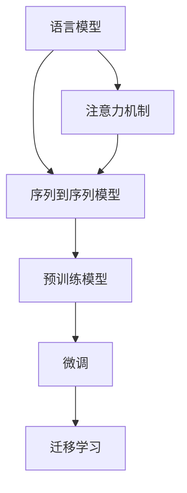

                 

# 深度学习在自然语言问答系统中的应用

> 关键词：深度学习, 自然语言问答系统, 语言模型, 注意力机制, 序列到序列模型, 预训练模型, 微调

## 1. 背景介绍

### 1.1 问题由来
随着人工智能技术的不断发展，自然语言问答系统（Natural Language Question Answering, NLQA）成为了AI研究的热点之一。NLQA系统通过理解用户的自然语言问题，自动查找并回答相关知识库中的信息，使得人机交互更加自然流畅。在传统基于规则的问答系统基础上，深度学习方法，特别是序列到序列（Seq2Seq）模型，因其出色的性能和灵活性，在NLQA领域得到了广泛应用。

### 1.2 问题核心关键点
深度学习在NLQA系统中的应用，主要包括以下几个方面：
- **语言模型的建立**：基于深度学习模型，尤其是循环神经网络（RNN）、长短时记忆网络（LSTM）、门控循环单元（GRU）等，可以建立对语言规律的深刻理解，从而实现自然语言的理解和生成。
- **注意力机制的引入**：通过注意力机制（Attention Mechanism），系统能够根据问题的上下文信息，有选择地关注知识库中的相关信息，提升问答的准确性和相关性。
- **序列到序列模型**：利用Seq2Seq模型，系统可以将自然语言问题映射为查询向量，通过检索知识库中的文本，并生成自然语言答案。
- **预训练模型的应用**：通过在大规模语料上预训练的语言模型，如BERT、GPT-3等，可以获得更加通用的语言表示，从而提升模型在特定任务上的表现。
- **微调与迁移学习**：基于预训练模型，通过微调（Fine-Tuning）或迁移学习（Transfer Learning）方法，针对具体应用场景优化模型性能。

## 2. 核心概念与联系

### 2.1 核心概念概述

为更好地理解深度学习在NLQA系统中的应用，本节将介绍几个关键概念：

- **语言模型**：用于描述语言的概率分布，通过学习语言数据，能够预测一个词或句子序列的概率，从而实现自然语言的理解和生成。
- **注意力机制**：在处理序列数据时，通过动态计算不同位置对结果的贡献度，赋予模型对关键信息的加权处理能力。
- **序列到序列模型**：用于将一个序列（如自然语言问题）映射到另一个序列（如答案）的模型，广泛应用于翻译、摘要、问答等任务。
- **预训练模型**：在大规模无标签数据上进行预训练，学习通用的语言表示，提升模型在特定任务上的泛化能力。
- **微调**：通过在预训练模型的基础上，使用下游任务的少量标注数据，优化模型在特定任务上的性能。
- **迁移学习**：将在一个任务上学习到的知识，迁移到另一个相关任务上，提高模型在新任务上的表现。

这些概念之间相互关联，共同构成了深度学习在NLQA系统中的应用框架。通过理解这些核心概念，我们可以更好地把握深度学习技术在NLQA系统中的工作原理和优化方向。

### 2.2 核心概念原理和架构的 Mermaid 流程图



此图展示了深度学习在NLQA系统中的核心概念及它们之间的联系：
- 语言模型通过学习语言数据，建立语言理解能力。
- 注意力机制使得模型能够关注问题中的关键信息。
- Seq2Seq模型将自然语言问题映射为答案。
- 预训练模型通过在大规模数据上预训练，学习通用的语言表示。
- 微调和迁移学习用于在特定任务上进一步优化模型性能。

## 3. 核心算法原理 & 具体操作步骤

### 3.1 算法原理概述

基于深度学习的NLQA系统，主要通过以下步骤实现问答：
1. **理解问题**：通过语言模型将自然语言问题映射为查询向量。
2. **知识检索**：利用注意力机制在知识库中检索相关文本。
3. **生成答案**：通过Seq2Seq模型，将查询向量映射为答案向量。

这些步骤涉及多个深度学习技术，包括序列建模、注意力机制、序列到序列模型等。下面将详细探讨这些技术的原理和具体操作步骤。

### 3.2 算法步骤详解

#### 3.2.1 语言模型的建立

语言模型用于预测文本的概率分布，基于深度学习模型可以构建高效的文本生成和理解模型。这里以基于RNN的语言模型为例，介绍其构建步骤：

1. **模型设计**：定义一个RNN网络，包括输入层、隐藏层和输出层。输入为词汇序列，输出为下一个词汇的概率分布。
2. **参数初始化**：对网络参数进行随机初始化。
3. **前向传播**：将输入序列送入网络，计算隐藏状态和输出概率。
4. **后向传播**：计算损失函数（如交叉熵损失），更新模型参数。
5. **梯度裁剪**：防止梯度爆炸或消失，确保训练过程稳定。

#### 3.2.2 注意力机制的引入

注意力机制可以动态调整模型对输入序列中不同位置的关注度，使得模型能够根据问题的上下文信息，有选择地关注关键信息。以Transformer模型为例，其注意力机制的计算步骤如下：

1. **计算查询、键、值矩阵**：将输入序列转换为查询向量、键向量、值向量。
2. **计算注意力权重**：通过矩阵乘法和softmax函数计算每个位置的注意力权重。
3. **计算加权值**：将注意力权重与值向量相乘，得到加权值。
4. **输出结果**：将所有加权值相加，得到最终输出。

#### 3.2.3 序列到序列模型的构建

序列到序列模型将一个序列映射到另一个序列，广泛应用于机器翻译、问答系统等任务。以Seq2Seq模型为例，其构建步骤如下：

1. **编码器设计**：定义一个RNN网络作为编码器，将输入序列映射为查询向量。
2. **解码器设计**：定义另一个RNN网络作为解码器，接收查询向量，生成答案序列。
3. **连接器设计**：连接编码器和解码器，将查询向量作为解码器的初始状态。
4. **前向传播**：将输入序列送入编码器，将查询向量送入解码器。
5. **后向传播**：计算损失函数，更新模型参数。
6. **解码**：通过解码器生成答案序列，并进行解码输出。

### 3.3 算法优缺点

深度学习在NLQA系统中的应用具有以下优点：
- **高效性**：深度学习模型能够自动学习语言规律，无需手动设计和提取特征，提升了模型的泛化能力和鲁棒性。
- **灵活性**：深度学习模型可以通过不断微调和迁移学习，适应不同的应用场景和任务需求。
- **准确性**：深度学习模型在大规模数据上的预训练，使得其能够学习到丰富的语言表示，提升了模型在问答任务中的准确性和相关性。

同时，深度学习在NLQA系统中的应用也存在一些局限性：
- **计算资源需求高**：深度学习模型参数量较大，训练和推理过程需要大量计算资源。
- **模型复杂度高**：深度学习模型结构复杂，调试和优化难度较大。
- **泛化能力受限**：深度学习模型在处理少样本或小规模数据时，泛化能力有限。
- **可解释性差**：深度学习模型通常被视为“黑盒”，难以解释其内部工作机制和决策逻辑。

### 3.4 算法应用领域

深度学习在NLQA系统中的应用广泛，以下列举几个典型的应用场景：

- **问答系统**：通过理解自然语言问题，从知识库中检索并生成答案。广泛应用于智能客服、搜索引擎、问答助手等。
- **信息抽取**：从文本中自动抽取关键信息，如实体识别、关系抽取等。
- **文本生成**：根据用户输入，生成自然语言文本，如自动摘要、自动翻译等。
- **情感分析**：分析文本情感倾向，进行舆情监测、用户反馈分析等。
- **知识图谱构建**：构建和维护知识图谱，为NLQA系统提供知识支撑。

## 4. 数学模型和公式 & 详细讲解 & 举例说明

### 4.1 数学模型构建

假设有一个问答系统，基于Seq2Seq模型，其查询为 $q$，知识库中的文本为 $d$，答案为 $a$。其数学模型可以表示为：

$$
p(a|q, d) = \prod_{i=1}^{T_a} p(a_i|a_{i-1}, q, d)
$$

其中 $T_a$ 为答案序列的长度，$p(a_i|a_{i-1}, q, d)$ 表示在给定前一个答案 $a_{i-1}$、查询 $q$ 和知识库 $d$ 的情况下，下一个答案 $a_i$ 的条件概率。

### 4.2 公式推导过程

以Seq2Seq模型为例，其注意力机制的推导如下：

1. **查询向量计算**：
   $$
   q = \mathrm{Encoder}(x)
   $$

2. **键值矩阵计算**：
   $$
   K = \mathrm{Decoder}(y_1)
   $$

3. **注意力权重计算**：
   $$
   \alpha_{ij} = \frac{\exp(\mathrm{softmax}(q^TK_i))}{\sum_k \exp(\mathrm{softmax}(q^TK_k))}
   $$

4. **加权值计算**：
   $$
   V_i = \sum_j \alpha_{ij} K_j
   $$

5. **输出结果计算**：
   $$
   y_i = \mathrm{Attention}(V_i, K)
   $$

### 4.3 案例分析与讲解

以Google的BERT模型为例，其基于Transformer架构，通过在大规模语料上进行预训练，学习通用的语言表示。在微调阶段，通过使用下游任务的少量标注数据，进一步优化模型性能。例如，在问答任务中，可以微调BERT模型，使其能够更好地理解自然语言问题，并从知识库中检索相关答案。

## 5. 项目实践：代码实例和详细解释说明

### 5.1 开发环境搭建

在进行NLQA系统开发前，需要准备开发环境。以下是使用Python进行TensorFlow开发的环境配置流程：

1. 安装Anaconda：从官网下载并安装Anaconda，用于创建独立的Python环境。
2. 创建并激活虚拟环境：
   ```bash
   conda create -n tf-env python=3.8 
   conda activate tf-env
   ```

3. 安装TensorFlow：根据CUDA版本，从官网获取对应的安装命令。例如：
   ```bash
   pip install tensorflow-gpu==2.6
   ```

4. 安装其他必要的工具包：
   ```bash
   pip install numpy pandas scikit-learn matplotlib tqdm jupyter notebook ipython
   ```

5. 安装Transformers库：
   ```bash
   pip install transformers
   ```

完成上述步骤后，即可在`tf-env`环境中开始项目开发。

### 5.2 源代码详细实现

下面以问答系统为例，给出使用TensorFlow和Transformers库对BERT模型进行微调的Python代码实现。

首先，定义问答系统的数据处理函数：

```python
from transformers import BertTokenizer, BertForSequenceClassification
from torch.utils.data import Dataset, DataLoader
import torch
import numpy as np

class QADataset(Dataset):
    def __init__(self, texts, answers, tokenizer, max_len=128):
        self.texts = texts
        self.answers = answers
        self.tokenizer = tokenizer
        self.max_len = max_len
        
    def __len__(self):
        return len(self.texts)
    
    def __getitem__(self, item):
        text = self.texts[item]
        answer = self.answers[item]
        
        encoding = self.tokenizer(text, return_tensors='pt', max_length=self.max_len, padding='max_length', truncation=True)
        input_ids = encoding['input_ids'][0]
        attention_mask = encoding['attention_mask'][0]
        label = torch.tensor(answer, dtype=torch.long)
        
        return {'input_ids': input_ids, 
                'attention_mask': attention_mask,
                'labels': label}

# 创建dataset
tokenizer = BertTokenizer.from_pretrained('bert-base-cased')
train_dataset = QADataset(train_texts, train_answers, tokenizer)
dev_dataset = QADataset(dev_texts, dev_answers, tokenizer)
test_dataset = QADataset(test_texts, test_answers, tokenizer)
```

然后，定义模型和优化器：

```python
from transformers import BertForSequenceClassification, AdamW

model = BertForSequenceClassification.from_pretrained('bert-base-cased', num_labels=2)

optimizer = AdamW(model.parameters(), lr=2e-5)
```

接着，定义训练和评估函数：

```python
from tqdm import tqdm

device = torch.device('cuda') if torch.cuda.is_available() else torch.device('cpu')
model.to(device)

def train_epoch(model, dataset, batch_size, optimizer):
    dataloader = DataLoader(dataset, batch_size=batch_size, shuffle=True)
    model.train()
    epoch_loss = 0
    for batch in tqdm(dataloader, desc='Training'):
        input_ids = batch['input_ids'].to(device)
        attention_mask = batch['attention_mask'].to(device)
        labels = batch['labels'].to(device)
        model.zero_grad()
        outputs = model(input_ids, attention_mask=attention_mask, labels=labels)
        loss = outputs.loss
        epoch_loss += loss.item()
        loss.backward()
        optimizer.step()
    return epoch_loss / len(dataloader)

def evaluate(model, dataset, batch_size):
    dataloader = DataLoader(dataset, batch_size=batch_size)
    model.eval()
    preds, labels = [], []
    with torch.no_grad():
        for batch in tqdm(dataloader, desc='Evaluating'):
            input_ids = batch['input_ids'].to(device)
            attention_mask = batch['attention_mask'].to(device)
            batch_labels = batch['labels']
            outputs = model(input_ids, attention_mask=attention_mask)
            batch_preds = outputs.logits.argmax(dim=2).to('cpu').tolist()
            batch_labels = batch_labels.to('cpu').tolist()
            for pred, label in zip(batch_preds, batch_labels):
                preds.append(pred)
                labels.append(label)
                
    print(np.mean(preds == labels))
```

最后，启动训练流程并在测试集上评估：

```python
epochs = 5
batch_size = 16

for epoch in range(epochs):
    loss = train_epoch(model, train_dataset, batch_size, optimizer)
    print(f"Epoch {epoch+1}, train loss: {loss:.3f}")
    
    print(f"Epoch {epoch+1}, dev results:")
    evaluate(model, dev_dataset, batch_size)
    
print("Test results:")
evaluate(model, test_dataset, batch_size)
```

以上就是使用TensorFlow和Transformers库对BERT模型进行问答任务微调的完整代码实现。可以看到，得益于Transformers库的强大封装，我们可以用相对简洁的代码完成BERT模型的加载和微调。

### 5.3 代码解读与分析

让我们再详细解读一下关键代码的实现细节：

**QADataset类**：
- `__init__`方法：初始化文本、答案、分词器等关键组件。
- `__len__`方法：返回数据集的样本数量。
- `__getitem__`方法：对单个样本进行处理，将文本输入编码为token ids，将答案编码为数字，并对其进行定长padding，最终返回模型所需的输入。

**模型训练和评估函数**：
- `train_epoch`函数：对数据以批为单位进行迭代，在每个批次上前向传播计算loss并反向传播更新模型参数，最后返回该epoch的平均loss。
- `evaluate`函数：与训练类似，不同点在于不更新模型参数，并在每个batch结束后将预测和标签结果存储下来，最后使用numpy计算准确率。

**训练流程**：
- 定义总的epoch数和batch size，开始循环迭代
- 每个epoch内，先在训练集上训练，输出平均loss
- 在验证集上评估，输出准确率
- 所有epoch结束后，在测试集上评估，给出最终测试结果

可以看到，TensorFlow配合Transformers库使得BERT微调的代码实现变得简洁高效。开发者可以将更多精力放在数据处理、模型改进等高层逻辑上，而不必过多关注底层的实现细节。

当然，工业级的系统实现还需考虑更多因素，如模型的保存和部署、超参数的自动搜索、更灵活的任务适配层等。但核心的微调范式基本与此类似。

## 6. 实际应用场景

### 6.1 智能客服系统

基于深度学习的NLQA系统，可以广泛应用于智能客服系统的构建。传统客服往往需要配备大量人力，高峰期响应缓慢，且一致性和专业性难以保证。而使用NLQA系统，可以7x24小时不间断服务，快速响应客户咨询，用自然流畅的语言解答各类常见问题。

在技术实现上，可以收集企业内部的历史客服对话记录，将问题和最佳答复构建成监督数据，在此基础上对预训练模型进行微调。微调后的NLQA系统能够自动理解用户意图，匹配最合适的答案模板进行回复。对于客户提出的新问题，还可以接入检索系统实时搜索相关内容，动态组织生成回答。如此构建的智能客服系统，能大幅提升客户咨询体验和问题解决效率。

### 6.2 金融舆情监测

金融机构需要实时监测市场舆论动向，以便及时应对负面信息传播，规避金融风险。传统的人工监测方式成本高、效率低，难以应对网络时代海量信息爆发的挑战。基于深度学习的NLQA系统，可以自动理解金融新闻、报道、评论等文本内容，判断文本情感倾向，监测市场舆情变化，提供及时的风险预警。

具体而言，可以收集金融领域相关的新闻、报道、评论等文本数据，并对其进行情感标注。在此基础上对预训练模型进行微调，使其能够自动判断文本属于正面、负面或中性情感。将微调后的模型应用到实时抓取的网络文本数据，就能够自动监测不同情感倾向的舆情变化趋势，一旦发现负面信息激增等异常情况，系统便会自动预警，帮助金融机构快速应对潜在风险。

### 6.3 个性化推荐系统

当前的推荐系统往往只依赖用户的历史行为数据进行物品推荐，无法深入理解用户的真实兴趣偏好。基于深度学习的NLQA系统，可以进一步挖掘用户的行为背后的语义信息，从而提供更精准、多样的推荐内容。

在实践中，可以收集用户浏览、点击、评论、分享等行为数据，提取和用户交互的物品标题、描述、标签等文本内容。将文本内容作为模型输入，用户的后续行为（如是否点击、购买等）作为监督信号，在此基础上微调预训练语言模型。微调后的模型能够从文本内容中准确把握用户的兴趣点。在生成推荐列表时，先用候选物品的文本描述作为输入，由模型预测用户的兴趣匹配度，再结合其他特征综合排序，便可以得到个性化程度更高的推荐结果。

### 6.4 未来应用展望

随着深度学习技术的不断发展，基于NLQA系统的应用场景将更加广泛。

在智慧医疗领域，基于NLQA的问答系统可以辅助医生诊疗，提升医疗服务的智能化水平，加速新药开发进程。

在智能教育领域，NLQA系统可应用于作业批改、学情分析、知识推荐等方面，因材施教，促进教育公平，提高教学质量。

在智慧城市治理中，NLQA系统可以用于城市事件监测、舆情分析、应急指挥等环节，提高城市管理的自动化和智能化水平，构建更安全、高效的未来城市。

此外，在企业生产、社会治理、文娱传媒等众多领域，基于NLQA的系统也将不断涌现，为传统行业数字化转型升级提供新的技术路径。相信随着技术的日益成熟，NLQA系统必将在更广阔的应用领域大放异彩，深刻影响人类的生产生活方式。

## 7. 工具和资源推荐

### 7.1 学习资源推荐

为了帮助开发者系统掌握深度学习在NLQA系统中的应用，这里推荐一些优质的学习资源：

1. 《深度学习》书籍：由Ian Goodfellow等作者编写，系统介绍深度学习的基本理论和算法。
2. 《自然语言处理》课程：斯坦福大学开设的NLP课程，涵盖深度学习在NLP中的应用，适合入门学习。
3. 《NLQA系统设计与实现》书籍：详细介绍了NLQA系统的设计、实现及应用，适合进阶学习。
4. Arxiv论文库：最新的深度学习研究成果汇集地，可以获取前沿的NLQA研究论文。
5. Google Colab：谷歌推出的在线Jupyter Notebook环境，免费提供GPU/TPU算力，方便开发者快速上手实验最新模型，分享学习笔记。

通过对这些资源的学习实践，相信你一定能够快速掌握深度学习在NLQA系统中的精髓，并用于解决实际的NLP问题。

### 7.2 开发工具推荐

高效的开发离不开优秀的工具支持。以下是几款用于深度学习在NLQA系统开发的常用工具：

1. TensorFlow：由Google主导开发的开源深度学习框架，生产部署方便，适合大规模工程应用。
2. PyTorch：基于Python的开源深度学习框架，灵活性高，适合快速迭代研究。
3. Transformers库：HuggingFace开发的NLP工具库，集成了众多SOTA语言模型，支持多种深度学习框架。
4. Weights & Biases：模型训练的实验跟踪工具，可以记录和可视化模型训练过程中的各项指标，方便对比和调优。
5. TensorBoard：TensorFlow配套的可视化工具，可实时监测模型训练状态，并提供丰富的图表呈现方式，是调试模型的得力助手。

合理利用这些工具，可以显著提升深度学习在NLQA系统开发和实验的效率，加快创新迭代的步伐。

### 7.3 相关论文推荐

深度学习在NLQA系统中的应用源于学界的持续研究。以下是几篇奠基性的相关论文，推荐阅读：

1. "Attention is All You Need"（Transformer原论文）：提出了Transformer结构，开启了深度学习在NLP领域的研究新篇章。
2. "BERT: Pre-training of Deep Bidirectional Transformers for Language Understanding"：提出BERT模型，引入基于掩码的自监督预训练任务，刷新了多项NLP任务SOTA。
3. "Towards Data-Efficient Representation Learning with Unsupervised Learning Techniques"：提出GPT-3模型，展示了大规模语言模型的强大zero-shot学习能力。
4. "Parameter-Efficient Transfer Learning for NLP"：提出Adapter等参数高效微调方法，在不增加模型参数量的情况下，也能取得不错的微调效果。
5. "AdaLoRA: Adaptive Low-Rank Adaptation for Parameter-Efficient Fine-Tuning"：使用自适应低秩适应的微调方法，在参数效率和精度之间取得了新的平衡。

这些论文代表了大深度学习在NLQA系统中的发展脉络。通过学习这些前沿成果，可以帮助研究者把握学科前进方向，激发更多的创新灵感。

## 8. 总结：未来发展趋势与挑战

### 8.1 总结

本文对深度学习在NLQA系统中的应用进行了全面系统的介绍。首先阐述了深度学习在NLQA系统中的背景和意义，明确了其核心技术组件及之间的联系。其次，从原理到实践，详细讲解了语言模型、注意力机制、Seq2Seq模型的构建步骤和具体操作。同时，本文还探讨了深度学习在NLQA系统中的优缺点和应用领域，通过代码实例展示了深度学习在问答系统中的实现过程。

通过本文的系统梳理，可以看到，深度学习在NLQA系统中的应用已经成为NLP领域的重要范式，极大地提升了问答系统的智能化水平。未来，随着深度学习技术的不断进步，NLQA系统将有望在更多领域得到应用，为智能交互带来革命性影响。

### 8.2 未来发展趋势

展望未来，深度学习在NLQA系统中的应用将呈现以下几个发展趋势：

1. **多模态融合**：深度学习模型将逐步扩展到多模态数据的融合，如视觉、语音、文本的协同建模，提升系统的感知能力和理解能力。
2. **知识图谱的应用**：基于知识图谱构建的NLQA系统，能够提供更准确、全面的知识检索和推理能力，提升系统的智能水平。
3. **自监督学习的广泛应用**：通过自监督学习任务，如掩码语言模型、句子相似性等，深度学习模型能够在大规模无标签数据上进行预训练，提高模型的泛化能力和鲁棒性。
4. **少样本和零样本学习**：基于深度学习模型的零样本和少样本学习能力，NLQA系统能够更灵活地应对新问题和新领域。
5. **可解释性和可控性**：随着深度学习模型的复杂性增加，可解释性和可控性成为关键需求，研究者将探索更多技术手段，提高模型的透明性和可解释性。

这些趋势凸显了深度学习在NLQA系统中的广阔前景。未来深度学习在NLP领域的应用将更加多样和深入，为构建更加智能和可控的问答系统铺平道路。

### 8.3 面临的挑战

尽管深度学习在NLQA系统中的应用已经取得了显著进展，但在迈向更加智能化、普适化应用的过程中，仍面临诸多挑战：

1. **计算资源需求高**：深度学习模型参数量较大，训练和推理过程需要大量计算资源，这对于硬件设备提出了较高要求。
2. **模型鲁棒性不足**：当前深度学习模型在处理少样本或小规模数据时，泛化能力有限，容易受到数据分布变化的影响。
3. **可解释性差**：深度学习模型通常被视为“黑盒”，难以解释其内部工作机制和决策逻辑，这对医疗、金融等高风险应用尤为重要。
4. **伦理和安全性问题**：深度学习模型可能学习到有偏见、有害的信息，如何避免模型的有害输出，确保系统的安全性，是一个重要挑战。
5. **知识整合能力不足**：当前深度学习模型往往局限于文本数据，难以灵活吸收和运用更广泛的先验知识，如何加强与其他知识库的整合，提升系统的智能水平，是一个待解决的问题。

正视这些挑战，积极应对并寻求突破，将是大深度学习在NLQA系统中的必由之路。相信随着学界和产业界的共同努力，这些挑战终将一一被克服，深度学习在NLQA系统中的应用必将在构建安全、可靠、可解释、可控的智能系统中发挥越来越重要的作用。

### 8.4 研究展望

未来深度学习在NLQA系统中的应用研究，需要在以下几个方面寻求新的突破：

1. **知识表示和推理**：研究更加复杂和高效的知识表示和推理方法，提升系统的智能水平和适应性。
2. **因果推理和可解释性**：探索基于因果推理和可解释性技术，提高模型的透明性和可信度。
3. **模型压缩和加速**：开发更加高效和轻量级的深度学习模型，提升系统的计算效率和资源利用率。
4. **自监督学习**：研究更加多样和高效的自监督学习任务，提升模型的泛化能力和鲁棒性。
5. **多模态数据融合**：探索多模态数据的协同建模方法，提升系统的感知能力和理解能力。

这些研究方向的探索，必将引领深度学习在NLQA系统中的应用迈向更高的台阶，为构建安全、可靠、可解释、可控的智能系统铺平道路。面向未来，深度学习在NLQA系统中的应用需要与其他人工智能技术进行更深入的融合，如知识表示、因果推理、强化学习等，多路径协同发力，共同推动自然语言理解和智能交互系统的进步。

## 9. 附录：常见问题与解答

**Q1：深度学习在NLQA系统中是否只适用于大规模数据集？**

A: 深度学习在NLQA系统中可以适用于不同规模的数据集，但数据量越大，模型的性能通常越好。对于大规模数据集，深度学习模型能够更好地学习到语言的通用表示，提升系统的泛化能力和鲁棒性。对于小规模数据集，可以通过数据增强、迁移学习等方法提升模型的性能。

**Q2：微调深度学习模型时，如何平衡参数量和模型性能？**

A: 微调深度学习模型时，可以通过以下方法平衡参数量和模型性能：
1. 参数高效微调：只调整少量模型参数，保持大部分预训练参数不变，减少过拟合风险。
2. 特征选择：选择合适的特征进行微调，减少不必要参数的更新。
3. 正则化：使用L2正则、Dropout等技术，防止模型过度拟合。
4. 知识图谱：利用知识图谱中的结构化知识，提升模型的泛化能力和鲁棒性。

**Q3：如何在深度学习模型中实现知识图谱的应用？**

A: 在深度学习模型中实现知识图谱的应用，可以通过以下方法：
1. 知识嵌入：将知识图谱中的实体和关系映射为向量，作为模型的输入。
2. 联合训练：将知识图谱中的结构化知识与文本数据联合训练，提升模型的推理能力和泛化能力。
3. 图网络：利用图网络技术，学习知识图谱中的结构化知识，提升模型的感知能力。

**Q4：深度学习在NLQA系统中是否适用于所有任务？**

A: 深度学习在NLQA系统中可以适用于大多数NLP任务，包括问答、信息抽取、文本生成等。但对于一些特定领域的任务，如医学、法律等，可能需要更多的领域知识，可以考虑在特定领域语料上进一步预训练模型，再进行微调。

**Q5：深度学习模型在处理多模态数据时，需要注意哪些问题？**

A: 深度学习模型在处理多模态数据时，需要注意以下问题：
1. 数据融合：如何有效融合不同模态的数据，提升系统的感知能力和理解能力。
2. 模型设计：如何设计适合多模态数据处理的深度学习模型，如多模态Seq2Seq模型、多模态注意力机制等。
3. 数据标注：如何标注多模态数据，确保数据的丰富性和多样性。
4. 模型训练：如何在多模态数据上进行训练，提升模型的泛化能力和鲁棒性。

通过合理应对这些挑战，深度学习在多模态NLQA系统中的应用将更加广泛和深入，为构建更加智能和可控的问答系统铺平道路。

