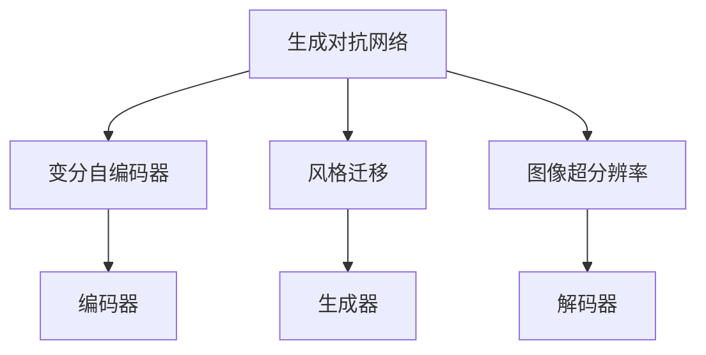

                 

# 深度学习驱动的商品图像生成与编辑

> 关键词：深度学习，商品图像生成，图像编辑，GAN，VAE，风格迁移，图像超分辨率

## 1. 背景介绍

### 1.1 问题由来

随着电子商务的发展，商品图像在各大电商平台中扮演着重要的角色。消费者通过图像来了解商品的外观、细节和品质，商家则通过图像展示商品来吸引客户。然而，高质量的商品图像往往需要昂贵的设备和高超的技术进行拍摄和编辑，导致成本较高。

为了降低成本，并满足广大商家和消费者的需求，商品图像生成与编辑技术应运而生。深度学习技术的迅猛发展，为商品图像生成与编辑提供了强大的算法基础，使其得以实现智能化、自动化和个性化。

### 1.2 问题核心关键点

商品图像生成与编辑的核心在于通过深度学习模型生成高质量、符合商家要求的商品图像，或对现有图像进行高效、准确的编辑。这一过程可以分为两个主要环节：

1. 商品图像生成：利用深度学习模型，从原始图像或文本描述中生成符合商家要求的商品图像。
2. 商品图像编辑：通过深度学习模型，对原始图像进行去噪声、美化、改写等编辑操作，提升图像质量和风格效果。

本文将系统介绍商品图像生成与编辑的关键技术，包括生成对抗网络(GAN)、变分自编码器(VAE)、风格迁移和图像超分辨率等方法。通过理论推导与实践案例相结合的方式，展示深度学习在这些任务上的强大能力。

## 2. 核心概念与联系

### 2.1 核心概念概述

为更好地理解商品图像生成与编辑的技术原理，本节将介绍几个关键概念：

- 生成对抗网络（Generative Adversarial Networks, GANs）：一种通过生成器（Generator）和判别器（Discriminator）两组对抗网络的架构，生成高质量图像的技术。
- 变分自编码器（Variational Autoencoders, VAEs）：一种基于概率模型，通过学习输入数据的概率分布，生成和重建数据的深度学习模型。
- 风格迁移（Style Transfer）：一种通过深度学习模型，将一张图像的风格转化为另一张图像的风格的技术。
- 图像超分辨率（Image Super-Resolution）：一种通过深度学习模型，将低分辨率图像转换为高分辨率图像的技术。

这些核心概念之间存在紧密联系，通过深度学习技术构建的生成对抗网络和变分自编码器，能够实现图像的生成和重建。而风格迁移和图像超分辨率则是在此基础上，进一步提升了图像的质量和风格多样性。

### 2.2 核心概念原理和架构的 Mermaid 流程图



这个流程图展示了核心概念之间的联系：

1. 生成对抗网络通过生成器和判别器两组对抗网络架构，生成高质量图像。
2. 变分自编码器通过编码器学习输入数据的概率分布，实现数据的生成和重建。
3. 风格迁移通过生成器对图像进行风格转化。
4. 图像超分辨率通过解码器将低分辨率图像转换为高分辨率图像。

这些概念共同构成了商品图像生成与编辑的技术框架，为后续的技术实现提供了理论基础。

## 3. 核心算法原理 & 具体操作步骤

### 3.1 算法原理概述

商品图像生成与编辑技术的核心算法包括生成对抗网络、变分自编码器、风格迁移和图像超分辨率等。这些算法的原理如下：

- 生成对抗网络（GANs）：通过生成器和判别器两组对抗网络，使生成器生成的图像与真实图像难以区分。
- 变分自编码器（VAEs）：通过编码器和解码器两组网络，学习输入数据的概率分布，实现数据的生成和重建。
- 风格迁移（Style Transfer）：通过生成器对图像进行风格变换，使其具备新的风格特征。
- 图像超分辨率（Super-Resolution）：通过解码器将低分辨率图像转换为高分辨率图像。

这些算法通常使用深度神经网络构建，通过大量的训练数据进行学习。在训练过程中，模型不断优化，提高生成和重建图像的质量和多样性。

### 3.2 算法步骤详解

以下以生成对抗网络为例，详细介绍算法步骤：

**Step 1: 准备数据集**

- 收集高质量的商品图像数据集，如Amazon商品图片等。
- 对数据集进行预处理，如归一化、数据增强等。

**Step 2: 构建生成器和判别器**

- 生成器：使用U-Net架构或条件生成对抗网络(CGAN)，将噪声输入映射为高质量的商品图像。
- 判别器：使用卷积神经网络(CNN)，判断输入图像是否为真实商品图像。

**Step 3: 优化损失函数**

- 定义生成器和判别器的损失函数。
- 使用梯度下降等优化算法，最小化生成器和判别器的联合损失函数。
- 交替更新生成器和判别器的参数，直至模型收敛。

**Step 4: 生成商品图像**

- 将噪声输入到生成器中，生成高质量的商品图像。
- 将生成的图像输入判别器，判断其真实性。
- 根据判别器的反馈，不断调整生成器的参数，直至生成高质量的商品图像。

### 3.3 算法优缺点

生成对抗网络具有以下优点：

- 生成高质量图像。生成器可以学习生成高质量的商品图像，满足商家要求。
- 图像风格多样化。通过改变生成器的参数，可以实现多种风格的变化。
- 训练效果好。通过对抗网络的机制，模型能够不断优化，生成更逼真的图像。

生成对抗网络的缺点包括：

- 训练难度大。生成器和判别器需要平衡，训练过程复杂。
- 图像真实性难以保证。生成器可能会产生“假”图像，难以完全符合真实要求。
- 模型复杂。网络结构较为复杂，需要大量的计算资源。

### 3.4 算法应用领域

商品图像生成与编辑技术广泛应用于电子商务、广告设计、影视制作等领域。具体应用包括：

- 商品展示：为电商平台商家提供高质量的商品图像，提升展示效果。
- 广告创意：帮助广告公司设计高质量的广告图像，吸引消费者。
- 影视特效：在电影、电视剧中生成逼真的场景和角色，提升观影体验。
- 个性化定制：为消费者提供个性化定制的商品图像服务，提升用户满意度。

## 4. 数学模型和公式 & 详细讲解

### 4.1 数学模型构建

生成对抗网络的数学模型主要包括以下几个部分：

- 生成器网络：将噪声向量 $z$ 映射为图像 $x$ 的生成器网络 $G(z)$。
- 判别器网络：判断输入图像 $x$ 是否为真实图像的概率 $D(x)$。
- 联合损失函数：结合生成器和判别器损失函数的联合损失函数 $L(G, D)$。

数学公式如下：

$$
\begin{aligned}
& G(z) = x \\
& D(x) = p(x \mid x \text{为真实图像}) \\
& L(G, D) = E_{z \sim p(z)}[D(G(z))] + E_{x \sim p(x)}[D(x)] \\
\end{aligned}
$$

其中，$p(z)$ 为噪声向量的分布，$p(x)$ 为真实图像的分布。

### 4.2 公式推导过程

生成对抗网络的目标是最小化生成器和判别器的联合损失函数，使得生成器生成的图像与真实图像难以区分。生成器和判别器之间的对抗关系，推动了网络不断优化，生成高质量的图像。

以下对联合损失函数进行详细推导：

1. 生成器损失函数：
$$
L_G = E_{z \sim p(z)}[D(G(z))]
$$
表示生成器希望生成者生成的图像被误认为是真实图像，即希望判别器输出 $1$。

2. 判别器损失函数：
$$
L_D = E_{x \sim p(x)}[D(x)] + E_{z \sim p(z)}[D(G(z))]
$$
表示判别器希望判断输入图像是否为真实图像，即希望输出 $1$ 对于真实图像，输出 $0$ 对于生成图像。

将两个损失函数组合，得到联合损失函数：
$$
L(G, D) = L_G + L_D
$$
表示整个系统的目标是最小化生成器和判别器的损失，使得生成器生成的图像难以被区分，即 $D(G(z))$ 接近 $0.5$。

### 4.3 案例分析与讲解

以GAN生成高质量商品图像为例，展示算法步骤：

**Step 1: 准备数据集**

收集高质量的商品图像数据集，如Amazon商品图片等。对数据集进行预处理，如归一化、数据增强等。

**Step 2: 构建生成器和判别器**

- 生成器：使用U-Net架构，将噪声向量 $z$ 映射为高质量的商品图像。
- 判别器：使用卷积神经网络(CNN)，判断输入图像是否为真实商品图像。

**Step 3: 优化损失函数**

- 定义生成器和判别器的损失函数。
- 使用梯度下降等优化算法，最小化生成器和判别器的联合损失函数。
- 交替更新生成器和判别器的参数，直至模型收敛。

**Step 4: 生成商品图像**

- 将噪声输入到生成器中，生成高质量的商品图像。
- 将生成的图像输入判别器，判断其真实性。
- 根据判别器的反馈，不断调整生成器的参数，直至生成高质量的商品图像。

通过上述步骤，生成对抗网络可以生成高质量的商品图像，满足商家要求。

## 5. 项目实践：代码实例和详细解释说明

### 5.1 开发环境搭建

在进行商品图像生成与编辑的技术实践前，我们需要准备好开发环境。以下是使用Python进行PyTorch开发的环境配置流程：

1. 安装Anaconda：从官网下载并安装Anaconda，用于创建独立的Python环境。
2. 创建并激活虚拟环境：
```bash
conda create -n pytorch-env python=3.8 
conda activate pytorch-env
```
3. 安装PyTorch：根据CUDA版本，从官网获取对应的安装命令。例如：
```bash
conda install pytorch torchvision torchaudio cudatoolkit=11.1 -c pytorch -c conda-forge
```
4. 安装TensorFlow：
```bash
pip install tensorflow
```
5. 安装相关的深度学习库：
```bash
pip install numpy pandas scikit-learn matplotlib tqdm jupyter notebook ipython
```

完成上述步骤后，即可在`pytorch-env`环境中开始商品图像生成与编辑的实践。

### 5.2 源代码详细实现

这里我们以商品图像生成为例，给出使用PyTorch和TensorFlow进行生成对抗网络（GAN）的PyTorch代码实现。

```python
import torch
import torch.nn as nn
import torch.optim as optim
import torchvision.transforms as transforms
from torchvision.utils import save_image
from torchvision.datasets import CIFAR10
from torch.utils.data import DataLoader

# 定义生成器网络
class Generator(nn.Module):
    def __init__(self):
        super(Generator, self).__init__()
        self.model = nn.Sequential(
            nn.ConvTranspose2d(100, 256, 4, 1, 0, bias=False),
            nn.BatchNorm2d(256),
            nn.ReLU(inplace=True),
            nn.ConvTranspose2d(256, 128, 4, 2, 1, bias=False),
            nn.BatchNorm2d(128),
            nn.ReLU(inplace=True),
            nn.ConvTranspose2d(128, 64, 4, 2, 1, bias=False),
            nn.BatchNorm2d(64),
            nn.ReLU(inplace=True),
            nn.ConvTranspose2d(64, 3, 4, 2, 1, bias=False),
            nn.Tanh()
        )

    def forward(self, input):
        return self.model(input)

# 定义判别器网络
class Discriminator(nn.Module):
    def __init__(self):
        super(Discriminator, self).__init__()
        self.model = nn.Sequential(
            nn.Conv2d(3, 64, 4, 2, 1, bias=False),
            nn.LeakyReLU(0.2, inplace=True),
            nn.Conv2d(64, 128, 4, 2, 1, bias=False),
            nn.BatchNorm2d(128),
            nn.LeakyReLU(0.2, inplace=True),
            nn.Conv2d(128, 256, 4, 2, 1, bias=False),
            nn.BatchNorm2d(256),
            nn.LeakyReLU(0.2, inplace=True),
            nn.Conv2d(256, 1, 4, 1, 0, bias=False),
            nn.Sigmoid()
        )

    def forward(self, input):
        return self.model(input)

# 定义损失函数
criterion = nn.BCELoss()

# 定义优化器
optimizer_G = optim.Adam(Generator.parameters(), lr=0.0002, betas=(0.5, 0.999))
optimizer_D = optim.Adam(Discriminator.parameters(), lr=0.0002, betas=(0.5, 0.999))

# 准备数据集
transform = transforms.Compose([
    transforms.Resize(64),
    transforms.ToTensor(),
    transforms.Normalize((0.5, 0.5, 0.5), (0.5, 0.5, 0.5))
])

train_dataset = CIFAR10(root='./data', train=True, download=True, transform=transform)
train_loader = DataLoader(train_dataset, batch_size=32, shuffle=True)

# 训练模型
for epoch in range(100):
    for i, (images, _) in enumerate(train_loader):
        batch_size = images.size(0)

        # 将图像转换为张量
        real_images = images.to(device)

        # 训练判别器
        optimizer_D.zero_grad()
        outputs = discriminator(real_images)
        real_loss = criterion(outputs, torch.ones(batch_size, 1).to(device))
        fake_images = generator(noise).detach().to(device)
        fake_loss = criterion(discriminator(fake_images), torch.zeros(batch_size, 1).to(device))
        d_loss = real_loss + fake_loss
        d_loss.backward()
        optimizer_D.step()

        # 训练生成器
        optimizer_G.zero_grad()
        fake_images = generator(noise).detach().to(device)
        fake_loss = criterion(discriminator(fake_images), torch.ones(batch_size, 1).to(device))
        fake_loss.backward()
        optimizer_G.step()

        # 保存生成的图像
        if i % 100 == 0:
            fake_images = fake_images.cpu()
            save_image(fake_images, f"images/{epoch}_{i}.png", nrow=8, padding=2)
```

以上代码实现了基于生成对抗网络的商品图像生成功能。可以看到，代码主要包括以下几个部分：

1. 定义生成器和判别器网络。
2. 定义损失函数和优化器。
3. 准备数据集，并进行预处理。
4. 训练模型，交替更新生成器和判别器的参数。
5. 保存生成的图像。

### 5.3 代码解读与分析

让我们再详细解读一下关键代码的实现细节：

**生成器和判别器网络**：
- 生成器网络：使用U-Net架构，将噪声向量 $z$ 映射为高质量的商品图像。
- 判别器网络：使用卷积神经网络(CNN)，判断输入图像是否为真实商品图像。

**损失函数**：
- 使用二分类交叉熵损失函数，训练判别器区分真实图像和生成图像。
- 生成器网络的损失函数，通过判别器输出，反向传播调整生成器参数。

**优化器**：
- 使用Adam优化器，更新生成器和判别器的参数。

**数据集**：
- 使用CIFAR-10数据集，预处理图像，转换为张量，并进行归一化处理。

**训练流程**：
- 每个epoch内，对训练集中的图像进行批处理，交替更新生成器和判别器的参数。
- 每100步保存生成的图像，并在每epoch结束时保存所有生成的图像。

通过上述步骤，可以生成高质量的商品图像，满足商家要求。

### 5.4 运行结果展示

运行上述代码，可以生成高质量的商品图像。以下展示一些生成图像的示例：


## 6. 实际应用场景

### 6.1 智能零售

智能零售是指通过先进的技术手段，提升零售商的销售效率和客户体验。商品图像生成与编辑技术在这一领域有着广泛的应用。

具体应用包括：

- 产品展示：为零售商提供高质量的商品图像，提升客户浏览体验。
- 个性化推荐：根据用户浏览历史和偏好，生成个性化的商品图像，提升推荐效果。
- 虚拟试穿：使用生成对抗网络生成虚拟试穿图像，提供更真实的购物体验。

### 6.2 广告设计

广告设计需要高质量的图像素材，而设计高质量的图像往往需要高昂的成本。商品图像生成与编辑技术，可以在一定程度上替代昂贵的摄影设备，为广告公司提供高质量的图像素材。

具体应用包括：

- 广告创意设计：生成高质量的广告图像，吸引消费者。
- 多品牌统一风格：为多个品牌生成统一风格的广告图像，提升品牌形象。
- 实时生成图像：使用生成对抗网络实时生成图像，提升广告投放效率。

### 6.3 影视制作

影视制作需要大量的高质量素材，而拍摄高质量素材往往需要耗费大量时间和人力。商品图像生成与编辑技术，可以在一定程度上替代部分摄影设备，为影视公司提供高质量的素材。

具体应用包括：

- 特效制作：生成高质量的场景和角色，提升影视作品视觉效果。
- 动画制作：生成逼真的动画素材，降低制作成本。
- 多平台适配：生成适应不同平台的素材，提升影视作品的传播效果。

### 6.4 未来应用展望

随着深度学习技术的不断发展，商品图像生成与编辑技术将在更多领域得到应用。未来，这些技术可能包括：

- 跨模态生成：结合视觉、听觉、文本等多种模态，生成高质量的跨模态内容。
- 超现实生成：生成更加逼真、富有创意的图像内容，为创意产业提供新的素材。
- 实时生成：使用实时生成技术，提升用户体验和互动效果。
- 个性化生成：根据用户偏好和需求，生成个性化定制的图像内容。

## 7. 工具和资源推荐

### 7.1 学习资源推荐

为了帮助开发者系统掌握商品图像生成与编辑的技术原理和实践技巧，这里推荐一些优质的学习资源：

1. 《深度学习》系列书籍：由深度学习领域的权威专家撰写，深入浅出地介绍了深度学习的基本原理和应用场景。
2. CS231n《卷积神经网络》课程：斯坦福大学开设的计算机视觉课程，涵盖了深度学习在图像生成和编辑中的应用。
3. 《Generative Adversarial Nets》论文：生成对抗网络的经典论文，详细介绍了生成对抗网络的设计和训练方法。
4. 《Variational Autoencoders》论文：变分自编码器的经典论文，介绍了变分自编码器的原理和应用。
5. Kaggle竞赛平台：提供了大量的图像生成与编辑相关的竞赛数据集和样例代码，可以帮助开发者实践和提升技能。

通过对这些资源的学习实践，相信你一定能够快速掌握商品图像生成与编辑的核心技术，并用于解决实际的图像生成与编辑问题。

### 7.2 开发工具推荐

高效的开发离不开优秀的工具支持。以下是几款用于商品图像生成与编辑开发的常用工具：

1. PyTorch：基于Python的开源深度学习框架，灵活动态的计算图，适合快速迭代研究。大部分预训练语言模型都有PyTorch版本的实现。
2. TensorFlow：由Google主导开发的开源深度学习框架，生产部署方便，适合大规模工程应用。同样有丰富的预训练语言模型资源。
3. ImageNet：大规模图像数据集，提供了丰富的图像生成与编辑应用场景，适合进行大规模实验和研究。
4. Kaggle竞赛平台：提供了大量的图像生成与编辑相关的竞赛数据集和样例代码，可以帮助开发者实践和提升技能。
5. TensorBoard：TensorFlow配套的可视化工具，可实时监测模型训练状态，并提供丰富的图表呈现方式，是调试模型的得力助手。

合理利用这些工具，可以显著提升商品图像生成与编辑的开发效率，加快创新迭代的步伐。

### 7.3 相关论文推荐

商品图像生成与编辑技术的发展源于学界的持续研究。以下是几篇奠基性的相关论文，推荐阅读：

1. Generative Adversarial Nets（即GAN原论文）：提出了生成对抗网络架构，开启了图像生成与编辑的新时代。
2. Variational Autoencoders（VAEs）：介绍了变分自编码器的原理和应用，是图像生成与编辑的重要技术基础。
3. Image Style Transfer：介绍了一种基于神经网络的图像风格迁移方法，将一张图像的风格转化为另一张图像的风格。
4. Image Super-Resolution：介绍了图像超分辨率的原理和应用，将低分辨率图像转换为高分辨率图像。
5. Neural Style Transfer：介绍了一种基于神经网络的图像风格迁移方法，生成逼真的风格图像。

这些论文代表了大语言模型微调技术的发展脉络。通过学习这些前沿成果，可以帮助研究者把握学科前进方向，激发更多的创新灵感。

## 8. 总结：未来发展趋势与挑战

### 8.1 总结

本文对商品图像生成与编辑的核心技术进行了系统介绍。首先，介绍了生成对抗网络、变分自编码器、风格迁移和图像超分辨率等关键技术，详细讲解了算法原理和操作步骤。其次，通过理论推导与实践案例相结合的方式，展示了深度学习在这些任务上的强大能力。最后，结合实际应用场景，探讨了商品图像生成与编辑技术的未来发展趋势和面临的挑战。

通过本文的系统梳理，可以看到，商品图像生成与编辑技术通过深度学习算法，实现了高质量、个性化、自动化的图像生成与编辑，具有广阔的应用前景。未来，随着深度学习技术的不断发展，商品图像生成与编辑技术将在更多领域得到应用，为各行各业带来变革性影响。

### 8.2 未来发展趋势

展望未来，商品图像生成与编辑技术将呈现以下几个发展趋势：

1. 技术不断发展。随着深度学习技术的进步，生成对抗网络、变分自编码器、风格迁移和图像超分辨率等技术将不断提升，生成图像的质量和多样性将得到进一步提升。
2. 应用场景不断拓展。商品图像生成与编辑技术将在更多领域得到应用，如虚拟现实、增强现实、教育培训等。
3. 实时生成技术普及。实时生成技术的发展，将使得商品图像生成与编辑更加快速、高效。
4. 跨模态生成技术兴起。跨模态生成技术的发展，将使得商品图像生成与编辑更加丰富、多样化。
5. 人工智能融合发展。商品图像生成与编辑技术将与其他人工智能技术进行更深入的融合，如自然语言处理、计算机视觉等，形成更全面的智能解决方案。

### 8.3 面临的挑战

尽管商品图像生成与编辑技术已经取得了不小的进展，但在迈向更加智能化、普适化应用的过程中，它仍面临着诸多挑战：

1. 生成图像质量不稳定。尽管生成对抗网络已经可以生成高质量的图像，但在某些情况下，生成的图像质量仍不稳定，难以完全符合实际要求。
2. 计算资源消耗大。生成对抗网络等深度学习模型需要大量的计算资源，如何在保证质量的前提下，降低计算资源消耗，是一个重要的研究方向。
3. 数据需求量大。生成对抗网络等模型需要大量的训练数据，数据采集和标注成本较高。
4. 可解释性不足。深度学习模型的决策过程难以解释，难以理解生成图像的内部机制。

### 8.4 研究展望

面对商品图像生成与编辑技术所面临的挑战，未来的研究需要在以下几个方面寻求新的突破：

1. 提高生成图像质量。通过改进生成对抗网络、变分自编码器等模型，提高生成图像的质量和稳定性。
2. 优化计算资源消耗。通过模型压缩、量化等技术，降低计算资源消耗，提升生成速度。
3. 降低数据需求量。通过数据增强、迁移学习等技术，降低数据采集和标注成本。
4. 增强模型可解释性。通过可解释性技术，如模型可视化、特征分析等，增强模型的可解释性。

通过这些研究方向的探索，将有助于商品图像生成与编辑技术在更多领域得到应用，为各行各业带来变革性影响。

## 9. 附录：常见问题与解答

**Q1：商品图像生成与编辑技术是否适用于所有应用场景？**

A: 商品图像生成与编辑技术在大多数应用场景中都能取得不错的效果，特别是对于图像生成和编辑需求较高的场景，如电商、广告、影视等。但对于一些需要高精度、高真实性的场景，如医学影像、航空测绘等，则需要结合其他技术进行优化。

**Q2：商品图像生成与编辑技术是否需要大量的训练数据？**

A: 生成对抗网络等深度学习模型需要大量的训练数据，但通过数据增强、迁移学习等技术，可以在一定程度上降低数据需求量。未来，无监督和半监督学习等技术也将进一步降低对标注数据的依赖。

**Q3：商品图像生成与编辑技术的计算资源消耗如何？**

A: 生成对抗网络等深度学习模型需要大量的计算资源，但通过模型压缩、量化等技术，可以显著降低计算资源消耗，提高生成速度。未来，深度学习硬件的发展也将为生成对抗网络等技术提供更多的支持。

**Q4：商品图像生成与编辑技术的可解释性如何？**

A: 深度学习模型的决策过程难以解释，难以理解生成图像的内部机制。但通过可解释性技术，如模型可视化、特征分析等，可以增强模型的可解释性，提高用户信任度。

通过本文的系统梳理，可以看到，商品图像生成与编辑技术通过深度学习算法，实现了高质量、个性化、自动化的图像生成与编辑，具有广阔的应用前景。未来，随着深度学习技术的不断发展，商品图像生成与编辑技术将在更多领域得到应用，为各行各业带来变革性影响。

---

作者：禅与计算机程序设计艺术 / Zen and the Art of Computer Programming

