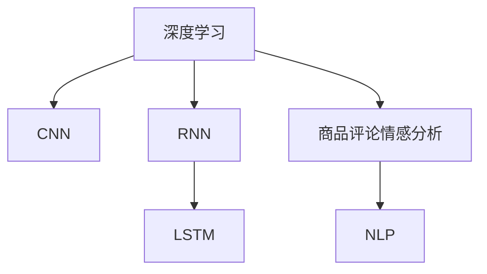

                 

# 深度学习驱动的商品评论情感分析

## 1. 背景介绍

商品评论情感分析是自然语言处理（NLP）领域的一项重要任务，旨在自动理解和提取文本数据中的情感倾向，广泛应用于产品推荐、市场分析、品牌监测等场景。随着电子商务的蓬勃发展，商品评论数据量迅速增长，如何高效准确地从海量文本中提取情感信息，成为业界的关注焦点。

深度学习，特别是基于卷积神经网络（CNN）和循环神经网络（RNN）的模型，已经在这项任务中取得了显著的进步。然而，传统的基于手工特征的机器学习方法，如支持向量机（SVM）和朴素贝叶斯（Naive Bayes），虽然简单易懂，但在面对大规模复杂文本数据时，性能往往难以与深度学习模型相匹配。

本文将详细探讨深度学习模型在商品评论情感分析中的应用，包括模型构建、算法原理、项目实践等核心内容，并对比不同深度学习模型的性能，为实际应用提供指导。

## 2. 核心概念与联系

### 2.1 核心概念概述

为更好地理解深度学习在商品评论情感分析中的应用，本节将介绍几个关键概念及其关系：

- **深度学习（Deep Learning）**：一类机器学习技术，基于多层神经网络结构，通过梯度下降等优化算法，逐步学习复杂非线性关系，从而实现对数据的建模和预测。
- **卷积神经网络（CNN）**：一种深度学习模型，通过卷积和池化操作提取局部特征，广泛应用于图像识别、文本分类等任务。
- **循环神经网络（RNN）**：一种深度学习模型，通过循环连接处理序列数据，适合处理时间依赖的任务，如自然语言处理中的序列分类和生成。
- **长短时记忆网络（LSTM）**：一种特殊的RNN，能够更好地处理长序列数据，解决传统RNN的梯度消失问题。
- **商品评论情感分析（Sentiment Analysis）**：通过机器学习技术，自动分析商品评论文本，识别文本中的情感倾向，如正面、负面、中性等。
- **自然语言处理（NLP）**：涉及文本处理、语言理解、自然语言生成等技术，旨在使计算机能够理解和处理人类语言。

这些核心概念之间的逻辑关系可以通过以下Mermaid流程图来展示：



这个流程图展示了深度学习如何通过CNN和RNN模型，对商品评论数据进行情感分析，并最终应用于NLP领域。

## 3. 核心算法原理 & 具体操作步骤
### 3.1 算法原理概述

商品评论情感分析的核心在于利用深度学习模型学习文本中的情感特征。具体来说，通过构建卷积神经网络（CNN）和循环神经网络（RNN）模型，从评论文本中提取情感相关的特征，并通过分类器进行情感倾向的预测。

假设商品评论数据集为 $D=\{(x_i, y_i)\}_{i=1}^N$，其中 $x_i$ 为评论文本，$y_i$ 为对应的情感标签（如正面、负面、中性）。模型的目标是通过最小化损失函数 $\mathcal{L}$，训练模型参数 $\theta$，使其能够对新评论文本 $x$ 的情感进行准确预测：

$$
\theta = \mathop{\arg\min}_{\theta} \mathcal{L}(M_{\theta}(x), y)
$$

其中 $M_{\theta}(x)$ 为深度学习模型对评论文本 $x$ 的情感预测。

### 3.2 算法步骤详解

基于深度学习的商品评论情感分析主要包括以下几个步骤：

**Step 1: 准备数据集**

- 收集商品评论数据，并进行数据预处理，如分词、去除停用词、构建词汇表等。
- 将数据集划分为训练集、验证集和测试集。

**Step 2: 构建模型**

- 选择合适的深度学习模型，如CNN、RNN或其变种（如LSTM）。
- 设计模型的输入和输出层，定义损失函数和优化器。
- 使用嵌入层将评论文本转换为模型可以处理的数值形式。

**Step 3: 训练模型**

- 将训练集数据输入模型，进行前向传播和反向传播，更新模型参数。
- 周期性在验证集上评估模型性能，根据性能指标调整模型参数。
- 重复上述步骤直至模型收敛。

**Step 4: 评估和部署**

- 在测试集上评估模型性能，对比不同模型之间的效果。
- 将训练好的模型部署到实际应用系统中，进行情感分析预测。

### 3.3 算法优缺点

基于深度学习的商品评论情感分析具有以下优点：

- **自动化特征提取**：深度学习模型能够自动学习文本中的情感特征，无需手动设计特征，减少了人工干预。
- **高准确率**：通过多层神经网络结构，深度学习模型能够捕捉复杂特征，提升了情感分析的准确率。
- **可扩展性**：深度学习模型可以通过增加网络层数或使用更高级的网络结构，进一步提升性能。

同时，该方法也存在一些局限性：

- **数据依赖**：深度学习模型对标注数据的质量和数量有较高要求，标注成本较高。
- **过拟合风险**：在大规模数据集上训练的模型，容易出现过拟合现象，导致泛化性能下降。
- **模型复杂**：深度学习模型结构复杂，训练和推理过程耗时较长，对计算资源要求较高。

### 3.4 算法应用领域

基于深度学习的商品评论情感分析已经在多个领域得到应用，如：

- **电子商务推荐系统**：分析用户评论，预测用户对商品的好恶程度，进行个性化推荐。
- **品牌监测**：通过分析社交媒体上的评论，监测品牌声誉，及时发现负面舆情。
- **市场营销**：分析用户反馈，优化产品设计，提升用户体验。
- **市场分析**：分析大量商品评论，了解市场趋势和消费者需求，辅助决策制定。

## 4. 数学模型和公式 & 详细讲解 & 举例说明

### 4.1 数学模型构建

假设模型采用卷积神经网络（CNN）进行情感分析，输入为评论文本的词嵌入序列 $x=(x_1,x_2,\dots,x_n)$，其中 $x_i$ 为评论中第 $i$ 个词的嵌入向量。模型的结构如下图所示：


模型的输出为情感预测 $y$，通过Softmax函数计算：

$$
y = \text{Softmax}(D(z))
$$

其中 $z$ 为全连接层的输出向量，$D$ 为线性变换层。

### 4.2 公式推导过程

假设评论文本的词嵌入序列为 $x=(x_1,x_2,\dots,x_n)$，模型由卷积层、池化层和全连接层组成。模型的损失函数为交叉熵损失：

$$
\mathcal{L}(\theta) = -\frac{1}{N}\sum_{i=1}^N \sum_{j=1}^C y_{ij}\log \hat{y}_{ij}
$$

其中 $C$ 为情感类别数，$y_{ij}$ 为真实标签，$\hat{y}_{ij}$ 为模型预测的概率。

模型参数 $\theta$ 的更新公式为：

$$
\theta \leftarrow \theta - \eta \nabla_{\theta}\mathcal{L}(\theta)
$$

其中 $\eta$ 为学习率，$\nabla_{\theta}\mathcal{L}(\theta)$ 为损失函数对模型参数的梯度。

### 4.3 案例分析与讲解

以商品评论情感分类为例，假设评论文本为 "这个商品质量很好，价格也比较合理"，模型的输入为评论的词嵌入序列 $x=(x_1,x_2,\dots,x_n)$，其中 $x_i$ 为评论中第 $i$ 个词的嵌入向量。模型的输出为情感预测 $y$，通过Softmax函数计算：

$$
y = \text{Softmax}(D(z))
$$

其中 $z$ 为全连接层的输出向量，$D$ 为线性变换层。假设模型对 "好" 和 "坏" 的预测概率分别为 $0.8$ 和 $0.2$，则模型预测的情感为正面。

## 5. 项目实践：代码实例和详细解释说明
### 5.1 开发环境搭建

在进行商品评论情感分析项目实践前，我们需要准备好开发环境。以下是使用Python进行TensorFlow开发的详细流程：

1. 安装Anaconda：从官网下载并安装Anaconda，用于创建独立的Python环境。

2. 创建并激活虚拟环境：
```bash
conda create -n tf-env python=3.8 
conda activate tf-env
```

3. 安装TensorFlow：根据CUDA版本，从官网获取对应的安装命令。例如：
```bash
conda install tensorflow -c tf -c conda-forge
```

4. 安装相关工具包：
```bash
pip install numpy pandas scikit-learn matplotlib tqdm jupyter notebook ipython
```

完成上述步骤后，即可在`tf-env`环境中开始项目实践。

### 5.2 源代码详细实现

以下是对商品评论情感分析项目的完整代码实现，使用了TensorFlow和Keras：

```python
from tensorflow.keras.models import Sequential
from tensorflow.keras.layers import Embedding, Conv1D, MaxPooling1D, Flatten, Dense
from tensorflow.keras.preprocessing.text import Tokenizer
from tensorflow.keras.preprocessing.sequence import pad_sequences
from sklearn.model_selection import train_test_split
import numpy as np

# 数据预处理
texts = [...]  # 商品评论文本
labels = [...]  # 情感标签
tokenizer = Tokenizer()
tokenizer.fit_on_texts(texts)
sequences = tokenizer.texts_to_sequences(texts)
word_index = tokenizer.word_index
data = pad_sequences(sequences, maxlen=maxlen)

# 划分数据集
x_train, x_test, y_train, y_test = train_test_split(data, labels, test_size=0.2)

# 构建模型
model = Sequential()
model.add(Embedding(input_dim=len(word_index)+1, output_dim=embedding_dim, input_length=maxlen))
model.add(Conv1D(filters=128, kernel_size=3, activation='relu'))
model.add(MaxPooling1D(pool_size=2))
model.add(Flatten())
model.add(Dense(64, activation='relu'))
model.add(Dense(num_classes, activation='softmax'))

# 编译模型
model.compile(loss='categorical_crossentropy', optimizer='adam', metrics=['accuracy'])

# 训练模型
model.fit(x_train, y_train, batch_size=32, epochs=10, validation_data=(x_test, y_test))

# 评估模型
loss, accuracy = model.evaluate(x_test, y_test, verbose=0)
print(f"Test loss: {loss:.4f}")
print(f"Test accuracy: {accuracy:.4f}")
```

### 5.3 代码解读与分析

**数据预处理**：
- 使用`Tokenizer`将评论文本转换为整数序列。
- 使用`pad_sequences`对整数序列进行填充，确保所有序列长度相同。

**模型构建**：
- 使用`Sequential`模型构建卷积神经网络。
- 添加嵌入层，将评论文本转换为模型可以处理的数值形式。
- 添加卷积层、池化层和全连接层。
- 使用`softmax`函数计算情感分类概率。

**模型编译和训练**：
- 使用`compile`方法定义模型的损失函数、优化器和评估指标。
- 使用`fit`方法训练模型，指定批次大小和迭代轮数。

**模型评估**：
- 使用`evaluate`方法在测试集上评估模型性能，输出损失和准确率。

## 6. 实际应用场景

商品评论情感分析在多个领域都有广泛的应用，以下列举几个典型场景：

### 6.1 电子商务推荐系统

基于商品评论情感分析的电子商务推荐系统能够更好地理解用户的偏好，从而进行个性化推荐。系统可以根据用户对商品的好评程度，推荐相似的商品，提高用户满意度。

**具体实现**：
- 收集用户对商品的评论数据。
- 对评论进行情感分析，计算商品的情感评分。
- 根据商品的情感评分进行推荐排序，输出推荐结果。

### 6.2 品牌监测

品牌监测系统通过分析社交媒体上的评论数据，及时发现品牌负面舆情，采取应对措施，提升品牌形象。

**具体实现**：
- 从社交媒体平台收集评论数据。
- 对评论进行情感分析，筛选出负面评论。
- 分析负面评论的原因和趋势，制定改进措施。

### 6.3 市场营销

市场营销团队通过分析用户的评论，了解用户对产品的看法，优化产品设计和功能，提升用户体验。

**具体实现**：
- 收集用户的评论数据。
- 对评论进行情感分析，识别用户关注点和改进建议。
- 根据分析结果，优化产品设计，改进用户体验。

### 6.4 市场分析

市场分析团队通过分析大量商品评论，了解市场需求和消费者行为，辅助制定市场策略。

**具体实现**：
- 收集市场中的商品评论数据。
- 对评论进行情感分析，统计不同情感的评论数量。
- 分析情感分布和趋势，制定市场策略。

## 7. 工具和资源推荐
### 7.1 学习资源推荐

为了帮助开发者系统掌握深度学习在商品评论情感分析中的应用，以下是一些优质的学习资源：

1. **TensorFlow官方文档**：提供了丰富的深度学习模型和工具，适合初学者和进阶者。
2. **Keras官方文档**：提供了简单易用的API，适合快速上手深度学习模型开发。
3. **自然语言处理（NLP）教程**：由斯坦福大学等机构提供的NLP课程，涵盖了深度学习在NLP中的应用。
4. **深度学习与自然语言处理（NLP）书籍**：详细介绍了深度学习在NLP中的应用，包括商品评论情感分析等任务。
5. **NLP开源项目**：如NLTK、spaCy等，提供了丰富的NLP工具和数据集，适合研究和学习。

通过这些资源的学习实践，相信你一定能够快速掌握深度学习在商品评论情感分析中的应用，并用于解决实际的NLP问题。

### 7.2 开发工具推荐

高效的开发离不开优秀的工具支持。以下是几款用于商品评论情感分析开发的常用工具：

1. **TensorFlow**：由Google主导开发的深度学习框架，提供了丰富的模型和工具，适合大规模工程应用。
2. **Keras**：基于TensorFlow的高级API，提供了简单易用的深度学习模型构建接口。
3. **Jupyter Notebook**：适合进行交互式开发和调试，方便快速迭代实验。
4. **PyCharm**：Python开发环境，支持深度学习模型开发、调试和部署。
5. **AWS SageMaker**：AWS提供的云端深度学习平台，支持模型训练、部署和优化。

合理利用这些工具，可以显著提升商品评论情感分析任务的开发效率，加快创新迭代的步伐。

### 7.3 相关论文推荐

深度学习在商品评论情感分析中的应用已经引起了广泛关注，以下是几篇奠基性的相关论文，推荐阅读：

1. **Convolutional Neural Networks for Sentiment Analysis**：提出了基于CNN的情感分类模型，在大规模数据集上取得了优异的性能。
2. **LSTM Networks for Sentiment Analysis**：使用LSTM模型处理序列数据，提升了情感分析的准确率。
3. **Deep Recurrent Neural Networks for Sentiment Analysis**：提出基于RNN的情感分类模型，解决了传统模型的不足。
4. **Text-CNN with Attention for Social Media Sentiment Analysis**：结合注意力机制，提升了CNN模型对社交媒体评论的情感分析能力。
5. **FastText for Efficient and Effective Text Classification**：介绍了FastText模型，适用于处理大规模文本分类任务，包括情感分析。

这些论文代表了大规模商品评论情感分析技术的发展脉络。通过学习这些前沿成果，可以帮助研究者把握学科前进方向，激发更多的创新灵感。

## 8. 总结：未来发展趋势与挑战
### 8.1 总结

本文对深度学习在商品评论情感分析中的应用进行了详细探讨。首先阐述了深度学习在NLP领域的重要性，强调了深度学习模型在情感分析任务中的优势。其次，从模型构建、算法原理到项目实践，全面介绍了基于CNN和RNN的深度学习模型，给出了完整的代码实现和详细解释。最后，分析了商品评论情感分析在多个领域的应用场景，并推荐了相关的学习资源和开发工具。

通过本文的系统梳理，可以看到，深度学习模型在商品评论情感分析中具有广阔的应用前景，可以显著提升情感分析的准确率和效率，推动NLP技术在实际应用中的落地。

### 8.2 未来发展趋势

展望未来，深度学习在商品评论情感分析领域将呈现以下几个发展趋势：

1. **模型结构的优化**：随着深度学习模型的不断演进，未来将出现更多高效的模型结构，如注意力机制、Transformer等，进一步提升情感分析的性能。
2. **多模态融合**：结合文本、图像、视频等多模态数据，提升情感分析的准确性和鲁棒性。
3. **迁移学习**：在大规模数据集上预训练模型，然后在小规模数据集上进行微调，提升模型的泛化能力。
4. **实时化处理**：通过分布式训练和推理，实现实时化商品评论情感分析，满足在线系统的需求。
5. **跨语言分析**：将深度学习模型应用于多语言情感分析，提升跨语言情感理解能力。

这些趋势表明，深度学习在商品评论情感分析领域的应用前景广阔，未来将有更多创新性的技术和方法涌现。

### 8.3 面临的挑战

尽管深度学习在商品评论情感分析中已经取得了显著的进步，但仍面临一些挑战：

1. **数据依赖**：深度学习模型对高质量标注数据的需求较高，标注成本较高。如何降低标注成本，提高数据质量，是未来的重要研究方向。
2. **过拟合风险**：在大规模数据集上训练的模型，容易出现过拟合现象，导致泛化性能下降。如何缓解过拟合，提高模型的泛化能力，是另一个重要的研究方向。
3. **计算资源消耗**：深度学习模型结构复杂，计算资源消耗较大，如何优化模型结构，减少计算资源消耗，是实际应用中需要考虑的问题。
4. **模型可解释性**：深度学习模型通常被视为"黑盒"系统，难以解释其内部工作机制和决策逻辑。如何提高模型的可解释性，满足高风险领域的需求，是亟待解决的问题。
5. **隐私保护**：商品评论数据涉及用户隐私，如何保护用户隐私，同时实现高效的商品评论情感分析，是实际应用中需要考虑的问题。

### 8.4 研究展望

面对深度学习在商品评论情感分析领域面临的挑战，未来的研究需要在以下几个方面寻求新的突破：

1. **无监督学习和半监督学习**：探索无监督学习和半监督学习范式，减少对标注数据的依赖，提高模型的泛化能力。
2. **模型压缩和优化**：研究模型压缩和优化技术，如量化加速、剪枝等，减少计算资源消耗，提高模型的实时性。
3. **可解释性增强**：研究可解释性增强方法，如模型可视化、可解释性代理等，提高模型的可解释性和可信度。
4. **多模态融合**：研究多模态融合技术，结合文本、图像、视频等多模态数据，提升情感分析的准确性和鲁棒性。
5. **隐私保护技术**：研究隐私保护技术，如差分隐私、联邦学习等，保护用户隐私，同时实现高效的商品评论情感分析。

这些研究方向的探索，必将引领深度学习在商品评论情感分析领域迈向更高的台阶，为构建安全、可靠、可解释、可控的智能系统铺平道路。面向未来，深度学习在商品评论情感分析领域的研究还需要与其他人工智能技术进行更深入的融合，如知识表示、因果推理、强化学习等，多路径协同发力，共同推动自然语言理解和智能交互系统的进步。只有勇于创新、敢于突破，才能不断拓展深度学习的边界，让智能技术更好地造福人类社会。

## 9. 附录：常见问题与解答

**Q1：深度学习在商品评论情感分析中的应用有哪些优势？**

A: 深度学习在商品评论情感分析中的应用具有以下优势：
1. **自动化特征提取**：深度学习模型能够自动学习文本中的情感特征，无需手动设计特征，减少了人工干预。
2. **高准确率**：通过多层神经网络结构，深度学习模型能够捕捉复杂特征，提升了情感分析的准确率。
3. **可扩展性**：深度学习模型可以通过增加网络层数或使用更高级的网络结构，进一步提升性能。

**Q2：如何选择深度学习模型进行情感分析？**

A: 选择深度学习模型进行情感分析需要考虑以下几个因素：
1. **数据规模**：数据规模较小，适合使用简单模型如CNN；数据规模较大，适合使用复杂模型如RNN或Transformer。
2. **计算资源**：计算资源有限，适合使用参数较少的模型；计算资源充足，适合使用复杂模型以获得更好的性能。
3. **任务复杂度**：任务复杂度较高，适合使用复杂模型如RNN；任务复杂度较低，适合使用简单模型如CNN。

**Q3：如何在深度学习模型中缓解过拟合？**

A: 缓解深度学习模型中的过拟合，可以采取以下措施：
1. **数据增强**：通过回译、近义替换等方式扩充训练集。
2. **正则化**：使用L2正则、Dropout、Early Stopping等避免过拟合。
3. **模型优化**：采用更好的优化器，如Adam、Adagrad等。
4. **模型压缩**：使用模型压缩技术，如剪枝、量化等。

**Q4：如何提高深度学习模型的可解释性？**

A: 提高深度学习模型的可解释性可以采取以下措施：
1. **模型可视化**：使用可视化工具，如t-SNE、热力图等，展示模型特征和决策过程。
2. **可解释性代理**：使用可解释性代理，如LIME、SHAP等，生成模型的局部可解释性。
3. **特征重要性分析**：分析特征重要性，确定对模型预测有较大影响的特征。

**Q5：深度学习模型在实际应用中如何处理隐私保护问题？**

A: 深度学习模型在实际应用中处理隐私保护问题可以采取以下措施：
1. **差分隐私**：在训练数据中加入噪声，保护用户隐私。
2. **联邦学习**：在分布式环境中训练模型，保护用户数据隐私。
3. **数据匿名化**：对用户数据进行匿名化处理，保护用户隐私。
4. **数据加密**：使用加密技术保护数据传输和存储过程中的隐私。

---

作者：禅与计算机程序设计艺术 / Zen and the Art of Computer Programming

