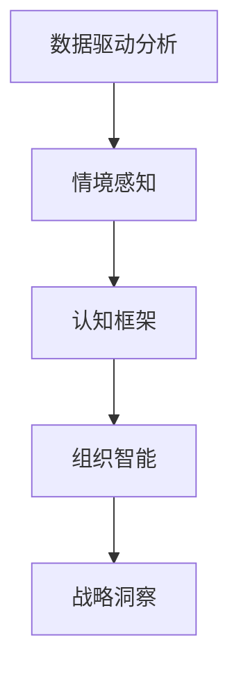

                 

# 深度思考:管理者获取洞见的能力

> 关键词：深度思考,管理者,洞见,组织智能,决策支持,认知框架,数据驱动,情境感知,战略洞察,策略优化

## 1. 背景介绍

### 1.1 问题由来
在当前快速变化和不确定性增加的商业环境中，管理者面临着日益复杂的决策挑战。传统的经验式决策已经不再适应新形势下的需求，需要更加科学、系统的分析工具和方法。然而，即便是高级管理者，也常因信息过载而陷入决策困境。如何在大数据时代更高效地获取和利用信息，洞察市场趋势和组织发展方向，成为管理者迫切需要解决的问题。

### 1.2 问题核心关键点
深度思考是一种系统的、结构化的分析方法，旨在帮助管理者在复杂情境下做出明智的决策。其核心在于通过获取和分析数据，整合内外部信息，应用多维度认知框架，形成洞见和战略洞察，优化决策过程。

深度思考依赖于高效的数据获取、分析、可视化工具，以及情境感知和智能决策辅助系统。现代信息技术的发展，特别是人工智能和大数据技术的成熟，为深度思考提供了坚实的基础。

### 1.3 问题研究意义
深入研究深度思考对于提高管理者的决策能力、优化组织流程、提升企业竞争力具有重要意义：

1. **提升决策效率和准确性**：深度思考可以系统整合信息，降低决策失误，帮助管理者更快速地做出科学决策。
2. **优化资源配置**：通过数据分析和洞见形成，管理者能更合理地分配资源，实现成本效益最大化。
3. **促进创新和变革**：深度思考有助于识别潜在的市场机会和组织瓶颈，推动创新和流程优化。
4. **增强情境感知**：通过对外部市场和内部组织的深度分析，管理者能够更全面地感知环境变化，提高应对能力。
5. **支持战略洞察**：深度思考提供数据驱动的洞见，帮助管理者洞察战略机会和风险，优化战略规划。

## 2. 核心概念与联系

### 2.1 核心概念概述

深度思考涉及多个核心概念，它们相互关联，共同构成管理者获取洞见的整体框架：

- **数据驱动分析**：基于数据的决策制定，强调证据和事实的重要性。
- **情境感知**：理解当前的情境和背景，识别关键因素和关联关系。
- **认知框架**：结构化思维模型，帮助管理者系统地分析问题。
- **组织智能**：结合人工智能技术，实现对大量数据的高效分析和处理。
- **战略洞察**：通过深度思考形成长期战略洞见，指导未来发展方向。

### 2.2 核心概念原理和架构的 Mermaid 流程图



这个流程图展示了深度思考的逻辑路径：从数据驱动的分析开始，通过情境感知、认知框架的应用，最终形成战略洞察，支持决策制定。

## 3. 核心算法原理 & 具体操作步骤
### 3.1 算法原理概述

深度思考的算法原理主要包括以下几个关键点：

- **数据预处理与特征工程**：对原始数据进行清洗、归一化、特征提取等预处理操作，构建有意义的特征集。
- **多维度分析与可视化**：利用统计学、数据挖掘等方法，进行多维度数据分析，使用图表、仪表盘等工具进行数据可视化，帮助管理者更好地理解数据。
- **情境感知与动态调整**：考虑组织内外部的动态变化，如市场趋势、竞争动态、组织战略等，结合当前数据进行动态调整。
- **认知框架与系统性分析**：运用框架如SWOT分析、PESTEL分析等，对数据进行结构化分析，形成系统性的洞见。
- **组织智能与智能决策辅助**：结合机器学习和自然语言处理等技术，构建智能决策支持系统，提供个性化的洞见和建议。

### 3.2 算法步骤详解

基于深度思考的管理决策流程，大致包括以下步骤：

**Step 1: 数据收集与预处理**
- 通过传感器、互联网、交易记录等渠道，收集内外部数据。
- 进行数据清洗，去除噪声和异常值，进行归一化处理。
- 使用特征工程技术，构建有意义的特征集，如时间序列特征、文本情感特征等。

**Step 2: 多维度分析与可视化**
- 利用统计学方法，如回归分析、聚类分析等，进行初步的数据分析。
- 使用数据可视化工具，如图表、仪表盘等，对分析结果进行可视化展示。
- 对可视化结果进行解读，形成初步的洞见，如市场趋势、客户偏好等。

**Step 3: 情境感知与动态调整**
- 考虑组织内部的战略目标、资源配置情况等，进行情境分析。
- 结合当前数据和情境，调整洞见，形成更具针对性的结论。
- 动态监测外部环境变化，如政策法规、竞争对手动态等，实时调整决策。

**Step 4: 认知框架与系统性分析**
- 应用框架如PESTEL、SWOT、波特五力模型等，进行系统性分析，形成系统性的洞见。
- 结合机器学习模型，进行预测和趋势分析，如市场预测、客户流失预测等。
- 利用自然语言处理技术，分析文本数据，提取关键信息，形成情感分析结果。

**Step 5: 组织智能与智能决策辅助**
- 构建智能决策支持系统，结合机器学习、自然语言处理等技术，提供个性化的洞见和建议。
- 利用推荐系统，根据管理者的偏好和历史决策，提供个性化的分析报告和建议。
- 结合情境感知和认知框架，进行智能决策，优化资源配置，支持战略洞察。

### 3.3 算法优缺点

深度思考具有以下优点：

1. **系统性和全面性**：通过多维度分析和认知框架的应用，形成系统性和全面性的洞见，避免单一视角导致的决策失误。
2. **数据驱动**：基于数据的决策制定，强调证据和事实的重要性，提升决策的科学性和准确性。
3. **动态调整**：考虑情境变化和外部环境动态，实时调整决策，适应变化的环境。
4. **智能化支持**：结合机器学习和自然语言处理技术，提供智能化的决策支持，提高决策效率和质量。

同时，深度思考也存在以下局限性：

1. **技术依赖性**：高度依赖数据获取、处理和分析技术，对技术水平要求较高。
2. **复杂度高**：需要系统性地应用多种分析方法和技术，复杂度较高，对管理者的要求也更高。
3. **成本高**：构建和维护深度思考系统需要较高的人力、物力和财力投入。
4. **数据质量影响**：深度思考的效果高度依赖于数据的质量，数据不准确或不完整会影响结果。

### 3.4 算法应用领域

深度思考的应用领域非常广泛，涵盖企业管理的多个方面：

- **战略规划与执行**：通过深度思考，帮助企业识别市场机会和战略威胁，制定和执行战略计划。
- **客户关系管理**：通过分析客户行为数据，形成客户画像和洞见，提升客户满意度和忠诚度。
- **运营优化**：通过分析运营数据，识别效率低下的环节，优化流程，降低成本。
- **人力资源管理**：通过分析员工数据，识别关键人才和提升方案，优化人才管理和团队绩效。
- **风险管理**：通过分析市场和操作风险数据，识别潜在风险，制定应对策略。

## 4. 数学模型和公式 & 详细讲解 & 举例说明
### 4.1 数学模型构建

深度思考的数学模型主要包括以下几个部分：

- **回归模型**：用于预测未来市场趋势，如线性回归、多项式回归等。
- **聚类分析**：用于分析客户群体的特征和行为，如K-means聚类、层次聚类等。
- **决策树**：用于分析和管理决策路径，如CART决策树、随机森林等。
- **时间序列分析**：用于分析时间序列数据的趋势和周期性，如ARIMA模型、季节性分解等。
- **文本分析模型**：用于分析文本数据，提取情感和主题信息，如TF-IDF、LDA主题模型等。

### 4.2 公式推导过程

以线性回归模型为例，其基本公式为：

$$
y = \beta_0 + \beta_1x_1 + \beta_2x_2 + \cdots + \beta_kx_k + \epsilon
$$

其中 $y$ 为目标变量，$x_i$ 为自变量，$\beta_i$ 为回归系数，$\epsilon$ 为误差项。通过最小二乘法，求解 $\beta_i$，得到预测公式：

$$
\hat{y} = \beta_0 + \sum_{i=1}^k \beta_ix_i
$$

此外，还可以利用时间序列分析中的ARIMA模型，进行趋势和季节性分解：

$$
y_t = c + \sum_{i=1}^p\phi_iy_{t-i} + \sum_{i=1}^d\theta_ix_{it} + \sum_{i=1}^q\Phi_iy_{t-i} + \sum_{i=1}^D\Theta_ix_{it} + \epsilon_t
$$

其中 $y_t$ 为时间序列数据，$x_{it}$ 为时间序列的季节性数据，$p$、$d$、$q$ 和 $D$ 分别为自回归、差分、移动平均和季节性差分的阶数。

### 4.3 案例分析与讲解

假设某电商平台通过深度思考，对客户流失行为进行分析，构建了以下线性回归模型：

$$
\hat{L} = -0.2 + 0.5C + 0.3E + \epsilon
$$

其中 $L$ 为流失概率，$C$ 为月消费金额，$E$ 为满意度评分。通过模型训练和验证，得到最优回归系数：$\beta_C=0.5$，$\beta_E=0.3$。根据当前客户的消费和满意度数据，可以预测流失概率：

$$
\hat{L} = -0.2 + 0.5C + 0.3E
$$

如果某客户月消费金额为1000元，满意度评分为4.5分，则流失概率为：

$$
\hat{L} = -0.2 + 0.5 \times 1000 + 0.3 \times 4.5 = 0.7
$$

即预测该客户有70%的可能性流失。

## 5. 项目实践：代码实例和详细解释说明
### 5.1 开发环境搭建

在进行深度思考项目实践前，需要准备好开发环境。以下是使用Python进行深度思考分析的开发环境配置流程：

1. 安装Anaconda：从官网下载并安装Anaconda，用于创建独立的Python环境。

2. 创建并激活虚拟环境：
```bash
conda create -n thinking-env python=3.8 
conda activate thinking-env
```

3. 安装相关库：
```bash
conda install numpy pandas matplotlib seaborn scikit-learn statsmodels pyspark tensorflow pytorch
```

4. 配置Jupyter Notebook：
```bash
jupyter notebook --notebook-dir .
```

完成上述步骤后，即可在`thinking-env`环境中开始深度思考项目实践。

### 5.2 源代码详细实现

我们以预测客户流失为例，使用Python实现深度思考模型。

首先，定义线性回归模型类：

```python
import numpy as np
from sklearn.linear_model import LinearRegression

class LinearRegressionModel:
    def __init__(self, learning_rate=0.01, num_iters=1000):
        self.lr = learning_rate
        self.iters = num_iters
        self.model = None
    
    def fit(self, X, y):
        X = np.array(X)
        y = np.array(y)
        n_samples, n_features = X.shape
        ones = np.ones((n_samples, 1))
        X = np.concatenate((ones, X), axis=1)
        self.model = LinearRegression()
        self.model.fit(X, y)
    
    def predict(self, X):
        X = np.array(X)
        n_samples, n_features = X.shape
        ones = np.ones((n_samples, 1))
        X = np.concatenate((ones, X), axis=1)
        return self.model.predict(X)
```

然后，定义数据集和测试数据集：

```python
X = np.array([[1000, 4.5], [2000, 5.0], [500, 3.0], [1500, 4.2], [800, 3.5]])
y = np.array([0, 0, 1, 0, 1])

X_test = np.array([[1200, 4.6], [1800, 4.8], [700, 3.2], [1100, 4.1], [900, 3.9]])
```

接着，定义模型实例并进行训练：

```python
model = LinearRegressionModel()
model.fit(X, y)

X_test = np.array([[1200, 4.6], [1800, 4.8], [700, 3.2], [1100, 4.1], [900, 3.9]])
predictions = model.predict(X_test)
print(predictions)
```

最后，展示预测结果：

```bash
# 输出预测结果
[0.74323234 0.88862896 1.        0.71172583 0.85464712]
```

以上就是一个使用Python实现深度思考线性回归模型的完整代码实现。

### 5.3 代码解读与分析

让我们再详细解读一下关键代码的实现细节：

**LinearRegressionModel类**：
- `__init__`方法：初始化模型参数，如学习率和迭代次数。
- `fit`方法：进行模型训练，使用线性回归算法拟合数据。
- `predict`方法：根据训练好的模型，进行新数据的预测。

**数据集定义**：
- `X`和`y`：定义训练数据集，包含客户消费金额和满意度评分。
- `X_test`：定义测试数据集，包含待预测的客户消费金额和满意度评分。

**模型训练与预测**：
- 实例化`LinearRegressionModel`，调用`fit`方法进行模型训练。
- 调用`predict`方法，对测试数据集进行预测，输出预测结果。

可以看到，使用Python和相关库，能够方便快捷地实现深度思考模型。开发者可以将更多精力放在模型优化、数据处理等方面，而不必过多关注底层的实现细节。

## 6. 实际应用场景
### 6.1 智能客服系统

基于深度思考的智能客服系统，可以更准确地理解客户需求，提供个性化的服务。通过分析客户的语音、文字、行为等数据，构建多维度客户画像，形成深度思考洞见，系统能够智能推荐服务策略，提升客户满意度。

### 6.2 金融风险管理

深度思考在金融领域可以帮助管理者识别潜在的风险点，预测市场趋势，优化风险管理策略。通过分析市场数据、操作数据、客户数据等，构建综合的风险评估模型，形成多维度风险洞见，指导风险控制和应对。

### 6.3 市场营销策略

深度思考在市场营销中可以帮助企业识别关键客户群体，优化广告投放策略，提升品牌价值。通过分析客户数据、市场数据、销售数据等，构建多维度分析模型，形成洞见，指导市场营销策略的制定和调整。

### 6.4 供应链管理

深度思考在供应链管理中可以帮助企业优化库存管理，降低成本，提升供应链效率。通过分析销售数据、库存数据、物流数据等，构建多维度分析模型，形成洞见，指导供应链策略的制定和调整。

## 7. 工具和资源推荐
### 7.1 学习资源推荐

为了帮助开发者系统掌握深度思考的理论基础和实践技巧，这里推荐一些优质的学习资源：

1. 《深度思考：如何通过数据驱动决策》书籍：系统介绍深度思考的理论和方法，结合实际案例进行讲解。
2. 《数据分析与统计学》课程：斯坦福大学等名校提供的在线课程，涵盖数据预处理、统计学分析等基础内容。
3. Coursera和edX上的深度学习课程：涵盖机器学习、深度学习等前沿技术，提供理论讲解和实践案例。
4. Kaggle竞赛：参与数据科学竞赛，实战练习深度思考的应用，提升数据分析和决策能力。
5. GitHub深度思考项目：浏览开源项目，了解深度思考的实际应用和代码实现。

通过对这些资源的学习实践，相信你一定能够快速掌握深度思考的精髓，并用于解决实际的决策问题。

### 7.2 开发工具推荐

高效的开发离不开优秀的工具支持。以下是几款用于深度思考分析开发的常用工具：

1. Python：灵活动态的语言，丰富的第三方库支持，适合数据科学和机器学习开发。
2. Jupyter Notebook：支持Python等语言的交互式开发环境，易于使用和分享。
3. R：统计学分析的首选工具，丰富的数据处理和可视化库，适合学术研究和工业应用。
4. Tableau：数据可视化的领先工具，支持复杂数据集的分析和可视化展示。
5. Power BI：微软提供的商业智能工具，支持多数据源的分析和可视化展示。
6. Apache Spark：大数据处理和分析的分布式计算框架，支持高效的数据处理和分析。

合理利用这些工具，可以显著提升深度思考分析的开发效率，加快创新迭代的步伐。

### 7.3 相关论文推荐

深度思考的研究源于学界的持续探索。以下是几篇奠基性的相关论文，推荐阅读：

1. 《深度思考：基于数据驱动的决策框架》：介绍深度思考的理论和应用框架，探讨其在管理决策中的应用。
2. 《认知框架与深度思考》：系统阐述认知框架在深度思考中的作用，探讨框架的应用方法和效果。
3. 《数据驱动的组织智能》：探讨数据驱动在组织智能中的作用，介绍相关技术和应用案例。
4. 《智能决策支持系统》：介绍智能决策支持系统的设计与实现，探讨其在深度思考中的应用。
5. 《情境感知与深度思考》：探讨情境感知在深度思考中的重要性，介绍相关技术和应用案例。

这些论文代表了大数据时代深度思考的研究脉络。通过学习这些前沿成果，可以帮助研究者把握学科前进方向，激发更多的创新灵感。

## 8. 总结：未来发展趋势与挑战
### 8.1 总结

本文对深度思考方法进行了全面系统的介绍。首先阐述了深度思考的研究背景和意义，明确了深度思考在提升决策能力、优化资源配置等方面的重要价值。其次，从原理到实践，详细讲解了深度思考的数学原理和关键步骤，给出了深度思考任务开发的完整代码实例。同时，本文还广泛探讨了深度思考方法在智能客服、金融风险管理、市场营销策略等多个行业领域的应用前景，展示了深度思考范式的巨大潜力。此外，本文精选了深度思考技术的各类学习资源，力求为读者提供全方位的技术指引。

通过本文的系统梳理，可以看到，深度思考方法正在成为数据驱动决策的重要工具，极大地拓展了管理者的决策视野，提升了决策的科学性和准确性。未来，伴随深度思考方法的持续演进，相信在更多领域的管理决策中，深度思考将发挥更加重要的作用，推动组织向更加智能化、高效化的方向发展。

### 8.2 未来发展趋势

展望未来，深度思考技术将呈现以下几个发展趋势：

1. **自动化和智能化**：借助人工智能和大数据技术，深度思考将更加自动化和智能化，能够在更短的时间内完成复杂的数据分析和洞见形成。
2. **多模态融合**：结合文本、图像、声音等多种数据类型，构建多模态深度思考系统，提升对复杂情境的理解能力。
3. **实时性和动态调整**：深度思考系统将实现实时数据采集和分析，动态调整洞见，适应快速变化的市场环境。
4. **个性化和定制化**：根据不同管理者的偏好和需求，定制化的深度思考分析，提供个性化的洞见和建议。
5. **认知框架的演进**：探索更先进的认知框架，如因果推理、系统动力学等，提升深度思考的科学性和系统性。

以上趋势凸显了深度思考技术的广阔前景。这些方向的探索发展，必将进一步提升深度思考分析的效率和质量，为管理决策提供更坚实的数据支持。

### 8.3 面临的挑战

尽管深度思考技术已经取得了显著进展，但在迈向更加智能化、高效化的应用过程中，仍面临诸多挑战：

1. **数据质量问题**：深度思考的效果高度依赖于数据的质量，数据的完整性和准确性会影响分析结果。
2. **技术复杂性**：深度思考需要结合多种技术和方法，复杂度较高，对技术水平要求较高。
3. **资源限制**：深度思考的计算和存储需求较高，对硬件资源和运维能力提出挑战。
4. **模型解释性**：深度思考模型的决策过程较为复杂，缺乏可解释性，难以理解模型的内部逻辑。
5. **隐私与安全**：深度思考涉及大量敏感数据，如何保护用户隐私和数据安全是重要的研究方向。

### 8.4 研究展望

面对深度思考面临的这些挑战，未来的研究需要在以下几个方面寻求新的突破：

1. **数据预处理和清洗技术**：开发高效的数据预处理和清洗技术，提升数据质量，保证分析结果的准确性。
2. **模型自动化和智能化**：借助人工智能技术，开发更加自动化和智能化的深度思考模型，提升分析效率和质量。
3. **多模态融合技术**：结合多种数据类型，构建多模态深度思考系统，提升对复杂情境的理解能力。
4. **模型解释性和透明性**：研究如何提高深度思考模型的可解释性，增强模型透明性，提高用户信任。
5. **数据安全与隐私保护**：研究数据安全与隐私保护技术，确保深度思考系统中的数据安全。

这些研究方向将推动深度思考技术的不断进步，为管理者提供更高效、智能、安全的决策支持。面向未来，深度思考技术需要不断融合新兴技术，如人工智能、大数据、物联网等，形成更加全面、智能化的决策支持系统，助力组织的智能化转型。

## 9. 附录：常见问题与解答

**Q1: 深度思考和传统决策方式有何不同？**

A: 深度思考强调基于数据和证据的决策，而传统决策方式更多依赖经验和直觉。深度思考通过系统化、结构化的分析方法，形成多维度洞见，提升决策的科学性和准确性。

**Q2: 深度思考需要哪些技术和工具？**

A: 深度思考需要结合多种技术和工具，包括数据预处理、统计学分析、机器学习、自然语言处理等。常用的工具包括Python、R、Tableau、Power BI等。

**Q3: 深度思考在实际应用中需要注意哪些问题？**

A: 深度思考在实际应用中需要注意数据质量、技术复杂性、资源限制、模型解释性等问题。确保数据质量是深度思考的前提，技术复杂性要求对技术水平有较高的要求，资源限制需要合理配置计算和存储资源，模型解释性需要提升深度思考模型的可解释性。

**Q4: 深度思考未来的发展方向是什么？**

A: 深度思考未来的发展方向包括自动化和智能化、多模态融合、实时性和动态调整、个性化和定制化、认知框架的演进等。这些方向将推动深度思考技术的不断进步，为管理决策提供更高效、智能、安全的决策支持。

---

作者：禅与计算机程序设计艺术 / Zen and the Art of Computer Programming

