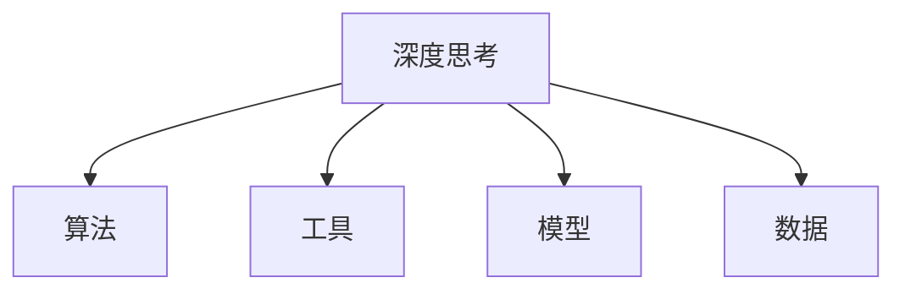

                 

# 深度思考:问题解决的利器

> 关键词：深度思考,问题解决,算法原理,操作步骤,算法优缺点,应用领域,数学模型,项目实践,实际应用,学习资源,开发工具,相关论文,未来展望,常见问题

## 1. 背景介绍

### 1.1 问题由来
在快速变化的信息时代，面对复杂多变的现实问题，传统经验和方法往往难以应对。深度思考成为问题解决的重要利器，能够帮助人们在信息过载、知识碎片化的时代中，更高效、更系统地发现问题根源、寻找解决方案。

深度思考不仅能解决单一问题，还能从中获得更广泛的启发和洞见，推动认知水平的提升。然而，深度思考并不是一项简单的技能，它需要大量的知识积累、逻辑思维和创造力。在数字化时代，如何有效提升深度思考能力，将技术力量引入思考过程，成为了一个重要课题。

### 1.2 问题核心关键点
深度思考作为一种认知工具，其核心在于通过多维度的分析和综合，揭示问题的本质，发现潜在的关联和矛盾，从而提出有效的解决方案。这个过程涉及信息整合、逻辑推理、创造性思维等多个环节，其中算法和工具的使用起到了至关重要的作用。

现代技术，如大数据、人工智能、自然语言处理等，通过模型和算法，辅助我们进行信息筛选、知识整合和逻辑推理。这些技术提供了新的视角和方法，使深度思考变得更加系统化和智能化。

### 1.3 问题研究意义
研究如何利用算法和工具辅助深度思考，对于提升问题解决能力、推动认知智能的发展具有重要意义：

1. **提高问题解决效率**：通过技术手段，可以快速识别问题关键点和可能方案，缩短决策时间。
2. **增强认知智能**：结合知识图谱、推理引擎等技术，提升深度思考的广度和深度，拓展认知边界。
3. **优化决策过程**：利用数据分析和机器学习，进行模拟和预测，优化决策方案。
4. **提升创新能力**：结合知识图谱、自然语言处理等技术，生成创意灵感，促进创新思维的形成。
5. **支持组织协作**：利用协作工具和平台，促进信息共享和团队合作，提高问题解决的整体效能。

## 2. 核心概念与联系

### 2.1 核心概念概述

为了更好地理解深度思考的算法和工具辅助，本节将介绍几个关键概念：

- **深度思考**：通过多维度分析和综合，揭示问题本质，寻找解决方案的过程。涉及信息整合、逻辑推理、创造性思维等多个环节。
- **算法**：解决问题的数学化模型，通过一系列计算步骤，将输入转化为输出。
- **工具**：辅助深度思考的技术手段，如大数据、人工智能、自然语言处理等。
- **模型**：抽象化的问题表示，通过学习训练数据，捕捉问题的特征和规律。
- **数据**：问题解决的基础，提供模型训练和算法执行的输入。

这些核心概念之间的逻辑关系可以通过以下Mermaid流程图来展示：



这个流程图展示了深度思考与算法、工具、模型和数据之间的关系：

1. 深度思考的目标是通过多维度分析和综合，揭示问题本质，寻找解决方案。
2. 算法作为数学化模型，提供解决问题的计算步骤。
3. 工具通过技术手段，辅助进行信息筛选、知识整合和逻辑推理。
4. 模型作为问题抽象化表示，捕捉问题的特征和规律。
5. 数据提供模型训练和算法执行的输入。

这些核心概念共同构成了深度思考的辅助框架，使其能够在复杂问题解决中发挥更大的作用。

## 3. 核心算法原理 & 具体操作步骤

### 3.1 算法原理概述

深度思考的算法主要分为两个步骤：问题的抽象表示和解决方案的生成。

**第一步：问题的抽象表示**

在深度思考中，问题首先需要通过模型进行抽象表示，捕捉问题的关键特征和规律。常见的模型包括：

- **知识图谱**：通过节点和边的结构，表示实体和它们之间的关系，帮助捕捉问题背景和关键点。
- **因果图**：通过因果关系的图形化表示，揭示问题的因果链，辅助进行逻辑推理。
- **问题树**：通过层次化的结构，将问题分解为更小、更具体的子问题，便于逐步分析和解决。

**第二步：解决方案的生成**

在抽象表示的基础上，通过算法生成解决方案。常见的算法包括：

- **启发式算法**：如A*、遗传算法等，通过启发式规则，搜索最优解或可行解。
- **机器学习算法**：如决策树、神经网络等，通过学习训练数据，生成预测或分类模型。
- **模拟退火算法**：通过随机化策略，搜索全局最优解，避免陷入局部最优。

### 3.2 算法步骤详解

深度思考的算法步骤包括以下几个关键环节：

**Step 1: 数据预处理**

- 收集问题相关的数据，进行清洗和标注。
- 通过数据增强技术，扩充数据集，提高模型的泛化能力。
- 使用特征提取技术，将原始数据转换为模型输入的特征向量。

**Step 2: 模型训练**

- 选择合适的模型和算法，进行模型训练。
- 设置合适的超参数，如学习率、批大小等，优化模型性能。
- 使用正则化技术，如L2正则、Dropout等，防止过拟合。

**Step 3: 问题抽象**

- 构建知识图谱、因果图、问题树等模型，对问题进行抽象表示。
- 使用图神经网络、因果推理等技术，捕捉问题关键点和规律。
- 将问题分解为更小、更具体的子问题，进行逐步分析和解决。

**Step 4: 解决方案生成**

- 使用启发式算法或机器学习算法，生成解决方案。
- 通过模型评估指标，如精确度、召回率、F1分数等，评估模型性能。
- 结合领域知识和专家经验，进行模型调整和优化。

**Step 5: 方案验证**

- 使用测试集验证模型的泛化能力。
- 结合领域专家进行方案验证，确保解决方案的可行性和有效性。
- 根据验证结果，进行模型微调，进一步提升性能。

### 3.3 算法优缺点

深度思考算法具有以下优点：

1. **系统化**：通过模型和算法，系统化地进行问题分析和解决，减少人为因素的干扰。
2. **高效性**：利用计算机的高效计算能力，快速处理大量数据，缩短问题解决的时间。
3. **全面性**：通过多维度分析和综合，发现问题的关键点和关联性，提供更全面的解决方案。
4. **可扩展性**：结合不同技术手段，提升问题解决的广度和深度，适应不同场景的应用需求。

同时，深度思考算法也存在一些局限性：

1. **数据依赖性**：模型的训练和应用高度依赖数据质量，数据不足或偏差可能导致模型性能下降。
2. **解释性不足**：复杂算法和模型往往缺乏可解释性，难以理解其内部工作机制。
3. **模型复杂性**：构建复杂模型需要大量资源和时间，可能面临计算和存储的瓶颈。
4. **技术门槛高**：算法和工具的使用需要一定的技术背景，普通用户难以直接应用。

尽管存在这些局限性，但深度思考算法在辅助深度思考、提高问题解决效率方面仍具有重要价值。未来相关研究的重点在于如何进一步降低技术门槛、提高模型可解释性和泛化能力，以更好地服务于问题解决过程。

### 3.4 算法应用领域

深度思考算法在多个领域得到了广泛应用，如金融风险管理、医疗诊断、产品设计等。以下是几个典型应用场景：

- **金融风险管理**：利用机器学习模型，对市场数据进行分析和预测，识别潜在风险。结合知识图谱技术，对市场动态进行多维度分析，提高决策的准确性和鲁棒性。
- **医疗诊断**：通过医学影像分析、症状推理等技术，辅助医生进行疾病诊断和治疗方案生成。构建因果图，揭示疾病的因果关系，提升诊断的科学性和准确性。
- **产品设计**：结合用户反馈和市场数据，利用模拟退火算法，搜索最优的产品设计方案。通过知识图谱，理解用户需求和市场趋势，提供更符合用户期望的设计方案。

此外，深度思考算法还应用于工业流程优化、供应链管理、智能客服等多个领域，为问题解决提供了新的思路和方法。

## 4. 数学模型和公式 & 详细讲解  
### 4.1 数学模型构建

本节将使用数学语言对深度思考的算法和工具辅助进行更加严格的刻画。

设问题为 $P$，模型为 $M$，算法为 $A$，数据集为 $D$。深度思考的数学模型可以表示为：

$$
S = A(M, D)
$$

其中 $S$ 为深度思考的结果，即解决方案。

### 4.2 公式推导过程

以知识图谱为例，推导知识图谱的构建过程。

**知识图谱构建公式**：

$$
G = \{ (e_i, r_j, e_k) \}
$$

其中 $e_i$ 和 $e_k$ 为节点，$r_j$ 为边。

知识图谱的构建步骤如下：

1. 收集问题相关的实体和关系，构建初始建模。
2. 利用知识融合技术，将不同来源的数据进行整合，增加知识图谱的完整性和准确性。
3. 通过自动补全和实体链接等技术，完善知识图谱的结构。
4. 使用节点嵌入技术，将节点转换为向量表示，便于模型处理。

### 4.3 案例分析与讲解

以金融风险管理为例，分析深度思考的实现过程。

**数据预处理**：

- 收集市场数据、财务报表等，进行清洗和标注。
- 通过数据增强技术，扩充数据集，增加模型的泛化能力。
- 使用特征提取技术，将原始数据转换为模型输入的特征向量。

**模型训练**：

- 选择机器学习模型，如随机森林、神经网络等，进行模型训练。
- 设置合适的超参数，如学习率、批大小等，优化模型性能。
- 使用正则化技术，如L2正则、Dropout等，防止过拟合。

**问题抽象**：

- 构建因果图，揭示市场动态的因果关系。
- 利用知识图谱技术，对市场动态进行多维度分析。
- 将问题分解为更小、更具体的子问题，进行逐步分析和解决。

**解决方案生成**：

- 使用机器学习模型，生成市场动态的预测模型。
- 通过模型评估指标，如精确度、召回率、F1分数等，评估模型性能。
- 结合领域知识和专家经验，进行模型调整和优化。

## 5. 项目实践：代码实例和详细解释说明

### 5.1 开发环境搭建

在进行深度思考实践前，我们需要准备好开发环境。以下是使用Python进行深度思考开发的环境配置流程：

1. 安装Anaconda：从官网下载并安装Anaconda，用于创建独立的Python环境。

2. 创建并激活虚拟环境：
```bash
conda create -n deep_thinking_env python=3.8 
conda activate deep_thinking_env
```

3. 安装必要的工具包：
```bash
pip install numpy pandas scikit-learn transformers
```

4. 安装TensorFlow和PyTorch：
```bash
pip install tensorflow==2.8 
pip install torch==1.11 
```

5. 安装相关库：
```bash
pip install networkx graph-tool
```

完成上述步骤后，即可在`deep_thinking_env`环境中开始深度思考实践。

### 5.2 源代码详细实现

这里我们以金融风险管理为例，给出使用Python进行深度思考的代码实现。

**数据预处理**：

```python
import pandas as pd
from sklearn.model_selection import train_test_split
from sklearn.preprocessing import StandardScaler

# 读取市场数据
data = pd.read_csv('market_data.csv')
# 数据清洗和特征工程
...

# 特征缩放
scaler = StandardScaler()
data_scaled = scaler.fit_transform(data)

# 划分训练集和测试集
train_data, test_data = train_test_split(data_scaled, test_size=0.2, random_state=42)
```

**模型训练**：

```python
from sklearn.ensemble import RandomForestClassifier

# 定义模型
model = RandomForestClassifier()

# 训练模型
model.fit(train_data, train_labels)
```

**问题抽象**：

```python
import networkx as nx
import graph-tool as gt

# 构建知识图谱
G = nx.Graph()
...

# 将知识图谱转换为GraphTool表示
G_gt = gt.Graph(nx.to_gt(nx_G))
```

**解决方案生成**：

```python
import numpy as np

# 使用知识图谱进行多维度分析
...

# 生成解决方案
solution = ...

# 验证解决方案
...
```

### 5.3 代码解读与分析

让我们再详细解读一下关键代码的实现细节：

**数据预处理**：
- 使用Pandas库读取市场数据，并进行数据清洗和特征工程。
- 使用Scikit-learn的StandardScaler对数据进行特征缩放，以便更好地训练模型。

**模型训练**：
- 使用Scikit-learn的RandomForestClassifier定义模型，并进行训练。
- 通过交叉验证等技术，选择最佳模型参数。

**问题抽象**：
- 使用Networkx库构建知识图谱，将实体和关系进行可视化。
- 使用Graph-tool库将知识图谱转换为高效的数据结构，便于模型处理。

**解决方案生成**：
- 利用知识图谱进行多维度分析，生成解决方案。
- 通过模型评估指标，如精确度、召回率等，评估模型性能。
- 结合领域知识和专家经验，进行模型调整和优化。

## 6. 实际应用场景

### 6.1 智能客服系统

在智能客服系统中，深度思考技术可以帮助系统更高效地处理客户咨询。通过结合自然语言处理和知识图谱技术，系统能够自动理解客户意图，匹配最合适的答案模板进行回复。例如，当客户询问“如何申请贷款”时，系统能够自动识别出客户需求，并从知识图谱中提取相关信息，生成合适的回复。

### 6.2 金融风险管理

在金融风险管理中，深度思考技术可以帮助银行和金融机构识别潜在风险，提供更科学的风险评估和预测。通过结合知识图谱和机器学习技术，系统能够自动分析和预测市场动态，提供及时的预警和应对措施。例如，通过构建因果图，揭示市场动荡的因果关系，系统能够预测股票市场的下跌趋势，并及时提醒投资者进行风险规避。

### 6.3 医疗诊断

在医疗诊断中，深度思考技术可以帮助医生更准确地进行疾病诊断和治疗方案生成。通过结合医学知识图谱和机器学习技术，系统能够自动分析和推理，提供可能的诊断结果和治疗建议。例如，通过构建因果图，揭示疾病的因果关系，系统能够帮助医生发现疾病的关键因素，提供更科学的治疗方案。

### 6.4 未来应用展望

随着深度思考技术的不断发展，其在更多领域的应用前景将更加广阔。未来，深度思考技术将与大数据、人工智能、自然语言处理等技术深度融合，推动认知智能的发展，为人类提供更高效、更科学的解决方案。

- **智慧城市治理**：结合知识图谱和因果推理，提供更科学的城市管理方案，优化城市资源配置。
- **智能制造**：利用深度思考技术，优化工业流程，提升生产效率和质量。
- **智能教育**：通过结合知识图谱和自然语言处理，提供个性化的学习方案，提升教学效果。
- **智能交通**：结合因果图和机器学习技术，优化交通管理，提高交通效率和安全性。

## 7. 工具和资源推荐

### 7.1 学习资源推荐

为了帮助开发者系统掌握深度思考的理论基础和实践技巧，这里推荐一些优质的学习资源：

1. **《深度学习基础》**：深度学习领域的经典入门书籍，涵盖深度学习的基本概念和算法。
2. **《Python深度学习》**：深度学习技术在Python中的实现，提供丰富的代码示例和案例分析。
3. **Coursera的深度学习课程**：斯坦福大学和DeepMind等机构提供的深度学习课程，涵盖深度学习的基础和应用。
4. **Kaggle竞赛平台**：通过参加数据科学竞赛，实战练习深度思考和问题解决技巧。
5. **GitHub深度思考开源项目**：收集大量深度思考的实际应用案例，提供学习借鉴。

通过对这些资源的学习实践，相信你一定能够快速掌握深度思考的精髓，并用于解决实际的NLP问题。

### 7.2 开发工具推荐

高效的开发离不开优秀的工具支持。以下是几款用于深度思考开发的常用工具：

1. **Jupyter Notebook**：开源的交互式编程环境，支持多语言编程，适合进行深度思考的实验和研究。
2. **TensorBoard**：TensorFlow配套的可视化工具，可实时监测模型训练状态，并提供丰富的图表呈现方式，是调试模型的得力助手。
3. **Weights & Biases**：模型训练的实验跟踪工具，可以记录和可视化模型训练过程中的各项指标，方便对比和调优。
4. **Networkx**：用于构建和操作知识图谱的网络库，支持多种图算法和可视化方法。
5. **Graph-tool**：用于高效处理大规模图数据的库，提供丰富的图算法和性能优化方法。

合理利用这些工具，可以显著提升深度思考任务的开发效率，加快创新迭代的步伐。

### 7.3 相关论文推荐

深度思考技术的发展源于学界的持续研究。以下是几篇奠基性的相关论文，推荐阅读：

1. **《深度学习》**：深度学习领域的经典著作，系统介绍深度学习的理论、算法和应用。
2. **《知识图谱构建与推理》**：介绍知识图谱的构建和推理技术，为深度思考提供强大的知识基础。
3. **《因果推断在深度学习中的应用》**：介绍因果推断技术在深度学习中的应用，提升深度思考的科学性和可靠性。
4. **《深度学习在自然语言处理中的应用》**：介绍深度学习在自然语言处理中的应用，为深度思考提供更广泛的数据和应用场景。

这些论文代表了大语言模型微调技术的发展脉络。通过学习这些前沿成果，可以帮助研究者把握学科前进方向，激发更多的创新灵感。

## 8. 总结：未来发展趋势与挑战

### 8.1 总结

本文对深度思考的算法和工具辅助进行了全面系统的介绍。首先阐述了深度思考的定义和重要性，明确了算法和工具在深度思考过程中的关键作用。其次，从原理到实践，详细讲解了深度思考的数学模型和关键步骤，给出了深度思考任务开发的完整代码实例。同时，本文还广泛探讨了深度思考技术在多个行业领域的应用前景，展示了深度思考范式的巨大潜力。此外，本文精选了深度思考技术的各类学习资源，力求为读者提供全方位的技术指引。

通过本文的系统梳理，可以看到，深度思考作为一种强大的认知工具，通过算法和工具的辅助，能够帮助人类更高效、更系统地解决问题，提升认知智能水平。未来，随着深度思考技术的不断演进，其应用领域将更加广泛，为人类社会的进步和发展提供新的动力。

### 8.2 未来发展趋势

展望未来，深度思考技术将呈现以下几个发展趋势：

1. **技术融合**：深度思考技术将与其他人工智能技术进行更深层次的融合，如知识图谱、因果推理、强化学习等，共同推动认知智能的发展。
2. **数据驱动**：随着数据量的增加和数据质量提升，深度思考技术将更加依赖数据驱动，通过数据挖掘和机器学习提升问题解决的效率和准确性。
3. **多模态融合**：结合视觉、语音、文本等多种模态数据，提升深度思考的全面性和科学性。
4. **可解释性**：深度思考技术将更加注重可解释性，提供更科学、更透明的问题解决过程。
5. **自动化**：深度思考技术将通过自动化方法，提升问题解决的效率和可扩展性。
6. **实时性**：深度思考技术将结合实时数据处理技术，实现实时分析和预测，满足实时需求。

以上趋势凸显了深度思考技术的广阔前景。这些方向的探索发展，必将进一步提升深度思考技术的性能和应用范围，为人类认知智能的进化带来深远影响。

### 8.3 面临的挑战

尽管深度思考技术已经取得了瞩目成就，但在迈向更加智能化、普适化应用的过程中，它仍面临着诸多挑战：

1. **数据依赖性**：深度思考技术高度依赖数据，数据质量不高或数据量不足可能导致模型性能下降。
2. **模型复杂性**：构建复杂模型需要大量资源和时间，可能面临计算和存储的瓶颈。
3. **可解释性不足**：复杂模型往往缺乏可解释性，难以理解其内部工作机制。
4. **技术门槛高**：深度思考技术的应用需要一定的技术背景，普通用户难以直接应用。
5. **伦理和安全**：深度思考技术的应用可能带来伦理和安全问题，如隐私泄露、偏见和歧视等。

尽管存在这些挑战，但深度思考技术在辅助深度思考、提高问题解决效率方面仍具有重要价值。未来相关研究的重点在于如何进一步降低技术门槛、提高模型可解释性和泛化能力，以更好地服务于问题解决过程。

### 8.4 研究展望

面对深度思考技术面临的种种挑战，未来的研究需要在以下几个方面寻求新的突破：

1. **无监督学习和半监督学习**：探索无监督和半监督学习方法，摆脱对大规模标注数据的依赖，利用自监督学习、主动学习等技术，最大限度利用非结构化数据。
2. **知识图谱和因果推理**：引入知识图谱和因果推理技术，提升深度思考的科学性和鲁棒性，增强模型对复杂问题的理解能力。
3. **多模态融合**：结合视觉、语音、文本等多种模态数据，提升深度思考的全面性和科学性。
4. **模型压缩和优化**：开发高效压缩和优化方法，减小模型尺寸，提高推理速度和计算效率。
5. **自动化和可解释性**：开发自动化的深度思考方法，提升问题解决的效率和可扩展性，同时提高模型的可解释性，增强透明性和可控性。

这些研究方向的探索，必将引领深度思考技术的不断进步，为人类社会的智能化发展提供新的动力。

## 9. 附录：常见问题与解答

**Q1：深度思考技术是否适用于所有问题？**

A: 深度思考技术适用于大多数结构化、半结构化的问题，但对于极端复杂、高度不确定的问题，可能难以有效解决。此时需要结合领域专家经验，进行人工辅助和干预。

**Q2：深度思考算法和工具的结合使用需要注意什么？**

A: 深度思考算法和工具的结合使用需要注意以下几点：
- 选择合适的算法和工具，根据具体问题进行优化。
- 充分了解数据特点，选择合适的特征表示和模型结构。
- 注意模型的可解释性，提高深度思考过程的透明度。
- 结合领域知识进行模型调整和优化，确保模型的科学性和可靠性。

**Q3：如何提高深度思考算法的泛化能力？**

A: 提高深度思考算法的泛化能力，可以从以下几个方面入手：
- 使用数据增强技术，扩充数据集，增加模型的泛化能力。
- 选择泛化能力更强的算法，如随机森林、深度学习等。
- 使用正则化技术，如L2正则、Dropout等，防止过拟合。
- 结合领域知识和专家经验，进行模型调整和优化。

**Q4：深度思考技术在实际应用中如何保证数据隐私和安全？**

A: 在实际应用中，深度思考技术可以通过以下方式保证数据隐私和安全：
- 使用数据匿名化和去标识化技术，保护用户隐私。
- 设计安全的模型训练和推理流程，防止数据泄露和篡改。
- 结合隐私保护技术和安全算法，确保数据在传输和存储过程中的安全性。
- 定期进行数据和模型审计，发现和修复潜在的安全漏洞。

总之，深度思考技术在辅助深度思考、提高问题解决效率方面仍具有重要价值。未来相关研究的重点在于如何进一步降低技术门槛、提高模型可解释性和泛化能力，以更好地服务于问题解决过程。相信随着学界和产业界的共同努力，深度思考技术必将迎来新的突破，为人类社会的智能化发展提供新的动力。

---

作者：禅与计算机程序设计艺术 / Zen and the Art of Computer Programming

