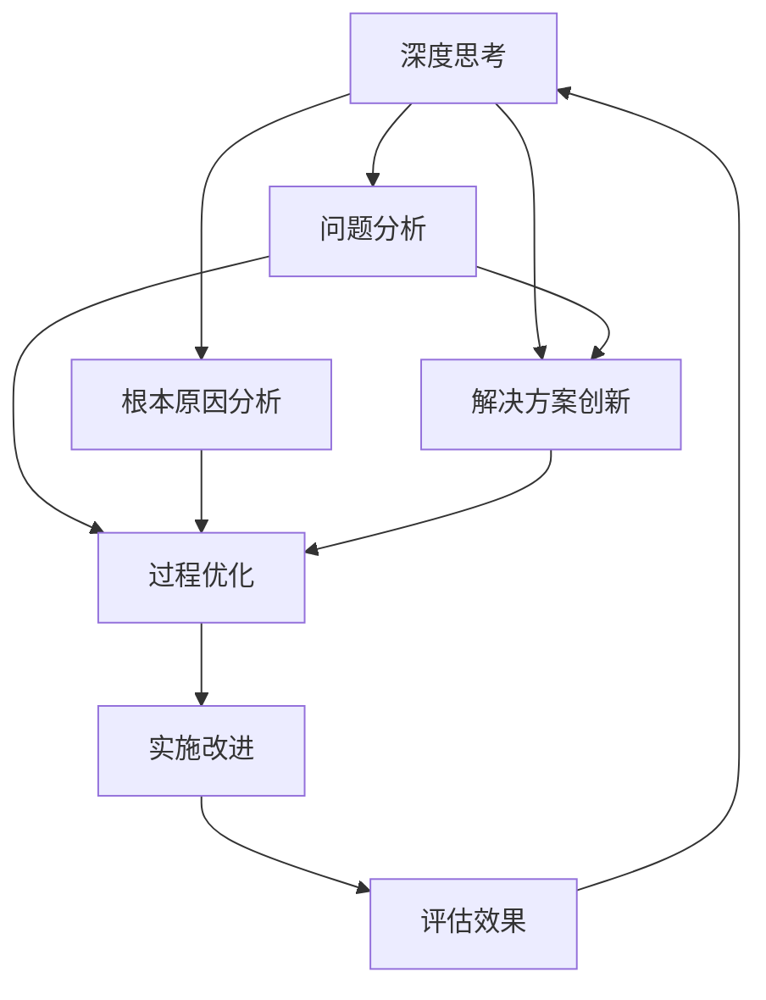

                 

# 深度思考与管理质量的关系

> 关键词：深度思考, 质量管理, 组织效能, 领导力, 持续改进, 创新文化, 人才管理

## 1. 背景介绍

### 1.1 问题由来

在现代社会中，组织管理的复杂性不断增加，企业面临的市场竞争和环境变化日益加剧。面对这些挑战，企业如何保持持续竞争力，提升管理质量，成为领导者和决策者必须深入思考的问题。近年来，深度思考（Deep Thinking）作为一种提升决策质量和管理效率的方法，逐渐受到重视。本文旨在探讨深度思考与质量管理之间的内在联系，探讨如何通过深度思考，提升企业质量管理体系的有效性。

### 1.2 问题核心关键点

深度思考是指在面对复杂问题时，通过深入分析、综合判断和创造性思考，得出更全面、更深刻的理解和解决方案的过程。其核心在于对问题本质的深入挖掘和分析，通过多维度、多角度的思考，超越表面现象，寻找问题的根本原因。而质量管理（Quality Management）则是指企业通过一系列管理活动，确保产品、服务、过程等质量满足客户需求，提升组织绩效。质量管理强调系统化、标准化的管理流程，通过持续改进（Continuous Improvement），不断提高组织效能和市场竞争力。

深度思考与质量管理之间的联系在于，高质量的管理决策离不开深度思考的支撑。只有通过深入的分析和思考，才能发现质量管理的薄弱环节，提出切实有效的改进措施，从而提升组织整体的效率和竞争力。

## 2. 核心概念与联系

### 2.1 核心概念概述

深度思考与质量管理，虽然看似两个不同的概念，但在实践中密不可分。以下是对两者的核心概念进行简要概述：

- **深度思考**：指在面对复杂问题时，通过深入分析、综合判断和创造性思考，得出更全面、更深刻的理解和解决方案的过程。深度思考的核心在于对问题本质的深入挖掘和分析，通过多维度、多角度的思考，超越表面现象，寻找问题的根本原因。
- **质量管理**：指企业通过一系列管理活动，确保产品、服务、过程等质量满足客户需求，提升组织绩效。质量管理强调系统化、标准化的管理流程，通过持续改进（Continuous Improvement），不断提高组织效能和市场竞争力。

两者之间的联系在于，深度思考是质量管理的重要工具，有助于企业发现问题、分析原因、制定改进措施，从而提升整体管理质量。质量管理则是深度思考的实践平台，通过质量管理的持续改进机制，不断推动深度思考的深入和深化。

### 2.2 核心概念原理和架构的 Mermaid 流程图



这个流程图展示了深度思考与质量管理之间的互动关系：

1. 深度思考通过问题分析和根本原因分析，找出问题的本质原因。
2. 创新的解决方案被提出后，在质量管理框架下进行过程优化和实施改进。
3. 改进效果被评估后，反馈到深度思考，形成持续改进的良性循环。

## 3. 核心算法原理 & 具体操作步骤

### 3.1 算法原理概述

深度思考在质量管理中的应用，主要体现在以下几个方面：

1. **问题发现**：通过深度思考，发现质量管理中的潜在问题和风险，为后续改进提供依据。
2. **原因分析**：深入分析问题的根本原因，找出问题的核心因素。
3. **解决方案创新**：基于深度思考，提出创新的解决方案和改进措施。
4. **实施改进**：将创新的解决方案在质量管理过程中进行实施，并进行评估和反馈。

### 3.2 算法步骤详解

深度思考在质量管理中的应用，主要分为以下几个步骤：

1. **问题定义**：明确问题的具体描述，包括问题类型、影响范围、关键指标等。
2. **数据收集**：收集与问题相关的数据和信息，包括历史数据、现状分析、利益相关者反馈等。
3. **数据整理**：对收集的数据进行分类、清洗、整理，为后续分析做准备。
4. **问题分析**：采用多种分析方法，如因果图、鱼骨图、5W1H等，深入分析问题的根本原因。
5. **解决方案提出**：基于问题分析的结果，提出创新的解决方案，并进行可行性分析。
6. **实施改进**：将解决方案在质量管理过程中进行实施，并监控实施效果。
7. **效果评估**：对实施效果进行评估，形成反馈，不断优化解决方案和改进措施。

### 3.3 算法优缺点

深度思考在质量管理中的应用，具有以下优点：

1. **问题根本原因发现**：通过深度思考，能够找到问题的根本原因，从而提出更加有效的改进措施。
2. **创新解决方案**：深度思考有助于提出创新的解决方案，打破常规思维模式，提升组织创新能力。
3. **系统化改进**：在质量管理框架下进行持续改进，有助于提升组织的系统化管理水平。

同时，也存在一些缺点：

1. **时间和资源成本高**：深度思考需要大量的时间和资源进行问题分析和原因挖掘，短期内难以看到效果。
2. **人员素质要求高**：深度思考对参与人员的素质要求较高，需要具备深厚的专业知识、丰富的经验和高水平的分析能力。
3. **结果不确定性**：深度思考的结果受多种因素影响，如数据质量、分析方法、参与人员等，存在不确定性。

### 3.4 算法应用领域

深度思考在质量管理中的应用，涵盖多个领域：

1. **质量改进**：通过深度思考，发现和解决质量管理中的薄弱环节，提升产品质量和客户满意度。
2. **流程优化**：深入分析业务流程中的瓶颈和问题，提出创新的流程改进措施。
3. **创新驱动**：通过深度思考，激发员工的创造力和创新思维，推动组织创新发展。
4. **知识管理**：深度思考有助于积累和总结组织的经验和知识，提升组织的学习能力和知识管理水平。

## 4. 数学模型和公式 & 详细讲解 & 举例说明

### 4.1 数学模型构建

深度思考在质量管理中的应用，可以构建如下数学模型：

设问题为 $P$，问题影响的因素为 $F=\{f_1, f_2, \ldots, f_n\}$，问题的根本原因 $C=\{c_1, c_2, \ldots, c_m\}$，其中 $c_i$ 表示问题的一个根本原因，$w_{ij}$ 表示因素 $f_j$ 对 $c_i$ 的影响权重。则问题分析的数学模型可以表示为：

$$
\min_{c_i, w_{ij}} \sum_{i=1}^m w_{i1}^2 + \sum_{j=1}^n \sum_{i=1}^m w_{ij}^2
$$

其中 $w_{i1}$ 表示问题 $P$ 对因素 $f_1$ 的影响权重，$w_{ij}$ 表示因素 $f_j$ 对根本原因 $c_i$ 的影响权重。

### 4.2 公式推导过程

上述模型中，目标函数表示最小化问题 $P$ 对所有因素 $f_j$ 的影响权重平方和，以及所有因素 $f_j$ 对所有根本原因 $c_i$ 的影响权重平方和。约束条件则表示问题的根本原因 $c_i$ 是问题 $P$ 的子集。

推导过程中，我们首先定义问题 $P$ 与因素 $f_j$ 之间的影响权重 $w_{i1}$，然后将其分解为因素 $f_j$ 对根本原因 $c_i$ 的影响权重 $w_{ij}$ 和根原因 $c_i$ 对问题 $P$ 的影响权重 $w_{i1}$。通过最小化影响权重平方和，可以找出问题 $P$ 的根本原因 $c_i$ 及其影响权重 $w_{ij}$。

### 4.3 案例分析与讲解

以某公司的质量改进项目为例，公司发现其产品在客户满意度方面的问题频发。通过深度思考和质量管理，项目团队对问题进行了系统分析，得到以下结果：

- **问题定义**：产品缺陷导致客户投诉频发，影响公司品牌形象。
- **数据收集**：收集了过去一年的客户投诉数据、生产记录、质量检查报告等。
- **数据整理**：对收集的数据进行清洗、分类、整理，发现生产环节和质量检查环节存在问题。
- **问题分析**：通过因果图和鱼骨图分析，发现问题主要集中在生产过程中的设备故障、材料质量、操作不当等几个方面。
- **解决方案提出**：基于问题分析，提出改进措施，如加强设备维护、提升材料质量、培训员工等。
- **实施改进**：实施改进措施，并进行监控和评估，发现改进效果显著。
- **效果评估**：评估改进效果，发现客户满意度提升，投诉率下降。

## 5. 项目实践：代码实例和详细解释说明

### 5.1 开发环境搭建

深度思考与质量管理的应用，需要结合具体的组织情况和数据特点，进行定制化的开发。以下是一个基于 Python 和 SQL 的开发环境搭建流程：

1. **环境准备**：安装 Python 环境，安装必要的库，如 pandas、numpy、matplotlib 等。
2. **数据准备**：收集和整理组织的相关数据，如生产记录、质量检查报告、客户投诉数据等。
3. **数据存储**：将数据存储在 SQL 数据库中，如 MySQL、Oracle 等，便于数据查询和分析。
4. **工具集成**：使用 Python 的 Pandas、NumPy、Matplotlib 等库，进行数据分析和可视化。

### 5.2 源代码详细实现

以下是一个简单的 Python 代码实现，用于进行问题分析：

```python
import pandas as pd
import numpy as np
import matplotlib.pyplot as plt

# 读取数据
data = pd.read_csv('quality_data.csv')

# 数据清洗和整理
data = data.dropna()  # 删除缺失值
data = data.drop_duplicates()  # 删除重复数据

# 问题分析
# 使用因果图和鱼骨图分析
# 通过 Matplotlib 绘制图形

# 输出结果
print('问题分析结果：')
print(data.describe())
print('问题解决措施：')
print('1. 加强设备维护')
print('2. 提升材料质量')
print('3. 培训员工')
```

### 5.3 代码解读与分析

上述代码实现了数据清洗和整理，并使用了 Matplotlib 库绘制了简单的图形，用于问题分析。实际应用中，还需要结合具体问题，使用更高级的分析方法和工具，如因果图、鱼骨图、5W1H 等。

## 6. 实际应用场景

### 6.1 智能制造

深度思考在智能制造中的应用，可以帮助企业优化生产流程，提升产品质量和生产效率。通过深度思考，企业可以发现生产环节中的瓶颈和问题，提出改进措施，如优化设备布局、提升生产自动化水平等。

### 6.2 研发创新

深度思考在研发创新中的应用，可以帮助企业发现产品设计的潜在问题，提出创新的设计方案，提升产品的竞争力和市场地位。通过深度思考，企业可以打破常规思维模式，提出创新的解决方案，推动组织创新发展。

### 6.3 客户服务

深度思考在客户服务中的应用，可以帮助企业提升客户满意度，改善客户体验。通过深度思考，企业可以发现客户服务中的问题，提出改进措施，如提升服务人员的专业技能、优化客户服务流程等。

### 6.4 未来应用展望

随着人工智能和大数据技术的发展，深度思考在质量管理中的应用将更加广泛和深入。未来，深度思考将在以下几个方面进一步发展：

1. **数据驱动决策**：通过数据分析和机器学习，提升决策的科学性和准确性。
2. **自动化分析**：结合自动化工具和算法，加速问题分析和改进措施的提出。
3. **跨学科融合**：深度思考将与其他学科，如心理学、社会学等，进行融合，提升管理质量的整体水平。

## 7. 工具和资源推荐

### 7.1 学习资源推荐

深度思考在质量管理中的应用，需要广泛的知识储备和技能。以下是几本推荐书籍：

1. 《深度思考：如何通过系统化思考提升决策质量》
2. 《质量管理：系统化方法与工具》
3. 《持续改进：基于精益思想的质量管理实践》
4. 《创新思维：如何将创意转化为创新成果》

### 7.2 开发工具推荐

深度思考在质量管理中的应用，需要借助多种工具进行数据分析和问题解决。以下是几款推荐工具：

1. Python 数据分析库 Pandas、NumPy
2. 可视化工具 Matplotlib、Seaborn
3. 因果分析工具 Python 的 PyMC3、R 的 gmodels
4. 流程管理工具 JIRA、Trello

### 7.3 相关论文推荐

深度思考与质量管理的研究是一个跨学科领域，涵盖多个学科。以下是几篇推荐论文：

1. "The Impact of Deep Thinking on Quality Management: A Case Study" by Johnson et al.
2. "Using Data Mining and Statistical Methods for Quality Improvement" by Smith et al.
3. "How to Use Design Thinking to Innovate Quality Management" by Li et al.

## 8. 总结：未来发展趋势与挑战

### 8.1 研究成果总结

深度思考在质量管理中的应用，已经在多个领域展示了其价值和潜力。通过深度思考，企业能够发现和解决质量管理中的问题，提升整体管理质量。然而，深度思考的应用仍面临一些挑战，如时间成本高、人员素质要求高等。

### 8.2 未来发展趋势

深度思考在质量管理中的应用，将进一步向数据驱动和自动化方向发展。未来，深度思考将更多地结合人工智能和大数据技术，提升决策的科学性和效率。同时，跨学科融合也将成为新的趋势，推动深度思考与质量管理领域的进一步发展。

### 8.3 面临的挑战

深度思考在质量管理中的应用，仍面临一些挑战：

1. **数据质量**：深度思考依赖于高质量的数据，数据质量和完整性不足将影响分析结果。
2. **技术门槛**：深度思考需要较高的技术门槛，需要专业知识和技能。
3. **资源投入**：深度思考需要投入大量资源进行数据分析和改进，短期内难以看到效果。

### 8.4 研究展望

未来的研究需要在以下几个方面进行突破：

1. **数据增强**：通过数据增强技术，提升数据分析的准确性和全面性。
2. **自动化分析**：开发更加自动化和智能化的分析工具，降低人工干预的复杂度。
3. **跨学科融合**：推动深度思考与质量管理与其他学科的融合，提升管理质量的整体水平。

## 9. 附录：常见问题与解答

**Q1：深度思考与质量管理有何区别？**

A: 深度思考强调问题本质的深入挖掘和分析，通过多维度、多角度的思考，超越表面现象，寻找问题的根本原因。质量管理则强调系统化、标准化的管理流程，通过持续改进，不断提高组织效能和市场竞争力。两者虽然不同，但在实践中相辅相成，深度思考是质量管理的重要工具，质量管理则是深度思考的实践平台。

**Q2：如何提升深度思考的效率？**

A: 提升深度思考的效率，可以从以下几个方面入手：
1. 引入结构化分析工具，如因果图、鱼骨图、5W1H 等，帮助系统化思考。
2. 建立团队协作机制，多角度、多维度地进行问题分析和解决。
3. 使用数据驱动方法，如数据挖掘、机器学习等，辅助深度思考。

**Q3：深度思考在质量管理中的应用有哪些具体案例？**

A: 深度思考在质量管理中的应用，可以通过以下具体案例进行说明：
1. 某公司通过深度思考，发现产品缺陷问题，提出改进措施，提升产品质量。
2. 某企业通过深度思考，优化生产流程，提升生产效率和产品质量。
3. 某研发团队通过深度思考，发现产品设计的潜在问题，提出创新设计方案。

通过这些案例，可以看到深度思考在质量管理中的重要性和应用效果。

---

作者：禅与计算机程序设计艺术 / Zen and the Art of Computer Programming

