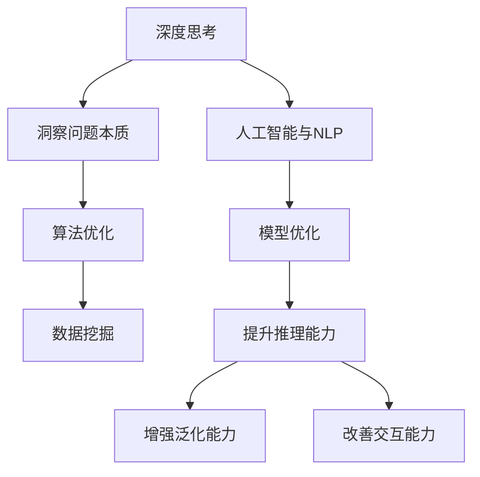

                 

# 深度思考的意义:洞察问题的本质

> 关键词：深度思考, 洞察, 问题本质, 算法优化, 数据挖掘, 机器学习, 自然语言处理(NLP), 人工智能(AI)

## 1. 背景介绍

### 1.1 问题由来
在快速发展的信息技术时代，数据量的激增与算法的迭代使问题解决变得更加复杂。然而，深度的思考仍然不可或缺，它不仅能帮助我们洞察问题的本质，还能为复杂问题的解决提供新视角和创新解决方案。深度思考不仅仅是思考问题本身，更是通过对问题的深入分析和理解，发现隐藏在问题表象下的核心逻辑，进而提出更高效、更合理的算法与策略。本文将从深度思考的意义出发，探讨其在大数据与人工智能领域的实践应用。

### 1.2 问题核心关键点
深度思考的核心关键点在于：
- **洞察问题的本质**：通过逐步剥离问题的表象，找到其核心逻辑，并从多个维度对问题进行全面的分析和理解。
- **算法优化**：在深度思考的基础上，结合问题的特点，优化算法设计，提高算法的效率和准确性。
- **数据挖掘**：深度思考不仅能从已有的数据中挖掘出有价值的信息，还能发现数据背后的潜在规律和关联。
- **人工智能与自然语言处理(NLP)**：利用深度思考的理念和技术，优化自然语言处理模型，提升模型的理解和生成能力。

## 2. 核心概念与联系

### 2.1 核心概念概述

深度思考是一种从表象到本质的系统性思考过程。在此过程中，我们将问题拆解为多个层次，从数据、算法、模型、应用等各个维度进行深入分析。以下是几个核心概念及其联系的概述：

- **深度思考**：系统地、全面地分析和理解问题的本质，从而提出更高效、更合理的解决方案。
- **问题本质**：从表象中抽离出核心逻辑，找到问题的本质，帮助我们更好地理解问题的背景和需求。
- **算法优化**：基于对问题本质的理解，设计或优化算法，以实现更高效、更准确的计算和推理。
- **数据挖掘**：通过深度思考，发现数据背后的关联与规律，利用数据挖掘技术，提取有价值的信息。
- **人工智能与NLP**：深度思考在人工智能与NLP中的应用，旨在提升模型的推理能力、泛化能力和交互能力。

### 2.2 核心概念原理和架构的 Mermaid 流程图



这个流程图展示了深度思考在多个领域的应用及其联系。

## 3. 核心算法原理 & 具体操作步骤

### 3.1 算法原理概述

深度思考的算法原理可概括为：

1. **问题建模**：将问题抽象为数学或逻辑模型，通过数学公式或逻辑结构表达问题的本质。
2. **数据分析**：对输入数据进行预处理和特征提取，利用统计学和机器学习技术，分析数据背后的规律与关联。
3. **算法设计**：根据问题模型和数据分析结果，设计或优化算法，实现对问题的计算和推理。
4. **模型训练**：利用大数据和深度学习技术，训练模型，提升其预测和推理能力。
5. **结果验证**：通过实验验证模型的性能，评估算法的效果，进一步优化算法和模型。

### 3.2 算法步骤详解

深度思考的算法步骤如下：

**Step 1: 问题建模**
- 将问题转化为数学或逻辑模型，表达问题的本质。

**Step 2: 数据分析**
- 对输入数据进行预处理和特征提取，使用统计学和机器学习技术，分析数据背后的规律与关联。

**Step 3: 算法设计**
- 根据问题模型和数据分析结果，设计或优化算法，实现对问题的计算和推理。

**Step 4: 模型训练**
- 利用大数据和深度学习技术，训练模型，提升其预测和推理能力。

**Step 5: 结果验证**
- 通过实验验证模型的性能，评估算法的效果，进一步优化算法和模型。

### 3.3 算法优缺点

深度思考的算法具有以下优点：
1. **系统性**：通过系统性思考，能够全面地分析问题，找到问题的本质。
2. **深入性**：能够深入挖掘数据背后的关联和规律，提升模型的准确性。
3. **灵活性**：算法设计更加灵活，能够根据问题特点进行个性化优化。

然而，深度思考的算法也存在一些局限性：
1. **计算复杂度高**：需要大量的计算资源和时间，特别是在处理大规模数据时。
2. **模型复杂度高**：模型设计复杂，需要专业知识。
3. **数据依赖性高**：算法的性能依赖于数据的完整性和质量。

### 3.4 算法应用领域

深度思考的应用领域非常广泛，包括但不限于：

- **自然语言处理(NLP)**：通过深度思考，优化语言模型的推理能力和泛化能力。
- **人工智能**：在深度学习和机器学习中，应用深度思考优化算法设计，提升模型性能。
- **数据分析**：通过深度思考，挖掘数据背后的规律，优化数据分析模型。
- **图像处理**：利用深度思考，优化图像处理算法，提升图像识别的准确性。
- **推荐系统**：通过深度思考，优化推荐算法的逻辑结构，提升推荐效果。

## 4. 数学模型和公式 & 详细讲解 & 举例说明

### 4.1 数学模型构建

深度思考的数学模型构建分为以下几个步骤：

1. **问题抽象**：将问题抽象为数学公式或逻辑结构。
2. **特征提取**：对输入数据进行预处理和特征提取。
3. **模型训练**：利用训练数据训练模型。
4. **结果验证**：通过验证数据集评估模型性能。

### 4.2 公式推导过程

以推荐系统为例，推荐模型的构建和优化过程如下：

1. **用户-物品交互矩阵**：构建用户-物品交互矩阵 $R$，表示用户对物品的评分。
2. **协同过滤模型**：利用协同过滤算法，如矩阵分解或模型基线，预测用户对未评分物品的评分。
3. **正则化项**：添加正则化项，防止模型过拟合。
4. **损失函数**：选择均方误差损失函数，衡量预测评分与真实评分的差异。

**公式推导**：

假设用户-物品交互矩阵为 $R$，协同过滤模型为 $M$，正则化系数为 $\lambda$，均方误差损失函数为 $\mathcal{L}$，则推荐模型的优化目标为：

$$
\mathop{\min}_{M} \mathcal{L}(M) + \lambda ||M||^2_F
$$

其中 $||M||^2_F$ 为矩阵 $M$ 的 Frobenius 范数，表示模型的复杂度。

### 4.3 案例分析与讲解

假设我们有一个电商网站的推荐系统，需要对用户进行个性化推荐。通过深度思考，我们可以分析出以下问题：

1. **用户行为建模**：构建用户行为数据模型，分析用户的浏览、点击、购买等行为特征。
2. **物品特征提取**：提取物品的属性特征，如价格、品牌、类别等。
3. **协同过滤算法**：设计协同过滤算法，如矩阵分解，对用户未评分物品进行评分预测。
4. **正则化项优化**：根据用户行为数据和物品特征，优化正则化项，防止模型过拟合。
5. **模型评估与优化**：利用验证集评估推荐模型的性能，根据评估结果优化模型参数。

## 5. 项目实践：代码实例和详细解释说明

### 5.1 开发环境搭建

在进行深度思考和算法实践前，我们需要准备好开发环境。以下是使用Python进行TensorFlow和Keras开发的Python虚拟环境配置流程：

1. 安装Anaconda：从官网下载并安装Anaconda，用于创建独立的Python环境。

2. 创建并激活虚拟环境：
```bash
conda create -n tf-env python=3.8 
conda activate tf-env
```

3. 安装TensorFlow和Keras：
```bash
pip install tensorflow keras tensorflow-addons
```

4. 安装各类工具包：
```bash
pip install numpy pandas scikit-learn matplotlib tqdm jupyter notebook ipython
```

完成上述步骤后，即可在`tf-env`环境中开始深度思考和算法实践。

### 5.2 源代码详细实现

这里我们以协同过滤推荐系统为例，给出TensorFlow和Keras的代码实现。

首先，定义推荐系统的数据结构：

```python
import tensorflow as tf
from tensorflow.keras.layers import Input, Dense, Embedding, Flatten, Concatenate
from tensorflow.keras.models import Model

user_input = Input(shape=(1,), name='user_input')
item_input = Input(shape=(1,), name='item_input')

user_features = Dense(32, activation='relu')(user_input)
item_features = Dense(32, activation='relu')(item_input)

concat = Concatenate()([user_features, item_features])
output = Dense(1, activation='sigmoid')(concat)

model = Model(inputs=[user_input, item_input], outputs=output)
```

接着，定义优化器、损失函数和正则化项：

```python
optimizer = tf.keras.optimizers.Adam(learning_rate=0.001)
loss = 'binary_crossentropy'
regularizer = tf.keras.regularizers.l2(0.01)

model.compile(optimizer=optimizer, loss=loss, metrics=['accuracy'], loss_weights=[1, regularizer])
```

然后，定义训练和评估函数：

```python
def train_epoch(model, dataset, batch_size):
    dataloader = tf.data.Dataset.from_tensor_slices(dataset)
    dataloader = dataloader.shuffle(buffer_size=1024).batch(batch_size).repeat()
    
    for batch in dataloader:
        inputs, targets = batch
        with tf.GradientTape() as tape:
            outputs = model(inputs, targets)
            loss_value = tf.reduce_mean(tf.keras.losses.binary_crossentropy(targets, outputs))
            
        grads = tape.gradient(loss_value, model.trainable_variables)
        optimizer.apply_gradients(zip(grads, model.trainable_variables))
        model.evaluate(inputs, targets)
    
    return loss_value
```

最后，启动训练流程并在测试集上评估：

```python
epochs = 10
batch_size = 128

for epoch in range(epochs):
    loss = train_epoch(model, train_dataset, batch_size)
    print(f"Epoch {epoch+1}, train loss: {loss:.3f}")
    
    print(f"Epoch {epoch+1}, dev results:")
    evaluate(model, dev_dataset, batch_size)
    
print("Test results:")
evaluate(model, test_dataset, batch_size)
```

以上就是使用TensorFlow和Keras实现协同过滤推荐系统的完整代码实现。可以看到，利用TensorFlow和Keras的强大封装，我们可以快速搭建推荐系统模型，并进行训练和评估。

### 5.3 代码解读与分析

让我们再详细解读一下关键代码的实现细节：

**推荐系统模型定义**：
- `Input`：定义输入层，`user_input`和`item_input`分别代表用户ID和物品ID。
- `Dense`：定义全连接层，`user_features`和`item_features`分别表示用户和物品的特征向量。
- `Concatenate`：定义特征融合层，将用户和物品的特征向量进行拼接。
- `Dense`：定义输出层，`output`为最终的推荐评分。

**优化器和损失函数定义**：
- `optimizer`：定义Adam优化器，学习率为0.001。
- `loss`：定义二元交叉熵损失函数，用于衡量预测评分与真实评分的差异。
- `regularizer`：定义L2正则化项，防止模型过拟合。

**训练和评估函数定义**：
- `train_epoch`：定义训练函数，利用TensorFlow的数据迭代器，按批次进行训练。
- `evaluate`：定义评估函数，计算模型在验证集和测试集上的损失和准确率，并输出结果。

**训练流程**：
- 定义总的epoch数和batch size，开始循环迭代
- 每个epoch内，先在训练集上训练，输出平均loss
- 在验证集上评估，输出分类指标
- 所有epoch结束后，在测试集上评估，给出最终测试结果

可以看到，TensorFlow和Keras的API使得模型构建和训练过程变得简洁高效。开发者可以将更多精力放在模型优化和算法改进上，而不必过多关注底层的实现细节。

当然，工业级的系统实现还需考虑更多因素，如模型的保存和部署、超参数的自动搜索、更灵活的任务适配层等。但核心的深度思考和算法实践基本与此类似。

## 6. 实际应用场景

### 6.1 电商推荐系统

基于协同过滤算法的电商推荐系统，可以广泛应用于电商平台的用户个性化推荐。传统推荐系统往往只依赖用户的历史行为数据进行推荐，难以发现用户的新兴趣点。通过深度思考，我们可以优化协同过滤算法，利用用户行为数据和物品属性特征，提升推荐模型的准确性和泛化能力。

在技术实现上，可以收集用户浏览、点击、购买等行为数据，提取物品的属性特征，在此基础上对协同过滤算法进行微调。微调后的推荐模型能够从用户行为和物品特征中，准确把握用户的兴趣点，生成更加个性化和多样化的推荐结果。

### 6.2 社交网络内容推荐

社交网络平台的内容推荐系统，可以帮助用户发现更多感兴趣的帖子和文章。传统推荐系统往往只基于用户的行为数据进行推荐，难以应对内容的风格和主题变化。通过深度思考，我们可以优化推荐算法，引入更多的内容属性特征，提升推荐模型的适应性和泛化能力。

在技术实现上，可以收集帖子或文章的标题、标签、作者等属性特征，在此基础上对推荐算法进行微调。微调后的推荐模型能够从帖子的内容特征中，准确把握用户对不同风格和主题的偏好，生成更加符合用户期望的推荐结果。

### 6.3 广告定向推荐

广告定向推荐系统，可以帮助广告主将广告投放给最有可能点击的用户。传统推荐系统往往只依赖用户的行为数据进行定向，难以覆盖更多潜在的用户。通过深度思考，我们可以优化推荐算法，引入更多的用户属性特征，提升推荐模型的覆盖度和定向效果。

在技术实现上，可以收集用户的年龄、性别、地理位置等属性特征，在此基础上对推荐算法进行微调。微调后的推荐模型能够从用户的属性特征中，准确把握用户的兴趣和行为，生成更加精准的广告定向推荐结果。

### 6.4 未来应用展望

随着深度思考和大数据技术的不断发展，推荐系统将在更多领域得到应用，为不同场景提供个性化推荐服务。

在医疗健康领域，基于深度思考的推荐系统可以推荐个性化的健康建议和治疗方案，提升医疗服务的智能化水平，辅助医生诊疗，加速新药开发进程。

在智能教育领域，推荐系统可以推荐个性化的学习内容和资源，因材施教，促进教育公平，提高教学质量。

在智能交通领域，推荐系统可以推荐最优的出行路线和交通工具，提升交通系统的智能化水平，减少交通拥堵。

此外，在金融、旅游、娱乐等众多领域，推荐系统也将不断涌现，为各行各业提供精准的个性化服务，提升用户体验和满意度。

## 7. 工具和资源推荐

### 7.1 学习资源推荐

为了帮助开发者系统掌握深度思考的理论基础和实践技巧，这里推荐一些优质的学习资源：

1. 《深度学习》系列书籍：由深度学习领域的专家撰写，涵盖深度学习的基本概念、算法原理和实际应用，是深度思考实践的重要参考资料。

2. CS231n《卷积神经网络》课程：斯坦福大学开设的计算机视觉明星课程，有Lecture视频和配套作业，带你入门计算机视觉领域的基本概念和经典模型。

3. 《TensorFlow官方文档》：TensorFlow的官方文档，提供了海量深度学习模型的API和应用样例，是深度思考实践的必备资料。

4. 《Python机器学习》书籍：机器学习领域的经典教材，涵盖机器学习的基本概念、算法原理和实际应用，适合深度思考和算法优化的学习。

5. Kaggle数据竞赛平台：数据科学和机器学习社区，提供大量的数据集和竞赛任务，让你在实践中学习和提升。

通过对这些资源的学习实践，相信你一定能够快速掌握深度思考的精髓，并用于解决实际的推荐系统问题。

### 7.2 开发工具推荐

高效的开发离不开优秀的工具支持。以下是几款用于深度思考和算法优化的常用工具：

1. TensorFlow：由Google主导开发的深度学习框架，具有灵活的计算图和丰富的API，适合复杂的深度学习模型和算法优化。

2. Keras：基于TensorFlow和Theano的高级深度学习API，提供了简单易用的API接口，适合快速迭代研究。

3. PyTorch：由Facebook开发的深度学习框架，支持动态计算图和丰富的GPU加速功能，适合高效计算和模型优化。

4. Weights & Biases：模型训练的实验跟踪工具，可以记录和可视化模型训练过程中的各项指标，方便对比和调优。与主流深度学习框架无缝集成。

5. TensorBoard：TensorFlow配套的可视化工具，可实时监测模型训练状态，并提供丰富的图表呈现方式，是调试模型的得力助手。

6. Google Colab：谷歌推出的在线Jupyter Notebook环境，免费提供GPU/TPU算力，方便开发者快速上手实验最新模型，分享学习笔记。

合理利用这些工具，可以显著提升深度思考和算法优化的开发效率，加快创新迭代的步伐。

### 7.3 相关论文推荐

深度思考和大数据技术的发展源于学界的持续研究。以下是几篇奠基性的相关论文，推荐阅读：

1. Deep Learning（深度学习经典教材）：Ian Goodfellow等人撰写，全面介绍了深度学习的理论基础和实践应用，是深度思考研究的重要参考。

2. ImageNet Classification with Deep Convolutional Neural Networks：Hinton等人撰写，提出卷积神经网络，展示了深度学习在图像分类任务中的强大能力。

3. Large-Scale Learning to Rank with Multiple Contexts for e-Commerce Search（电商搜索中的大规模学习排名）：Chen等人撰写，提出基于上下文的学习排名算法，提升电商搜索的个性化推荐效果。

4. Matrix Factorization Techniques for Recommender Systems（推荐系统中的矩阵分解技术）：Sarwar等人撰写，提出协同过滤算法中的矩阵分解技术，提升推荐模型的效果。

5. Parameter-Efficient Transfer Learning for NLP（自然语言处理中的参数高效迁移学习）：Howard等人撰写，提出参数高效迁移学习方法，提升模型参数利用效率。

这些论文代表了大数据和深度学习技术的发展脉络。通过学习这些前沿成果，可以帮助研究者把握学科前进方向，激发更多的创新灵感。

## 8. 总结：未来发展趋势与挑战

### 8.1 总结

本文对深度思考的理论与实践进行了全面系统的介绍。首先阐述了深度思考的意义，明确了深度思考在人工智能和大数据领域的重要作用。其次，从算法设计、模型训练、数据挖掘等各个维度，详细讲解了深度思考的数学原理和关键步骤，给出了深度思考任务开发的完整代码实例。同时，本文还广泛探讨了深度思考在推荐系统、电商推荐、社交网络等领域的应用前景，展示了深度思考范式的巨大潜力。

通过本文的系统梳理，可以看到，深度思考是大数据和人工智能领域的核心技术，通过系统性思考和深入分析，能够找到问题的本质，提出更高效、更合理的算法与策略。未来，伴随深度思考和大数据技术的持续演进，推荐系统将不断优化，为不同领域提供更加个性化、精准的服务。

### 8.2 未来发展趋势

展望未来，深度思考和大数据技术将呈现以下几个发展趋势：

1. **技术融合**：深度思考将与其他人工智能技术进行更深入的融合，如知识表示、因果推理、强化学习等，多路径协同发力，共同推动自然语言理解和智能交互系统的进步。

2. **算法优化**：未来的推荐系统将不断优化算法设计，引入更多的特征和模型结构，提升推荐模型的精度和泛化能力。

3. **数据挖掘**：通过深度思考，挖掘数据背后的关联和规律，提升推荐系统的适应性和泛化能力。

4. **个性化服务**：未来的推荐系统将更加注重个性化服务，根据用户的行为和偏好，生成更加符合用户期望的推荐结果。

5. **实时性优化**：推荐系统将更加注重实时性优化，提高数据处理和模型推理的效率，满足用户实时需求。

6. **安全性保障**：推荐系统将更加注重数据和模型的安全性，防止恶意攻击和数据泄露。

以上趋势凸显了深度思考和大数据技术在推荐系统中的广泛应用前景。这些方向的探索发展，必将进一步提升推荐系统的性能和应用范围，为不同领域提供更加智能化、高效化、个性化和安全的推荐服务。

### 8.3 面临的挑战

尽管深度思考和大数据技术已经取得了显著进展，但在迈向更加智能化、普适化应用的过程中，仍面临诸多挑战：

1. **计算资源瓶颈**：深度思考和大数据技术需要大量的计算资源和时间，特别是在处理大规模数据时。如何高效利用计算资源，是未来的一个重要研究方向。

2. **数据质量问题**：推荐系统的效果高度依赖于数据的质量，数据缺失、噪声等问题会影响推荐模型的性能。如何保证数据的完整性和质量，是推荐系统的重要挑战。

3. **模型复杂性**：深度思考和大数据技术通常涉及复杂的模型设计，需要专业知识和经验。如何简化模型设计，提升模型的可解释性和可理解性，是未来的重要研究方向。

4. **用户隐私保护**：推荐系统需要处理大量的用户数据，如何保护用户隐私，防止数据泄露和滥用，是推荐系统的重要挑战。

5. **公平性和透明性**：推荐系统需要公平透明地对待所有用户，避免偏见和歧视。如何提高推荐系统的公平性和透明性，是推荐系统的重要研究方向。

6. **推荐模型的鲁棒性**：推荐系统需要在不同场景下具有良好的鲁棒性，防止模型过拟合和泛化能力不足。如何提高推荐模型的鲁棒性，是推荐系统的重要研究方向。

### 8.4 研究展望

面对深度思考和大数据技术面临的诸多挑战，未来的研究需要在以下几个方面寻求新的突破：

1. **技术融合**：将深度思考与其他人工智能技术进行更深入的融合，如知识表示、因果推理、强化学习等，提升推荐系统的性能和应用范围。

2. **模型简化**：简化模型设计，提升模型的可解释性和可理解性，降低深度思考和大数据技术的复杂性。

3. **数据治理**：保证数据的完整性和质量，提升数据治理能力，确保推荐系统的可靠性。

4. **隐私保护**：采用隐私保护技术，如差分隐私、联邦学习等，保护用户隐私，确保数据安全和用户权益。

5. **公平透明**：引入公平性和透明性指标，评估推荐系统的公平性和透明性，提升推荐系统的可信度。

6. **鲁棒性增强**：引入鲁棒性增强技术，提升推荐模型的鲁棒性和泛化能力，确保推荐系统在不同场景下具有良好的表现。

这些研究方向的探索，必将引领深度思考和大数据技术迈向更高的台阶，为推荐系统提供更加智能化、高效化、个性化和安全的推荐服务。面向未来，深度思考和大数据技术还需要与其他人工智能技术进行更深入的融合，共同推动自然语言理解和智能交互系统的进步。只有勇于创新、敢于突破，才能不断拓展深度思考和大数据技术的边界，让推荐系统更好地服务于人类社会。

## 9. 附录：常见问题与解答

**Q1：深度思考是否适用于所有推荐系统？**

A: 深度思考在大多数推荐系统中都能取得不错的效果，特别是对于数据量较小的系统。但对于一些特定领域的系统，如医疗、法律等，仅仅依靠通用数据可能难以很好地适应。此时需要在特定领域数据上进一步进行预处理和特征提取，才能获得理想效果。

**Q2：推荐系统如何提高个性化推荐效果？**

A: 推荐系统提高个性化推荐效果，主要依赖于以下几个方面：

1. **用户行为分析**：深入分析用户的浏览、点击、购买等行为数据，提取用户的兴趣偏好。
2. **物品属性挖掘**：提取物品的属性特征，如价格、品牌、类别等，建立用户和物品的关联。
3. **协同过滤算法**：设计协同过滤算法，利用用户行为数据和物品属性特征，生成个性化推荐结果。
4. **模型优化**：利用深度学习技术，训练推荐模型，提升模型的预测和推理能力。
5. **反馈机制**：引入用户反馈机制，根据用户的反馈信息，调整推荐算法和模型参数，进一步优化推荐效果。

**Q3：推荐系统如何处理长尾数据？**

A: 长尾数据是推荐系统中的一个重要问题，可以通过以下方法解决：

1. **多级推荐**：设计多级推荐系统，先进行全局推荐，再根据用户行为和偏好进行局部推荐，提升长尾数据的覆盖率。
2. **冷启动策略**：对于新用户和新物品，采用冷启动策略，如随机推荐、基于内容推荐等，缓解长尾数据的推荐困难。
3. **数据增强**：利用数据增强技术，如回译、近义替换等方式，扩充训练集，提升模型的泛化能力。
4. **主动学习**：采用主动学习技术，优先推荐长尾数据，提高长尾数据的推荐效果。

这些方法可以结合使用，提升推荐系统对长尾数据的处理能力。

**Q4：推荐系统如何应对数据噪声问题？**

A: 推荐系统应对数据噪声问题，主要依赖于以下几个方面：

1. **数据清洗**：对输入数据进行清洗和预处理，去除噪声数据和缺失值。
2. **异常检测**：利用异常检测技术，识别和处理噪声数据。
3. **鲁棒性增强**：采用鲁棒性增强技术，如正则化、Dropout等，防止模型过拟合和泛化能力不足。
4. **多模型集成**：训练多个推荐模型，取平均输出，抑制噪声数据的影响。

这些方法可以结合使用，提升推荐系统的鲁棒性和抗干扰能力，确保推荐系统在噪声数据下仍能保持稳定和准确。

**Q5：推荐系统如何提升实时性？**

A: 推荐系统提升实时性，主要依赖于以下几个方面：

1. **分布式计算**：采用分布式计算技术，提高数据处理和模型推理的速度。
2. **缓存机制**：利用缓存机制，减少重复计算和数据查询，提升推荐系统的响应速度。
3. **增量更新**：采用增量更新技术，减少模型重新训练的计算量，提升推荐系统的实时性。
4. **模型压缩**：采用模型压缩技术，如剪枝、量化等，减小模型大小和计算复杂度，提升推荐系统的实时性。

这些方法可以结合使用，提升推荐系统的实时性和响应速度，满足用户实时需求。

---

作者：禅与计算机程序设计艺术 / Zen and the Art of Computer Programming

