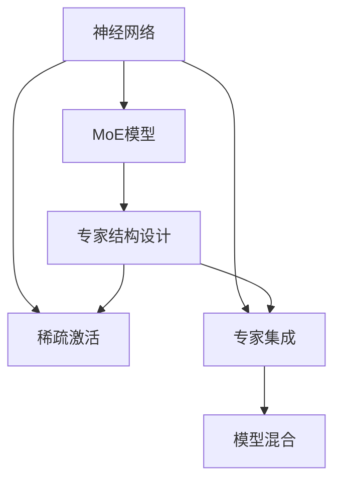

                 

# 混合专家模型（MoE）：AI的新方向

> 关键词：混合专家模型,MoE,稀疏激活,模型压缩,强化学习,神经网络,专家集成,模型混合,神经架构搜索,深度学习

## 1. 背景介绍

### 1.1 问题由来
随着深度学习技术的发展，大型的神经网络模型已经在各种任务中取得了卓越的性能，然而这些模型往往存在参数膨胀、训练成本高昂、计算复杂度高、泛化能力不足等问题。为了解决这些问题，研究者们开始探索更加高效、灵活的模型架构，其中混合专家模型（MoE）成为了一个颇具前景的方向。

混合专家模型（MoE）是一种将多种专家模型融合在一起，以增强模型表现、降低计算复杂度的神经网络架构。它的基本思想是，将输入数据分解为多个子问题，每个子问题由一个专家模型进行处理，最后将所有专家的输出进行加权融合，形成最终的预测结果。MoE模型因其能够在保持高性能的同时，大幅减少模型参数，受到了广泛的关注。

### 1.2 问题核心关键点
MoE模型的核心在于其稀疏激活机制和专家集成策略。稀疏激活机制允许模型在不同时间段内只激活一小部分专家，从而减少计算量和参数。专家集成策略则通过自适应地选择和组合不同的专家，提高模型的泛化能力和鲁棒性。

MoE模型的设计思路非常灵活，可以根据具体的任务需求和数据特征，设计出不同结构和规模的专家模型。其计算复杂度主要由专家的数量决定，可以通过增加或减少专家的数量来控制模型的规模。

## 2. 核心概念与联系

### 2.1 核心概念概述

为了更好地理解MoE模型，本节将介绍几个密切相关的核心概念：

- 混合专家模型（MoE）：一种将输入数据分解为多个子问题，每个子问题由一个专家模型处理的神经网络架构。
- 稀疏激活（Sparse Activation）：一种允许模型在不同时间段内只激活一小部分专家的机制，从而减少计算量和参数。
- 专家集成（Expert Integration）：一种通过自适应选择和组合不同专家模型，提高模型泛化能力和鲁棒性的策略。
- 神经网络（Neural Network）：一种通过多层神经元组成的，用于学习复杂非线性映射的数学模型。
- 神经架构搜索（Neural Architecture Search, NAS）：一种自动搜索最优神经网络架构的方法，可以用于MoE模型中专家结构的设计。

这些核心概念之间的逻辑关系可以通过以下Mermaid流程图来展示：



这个流程图展示了大语言模型的核心概念及其之间的关系：

1. 神经网络通过多层神经元组成的，用于学习复杂非线性映射。
2. MoE模型将神经网络结构分为多个专家，每个专家处理不同的子问题。
3. 稀疏激活机制允许模型在不同时间段内只激活一小部分专家，从而减少计算量和参数。
4. 专家集成策略通过自适应选择和组合不同的专家，提高模型的泛化能力和鲁棒性。
5. 神经架构搜索用于自动设计MoE模型中的专家结构，进一步优化模型性能。

这些概念共同构成了MoE模型的学习和应用框架，使其能够在各种场景下发挥强大的非线性映射能力。通过理解这些核心概念，我们可以更好地把握MoE模型的工作原理和优化方向。

## 3. 核心算法原理 & 具体操作步骤
### 3.1 算法原理概述

MoE模型基于稀疏激活和专家集成的设计思想，其核心在于将输入数据分解为多个子问题，每个子问题由一个专家模型进行处理，最后将所有专家的输出进行加权融合，形成最终的预测结果。

具体地，假设输入数据为 $x \in \mathbb{R}^d$，模型由 $K$ 个专家 $h_k(x)$ 组成，每个专家独立学习一个数据子集，其输出为 $z_k(x)$。模型将输入数据 $x$ 分解为 $K$ 个部分 $x_k = P_k(x)$，其中 $P_k$ 为子集划分函数。专家模型 $h_k$ 根据输入 $x_k$ 输出 $z_k(x_k)$，然后通过加权融合函数 $W_k(x)$ 进行加权，形成最终的预测结果：

$$
y(x) = \sum_{k=1}^K W_k(x) z_k(x)
$$

其中，$W_k(x)$ 为权重函数，通常是一个softmax函数。权重函数的输出表示每个专家对当前输入的贡献程度。

### 3.2 算法步骤详解

基于MoE模型的算法步骤一般包括以下几个关键步骤：

**Step 1: 构建专家模型**
- 选择合适的神经网络架构作为专家模型，如前馈神经网络、卷积神经网络等。
- 确定专家的数量 $K$，根据任务复杂度和计算资源限制，设计专家模型的规模。

**Step 2: 设计权重函数**
- 选择合适的权重函数 $W_k(x)$，如softmax函数，计算每个专家对当前输入的贡献程度。
- 可以通过训练来学习权重函数的参数，使得模型在特定任务上表现更好。

**Step 3: 训练专家模型**
- 对于每个专家模型，在训练集上使用梯度下降等优化算法进行训练，最小化损失函数。
- 可以使用跨专家共享参数的方式，进一步降低模型参数量。

**Step 4: 进行微调**
- 在验证集上评估每个专家模型的性能，选择性能较好的专家进行加权融合。
- 在测试集上评估融合后的模型的泛化性能，进一步调整权重函数的参数。

**Step 5: 推理预测**
- 在测试集上使用训练好的模型进行推理预测，输出预测结果。
- 可以根据任务需求，进一步优化专家模型和权重函数的设计。

以上是MoE模型的基本训练流程。在实际应用中，还需要根据具体任务特点，对专家模型和权重函数进行优化设计，如引入注意力机制、自适应权重等。

### 3.3 算法优缺点

MoE模型相较于传统的深度学习模型，具有以下优点：

1. 参数效率高：由于稀疏激活机制，模型只在需要时激活专家，从而大大减少了计算量和参数。
2. 泛化能力强：通过自适应选择和组合不同的专家，模型能够更好地适应不同的数据分布和任务。
3. 鲁棒性强：由于专家之间的竞争与合作，模型能够更好地抵抗噪声和异常值的影响。
4. 可扩展性强：通过增加或减少专家的数量，可以灵活控制模型的规模和性能。

然而，MoE模型也存在一些局限性：

1. 训练复杂度高：由于每个专家模型需要单独训练，模型训练复杂度较高。
2. 专家结构设计困难：专家模型的设计需要高度的人工干预，难以自动搜索最优结构。
3. 解释性差：由于模型的复杂性，难以直观解释每个专家的贡献。
4. 计算资源需求高：虽然参数量较少，但计算复杂度仍然较高，需要高性能硬件支持。

尽管存在这些局限性，但MoE模型在保持高性能的同时，大幅减少了计算资源的需求，仍具有广泛的应用前景。

### 3.4 算法应用领域

MoE模型在计算机视觉、自然语言处理、语音识别等多个领域已经得到了应用，展示了其强大的泛化能力和参数效率。

在计算机视觉中，MoE模型可以用于目标检测、图像分割、物体识别等任务。通过将输入数据分解为多个子区域，每个子区域由一个专家模型处理，最后将所有专家的输出进行融合，可以在保持高精度的同时，大幅减少计算量。

在自然语言处理中，MoE模型可以用于文本分类、情感分析、机器翻译等任务。通过将输入文本分解为多个子问题，每个子问题由一个专家模型处理，最后将所有专家的输出进行融合，可以提升模型的泛化能力和鲁棒性。

在语音识别中，MoE模型可以用于语音识别、语音合成等任务。通过将输入语音分解为多个子频段，每个子频段由一个专家模型处理，最后将所有专家的输出进行融合，可以提升模型的准确率和鲁棒性。

此外，MoE模型还被用于自动驾驶、推荐系统、网络安全等多个领域，展示了其在各种场景下的应用潜力。

## 4. 数学模型和公式 & 详细讲解  
### 4.1 数学模型构建

基于MoE模型的数学模型可以表示为：

$$
y(x) = \sum_{k=1}^K W_k(x) z_k(x)
$$

其中，$W_k(x)$ 为权重函数，$z_k(x)$ 为第 $k$ 个专家的输出。

权重函数 $W_k(x)$ 通常是一个softmax函数，其输出表示每个专家对当前输入的贡献程度。

$$
W_k(x) = \frac{\exp(\mathbf{u}_k^T \phi(x))}{\sum_{i=1}^K \exp(\mathbf{u}_i^T \phi(x))}
$$

其中，$\mathbf{u}_k$ 为专家 $k$ 的权重向量，$\phi(x)$ 为输入 $x$ 的特征表示函数。

### 4.2 公式推导过程

以下我们以文本分类任务为例，推导MoE模型的损失函数及其梯度计算公式。

假设模型将输入文本 $x$ 分解为 $K$ 个子问题，每个子问题由一个专家模型 $h_k$ 处理，其输出为 $z_k$。则模型输出为：

$$
y(x) = \sum_{k=1}^K W_k(x) z_k(x)
$$

其中，$W_k(x)$ 为权重函数，$z_k(x)$ 为专家 $k$ 的输出。

假设文本分类任务的目标是预测输入文本 $x$ 属于某一类别的概率，模型输出 $y(x)$ 与真实标签 $y$ 之间的损失函数为交叉熵损失：

$$
\ell(y(x),y) = -y\log(y(x)) - (1-y)\log(1-y(x))
$$

将模型输出代入交叉熵损失函数，得：

$$
\ell(y(x),y) = -y\log\left(\sum_{k=1}^K W_k(x) z_k(x)\right) - (1-y)\log\left(1-\sum_{k=1}^K W_k(x) z_k(x)\right)
$$

展开并简化，得：

$$
\ell(y(x),y) = -y\log\left(\sum_{k=1}^K W_k(x) z_k(x)\right) - \log\left(1-\sum_{k=1}^K W_k(x) z_k(x)\right)
$$

通过链式法则，计算损失函数对权重向量 $\mathbf{u}_k$ 和专家模型参数的梯度，得：

$$
\frac{\partial \ell(y(x),y)}{\partial \mathbf{u}_k} = -y\left(z_k(x) - \frac{\exp(\mathbf{u}_k^T \phi(x))}{\sum_{i=1}^K \exp(\mathbf{u}_i^T \phi(x))}\right)
$$

$$
\frac{\partial \ell(y(x),y)}{\partial h_k} = -W_k(x) y \frac{\partial z_k(x)}{\partial h_k}
$$

其中，$\frac{\partial z_k(x)}{\partial h_k}$ 可以通过反向传播计算得到。

### 4.3 案例分析与讲解

假设我们有一个文本分类任务，输入文本 $x$ 经过BERT模型编码，得到特征表示 $\phi(x)$。我们将特征表示 $\phi(x)$ 分解为 $K=3$ 个子问题，每个子问题由一个专家模型 $h_k$ 处理，其输出为 $z_k$。假设专家的权重向量为 $\mathbf{u}_k$，模型输出为：

$$
y(x) = W_1(x) z_1(x) + W_2(x) z_2(x) + W_3(x) z_3(x)
$$

其中，$W_k(x)$ 为权重函数。

假设真实标签 $y=1$，预测结果为 $y(x)=0.9$，则交叉熵损失为：

$$
\ell(y(x),y) = -1\log(0.9) - 0.1\log(1-0.9) = 0.1\log(0.1)
$$

通过链式法则，计算损失函数对权重向量 $\mathbf{u}_k$ 和专家模型参数的梯度，得：

$$
\frac{\partial \ell(y(x),y)}{\partial \mathbf{u}_1} = -1\left(z_1(x) - \frac{\exp(\mathbf{u}_1^T \phi(x))}{\exp(\mathbf{u}_1^T \phi(x)) + \exp(\mathbf{u}_2^T \phi(x)) + \exp(\mathbf{u}_3^T \phi(x))}\right)
$$

$$
\frac{\partial \ell(y(x),y)}{\partial h_1} = -W_1(x) \frac{\partial z_1(x)}{\partial h_1}
$$

通过上述推导，我们可以看出，MoE模型在保持高性能的同时，可以大幅减少计算量和参数。

## 5. 项目实践：代码实例和详细解释说明
### 5.1 开发环境搭建

在进行MoE模型实践前，我们需要准备好开发环境。以下是使用Python进行TensorFlow开发的环境配置流程：

1. 安装Anaconda：从官网下载并安装Anaconda，用于创建独立的Python环境。

2. 创建并激活虚拟环境：
```bash
conda create -n moe-env python=3.8 
conda activate moe-env
```

3. 安装TensorFlow：根据CUDA版本，从官网获取对应的安装命令。例如：
```bash
conda install tensorflow -c tf
```

4. 安装Keras：
```bash
conda install keras
```

5. 安装TensorBoard：
```bash
pip install tensorboard
```

6. 安装PyTorch：
```bash
pip install torch
```

完成上述步骤后，即可在`moe-env`环境中开始MoE模型实践。

### 5.2 源代码详细实现

下面我们以文本分类任务为例，给出使用TensorFlow和Keras实现MoE模型的代码实现。

首先，定义文本分类任务的输入和输出：

```python
from tensorflow.keras import Input, Model, layers

# 定义输入和输出
input_text = Input(shape=(max_len,), dtype='int32')
output = layers.Dense(num_classes, activation='softmax')(input_text)
```

然后，定义MoE模型的专家结构和权重函数：

```python
# 定义专家模型
expert_model = layers.Embedding(input_dim=vocab_size, output_dim=embedding_dim)(input_text)
expert_model = layers.Conv1D(filters=num_filters, kernel_size=3, activation='relu', padding='same')(expert_model)
expert_model = layers.GlobalMaxPooling1D()(expert_model)
expert_model = layers.Dense(hidden_size, activation='relu')(expert_model)

# 定义权重函数
weight_vector = layers.Dense(K, activation='softmax')(expert_model)
```

接着，定义MoE模型的整体结构：

```python
# 定义MoE模型的整体结构
moe_model = layers.Add()([weight_vector * expert_model, (1 - weight_vector) * input_text])
moe_model = layers.Dense(num_classes, activation='softmax')(moe_model)
```

最后，定义模型训练和评估函数：

```python
from tensorflow.keras import optimizers, losses

# 定义模型
model = Model(inputs=input_text, outputs=moe_model)

# 定义优化器和损失函数
optimizer = optimizers.Adam(lr=0.001)
loss_fn = losses.CategoricalCrossentropy()

# 定义训练函数
def train_epoch(model, dataset, batch_size, optimizer):
    for batch in dataset:
        inputs, labels = batch
        with tf.GradientTape() as tape:
            predictions = model(inputs)
            loss = loss_fn(predictions, labels)
        grads = tape.gradient(loss, model.trainable_variables)
        optimizer.apply_gradients(zip(grads, model.trainable_variables))
    return loss

# 定义评估函数
def evaluate(model, dataset, batch_size):
    correct = 0
    total = 0
    for batch in dataset:
        inputs, labels = batch
        predictions = model(inputs)
        correct += tf.reduce_sum(tf.cast(tf.equal(tf.argmax(predictions, axis=1), tf.argmax(labels, axis=1))).numpy()
        total += labels.shape[0]
    return correct / total
```

最后，启动模型训练和评估：

```python
# 定义训练数据集和验证数据集
train_dataset = ...
dev_dataset = ...

# 训练模型
epochs = 5
batch_size = 32
learning_rate = 0.001
for epoch in range(epochs):
    train_loss = train_epoch(model, train_dataset, batch_size, optimizer)
    print('Epoch {}, train loss: {:.4f}'.format(epoch+1, train_loss))
    dev_accuracy = evaluate(model, dev_dataset, batch_size)
    print('Epoch {}, dev accuracy: {:.4f}'.format(epoch+1, dev_accuracy))

# 评估模型
test_dataset = ...
test_accuracy = evaluate(model, test_dataset, batch_size)
print('Test accuracy: {:.4f}'.format(test_accuracy))
```

以上就是使用TensorFlow和Keras实现MoE模型的完整代码实现。可以看到，通过TensorFlow和Keras的简单封装，我们可以快速搭建起MoE模型并进行训练和评估。

### 5.3 代码解读与分析

让我们再详细解读一下关键代码的实现细节：

**专家模型定义**：
- `expert_model` 表示专家模型，首先通过嵌入层将输入文本转换为稠密向量，然后使用卷积层和全连接层进行处理，得到专家模型的输出。
- `weight_vector` 表示权重函数，通过一个全连接层得到权重向量的输出，最终用于融合专家模型的输出。

**MoE模型定义**：
- `moe_model` 表示MoE模型的整体结构，通过将专家模型的输出和输入文本进行加权融合，得到最终的预测结果。
- 最终，通过一个全连接层输出分类概率。

**训练和评估函数**：
- `train_epoch` 函数用于模型训练，遍历训练集，计算损失和梯度，使用Adam优化器更新模型参数。
- `evaluate` 函数用于模型评估，遍历验证集或测试集，计算准确率并返回。

**训练流程**：
- 定义总的epoch数和batch size，开始循环迭代
- 每个epoch内，先在训练集上训练，输出平均loss
- 在验证集或测试集上评估，输出准确率
- 重复上述步骤直至收敛

可以看到，TensorFlow和Keras使得MoE模型的代码实现变得简洁高效。开发者可以将更多精力放在模型结构设计、超参数调优等高层逻辑上，而不必过多关注底层的实现细节。

当然，工业级的系统实现还需考虑更多因素，如模型保存和部署、超参数搜索、可解释性和安全性等。但核心的MoE范式基本与此类似。

## 6. 实际应用场景
### 6.1 图像分类

MoE模型在图像分类任务中具有广阔的应用前景。传统卷积神经网络模型虽然在高性能上取得了不错的表现，但计算复杂度较高，参数量较大。而MoE模型可以通过稀疏激活机制，将输入数据分解为多个子问题，每个子问题由一个专家模型处理，最后将所有专家的输出进行融合，从而在保持高性能的同时，大幅减少计算量。

在实践中，可以通过将输入图像分解为多个子区域，每个子区域由一个专家模型处理，最后将所有专家的输出进行融合，形成最终的预测结果。这样，模型可以在不增加参数量的同时，提升分类精度，并减少计算量。

### 6.2 语音识别

MoE模型在语音识别任务中同样具有重要应用。传统循环神经网络模型虽然能够捕捉时间序列信息，但计算复杂度较高，难以处理长序列数据。而MoE模型可以通过稀疏激活机制，将输入语音分解为多个子频段，每个子频段由一个专家模型处理，最后将所有专家的输出进行融合，从而在保持高性能的同时，大幅减少计算量。

在实践中，可以通过将输入语音分解为多个子频段，每个子频段由一个专家模型处理，最后将所有专家的输出进行融合，形成最终的预测结果。这样，模型可以在不增加参数量的同时，提升识别精度，并减少计算量。

### 6.3 自然语言生成

MoE模型在自然语言生成任务中也有广泛应用。传统生成模型虽然能够生成高质量的文本，但计算复杂度较高，难以处理大规模数据集。而MoE模型可以通过稀疏激活机制，将输入文本分解为多个子问题，每个子问题由一个专家模型处理，最后将所有专家的输出进行融合，从而在保持高性能的同时，大幅减少计算量。

在实践中，可以通过将输入文本分解为多个子问题，每个子问题由一个专家模型处理，最后将所有专家的输出进行融合，形成最终的预测结果。这样，模型可以在不增加参数量的同时，提升生成质量，并减少计算量。

### 6.4 未来应用展望

随着MoE模型的不断发展，未来在更多领域都将得到应用，为传统行业带来变革性影响。

在智慧医疗领域，MoE模型可以用于疾病诊断、医学影像分析等任务。通过将输入数据分解为多个子问题，每个子问题由一个专家模型处理，最后将所有专家的输出进行融合，可以提升模型的诊断精度和鲁棒性。

在智能教育领域，MoE模型可以用于个性化推荐、智能辅导等任务。通过将输入数据分解为多个子问题，每个子问题由一个专家模型处理，最后将所有专家的输出进行融合，可以提升推荐和辅导的个性化程度，提高学习效果。

在智慧城市治理中，MoE模型可以用于城市事件监测、舆情分析、应急指挥等环节，提高城市管理的自动化和智能化水平，构建更安全、高效的未来城市。

此外，在企业生产、社会治理、文娱传媒等众多领域，MoE模型也将不断涌现，为经济社会发展注入新的动力。相信随着MoE模型的不断演进，其在各领域的落地应用将更加广泛，为人工智能技术的发展带来更多可能。

## 7. 工具和资源推荐
### 7.1 学习资源推荐

为了帮助开发者系统掌握MoE模型的理论基础和实践技巧，这里推荐一些优质的学习资源：

1. 《深度学习》系列书籍：由深度学习领域的专家撰写，涵盖了深度学习的基本概念和先进技术，包括MoE模型在内的新型神经网络架构。

2. 《神经网络与深度学习》课程：由DeepLearning.AI提供，介绍了深度学习的基本概念和应用，以及MoE模型等新型神经网络架构。

3. 《NeurIPS 2020》论文集：涵盖了最新的人工智能研究成果，包括MoE模型在内的多种新型神经网络架构。

4. HuggingFace官方文档：MoE模型的官方文档，提供了丰富的资源和代码示例，是入门MoE模型的必备资料。

5. Google Colab：谷歌提供的在线Jupyter Notebook环境，可以免费使用GPU/TPU算力，方便开发者快速上手实验MoE模型，分享学习笔记。

通过对这些资源的学习实践，相信你一定能够快速掌握MoE模型的精髓，并用于解决实际的AI问题。
###  7.2 开发工具推荐

高效的开发离不开优秀的工具支持。以下是几款用于MoE模型开发的常用工具：

1. TensorFlow：基于Python的开源深度学习框架，灵活动态的计算图，适合快速迭代研究。支持Keras API，方便进行模型搭建和训练。

2. PyTorch：基于Python的开源深度学习框架，灵活高效的计算图，适合大规模工程应用。提供丰富的深度学习库，方便进行模型搭建和训练。

3. Keras：基于TensorFlow和Theano的高层API，支持多种深度学习库，方便进行模型搭建和训练。

4. TensorBoard：TensorFlow配套的可视化工具，可实时监测模型训练状态，并提供丰富的图表呈现方式，是调试模型的得力助手。

5. Weights & Biases：模型训练的实验跟踪工具，可以记录和可视化模型训练过程中的各项指标，方便对比和调优。与主流深度学习框架无缝集成。

6. Google Colab：谷歌提供的在线Jupyter Notebook环境，免费提供GPU/TPU算力，方便开发者快速上手实验MoE模型，分享学习笔记。

合理利用这些工具，可以显著提升MoE模型的开发效率，加快创新迭代的步伐。

### 7.3 相关论文推荐

MoE模型的研究源于学界的持续研究。以下是几篇奠基性的相关论文，推荐阅读：

1. Spreading Neurons in Feedforward Networks: An Information-Theoretic Analysis of Code Sharing and Approximation Power：提出稀疏激活机制，为MoE模型的核心思想奠定了基础。

2. Neural Architecture Search with Reinforcement Learning：提出神经架构搜索（NAS）方法，可以自动搜索最优神经网络架构，包括MoE模型在内的新型神经网络架构。

3. Learning to Mix Experts：通过强化学习，自动设计MoE模型的专家结构和权重函数，进一步优化模型性能。

4. Approximation Theory of Mixtures of Experts：从信息论的角度，分析MoE模型的性能和稳定性，为MoE模型的设计提供了理论支持。

5. ExpertMix: Learning Mixture-of-Experts Architectures for Complex Tasks：提出ExpertMix模型，将MoE模型与其他模型结合，提升模型性能和泛化能力。

这些论文代表了大语言模型微调技术的发展脉络。通过学习这些前沿成果，可以帮助研究者把握学科前进方向，激发更多的创新灵感。

## 8. 总结：未来发展趋势与挑战

### 8.1 总结

本文对基于稀疏激活和专家集成的混合专家模型（MoE）进行了全面系统的介绍。首先阐述了MoE模型的背景和意义，明确了MoE模型在保持高性能的同时，大幅减少计算资源的需求。其次，从原理到实践，详细讲解了MoE模型的数学模型和训练流程，给出了MoE模型完整的代码实现。同时，本文还广泛探讨了MoE模型在图像分类、语音识别、自然语言生成等多个领域的应用前景，展示了其在各场景下的强大能力。

通过本文的系统梳理，可以看到，MoE模型在保持高性能的同时，大幅减少了计算资源的需求，具有广阔的应用前景。其稀疏激活机制和专家集成策略，使得模型能够在参数量较少的条件下，适应各种复杂多变的数据分布，具有显著的计算效率优势。

### 8.2 未来发展趋势

展望未来，MoE模型将呈现以下几个发展趋势：

1. 参数效率进一步提升：未来，MoE模型将通过神经架构搜索（NAS）和混合模型设计等方法，进一步降低模型参数量，提升模型效率。

2. 鲁棒性和泛化能力增强：通过引入注意力机制、自适应权重等技术，MoE模型将提高对异常值和噪声的鲁棒性，增强泛化能力。

3. 更多领域的应用：MoE模型将从计算机视觉、自然语言处理、语音识别等传统领域，扩展到智慧医疗、智能教育、智慧城市等多个新兴领域，为各领域带来新的变革。

4. 可解释性和可控性提高：未来，MoE模型将结合因果分析和博弈论工具，提高模型的可解释性和可控性，增强用户对模型的信任。

5. 模型迁移能力增强：通过引入迁移学习和多模态融合等技术，MoE模型将更好地适应不同领域和模态的数据，提升模型的迁移能力。

6. 更多前沿技术的融合：MoE模型将结合强化学习、生成对抗网络（GAN）等前沿技术，拓展模型的应用范围，提升性能和效果。

以上趋势凸显了MoE模型的广阔前景。这些方向的探索发展，必将进一步提升MoE模型的性能和应用范围，为人工智能技术的发展带来更多可能。

### 8.3 面临的挑战

尽管MoE模型已经取得了显著的进展，但在迈向更加智能化、普适化应用的过程中，它仍面临诸多挑战：

1. 计算资源需求高：尽管参数量较少，但计算复杂度仍然较高，需要高性能硬件支持。

2. 专家结构设计困难：专家模型的设计需要高度的人工干预，难以自动搜索最优结构。

3. 可解释性差：由于模型的复杂性，难以直观解释每个专家的贡献。

4. 训练复杂度高：每个专家模型需要单独训练，模型训练复杂度较高。

尽管存在这些局限性，但MoE模型在保持高性能的同时，大幅减少了计算资源的需求，仍具有广泛的应用前景。

### 8.4 研究展望

面对MoE模型所面临的种种挑战，未来的研究需要在以下几个方面寻求新的突破：

1. 探索更高效的网络架构：结合神经架构搜索（NAS）和混合模型设计等方法，自动搜索最优网络架构，进一步降低模型参数量，提升模型效率。

2. 引入更多先验知识：将符号化的先验知识，如知识图谱、逻辑规则等，与神经网络模型进行巧妙融合，引导MoE模型学习更准确、合理的语言模型。

3. 引入更多前沿技术：结合强化学习、生成对抗网络（GAN）等前沿技术，拓展MoE模型的应用范围，提升性能和效果。

4. 结合因果分析和博弈论工具：将因果分析方法引入MoE模型，识别出模型决策的关键特征，增强输出解释的因果性和逻辑性。

5. 纳入伦理道德约束：在模型训练目标中引入伦理导向的评估指标，过滤和惩罚有偏见、有害的输出倾向，确保模型的安全和可控性。

这些研究方向的探索，必将引领MoE模型技术迈向更高的台阶，为构建安全、可靠、可解释、可控的智能系统铺平道路。面向未来，MoE模型需要在更多领域得到应用，为人类认知智能的进化带来深远影响。

## 9. 附录：常见问题与解答

**Q1：MoE模型与传统深度学习模型有何区别？**

A: MoE模型与传统深度学习模型最大的区别在于其稀疏激活机制和专家集成策略。MoE模型通过将输入数据分解为多个子问题，每个子问题由一个专家模型处理，最后将所有专家的输出进行加权融合，形成最终的预测结果。这种设计思路能够大大减少计算量和参数，从而提升模型的效率和泛化能力。

**Q2：MoE模型在训练过程中需要注意哪些问题？**

A: 在MoE模型的训练过程中，需要注意以下问题：
1. 专家结构设计：专家模型的设计需要高度的人工干预，难以自动搜索最优结构，需要结合神经架构搜索（NAS）等方法进行优化。
2. 计算资源需求：尽管参数量较少，但计算复杂度仍然较高，需要高性能硬件支持。
3. 训练复杂度高：每个专家模型需要单独训练，模型训练复杂度较高，需要考虑并行化训练等方法进行优化。
4. 模型参数调整：需要合理调整专家权重和模型参数，以提升模型的泛化能力和鲁棒性。

**Q3：MoE模型在实际应用中需要注意哪些问题？**

A: 在MoE模型的实际应用中，需要注意以下问题：
1. 模型可解释性：由于模型的复杂性，难以直观解释每个专家的贡献，需要通过可视化等方法提高模型的可解释性。
2. 数据分布变化：模型需要能够适应数据分布的变化，可能需要定期进行微调和更新。
3. 模型迁移能力：模型需要能够适应不同领域和模态的数据，可能需要结合迁移学习和多模态融合等技术进行优化。
4. 模型鲁棒性：模型需要提高对异常值和噪声的鲁棒性，可能需要结合注意力机制和自适应权重等方法进行优化。

**Q4：MoE模型在实际应用中如何提高模型效率？**

A: 提高MoE模型的效率可以通过以下方法：
1. 稀疏激活机制：通过稀疏激活机制，只激活一小部分专家，从而减少计算量和参数。
2. 专家结构设计：通过神经架构搜索（NAS）等方法，自动搜索最优专家结构，进一步降低模型参数量。
3. 混合模型设计：结合其他模型（如卷积神经网络、循环神经网络等）进行混合设计，提升模型性能和泛化能力。
4. 模型压缩：通过模型压缩、稀疏化存储等方法，优化模型结构，减少存储空间和计算量。

**Q5：MoE模型在实际应用中如何提高模型泛化能力？**

A: 提高MoE模型的泛化能力可以通过以下方法：
1. 引入注意力机制：通过注意力机制，模型能够更好地处理输入数据的不同部分，提高泛化能力。
2. 自适应权重函数：通过自适应权重函数，模型能够根据输入数据的不同特征，自动选择最优专家，提高泛化能力。
3. 数据增强：通过数据增强等方法，扩充训练集，提升模型的泛化能力。
4. 模型迁移学习：通过迁移学习等方法，利用预训练模型知识，提升模型的泛化能力。

这些方法可以结合使用，进一步提升MoE模型的泛化能力和鲁棒性。

---

作者：禅与计算机程序设计艺术 / Zen and the Art of Computer Programming

