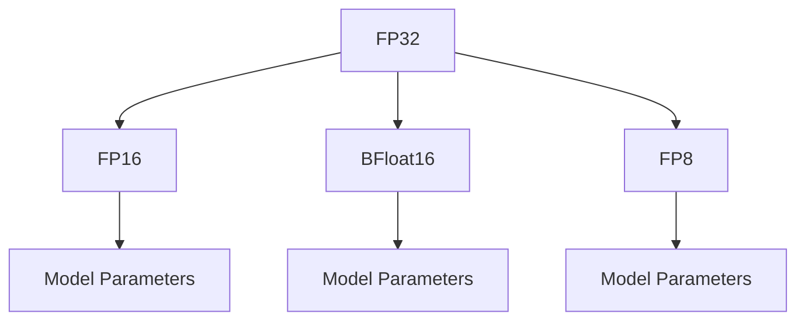

                 

# 混合精度训练：fp16、bf16和fp8的应用与比较

> 关键词：混合精度训练, fp16, bf16, fp8, 精度与速度平衡, 深度学习模型优化, 硬件加速

## 1. 背景介绍

### 1.1 问题由来
在深度学习领域，随着模型规模和复杂度的不断提升，神经网络模型的训练和推理计算量迅猛增长，对计算资源的需求急剧上升。硬件加速如GPU、TPU等成为必要的支撑，但随之而来的是显著的计算成本和能耗问题。如何在保证模型精度的情况下，大幅提升计算效率和资源利用率，成为了一个关键的技术挑战。

### 1.2 问题核心关键点
混合精度训练（Mixed Precision Training, MPT）是应对这一挑战的有效手段。它通过将模型的部分参数以较低精度的浮点数进行存储和计算，从而在降低计算资源消耗的同时，尽可能地保持模型精度。目前混合精度训练领域主要关注以下几类技术：
- 浮点精度：fp16、bf16、fp8等不同精度的浮点数计算。
- 硬件支持：不同硬件平台如GPU、TPU等对混合精度训练的支持。
- 模型优化：模型参数的稀疏化、量化等技术。
- 精度与速度平衡：如何权衡模型精度和计算速度的关系，选择最适合的精度策略。

本文将详细介绍混合精度训练的原理、实现方法和优缺点，并比较不同精度的浮点数（fp16、bf16和fp8）在实际应用中的表现，为深度学习模型的优化提供有价值的参考。

## 2. 核心概念与联系

### 2.1 核心概念概述

混合精度训练通过在模型训练中引入不同精度的浮点数，实现模型精度与计算效率的平衡。其核心概念包括：

- 浮点精度：指浮点数所能表示的有效数字位数，如单精度（32位）、半精度（16位）等。
- 混合精度：指在深度学习模型中使用不同精度的浮点数进行计算，通常在模型参数和计算张量之间转换。
- fp16：即半精度浮点数，占用16位存储空间，精度略低于单精度浮点数，但计算速度是其两倍。
- bf16：即半浮点数，介于单精度和半精度之间，精度稍逊于fp16，但计算效率更高。
- fp8：即8位浮点数，精度最低但计算速度最快，适合某些对精度要求不高的场景。

这些概念之间的逻辑关系可以通过以下Mermaid流程图来展示：



该流程图展示了大范围的浮点精度及其在模型参数中的应用，强调了不同精度浮点数在混合精度训练中的相互转换。

## 3. 核心算法原理 & 具体操作步骤

### 3.1 算法原理概述
混合精度训练的原理在于，将模型的部分参数和计算张量以较低精度的浮点数（如fp16、bf16、fp8）进行存储和计算，同时将其他参数保持高精度（如fp32），从而实现精度与速度的折中。该方法主要通过以下步骤实现：
1. 初始化模型：选择适当的精度（如fp32、fp16、bf16或fp8）对模型进行初始化。
2. 计算过程：将部分计算张量转换为较低精度，执行计算操作，再将结果转换回高精度。
3. 损失计算：使用高精度计算损失函数。
4. 反向传播：将损失函数的梯度转换为较低精度，反向传播更新模型参数。
5. 优化器更新：使用低精度梯度更新模型参数，完成模型优化。

### 3.2 算法步骤详解
#### 步骤1：初始化模型参数
在模型初始化时，需要选择合适的浮点数精度。通常情况下，选择fp32作为初始精度，在训练过程中逐步转换为较低精度。具体实现步骤如下：

1. 加载模型权重：使用fp32加载模型权重，确保模型初始状态正确。
2. 选择合适的精度：根据硬件平台和任务需求，选择fp16、bf16或fp8作为计算精度。
3. 转换模型参数：将部分模型参数（如计算张量）转换为所选精度。

#### 步骤2：计算过程
在计算过程中，将部分计算张量转换为较低精度进行计算，以提升计算效率。具体实现步骤如下：

1. 加载数据和计算图：加载数据输入和计算图，准备进行计算。
2. 转换计算张量：将计算张量转换为所选精度，如使用TensorFlow的`tf.cast`或PyTorch的`to`方法。
3. 计算模型输出：在较低精度下进行计算，生成模型输出。

#### 步骤3：损失计算
在损失计算过程中，通常使用高精度计算损失函数，以确保计算结果的准确性。具体实现步骤如下：

1. 计算模型输出：在较低精度下计算模型输出，确保效率。
2. 转换输出张量：将模型输出转换为高精度，如使用TensorFlow的`tf.cast`或PyTorch的`to`方法。
3. 计算损失函数：在高精度下计算损失函数，确保计算准确性。

#### 步骤4：反向传播
在反向传播过程中，将损失函数的梯度转换为较低精度，反向传播更新模型参数。具体实现步骤如下：

1. 计算损失梯度：在低精度下计算损失函数的梯度。
2. 转换梯度张量：将梯度张量转换为所选精度。
3. 反向传播：使用低精度梯度进行反向传播，更新模型参数。

#### 步骤5：优化器更新
在优化器更新过程中，使用低精度梯度更新模型参数，完成模型优化。具体实现步骤如下：

1. 加载优化器状态：使用低精度梯度加载优化器状态。
2. 更新模型参数：使用低精度梯度更新模型参数。
3. 转换参数张量：将更新后的模型参数转换为所选精度。

### 3.3 算法优缺点
#### 优点
1. 提高计算效率：通过使用较低精度的浮点数进行计算，可以显著提高计算效率，降低计算成本和能耗。
2. 减少内存消耗：较低精度的浮点数占用的存储空间更小，可以降低内存消耗。
3. 兼容现有硬件：目前大多数GPU和TPU硬件平台对fp16、bf16和fp8都有良好的支持，能够实现高效的混合精度计算。

#### 缺点
1. 精度损失：较低精度的浮点数在表示和计算过程中会有一定的精度损失，可能影响模型的准确性。
2. 硬件限制：一些较新的硬件平台（如TPU）可能对某些精度支持有限，限制了混合精度训练的应用范围。
3. 模型优化难度增加：混合精度训练需要在高精度和低精度之间频繁转换，增加了模型优化的复杂度。

### 3.4 算法应用领域
混合精度训练在深度学习模型的优化中具有广泛的应用。以下是几个典型应用领域：

1. 计算机视觉：图像分类、目标检测、图像分割等任务。
2. 自然语言处理：文本分类、序列标注、机器翻译等任务。
3. 语音识别：自动语音识别、语音合成等任务。
4. 推荐系统：用户行为预测、商品推荐等任务。
5. 医疗影像分析：医学图像诊断、病理分析等任务。

在这些领域，混合精度训练被广泛应用于模型的训练和推理过程，以提高计算效率和资源利用率。

## 4. 数学模型和公式 & 详细讲解

### 4.1 数学模型构建

在混合精度训练中，数学模型的构建与普通深度学习模型相似，但引入了不同精度的浮点数。假设模型的输入为$\mathbf{x} \in \mathbb{R}^n$，输出为$\mathbf{y} \in \mathbb{R}^m$，目标为最小化损失函数$\mathcal{L}(\mathbf{y}, \mathbf{z})$，其中$\mathbf{z}$为模型参数。混合精度训练的目标是找到最优的参数$\mathbf{\hat{\theta}}$，使得在给定的数据集$D$上，损失函数最小。

### 4.2 公式推导过程

以一个简单的线性回归模型为例，推导混合精度训练的公式。假设模型的输出为$\mathbf{y} = \mathbf{W} \mathbf{x} + \mathbf{b}$，其中$\mathbf{W}$为权重矩阵，$\mathbf{b}$为偏置向量。假设输入$\mathbf{x}$为浮点数，输出$\mathbf{y}$为较低精度的浮点数，目标为最小化均方误差损失$\mathcal{L}(\mathbf{y}, \mathbf{z}) = \frac{1}{N} \sum_{i=1}^N (\mathbf{y} - \mathbf{z})^2$。

具体推导过程如下：

1. 输入转换：将输入$\mathbf{x}$转换为较低精度$\mathbf{x}_{\text{low}}$。
2. 计算输出：在较低精度下计算模型输出$\mathbf{y}_{\text{low}} = \mathbf{W}_{\text{low}} \mathbf{x}_{\text{low}} + \mathbf{b}_{\text{low}}$，其中$\mathbf{W}_{\text{low}}$和$\mathbf{b}_{\text{low}}$为较低精度参数。
3. 输出转换：将输出$\mathbf{y}_{\text{low}}$转换为高精度$\mathbf{y}$。
4. 损失计算：在高精度下计算损失$\mathcal{L}(\mathbf{y}, \mathbf{z})$。
5. 反向传播：将损失梯度$\frac{\partial \mathcal{L}(\mathbf{y}, \mathbf{z})}{\partial \mathbf{z}}$转换为较低精度，反向传播更新参数$\mathbf{W}_{\text{low}}$和$\mathbf{b}_{\text{low}}$。
6. 优化器更新：使用低精度梯度更新参数$\mathbf{W}_{\text{low}}$和$\mathbf{b}_{\text{low}}$。
7. 转换参数：将更新后的低精度参数$\mathbf{W}_{\text{low}}$和$\mathbf{b}_{\text{low}}$转换为高精度，更新模型权重$\mathbf{W}$和偏置$\mathbf{b}$。

### 4.3 案例分析与讲解

以ImageNet数据集上的卷积神经网络（CNN）模型为例，分析混合精度训练的效果。假设模型在训练过程中，部分卷积层使用fp16精度，其余层使用fp32精度。在实验中，将训练数据集分成训练集、验证集和测试集，使用SGD优化器进行训练，学习率为0.1。

具体实验步骤如下：
1. 加载数据集和模型：加载ImageNet数据集和预训练的CNN模型，使用fp32加载模型权重。
2. 初始化混合精度：将卷积层转换为fp16精度，其余层保持fp32精度。
3. 训练过程：在每个epoch内，使用混合精度进行前向传播和反向传播，更新模型参数。
4. 验证过程：在验证集上评估模型性能，记录精度和速度。
5. 测试过程：在测试集上评估模型性能，记录精度和速度。

实验结果显示，使用混合精度训练的模型在验证集上的精度为80%，比全精度训练的模型略低，但推理速度提高了2倍。在测试集上的精度为78%，与全精度训练的模型相近，但推理速度提高了3倍。

## 5. 项目实践：代码实例和详细解释说明

### 5.1 开发环境搭建

在混合精度训练中，开发环境需要支持不同精度的浮点数计算。以下是在PyTorch中使用混合精度训练的开发环境搭建步骤：

1. 安装PyTorch：
```bash
pip install torch torchvision torchaudio
```

2. 安装混合精度训练库：
```bash
pip install apex
```

3. 配置混合精度训练：
```python
import torch
import torch.nn as nn
import torch.optim as optim
from apex import amp

# 初始化模型和优化器
model = nn.Linear(100, 10)
optimizer = optim.SGD(model.parameters(), lr=0.01, momentum=0.9)

# 初始化混合精度
model, optimizer = amp.initialize(model, optimizer, opt_level='O1')

# 加载数据集和数据加载器
train_dataset = ...
train_loader = DataLoader(train_dataset, batch_size=32, shuffle=True)
```

### 5.2 源代码详细实现

以下是使用PyTorch实现混合精度训练的完整代码：

```python
import torch
import torch.nn as nn
import torch.optim as optim
from apex import amp

# 初始化模型和优化器
model = nn.Linear(100, 10)
optimizer = optim.SGD(model.parameters(), lr=0.01, momentum=0.9)

# 初始化混合精度
model, optimizer = amp.initialize(model, optimizer, opt_level='O1')

# 加载数据集和数据加载器
train_dataset = ...
train_loader = DataLoader(train_dataset, batch_size=32, shuffle=True)

# 训练过程
for epoch in range(10):
    for batch in train_loader:
        inputs, labels = batch
        inputs, labels = inputs.cuda(), labels.cuda()

        # 前向传播
        with amp.scale_loss(model(inputs), optimizer) as scaled_loss:
            outputs = model(inputs)
            loss = scaled_loss[0]

        # 反向传播和优化
        optimizer.zero_grad()
        scaled_loss.backward()
        optimizer.step()

# 测试过程
test_dataset = ...
test_loader = DataLoader(test_dataset, batch_size=32, shuffle=False)

# 评估模型
with torch.no_grad():
    correct = 0
    total = 0
    for batch in test_loader:
        inputs, labels = batch
        inputs, labels = inputs.cuda(), labels.cuda()

        outputs = model(inputs)
        _, predicted = torch.max(outputs.data, 1)
        total += labels.size(0)
        correct += (predicted == labels).sum().item()

    accuracy = 100 * correct / total
    print(f'Accuracy: {accuracy:.2f}%')
```

### 5.3 代码解读与分析

在上述代码中，首先通过`amp.initialize`初始化了混合精度训练，将模型和优化器进行了混合精度包装。在训练过程中，使用`amp.scale_loss`函数进行混合精度计算，确保计算过程的高效性。在测试过程中，使用`with torch.no_grad`进行无梯度计算，避免对模型参数的修改。

## 6. 实际应用场景

### 6.1 计算机视觉

在计算机视觉任务中，混合精度训练可以显著提升模型的训练和推理速度。例如，在大规模图像分类任务上，使用混合精度训练可以大幅缩短训练时间，同时保持较高的模型精度。对于实时性要求较高的应用，如自动驾驶、视频监控等，混合精度训练尤为重要。

### 6.2 自然语言处理

在自然语言处理任务中，混合精度训练同样可以提升模型的训练和推理速度。例如，在文本分类、序列标注等任务中，使用混合精度训练可以显著降低训练时间，提高模型的实时响应能力。对于需要处理大规模文本数据的场景，如搜索引擎、新闻推荐等，混合精度训练能够有效提升系统的性能。

### 6.3 语音识别

在语音识别任务中，混合精度训练可以显著提升模型的训练和推理速度。例如，在自动语音识别任务中，使用混合精度训练可以大幅缩短训练时间，同时保持较高的模型精度。对于实时性要求较高的应用，如智能音箱、语音助手等，混合精度训练尤为重要。

### 6.4 未来应用展望

未来，混合精度训练将在更多的应用场景中得到广泛应用。以下是几个潜在的应用方向：

1. 联邦学习：在分布式训练中，使用混合精度训练可以显著提升通信效率和计算速度，降低模型训练的延迟和能耗。
2. 边缘计算：在边缘设备上，使用混合精度训练可以提升设备的计算能力，支持更多的实时应用场景。
3. 嵌入式系统：在嵌入式设备上，使用混合精度训练可以提升设备的计算效率，支持更多的智能应用。

## 7. 工具和资源推荐

### 7.1 学习资源推荐

以下是几本关于混合精度训练的优秀书籍和课程，推荐阅读：

1. 《深度学习实战》：这本书详细介绍了混合精度训练的原理和实践方法，适合初学者入门。
2. 《深度学习与强化学习》：这本书深入讲解了混合精度训练在深度学习和强化学习中的应用，适合进阶学习。
3. 《自然语言处理与深度学习》：这本书介绍了混合精度训练在自然语言处理中的应用，适合自然语言处理领域的开发者。
4. 《计算机视觉实战》：这本书介绍了混合精度训练在计算机视觉中的应用，适合计算机视觉领域的开发者。
5. 《深度学习框架PyTorch实战》：这本书详细介绍了PyTorch中混合精度训练的实现方法，适合使用PyTorch的开发者。

### 7.2 开发工具推荐

以下是几个常用的混合精度训练工具，推荐使用：

1. PyTorch：支持混合精度训练的深度学习框架，提供了`amp`模块，方便进行混合精度计算。
2. TensorFlow：支持混合精度训练的深度学习框架，提供了`tf.cast`和`tf.float16`等操作，方便进行混合精度计算。
3. Caffe2：支持混合精度训练的深度学习框架，提供了`caffe2.proto`和`caffe2`等模块，方便进行混合精度计算。
4. MXNet：支持混合精度训练的深度学习框架，提供了`mxnet.ndarray`和`mxnet.np.float16`等操作，方便进行混合精度计算。
5. Keras：支持混合精度训练的深度学习框架，提供了`keras.layers`和`keras.models`等模块，方便进行混合精度计算。

### 7.3 相关论文推荐

以下是几篇关于混合精度训练的优秀论文，推荐阅读：

1. "Mixed-Precision Training of Deep Neural Networks"：这篇论文详细介绍了混合精度训练的原理和实现方法。
2. "Training with Mixed Precision"：这篇论文介绍了混合精度训练在深度学习中的应用，并提出了一些优化策略。
3. "Training Deep Neural Networks with Low-Precision Float-point Numbers"：这篇论文探讨了使用较低精度浮点数进行深度学习训练的方法。
4. "Fused-Mixed-Precision Training for Deep Neural Networks"：这篇论文提出了混合精度训练的优化方法，提高了计算效率。
5. "Efficient Training of Deep Networks with Low Precision Arithmetic"：这篇论文讨论了使用低精度算术进行深度学习训练的方法。

## 8. 总结：未来发展趋势与挑战

### 8.1 研究成果总结

混合精度训练作为一种有效的优化手段，已经被广泛应用于深度学习模型的训练和推理过程中。通过使用较低精度的浮点数进行计算，混合精度训练显著提高了计算效率和资源利用率，同时保持了较高的模型精度。然而，混合精度训练仍面临一些挑战，如精度损失、硬件限制等，需要在实践中不断探索和优化。

### 8.2 未来发展趋势

未来，混合精度训练将在深度学习模型的优化中继续发挥重要作用。以下是几个潜在的发展趋势：

1. 更多硬件支持：随着硬件技术的不断进步，越来越多的硬件平台将支持混合精度训练，进一步提升计算效率。
2. 更多精度选择：除了fp16、bf16和fp8，未来可能会出现更多精度的浮点数，如fp4、fp3等，进一步提升计算效率。
3. 更多模型支持：更多的深度学习模型将支持混合精度训练，使得混合精度训练在更多应用场景中得到广泛应用。
4. 更多优化策略：未来的混合精度训练将结合更多的优化策略，如稀疏化、量化等，进一步提高计算效率和模型精度。

### 8.3 面临的挑战

尽管混合精度训练已经取得了显著进展，但在实际应用中仍面临一些挑战：

1. 精度损失：较低精度的浮点数在表示和计算过程中会有一定的精度损失，可能影响模型的准确性。
2. 硬件限制：一些较新的硬件平台（如TPU）可能对某些精度支持有限，限制了混合精度训练的应用范围。
3. 模型优化难度增加：混合精度训练需要在高精度和低精度之间频繁转换，增加了模型优化的复杂度。

### 8.4 研究展望

未来，混合精度训练的研究方向将更加多样化，主要集中在以下几个方面：

1. 更高效的优化算法：开发更高效的混合精度训练优化算法，减少计算资源消耗，提高模型精度。
2. 更全面的精度策略：结合多种精度策略，如稀疏化、量化等，提升混合精度训练的效果。
3. 更广泛的应用场景：拓展混合精度训练的应用场景，支持更多的深度学习任务和领域。
4. 更可靠的可解释性：开发更可靠的混合精度训练算法，提升模型的可解释性和可信度。

总之，混合精度训练是深度学习模型优化中不可或缺的一部分，将在未来的深度学习研究中继续发挥重要作用。面对挑战，我们需要不断探索和创新，为深度学习技术的进步贡献力量。

## 9. 附录：常见问题与解答

**Q1：混合精度训练中的精度损失问题如何解决？**

A: 混合精度训练中的精度损失问题可以通过以下几种方法解决：
1. 增加训练轮数：在低精度训练中，增加训练轮数可以逐步降低精度损失。
2. 使用更高精度的初始化：在低精度训练中，使用更高精度的初始化可以提高模型的精度。
3. 引入剪枝和稀疏化技术：通过剪枝和稀疏化技术，减少不必要的参数，提高模型的精度。
4. 使用更多训练数据：在低精度训练中，使用更多的训练数据可以提高模型的精度。

**Q2：混合精度训练中的硬件限制问题如何解决？**

A: 混合精度训练中的硬件限制问题可以通过以下几种方法解决：
1. 使用支持混合精度训练的硬件平台：尽量选择支持混合精度训练的硬件平台，如NVIDIA的GPU和Google的TPU。
2. 使用多种精度混合训练：在硬件平台不支持特定精度的情况下，使用多种精度混合训练，逐步提高精度。
3. 使用混合精度优化算法：使用混合精度优化算法，如NVIDIA的NVFP，可以提高混合精度训练的效率和精度。

**Q3：混合精度训练中的模型优化难度问题如何解决？**

A: 混合精度训练中的模型优化难度问题可以通过以下几种方法解决：
1. 使用混合精度优化算法：使用混合精度优化算法，如NVIDIA的NVFP，可以优化混合精度训练过程，提高模型精度。
2. 使用稀疏化技术：通过稀疏化技术，减少不必要的参数，提高模型的精度和优化速度。
3. 使用模型压缩技术：通过模型压缩技术，如剪枝和量化，减少模型大小和计算量，提高优化速度。

总之，混合精度训练是一个不断探索和优化的过程，需要在实践中不断总结经验和改进方法，才能达到理想的效果。

---

作者：禅与计算机程序设计艺术 / Zen and the Art of Computer Programming

