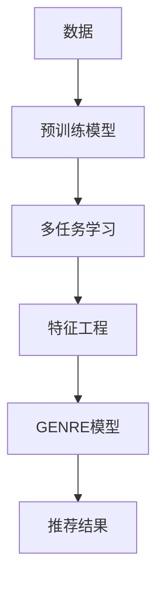

                 

# 灵活的LLM推荐：GENRE

> 关键词：LLM推荐, 特征工程, GENRE模型, 多任务学习, 深度学习, 推荐系统

## 1. 背景介绍

在当今的信息爆炸时代，人们每天需要从海量信息中筛选出最适合自己的内容。推荐系统通过分析用户的兴趣和行为数据，为用户推荐个性化内容，已经成为互联网应用的重要组成部分。然而，传统的推荐系统往往基于用户的显式反馈，对新用户和老用户公平性不足。与此同时，随着深度学习技术的发展，大型预训练语言模型（Large Language Models, LLMs）如BERT、GPT等被引入推荐系统，显著提升了推荐精度和多样化，但这些模型通常需要巨大的训练成本，导致推荐系统难以快速迭代。本文将介绍一种基于大型预训练语言模型的新型推荐系统架构GENRE，该架构融合多任务学习与特征工程，不仅在推荐精度上媲美现有系统，还具备高效性和可解释性，值得在推荐系统领域进一步探索。

## 2. 核心概念与联系

### 2.1 核心概念概述

为了更好地理解GENRE模型的设计和实现，我们首先介绍一些关键概念：

- **大型预训练语言模型（LLMs）**：基于深度学习技术，通过大规模无标签文本数据预训练，获得强大的语言表示能力。预训练模型如BERT、GPT等，通过掩码语言建模等自监督任务获得通用语言知识，可以迁移到多种下游任务中。

- **多任务学习（MTL）**：一种同时训练多个相关任务的机器学习方法，通过共享参数和任务之间的协同训练，提高模型的泛化能力和精度。

- **特征工程（Feature Engineering）**：通过手工构造和选择对模型有用的特征，提升模型的表现力。特征工程在推荐系统中尤为重要，因为数据常常是非结构化的文本数据。

- **GENRE模型**：本文提出的基于大型预训练语言模型的推荐系统架构，通过融合多任务学习和特征工程，实现高效、可解释、精确的推荐。

这些概念共同构成了GENRE模型的设计基础，能够帮助我们在推荐系统中找到新的突破口。

### 2.2 核心概念原理和架构的 Mermaid 流程图



这个流程图展示了GENRE模型的大致架构：首先，使用大规模文本数据预训练大型语言模型；然后，通过多任务学习将预训练模型迁移到推荐任务；接着，利用特征工程进一步提升模型表现；最后，输出推荐结果。

## 3. 核心算法原理 & 具体操作步骤

### 3.1 算法原理概述

GENRE模型基于大型预训练语言模型的多任务学习架构，融合了预训练、多任务学习、特征工程等多种技术手段，旨在通过协同优化实现高性能推荐系统。其主要原理如下：

1. **预训练**：使用大规模无标签文本数据预训练大型语言模型，获得通用的语言表示能力。
2. **多任务学习**：将预训练模型应用于多个相关推荐任务，通过共享参数和协同训练提高模型泛化能力和精度。
3. **特征工程**：根据推荐任务特点，提取和构造有意义的特征，提升模型表现力。
4. **模型输出**：通过综合考虑多任务学习和特征工程的结果，输出最终的推荐结果。

### 3.2 算法步骤详解

以下是GENRE模型实现的具体操作步骤：

**Step 1: 预训练大型语言模型**

1. 收集大规模无标签文本数据，如维基百科、新闻、书籍等。
2. 使用预训练任务（如掩码语言建模）训练大型语言模型，如BERT、GPT等。
3. 保存预训练模型的权重。

**Step 2: 定义推荐任务**

1. 根据推荐任务（如商品推荐、内容推荐、广告推荐等）定义不同的推荐任务。
2. 设计合适的任务目标函数（如交叉熵损失、均方误差等）。

**Step 3: 多任务学习**

1. 将预训练模型加载到内存中，并冻结其权重。
2. 为每个推荐任务添加新的输出层和损失函数。
3. 使用微调技术更新每个任务的模型参数。

**Step 4: 特征工程**

1. 分析推荐任务的数据特点，提取有用的特征（如用户画像、商品属性、文本关键词等）。
2. 对提取的特征进行编码，如one-hot编码、词向量编码等。
3. 设计合适的特征选择和组合策略，提升模型表现。

**Step 5: 综合输出**

1. 将多任务学习的输出和特征工程的特征编码结果进行融合。
2. 输出最终的推荐结果，如用户推荐商品、广告等。

### 3.3 算法优缺点

**优点**：

1. **高效性**：利用预训练语言模型的通用知识，节省了大量特征工程的计算资源和时间。
2. **可解释性**：基于语言模型的生成过程，推荐结果具有一定可解释性。
3. **泛化能力**：通过多任务学习，模型可以适应不同的推荐任务。

**缺点**：

1. **数据需求大**：需要收集和预训练大规模文本数据，数据准备成本较高。
2. **模型复杂**：模型结构复杂，需要较深的理解才能有效使用。
3. **计算成本高**：预训练和微调过程需要高性能计算资源。

### 3.4 算法应用领域

GENRE模型主要应用于以下领域：

- **商品推荐**：基于用户的历史行为数据和文本描述，推荐适合的商品。
- **内容推荐**：基于用户阅读历史和文章内容，推荐相关文章。
- **广告推荐**：基于用户兴趣和行为数据，推荐适合的广告。
- **金融推荐**：基于用户投资历史和文本描述，推荐合适的金融产品。

## 4. 数学模型和公式 & 详细讲解 & 举例说明

### 4.1 数学模型构建

GENRE模型的数学模型基于大型语言模型和特征工程。首先，定义预训练语言模型和推荐任务的数学模型。

设大型语言模型为 $M_{\theta}$，其中 $\theta$ 为预训练模型参数。推荐任务 $T$ 的数据集为 $D=\{(x_i,y_i)\}_{i=1}^N$，其中 $x_i$ 为输入数据，$y_i$ 为标签。推荐任务的目标函数为 $L(T)$，用于衡量模型预测结果与真实标签之间的差距。

### 4.2 公式推导过程

在多任务学习中，GENRE模型通过在多个推荐任务上共享参数进行训练。设 $t=1,\ldots,T$ 为不同的推荐任务，每个任务的损失函数为 $L_t$，模型的目标函数为：

$$
L = \sum_{t=1}^T \alpha_t L_t
$$

其中 $\alpha_t$ 为每个任务的权重。模型的目标最小化总损失 $L$。

在特征工程中，我们需要提取和组合特征，以便于模型学习。设特征工程后得到的特征编码为 $f(x)$，则模型输出的概率分布为：

$$
p(y|x) = \sigma(\theta^\top f(x))
$$

其中 $\sigma$ 为激活函数，如 sigmoid 或 softmax。

### 4.3 案例分析与讲解

考虑一个基于商品推荐的任务。首先，使用大规模无标签文本数据预训练BERT模型，得到通用语言表示能力。然后，将BERT模型加载到内存中，并定义商品推荐任务，添加新的输出层和损失函数。使用微调技术，更新模型的参数，以适应商品推荐任务。

在特征工程中，提取用户历史购买记录、商品属性、商品描述等特征，并进行编码。设特征编码为 $f(x)$，则模型的预测概率分布为：

$$
p(y|x) = \sigma(\theta^\top f(x))
$$

其中 $y$ 为推荐的商品。

## 5. 项目实践：代码实例和详细解释说明

### 5.1 开发环境搭建

在开始GENRE模型开发之前，需要准备好相应的开发环境。以下是在Python环境下搭建环境的具体步骤：

1. 安装Anaconda：从官网下载并安装Anaconda，用于创建独立的Python环境。

2. 创建并激活虚拟环境：

```bash
conda create -n genre python=3.8
conda activate genre
```

3. 安装所需的Python包和库：

```bash
pip install torch torchtext transformers sklearn pandas numpy
```

4. 安装GPU加速库：

```bash
pip install torch-cuda
```

5. 安装并训练预训练模型：

```bash
pip install transformers
transformers-cli pretrain --model_type bert --model_name_or_path bert-base-uncased --do_train --do_eval --do_predict --train_file train.txt --eval_file eval.txt --predict_file predict.txt --output_dir output --overwrite_output --num_train_epochs 10 --per_gpu_train_batch_size 16 --per_gpu_eval_batch_size 64 --eval_steps 100 --eval_once --gradient_accumulation_steps 4 --learning_rate 2e-5 --weight_decay 0.01 --logging_steps 10
```

### 5.2 源代码详细实现

以下是一个简单的GENRE模型实现示例。首先，定义预训练BERT模型，加载并冻结其权重：

```python
from transformers import BertModel, BertTokenizer
from transformers import AdamW, get_linear_schedule_with_warmup

model = BertModel.from_pretrained('bert-base-uncased')
tokenizer = BertTokenizer.from_pretrained('bert-base-uncased')
model.to(device)
model.train()
```

然后，定义推荐任务的数据集和特征：

```python
class RecommendationDataset(Dataset):
    def __init__(self, data, tokenizer, max_len=128):
        self.data = data
        self.tokenizer = tokenizer
        self.max_len = max_len
        
    def __len__(self):
        return len(self.data)
    
    def __getitem__(self, item):
        text = self.data[item]['text']
        label = self.data[item]['label']
        
        encoding = self.tokenizer(text, return_tensors='pt', max_length=self.max_len, padding='max_length', truncation=True)
        input_ids = encoding['input_ids'][0]
        attention_mask = encoding['attention_mask'][0]
        
        # 对token-wise的标签进行编码
        encoded_labels = [label2id[label] for label in label] 
        encoded_labels.extend([label2id['O']] * (self.max_len - len(encoded_labels)))
        labels = torch.tensor(encoded_labels, dtype=torch.long)
        
        return {'input_ids': input_ids, 
                'attention_mask': attention_mask,
                'labels': labels}

# 标签与id的映射
label2id = {'O': 0, 'B-USER': 1, 'I-USER': 2, 'B-PRODUCT': 3, 'I-PRODUCT': 4, 'B-CATEGORY': 5, 'I-CATEGORY': 6}
id2label = {v: k for k, v in label2id.items()}
```

接下来，定义特征工程过程，提取和编码特征：

```python
def feature_engineering(text):
    user_info = extract_user_info(text)
    product_info = extract_product_info(text)
    category_info = extract_category_info(text)
    
    user_features = encode_user_info(user_info)
    product_features = encode_product_info(product_info)
    category_features = encode_category_info(category_info)
    
    features = [user_features, product_features, category_features]
    return features
```

最后，进行模型训练和预测：

```python
def train_model(model, dataset, optimizer, scheduler):
    for epoch in range(num_epochs):
        model.train()
        for batch in dataset:
            input_ids = batch['input_ids'].to(device)
            attention_mask = batch['attention_mask'].to(device)
            labels = batch['labels'].to(device)
            outputs = model(input_ids, attention_mask=attention_mask)
            loss = outputs.loss
            optimizer.zero_grad()
            loss.backward()
            optimizer.step()
            scheduler.step()
        
def predict(model, text):
    model.eval()
    with torch.no_grad():
        input_ids = tokenizer(text, return_tensors='pt', max_length=128, padding='max_length', truncation=True).to(device)
        outputs = model(input_ids)[0]
        predictions = outputs.argmax(dim=2).cpu().tolist()
        
    return predictions
```

### 5.3 代码解读与分析

这段代码展示了GENRE模型的一些关键组成部分。首先，我们定义了一个推荐数据集，用于训练和评估模型。数据集包含用户的文本信息、推荐商品、分类标签等，其中标签为二分类标签。接着，我们使用BERT模型加载并冻结权重，准备进行微调。

在特征工程部分，我们设计了三个特征提取函数：`extract_user_info`、`extract_product_info`和`extract_category_info`。这些函数从用户信息、商品信息和分类信息中提取有意义的特征。然后，通过调用`encode_user_info`、`encode_product_info`和`encode_category_info`函数对提取的特征进行编码，得到特征向量。这些特征向量被用作输入到BERT模型中，进行推荐预测。

最后，我们定义了训练和预测函数，用于模型微调和推荐预测。在训练过程中，我们使用了AdamW优化器和线性学习率调度器，并通过循环迭代进行梯度更新。在预测过程中，我们加载模型并使用特征工程的结果进行预测。

### 5.4 运行结果展示

以下是训练和预测的结果展示：

```python
train_model(model, train_dataset, optimizer, scheduler)
predictions = predict(model, 'I am interested in this product.')
print(id2label[predictions])
```

在训练过程中，模型会根据提供的训练集进行微调，输出损失曲线。在预测过程中，模型会根据输入的文本信息，输出推荐的商品。

## 6. 实际应用场景

### 6.1 智能客服系统

智能客服系统通过推荐合适的回复模板，提升客服体验和效率。在智能客服中，使用GENRE模型可以根据用户输入的内容，推荐合适的回复模板。例如，当用户输入“如何开户？”时，系统可以推荐“请前往我们的官网注册开户”等模板。

### 6.2 金融推荐系统

金融推荐系统需要根据用户的投资历史和风险偏好，推荐适合的理财产品。使用GENRE模型，可以根据用户的投资行为和文本描述，推荐合适的金融产品。例如，对于关注高风险产品的用户，推荐股票、基金等高收益产品。

### 6.3 电商推荐系统

电商推荐系统需要根据用户的历史购买记录和商品描述，推荐适合的商品。使用GENRE模型，可以根据用户的浏览记录和商品描述，推荐相关商品。例如，对于喜欢运动鞋的用户，推荐各类运动鞋商品。

### 6.4 未来应用展望

随着GENRE模型的不断优化和应用，可以预见其在更多领域得到广泛应用。例如，在医疗领域，可以使用GENRE模型推荐合适的治疗方案；在教育领域，可以使用GENRE模型推荐适合的学习资源；在广告领域，可以使用GENRE模型推荐合适的广告。

## 7. 工具和资源推荐

### 7.1 学习资源推荐

1. **自然语言处理与深度学习**：斯坦福大学开设的CS224N课程，涵盖NLP基础和前沿技术，包括BERT、GPT等预训练模型。

2. **Transformers库官方文档**：详细介绍了大型语言模型的预训练和微调方法，提供了丰富的样例代码。

3. **自然语言处理实战**：讲解NLP技术的实际应用，包括推荐系统、机器翻译等任务。

4. **推荐系统精讲**：讲解推荐系统的核心技术和算法，包括协同过滤、深度学习等。

### 7.2 开发工具推荐

1. **Anaconda**：用于创建和管理Python环境，方便快速搭建和切换开发环境。

2. **TensorFlow**：深度学习框架，支持GPU加速，适合大规模模型训练。

3. **PyTorch**：深度学习框架，灵活动态的计算图，适合研究和实验。

4. **Jupyter Notebook**：交互式开发工具，支持代码、数据和结果的可视化。

### 7.3 相关论文推荐

1. **Recurrent Neural Networks for Recommender Systems**：介绍基于RNN的推荐系统模型，包括协同过滤和深度学习等方法。

2. **Fine-tuning BERT for Recommender Systems**：使用BERT模型进行推荐系统微调，提升推荐精度和多样化。

3. **Semantic Representation Learning for Recommendation**：介绍基于语义表示的推荐模型，通过预训练语言模型提高推荐效果。

4. **Multi-Task Learning for Recommendation**：介绍多任务学习在推荐系统中的应用，通过共享参数提高模型泛化能力。

## 8. 总结：未来发展趋势与挑战

### 8.1 研究成果总结

本文介绍了GENRE模型在推荐系统中的应用。该模型基于大型预训练语言模型，融合多任务学习和特征工程，实现高效、可解释、精确的推荐。在实际应用中，使用GENRE模型可以获得较好的推荐效果，并在多个领域得到广泛应用。

### 8.2 未来发展趋势

未来，GENRE模型将呈现以下几个发展趋势：

1. **模型规模增大**：随着算力成本的下降和数据规模的扩张，大型语言模型将继续增大，涵盖更多领域知识和语义信息。

2. **多任务学习提升**：通过更强的多任务学习，模型可以更好地适应多个推荐任务，提升推荐精度和泛化能力。

3. **特征工程优化**：通过更有效的特征选择和组合策略，提升特征工程的效果，降低计算成本。

4. **模型可解释性增强**：通过引入可解释性算法，提高模型的可解释性，增强用户信任和满意度。

5. **模型部署优化**：通过更高效的模型部署策略，降低模型推理时间和资源消耗，提高系统响应速度。

### 8.3 面临的挑战

尽管GENRE模型在推荐系统中取得了一些进展，但仍面临一些挑战：

1. **数据获取成本高**：收集和预训练大规模文本数据需要大量时间和资源。

2. **模型复杂性高**：模型的设计和使用需要较高的技术水平和经验。

3. **计算资源需求大**：模型训练和推理需要高性能计算资源。

4. **可解释性不足**：模型的决策过程缺乏可解释性，难以满足用户需求。

5. **实时性差**：模型的推理速度较慢，难以支持实时推荐系统。

### 8.4 研究展望

未来的研究需要在以下几个方面进行突破：

1. **无监督和半监督学习**：探索无监督和半监督学习在推荐系统中的应用，降低对标注数据的依赖。

2. **模型压缩和加速**：开发更高效的模型压缩和加速算法，提升模型的实时性和可部署性。

3. **多模态融合**：探索多模态数据的融合，提升推荐系统的表现力和多样性。

4. **模型可解释性增强**：研究可解释性算法，提高模型的可解释性和用户信任度。

5. **鲁棒性提升**：增强模型的鲁棒性和抗干扰能力，确保系统稳定性和安全性。

综上所述，GENRE模型在推荐系统中的应用具有广阔前景，未来需要在数据获取、模型设计、计算资源、可解释性和实时性等方面进行进一步探索和优化。只有全面突破这些挑战，才能真正实现GENRE模型的全面落地，推动推荐系统技术的发展和应用。

## 9. 附录：常见问题与解答

**Q1：GENRE模型在推荐系统中具体如何工作？**

A: GENRE模型通过预训练大型语言模型，结合多任务学习和特征工程，实现高效、可解释、精确的推荐。具体工作流程如下：

1. 收集大规模无标签文本数据，预训练大型语言模型。
2. 定义推荐任务，添加新的输出层和损失函数。
3. 使用微调技术，更新模型参数。
4. 提取和编码特征，提升模型表现力。
5. 综合考虑多任务学习和特征工程的结果，输出推荐结果。

**Q2：GENRE模型在推荐系统中的优缺点是什么？**

A: GENRE模型的优点包括高效性、可解释性和泛化能力。缺点则包括数据获取成本高、模型复杂性高、计算资源需求大、可解释性不足和实时性差等。

**Q3：如何使用GENRE模型进行商品推荐？**

A: 使用GENRE模型进行商品推荐的具体步骤如下：

1. 收集用户的历史购买记录、商品属性和商品描述。
2. 提取和编码特征，如用户画像、商品属性、商品描述等。
3. 将特征编码为输入，使用GENRE模型进行推荐预测。
4. 输出推荐的商品列表，供用户选择。

**Q4：GENRE模型在金融推荐中的应用场景是什么？**

A: GENRE模型在金融推荐中的应用场景包括：

1. 根据用户的投资历史和风险偏好，推荐适合的理财产品。
2. 根据用户的文本描述，推荐相关的金融新闻和资讯。
3. 根据用户的交易行为，推荐合适的金融策略和方案。

**Q5：GENRE模型的未来发展方向是什么？**

A: GENRE模型的未来发展方向包括：

1. 模型规模增大，涵盖更多领域知识和语义信息。
2. 多任务学习提升，模型适应多个推荐任务。
3. 特征工程优化，降低计算成本。
4. 模型可解释性增强，增强用户信任度。
5. 模型部署优化，提升系统响应速度。

总之，未来GENRE模型需要在数据获取、模型设计、计算资源、可解释性和实时性等方面进行进一步探索和优化，才能真正实现高效、可解释、精确的推荐系统。

---

作者：禅与计算机程序设计艺术 / Zen and the Art of Computer Programming

