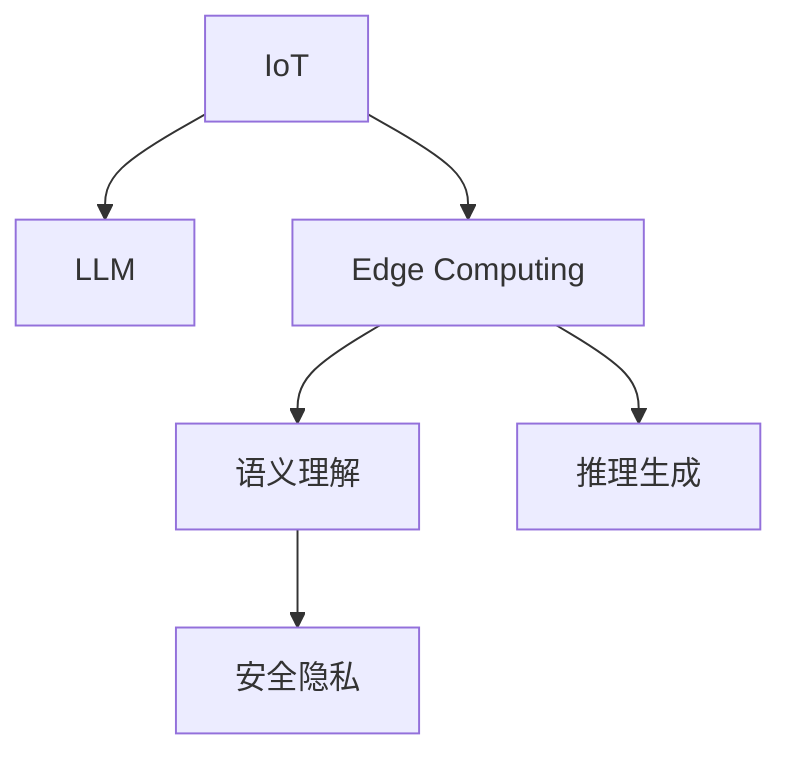

                 

# 物联网与 LLM：智能设备互联

> 关键词：物联网, 大语言模型(LLM), 智能设备互联, 数据通信, 边缘计算, 语义理解, 推理生成, 安全隐私

## 1. 背景介绍

### 1.1 问题由来
物联网（Internet of Things, IoT）的迅猛发展，带来了前所未有的数据量与设备互联需求。数以亿计的智能设备全天候产生数据，并通过互联网传递给云端服务器。然而，这些数据通常包含大量非结构化信息，如语音、图像、视频、传感器读数等，难以直接用于高级分析。大语言模型（Large Language Model, LLM）作为当前自然语言处理（Natural Language Processing, NLP）领域的最先进技术，具备强大的语言理解和生成能力，能够处理和分析复杂的多模态数据，成为物联网与智能设备互联领域的重要工具。

### 1.2 问题核心关键点
目前，物联网与智能设备互联领域面临的主要挑战包括：
1. **数据异构性**：设备间数据格式不一，需要进行预处理和转换。
2. **数据传输速率与带宽**：海量数据实时传输占用高带宽，可能导致延迟。
3. **计算资源分散**：智能设备计算能力有限，数据处理任务通常依赖云端。
4. **隐私与安全**：设备数据隐私保护和传输安全至关重要。
5. **语义理解与推理**：设备需要理解自然语言指令，并进行推理生成相应操作。

大语言模型通过其强大的自然语言理解和生成能力，可以在上述各个环节发挥作用，提升智能设备互联的效率与安全性，同时也促进了物联网技术与AI的深度融合。

### 1.3 问题研究意义
大语言模型在物联网与智能设备互联中的应用，对于推动智能设备的智能化、自动化进程，提升用户体验，具有重要意义：
1. **数据预处理与转换**：通过语义理解，自动将异构数据转换为统一的文本格式。
2. **实时数据处理与推理**：设备本地即可处理简单任务，减轻云端负担。
3. **智能决策与控制**：基于语言模型生成的指令，实现复杂操作与决策。
4. **隐私保护**：通过零样本学习或少样本学习，设备可在不泄露隐私的前提下，获取所需信息。
5. **增强人机交互**：改善设备与用户之间的交互体验，提高用户满意度。

## 2. 核心概念与联系

### 2.1 核心概念概述

为更好地理解基于大语言模型的物联网与智能设备互联方法，本节将介绍几个密切相关的核心概念：

- 物联网（IoT）：通过互联网连接物理设备，实现设备间信息交换与通信。
- 大语言模型（LLM）：基于Transformer结构，在大规模文本数据上预训练得到的语言模型，具备强大的自然语言处理能力。
- 边缘计算（Edge Computing）：在数据源附近进行计算，减轻中心服务器的负担，提高数据处理效率。
- 语义理解（Semantic Understanding）：理解自然语言输入的含义，并抽取关键信息。
- 推理生成（Inference and Generation）：根据输入信息，生成自然语言输出。
- 安全隐私（Security and Privacy）：保护设备与用户数据，防止数据泄露和滥用。

这些核心概念之间的逻辑关系可以通过以下Mermaid流程图来展示：



这个流程图展示了大语言模型在大规模物联网设备互联中的关键作用：

1. 物联网设备采集的数据，通过边缘计算进行处理，减轻中心服务器负担。
2. 边缘计算模块调用大语言模型进行语义理解，抽取关键信息。
3. 基于理解的信息，调用推理生成模块生成自然语言指令。
4. 设备根据生成的指令进行操作，同时确保数据传输过程中的安全隐私。

## 3. 核心算法原理 & 具体操作步骤
### 3.1 算法原理概述

基于大语言模型的物联网与智能设备互联，本质上是一种基于语言模型的数据处理与推理生成过程。其核心思想是：将大语言模型视为一种通用的数据处理工具，通过自然语言理解能力，对设备采集的多模态数据进行处理，实现数据转换、推理生成等功能。

形式化地，假设物联网设备采集到的多模态数据为 $D=\{(x_i,y_i)\}_{i=1}^N$，其中 $x_i$ 为输入数据，$y_i$ 为对应输出指令或结果。定义大语言模型 $M_{\theta}$，其中 $\theta$ 为模型参数。目标是通过有监督学习优化模型参数 $\theta$，使其能够根据输入 $x_i$ 生成输出指令 $y_i$。

微调的目标是最小化经验风险：

$$
\hat{\theta}=\mathop{\arg\min}_{\theta} \mathcal{L}(M_{\theta},D)
$$

其中 $\mathcal{L}$ 为针对任务设计的损失函数，用于衡量模型输出与真实标签之间的差异。常见的损失函数包括交叉熵损失、均方误差损失等。

### 3.2 算法步骤详解

基于大语言模型的物联网与智能设备互联方法，一般包括以下几个关键步骤：

**Step 1: 准备预训练模型和数据集**
- 选择合适的预训练语言模型 $M_{\theta}$ 作为初始化参数，如 GPT-3、BERT 等。
- 准备物联网设备采集的数据集 $D$，划分为训练集、验证集和测试集。一般要求数据集与预训练数据的分布不要差异过大。

**Step 2: 设计任务适配层**
- 根据具体应用场景，设计合适的输入和输出格式，定义损失函数。
- 对于生成任务，通常使用语言模型的解码器输出概率分布，并以负对数似然为损失函数。
- 对于分类任务，通常在顶层添加线性分类器和交叉熵损失函数。

**Step 3: 设置微调超参数**
- 选择合适的优化算法及其参数，如 AdamW、SGD 等，设置学习率、批大小、迭代轮数等。
- 设置正则化技术及强度，包括权重衰减、Dropout、Early Stopping 等。
- 确定冻结预训练参数的策略，如仅微调顶层，或全部参数都参与微调。

**Step 4: 执行梯度训练**
- 将训练集数据分批次输入模型，前向传播计算损失函数。
- 反向传播计算参数梯度，根据设定的优化算法和学习率更新模型参数。
- 周期性在验证集上评估模型性能，根据性能指标决定是否触发 Early Stopping。
- 重复上述步骤直到满足预设的迭代轮数或 Early Stopping 条件。

**Step 5: 测试和部署**
- 在测试集上评估微调后模型 $M_{\hat{\theta}}$ 的性能，对比微调前后的精度提升。
- 使用微调后的模型对新样本进行推理预测，集成到实际的应用系统中。
- 持续收集新的数据，定期重新微调模型，以适应数据分布的变化。

以上是基于大语言模型微调的物联网与智能设备互联的一般流程。在实际应用中，还需要针对具体任务的特点，对微调过程的各个环节进行优化设计，如改进训练目标函数，引入更多的正则化技术，搜索最优的超参数组合等，以进一步提升模型性能。

### 3.3 算法优缺点

基于大语言模型的物联网与智能设备互联方法具有以下优点：
1. 简单高效。只需准备少量标注数据，即可对预训练模型进行快速适配，获得较大的性能提升。
2. 通用适用。适用于各种物联网设备和应用场景，设计简单的任务适配层即可实现微调。
3. 推理生成能力。大语言模型具备强大的自然语言处理和生成能力，能够实现复杂的决策与操作。
4. 数据压缩与推理效率。通过语言模型对多模态数据进行压缩和推理，减轻数据传输和计算负担。

同时，该方法也存在一定的局限性：
1. 依赖标注数据。微调的效果很大程度上取决于标注数据的质量和数量，获取高质量标注数据的成本较高。
2. 迁移能力有限。当目标任务与预训练数据的分布差异较大时，微调的性能提升有限。
3. 模型鲁棒性。大语言模型面对噪声和干扰可能产生不稳定输出。
4. 隐私安全。通过微调模型，设备数据可能会被反向追踪到用户，存在隐私泄露风险。

尽管存在这些局限性，但就目前而言，基于大语言模型的微调方法仍是大规模物联网设备互联的重要手段。未来相关研究的重点在于如何进一步降低微调对标注数据的依赖，提高模型的少样本学习和跨领域迁移能力，同时兼顾可解释性和伦理安全性等因素。

### 3.4 算法应用领域

基于大语言模型的物联网与智能设备互联方法，在众多领域都有广泛的应用，例如：

- 智能家居：通过自然语言指令控制家电，实现家庭自动化。
- 智慧城市：设备采集的城市数据通过自然语言理解进行处理，辅助城市管理。
- 工业制造：设备采集的传感器数据通过自然语言生成报告，帮助工人诊断和维护。
- 医疗健康：通过智能音箱或语音助手，患者可以轻松查询健康建议和就医指南。
- 金融服务：智能设备采集的金融数据，通过语言模型进行分析，提供个性化金融服务。
- 教育培训：学生通过语音指令查询学习资料，设备自动生成个性化学习计划。

除了上述这些经典应用外，大语言模型在物联网与智能设备互联中还有更多的创新应用，如多模态数据融合、自然语言与图像混合推理等，为物联网技术的进一步发展提供了新的方向。

## 4. 数学模型和公式 & 详细讲解  
### 4.1 数学模型构建

本节将使用数学语言对基于大语言模型的物联网与智能设备互联过程进行更加严格的刻画。

假设物联网设备采集的数据为 $D=\{(x_i,y_i)\}_{i=1}^N$，其中 $x_i$ 为输入数据，$y_i$ 为对应输出指令或结果。定义大语言模型为 $M_{\theta}$，其中 $\theta$ 为模型参数。

定义模型 $M_{\theta}$ 在数据样本 $(x,y)$ 上的损失函数为 $\ell(M_{\theta}(x),y)$，则在数据集 $D$ 上的经验风险为：

$$
\mathcal{L}(\theta) = \frac{1}{N} \sum_{i=1}^N \ell(M_{\theta}(x_i),y_i)
$$

微调的目标是最小化经验风险，即找到最优参数：

$$
\theta^* = \mathop{\arg\min}_{\theta} \mathcal{L}(\theta)
$$

在实践中，我们通常使用基于梯度的优化算法（如SGD、Adam等）来近似求解上述最优化问题。设 $\eta$ 为学习率，$\lambda$ 为正则化系数，则参数的更新公式为：

$$
\theta \leftarrow \theta - \eta \nabla_{\theta}\mathcal{L}(\theta) - \eta\lambda\theta
$$

其中 $\nabla_{\theta}\mathcal{L}(\theta)$ 为损失函数对参数 $\theta$ 的梯度，可通过反向传播算法高效计算。

### 4.2 公式推导过程

以下我们以文本分类任务为例，推导交叉熵损失函数及其梯度的计算公式。

假设模型 $M_{\theta}$ 在输入 $x$ 上的输出为 $\hat{y}=M_{\theta}(x) \in [0,1]$，表示样本属于正类的概率。真实标签 $y \in \{0,1\}$。则二分类交叉熵损失函数定义为：

$$
\ell(M_{\theta}(x),y) = -[y\log \hat{y} + (1-y)\log (1-\hat{y})]
$$

将其代入经验风险公式，得：

$$
\mathcal{L}(\theta) = -\frac{1}{N}\sum_{i=1}^N [y_i\log M_{\theta}(x_i)+(1-y_i)\log(1-M_{\theta}(x_i))]
$$

根据链式法则，损失函数对参数 $\theta_k$ 的梯度为：

$$
\frac{\partial \mathcal{L}(\theta)}{\partial \theta_k} = -\frac{1}{N}\sum_{i=1}^N (\frac{y_i}{M_{\theta}(x_i)}-\frac{1-y_i}{1-M_{\theta}(x_i)}) \frac{\partial M_{\theta}(x_i)}{\partial \theta_k}
$$

其中 $\frac{\partial M_{\theta}(x_i)}{\partial \theta_k}$ 可进一步递归展开，利用自动微分技术完成计算。

在得到损失函数的梯度后，即可带入参数更新公式，完成模型的迭代优化。重复上述过程直至收敛，最终得到适应物联网设备互联任务的最优模型参数 $\theta^*$。

## 5. 项目实践：代码实例和详细解释说明
### 5.1 开发环境搭建

在进行物联网与智能设备互联实践前，我们需要准备好开发环境。以下是使用Python进行PyTorch开发的环境配置流程：

1. 安装Anaconda：从官网下载并安装Anaconda，用于创建独立的Python环境。

2. 创建并激活虚拟环境：
```bash
conda create -n pytorch-env python=3.8 
conda activate pytorch-env
```

3. 安装PyTorch：根据CUDA版本，从官网获取对应的安装命令。例如：
```bash
conda install pytorch torchvision torchaudio cudatoolkit=11.1 -c pytorch -c conda-forge
```

4. 安装Transformers库：
```bash
pip install transformers
```

5. 安装各类工具包：
```bash
pip install numpy pandas scikit-learn matplotlib tqdm jupyter notebook ipython
```

完成上述步骤后，即可在`pytorch-env`环境中开始物联网与智能设备互联实践。

### 5.2 源代码详细实现

这里我们以智能家居系统为例，给出使用Transformers库对BERT模型进行微调的PyTorch代码实现。

首先，定义智能家居任务的数据处理函数：

```python
from transformers import BertTokenizer
from torch.utils.data import Dataset
import torch

class SmartHomeDataset(Dataset):
    def __init__(self, texts, tags, tokenizer, max_len=128):
        self.texts = texts
        self.tags = tags
        self.tokenizer = tokenizer
        self.max_len = max_len
        
    def __len__(self):
        return len(self.texts)
    
    def __getitem__(self, item):
        text = self.texts[item]
        tags = self.tags[item]
        
        encoding = self.tokenizer(text, return_tensors='pt', max_length=self.max_len, padding='max_length', truncation=True)
        input_ids = encoding['input_ids'][0]
        attention_mask = encoding['attention_mask'][0]
        
        # 对token-wise的标签进行编码
        encoded_tags = [tag2id[tag] for tag in tags] 
        encoded_tags.extend([tag2id['O']] * (self.max_len - len(encoded_tags)))
        labels = torch.tensor(encoded_tags, dtype=torch.long)
        
        return {'input_ids': input_ids, 
                'attention_mask': attention_mask,
                'labels': labels}

# 标签与id的映射
tag2id = {'O': 0, '开灯': 1, '关灯': 2, '开空调': 3, '关空调': 4, '开窗': 5, '关窗': 6}
id2tag = {v: k for k, v in tag2id.items()}

# 创建dataset
tokenizer = BertTokenizer.from_pretrained('bert-base-cased')

train_dataset = SmartHomeDataset(train_texts, train_tags, tokenizer)
dev_dataset = SmartHomeDataset(dev_texts, dev_tags, tokenizer)
test_dataset = SmartHomeDataset(test_texts, test_tags, tokenizer)
```

然后，定义模型和优化器：

```python
from transformers import BertForTokenClassification, AdamW

model = BertForTokenClassification.from_pretrained('bert-base-cased', num_labels=len(tag2id))

optimizer = AdamW(model.parameters(), lr=2e-5)
```

接着，定义训练和评估函数：

```python
from torch.utils.data import DataLoader
from tqdm import tqdm
from sklearn.metrics import classification_report

device = torch.device('cuda') if torch.cuda.is_available() else torch.device('cpu')
model.to(device)

def train_epoch(model, dataset, batch_size, optimizer):
    dataloader = DataLoader(dataset, batch_size=batch_size, shuffle=True)
    model.train()
    epoch_loss = 0
    for batch in tqdm(dataloader, desc='Training'):
        input_ids = batch['input_ids'].to(device)
        attention_mask = batch['attention_mask'].to(device)
        labels = batch['labels'].to(device)
        model.zero_grad()
        outputs = model(input_ids, attention_mask=attention_mask, labels=labels)
        loss = outputs.loss
        epoch_loss += loss.item()
        loss.backward()
        optimizer.step()
    return epoch_loss / len(dataloader)

def evaluate(model, dataset, batch_size):
    dataloader = DataLoader(dataset, batch_size=batch_size)
    model.eval()
    preds, labels = [], []
    with torch.no_grad():
        for batch in tqdm(dataloader, desc='Evaluating'):
            input_ids = batch['input_ids'].to(device)
            attention_mask = batch['attention_mask'].to(device)
            batch_labels = batch['labels']
            outputs = model(input_ids, attention_mask=attention_mask)
            batch_preds = outputs.logits.argmax(dim=2).to('cpu').tolist()
            batch_labels = batch_labels.to('cpu').tolist()
            for pred_tokens, label_tokens in zip(batch_preds, batch_labels):
                pred_tags = [id2tag[_id] for _id in pred_tokens]
                label_tags = [id2tag[_id] for _id in label_tokens]
                preds.append(pred_tags[:len(label_tags)])
                labels.append(label_tags)
                
    print(classification_report(labels, preds))
```

最后，启动训练流程并在测试集上评估：

```python
epochs = 5
batch_size = 16

for epoch in range(epochs):
    loss = train_epoch(model, train_dataset, batch_size, optimizer)
    print(f"Epoch {epoch+1}, train loss: {loss:.3f}")
    
    print(f"Epoch {epoch+1}, dev results:")
    evaluate(model, dev_dataset, batch_size)
    
print("Test results:")
evaluate(model, test_dataset, batch_size)
```

以上就是使用PyTorch对BERT进行智能家居系统微调的完整代码实现。可以看到，得益于Transformers库的强大封装，我们可以用相对简洁的代码完成BERT模型的加载和微调。

### 5.3 代码解读与分析

让我们再详细解读一下关键代码的实现细节：

**SmartHomeDataset类**：
- `__init__`方法：初始化文本、标签、分词器等关键组件。
- `__len__`方法：返回数据集的样本数量。
- `__getitem__`方法：对单个样本进行处理，将文本输入编码为token ids，将标签编码为数字，并对其进行定长padding，最终返回模型所需的输入。

**tag2id和id2tag字典**：
- 定义了标签与数字id之间的映射关系，用于将token-wise的预测结果解码回真实的标签。

**训练和评估函数**：
- 使用PyTorch的DataLoader对数据集进行批次化加载，供模型训练和推理使用。
- 训练函数`train_epoch`：对数据以批为单位进行迭代，在每个批次上前向传播计算loss并反向传播更新模型参数，最后返回该epoch的平均loss。
- 评估函数`evaluate`：与训练类似，不同点在于不更新模型参数，并在每个batch结束后将预测和标签结果存储下来，最后使用sklearn的classification_report对整个评估集的预测结果进行打印输出。

**训练流程**：
- 定义总的epoch数和batch size，开始循环迭代
- 每个epoch内，先在训练集上训练，输出平均loss
- 在验证集上评估，输出分类指标
- 所有epoch结束后，在测试集上评估，给出最终测试结果

可以看到，PyTorch配合Transformers库使得BERT微调的代码实现变得简洁高效。开发者可以将更多精力放在数据处理、模型改进等高层逻辑上，而不必过多关注底层的实现细节。

当然，工业级的系统实现还需考虑更多因素，如模型的保存和部署、超参数的自动搜索、更灵活的任务适配层等。但核心的微调范式基本与此类似。

## 6. 实际应用场景
### 6.1 智能家居系统

基于大语言模型的智能家居系统，可以极大地提升家庭自动化管理水平，为用户带来便捷高效的生活体验。

在技术实现上，可以收集用户的语音命令、行为数据等，将其转换为自然语言描述，通过微调后的语言模型进行处理和推理。模型能够识别出用户的指令，并生成对应的设备操作命令，从而实现设备控制。例如，用户说出“开灯”，系统能够自动识别并发送相应指令，控制客厅灯开启。

### 6.2 智慧城市管理

智慧城市管理中，大语言模型可以通过物联网设备采集的各类数据，进行语义理解和推理，辅助城市管理决策。

例如，通过智能摄像头采集的视频数据，利用大语言模型进行实时分析，自动生成警情报告。利用气象站采集的气象数据，通过语言模型生成天气预报和预警。这些信息能够帮助城市管理者快速响应突发事件，提升城市治理效率。

### 6.3 工业自动化

工业制造中，物联网设备采集的传感器数据往往包含大量非结构化信息，难以直接用于分析。大语言模型可以将其转换为可理解的文本格式，再进行推理生成。

例如，通过机械臂采集的生产数据，利用语言模型生成设备运行状态报告。或者通过智能仓库采集的货物信息，生成仓库管理报告。这些信息能够帮助工人及时发现问题并进行维护，提高生产效率。

### 6.4 智能医疗

在医疗领域，大语言模型可以用于智能问答、病历分析、健康建议等。智能医疗设备采集的患者数据，通过语言模型进行语义理解，生成相应的医疗建议和诊断报告。

例如，通过语音助手，患者可以查询健康建议和就医指南，系统能够根据用户的症状，生成相应的医疗建议。利用智能病床采集的患者生理数据，通过语言模型生成病历报告，帮助医生进行诊断和治疗。

### 6.5 金融服务

金融服务中，大语言模型可以用于智能客服、风险评估、投资建议等。智能客服设备采集的用户咨询，通过语言模型进行语义理解，生成相应的回答。

例如，通过智能客服机器人，用户可以查询金融产品信息，系统能够自动生成回答。利用金融市场数据，通过语言模型进行风险评估，生成投资建议。这些服务能够提升用户体验，降低银行运营成本。

## 7. 工具和资源推荐
### 7.1 学习资源推荐

为了帮助开发者系统掌握大语言模型在物联网与智能设备互联中的应用，这里推荐一些优质的学习资源：

1. 《IoT and AI: A Practical Guide to IoT and AI Integration》书籍：全面介绍了物联网与人工智能技术的整合，涵盖从设备部署到应用落地的各个环节。

2. 《NLP with Python: Deep Learning and Natural Language Processing》课程：通过Python和PyTorch实现NLP任务，包括语言模型的预训练和微调。

3. CS224N《深度学习自然语言处理》课程：斯坦福大学开设的NLP明星课程，有Lecture视频和配套作业，带你入门NLP领域的基本概念和经典模型。

4. Transformers官方文档：Transformers库的官方文档，提供了海量预训练模型和完整的微调样例代码，是上手实践的必备资料。

5. TensorFlow官方文档：TensorFlow官方文档，详细介绍了TensorFlow的API和功能，包括边端计算、模型部署等。

通过对这些资源的学习实践，相信你一定能够快速掌握大语言模型在物联网与智能设备互联中的应用方法，并用于解决实际的NLP问题。
### 7.2 开发工具推荐

高效的开发离不开优秀的工具支持。以下是几款用于大语言模型在物联网与智能设备互联开发的常用工具：

1. PyTorch：基于Python的开源深度学习框架，灵活动态的计算图，适合快速迭代研究。大部分预训练语言模型都有PyTorch版本的实现。

2. TensorFlow：由Google主导开发的开源深度学习框架，生产部署方便，适合大规模工程应用。同样有丰富的预训练语言模型资源。

3. Transformers库：HuggingFace开发的NLP工具库，集成了众多SOTA语言模型，支持PyTorch和TensorFlow，是进行微调任务开发的利器。

4. Weights & Biases：模型训练的实验跟踪工具，可以记录和可视化模型训练过程中的各项指标，方便对比和调优。与主流深度学习框架无缝集成。

5. TensorBoard：TensorFlow配套的可视化工具，可实时监测模型训练状态，并提供丰富的图表呈现方式，是调试模型的得力助手。

6. Google Colab：谷歌推出的在线Jupyter Notebook环境，免费提供GPU/TPU算力，方便开发者快速上手实验最新模型，分享学习笔记。

合理利用这些工具，可以显著提升大语言模型在物联网与智能设备互联任务的开发效率，加快创新迭代的步伐。

### 7.3 相关论文推荐

大语言模型在物联网与智能设备互联中的应用研究源于学界的持续研究。以下是几篇奠基性的相关论文，推荐阅读：

1. Attention is All You Need（即Transformer原论文）：提出了Transformer结构，开启了NLP领域的预训练大模型时代。

2. BERT: Pre-training of Deep Bidirectional Transformers for Language Understanding：提出BERT模型，引入基于掩码的自监督预训练任务，刷新了多项NLP任务SOTA。

3. Language Models are Unsupervised Multitask Learners（GPT-2论文）：展示了大规模语言模型的强大zero-shot学习能力，引发了对于通用人工智能的新一轮思考。

4. Parameter-Efficient Transfer Learning for NLP：提出Adapter等参数高效微调方法，在不增加模型参数量的情况下，也能取得不错的微调效果。

5. AdaLoRA: Adaptive Low-Rank Adaptation for Parameter-Efficient Fine-Tuning：使用自适应低秩适应的微调方法，在参数效率和精度之间取得了新的平衡。

6. AdaML: Adaptive Machine Learning for IoT System: An Integrated Approach for Data Driven IoT: A Survey：综述了AdaML方法在大规模物联网系统中的应用，包括数据驱动的模型训练和模型优化。

这些论文代表了大语言模型在物联网与智能设备互联领域的发展脉络。通过学习这些前沿成果，可以帮助研究者把握学科前进方向，激发更多的创新灵感。

## 8. 总结：未来发展趋势与挑战

### 8.1 总结

本文对基于大语言模型的物联网与智能设备互联方法进行了全面系统的介绍。首先阐述了物联网与智能设备互联的背景和意义，明确了大语言模型在其中的独特价值。其次，从原理到实践，详细讲解了基于大语言模型的物联网与智能设备互联方法，给出了物联网设备互联的完整代码实例。同时，本文还广泛探讨了该方法在智能家居、智慧城市、工业自动化、智能医疗、金融服务等多个行业领域的应用前景，展示了其在提升用户体验、辅助决策等方面的巨大潜力。此外，本文精选了相关学习资源，力求为读者提供全方位的技术指引。

通过本文的系统梳理，可以看到，基于大语言模型的物联网与智能设备互联方法在提升设备智能性、提升用户体验、辅助决策等方面具有广泛的应用前景。未来，伴随物联网设备的普及和算力资源的提升，大语言模型将能够处理更多元、更复杂的数据，实现更高效的推理与生成，推动物联网技术与AI的深度融合。

### 8.2 未来发展趋势

展望未来，大语言模型在物联网与智能设备互联中呈现以下几个发展趋势：

1. **设备互联的智能化**：未来的大语言模型将具备更强的语义理解能力，能够处理更复杂的自然语言指令，实现更高级的设备互联功能。
2. **边缘计算的普及**：边缘计算技术将得到更广泛的应用，设备本地即可处理简单的推理和决策，减轻云端服务器负担。
3. **多模态融合**：未来的物联网系统将融合更多元的数据模态，如语音、图像、视频等，大语言模型将具备处理多模态数据的能力，实现更全面的语义理解。
4. **隐私保护**：随着数据隐私保护意识的增强，未来的物联网系统将更加重视用户数据的安全，大语言模型将引入更多隐私保护机制，防止数据泄露和滥用。
5. **自动化与自适应**：未来的物联网系统将具备更强的自适应能力，大语言模型将根据用户行为和环境变化，自动调整推理逻辑和操作策略。
6. **跨领域迁移**：未来的物联网系统将跨行业、跨领域应用，大语言模型将具备更强的跨领域迁移能力，提升系统的通用性和灵活性。

以上趋势凸显了大语言模型在物联网与智能设备互联中的广阔前景。这些方向的探索发展，必将进一步提升物联网系统的智能性、安全性和用户体验，推动AI技术与物联网技术的深度融合。

### 8.3 面临的挑战

尽管大语言模型在物联网与智能设备互联中的应用已经取得了一定成果，但在迈向更加智能化、普适化应用的过程中，仍面临诸多挑战：

1. **设备计算能力的限制**：物联网设备计算能力有限，如何提升设备本地推理和生成能力，是未来的一个重要研究方向。
2. **数据多样性与异构性**：物联网设备采集的数据格式各异，如何统一数据格式，提升数据处理效率，也是一大挑战。
3. **实时性要求高**：物联网系统对实时性要求较高，如何优化模型推理过程，提高实时响应速度，也是未来需要解决的问题。
4. **隐私与安全问题**：设备数据隐私保护和传输安全至关重要，如何在确保数据隐私的前提下，实现高效的数据处理和推理，也是未来研究的重点。
5. **模型泛化能力**：不同的物联网应用场景，数据分布和任务需求差异较大，如何提升大语言模型的泛化能力，使其在不同场景下表现稳定，是一个重要课题。

尽管存在这些挑战，但随着技术的发展和研究的深入，相信这些问题终将逐步得到解决。未来，大语言模型将在物联网与智能设备互联领域发挥越来越重要的作用，推动人类社会的智能化进步。

### 8.4 研究展望

面对物联网与智能设备互联所面临的种种挑战，未来的研究需要在以下几个方面寻求新的突破：

1. **设备本地推理优化**：开发高效的设备本地推理算法，提升设备的推理速度和生成能力，实现低延迟、高吞吐量的推理任务。
2. **多模态数据处理**：引入多模态数据融合技术，提升大语言模型对多模态数据的处理能力，实现跨模态的语义理解。
3. **自适应学习**：研究基于反馈的动态学习机制，使模型能够根据用户行为和环境变化，自动调整推理逻辑和操作策略，提升系统的自适应能力。
4. **隐私保护与可解释性**：引入隐私保护机制和模型解释工具，提升模型隐私保护能力和可解释性，确保数据安全性和用户信任度。
5. **跨领域迁移学习**：探索跨领域迁移学习技术，提升模型的泛化能力，使其在跨行业、跨领域应用中表现稳定。

这些研究方向的探索，必将引领大语言模型在物联网与智能设备互联领域的深度应用，为实现智能、安全、高效的物联网系统提供有力支撑。

## 9. 附录：常见问题与解答

**Q1：大语言模型在物联网与智能设备互联中的作用是什么？**

A: 大语言模型在物联网与智能设备互联中，主要承担以下几个作用：
1. **数据预处理与转换**：通过语义理解，将异构数据转换为统一的文本格式，方便后续处理。
2. **推理生成**：基于理解的信息，生成自然语言指令，实现复杂操作与决策。
3. **智能决策与控制**：根据自然语言指令，控制设备行为，提升自动化水平。

**Q2：如何选择合适的预训练模型？**

A: 选择合适的预训练模型需要考虑以下因素：
1. **任务类型**：不同任务类型适用于不同的预训练模型。例如，文本分类任务适合BERT，生成任务适合GPT。
2. **数据规模**：大规模预训练模型参数较多，但适应能力强。小型模型参数少，但推理速度快。
3. **推理效率**：需要根据设备计算能力，选择合适的模型大小。小模型适用于低计算能力的设备，大模型适用于高性能设备。

**Q3：大语言模型在物联网与智能设备互联中的局限性是什么？**

A: 大语言模型在物联网与智能设备互联中存在以下局限性：
1. **设备计算能力限制**：物联网设备计算能力有限，无法直接运行大模型，需要优化模型结构和推理过程。
2. **数据异构性**：设备采集的数据格式各异，需要统一数据格式和预处理方法。
3. **实时性要求高**：大语言模型推理过程复杂，难以满足物联网系统的实时性要求。
4. **隐私与安全问题**：设备数据隐私保护和传输安全需要更多保障措施。
5. **模型泛化能力不足**：不同物联网应用场景数据分布差异大，模型泛化能力有限。

**Q4：大语言模型在物联网与智能设备互联中如何进行微调？**

A: 大语言模型在物联网与智能设备互联中的微调过程，与通用自然语言处理任务类似，主要包括以下步骤：
1. **准备预训练模型和数据集**：选择合适的预训练语言模型和标注数据集。
2. **设计任务适配层**：根据任务类型，定义合适的输入和输出格式，设计损失函数。
3. **设置微调超参数**：选择合适的优化器及其参数，如AdamW、SGD等，设置学习率、批大小、迭代轮数等。
4. **执行梯度训练**：将训练集数据分批次输入模型，前向传播计算损失函数，反向传播更新模型参数。
5. **测试和部署**：在测试集上评估微调后的模型，集成到实际的应用系统中。

**Q5：未来的大语言模型在物联网与智能设备互联中需要解决哪些问题？**

A: 未来的大语言模型在物联网与智能设备互联中需要解决以下问题：
1. **设备本地推理优化**：提升设备本地推理和生成能力，实现低延迟、高吞吐量的推理任务。
2. **多模态数据处理**：提升模型对多模态数据的处理能力，实现跨模态的语义理解。
3. **自适应学习**：研究基于反馈的动态学习机制，提升系统的自适应能力。
4. **隐私保护与可解释性**：提升模型隐私保护能力和可解释性，确保数据安全性和用户信任度。
5. **跨领域迁移学习**：探索跨领域迁移学习技术，提升模型的泛化能力。

---

作者：禅与计算机程序设计艺术 / Zen and the Art of Computer Programming

